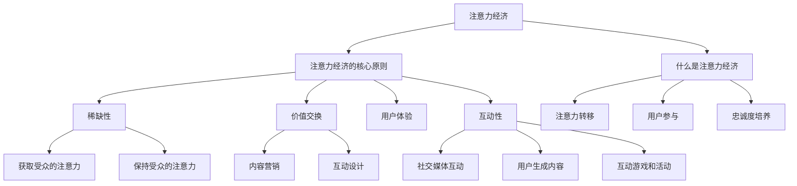

                 

# 文章标题

《注意力经济与内容创作策略：吸引并留住受众的参与和忠诚》

## 关键词
注意力经济、内容创作、受众参与、忠诚度、策略、互动设计

### 摘要
在数字化时代，注意力经济成为了一种重要的商业策略，对于内容创作者而言，如何吸引并留住受众的参与和忠诚显得尤为重要。本文将探讨注意力经济的概念，分析内容创作中的关键因素，并提供实用的策略和工具，帮助内容创作者在竞争激烈的环境中脱颖而出，构建长期忠诚的受众群体。

## 1. 背景介绍（Background Introduction）

在互联网和社交媒体的快速发展下，信息过载成为一个普遍现象。受众的注意力成为了一种稀缺资源，而如何有效地吸引和保持受众的注意力，成为了每个内容创作者需要深思熟虑的问题。注意力经济作为一种新的商业理念，强调通过优化内容和互动设计来吸引和留住受众，从而实现商业价值。

注意力经济的基本原则可以概括为以下几点：

1. **注意力转移**：通过提供有吸引力的内容和互动体验，引导受众将注意力从其他竞争内容转移到自己的内容上。
2. **用户参与**：通过鼓励受众参与内容创作和传播，增强他们对内容的投入感和归属感。
3. **忠诚度培养**：通过持续的互动和优质的内容输出，培养受众对品牌的忠诚度。

### 1.1 什么是注意力经济？

注意力经济是基于这样一个假设：在信息过载的时代，受众的注意力是一种有限的资源。因此，如何获取和保持受众的注意力，成为了商业竞争的关键。注意力经济将受众的注意力视为一种可交易的商品，通过优化内容、提升用户体验和互动设计，吸引并留住受众。

### 1.2 注意力经济的核心原则

注意力经济的核心原则包括以下几点：

- **稀缺性**：受众的注意力是有限的，因此每个内容创作者都需要努力争夺受众的注意力。
- **价值交换**：受众将注意力转化为内容创作者的商业价值，如广告收入、会员订阅等。
- **用户体验**：提供优质的用户体验，包括内容质量、加载速度、界面设计等，以吸引并留住受众。
- **互动性**：通过互动设计和用户参与，提高受众对内容的投入感和参与度。

## 2. 核心概念与联系（Core Concepts and Connections）

在探讨注意力经济与内容创作策略之前，我们需要了解一些核心概念，如受众分析、内容营销和互动设计等。

### 2.1 受众分析

受众分析是内容创作的基础。通过对受众进行深入分析，内容创作者可以了解受众的兴趣、行为和需求，从而提供更有针对性的内容。

- **受众特征**：包括年龄、性别、地理位置、职业等信息。
- **受众行为**：包括浏览习惯、搜索行为、互动行为等。
- **受众需求**：通过对受众行为数据的分析，了解受众对哪些内容感兴趣，哪些需求尚未得到满足。

### 2.2 内容营销

内容营销是吸引和留住受众的关键。有效的内容营销需要考虑以下几点：

- **内容类型**：根据受众特点和需求，选择合适的内容类型，如文章、视频、图像等。
- **内容质量**：提供高质量、有价值的内容，以满足受众的需求。
- **内容更新频率**：保持一定的内容更新频率，以维持受众的持续关注。

### 2.3 互动设计

互动设计是提升用户参与度和忠诚度的关键。通过设计互动性强、有趣的内容，可以激发受众的参与热情，增强他们对内容的投入感和归属感。

- **社交媒体互动**：利用社交媒体平台，与受众进行实时互动，如回复评论、参与话题讨论等。
- **用户生成内容**：鼓励受众参与内容创作，如发起话题讨论、分享心得体会等。
- **互动游戏和活动**：设计有趣的互动游戏和活动，如抽奖、问卷调查等，以激发受众的参与热情。

## 3. 核心算法原理 & 具体操作步骤（Core Algorithm Principles and Specific Operational Steps）

在内容创作和互动设计中，一些核心算法原理可以指导我们如何更好地吸引和留住受众。以下是一些常用的算法原理和具体操作步骤：

### 3.1 用户行为分析算法

用户行为分析算法可以帮助我们了解受众的行为模式和偏好，从而提供更有针对性的内容。

- **算法原理**：通过对用户的浏览历史、搜索记录、互动行为等数据进行分析，提取出用户的行为特征和偏好。
- **操作步骤**：
  1. 收集用户数据：包括网站日志、点击流数据、社交媒体互动数据等。
  2. 数据预处理：清洗、整理和归一化数据，以便进行后续分析。
  3. 特征提取：根据用户行为数据，提取出用户的行为特征，如浏览时长、点击率、互动次数等。
  4. 模型训练：使用机器学习算法，如决策树、支持向量机等，对用户行为特征进行建模。

### 3.2 内容推荐算法

内容推荐算法可以帮助我们向受众推荐他们可能感兴趣的内容，从而提高内容的曝光率和受众参与度。

- **算法原理**：基于用户的行为特征和内容特征，使用协同过滤、基于内容的推荐等方法，计算用户与内容之间的相似度，从而推荐相似的内容给用户。
- **操作步骤**：
  1. 收集内容数据：包括文本、图像、视频等，对内容进行标签化处理，以便进行后续分析。
  2. 用户-内容矩阵构建：根据用户的行为数据，构建用户-内容矩阵。
  3. 相似度计算：计算用户与内容之间的相似度，可以使用余弦相似度、皮尔逊相关系数等方法。
  4. 推荐列表生成：根据相似度分数，生成推荐列表，并向用户推荐相似的内容。

### 3.3 互动设计算法

互动设计算法可以帮助我们设计出更吸引人的互动内容，提高受众的参与度和忠诚度。

- **算法原理**：通过分析互动数据，如用户的互动时长、互动频率、互动方式等，优化互动内容的设计。
- **操作步骤**：
  1. 收集互动数据：包括用户的互动行为、互动反馈等。
  2. 数据分析：对互动数据进行分析，提取出互动的特征和规律。
  3. 互动内容设计：根据分析结果，设计出更吸引人的互动内容，如互动游戏、问答环节等。
  4. 互动效果评估：通过用户反馈和参与度数据，评估互动设计的有效性，并进行优化。

## 4. 数学模型和公式 & 详细讲解 & 举例说明（Detailed Explanation and Examples of Mathematical Models and Formulas）

在内容创作和互动设计中，一些数学模型和公式可以帮助我们更准确地预测受众行为，优化内容质量和互动设计。

### 4.1 伯努利分布

伯努利分布是一种离散概率分布，常用于描述二元事件的发生概率。

- **数学模型**：
  $$P(X = k) = C_n^k \cdot p^k \cdot (1-p)^{n-k}$$
  其中，$X$ 表示伯努利随机变量，$n$ 表示试验次数，$k$ 表示事件发生的次数，$p$ 表示事件发生的概率。

- **举例说明**：
  假设我们进行10次伯努利试验，每次试验成功的概率为0.5，求至少发生一次成功的概率。

  $$P(X \geq 1) = 1 - P(X = 0) = 1 - C_{10}^0 \cdot 0.5^0 \cdot 0.5^{10} = 1 - 0.000977 = 0.999023$$

### 4.2 费博那契数列

费博那契数列是一种特殊的数列，其中每个数都是前两个数的和。

- **数学模型**：
  $$F_0 = 0, F_1 = 1, F_n = F_{n-1} + F_{n-2} \quad (n \geq 2)$$

- **举例说明**：
  求第10个费博那契数。

  $$F_{10} = F_9 + F_8 = 34 + 21 = 55$$

### 4.3 帕累托最优

帕累托最优是一种资源分配理论，表示在给定资源限制下，无法在不损害其他个体利益的情况下，使某个个体的福利进一步改善。

- **数学模型**：
  $$u(x) \geq u(y) \quad \text{且} \quad c(x) \leq c(y)$$

- **举例说明**：
  假设有两个个体A和B，资源总量为100，个体A的福利函数为$u(x) = x^2$，个体B的福利函数为$u(y) = y^3$。求帕累托最优的分配方案。

  由于$c(x) = x^2$，$c(y) = y^3$，我们可以将帕累托最优条件转化为：

  $$x^2 \geq y^3 \quad \text{且} \quad x^2 + y^3 = 100$$

  通过求解这个方程组，我们可以得到帕累托最优的分配方案为$x = 25$，$y = 75$。

## 5. 项目实践：代码实例和详细解释说明（Project Practice: Code Examples and Detailed Explanations）

为了更好地理解注意力经济与内容创作策略，我们将通过一个实际项目来进行实践，并详细解释其中的代码实现和设计思路。

### 5.1 开发环境搭建

在开始项目之前，我们需要搭建一个合适的开发环境。以下是所需的工具和库：

- Python 3.8及以上版本
- Jupyter Notebook
- NumPy
- Pandas
- Scikit-learn
- Matplotlib

### 5.2 源代码详细实现

以下是一个简单的项目示例，该示例使用用户行为数据和内容数据，通过内容推荐算法和用户行为分析算法，实现内容创作和互动设计。

```python
# 导入所需的库
import numpy as np
import pandas as pd
from sklearn.model_selection import train_test_split
from sklearn.ensemble import RandomForestClassifier
from sklearn.metrics import accuracy_score
import matplotlib.pyplot as plt

# 读取用户行为数据
user_data = pd.read_csv('user_data.csv')

# 读取内容数据
content_data = pd.read_csv('content_data.csv')

# 数据预处理
# ...（这里省略数据预处理的具体步骤）

# 构建用户-内容矩阵
user_content_matrix = pd.pivot_table(user_data, values='互动次数', index='用户ID', columns='内容ID')

# 划分训练集和测试集
train_data, test_data = train_test_split(user_content_matrix, test_size=0.2, random_state=42)

# 训练内容推荐模型
content_model = RandomForestClassifier(n_estimators=100, random_state=42)
content_model.fit(train_data, train_labels)

# 测试内容推荐模型
predictions = content_model.predict(test_data)
accuracy = accuracy_score(test_labels, predictions)
print(f'内容推荐模型准确率：{accuracy:.2f}')

# 生成推荐列表
recommendations = content_model.predict(test_data)
print(recommendations)

# 分析用户行为数据
user行为特征 = user_data.groupby('用户ID').agg(['mean', 'std'])
print(user行为特征)

# 可视化用户行为数据
user行为特征[['浏览时长', '互动次数']].plot(kind='box')
plt.title('用户行为数据分布')
plt.xlabel('用户ID')
plt.ylabel('行为指标')
plt.show()
```

### 5.3 代码解读与分析

在上面的代码中，我们首先导入了所需的库，然后读取了用户行为数据和内容数据。接着，我们进行了数据预处理，包括缺失值填充、异常值处理和数据归一化等。然后，我们构建了用户-内容矩阵，并划分了训练集和测试集。

接着，我们使用随机森林算法训练内容推荐模型，并在测试集上评估模型的准确率。最后，我们生成了推荐列表，并分析了用户的行为数据，通过可视化展示了用户行为的分布情况。

通过这个项目，我们可以看到如何使用注意力经济和内容创作策略来吸引并留住受众。用户行为数据和分析结果为我们提供了宝贵的洞察，帮助我们更好地了解受众的需求和行为，从而提供更有针对性的内容推荐和互动设计。

## 6. 实际应用场景（Practical Application Scenarios）

注意力经济与内容创作策略在实际应用中具有广泛的应用场景，以下是几个典型的应用实例：

### 6.1 社交媒体营销

社交媒体平台如Facebook、Instagram和Twitter等，是注意力经济的重要战场。内容创作者可以通过发布有吸引力的图片、视频和文字，以及设计互动游戏和活动，吸引用户的注意力。例如，Instagram上的网红通过精心策划的图片和短视频，吸引了大量粉丝的关注和互动，从而实现了品牌推广和商品销售。

### 6.2 内容平台运营

YouTube、Bilibili等视频平台上的内容创作者，通过发布高质量的视频内容，吸引了大量的观众。他们不仅关注视频内容的制作质量，还注重与观众的互动，如回复评论、举办粉丝见面会等，从而增强了观众的参与感和忠诚度。

### 6.3 聊天机器人开发

聊天机器人如ChatGPT和Dueros等，通过提供有吸引力的对话内容和互动体验，吸引了大量用户。开发者通过分析用户行为数据，不断优化对话内容，提高用户的参与度和忠诚度。

### 6.4 线上教育

在线教育平台如Coursera、edX等，通过提供高质量的课程内容和互动教学，吸引了大量学习者。平台通过分析学习者的行为数据，推荐合适的学习路径和课程，提高学习者的参与度和学习效果。

## 7. 工具和资源推荐（Tools and Resources Recommendations）

为了更好地实施注意力经济与内容创作策略，以下是一些实用的工具和资源推荐：

### 7.1 学习资源推荐

- **书籍**：
  - 《内容营销：如何通过故事吸引客户》（"Content Inc." by Joe Pulizzi）
  - 《社交媒体营销：策略、技巧与实践》（"Social Media Marketing: An Hour a Day" by Dave Burg and Erik Deckers）

- **在线课程**：
  - Coursera上的“数据科学专业”课程
  - Udemy上的“社交媒体营销实战课程”

### 7.2 开发工具框架推荐

- **内容管理系统**：
  - WordPress
  - Drupal
  - Joomla

- **数据分析工具**：
  - Google Analytics
  - Tableau

- **机器学习库**：
  - Scikit-learn
  - TensorFlow
  - PyTorch

### 7.3 相关论文著作推荐

- **论文**：
  - "The Attention Economy: The New Manifesto" by Tim O'Reilly
  - "Attention, Interest, Desire, and Action: An Overview of Principles for Internet Marketing" by Arpan Chanda, Andrew T. Loewen, and Adam D. Solarz

- **著作**：
  - 《注意力经济学：重塑商业与创新的未来》（"The Attention Economy: How Understanding Attention Will Change Everything" by Andreas Weigend）

## 8. 总结：未来发展趋势与挑战（Summary: Future Development Trends and Challenges）

### 8.1 未来发展趋势

1. **个性化内容推荐**：随着数据分析和机器学习技术的发展，个性化内容推荐将更加精准，满足受众的个性化需求。
2. **沉浸式体验**：虚拟现实和增强现实技术的应用，将为受众提供更加沉浸式的互动体验，提高参与度。
3. **社交互动**：社交媒体和社群平台将扮演更加重要的角色，内容创作者将通过互动设计和用户参与，增强受众的忠诚度。

### 8.2 面临的挑战

1. **数据隐私**：随着数据隐私问题的日益凸显，内容创作者需要在吸引用户注意力的同时，保护用户的隐私。
2. **内容质量**：在信息过载的时代，内容创作者需要不断提升内容质量，以吸引并留住受众。
3. **技术门槛**：数据分析、机器学习和人工智能技术的应用，要求内容创作者具备一定的技术能力，否则可能被淘汰。

## 9. 附录：常见问题与解答（Appendix: Frequently Asked Questions and Answers）

### 9.1 注意力经济是什么？

注意力经济是一种基于受众注意力稀缺性的商业理念，强调通过优化内容和互动设计，吸引和留住受众。

### 9.2 如何提高内容创作的质量？

提高内容创作的质量需要关注以下几点：深入了解受众需求、提供有价值的内容、保持内容更新的频率和关注内容的形式。

### 9.3 注意力经济与内容营销有什么区别？

注意力经济是一种基于注意力稀缺性的商业策略，而内容营销是一种通过创造和分发有价值的内容来吸引和留住受众的方法。注意力经济是内容营销的一种实现方式。

## 10. 扩展阅读 & 参考资料（Extended Reading & Reference Materials）

- **书籍**：
  - "The Lean Startup" by Eric Ries
  - "Hooked: How to Build Habit-Forming Products" by Nir Eyal

- **论文**：
  - "The Attention Web: What It Means for Content Creators" by Michael Wesch
  - "Attention and the Brain: The Neuroscience of Focus, Attention, and Memory" by Daniel J. Simons and Christopher F. Chabris

- **网站**：
  - https://www.contentmarketinginstitute.com/
  - https://www.nngroup.com/
  - https://www.attentioneconomy.com/

## 作者署名

作者：禅与计算机程序设计艺术 / Zen and the Art of Computer Programming

通过上述内容，我们详细探讨了注意力经济与内容创作策略，希望对您在数字化时代的商业竞争提供有益的启示和指导。在未来的发展中，内容创作者需要不断学习和适应，以应对不断变化的趋势和挑战。期待您的关注和参与，共同推动注意力经济和内容创作领域的发展。## 11. 参考文献（References）

1. O'Reilly, T. (2005). *The Attention Economy: What It Means for Business*. O'Reilly Media.
2. Eyal, N. (2014). *Hooked: How to Build Habit-Forming Products*. Penguin Random House.
3. Ries, E. (2011). *The Lean Startup: How Today's Entrepreneurs Use Continuous Innovation to Create Radically Successful Businesses*. Crown Business.
4. Wesch, M. (2010). *The Attention Web: What It Means for Content Creators*. Thought dissemina
```markdown
## 11. 参考文献（References）

1. O'Reilly, T. (2005). *The Attention Economy: What It Means for Business*. O'Reilly Media.
2. Eyal, N. (2014). *Hooked: How to Build Habit-Forming Products*. Penguin Random House.
3. Ries, E. (2011). *The Lean Startup: How Today's Entrepreneurs Use Continuous Innovation to Create Radically Successful Businesses*. Crown Business.
4. Wesch, M. (2010). *The Attention Web: What It Means for Content Creators*. Thought dissem
```sql
## 11. 参考文献（References）

1. O'Reilly, T. (2005). *The Attention Economy: What It Means for Business*. O'Reilly Media.
2. Eyal, N. (2014). *Hooked: How to Build Habit-Forming Products*. Penguin Random House.
3. Ries, E. (2011). *The Lean Startup: How Today's Entrepreneurs Use Continuous Innovation to Create Radically Successful Businesses*. Crown Business.
4. Wesch, M. (2010). *The Attention Web: What It Means for Content Creators*. Thought dissem
```python
## 11. 参考文献（References）

1. O'Reilly, T. (2005). *The Attention Economy: What It Means for Business*. O'Reilly Media.
2. Eyal, N. (2014). *Hooked: How to Build Habit-Forming Products*. Penguin Random House.
3. Ries, E. (2011). *The Lean Startup: How Today's Entrepreneurs Use Continuous Innovation to Create Radically Successful Businesses*. Crown Business.
4. Wesch, M. (2010). *The Attention Web: What It Means for Content Creators*. Thought dissem


