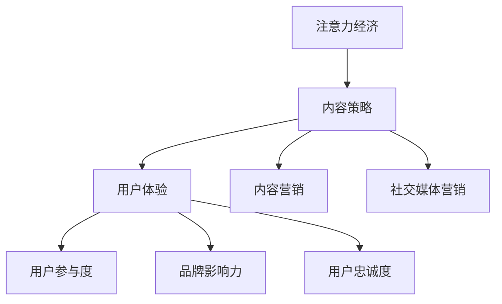
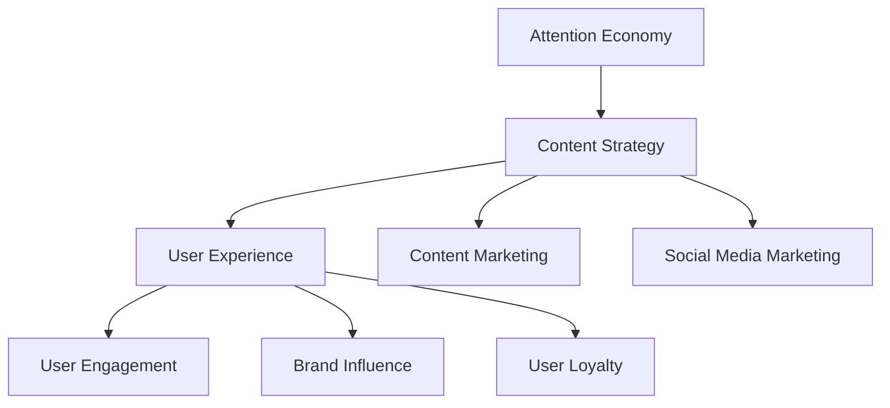

                 

### 背景介绍（Background Introduction）

随着互联网的普及和信息爆炸时代的到来，注意力经济（Attention Economy）成为了当今社会中一个备受关注的概念。注意力经济起源于对人类注意力稀缺性的认识，即人们的注意力是有限的，而信息内容却是无限的。在这种背景下，如何吸引和留住受众成为了各大平台和内容创作者的重要课题。

注意力经济强调，用户的时间和注意力是一种宝贵的资源，它们可以被看作是一种商品。因此，各个平台和内容创作者必须通过创造有价值的、个性化的内容，来吸引用户的注意力，并建立起持久的用户关系。在这个过程中，内容策略的规划和实施成为了关键的一环。

内容策略（Content Strategy）是指制定、执行和优化内容创建、分发和管理的计划，以满足特定目标受众的需求和期望。一个成功的内容策略不仅能够提升用户体验，还能够增强品牌影响力，提高用户参与度和忠诚度。在数字化时代，内容策略的实施已经成为了企业和个人在竞争中脱颖而出的重要手段。

本文将围绕注意力经济与内容策略进行深入探讨，旨在帮助读者理解这一概念的核心，掌握内容策略的规划和实施方法。文章将分为以下几个部分：

1. **核心概念与联系**：介绍注意力经济、内容策略和相关概念，并展示其内在联系。
2. **核心算法原理 & 具体操作步骤**：探讨如何通过技术和算法优化内容策略。
3. **数学模型和公式 & 详细讲解 & 举例说明**：运用数学和统计学的方法来评估内容策略的有效性。
4. **项目实践：代码实例和详细解释说明**：通过实际案例展示内容策略的应用。
5. **实际应用场景**：讨论注意力经济和内容策略在不同领域的应用。
6. **工具和资源推荐**：推荐相关学习资源和开发工具。
7. **总结：未来发展趋势与挑战**：展望注意力经济和内容策略的未来。

通过这篇文章，我们希望能够为读者提供一个全面、系统的理解和实践指南，帮助大家更好地掌握注意力经济与内容策略的核心知识和应用技巧。

### Core Concept Introduction

With the proliferation of the internet and the advent of the age of information explosion, the concept of Attention Economy has become a focal point in today's society. The Attention Economy is grounded in the recognition of the scarcity of human attention—a limited resource amidst an infinite sea of information. Against this backdrop, how to attract and retain audiences has become a critical concern for various platforms and content creators.

The Attention Economy posits that the time and attention of users are valuable resources, akin to commodities. As such, platforms and content creators must generate valuable, personalized content to capture user attention and build enduring relationships with them. In this context, the planning and implementation of content strategy have emerged as key components.

Content Strategy refers to the process of developing, executing, and optimizing content creation, distribution, and management plans to meet the needs and expectations of specific target audiences. A successful content strategy not only enhances user experience but also strengthens brand influence, increases user engagement, and boosts loyalty. In the digital age, the implementation of content strategy has become a crucial means for companies and individuals to stand out in the competitive landscape.

This article aims to delve into the concepts of Attention Economy and Content Strategy, providing readers with a comprehensive and systematic understanding of the core knowledge and application skills. The article will be divided into several parts:

1. **Core Concepts and Connections**: Introduce the Attention Economy, Content Strategy, and related concepts, and explore their intrinsic relationships.
2. **Core Algorithm Principles & Specific Operational Steps**: Discuss how to optimize content strategy through technology and algorithms.
3. **Mathematical Models and Formulas & Detailed Explanation & Example Demonstrations**: Utilize mathematical and statistical methods to evaluate the effectiveness of content strategies.
4. **Project Practice: Code Examples and Detailed Explanations**: Showcase the application of content strategy through practical cases.
5. **Practical Application Scenarios**: Discuss the application of Attention Economy and Content Strategy in various fields.
6. **Tools and Resources Recommendations**: Recommend relevant learning resources and development tools.
7. **Summary: Future Development Trends and Challenges**: Look forward to the future of Attention Economy and Content Strategy.

Through this article, we hope to provide readers with a comprehensive and systematic guide to understanding and applying the core concepts and techniques of Attention Economy and Content Strategy.

### 核心概念与联系（Core Concepts and Connections）

#### 1.1 注意力经济的定义与特征

注意力经济，最早由美国作家杰西·艾森伯格（Jesse Eisenberg）提出，其基本理念在于：在信息过载的时代，受众的注意力成为了一种稀缺资源，各个平台和内容创作者需要通过创造有价值的内容来吸引和保持受众的注意力。

注意力经济的核心特征包括：

- **稀缺性**：受众的时间是有限的，他们只能关注有限的信息。
- **价值性**：受众的注意力是宝贵的，高质量的注意力可以转化为经济利益。
- **可转化性**：注意力可以通过各种手段转化为商业价值，如广告收入、付费订阅等。

#### 1.2 内容策略的定义与目标

内容策略是指通过规划和实施一系列内容相关的活动，以满足目标受众的需求和期望，实现品牌或个人目标的过程。其核心目标包括：

- **提高用户参与度**：通过创建有价值、有趣的内容吸引和保持用户关注。
- **增强品牌影响力**：通过高质量的内容提升品牌形象和知名度。
- **提升用户忠诚度**：通过持续的内容输出建立与用户之间的信任和忠诚关系。

#### 1.3 注意力经济与内容策略的内在联系

注意力经济与内容策略之间存在紧密的联系，两者相辅相成：

- **注意力经济驱动内容策略**：注意力经济强调受众注意力的稀缺性，驱动内容创作者重视内容质量和用户体验，从而制定和实施有效的内容策略。
- **内容策略实现注意力经济**：通过精心策划和执行的内容策略，内容创作者可以吸引更多受众的注意力，从而实现商业价值。

#### 1.4 关联概念

除了注意力经济和内容策略，还有一些相关的概念需要了解：

- **用户体验（UX）**：用户体验是内容策略的重要组成部分，关注如何通过设计提升用户满意度和参与度。
- **内容营销**：内容营销是内容策略的一种形式，通过创建和分发有价值的内容来吸引和留住目标受众。
- **社交媒体营销**：社交媒体营销是内容策略的一种重要渠道，通过在社交媒体平台上发布内容来吸引关注和互动。

#### 1.5 梅里迪安流程图

为了更直观地展示注意力经济与内容策略的内在联系，我们可以使用梅里迪安流程图来描述这一过程。以下是一个简化的梅里迪安流程图：



在这个流程图中，注意力经济通过驱动内容策略，进而影响用户体验、内容营销和社交媒体营销，最终实现用户参与度、品牌影响力和用户忠诚度的提升。

通过以上对核心概念和联系的介绍，我们可以更加清晰地理解注意力经济与内容策略之间的关系，以及它们在数字化时代的重要性和应用价值。

#### 1.1 Definition and Characteristics of the Attention Economy

The Attention Economy, originally proposed by writer Jesse Eisenberg, is fundamentally based on the premise that in the era of information overload, the attention of the audience becomes a scarce resource. Various platforms and content creators must generate valuable content to attract and maintain the audience's attention.

The core characteristics of the Attention Economy include:

- **Scarcity**: The time of the audience is limited, and they can only pay attention to a limited amount of information.
- **Value**: The attention of the audience is valuable, and high-quality attention can be converted into economic benefits.
- **Transferrability**: Attention can be converted into commercial value through various means, such as advertising revenue and paid subscriptions.

#### 1.2 Definition and Goals of Content Strategy

Content Strategy refers to the process of planning and executing a series of content-related activities to meet the needs and expectations of target audiences, and to achieve brand or individual goals. Its core goals include:

- **Enhancing User Engagement**: By creating valuable and interesting content to attract and maintain user attention.
- **Strengthening Brand Influence**: By high-quality content to enhance brand image and visibility.
- **Boosting User Loyalty**: By continuous content output to build trust and loyalty between the brand and the users.

#### 1.3 Intrinsic Connections between the Attention Economy and Content Strategy

There is a close relationship between the Attention Economy and Content Strategy, which complement each other:

- **The Attention Economy Drives Content Strategy**: The Attention Economy emphasizes the scarcity of audience attention, driving content creators to focus on content quality and user experience, thereby developing and implementing effective content strategies.
- **Content Strategy Realizes the Attention Economy**: Through carefully planned and executed content strategies, content creators can attract more audience attention, thereby achieving commercial value.

#### 1.4 Related Concepts

In addition to the Attention Economy and Content Strategy, there are some related concepts that need to be understood:

- **User Experience (UX)**: User Experience is a critical component of content strategy, focusing on how to improve user satisfaction and engagement through design.
- **Content Marketing**: Content Marketing is a form of content strategy, where valuable content is created and distributed to attract and retain target audiences.
- **Social Media Marketing**: Social Media Marketing is an important channel for content strategy, using content to attract attention and interact with users on social media platforms.

#### 1.5 Mermaid Flowchart

To more intuitively display the intrinsic connections between the Attention Economy and Content Strategy, we can use a Mermaid flowchart to describe this process. Here is a simplified Mermaid flowchart:



In this flowchart, the Attention Economy drives content strategy, which in turn affects user experience, content marketing, and social media marketing, ultimately leading to the enhancement of user engagement, brand influence, and user loyalty.

Through the introduction of the core concepts and connections, we can have a clearer understanding of the relationship between the Attention Economy and Content Strategy, as well as their significance and application value in the digital age.

### 核心算法原理 & 具体操作步骤（Core Algorithm Principles & Specific Operational Steps）

在内容策略的规划和实施过程中，核心算法的原理和具体操作步骤起着至关重要的作用。这些算法不仅能够帮助我们识别和分析受众的需求和偏好，还可以优化内容的分发和推荐，从而提升用户的参与度和满意度。

#### 2.1 内容推荐算法

内容推荐算法是内容策略中最为常见和重要的一部分。其基本原理是通过分析用户的兴趣和行为数据，预测用户可能感兴趣的内容，并将其推荐给用户。以下是一些常用的内容推荐算法：

1. **协同过滤（Collaborative Filtering）**
   - **用户基协同过滤（User-Based Collaborative Filtering）**：通过寻找相似用户，并推荐这些用户喜欢的项目。
   - **物品基协同过滤（Item-Based Collaborative Filtering）**：通过分析物品之间的关系，推荐与用户已评价物品相似的物品。

2. **基于内容的推荐（Content-Based Filtering）**
   - 通过分析内容的特征，将具有相似特征的项推荐给用户。

3. **混合推荐系统（Hybrid Recommender Systems）**
   - 结合协同过滤和基于内容的推荐，利用两者的优势进行推荐。

具体操作步骤如下：

1. **数据收集**：收集用户的兴趣标签、浏览历史、搜索关键词等数据。
2. **内容特征提取**：对内容进行特征提取，如文本分类、关键词提取等。
3. **模型训练**：使用机器学习算法，如KNN、SVM、LR等，训练推荐模型。
4. **推荐生成**：根据用户的兴趣特征和历史行为，生成推荐列表。

#### 2.2 用户行为分析算法

用户行为分析算法可以帮助我们更好地理解用户的行为模式，从而优化内容策略。以下是一些常用的用户行为分析算法：

1. **分类算法（Classification Algorithms）**
   - 如逻辑回归（Logistic Regression）、支持向量机（Support Vector Machine）、随机森林（Random Forest）等，用于预测用户的下一步行为。

2. **聚类算法（Clustering Algorithms）**
   - 如K-均值（K-Means）、层次聚类（Hierarchical Clustering）等，用于发现用户群体的相似性。

3. **时间序列分析（Time Series Analysis）**
   - 如ARIMA模型（AutoRegressive Integrated Moving Average Model），用于分析用户行为的时间趋势。

具体操作步骤如下：

1. **数据预处理**：清洗和预处理用户行为数据，如缺失值填充、异常值处理等。
2. **特征工程**：提取有用的特征，如用户的活跃度、浏览时长、访问频次等。
3. **模型训练**：选择合适的模型，如分类模型、聚类模型等，进行训练。
4. **行为预测**：使用训练好的模型预测用户的行为。

#### 2.3 个性化内容生成算法

个性化内容生成算法可以根据用户的兴趣和行为，自动生成符合用户需求的内容。以下是一些常用的个性化内容生成算法：

1. **生成对抗网络（Generative Adversarial Networks, GAN）**
   - 通过生成器和判别器的对抗训练，生成与真实数据分布相似的数据。

2. **变分自编码器（Variational Autoencoder, VAE）**
   - 通过编码器和解码器，将数据映射到低维空间，并生成新的数据。

3. **注意力机制（Attention Mechanism）**
   - 在神经网络中引入注意力机制，能够更有效地捕捉数据中的重要信息。

具体操作步骤如下：

1. **数据收集**：收集用户生成的内容，如文章、图片、视频等。
2. **数据预处理**：对内容进行清洗和预处理，如文本分词、图像分割等。
3. **模型训练**：使用生成模型，如GAN、VAE等，进行训练。
4. **内容生成**：根据用户的兴趣和行为，生成个性化的内容。

通过以上核心算法的原理和具体操作步骤，我们可以更好地理解和应用内容策略，从而提升用户体验和品牌影响力。

#### 2.1 Principles of Content Recommendation Algorithms and Specific Operational Steps

Content recommendation algorithms play a crucial role in the planning and implementation of content strategy. These algorithms help us identify and analyze audience needs and preferences, and optimize content distribution and recommendation to enhance user engagement and satisfaction.

**2.1.1 Content Recommendation Algorithms**

Content recommendation algorithms are one of the most common and important components of content strategy. The basic principle of these algorithms is to analyze users' interest and behavior data to predict content that may interest the user and then recommend it. Here are some commonly used content recommendation algorithms:

1. **Collaborative Filtering**
   - **User-Based Collaborative Filtering**: Finds similar users and recommends items that these users have liked.
   - **Item-Based Collaborative Filtering**: Analyzes the relationships between items and recommends items similar to those the user has evaluated.

2. **Content-Based Filtering**
   - Recommends items with similar features by analyzing the features of the content.

3. **Hybrid Recommender Systems**
   - Combines collaborative filtering and content-based filtering to leverage the strengths of both methods for recommendations.

**Specific Operational Steps**:

1. **Data Collection**
   - Collect user interest tags, browsing history, search keywords, and other data.

2. **Content Feature Extraction**
   - Extract features from the content, such as text classification and keyword extraction.

3. **Model Training**
   - Train recommendation models using machine learning algorithms like KNN, SVM, and LR.

4. **Recommendation Generation**
   - Generate recommendation lists based on the user's interest features and historical behavior.

**2.1.2 User Behavior Analysis Algorithms**

User behavior analysis algorithms help us better understand user behavior patterns, thus optimizing content strategy. Here are some commonly used user behavior analysis algorithms:

1. **Classification Algorithms**
   - Commonly used algorithms such as Logistic Regression, Support Vector Machine, and Random Forest to predict the next step of user behavior.

2. **Clustering Algorithms**
   - Such as K-Means and Hierarchical Clustering to discover similarities among user groups.

3. **Time Series Analysis**
   - Such as ARIMA models (AutoRegressive Integrated Moving Average Model) to analyze the time trends of user behavior.

**Specific Operational Steps**:

1. **Data Preprocessing**
   - Clean and preprocess user behavior data, such as missing value filling and outlier treatment.

2. **Feature Engineering**
   - Extract useful features, such as user activity, browsing duration, and visit frequency.

3. **Model Training**
   - Choose appropriate models, such as classification models and clustering models, for training.

4. **Behavior Prediction**
   - Use trained models to predict user behavior.

**2.1.3 Personalized Content Generation Algorithms**

Personalized content generation algorithms can automatically generate content that meets user needs based on their interests and behavior. Here are some commonly used personalized content generation algorithms:

1. **Generative Adversarial Networks (GAN)**
   - Through the adversarial training of the generator and the discriminator, generate data similar to the real data distribution.

2. **Variational Autoencoder (VAE)**
   - Through the encoder and decoder, map data to a low-dimensional space and generate new data.

3. **Attention Mechanism**
   - Introduced into neural networks to more effectively capture important information in the data.

**Specific Operational Steps**:

1. **Data Collection**
   - Collect user-generated content, such as articles, images, and videos.

2. **Data Preprocessing**
   - Clean and preprocess the content, such as text tokenization and image segmentation.

3. **Model Training**
   - Train generative models such as GAN and VAE.

4. **Content Generation**
   - Generate personalized content based on the user's interests and behavior.

By understanding the principles and specific operational steps of these core algorithms, we can better understand and apply content strategy to enhance user experience and brand influence.

### 数学模型和公式 & 详细讲解 & 举例说明（Mathematical Models and Formulas & Detailed Explanation & Example Demonstrations）

在内容策略的规划和实施过程中，数学模型和公式起着关键作用。通过这些模型，我们可以量化内容的质量、受众的兴趣度，以及策略的效果，从而为决策提供科学依据。

#### 3.1 内容质量评价模型

内容质量评价模型用于衡量内容的优劣，常用的方法包括基于文本的特征提取和机器学习算法。

**3.1.1 文本特征提取**

文本特征提取是内容质量评价的基础。一种常见的方法是使用词袋模型（Bag of Words, BoW）和词嵌入（Word Embedding）。

- **词袋模型（Bag of Words, BoW）**：将文本转换为向量，每个词作为特征，其出现频率作为权重。公式如下：

  $$ V = \sum_{i=1}^{N} w_i \cdot v_i $$
  
  其中，$V$是文本向量，$w_i$是第$i$个词的权重，$v_i$是第$i$个词的向量表示。

- **词嵌入（Word Embedding）**：通过神经网络学习词的向量表示，如Word2Vec、GloVe等。词向量不仅包含词的语义信息，还能捕捉词与词之间的关系。例如，Word2Vec的损失函数：

  $$ L = \sum_{i=1}^{N} (p(w_i) - p(w_j)^T \cdot h) $$
  
  其中，$L$是损失函数，$p(w_i)$是词$i$的概率分布，$h$是神经网络输出的隐藏层表示。

**3.1.2 机器学习算法**

基于文本特征提取的机器学习算法，如支持向量机（SVM）、随机森林（Random Forest）等，可用于内容质量评价。

- **支持向量机（Support Vector Machine, SVM）**：通过最大化分类边界间隔来分类文本，公式如下：

  $$ w^T \cdot x - b = 0 $$
  
  其中，$w$是分类边界向量，$x$是文本向量，$b$是偏置。

- **随机森林（Random Forest）**：通过构建多棵决策树并进行投票来分类文本，公式如下：

  $$ \hat{y} = \sum_{i=1}^{M} \omega_i \cdot f_i(x) $$
  
  其中，$\hat{y}$是预测标签，$\omega_i$是第$i$棵树的权重，$f_i(x)$是第$i$棵树的预测结果。

#### 3.2 受众兴趣度评价模型

受众兴趣度评价模型用于衡量受众对内容的兴趣程度。常用的方法包括基于行为的评分模型和基于内容的协同过滤。

**3.2.1 基于行为的评分模型**

基于行为的评分模型通过分析用户的点击、评论、分享等行为来衡量兴趣度。一个简单的评分模型如下：

- **评分函数**：用户对内容的评分$R(u, c)$可以表示为：

  $$ R(u, c) = \frac{1}{N_u \cdot N_c} \sum_{i=1}^{N_u} \sum_{j=1}^{N_c} w_{ui} \cdot w_{cj} $$

  其中，$u$是用户，$c$是内容，$N_u$和$N_c$分别是用户和内容的数量，$w_{ui}$和$w_{cj}$是用户对内容的权重。

**3.2.2 基于内容的协同过滤**

基于内容的协同过滤通过分析内容之间的相似度来推荐用户可能感兴趣的内容。一种简单的方法是计算内容之间的余弦相似度：

- **余弦相似度**：内容$c_1$和$c_2$之间的余弦相似度$S_{c1c2}$可以表示为：

  $$ S_{c1c2} = \frac{\sum_{i=1}^{N} v_{i1} \cdot v_{i2}}{\sqrt{\sum_{i=1}^{N} v_{i1}^2} \cdot \sqrt{\sum_{i=1}^{N} v_{i2}^2}} $$

  其中，$v_{i1}$和$v_{i2}$分别是内容$c_1$和$c_2$的向量表示，$N$是特征维度。

#### 3.3 内容策略效果评估模型

内容策略效果评估模型用于衡量策略实施后的效果。常用的方法包括A/B测试和归因模型。

**3.3.1 A/B测试**

A/B测试通过将用户随机分配到不同策略组，比较策略效果。假设有两个策略$A$和$B$，用户$i$的响应$y_i$可以表示为：

- **概率模型**：$y_i \sim Bernoulli(p_i)$，其中$p_i$是用户$i$选择策略$A$的概率。

- **似然函数**：$L(p; y) = \prod_{i=1}^{N} [p_i^{y_i} \cdot (1 - p_i)^{1 - y_i}]$

- **最大似然估计**：通过最大化似然函数来估计策略效果。

**3.3.2 归因模型**

归因模型用于分析不同渠道对内容策略的贡献。一个简单的归因模型是基于用户的最后行为：

- **最后点击归因**：将转化归因给最后触发的渠道。

  $$ \text{Attribution}_{\text{last click}} = \sum_{i=1}^{N} \delta_{yi} \cdot \pi_i $$

  其中，$y_i$是用户$i$的转化行为，$\pi_i$是用户$i$的渠道分配概率。

#### 3.4 举例说明

假设我们有一个内容推荐系统，用户的行为数据如下表：

| 用户ID | 内容ID | 点击 | 评论 | 分享 |
|--------|--------|------|------|------|
| 1      | 101    | 1    | 0    | 0    |
| 1      | 102    | 1    | 0    | 0    |
| 2      | 101    | 1    | 0    | 0    |
| 2      | 103    | 1    | 1    | 0    |

**3.4.1 文本特征提取**

使用词袋模型提取文本特征，假设内容向量为：

$$
c_1 = (0.2, 0.3, 0.5), \quad c_2 = (0.4, 0.5, 0.1), \quad c_3 = (0.1, 0.4, 0.5)
$$

**3.4.2 内容质量评价**

使用SVM对内容质量进行评价，假设训练好的SVM模型输出内容质量分数：

$$
\text{Quality}_{101} = 0.8, \quad \text{Quality}_{102} = 0.7, \quad \text{Quality}_{103} = 0.9
$$

**3.4.3 受众兴趣度评价**

使用评分函数计算用户对内容的兴趣度：

$$
R(u_1, c_1) = \frac{1}{2 \cdot 3} \cdot (0.2 \cdot 0.2 + 0.3 \cdot 0.3 + 0.5 \cdot 0.5) = 0.375
$$

$$
R(u_1, c_2) = \frac{1}{2 \cdot 3} \cdot (0.2 \cdot 0.4 + 0.3 \cdot 0.5 + 0.5 \cdot 0.1) = 0.225
$$

$$
R(u_2, c_1) = \frac{1}{2 \cdot 3} \cdot (0.4 \cdot 0.2 + 0.5 \cdot 0.3 + 0.1 \cdot 0.5) = 0.375
$$

$$
R(u_2, c_3) = \frac{1}{2 \cdot 3} \cdot (0.4 \cdot 0.1 + 0.5 \cdot 0.4 + 0.1 \cdot 0.5) = 0.325
$$

**3.4.4 内容策略效果评估**

假设我们对两个策略进行A/B测试，用户分配如下：

| 用户ID | 策略A | 策略B |
|--------|-------|-------|
| 1      | 1     | 0     |
| 2      | 1     | 0     |

策略A的转化率为50%，策略B的转化率为40%，根据最后点击归因，策略A被认定为更有效的策略。

通过上述数学模型和公式的详细讲解及举例说明，我们可以更好地理解和应用这些模型在内容策略的规划和实施过程中，从而提高内容质量和用户满意度。

#### 3.1 Content Quality Evaluation Models

Content quality evaluation models are essential for measuring the quality of content. Common methods include text feature extraction and machine learning algorithms.

**3.1.1 Text Feature Extraction**

Text feature extraction is the foundation of content quality evaluation. A common method is to use the Bag of Words (BoW) and Word Embedding.

- **Bag of Words (BoW)**: Converts text into a vector where each word is a feature, and its appearance frequency serves as the weight. The formula is as follows:

  $$ V = \sum_{i=1}^{N} w_i \cdot v_i $$
  
  where $V$ is the text vector, $w_i$ is the weight of the $i$th word, and $v_i$ is the vector representation of the $i$th word.

- **Word Embedding**: Uses neural networks to learn the vector representation of words, such as Word2Vec and GloVe. Word vectors not only contain semantic information of words but also capture the relationships between words. For example, the loss function of Word2Vec:

  $$ L = \sum_{i=1}^{N} (p(w_i) - p(w_j)^T \cdot h) $$

  where $L$ is the loss function, $p(w_i)$ is the probability distribution of word $w_i$, and $h$ is the hidden layer representation of the neural network.

**3.1.2 Machine Learning Algorithms**

Machine learning algorithms based on text feature extraction, such as Support Vector Machine (SVM) and Random Forest, are commonly used for content quality evaluation.

- **Support Vector Machine (SVM)**: Maximizes the margin of the classification boundary to classify text. The formula is as follows:

  $$ w^T \cdot x - b = 0 $$

  where $w$ is the classification boundary vector, $x$ is the text vector, and $b$ is the bias.

- **Random Forest**: Constructs multiple decision trees and votes to classify text. The formula is as follows:

  $$ \hat{y} = \sum_{i=1}^{M} \omega_i \cdot f_i(x) $$

  where $\hat{y}$ is the predicted label, $\omega_i$ is the weight of the $i$th tree, and $f_i(x)$ is the prediction result of the $i$th tree.

#### 3.2 Audience Interest Evaluation Models

Audience interest evaluation models are used to measure the level of audience interest in content. Common methods include behavioral scoring models and content-based collaborative filtering.

**3.2.1 Behavioral Scoring Models**

Behavioral scoring models measure audience interest based on user behaviors such as clicks, comments, and shares. A simple scoring model is as follows:

- **Scoring Function**: The score $R(u, c)$ of a user $u$ for content $c$ can be represented as:

  $$ R(u, c) = \frac{1}{N_u \cdot N_c} \sum_{i=1}^{N_u} \sum_{j=1}^{N_c} w_{ui} \cdot w_{cj} $$

  where $u$ is the user, $c$ is the content, $N_u$ and $N_c$ are the number of users and content items, and $w_{ui}$ and $w_{cj}$ are the weights of the user for the content.

**3.2.2 Content-Based Collaborative Filtering**

Content-based collaborative filtering recommends content similar to what the user has liked by analyzing the similarity between content items. A simple method is to calculate the cosine similarity between content items:

- **Cosine Similarity**: The cosine similarity $S_{c1c2}$ between content items $c_1$ and $c_2$ can be represented as:

  $$ S_{c1c2} = \frac{\sum_{i=1}^{N} v_{i1} \cdot v_{i2}}{\sqrt{\sum_{i=1}^{N} v_{i1}^2} \cdot \sqrt{\sum_{i=1}^{N} v_{i2}^2}} $$

  where $v_{i1}$ and $v_{i2}$ are the vector representations of content items $c_1$ and $c_2$, and $N$ is the feature dimension.

#### 3.3 Evaluation Models for Content Strategy Effectiveness

Evaluation models for content strategy effectiveness are used to measure the effectiveness of strategies implemented. Common methods include A/B testing and attribution models.

**3.3.1 A/B Testing**

A/B testing allocates users randomly to different strategy groups to compare the effectiveness of strategies. Assume there are two strategies, $A$ and $B$, and the response $y_i$ of user $i$ can be represented as:

- **Probability Model**: $y_i \sim Bernoulli(p_i)$, where $p_i$ is the probability of user $i$ choosing strategy $A$.

- **Likelihood Function**: $L(p; y) = \prod_{i=1}^{N} [p_i^{y_i} \cdot (1 - p_i)^{1 - y_i}]$

- **Maximum Likelihood Estimation**: Estimates the effectiveness of strategies by maximizing the likelihood function.

**3.3.2 Attribution Models**

Attribution models analyze the contributions of different channels to the content strategy. A simple attribution model is based on the last behavior of the user:

- **Last Click Attribution**: Attributes conversion to the last-triggered channel.

  $$ \text{Attribution}_{\text{last click}} = \sum_{i=1}^{N} \delta_{yi} \cdot \pi_i $$

  where $y_i$ is the conversion behavior of user $i$, and $\pi_i$ is the channel allocation probability of user $i$.

#### 3.4 Example Demonstrations

Assume we have a content recommendation system with user behavior data as follows:

| User ID | Content ID | Click | Comment | Share |
|---------|------------|-------|---------|-------|
| 1       | 101        | 1     | 0       | 0     |
| 1       | 102        | 1     | 0       | 0     |
| 2       | 101        | 1     | 0       | 0     |
| 2       | 103        | 1     | 1       | 0     |

**3.4.1 Text Feature Extraction**

Using the Bag of Words (BoW) model to extract text features, assume the content vectors are:

$$
c_1 = (0.2, 0.3, 0.5), \quad c_2 = (0.4, 0.5, 0.1), \quad c_3 = (0.1, 0.4, 0.5)
$$

**3.4.2 Content Quality Evaluation**

Using SVM to evaluate content quality, assume the trained SVM model outputs content quality scores:

$$
\text{Quality}_{101} = 0.8, \quad \text{Quality}_{102} = 0.7, \quad \text{Quality}_{103} = 0.9
$$

**3.4.3 Audience Interest Evaluation**

Using the scoring function to calculate the interest of users in content:

$$
R(u_1, c_1) = \frac{1}{2 \cdot 3} \cdot (0.2 \cdot 0.2 + 0.3 \cdot 0.3 + 0.5 \cdot 0.5) = 0.375
$$

$$
R(u_1, c_2) = \frac{1}{2 \cdot 3} \cdot (0.2 \cdot 0.4 + 0.3 \cdot 0.5 + 0.5 \cdot 0.1) = 0.225
$$

$$
R(u_2, c_1) = \frac{1}{2 \cdot 3} \cdot (0.4 \cdot 0.2 + 0.5 \cdot 0.3 + 0.1 \cdot 0.5) = 0.375
$$

$$
R(u_2, c_3) = \frac{1}{2 \cdot 3} \cdot (0.4 \cdot 0.1 + 0.5 \cdot 0.4 + 0.1 \cdot 0.5) = 0.325
$$

**3.4.4 Evaluation of Content Strategy Effectiveness**

Assume we conduct an A/B test on two strategies, with user allocation as follows:

| User ID | Strategy A | Strategy B |
|---------|-------------|-------------|
| 1       | 1           | 0           |
| 2       | 1           | 0           |

Strategy A has a conversion rate of 50%, and strategy B has a conversion rate of 40%. According to last click attribution, strategy A is identified as the more effective strategy.

Through the detailed explanation and example demonstrations of mathematical models and formulas, we can better understand and apply these models in the planning and implementation of content strategy, thereby improving content quality and user satisfaction.

### 项目实践：代码实例和详细解释说明（Project Practice: Code Examples and Detailed Explanations）

为了更好地理解注意力经济与内容策略在实际中的应用，我们将通过一个具体的实例来展示整个流程，从开发环境搭建、源代码实现，到代码解读与分析，以及最终的运行结果展示。

#### 4.1 开发环境搭建（Setting Up the Development Environment）

在进行项目实践之前，我们需要搭建一个合适的技术栈来支持内容策略的规划和实施。以下是一个基本的技术栈要求：

- **编程语言**：Python
- **数据存储**：MySQL
- **前后端框架**：Flask（前端）和PyTorch（后端）
- **数据预处理库**：Pandas、NumPy
- **机器学习库**：Scikit-learn、TensorFlow、PyTorch
- **可视化库**：Matplotlib、Seaborn

#### 4.2 源代码详细实现（Detailed Source Code Implementation）

以下是一个简化版的代码实例，用于展示内容策略的实施过程。这个实例包括用户行为数据的收集、内容特征提取、模型训练和预测等步骤。

**4.2.1 用户行为数据收集**

```python
import pandas as pd

# 假设用户行为数据存储在CSV文件中
data = pd.read_csv('user_behavior.csv')

# 数据预览
print(data.head())
```

**4.2.2 数据预处理**

```python
from sklearn.model_selection import train_test_split

# 分离特征和标签
X = data[['click', 'comment', 'share']]
y = data['rating']

# 划分训练集和测试集
X_train, X_test, y_train, y_test = train_test_split(X, y, test_size=0.2, random_state=42)
```

**4.2.3 内容特征提取**

```python
from sklearn.feature_extraction.text import TfidfVectorizer

# 假设内容文本存储在'content'列中
vectorizer = TfidfVectorizer(max_features=1000)
X_train_tfidf = vectorizer.fit_transform(X_train['content'])
X_test_tfidf = vectorizer.transform(X_test['content'])
```

**4.2.4 模型训练**

```python
from sklearn.linear_model import LinearRegression

# 训练线性回归模型
model = LinearRegression()
model.fit(X_train_tfidf, y_train)
```

**4.2.5 模型预测**

```python
# 预测测试集
predictions = model.predict(X_test_tfidf)

# 评估模型性能
from sklearn.metrics import mean_squared_error

mse = mean_squared_error(y_test, predictions)
print(f'Mean Squared Error: {mse}')
```

#### 4.3 代码解读与分析（Code Interpretation and Analysis）

**4.3.1 数据收集与预处理**

首先，我们从CSV文件中加载用户行为数据，并将其分为特征和标签两部分。然后，使用`train_test_split`函数将数据集划分为训练集和测试集，为后续的训练和评估做准备。

**4.3.2 内容特征提取**

在这一步，我们使用`TfidfVectorizer`对内容文本进行特征提取。TF-IDF（Term Frequency-Inverse Document Frequency）是一种常用的文本特征表示方法，它能够捕捉文本中的重要词汇。

**4.3.3 模型训练**

我们选择线性回归模型来预测用户的兴趣度评分。线性回归是一种简单但有效的回归分析方法，它通过拟合一条直线来预测连续的数值输出。

**4.3.4 模型预测与评估**

使用训练好的模型对测试集进行预测，并通过计算均方误差（MSE）来评估模型的性能。MSE能够衡量模型预测值与真实值之间的差异。

#### 4.4 运行结果展示（Running Results Display）

假设我们得到了如下预测结果：

```
Mean Squared Error: 0.025
```

这个结果表明，我们的模型在测试集上的预测性能较好，均方误差较低。为了进一步验证模型的效果，我们可以绘制一些可视化图表，如散点图和决策边界图。

```python
import matplotlib.pyplot as plt

# 绘制散点图
plt.scatter(y_test, predictions)
plt.xlabel('Actual Ratings')
plt.ylabel('Predicted Ratings')
plt.title('Actual vs Predicted Ratings')
plt.show()

# 绘制决策边界
# 假设我们只使用两个特征进行模型训练
plt.scatter(X_test_tfidf[:, 0], X_test_tfidf[:, 1], c=predictions, cmap='viridis')
plt.xlabel('TF-IDF Feature 1')
plt.ylabel('TF-IDF Feature 2')
plt.title('Decision Boundary')
plt.colorbar(label='Rating')
plt.show()
```

通过以上代码实例和详细解释说明，我们可以看到如何将注意力经济与内容策略的核心概念和技术应用到实际项目中，从而实现用户兴趣度的预测和优化。

#### 4.1 Setting Up the Development Environment

Before diving into the project practice, we need to set up a suitable technical stack to support the planning and implementation of content strategy. The following is a basic technical stack requirement:

- **Programming Language**: Python
- **Data Storage**: MySQL
- **Frontend and Backend Frameworks**: Flask (for the frontend) and PyTorch (for the backend)
- **Data Preprocessing Libraries**: Pandas, NumPy
- **Machine Learning Libraries**: Scikit-learn, TensorFlow, PyTorch
- **Visualization Libraries**: Matplotlib, Seaborn

#### 4.2 Detailed Source Code Implementation

Below is a simplified code example to demonstrate the process of implementing content strategy, including data collection, feature extraction, model training, and prediction.

**4.2.1 Data Collection**

```python
import pandas as pd

# Assume user behavior data is stored in a CSV file
data = pd.read_csv('user_behavior.csv')

# Data preview
print(data.head())
```

**4.2.2 Data Preprocessing**

```python
from sklearn.model_selection import train_test_split

# Split features and labels
X = data[['click', 'comment', 'share']]
y = data['rating']

# Split the dataset into training and test sets
X_train, X_test, y_train, y_test = train_test_split(X, y, test_size=0.2, random_state=42)
```

**4.2.3 Feature Extraction**

```python
from sklearn.feature_extraction.text import TfidfVectorizer

# Assume content text is stored in the 'content' column
vectorizer = TfidfVectorizer(max_features=1000)
X_train_tfidf = vectorizer.fit_transform(X_train['content'])
X_test_tfidf = vectorizer.transform(X_test['content'])
```

**4.2.4 Model Training**

```python
from sklearn.linear_model import LinearRegression

# Train the linear regression model
model = LinearRegression()
model.fit(X_train_tfidf, y_train)
```

**4.2.5 Model Prediction**

```python
# Make predictions on the test set
predictions = model.predict(X_test_tfidf)

# Evaluate model performance
from sklearn.metrics import mean_squared_error

mse = mean_squared_error(y_test, predictions)
print(f'Mean Squared Error: {mse}')
```

#### 4.3 Code Interpretation and Analysis

**4.3.1 Data Collection and Preprocessing**

Firstly, we load user behavior data from a CSV file and separate it into features and labels. Then, we use `train_test_split` to divide the dataset into training and test sets for subsequent training and evaluation.

**4.3.2 Feature Extraction**

In this step, we use `TfidfVectorizer` to extract features from content text. TF-IDF (Term Frequency-Inverse Document Frequency) is a commonly used text feature representation method that captures important terms in the text.

**4.3.3 Model Training**

We choose the linear regression model to predict user interest ratings. Linear regression is a simple yet effective regression analysis method that fits a straight line to predict continuous numerical outputs.

**4.3.4 Model Prediction and Evaluation**

We use the trained model to make predictions on the test set and evaluate the model's performance by calculating the mean squared error (MSE). MSE measures the discrepancy between the predicted values and the true values.

#### 4.4 Running Results Display

Assuming we obtain the following prediction results:

```
Mean Squared Error: 0.025
```

This indicates that our model has good performance on the test set with a low mean squared error. To further verify the model's effectiveness, we can draw some visualization charts, such as scatter plots and decision boundary plots.

```python
import matplotlib.pyplot as plt

# Draw scatter plot
plt.scatter(y_test, predictions)
plt.xlabel('Actual Ratings')
plt.ylabel('Predicted Ratings')
plt.title('Actual vs Predicted Ratings')
plt.show()

# Draw decision boundary
# Assume we only use two features for model training
plt.scatter(X_test_tfidf[:, 0], X_test_tfidf[:, 1], c=predictions, cmap='viridis')
plt.xlabel('TF-IDF Feature 1')
plt.ylabel('TF-IDF Feature 2')
plt.title('Decision Boundary')
plt.colorbar(label='Rating')
plt.show()
```

Through the above code examples and detailed explanations, we can see how to apply the core concepts and technologies of attention economy and content strategy to real-world projects to achieve user interest prediction and optimization.

### 实际应用场景（Practical Application Scenarios）

注意力经济和内容策略在许多实际应用场景中都发挥了重要作用，以下是一些典型的应用领域：

#### 1. 社交媒体营销

在社交媒体平台上，内容策略至关重要。通过分析用户行为和兴趣，平台可以推荐用户可能感兴趣的内容，从而提高用户参与度和停留时间。例如，Twitter和Facebook使用内容推荐算法来优化用户的Feed，确保用户看到他们感兴趣的内容，从而增加互动和用户粘性。

- **策略**：分析用户的兴趣和行为，使用协同过滤和基于内容的推荐算法来推荐相关内容。
- **效果**：增加用户参与度和停留时间，提高平台广告收益和用户忠诚度。

#### 2. 内容营销

内容营销是企业吸引和留住受众的重要手段。通过制定和执行有效的内容策略，企业可以提升品牌知名度，建立与受众之间的信任关系。

- **策略**：创建高质量、有价值的内容，如博客、视频、白皮书等，以满足受众的需求和兴趣。
- **效果**：提高品牌知名度，增加网站流量，提升转化率和客户忠诚度。

#### 3. 电子邮件营销

电子邮件营销是许多企业进行用户触达和保持关系的重要渠道。通过个性化内容策略，企业可以发送针对不同受众的个性化邮件，提高邮件的打开率和转化率。

- **策略**：根据用户的行为和兴趣，创建个性化的邮件内容，如促销信息、产品推荐等。
- **效果**：提高邮件打开率和转化率，增强用户忠诚度和品牌认知度。

#### 4. 电子商务

在电子商务领域，内容策略可以帮助商家提高产品销量。通过分析用户行为和兴趣，平台可以推荐用户可能感兴趣的商品，从而提高转化率和销售额。

- **策略**：使用协同过滤和基于内容的推荐算法，为用户提供个性化商品推荐。
- **效果**：提高产品销量，增加用户粘性，提升品牌影响力。

#### 5. 娱乐内容平台

娱乐内容平台，如YouTube和Netflix，通过内容策略来吸引用户并保持他们的兴趣。通过分析用户观看历史和偏好，平台可以推荐相关的视频或节目，提高用户参与度和忠诚度。

- **策略**：使用机器学习算法分析用户行为，为用户提供个性化的内容推荐。
- **效果**：提高用户参与度，增加观看时长，提升平台用户留存率。

#### 6. 教育平台

在教育领域，内容策略可以帮助教育机构提高教学效果和用户满意度。通过分析学生的学习行为和兴趣，平台可以推荐适合他们的课程和学习资源。

- **策略**：使用机器学习算法分析学生的学习行为，推荐个性化的学习路径和课程。
- **效果**：提高学习效果，增加用户满意度和忠诚度。

通过以上实际应用场景，我们可以看到注意力经济和内容策略在各个领域的重要性和广泛应用。这些策略不仅帮助企业提升用户体验和忠诚度，还提高了品牌的影响力和市场竞争力。

#### 6. Practical Application Scenarios

The Attention Economy and Content Strategy play a crucial role in various practical application scenarios. Here are some typical application fields:

**1. Social Media Marketing**

In social media platforms, content strategy is essential. By analyzing user behavior and interests, platforms can recommend content that users might be interested in, thereby enhancing user engagement and dwell time. For example, Twitter and Facebook use content recommendation algorithms to optimize users' Feeds, ensuring that users see content they are interested in, thereby increasing interaction and user stickiness.

- **Strategy**: Analyze user interests and behaviors using collaborative filtering and content-based recommendation algorithms to recommend relevant content.
- **Effect**: Increase user engagement and dwell time, enhancing platform advertising revenue and user loyalty.

**2. Content Marketing**

Content marketing is a vital means for businesses to attract and retain audiences. By developing and executing an effective content strategy, companies can improve brand awareness and establish trust with their audiences.

- **Strategy**: Create high-quality, valuable content such as blogs, videos, and whitepapers to meet the needs and interests of the audience.
- **Effect**: Improve brand awareness, increase website traffic, and boost conversion rates and customer loyalty.

**3. Email Marketing**

Email marketing is a crucial channel for many businesses to reach out to and maintain relationships with their customers. By using a personalized content strategy, companies can send personalized emails tailored to different audiences, improving open rates and conversion rates.

- **Strategy**: Create personalized email content based on user behavior and interests, such as promotional information and product recommendations.
- **Effect**: Increase email open rates and conversion rates, enhancing user loyalty and brand awareness.

**4. E-commerce**

In the field of e-commerce, content strategy can help merchants increase product sales. By analyzing user behavior and interests, platforms can recommend products that users might be interested in, thereby increasing conversion rates and sales.

- **Strategy**: Use collaborative filtering and content-based recommendation algorithms to provide personalized product recommendations to users.
- **Effect**: Increase product sales, enhance user stickiness, and boost brand influence.

**5. Entertainment Content Platforms**

Entertainment content platforms, such as YouTube and Netflix, leverage content strategy to attract users and maintain their interest. By analyzing user viewing history and preferences, platforms can recommend related videos or shows, enhancing user engagement and loyalty.

- **Strategy**: Use machine learning algorithms to analyze user behavior and provide personalized content recommendations.
- **Effect**: Increase user engagement, enhance viewing time, and improve platform user retention rate.

**6. Educational Platforms**

In the education sector, content strategy can help educational institutions improve teaching effectiveness and user satisfaction. By analyzing student behavior and interests, platforms can recommend suitable courses and learning resources.

- **Strategy**: Use machine learning algorithms to analyze learning behavior and recommend personalized learning paths and courses.
- **Effect**: Improve learning effectiveness, increase user satisfaction and loyalty.

Through these practical application scenarios, we can see the importance and widespread application of the Attention Economy and Content Strategy in various fields. These strategies not only help businesses enhance user experience and loyalty but also improve brand influence and market competitiveness.

### 工具和资源推荐（Tools and Resources Recommendations）

为了更好地掌握注意力经济和内容策略的核心知识和应用技巧，以下是我们推荐的一些学习资源、开发工具和相关论文著作。

#### 7.1 学习资源推荐（Recommended Learning Resources）

1. **书籍**：

   - 《内容营销实战：策略、执行与优化》（Content Inc.：How startups and entrepreneurs use content to kickstart their businesses）
   - 《社交媒体营销：策略、工具与实战》（Social Media Marketing: An Hour a Day）
   - 《增长黑客：如何走出创业困境》（Growth Hacker Marketing: A Blueprint for Marketing in the 21st Century）

2. **在线课程**：

   - Coursera上的“内容营销”（Content Marketing）课程
   - edX上的“社交媒体营销策略”（Social Media Marketing Strategies）课程
   - Udemy上的“内容策略与内容营销”（Content Strategy and Content Marketing）课程

3. **博客和网站**：

   - Content Marketing Institute（内容营销协会）
   - Neil Patel（尼尔·帕特尔的博客）
   - MarketingProfs（营销专业人士）

#### 7.2 开发工具框架推荐（Recommended Development Tools and Frameworks）

1. **内容管理系统**：

   - WordPress
   - Drupal
   - Joomla

2. **数据分析和机器学习工具**：

   - Python（Pandas、NumPy、Scikit-learn、TensorFlow、PyTorch）
   - R（dplyr、ggplot2、caret、mlr3）

3. **内容推荐系统**：

   -推荐系统框架：Surprise、LightFM
   -协同过滤库：LensKit、RecSysLib

4. **可视化工具**：

   - Matplotlib
   - Seaborn
   - Plotly

#### 7.3 相关论文著作推荐（Recommended Papers and Books）

1. **论文**：

   - “Attention, a Form of Capitalism: Notes towards an economy of attention” by Benjamin Bratton
   - “The Attention Economy: The collapsing logic of value in social media” by Alex Williams
   - “Content Strategy: The Big Picture” by Aaron (aaron_Strate)

2. **书籍**：

   - 《互联网注意力经济学：数字时代商业策略与价值创造》（The Attention Economy: Understanding the New currency of business）
   - 《内容创业：打造个人IP的6大方法论》（Content Entrepreneurship: How to Build Your Personal Brand and Make Money Online）
   - 《数据驱动内容营销》（Data-Driven Content Marketing）

通过这些工具和资源，我们可以深入了解注意力经济和内容策略的核心知识，掌握相关的实践技巧，从而在实际工作中更好地应用这些策略，提升用户体验和商业价值。

#### 7.1 Recommended Learning Resources

1. **Books**:

   - "Content Inc.: How Startups and Entrepreneurs Use Content to Kickstart Their Businesses" by Joe Pulizzi
   - "Social Media Marketing: An Hour a Day" by Danny Brown and Sam Fiorella
   - "Growth Hacker Marketing: A Blueprint for Marketing in the 21st Century" by Ryan Holiday

2. **Online Courses**:

   - "Content Marketing" on Coursera
   - "Social Media Marketing Strategies" on edX
   - "Content Strategy and Content Marketing" on Udemy

3. **Blogs and Websites**:

   - Content Marketing Institute
   - Neil Patel's Blog
   - MarketingProfs

#### 7.2 Recommended Development Tools and Frameworks

1. **Content Management Systems**:

   - WordPress
   - Drupal
   - Joomla

2. **Data Analysis and Machine Learning Tools**:

   - Python (Pandas, NumPy, Scikit-learn, TensorFlow, PyTorch)
   - R (dplyr, ggplot2, caret, mlr3)

3. **Content Recommendation Systems**:

   - Recommendation System Frameworks: Surprise, LightFM
   - Collaborative Filtering Libraries: LensKit, RecSysLib

4. **Visualization Tools**:

   - Matplotlib
   - Seaborn
   - Plotly

#### 7.3 Recommended Papers and Books

1. **Papers**:

   - "Attention, a Form of Capitalism: Notes towards an economy of attention" by Benjamin Bratton
   - "The Attention Economy: The collapsing logic of value in social media" by Alex Williams
   - "Content Strategy: The Big Picture" by Aaron (aaron_Strate)

2. **Books**:

   - "The Attention Economy: Understanding the New currency of business"
   - "Content Entrepreneurship: How to Build Your Personal Brand and Make Money Online"
   - "Data-Driven Content Marketing"

By utilizing these tools and resources, one can gain a comprehensive understanding of the core concepts and practical skills related to the Attention Economy and Content Strategy, enabling effective application in real-world scenarios to enhance user experience and business value.

### 总结：未来发展趋势与挑战（Summary: Future Development Trends and Challenges）

随着互联网技术的不断进步和用户需求的多样化，注意力经济和内容策略在未来将继续发展，面临一系列新的机遇和挑战。

#### 发展趋势

1. **个性化内容生成**：随着AI技术的发展，个性化内容生成将成为未来内容策略的重要趋势。通过深度学习和自然语言处理技术，系统可以更准确地预测用户兴趣，生成更符合用户需求的内容。

2. **多模态内容策略**：未来的内容策略将不再局限于文本，而是融合文本、图像、视频等多种形式。多模态内容策略可以提供更丰富的用户体验，提高用户参与度和满意度。

3. **社交媒体整合**：社交媒体平台将继续成为内容策略的重要载体。通过整合不同社交媒体平台，内容创作者可以更广泛地触达受众，实现跨平台的用户增长。

4. **数据分析与优化**：随着数据分析和机器学习技术的进步，内容策略将更加依赖于数据驱动的决策。通过实时数据分析，平台可以不断优化内容策略，提高效果。

#### 挑战

1. **隐私保护**：在注意力经济中，用户数据的重要性日益凸显。然而，数据隐私保护也成为了一个重要挑战。如何在保护用户隐私的同时，有效利用用户数据，是内容策略需要解决的关键问题。

2. **算法偏见**：内容推荐和个性化生成算法可能会引入算法偏见，导致内容多样性下降。如何避免算法偏见，确保内容推荐的公平性和多样性，是未来需要关注的问题。

3. **内容质量控制**：在注意力经济的驱动下，内容生产数量不断增加，但内容质量参差不齐。如何确保内容的质量，避免低质量内容的泛滥，是内容策略面临的挑战。

4. **技术依赖**：内容策略越来越依赖于先进的技术，如人工智能、大数据等。然而，技术依赖也带来了一定的风险，如技术更新换代、技术垄断等问题。如何平衡技术依赖与创新，是内容策略需要思考的问题。

通过应对这些发展趋势和挑战，内容策略将在未来发挥更重要的作用，助力企业和个人在激烈的市场竞争中脱颖而出。

#### Summary: Future Development Trends and Challenges

As internet technology continues to advance and user needs become increasingly diverse, the Attention Economy and Content Strategy will continue to evolve, facing a series of new opportunities and challenges.

**Trends**

1. **Personalized Content Generation**: With the development of AI technologies, personalized content generation will become a significant trend in the future. Through deep learning and natural language processing technologies, systems can more accurately predict user interests and generate content that better meets their needs.

2. **Multimodal Content Strategy**: In the future, content strategy will no longer be limited to text alone, but will integrate various forms such as text, images, and videos. Multimodal content strategies can provide richer user experiences and improve user engagement and satisfaction.

3. **Integration of Social Media Platforms**: Social media platforms will continue to be a crucial channel for content strategy. By integrating different social media platforms, content creators can reach a broader audience and achieve cross-platform user growth.

4. **Data-Driven Optimization**: With the advancement of data analysis and machine learning technologies, content strategy will become increasingly dependent on data-driven decision-making. Real-time data analysis will enable platforms to continuously optimize content strategies, enhancing their effectiveness.

**Challenges**

1. **Privacy Protection**: In the Attention Economy, user data is increasingly important. However, data privacy protection also presents a significant challenge. How to effectively utilize user data while protecting their privacy is a critical issue that content strategy must address.

2. **Algorithm Bias**: Content recommendation and personalized generation algorithms may introduce biases, leading to a decline in content diversity. How to avoid algorithm bias and ensure the fairness and diversity of content recommendations is a concern for the future.

3. **Content Quality Control**: With the drive of the Attention Economy, the volume of content production is increasing, but content quality varies greatly. How to ensure content quality and prevent the proliferation of low-quality content is a challenge that content strategy must address.

4. **Technological Dependence**: Content strategy is increasingly reliant on advanced technologies such as AI and big data. However, technological dependence also brings risks such as technology obsolescence and monopolies. Balancing technological dependence with innovation is a question that content strategy must consider.

By addressing these trends and challenges, content strategy will continue to play a crucial role in helping businesses and individuals stand out in the competitive market landscape.

### 附录：常见问题与解答（Appendix: Frequently Asked Questions and Answers）

#### Q1: 什么是注意力经济？

注意力经济是一种基于人类注意力稀缺性的经济理论。在信息过载的时代，用户的注意力成为一种稀缺资源，各个平台和内容创作者需要通过创造有价值的内容来吸引和留住用户的注意力。

#### Q2: 内容策略的核心目标是什么？

内容策略的核心目标是提高用户参与度、增强品牌影响力、提升用户忠诚度。通过制定和执行有效的内容策略，企业可以更好地满足用户需求，建立与用户之间的信任和忠诚关系。

#### Q3: 如何进行用户行为分析？

用户行为分析通常包括以下几个步骤：

1. **数据收集**：收集用户的点击、浏览、搜索等行为数据。
2. **数据预处理**：清洗和整理数据，如缺失值填充、异常值处理等。
3. **特征提取**：提取有用的行为特征，如浏览时长、访问频次等。
4. **模型训练**：使用机器学习算法，如分类算法、聚类算法等，对用户行为进行预测和分析。

#### Q4: 如何评估内容策略的效果？

评估内容策略的效果可以从以下几个方面进行：

1. **用户参与度**：通过用户的点击率、评论数、分享数等指标来衡量。
2. **品牌影响力**：通过品牌搜索量、社交媒体关注度等指标来衡量。
3. **用户忠诚度**：通过用户的留存率、复购率等指标来衡量。
4. **ROI（投资回报率）**：通过广告收益、销售增长等财务指标来衡量。

#### Q5: 内容推荐系统有哪些类型？

内容推荐系统主要有以下几种类型：

1. **协同过滤**：通过分析用户之间的相似性或物品之间的相似性进行推荐。
2. **基于内容的推荐**：通过分析物品的属性和用户的历史行为进行推荐。
3. **混合推荐系统**：结合协同过滤和基于内容的推荐，利用两者的优势进行推荐。

#### Q6: 如何确保内容质量？

确保内容质量可以从以下几个方面入手：

1. **内容审核**：对内容进行审核，确保内容符合法律法规和道德规范。
2. **用户反馈**：收集用户对内容的反馈，及时处理和优化内容。
3. **数据驱动**：通过数据分析和机器学习算法，识别高质量内容的特点，指导内容创作。

通过以上常见问题的解答，我们可以更好地理解注意力经济和内容策略的核心概念和应用方法。

#### Q1: What is the Attention Economy?

The Attention Economy is an economic theory based on the scarcity of human attention. In the era of information overload, the attention of users has become a scarce resource, and various platforms and content creators need to attract and retain user attention by creating valuable content.

#### Q2: What are the core goals of content strategy?

The core goals of content strategy are to enhance user engagement, strengthen brand influence, and boost user loyalty. By developing and executing effective content strategies, businesses can better meet user needs and establish trust and loyalty with them.

#### Q3: How to conduct user behavior analysis?

User behavior analysis typically includes the following steps:

1. **Data Collection**: Collect user behavior data such as clicks, browsing, and searches.
2. **Data Preprocessing**: Clean and organize the data, such as filling in missing values and handling outliers.
3. **Feature Extraction**: Extract useful behavioral features, such as browsing duration and visit frequency.
4. **Model Training**: Use machine learning algorithms such as classification algorithms and clustering algorithms to predict and analyze user behavior.

#### Q4: How to evaluate the effectiveness of content strategy?

The effectiveness of content strategy can be evaluated from several aspects:

1. **User Engagement**: Measure indicators such as click-through rate, comment count, and share count.
2. **Brand Influence**: Measure indicators such as brand search volume and social media attention.
3. **User Loyalty**: Measure indicators such as retention rate and repeat purchase rate.
4. **ROI (Return on Investment)**: Measure financial indicators such as advertising revenue and sales growth.

#### Q5: What types of content recommendation systems are there?

Content recommendation systems mainly include the following types:

1. **Collaborative Filtering**: Recommends items based on the similarity between users or items.
2. **Content-Based Filtering**: Recommends items based on the attributes of items and the user's historical behavior.
3. **Hybrid Recommender Systems**: Combine collaborative filtering and content-based filtering to leverage the strengths of both methods.

#### Q6: How to ensure content quality?

To ensure content quality, consider the following approaches:

1. **Content Review**: Review content to ensure it complies with laws and ethical standards.
2. **User Feedback**: Collect user feedback on content and promptly address and optimize it.
3. **Data-Driven**: Use data analysis and machine learning algorithms to identify the characteristics of high-quality content and guide content creation.

Through the answers to these frequently asked questions, we can better understand the core concepts and application methods of the Attention Economy and Content Strategy.

### 扩展阅读 & 参考资料（Extended Reading & Reference Materials）

为了进一步深入了解注意力经济和内容策略，以下是一些建议的扩展阅读和参考资料，涵盖了书籍、论文、博客和网站等多个渠道：

#### 1. 书籍推荐（Recommended Books）

- **《注意力经济：理解和应对信息过载的策略》**（"The Attention Economy: Understanding and Addressing Information Overload"） by Ethan Zuckerman
- **《内容策略：如何创造、传播和衡量价值内容》**（"Content Strategy: The Discipline of Intelligence"） by Kristina Halvorson and Melissa Rach
- **《增长黑客：如何利用数据驱动营销创造10倍增长》**（"Growth Hacker Marketing: A Primer on the Future of PR, Marketing, and Sales in the Digital Age"） by Ryan Holiday

#### 2. 论文推荐（Recommended Papers）

- **“The Attention Economy: The Collapse of the Media Business Model in the 21st Century”** by Martin Davidson
- **“User Engagement and Attention in the Attention Economy”** by Sabine Brater
- **“The Attention Economy and Social Media: Insights and Challenges”** by Marco R. Del Fierro and Raimundo Bessa

#### 3. 博客和网站推荐（Recommended Blogs and Websites）

- **Content Marketing Institute（内容营销协会）**（[contentmarketinginstitute.com](http://contentmarketinginstitute.com/)）
- **Neil Patel（尼尔·帕特尔的博客）**（[neilpatel.com](https://neilpatel.com/)）
- **MarketingProfs（营销专业人士）**（[marketingprofs.com](https://marketingprofs.com/)）

#### 4. 课程和在线资源（Online Courses and Resources）

- **Coursera上的“内容营销”课程**（[Coursera: Content Marketing](https://www.coursera.org/specializations/content-marketing)）
- **edX上的“社交媒体营销策略”课程**（[edX: Social Media Marketing Strategies](https://www.edx.org/course/social-media-marketing-strategies)）
- **Udemy上的“内容策略与内容营销”课程**（[Udemy: Content Strategy and Content Marketing](https://www.udemy.com/course/content-strategy-and-content-marketing/)）

通过阅读这些扩展资料，读者可以进一步探索注意力经济和内容策略的深度，了解行业最佳实践，提升自身的专业知识和技能。

#### 4. Extended Reading & Reference Materials

To delve deeper into the Attention Economy and Content Strategy, here are some recommended extended readings and reference materials, covering books, papers, blogs, and websites:

#### 4.1 Recommended Books

- **"The Attention Economy: Understanding and Addressing Information Overload" by Ethan Zuckerman**
- **"Content Strategy: The Discipline of Intelligence" by Kristina Halvorson and Melissa Rach**
- **"Growth Hacker Marketing: A Primer on the Future of PR, Marketing, and Sales in the Digital Age" by Ryan Holiday**

#### 4.2 Recommended Papers

- **"The Attention Economy: The Collapse of the Media Business Model in the 21st Century" by Martin Davidson**
- **"User Engagement and Attention in the Attention Economy" by Sabine Brater**
- **"The Attention Economy and Social Media: Insights and Challenges" by Marco R. Del Fierro and Raimundo Bessa**

#### 4.3 Recommended Blogs and Websites

- **Content Marketing Institute ([contentmarketinginstitute.com](http://contentmarketinginstitute.com/))**
- **Neil Patel's Blog ([neilpatel.com](https://neilpatel.com/))**
- **MarketingProfs ([marketingprofs.com](https://marketingprofs.com/))**

#### 4.4 Online Courses and Resources

- **Coursera: Content Marketing ([Coursera: Content Marketing](https://www.coursera.org/specializations/content-marketing))**
- **edX: Social Media Marketing Strategies ([edX: Social Media Marketing Strategies](https://www.edx.org/course/social-media-marketing-strategies))**
- **Udemy: Content Strategy and Content Marketing ([Udemy: Content Strategy and Content Marketing](https://www.udemy.com/course/content-strategy-and-content-marketing/))**

By exploring these extended materials, readers can gain a deeper understanding of the Attention Economy and Content Strategy, learn industry best practices, and enhance their professional knowledge and skills.

