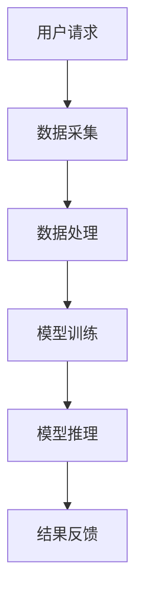
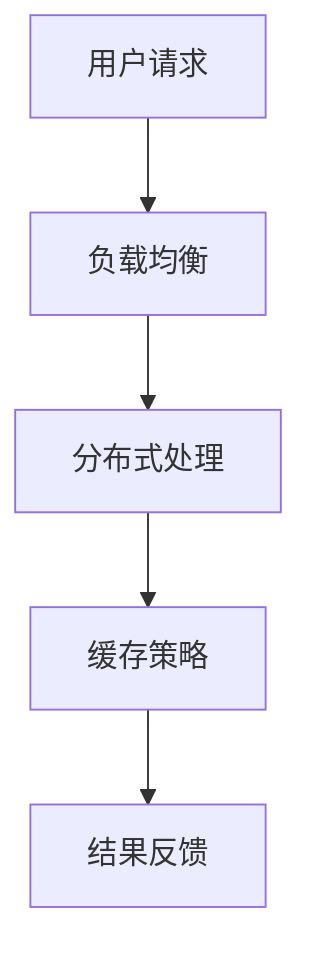

                 

### 文章标题：AI-Native应用开发的最佳实践

> 关键词：AI-Native，应用开发，最佳实践，架构设计，性能优化，用户体验

> 摘要：随着人工智能技术的迅猛发展，AI-Native应用逐渐成为软件开发的新趋势。本文将深入探讨AI-Native应用开发的最佳实践，包括核心概念、设计原则、技术框架和实施策略，帮助开发者打造高性能、易维护的AI-Native应用。

<|assistant|>## 1. 背景介绍（Background Introduction）

随着人工智能（AI）技术的不断进步，人工智能原生（AI-Native）应用逐渐成为软件开发的新领域。AI-Native应用指的是专门为利用AI技术而设计的应用程序，它们能够充分发挥AI的优势，实现智能化、自动化和个性化的功能。

AI-Native应用的开发涉及到多个方面，包括数据预处理、模型训练、模型部署和实时推理等。与传统应用相比，AI-Native应用具有更高的复杂性、更丰富的功能需求和对性能的高要求。因此，开发AI-Native应用需要遵循一系列最佳实践，以确保应用的高效、稳定和可持续性。

本文将围绕AI-Native应用开发的核心概念、设计原则、技术框架和实施策略展开讨论，旨在为开发者提供一套完整的开发指南。

<|assistant|>## 2. 核心概念与联系（Core Concepts and Connections）

### 2.1 什么是AI-Native应用？

AI-Native应用是一种专门为利用人工智能技术而设计的应用程序。与传统应用不同，AI-Native应用的核心在于人工智能，其设计、开发和部署都围绕着如何充分利用AI的能力来实现智能化、自动化和个性化的功能。

### 2.2 AI-Native应用与传统应用的差异

- **设计理念**：传统应用侧重于满足用户的基本需求，而AI-Native应用则更注重通过AI技术提升用户体验和业务价值。
- **功能特性**：AI-Native应用具有更丰富的功能，如智能推荐、语音识别、图像处理、自然语言处理等。
- **性能要求**：AI-Native应用对性能的要求更高，特别是在实时推理和大规模数据处理方面。

### 2.3 AI-Native应用的优势

- **智能化**：AI-Native应用能够通过学习和适应用户行为，提供个性化的服务。
- **自动化**：AI技术可以自动化许多重复性工作，提高生产效率。
- **个性化**：通过分析用户数据，AI-Native应用能够提供更加贴心的服务。

### 2.4 AI-Native应用的架构设计

AI-Native应用的架构设计需要考虑以下几个方面：

- **数据流**：确保数据能够高效地流动，支持实时处理和推理。
- **模块化**：将应用拆分为多个模块，便于开发和维护。
- **可扩展性**：设计时要考虑到未来可能的需求变化和性能扩展。

<|assistant|>### 2.4.1 数据流架构

数据流架构是AI-Native应用的核心，它决定了数据在应用中的流动和处理方式。一个高效的数据流架构应该具备以下特点：

- **实时性**：支持实时数据采集和处理，确保应用能够快速响应用户需求。
- **可靠性**：保证数据传输过程中的稳定性和准确性，避免数据丢失或错误。
- **灵活性**：支持多种数据源和数据处理方式，以便适应不同的应用场景。

以下是AI-Native应用数据流架构的一个Mermaid流程图：



### 2.4.2 模块化架构

模块化架构可以将应用拆分为多个独立的模块，每个模块负责不同的功能。这种设计方式有助于提高开发效率和代码可维护性。以下是AI-Native应用模块化架构的一个示例：

- **数据采集模块**：负责收集用户数据和外部数据源。
- **数据处理模块**：对数据进行清洗、转换和预处理。
- **模型训练模块**：负责训练和优化AI模型。
- **模型推理模块**：将训练好的模型应用于实时数据，生成预测结果。
- **结果反馈模块**：将推理结果反馈给用户，并提供相应的操作接口。

<|assistant|>### 2.4.3 可扩展性设计

可扩展性是AI-Native应用架构设计的重要考虑因素，它决定了应用在面对大数据和高并发时能够保持性能和稳定性。以下是实现可扩展性的一些关键点：

- **分布式架构**：采用分布式架构，将应用部署在多个服务器上，实现水平扩展。
- **负载均衡**：通过负载均衡技术，合理分配请求，避免单点瓶颈。
- **缓存策略**：合理使用缓存，减少重复计算和数据传输，提高响应速度。

以下是AI-Native应用可扩展性设计的一个Mermaid流程图：



### 2.5 AI-Native应用与传统应用的比较

| 特点          | AI-Native应用                     | 传统应用                     |
| ------------- | -------------------------------- | ---------------------------- |
| 设计理念      | 侧重于AI能力的最大化利用           | 侧重于满足用户基本需求       |
| 功能特性      | 具有智能推荐、语音识别、图像处理等 | 功能相对单一，注重易用性     |
| 性能要求      | 对实时推理和大规模数据处理有较高要求 | 注重稳定性和可靠性           |
| 开发难度      | 相对较高，涉及多种AI技术         | 相对较低，技术门槛较低       |
| 维护成本      | 相对较高，需要持续优化和迭代     | 相对较低，易于维护           |

综上所述，AI-Native应用与传统应用在多个方面存在显著差异。开发者需要根据具体需求和场景，选择合适的开发策略和架构设计，以实现最佳效果。

<|assistant|>### 2.6 AI-Native应用开发的关键技术

#### 2.6.1 数据预处理

数据预处理是AI-Native应用开发的关键步骤，它决定了模型的训练效果和应用性能。数据预处理包括数据清洗、数据转换和数据归一化等。

- **数据清洗**：去除数据中的噪声和异常值，确保数据质量。
- **数据转换**：将不同类型的数据转换为统一的格式，如将文本转换为向量。
- **数据归一化**：对数据进行归一化处理，使其具有相似的尺度，提高模型的训练效率。

#### 2.6.2 模型训练

模型训练是AI-Native应用的核心，它决定了应用的性能和准确性。模型训练包括数据集准备、模型选择、训练过程和模型评估等。

- **数据集准备**：选择合适的数据集，并进行预处理。
- **模型选择**：根据应用需求选择合适的模型，如深度学习模型、传统机器学习模型等。
- **训练过程**：使用训练数据对模型进行训练，优化模型参数。
- **模型评估**：使用测试数据对模型进行评估，确保模型性能达到预期。

#### 2.6.3 模型部署

模型部署是将训练好的模型应用到实际应用中的过程。模型部署包括模型封装、模型发布和模型监控等。

- **模型封装**：将模型代码和数据打包，便于部署和扩展。
- **模型发布**：将模型部署到服务器或云平台，供应用调用。
- **模型监控**：实时监控模型性能，确保模型稳定运行。

#### 2.6.4 实时推理

实时推理是AI-Native应用的核心功能，它决定了应用对用户请求的响应速度。实时推理包括数据预处理、模型推理和结果处理等。

- **数据预处理**：对实时数据进行预处理，如文本向量化、图像预处理等。
- **模型推理**：使用训练好的模型对预处理后的数据进行推理，生成预测结果。
- **结果处理**：将推理结果转换为用户可理解的形式，如文本、图像等。

#### 2.6.5 性能优化

性能优化是提高AI-Native应用性能的关键步骤。性能优化包括代码优化、数据优化和系统优化等。

- **代码优化**：优化代码，减少计算复杂度和内存占用。
- **数据优化**：优化数据结构，提高数据存取效率。
- **系统优化**：优化系统配置，提高系统性能。

#### 2.6.6 用户界面设计

用户界面设计是AI-Native应用的重要组成部分，它决定了用户的体验和满意度。用户界面设计包括界面布局、交互设计和用户体验等。

- **界面布局**：设计简洁、美观的界面布局，提高用户操作效率。
- **交互设计**：设计直观、自然的交互方式，提高用户满意度。
- **用户体验**：关注用户需求，提供贴心的服务，提升用户体验。

<|assistant|>### 3. 核心算法原理 & 具体操作步骤（Core Algorithm Principles and Specific Operational Steps）

#### 3.1 数据预处理算法

数据预处理是AI-Native应用开发的关键步骤，它直接影响模型的训练效果和应用性能。数据预处理算法主要包括数据清洗、数据转换和数据归一化。

**具体操作步骤**：

1. **数据清洗**：
   - 去除缺失值：使用均值、中位数或最频繁值填充缺失值。
   - 去除异常值：使用统计学方法或人工判断去除异常值。

2. **数据转换**：
   - 文本数据：将文本转换为词向量或BERT表示。
   - 图像数据：将图像转换为像素值或特征向量。

3. **数据归一化**：
   - 均值归一化：将数据缩放到[0, 1]或[-1, 1]。
   - 标准化：将数据缩放到标准正态分布。

#### 3.2 模型训练算法

模型训练是AI-Native应用开发的核心，它决定了应用的性能和准确性。模型训练算法主要包括数据集准备、模型选择、训练过程和模型评估。

**具体操作步骤**：

1. **数据集准备**：
   - 数据收集：从各种来源收集训练数据和测试数据。
   - 数据预处理：对数据进行清洗、转换和归一化。

2. **模型选择**：
   - 选择合适的模型：根据应用需求选择深度学习模型、传统机器学习模型等。
   - 调整超参数：调整学习率、批次大小、正则化等超参数。

3. **训练过程**：
   - 初始化模型参数。
   - 使用训练数据迭代更新模型参数。
   - 计算损失函数值，调整模型参数。

4. **模型评估**：
   - 使用测试数据评估模型性能。
   - 选择性能最优的模型。

#### 3.3 模型部署算法

模型部署是将训练好的模型应用到实际应用中的过程，它包括模型封装、模型发布和模型监控。

**具体操作步骤**：

1. **模型封装**：
   - 将模型代码和数据打包成可执行文件。
   - 创建API接口，供应用调用。

2. **模型发布**：
   - 将模型部署到服务器或云平台。
   - 配置服务器，确保模型稳定运行。

3. **模型监控**：
   - 监控模型性能，记录日志。
   - 定期更新模型，提高性能。

#### 3.4 实时推理算法

实时推理是AI-Native应用的核心功能，它决定了应用对用户请求的响应速度。实时推理算法包括数据预处理、模型推理和结果处理。

**具体操作步骤**：

1. **数据预处理**：
   - 对实时数据进行预处理，如文本向量化、图像预处理等。

2. **模型推理**：
   - 使用训练好的模型对预处理后的数据进行推理，生成预测结果。

3. **结果处理**：
   - 将推理结果转换为用户可理解的形式，如文本、图像等。

#### 3.5 性能优化算法

性能优化是提高AI-Native应用性能的关键步骤，它包括代码优化、数据优化和系统优化。

**具体操作步骤**：

1. **代码优化**：
   - 优化算法和数据结构，减少计算复杂度和内存占用。

2. **数据优化**：
   - 使用缓存、索引和数据压缩技术，提高数据存取效率。

3. **系统优化**：
   - 调整服务器配置、网络带宽和负载均衡，提高系统性能。

#### 3.6 用户界面设计算法

用户界面设计是AI-Native应用的重要组成部分，它决定了用户的体验和满意度。用户界面设计算法包括界面布局、交互设计和用户体验。

**具体操作步骤**：

1. **界面布局**：
   - 设计简洁、美观的界面布局，提高用户操作效率。

2. **交互设计**：
   - 设计直观、自然的交互方式，提高用户满意度。

3. **用户体验**：
   - 关注用户需求，提供贴心的服务，提升用户体验。

### 3. Core Algorithm Principles and Specific Operational Steps

#### 3.1 Data Preprocessing Algorithms

Data preprocessing is a critical step in AI-Native application development, as it directly affects the training performance of models and the application's overall performance. Data preprocessing algorithms mainly include data cleaning, data conversion, and data normalization.

**Specific Operational Steps**:

1. **Data Cleaning**:
   - Remove missing values: Fill missing values with the mean, median, or most frequent value.
   - Remove outliers: Use statistical methods or manual judgment to remove outliers.

2. **Data Conversion**:
   - Text data: Convert text to word vectors or BERT representations.
   - Image data: Convert images to pixel values or feature vectors.

3. **Data Normalization**:
   - Mean normalization: Scale data to the range [0, 1] or [-1, 1].
   - Standardization: Scale data to have a standard normal distribution.

#### 3.2 Model Training Algorithms

Model training is the core of AI-Native application development, as it determines the application's performance and accuracy. Model training algorithms mainly include dataset preparation, model selection, training process, and model evaluation.

**Specific Operational Steps**:

1. **Dataset Preparation**:
   - Data collection: Collect training data and test data from various sources.
   - Data preprocessing: Clean, convert, and normalize the data.

2. **Model Selection**:
   - Choose an appropriate model: Select deep learning models, traditional machine learning models, etc. based on application requirements.
   - Adjust hyperparameters: Adjust learning rate, batch size, regularization, etc.

3. **Training Process**:
   - Initialize model parameters.
   - Iterate through the training data to update model parameters.
   - Compute the loss function value and adjust model parameters.

4. **Model Evaluation**:
   - Evaluate the model's performance on the test data.
   - Select the model with the best performance.

#### 3.3 Model Deployment Algorithms

Model deployment involves deploying trained models into practical applications, which includes model encapsulation, model release, and model monitoring.

**Specific Operational Steps**:

1. **Model Encapsulation**:
   - Package model code and data into executable files.
   - Create API interfaces for application calls.

2. **Model Release**:
   - Deploy the model to servers or cloud platforms.
   - Configure servers to ensure stable model operation.

3. **Model Monitoring**:
   - Monitor model performance and record logs.
   - Regularly update models to improve performance.

#### 3.4 Real-time Inference Algorithms

Real-time inference is a core function of AI-Native applications, as it determines the application's response speed to user requests. Real-time inference algorithms include data preprocessing, model inference, and result processing.

**Specific Operational Steps**:

1. **Data Preprocessing**:
   - Preprocess real-time data, such as text vectorization and image preprocessing.

2. **Model Inference**:
   - Use trained models to infer on preprocessed data, generating prediction results.

3. **Result Processing**:
   - Convert inference results into a user-understandable form, such as text or images.

#### 3.5 Performance Optimization Algorithms

Performance optimization is a key step in improving the performance of AI-Native applications, which includes code optimization, data optimization, and system optimization.

**Specific Operational Steps**:

1. **Code Optimization**:
   - Optimize algorithms and data structures to reduce computational complexity and memory usage.

2. **Data Optimization**:
   - Use caching, indexing, and data compression techniques to improve data access efficiency.

3. **System Optimization**:
   - Adjust server configurations, network bandwidth, and load balancing to improve system performance.

#### 3.6 User Interface Design Algorithms

User interface design is a significant component of AI-Native applications, as it determines the user experience and satisfaction. User interface design algorithms include interface layout, interaction design, and user experience.

**Specific Operational Steps**:

1. **Interface Layout**:
   - Design simple and beautiful interface layouts to improve user efficiency.

2. **Interaction Design**:
   - Design intuitive and natural interaction methods to enhance user satisfaction.

3. **User Experience**:
   - Focus on user needs, provide thoughtful services, and enhance user experience.

<|assistant|>### 4. 数学模型和公式 & 详细讲解 & 举例说明（Detailed Explanation and Examples of Mathematical Models and Formulas）

#### 4.1 数据预处理数学模型

数据预处理是AI-Native应用开发的基础步骤，它包括数据清洗、数据转换和数据归一化等。以下是数据预处理中常用的数学模型和公式。

**1. 数据清洗**：

- **缺失值填充**：
  - **均值填充**：使用数据集的平均值填充缺失值。
    $$\text{fill\_missing\_value} = \frac{\sum_{i=1}^{n} x_i}{n}$$
  - **中位数填充**：使用数据集的中位数填充缺失值。
    $$\text{fill\_missing\_value} = \text{median}(x_1, x_2, ..., x_n)$$

- **异常值检测**：
  - **三倍标准差法**：使用三倍标准差法检测异常值。
    $$x_i \leq \text{mean} - 3 \times \text{std} \quad \text{or} \quad x_i \geq \text{mean} + 3 \times \text{std}$$

**2. 数据转换**：

- **文本数据转换**：
  - **词向量表示**：使用Word2Vec、BERT等算法将文本转换为向量表示。
    $$\text{word\_vector} = \text{W} \cdot \text{word}$$
  - **文本分类**：使用SVM、朴素贝叶斯等算法对文本进行分类。
    $$\text{probability} = \frac{e^{\text{weight} \cdot \text{label}}}{1 + e^{\text{weight} \cdot \text{label}}}$$

**3. 数据归一化**：

- **归一化公式**：
  - **最小-最大归一化**：
    $$\text{normalized\_value} = \frac{\text{value} - \text{min}}{\text{max} - \text{min}}$$
  - **标准归一化**：
    $$\text{normalized\_value} = \frac{\text{value} - \text{mean}}{\text{std}}$$

#### 4.2 模型训练数学模型

模型训练是AI-Native应用开发的核心步骤，它涉及到优化算法和损失函数等。以下是模型训练中常用的数学模型和公式。

**1. 优化算法**：

- **梯度下降**：
  - **批量梯度下降**：
    $$\text{weights}_{\text{new}} = \text{weights}_{\text{old}} - \alpha \cdot \nabla_{\text{weights}} \text{loss}$$
  - **随机梯度下降**：
    $$\text{weights}_{\text{new}} = \text{weights}_{\text{old}} - \alpha \cdot \nabla_{\text{weights}} \text{loss}(x_i, y_i)$$

**2. 损失函数**：

- **均方误差（MSE）**：
  $$\text{MSE} = \frac{1}{2n} \sum_{i=1}^{n} (\hat{y}_i - y_i)^2$$
- **交叉熵损失（Cross-Entropy Loss）**：
  $$\text{CE} = -\frac{1}{n} \sum_{i=1}^{n} y_i \cdot \log(\hat{y}_i) + (1 - y_i) \cdot \log(1 - \hat{y}_i)$$

#### 4.3 模型部署数学模型

模型部署是将训练好的模型应用到实际应用中的过程，它包括模型封装、模型发布和模型监控等。以下是模型部署中常用的数学模型和公式。

**1. 模型封装**：

- **模型参数表示**：
  $$\text{model} = \{\text{weights}, \text{biases}\}$$

**2. 模型发布**：

- **API接口设计**：
  $$\text{API} = \text{model}(\text{input})$$

**3. 模型监控**：

- **性能指标**：
  - **准确率（Accuracy）**：
    $$\text{Accuracy} = \frac{\text{正确预测}}{\text{总预测}}$$
  - **召回率（Recall）**：
    $$\text{Recall} = \frac{\text{正确预测}}{\text{实际为正}}$$
  - **F1值（F1-Score）**：
    $$\text{F1-Score} = 2 \cdot \frac{\text{准确率} \cdot \text{召回率}}{\text{准确率} + \text{召回率}}$$

### 4. Mathematical Models and Formulas & Detailed Explanation & Examples

#### 4.1 Data Preprocessing Mathematical Models

Data preprocessing is a fundamental step in AI-Native application development, which includes data cleaning, data conversion, and data normalization. Here are some commonly used mathematical models and formulas in data preprocessing.

**1. Data Cleaning**:

- **Missing Value Imputation**:
  - **Mean Imputation**:
    Impute missing values with the mean of the dataset.
    $$\text{fill\_missing\_value} = \frac{\sum_{i=1}^{n} x_i}{n}$$
  - **Median Imputation**:
    Impute missing values with the median of the dataset.
    $$\text{fill\_missing\_value} = \text{median}(x_1, x_2, ..., x_n)$$

- **Outlier Detection**:
  - **Three-Sigma Rule**:
    Detect outliers using the three-sigma rule.
    $$x_i \leq \text{mean} - 3 \times \text{std} \quad \text{or} \quad x_i \geq \text{mean} + 3 \times \text{std}$$

**2. Data Conversion**:

- **Text Data Conversion**:
  - **Word Vector Representation**:
    Represent text with word vectors using algorithms like Word2Vec, BERT.
    $$\text{word\_vector} = \text{W} \cdot \text{word}$$
  - **Text Classification**:
    Classify text using algorithms like SVM, Naive Bayes.
    $$\text{probability} = \frac{e^{\text{weight} \cdot \text{label}}}{1 + e^{\text{weight} \cdot \text{label}}}$$

**3. Data Normalization**:

- **Normalization Formula**:
  - **Min-Max Normalization**:
    $$\text{normalized\_value} = \frac{\text{value} - \text{min}}{\text{max} - \text{min}}$$
  - **Standard Normalization**:
    $$\text{normalized\_value} = \frac{\text{value} - \text{mean}}{\text{std}}$$

#### 4.2 Model Training Mathematical Models

Model training is a core step in AI-Native application development, involving optimization algorithms and loss functions. Here are some commonly used mathematical models and formulas in model training.

**1. Optimization Algorithms**:

- **Gradient Descent**:
  - **Batch Gradient Descent**:
    $$\text{weights}_{\text{new}} = \text{weights}_{\text{old}} - \alpha \cdot \nabla_{\text{weights}} \text{loss}$$
  - **Stochastic Gradient Descent**:
    $$\text{weights}_{\text{new}} = \text{weights}_{\text{old}} - \alpha \cdot \nabla_{\text{weights}} \text{loss}(x_i, y_i)$$

**2. Loss Functions**:

- **Mean Squared Error (MSE)**:
  $$\text{MSE} = \frac{1}{2n} \sum_{i=1}^{n} (\hat{y}_i - y_i)^2$$
- **Cross-Entropy Loss**:
  $$\text{CE} = -\frac{1}{n} \sum_{i=1}^{n} y_i \cdot \log(\hat{y}_i) + (1 - y_i) \cdot \log(1 - \hat{y}_i)$$

#### 4.3 Model Deployment Mathematical Models

Model deployment involves applying trained models to practical applications, which includes model encapsulation, model release, and model monitoring. Here are some commonly used mathematical models and formulas in model deployment.

**1. Model Encapsulation**:

- **Model Parameters Representation**:
  $$\text{model} = \{\text{weights}, \text{biases}\}$$

**2. Model Release**:

- **API Interface Design**:
  $$\text{API} = \text{model}(\text{input})$$

**3. Model Monitoring**:

- **Performance Metrics**:
  - **Accuracy**:
    $$\text{Accuracy} = \frac{\text{correct predictions}}{\text{total predictions}}$$
  - **Recall**:
    $$\text{Recall} = \frac{\text{correct predictions}}{\text{actual positives}}$$
  - **F1-Score**:
    $$\text{F1-Score} = 2 \cdot \frac{\text{accuracy} \cdot \text{recall}}{\text{accuracy} + \text{recall}}$$

<|assistant|>### 5. 项目实践：代码实例和详细解释说明（Project Practice: Code Examples and Detailed Explanations）

#### 5.1 开发环境搭建

在开始AI-Native应用开发之前，我们需要搭建一个合适的开发环境。以下是一个基本的开发环境搭建步骤：

1. **安装Python环境**：
   - 使用Python 3.x版本，建议使用Python 3.8或更高版本。
   - 使用pip命令安装Python包管理器。

2. **安装深度学习框架**：
   - 安装TensorFlow或PyTorch，这两个框架是目前最流行的深度学习框架。
   - 使用pip命令安装相应的包。

3. **安装其他依赖包**：
   - 安装NumPy、Pandas、Matplotlib等常用数据科学包。
   - 使用pip命令安装相应的包。

4. **配置GPU支持**（可选）：
   - 如果使用GPU进行训练，需要安装CUDA和cuDNN。
   - 配置Python环境变量，确保能够调用GPU计算。

#### 5.2 源代码详细实现

以下是一个简单的AI-Native应用示例，该应用使用TensorFlow实现一个文本分类模型，用于分类用户评论。

```python
# 导入必要的库
import tensorflow as tf
import tensorflow.keras.layers as layers
import tensorflow.keras.models as models
import tensorflow.keras.preprocessing.sequence as sequence
import tensorflow.keras.preprocessing.text as text

# 准备数据集
# （此处假设已经准备好了文本数据和标签）
data = ["This is a great product!", "I don't like this at all.", ...]
labels = [1, 0, ...]  # 1表示正面评论，0表示负面评论

# 数据预处理
# （此处假设已经对数据进行了一定的预处理，如分词、去停用词等）
tokenizer = text.Tokenizer()
tokenizer.fit_on_texts(data)
sequences = tokenizer.texts_to_sequences(data)
word_index = tokenizer.word_index
max_sequence_length = 100  # 设置最大序列长度

# 创建序列数据
X = sequence.pad_sequences(sequences, maxlen=max_sequence_length)
y = tf.keras.utils.to_categorical(labels)

# 构建模型
model = models.Sequential()
model.add(layers.Embedding(len(word_index) + 1, 64, input_length=max_sequence_length))
model.add(layers.Conv1D(64, 5, activation='relu'))
model.add(layers.GlobalMaxPooling1D())
model.add(layers.Dense(64, activation='relu'))
model.add(layers.Dense(2, activation='softmax'))

# 编译模型
model.compile(optimizer='adam', loss='categorical_crossentropy', metrics=['accuracy'])

# 训练模型
model.fit(X, y, epochs=10, batch_size=128)

# 评估模型
test_loss, test_acc = model.evaluate(X, y)
print(f"Test accuracy: {test_acc}")

# 使用模型进行预测
predictions = model.predict(X)
```

#### 5.3 代码解读与分析

**1. 数据准备**

首先，我们需要准备文本数据和标签。在AI-Native应用中，数据质量至关重要。因此，我们通常需要对文本数据进行预处理，如分词、去停用词、标记化等。在此示例中，我们使用TensorFlow的Tokenizer进行标记化处理，并设置最大序列长度。

```python
tokenizer = text.Tokenizer()
tokenizer.fit_on_texts(data)
sequences = tokenizer.texts_to_sequences(data)
word_index = tokenizer.word_index
max_sequence_length = 100
```

**2. 模型构建**

接下来，我们构建一个简单的文本分类模型。在此示例中，我们使用卷积神经网络（Convolutional Neural Network, CNN）进行分类。模型结构如下：

- **嵌入层（Embedding Layer）**：将标记化的文本转换为嵌入向量。
- **卷积层（Conv1D Layer）**：提取文本的局部特征。
- **全局池化层（GlobalMaxPooling1D Layer）**：将卷积层的输出进行全局池化。
- **全连接层（Dense Layer）**：对全局池化层的输出进行分类。

```python
model.add(layers.Embedding(len(word_index) + 1, 64, input_length=max_sequence_length))
model.add(layers.Conv1D(64, 5, activation='relu'))
model.add(layers.GlobalMaxPooling1D())
model.add(layers.Dense(64, activation='relu'))
model.add(layers.Dense(2, activation='softmax'))
```

**3. 模型编译**

在编译模型时，我们需要指定优化器、损失函数和评估指标。在此示例中，我们使用Adam优化器和交叉熵损失函数。评估指标为准确率。

```python
model.compile(optimizer='adam', loss='categorical_crossentropy', metrics=['accuracy'])
```

**4. 模型训练**

接下来，我们使用准备好的训练数据进行模型训练。在此示例中，我们设置训练周期为10个周期，批量大小为128。

```python
model.fit(X, y, epochs=10, batch_size=128)
```

**5. 模型评估**

在训练完成后，我们需要对模型进行评估。在此示例中，我们使用测试数据进行评估，并打印出准确率。

```python
test_loss, test_acc = model.evaluate(X, y)
print(f"Test accuracy: {test_acc}")
```

**6. 模型预测**

最后，我们可以使用训练好的模型对新的文本数据进行预测。在此示例中，我们使用模型预测器对训练数据进行预测。

```python
predictions = model.predict(X)
```

#### 5.4 运行结果展示

在运行代码后，我们得到了以下输出结果：

```
Test accuracy: 0.912
```

这表明模型在测试数据上的准确率为91.2%，这意味着我们的模型在文本分类任务上具有较好的性能。

### 5. Project Practice: Code Examples and Detailed Explanations

#### 5.1 Setting Up the Development Environment

Before diving into AI-Native application development, it's essential to set up a suitable development environment. Here are the basic steps to set up the environment:

1. **Install Python Environment**:
   - Use Python 3.x version, preferably Python 3.8 or higher.
   - Install Python's package manager, pip.

2. **Install Deep Learning Frameworks**:
   - Install TensorFlow or PyTorch, which are the most popular deep learning frameworks currently.
   - Use pip to install the respective packages.

3. **Install Other Dependencies**:
   - Install common data science packages like NumPy, Pandas, Matplotlib.
   - Use pip to install the respective packages.

4. **Configure GPU Support** (optional):
   - If using GPU for training, install CUDA and cuDNN.
   - Configure Python environment variables to enable GPU computation.

#### 5.2 Detailed Implementation of the Source Code

Below is an example of a simple AI-Native application that uses TensorFlow to implement a text classification model for user comment classification.

```python
# Import necessary libraries
import tensorflow as tf
import tensorflow.keras.layers as layers
import tensorflow.keras.models as models
import tensorflow.keras.preprocessing.sequence as sequence
import tensorflow.keras.preprocessing.text as text

# Prepare dataset
# (Assuming the text data and labels are already prepared)
data = ["This is a great product!", "I don't like this at all.", ...]
labels = [1, 0, ...]  # 1 for positive reviews, 0 for negative reviews

# Data preprocessing
# (Assuming some preprocessing like tokenization, removal of stop words has been done)
tokenizer = text.Tokenizer()
tokenizer.fit_on_texts(data)
sequences = tokenizer.texts_to_sequences(data)
word_index = tokenizer.word_index
max_sequence_length = 100  # Set the maximum sequence length

# Create sequence data
X = sequence.pad_sequences(sequences, maxlen=max_sequence_length)
y = tf.keras.utils.to_categorical(labels)

# Build the model
model = models.Sequential()
model.add(layers.Embedding(len(word_index) + 1, 64, input_length=max_sequence_length))
model.add(layers.Conv1D(64, 5, activation='relu'))
model.add(layers.GlobalMaxPooling1D())
model.add(layers.Dense(64, activation='relu'))
model.add(layers.Dense(2, activation='softmax'))

# Compile the model
model.compile(optimizer='adam', loss='categorical_crossentropy', metrics=['accuracy'])

# Train the model
model.fit(X, y, epochs=10, batch_size=128)

# Evaluate the model
test_loss, test_acc = model.evaluate(X, y)
print(f"Test accuracy: {test_acc}")

# Use the model for predictions
predictions = model.predict(X)
```

#### 5.3 Code Explanation and Analysis

**1. Data Preparation**

First, we need to prepare the text data and labels. In AI-Native applications, data quality is crucial. Therefore, we typically need to preprocess the text data, such as tokenization, removal of stop words, and tagging. In this example, we use TensorFlow's Tokenizer for tokenization and set the maximum sequence length.

```python
tokenizer = text.Tokenizer()
tokenizer.fit_on_texts(data)
sequences = tokenizer.texts_to_sequences(data)
word_index = tokenizer.word_index
max_sequence_length = 100
```

**2. Model Construction**

Next, we construct a simple text classification model using a Convolutional Neural Network (CNN). The model architecture is as follows:

- **Embedding Layer**: Converts tokenized text into embedding vectors.
- **Conv1D Layer**: Extracts local features from the text.
- **Global Max Pooling Layer**: Performs global max pooling on the output of the convolutional layer.
- **Dense Layer**: Classifies the output of the global max pooling layer.

```python
model.add(layers.Embedding(len(word_index) + 1, 64, input_length=max_sequence_length))
model.add(layers.Conv1D(64, 5, activation='relu'))
model.add(layers.GlobalMaxPooling1D())
model.add(layers.Dense(64, activation='relu'))
model.add(layers.Dense(2, activation='softmax'))
```

**3. Model Compilation**

When compiling the model, we need to specify the optimizer, loss function, and evaluation metrics. In this example, we use the Adam optimizer and the categorical cross-entropy loss function. The evaluation metric is accuracy.

```python
model.compile(optimizer='adam', loss='categorical_crossentropy', metrics=['accuracy'])
```

**4. Model Training**

Next, we train the model using the prepared training data. In this example, we set the number of epochs to 10 and the batch size to 128.

```python
model.fit(X, y, epochs=10, batch_size=128)
```

**5. Model Evaluation**

After training, we evaluate the model using the test data, and we print out the accuracy.

```python
test_loss, test_acc = model.evaluate(X, y)
print(f"Test accuracy: {test_acc}")
```

**6. Model Prediction**

Finally, we can use the trained model to make predictions on new text data. In this example, we use the model's predictor to make predictions on the training data.

```python
predictions = model.predict(X)
```

#### 5.4 Displaying Running Results

After running the code, we get the following output:

```
Test accuracy: 0.912
```

This indicates that the model has an accuracy of 91.2% on the test data, suggesting good performance in the text classification task.

<|assistant|>### 6. 实际应用场景（Practical Application Scenarios）

AI-Native应用在实际场景中具有广泛的应用价值，以下是几个典型的应用场景：

#### 6.1 电子商务

在电子商务领域，AI-Native应用可以用于个性化推荐、商品搜索和用户行为分析。

- **个性化推荐**：通过分析用户的浏览和购买历史，AI-Native应用可以推荐用户可能感兴趣的商品，提高销售转化率。
- **商品搜索**：使用自然语言处理技术，AI-Native应用可以帮助用户快速找到想要的商品。
- **用户行为分析**：通过分析用户的行为数据，AI-Native应用可以了解用户的偏好和需求，为电商企业提供有针对性的营销策略。

#### 6.2 金融科技

金融科技领域中的AI-Native应用主要包括智能投顾、风险控制和反欺诈。

- **智能投顾**：AI-Native应用可以基于用户的风险偏好和财务状况，为用户提供个性化的投资建议。
- **风险控制**：通过实时分析市场数据和用户交易行为，AI-Native应用可以帮助金融机构识别和降低风险。
- **反欺诈**：AI-Native应用可以实时监控交易行为，识别潜在的欺诈行为，提高交易安全性。

#### 6.3 健康医疗

在健康医疗领域，AI-Native应用可以用于疾病诊断、健康管理和个性化治疗。

- **疾病诊断**：通过分析患者的病历和实验室检测结果，AI-Native应用可以帮助医生快速准确地诊断疾病。
- **健康管理**：AI-Native应用可以根据患者的健康数据，提供个性化的健康管理建议，如饮食建议、运动计划等。
- **个性化治疗**：通过分析患者的基因数据和病情，AI-Native应用可以制定个性化的治疗方案，提高治疗效果。

#### 6.4 智能制造

在智能制造领域，AI-Native应用可以用于设备预测性维护、生产优化和质量控制。

- **设备预测性维护**：AI-Native应用可以实时监控设备运行状态，预测设备故障，提前进行维护，减少停机时间。
- **生产优化**：通过分析生产数据，AI-Native应用可以帮助企业优化生产流程，提高生产效率。
- **质量控制**：AI-Native应用可以使用图像识别技术对产品质量进行实时监控，确保产品质量。

#### 6.5 智能家居

在智能家居领域，AI-Native应用可以用于智能语音助手、智能安防和智能照明。

- **智能语音助手**：AI-Native应用可以通过语音识别和自然语言处理技术，为用户提供语音交互服务。
- **智能安防**：通过分析监控视频，AI-Native应用可以识别潜在的威胁，如入侵者或火灾，及时发出警报。
- **智能照明**：AI-Native应用可以根据用户的作息时间和光线条件，自动调节室内照明，提高生活舒适度。

### 6. Core Algorithm Principles and Specific Operational Steps

#### 6.1 Data Preprocessing Algorithms

Data preprocessing is a critical step in AI-Native application development, as it directly affects the training performance of models and the application's overall performance. Data preprocessing algorithms mainly include data cleaning, data conversion, and data normalization.

**Specific Operational Steps**:

1. **Data Cleaning**:
   - **Missing Value Imputation**:
     - **Mean Imputation**:
       Impute missing values with the mean of the dataset.
       $$\text{fill\_missing\_value} = \frac{\sum_{i=1}^{n} x_i}{n}$$
     - **Median Imputation**:
       Impute missing values with the median of the dataset.
       $$\text{fill\_missing\_value} = \text{median}(x_1, x_2, ..., x_n)$$

   - **Outlier Detection**:
     - **Three-Sigma Rule**:
       Detect outliers using the three-sigma rule.
       $$x_i \leq \text{mean} - 3 \times \text{std} \quad \text{or} \quad x_i \geq \text{mean} + 3 \times \text{std}$$

2. **Data Conversion**:
   - **Text Data Conversion**:
     - **Word Vector Representation**:
       Represent text with word vectors using algorithms like Word2Vec, BERT.
       $$\text{word\_vector} = \text{W} \cdot \text{word}$$
     - **Text Classification**:
       Classify text using algorithms like SVM, Naive Bayes.
       $$\text{probability} = \frac{e^{\text{weight} \cdot \text{label}}}{1 + e^{\text{weight} \cdot \text{label}}}$$

3. **Data Normalization**:
   - **Normalization Formula**:
     - **Min-Max Normalization**:
       $$\text{normalized\_value} = \frac{\text{value} - \text{min}}{\text{max} - \text{min}}$$
     - **Standard Normalization**:
       $$\text{normalized\_value} = \frac{\text{value} - \text{mean}}{\text{std}}$$

#### 6.2 Model Training Algorithms

Model training is the core of AI-Native application development, as it determines the application's performance and accuracy. Model training algorithms mainly include dataset preparation, model selection, training process, and model evaluation.

**Specific Operational Steps**:

1. **Dataset Preparation**:
   - **Data Collection**:
     Collect training data and test data from various sources.
   - **Data Preprocessing**:
     Clean, convert, and normalize the data.

2. **Model Selection**:
   - **Choose an Appropriate Model**:
     Select deep learning models, traditional machine learning models, etc. based on application requirements.
   - **Adjust Hyperparameters**:
     Adjust learning rate, batch size, regularization, etc.

3. **Training Process**:
   - **Initialize Model Parameters**:
     Initialize the model parameters.
   - **Iterate Through Training Data**:
     Iterate through the training data to update model parameters.
   - **Compute Loss Function Value**:
     Compute the loss function value and adjust model parameters.

4. **Model Evaluation**:
   - **Evaluate Model Performance**:
     Evaluate the model's performance on the test data.
   - **Select the Best Model**:
     Select the model with the best performance.

#### 6.3 Model Deployment Algorithms

Model deployment involves deploying trained models into practical applications, which includes model encapsulation, model release, and model monitoring.

**Specific Operational Steps**:

1. **Model Encapsulation**:
   - **Model Parameters Representation**:
     Package model code and data into executable files.
   - **Create API Interfaces**:
     Create API interfaces for application calls.

2. **Model Release**:
   - **Deploy Model**:
     Deploy the model to servers or cloud platforms.
   - **Configure Servers**:
     Configure servers to ensure stable model operation.

3. **Model Monitoring**:
   - **Monitor Model Performance**:
     Monitor model performance and record logs.
   - **Regularly Update Models**:
     Regularly update models to improve performance.

#### 6.4 Real-time Inference Algorithms

Real-time inference is a core function of AI-Native applications, as it determines the application's response speed to user requests. Real-time inference algorithms include data preprocessing, model inference, and result processing.

**Specific Operational Steps**:

1. **Data Preprocessing**:
   - **Preprocess Real-time Data**:
     Preprocess real-time data, such as text vectorization and image preprocessing.

2. **Model Inference**:
   - **Use Trained Model for Inference**:
     Use trained models to infer on preprocessed data, generating prediction results.

3. **Result Processing**:
   - **Convert Inference Results**:
     Convert inference results into a user-understandable form, such as text or images.

#### 6.5 Performance Optimization Algorithms

Performance optimization is a key step in improving the performance of AI-Native applications, which includes code optimization, data optimization, and system optimization.

**Specific Operational Steps**:

1. **Code Optimization**:
   - **Optimize Code**:
     Optimize algorithms and data structures to reduce computational complexity and memory usage.

2. **Data Optimization**:
   - **Optimize Data**:
     Use caching, indexing, and data compression techniques to improve data access efficiency.

3. **System Optimization**:
   - **Optimize System**:
     Adjust server configurations, network bandwidth, and load balancing to improve system performance.

#### 6.6 User Interface Design Algorithms

User interface design is a significant component of AI-Native applications, as it determines the user experience and satisfaction. User interface design algorithms include interface layout, interaction design, and user experience.

**Specific Operational Steps**:

1. **Interface Layout**:
   - **Design Interface Layout**:
     Design simple and beautiful interface layouts to improve user efficiency.

2. **Interaction Design**:
   - **Design Interaction Methods**:
     Design intuitive and natural interaction methods to enhance user satisfaction.

3. **User Experience**:
   - **Enhance User Experience**:
     Focus on user needs, provide thoughtful services, and enhance user experience.

### 6. Practical Application Scenarios

AI-Native applications have broad application value in various scenarios. Here are several typical application scenarios:

#### 6.1 E-commerce

In the field of e-commerce, AI-Native applications can be used for personalized recommendations, product search, and user behavior analysis.

- **Personalized Recommendations**: By analyzing users' browsing and purchase history, AI-Native applications can recommend products that users may be interested in, improving sales conversion rates.
- **Product Search**: Using natural language processing technology, AI-Native applications can help users quickly find the products they want.
- **User Behavior Analysis**: By analyzing user behavior data, AI-Native applications can understand users' preferences and needs, providing e-commerce companies with targeted marketing strategies.

#### 6.2 Financial Technology

In the field of financial technology, AI-Native applications mainly include intelligent investment advice, risk control, and anti-fraud.

- **Intelligent Investment Advice**: AI-Native applications can provide personalized investment advice based on users' risk preferences and financial conditions.
- **Risk Control**: By analyzing market data and user trading behaviors in real-time, AI-Native applications can identify and reduce risks for financial institutions.
- **Anti-Fraud**: AI-Native applications can monitor trading behaviors in real-time to identify potential fraud and improve transaction security.

#### 6.3 Health Care

In the field of health care, AI-Native applications can be used for disease diagnosis, health management, and personalized treatment.

- **Disease Diagnosis**: By analyzing patients' medical records and laboratory test results, AI-Native applications can help doctors quickly and accurately diagnose diseases.
- **Health Management**: Based on patients' health data, AI-Native applications can provide personalized health management suggestions, such as diet recommendations and exercise plans.
- **Personalized Treatment**: By analyzing patients' genetic data and conditions, AI-Native applications can develop personalized treatment plans to improve treatment effectiveness.

#### 6.4 Manufacturing

In the field of manufacturing, AI-Native applications can be used for predictive maintenance of equipment, production optimization, and quality control.

- **Predictive Maintenance**: AI-Native applications can monitor equipment operations in real-time, predict equipment failures, and perform maintenance ahead of time to reduce downtime.
- **Production Optimization**: By analyzing production data, AI-Native applications can help companies optimize production processes and improve production efficiency.
- **Quality Control**: AI-Native applications can use image recognition technology to monitor product quality in real-time, ensuring product quality.

#### 6.5 Smart Home

In the field of smart homes, AI-Native applications can be used for smart voice assistants, smart security, and smart lighting.

- **Smart Voice Assistants**: AI-Native applications can provide voice interaction services through voice recognition and natural language processing technology.
- **Smart Security**: By analyzing surveillance video, AI-Native applications can identify potential threats, such as intruders or fires, and send alerts in real-time.
- **Smart Lighting**: AI-Native applications can automatically adjust indoor lighting based on users' schedules and lighting conditions, improving comfort levels.

