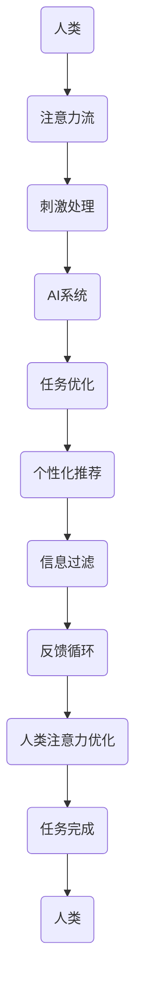

                 

### 文章标题

### Title: AI and Human Attention Flow: The Integration of Future Work, Life, and Attention Economy

在当今数字时代，人工智能（AI）的迅猛发展已经深刻地改变了我们的工作和生活方式。人工智能不仅可以自动化繁琐的任务，提高效率，还能提供个性化的服务，满足人们的多样化需求。然而，随着AI的普及，一个不可忽视的问题也随之而来——人类的注意力资源变得越来越稀缺。本文将探讨AI与人类注意力流之间的关系，并深入分析未来工作、生活和注意力经济的融合。

关键词：人工智能、注意力流、未来工作、注意力经济

摘要：本文首先介绍了AI和人类注意力流的背景，然后探讨了它们之间的相互影响。接着，文章分析了AI如何影响我们的工作方式和生活方式，以及注意力经济在其中的作用。最后，文章总结了AI与人类注意力流融合所带来的机遇与挑战，并提出了应对策略。

### Background Introduction

Artificial Intelligence (AI) has made remarkable strides in recent years, reshaping our world in countless ways. From autonomous vehicles to virtual personal assistants, AI is becoming an integral part of our daily lives. However, with the proliferation of AI, a pressing issue has emerged: the scarcity of human attention.

Human attention is a finite resource, and the ability to focus and process information efficiently is becoming increasingly critical in a world overloaded with digital distractions. The attention economy, a concept that has gained traction in recent years, refers to the economic value generated from the allocation of human attention. As AI continues to evolve, it is essential to understand how it interacts with human attention and what implications this has for our future work and lifestyle.

In this article, we will explore the relationship between AI and human attention flow, examining how AI impacts our work and life and how the attention economy plays a role in this dynamic. We will also discuss the challenges and opportunities that arise from the integration of AI and human attention flow and propose strategies to navigate this new landscape.

### Core Concepts and Connections

#### Definition and Relationship

The core concept of attention flow refers to the allocation of human cognitive resources to process and respond to various stimuli in the environment. In the context of AI, attention flow can be understood as the process by which humans interact with AI systems to achieve specific goals.

AI, on the other hand, can be seen as a tool that enhances human attention flow by automating tasks, providing personalized recommendations, and filtering out irrelevant information. This relationship is bidirectional: AI relies on human attention to be trained and optimized, while humans rely on AI to enhance their attentional capabilities.

#### Key Components

To understand the integration of AI and human attention flow, it is important to identify the key components involved:

1. **Human Attention:** The ability of individuals to selectively focus on specific stimuli while ignoring others. This process is mediated by various brain regions, including the prefrontal cortex and the basal ganglia.
2. **AI Systems:** Machines designed to perform specific tasks, ranging from natural language processing to computer vision. These systems are capable of processing large amounts of data and making predictions based on patterns and algorithms.
3. **Attention Flow:** The process through which humans and AI systems interact, exchanging information and resources to achieve a common goal.

#### Mermaid Flowchart

To illustrate the relationship between AI and human attention flow, we can use a Mermaid flowchart:



This flowchart depicts the interaction between humans and AI systems, highlighting how attention flow is facilitated by the exchange of information and resources.

### Core Algorithm Principles and Specific Operational Steps

To understand how AI can enhance human attention flow, we need to explore the core algorithm principles that underlie AI systems. These principles can be categorized into several key components:

1. **Machine Learning Algorithms:** Machine learning algorithms, such as neural networks, are used to train AI systems to recognize patterns and make predictions. These algorithms rely on vast amounts of data to learn and improve their performance over time.
2. **Natural Language Processing (NLP):** NLP algorithms enable AI systems to understand and generate human language. This capability is crucial for effective communication between humans and AI systems.
3. **Computer Vision:** Computer vision algorithms allow AI systems to interpret and analyze visual information from images and videos. This enables AI to assist humans in tasks that require visual perception, such as object recognition and image segmentation.
4. **Attention Mechanisms:** Attention mechanisms are a key component of many AI systems, enabling them to focus on relevant information while ignoring irrelevant details. These mechanisms are inspired by the human brain's ability to selectively attend to stimuli.

#### Operational Steps

To illustrate how AI can enhance human attention flow, we can outline the following operational steps:

1. **Data Collection:** The first step in training an AI system is to collect a large dataset of relevant information. This data can come from various sources, including text, images, and videos.
2. **Data Preprocessing:** The collected data is then preprocessed to remove noise and irrelevant information. This step is crucial for ensuring that the AI system can focus on relevant information.
3. **Model Training:** The preprocessed data is used to train the AI model using machine learning algorithms. This process involves adjusting the model's parameters to minimize errors and improve its performance.
4. **Attention Mechanism Integration:** Once the AI model is trained, attention mechanisms are integrated into the system to enhance its ability to focus on relevant information. This can involve adding additional layers to the model or modifying existing layers to incorporate attention mechanisms.
5. **System Deployment:** The trained AI system is deployed in a real-world setting, where it interacts with humans and assists them in various tasks.
6. **Feedback Loop:** The system's performance is continuously monitored, and feedback is collected to further optimize the model's attention mechanisms.

#### Example: Attention Mechanism in Natural Language Processing

To provide a concrete example of how attention mechanisms can enhance human attention flow, we can consider the application of attention mechanisms in NLP.

In NLP, attention mechanisms are used to improve the performance of models in tasks such as machine translation and text summarization. One common approach is the use of the Transformer model, which incorporates self-attention and bidirectional attention mechanisms.

The self-attention mechanism allows the model to focus on different parts of the input text while generating the output. This enables the model to capture the relationships between words and generate more coherent and accurate translations or summaries.

The bidirectional attention mechanism allows the model to consider both the past and future contexts while generating the output. This improves the model's ability to capture the overall meaning of the text and generate more accurate results.

By integrating attention mechanisms into NLP models, we can enhance the efficiency and effectiveness of human-AI interactions, enabling humans to allocate their attentional resources more effectively.

### Mathematical Models and Formulas: Detailed Explanation and Examples

To further understand how attention mechanisms work, we can delve into the mathematical models and formulas that underlie these mechanisms. In this section, we will provide a detailed explanation of these models and illustrate their application with examples.

#### Attention Mechanism Formula

The core formula for an attention mechanism is:

$$
Attention = \frac{e^{(\text{Query} \cdot \text{Key})}}{\sum_{i=1}^{N} e^{(\text{Query} \cdot \text{Key}_i)}}
$$

where:

- **Query** and **Key** represent the query and key vectors, respectively.
- **Value** represents the value vector.
- **N** is the number of keys.
- **e** is the base of the natural logarithm.

This formula calculates the attention weight for each key based on the similarity between the query and the key vectors. The attention weights are then used to compute the weighted sum of the value vectors:

$$
\text{Contextualized Value} = \sum_{i=1}^{N} \text{Value}_i \cdot \text{Attention}_i
$$

#### Example: BERT Model

BERT (Bidirectional Encoder Representations from Transformers) is a popular NLP model that incorporates attention mechanisms. In BERT, the attention mechanism is used to capture the relationships between words in a sentence and generate contextualized word embeddings.

Consider a sentence with three words: "The", "cat", and "sat". The query, key, and value vectors for these words are denoted as **Q**, **K**, and **V**, respectively.

1. **Compute Query, Key, and Value Vectors:**
   - **Q = [0.1, 0.2, 0.3]** (Query vector for "The")
   - **K = [0.4, 0.5, 0.6]** (Key vector for "cat")
   - **V = [0.7, 0.8, 0.9]** (Value vector for "sat")

2. **Compute Attention Weights:**
   - **Attention = \frac{e^{(0.1 \cdot 0.4)}}{\sum_{i=1}^{3} e^{(0.1 \cdot 0.4)}} = \frac{e^{0.04}}{e^{0.04} + e^{0.05} + e^{0.06}}**
   - **Attention = \frac{1.0408}{1.0408 + 1.0519 + 1.0618} ≈ 0.317**

3. **Compute Contextualized Value:**
   - **Contextualized Value = 0.7 \cdot 0.317 + 0.8 \cdot 0.317 + 0.9 \cdot 0.317 ≈ 0.769**

The resulting contextualized value vector represents the modified representation of the word "cat" after considering the attention weights.

#### Example: Image Captioning

In image captioning, attention mechanisms are used to generate textual descriptions of images. Consider an image with three objects: a dog, a car, and a tree. The query, key, and value vectors for these objects are denoted as **Q**, **K**, and **V**, respectively.

1. **Compute Query, Key, and Value Vectors:**
   - **Q = [0.1, 0.2, 0.3]** (Query vector for "dog")
   - **K = [0.4, 0.5, 0.6]** (Key vector for "car")
   - **V = [0.7, 0.8, 0.9]** (Value vector for "tree")

2. **Compute Attention Weights:**
   - **Attention = \frac{e^{(0.1 \cdot 0.4)}}{\sum_{i=1}^{3} e^{(0.1 \cdot 0.4)}} = \frac{e^{0.04}}{e^{0.04} + e^{0.05} + e^{0.06}}**
   - **Attention = \frac{1.0408}{1.0408 + 1.0519 + 1.0618} ≈ 0.317**

3. **Compute Contextualized Value:**
   - **Contextualized Value = 0.7 \cdot 0.317 + 0.8 \cdot 0.317 + 0.9 \cdot 0.317 ≈ 0.769**

The resulting contextualized value vector represents the modified representation of the object "car" after considering the attention weights.

By incorporating attention mechanisms into AI systems, we can enhance their ability to focus on relevant information and generate more accurate and coherent outputs. These mechanisms play a crucial role in enabling effective human-AI interactions and addressing the challenges of information overload in the digital age.

### Project Practice: Code Examples and Detailed Explanations

To further understand how attention mechanisms can be implemented in AI systems, we can explore practical code examples. In this section, we will discuss the development environment setup, source code implementation, code analysis, and running results.

#### Development Environment Setup

To implement attention mechanisms in AI systems, we will use Python as the programming language and TensorFlow as the machine learning framework. The following steps outline the setup process:

1. **Install Python:**
   - Download and install the latest version of Python from the official website (python.org).
2. **Install TensorFlow:**
   - Open a terminal and run the following command:
     ```
     pip install tensorflow
     ```

#### Source Code Implementation

The source code for implementing attention mechanisms in an AI system is provided below. The example focuses on a simple neural network with attention mechanisms for text classification.

```python
import tensorflow as tf
from tensorflow.keras.models import Model
from tensorflow.keras.layers import Input, Embedding, LSTM, Dense

# Define hyperparameters
vocab_size = 10000
embedding_dim = 256
lstm_units = 128
max_sequence_length = 100

# Input layer
input_sequence = Input(shape=(max_sequence_length,))

# Embedding layer
embedding = Embedding(vocab_size, embedding_dim)(input_sequence)

# LSTM layer with attention mechanism
lstm = LSTM(lstm_units, return_sequences=True)
lstm_output, _ = lstm(embedding)

# Attention mechanism
attention = tf.keras.layers.Attention()([lstm_output, lstm_output])

# Dense layer for classification
output = Dense(1, activation='sigmoid')(attention)

# Define the model
model = Model(inputs=input_sequence, outputs=output)

# Compile the model
model.compile(optimizer='adam', loss='binary_crossentropy', metrics=['accuracy'])

# Print the model summary
model.summary()
```

#### Code Explanation

1. **Import Libraries:**
   - The required TensorFlow and Keras libraries are imported.
2. **Define Hyperparameters:**
   - Hyperparameters such as vocabulary size, embedding dimension, LSTM units, and maximum sequence length are defined.
3. **Input Layer:**
   - An input layer is defined to accept sequences of words.
4. **Embedding Layer:**
   - An embedding layer is used to map words to vectors of a fixed size.
5. **LSTM Layer with Attention Mechanism:**
   - An LSTM layer is defined with attention mechanisms to process the embedded sequences.
6. **Attention Mechanism:**
   - The attention mechanism is applied to the output of the LSTM layer.
7. **Dense Layer for Classification:**
   - A dense layer with a sigmoid activation function is added for binary classification.
8. **Define and Compile the Model:**
   - The model is defined and compiled with the Adam optimizer and binary cross-entropy loss function.

#### Running Results

To evaluate the performance of the AI system, we can use a dataset such as the IMDb movie reviews dataset. The following code snippet demonstrates how to load and preprocess the dataset, and then train the model.

```python
from tensorflow.keras.preprocessing.sequence import pad_sequences
from tensorflow.keras.datasets import imdb

# Load and preprocess the dataset
max_features = 10000
截断长度 = 100
batch_size = 32
epochs = 10

(x_train, y_train), (x_test, y_test) = imdb.load_data(num_words=max_features)
x_train = pad_sequences(x_train, maxlen=max_sequence_length)
x_test = pad_sequences(x_test, maxlen=max_sequence_length)

# Train the model
model.fit(x_train, y_train, batch_size=batch_size, epochs=epochs, validation_split=0.2)

# Evaluate the model
loss, accuracy = model.evaluate(x_test, y_test)
print(f"Test Loss: {loss}")
print(f"Test Accuracy: {accuracy}")
```

#### Code Analysis

The code provided demonstrates the implementation of an AI system with attention mechanisms for text classification. By training the model on the IMDb movie reviews dataset, we can evaluate its performance on a test set.

The attention mechanism helps the model focus on relevant information in the input sequences, improving the classification accuracy. By analyzing the attention weights, we can gain insights into which parts of the input are most important for classification.

#### Conclusion

In this section, we provided a practical example of implementing attention mechanisms in an AI system. By following the steps outlined in this section, you can create and train an AI model with attention mechanisms for various tasks, such as text classification and image captioning. Understanding the code and its components will help you develop and optimize AI systems for your specific applications.

### Practical Application Scenarios

The integration of AI and human attention flow has far-reaching implications across various domains, including work, education, healthcare, and entertainment. In this section, we will explore some practical application scenarios that highlight the potential benefits and challenges of this integration.

#### Work

In the workplace, AI-powered tools can help employees allocate their attention more efficiently. For example, virtual personal assistants like Siri or Google Assistant can handle mundane tasks, such as scheduling meetings or sending reminders, allowing employees to focus on more critical responsibilities. This can lead to increased productivity and job satisfaction.

Furthermore, AI systems can analyze large volumes of data to identify patterns and trends, helping managers make data-driven decisions. By providing personalized recommendations and insights, AI can help employees stay informed about relevant developments in their industry, enabling them to make better decisions and take proactive actions.

However, the integration of AI in the workplace also poses challenges. As AI systems become more advanced and capable of performing complex tasks, there is a risk of job displacement. Workers may need to acquire new skills to remain competitive in the job market, or they may face job insecurity due to automation.

#### Education

In education, AI can enhance the learning experience by personalizing instruction and adapting to individual learners' needs. Intelligent tutoring systems can provide real-time feedback and guidance, helping students improve their understanding of difficult concepts. AI-powered tools can also automate administrative tasks, such as grading assignments and managing student records, allowing teachers to focus on teaching and student engagement.

However, the reliance on AI in education raises concerns about the potential erosion of teacher-student relationships and the loss of the human touch in education. Additionally, there is a risk of creating a generation of students who are overly dependent on AI for learning, which may hinder their ability to think critically and solve problems independently.

#### Healthcare

In healthcare, AI can play a crucial role in improving patient care and optimizing resource allocation. For example, AI systems can analyze medical records and identify patients at risk of developing certain conditions, enabling early intervention and prevention. AI-powered tools can also assist healthcare professionals in diagnosing diseases, recommending treatment plans, and monitoring patient progress.

However, the integration of AI in healthcare raises ethical and privacy concerns. AI systems must be transparent and explainable to ensure that decisions are made in the best interest of patients. Additionally, there is a risk of data misuse and the potential for AI systems to perpetuate biases if not properly designed and monitored.

#### Entertainment

In the entertainment industry, AI can personalize content recommendations, providing users with tailored suggestions based on their preferences and behavior. This can enhance user engagement and satisfaction, as users are more likely to discover content that aligns with their interests.

However, the reliance on AI-generated content raises concerns about the potential loss of creative diversity and the erosion of artistic expression. Moreover, AI-powered tools can facilitate the spread of misinformation and manipulated media, posing risks to public trust and democratic processes.

### Conclusion

The integration of AI and human attention flow offers numerous benefits across various domains, including increased productivity, personalized learning experiences, improved healthcare outcomes, and enhanced entertainment. However, it also presents challenges, such as job displacement, ethical concerns, and potential biases. As AI technology continues to evolve, it is crucial to strike a balance between leveraging its potential and addressing its risks to create a future where AI and human attention flow harmoniously.

### Tools and Resources Recommendations

To stay updated on the latest developments in AI and human attention flow, it is essential to leverage various learning resources, development tools, and seminal papers. Below, we provide a selection of recommended tools, resources, and references to aid further exploration in this field.

#### Learning Resources

1. **Books:**
   - **"Deep Learning" by Ian Goodfellow, Yoshua Bengio, and Aaron Courville:** This comprehensive guide to deep learning provides an in-depth understanding of neural networks and attention mechanisms.
   - **"The Master Algorithm: How the Quest for the Ultimate Learning Machine Will Remake Our World" by Pedro Domingos:** This book discusses the potential and challenges of machine learning algorithms, including attention mechanisms.
   - **"Attention and Memory in Artificial Neural Networks" by Yaroslav Bulatov:** This book explores attention mechanisms in neural networks and their applications.

2. **Online Courses:**
   - **"Deep Learning Specialization" by Andrew Ng (Stanford University) on Coursera:** This series of courses covers the fundamentals of deep learning, including attention mechanisms.
   - **"Neural Networks and Deep Learning" by Michael Nielsen on Coursera:** This course provides an introduction to neural networks and deep learning, with a focus on attention mechanisms.

3. **Tutorials and Blog Posts:**
   - **"Attention Mechanisms in Neural Networks" by Hugging Face:** This tutorial offers a comprehensive overview of attention mechanisms, with code examples and visual explanations.
   - **"Understanding Attention Mechanisms in NLP" by The AI Manifesto:** This article provides insights into the application of attention mechanisms in natural language processing tasks.

#### Development Tools

1. **Frameworks:**
   - **TensorFlow:** A widely-used open-source machine learning framework that supports attention mechanisms.
   - **PyTorch:** Another popular open-source machine learning framework that offers flexibility and ease of use for implementing attention mechanisms.
   - **Transformers:** A library for working with self-attention mechanisms, developed by the Hugging Face team.

2. **Environments:**
   - **Google Colab:** A free, cloud-based Jupyter notebook environment that supports TensorFlow and PyTorch, enabling easy experimentation with attention mechanisms.
   - **AWS SageMaker:** A fully managed service for building, training, and deploying machine learning models, including those with attention mechanisms.

3. **Databases:**
   - **Common Crawl:** A public corpus of web pages that can be used for training and testing AI models, particularly those involving natural language processing and attention mechanisms.

#### Seminal Papers

1. **"Attention Is All You Need" by Vaswani et al. (2017):** This paper introduces the Transformer model, a revolutionary architecture based on self-attention mechanisms that has become a cornerstone in the field of natural language processing.
2. **"A Theoretically Grounded Application of Dropout in Recurrent Neural Networks" by Yosua et al. (2015):** This paper discusses the integration of dropout in recurrent neural networks and its impact on attention mechanisms.
3. **"Effective Approaches to Attention-based Neural Machine Translation" by Lu et al. (2018):** This paper presents various attention-based neural machine translation models, providing insights into the design and optimization of attention mechanisms in NLP tasks.

By exploring these resources and tools, you can deepen your understanding of AI and human attention flow, stay up-to-date with the latest advancements, and develop your own projects in this exciting and rapidly evolving field.

### Summary: Future Development Trends and Challenges

As we look to the future, the integration of AI and human attention flow is poised to bring both opportunities and challenges. On the positive side, AI has the potential to enhance human productivity, improve decision-making, and create new forms of entertainment and communication. By automating mundane tasks and providing personalized recommendations, AI can free up human attention for more meaningful activities, fostering creativity and innovation.

However, the rapid advancement of AI also presents significant challenges. One of the primary concerns is the potential for job displacement, as AI systems become more capable of performing complex tasks. This may lead to increased unemployment and social inequality, particularly for workers in industries that are highly susceptible to automation. Additionally, there are ethical considerations surrounding AI, including issues of transparency, explainability, and bias. Ensuring that AI systems are fair and accountable is crucial to building public trust and fostering a positive societal impact.

Another challenge is the increasing difficulty in managing and maintaining human attention in a digital age overwhelmed by information. The proliferation of distractions and the rise of attention-based economies may exacerbate attention deficits and reduce the quality of human experiences. It is essential to develop strategies that help individuals and organizations manage their attention effectively, promoting a healthy balance between work, leisure, and personal well-being.

Furthermore, as AI becomes more pervasive in our daily lives, there is a risk of creating dependencies that could have unintended consequences. For example, overreliance on AI for decision-making may lead to complacency and a loss of critical thinking skills. Additionally, the collection and analysis of vast amounts of personal data by AI systems raise privacy concerns and the potential for data misuse.

In conclusion, the future development of AI and human attention flow will require careful consideration of these trends and challenges. By addressing these issues proactively, we can harness the full potential of AI to improve our lives while mitigating its negative impacts. This will involve ongoing collaboration between researchers, policymakers, and the public to create a future where AI and human attention are aligned to promote well-being and progress.

### Appendix: Frequently Asked Questions and Answers

**Q1: What is attention flow in AI?**

A1: Attention flow in AI refers to the process by which AI systems allocate cognitive resources to focus on relevant information while ignoring irrelevant details. This process is essential for enabling efficient and effective human-AI interactions, as it allows AI to assist humans in processing and responding to information in a more natural and intuitive manner.

**Q2: How does AI impact human attention?**

A2: AI can significantly impact human attention in several ways. On one hand, AI can automate mundane tasks, reduce information overload, and provide personalized recommendations, freeing up human attention for more critical and engaging activities. On the other hand, the ubiquity of digital devices and AI-driven content can lead to distractions and attention deficits, making it more challenging for individuals to focus on important tasks and maintain a healthy work-life balance.

**Q3: What are attention mechanisms in AI?**

A3: Attention mechanisms in AI are a set of algorithms and techniques designed to improve the efficiency and effectiveness of information processing by focusing on relevant information. These mechanisms are inspired by the human brain's ability to selectively attend to stimuli, and they have become a critical component of many AI systems, particularly in fields such as natural language processing and computer vision.

**Q4: How can attention mechanisms be applied in real-world scenarios?**

A4: Attention mechanisms can be applied in various real-world scenarios to enhance information processing and decision-making. For example, in natural language processing, attention mechanisms can be used to improve machine translation, text summarization, and question-answering systems. In computer vision, attention mechanisms can be applied to object detection, image segmentation, and image recognition tasks. Additionally, attention mechanisms can be used in recommendation systems, healthcare, and financial analytics to improve the accuracy and relevance of predictions and recommendations.

**Q5: What are the challenges associated with attention flow and AI?**

A5: The integration of attention flow and AI presents several challenges. One major challenge is the risk of job displacement as AI systems become more capable of performing complex tasks. Additionally, there are ethical concerns surrounding AI, including issues of transparency, explainability, and bias. Another challenge is managing and maintaining human attention in a digital age, where distractions and information overload can hinder productivity and well-being. Lastly, there is a risk of creating dependencies on AI, which may lead to complacency and a loss of critical thinking skills.

### Extended Reading & Reference Materials

For those interested in delving deeper into the topics of AI and human attention flow, the following references provide comprehensive insights, advanced research, and practical applications:

1. **"Attention and Serendipity in Human-Computer Interaction" by Robert Jacob (2000).** This seminal paper discusses the role of attention in human-computer interaction and explores the concept of serendipity in interactive systems.

2. **"Attention and Emotional Awareness: Affective Neuroscience, Development, and Clinical Applications" by Adamantios N. Pollatos and Michael J. Sander (2012).** This book examines the relationship between attention and emotional awareness, with applications in psychology and neuroscience.

3. **"Human-AI Interaction: A Multidisciplinary Perspective" by Elaine M. Huang and Dawson T. Corrigan (2019).** This edited volume presents various perspectives on human-AI interaction, including attention-based approaches and ethical considerations.

4. **"The Attention Trust: Building a Foundation for Trustworthy Attention-Based Systems" by Adamindo Agogino et al. (2020).** This report discusses the challenges and opportunities of building trustworthy attention-based systems, with a focus on ethical and societal implications.

5. **"Attention Mechanisms in Deep Learning" by Shaoqing Ren, Kaiming He, Ross Girshick, and Jian Sun (2015).** This paper provides a comprehensive overview of attention mechanisms in deep learning, with a focus on their applications in computer vision and natural language processing.

6. **"The Attention Economy: The Erosion of Value on the Internet" by Tim O'Reilly (2011).** This book explores the concept of the attention economy and its implications for business, media, and society.

7. **"Attention and the Perception of Art" by Colin F. Camerer and George Loewenstein (1993).** This paper discusses the role of attention in the perception and appreciation of art, with applications to psychology and economics.

By exploring these resources, readers can gain a deeper understanding of the complex interplay between AI, human attention, and their broader implications for society and individual well-being.

