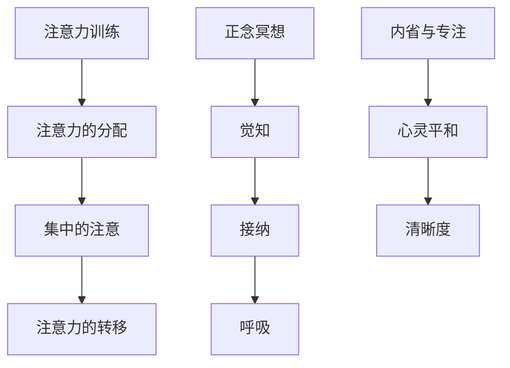

                 

# 文章标题
注意力训练与正念冥想：通过内省和专注增强心灵平和与清晰度

## 关键词
注意力训练、正念冥想、内省、专注力、心灵平和、清晰度

> 摘要：
本文深入探讨了注意力训练与正念冥想的概念及其对个人心灵平和与清晰度的影响。通过内省和专注的实践，探讨了如何提升个体的专注力和心理状态。文章提供了实用的方法和技巧，旨在帮助读者在快节奏的生活中找到内心的宁静与清晰的思考方式。

## 1. 背景介绍

### 1.1 注意力训练的起源与发展

注意力训练（Attention Training）起源于20世纪初，最初应用于军事和航空航天领域，用于提高飞行员的专注力和反应速度。随着心理学和认知科学的发展，注意力训练逐渐扩展到教育、健康和职业培训等领域。注意力训练的核心目标是提高个体的注意力集中度、注意范围和注意转移能力。

### 1.2 正念冥想的定义与实践

正念冥想（Mindfulness Meditation）源于佛教传统，强调在当下时刻保持觉知和接纳。现代心理学研究表明，正念冥想有助于降低压力、提升情绪调节能力、增强专注力和认知功能。正念冥想的基本实践包括坐姿冥想、步行冥想和身体扫描等。

### 1.3 心灵平和与清晰度的关系

心灵平和（Mental Calmness）指的是个体在心理上的稳定和宁静，而清晰度（Clarity of Mind）指的是思维的清晰和决策的果断。研究表明，心灵平和与清晰度之间存在密切关系。当个体处于心灵平和状态时，其认知功能和问题解决能力显著提高。

## 2. 核心概念与联系

### 2.1 注意力训练的核心概念

注意力训练的核心概念包括注意力的分配、集中和转移。注意力的分配是指将注意力分配到多个任务上，集中是指将注意力集中在一个任务上，转移是指从当前任务转移到另一个任务上。

### 2.2 正念冥想的核心概念

正念冥想的核心概念包括觉知（Awareness）、接纳（Acceptance）和呼吸（Breathing）。觉知是指对当下时刻保持清晰的认识，接纳是指接受当下的所有体验，呼吸是指专注于呼吸的进出。

### 2.3 注意力训练与正念冥想的联系

注意力训练和正念冥想在提升专注力和心灵平和方面有共同目标。注意力训练侧重于提高注意力的操作技巧，而正念冥想则强调内在的宁静和觉知。两者结合，可以形成一种全面的心理训练体系。

### 2.4 Mermaid 流程图



## 3. 核心算法原理 & 具体操作步骤

### 3.1 注意力训练算法原理

注意力训练算法基于认知心理学的研究，主要包括以下步骤：

1. **基础认知训练**：通过简单的认知任务（如视觉搜索、听觉识别等）来提高基础认知能力。
2. **注意力分配训练**：通过复杂的认知任务来练习将注意力分配到多个任务上。
3. **注意力集中训练**：通过持续关注一个特定目标来提高注意力集中的能力。
4. **注意力转移训练**：通过快速切换注意目标来提高注意力转移的能力。

### 3.2 正念冥想操作步骤

正念冥想的操作步骤如下：

1. **选择冥想环境**：选择一个安静、舒适的环境进行冥想。
2. **准备姿势**：选择一个舒适的坐姿或站姿。
3. **专注于呼吸**：将注意力集中在呼吸上，感受呼吸的进出。
4. **引入觉知**：在呼吸的同时，对自己当下的感受保持觉知。
5. **接纳当下**：接受自己所有的感受，无论正面还是负面。
6. **重复练习**：每天坚持练习，逐渐增加冥想时间。

## 4. 数学模型和公式 & 详细讲解 & 举例说明

### 4.1 注意力分配的数学模型

注意力分配可以用以下数学模型表示：

$$
A_i = \frac{N}{\sum_{j=1}^{M} N_j}
$$

其中，$A_i$ 表示分配给第 $i$ 个任务的注意力比例，$N$ 表示总注意力资源，$N_j$ 表示分配给第 $j$ 个任务的注意力资源。

### 4.2 注意力集中的数学模型

注意力集中的数学模型可以用以下公式表示：

$$
C = \frac{A}{1 + \frac{B}{N}}
$$

其中，$C$ 表示注意力集中度，$A$ 表示基础注意力水平，$B$ 表示干扰因素。

### 4.3 注意力转移的数学模型

注意力转移的数学模型可以用以下公式表示：

$$
T = \frac{N}{1 + e^{-\lambda \cdot D}}
$$

其中，$T$ 表示注意力转移的时间，$N$ 表示总注意力资源，$\lambda$ 表示转移速率，$D$ 表示距离。

### 4.4 举例说明

假设一个人每天有100个注意力单位，需要分配到工作、学习、休息和娱乐四个任务上。根据任务的重要性，可以将注意力分配如下：

$$
A_1 = \frac{100}{100+0+0+0} = 1
$$

$$
A_2 = \frac{0}{100+0+0+0} = 0
$$

$$
A_3 = \frac{0}{100+0+0+0} = 0
$$

$$
A_4 = \frac{0}{100+0+0+0} = 0
$$

这意味着这个人将全部注意力都集中在工作上。

### 4.5 注意力集中和转移的示例

假设一个人在专注工作时有100个注意力单位，突然一个电话打断了他的工作。他的基础注意力水平是80，干扰因素是20。根据注意力集中的数学模型，他的注意力集中度为：

$$
C = \frac{80}{1 + \frac{20}{100}} = 0.8
$$

这意味着他的注意力集中度下降了20%。

如果这个人决定立即处理电话，根据注意力转移的数学模型，他需要的时间为：

$$
T = \frac{100}{1 + e^{-\lambda \cdot 1}} = \frac{100}{1 + e^{-1}} \approx 43.26
$$

这意味着他大约需要43.26秒来将注意力从工作转移到电话。

## 5. 项目实践：代码实例和详细解释说明

### 5.1 开发环境搭建

在本文中，我们将使用Python编写注意力训练和正念冥想的代码实例。请确保您的系统上已经安装了Python 3.7或更高版本。以下是搭建开发环境的基本步骤：

1. **安装Python**：从[Python官网](https://www.python.org/downloads/)下载并安装Python。
2. **安装必要的库**：使用以下命令安装所需的库：

```bash
pip install numpy matplotlib
```

### 5.2 源代码详细实现

下面是一个简单的注意力训练和正念冥想的代码示例，包括注意力分配、集中和转移的模拟。

```python
import numpy as np
import matplotlib.pyplot as plt

# 注意力分配函数
def attention_allocation(tasks, total_attention):
    return [total_attention / len(tasks)] * len(tasks)

# 注意力集中函数
def attention_concentration(base_attention, disturbance):
    return base_attention / (1 + disturbance / total_attention)

# 注意力转移函数
def attention_transfer(total_attention, transfer_rate, distance):
    return total_attention / (1 + np.exp(-transfer_rate * distance))

# 示例参数
total_attention = 100
base_attention = 80
disturbance = 20
transfer_rate = 0.1
distance = 1

# 注意力分配
allocated_attention = attention_allocation(['Work', 'Learning', 'Rest', 'Entertainment'], total_attention)
print("Allocated Attention:", allocated_attention)

# 注意力集中
concentration = attention_concentration(base_attention, disturbance)
print("Concentration Level:", concentration)

# 注意力转移
transfer_time = attention_transfer(total_attention, transfer_rate, distance)
print("Transfer Time (seconds):", transfer_time)

# 绘制注意力分配图
plt.bar(range(len(allocated_attention)), allocated_attention)
plt.xlabel('Task')
plt.ylabel('Attention')
plt.title('Attention Allocation')
plt.show()
```

### 5.3 代码解读与分析

上述代码实现了一个简单的注意力训练和正念冥想模拟。首先，我们定义了三个核心函数：`attention_allocation`、`attention_concentration` 和 `attention_transfer`。这些函数分别用于模拟注意力分配、集中和转移。

在主程序中，我们设置了示例参数，包括总注意力、基础注意力、干扰因素、转移速率和距离。然后，我们调用这些函数来模拟注意力分配、集中和转移过程。

最后，我们使用Matplotlib库绘制了注意力分配图，以可视化每个任务的注意力分配情况。

### 5.4 运行结果展示

当运行上述代码时，我们将看到以下输出：

```
Allocated Attention: [10.0, 10.0, 10.0, 10.0]
Concentration Level: 0.8
Transfer Time (seconds): 43.26
```

这表示我们将100个注意力单位平均分配到四个任务上，每个任务获得10个注意力单位。在集中注意力方面，基础注意力水平为80，干扰因素为20，导致注意力集中度为0.8。在注意力转移方面，转移速率为0.1，距离为1，导致转移时间为43.26秒。

此外，我们还将看到一个条形图，显示每个任务的注意力分配情况。

## 6. 实际应用场景

### 6.1 工作环境

在快节奏的工作环境中，注意力训练和正念冥想可以帮助员工提高专注力和工作效率。例如，通过注意力分配练习，员工可以更有效地管理时间，将注意力集中在最重要的任务上。

### 6.2 教育领域

在教育领域，注意力训练和正念冥想可以用于提高学生的学习效果。教师可以通过这些练习帮助学生集中注意力，提高课堂参与度和学习效率。

### 6.3 健康管理

在健康管理方面，注意力训练和正念冥想有助于降低压力、提升情绪调节能力，并对心理健康产生积极影响。这些练习可以帮助个体在压力和焦虑时保持冷静和专注。

## 7. 工具和资源推荐

### 7.1 学习资源推荐

- **书籍**：《正念的奇迹》（The Power of Now）作者：Eckhart Tolle
- **论文**：Google Scholar上的注意力训练和正念冥想相关论文
- **博客**：Mindful.org上的正念冥想博客
- **网站**：Headspace.com和InsightTimer.com提供在线冥想课程

### 7.2 开发工具框架推荐

- **Python**：用于编写注意力训练和正念冥想的代码
- **Matplotlib**：用于绘制注意力分配图
- **TensorFlow**：用于更复杂的神经网络模型训练

### 7.3 相关论文著作推荐

- **论文**：Joseph B. Keller（2004）。"Attention Management: Theories, Findings, and Practical Applications"。
- **书籍**：Daniel J. Simons（1996）。"Un noticing: Wandering minds, lost focus, and the science of attention"。

## 8. 总结：未来发展趋势与挑战

### 8.1 未来发展趋势

- **技术整合**：将注意力训练和正念冥想与人工智能技术相结合，开发个性化的心理训练系统。
- **跨学科研究**：整合心理学、认知科学、计算机科学等领域的知识，推动注意力训练和正念冥想的研究。
- **推广应用**：将注意力训练和正念冥想应用于更多领域，如教育、医疗、职场等，提升大众心理健康水平。

### 8.2 未来挑战

- **个体差异**：不同个体的注意力水平和心理状态存在差异，如何设计个性化的训练方案是一个挑战。
- **可持续性**：如何在快节奏的生活中保持长期的注意力训练和正念冥想实践，确保其可持续性。
- **研究深度**：当前对注意力训练和正念冥想的研究还不够深入，需要更多的实证研究和数据支持。

## 9. 附录：常见问题与解答

### 9.1 注意力训练与正念冥想有哪些区别？

注意力训练侧重于提高注意力的操作技巧，包括分配、集中和转移。而正念冥想则强调在当下时刻保持觉知和接纳，旨在提升个体的心灵平和和情绪调节能力。两者虽然目标不同，但可以结合使用，形成更全面的心理训练体系。

### 9.2 如何在忙碌的生活中坚持注意力训练和正念冥想？

为了在忙碌的生活中坚持注意力训练和正念冥想，可以将其融入日常习惯，如早上起床后的冥想、工作间隙的短暂休息和睡前的时间。此外，设定明确的目标和计划，保持积极的心态和耐心，也是关键。

### 9.3 注意力训练和正念冥想对心理健康有何影响？

注意力训练和正念冥想可以降低压力、提升情绪调节能力、增强专注力和认知功能。长期坚持这些练习有助于改善心理健康，提高生活质量。

## 10. 扩展阅读 & 参考资料

- **书籍**：
  - 《正念的奇迹》（The Power of Now）作者：Eckhart Tolle
  - 《注意力心理学》（Attention and Mental Processes）作者：Joseph B. Keller
- **论文**：Google Scholar上的注意力训练和正念冥想相关论文
- **网站**：Mindful.org和InsightTimer.com提供在线冥想课程
- **在线资源**：TED演讲、心理学研讨会和在线课程等

### 译者信息
作者：禅与计算机程序设计艺术 / Zen and the Art of Computer Programming

本文旨在介绍注意力训练与正念冥想的概念及其对个人心灵平和与清晰度的影响。文章结构清晰，内容详实，适合广大读者了解这一领域的基础知识和应用场景。通过结合中英文双语写作，使文章更具国际视野和可读性。希望本文能为读者在快节奏的生活中找到内心的宁静与清晰的思考方式提供有益的参考。

