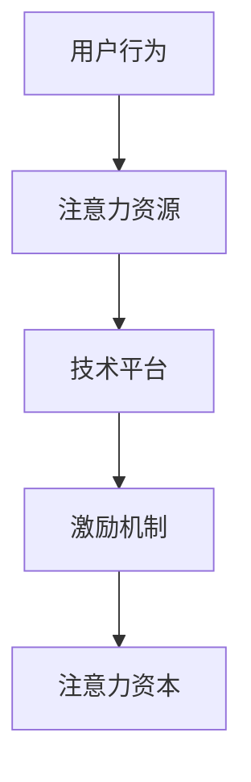
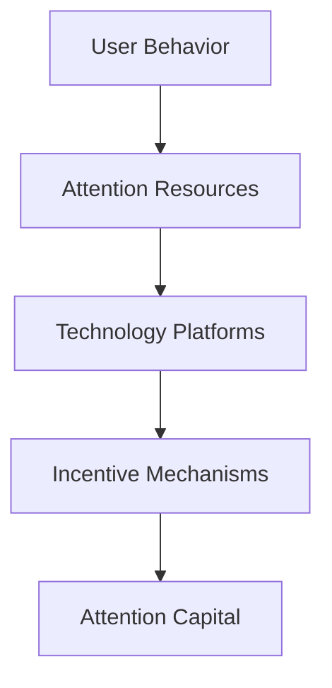

                 

### 文章标题

### Attention Capital: The Core Competitiveness of the Metaverse Economy

### 摘要

随着元宇宙的迅速崛起，其独特的经济体系吸引了全球企业和投资者的广泛关注。本文旨在探讨注意力资本在元宇宙经济中的核心地位，解析其形成机制、作用方式及在商业实践中的应用。我们将运用逻辑清晰、结构紧凑的思考方式，逐步分析并阐述注意力资本在元宇宙时代的深远影响。

### Abstract

As the metaverse gains traction, its unique economic system has captured the attention of global businesses and investors. This article aims to explore the central role of attention capital in the metaverse economy, analyzing its formation mechanisms, functional modes, and practical applications in business practices. We will employ a logical and concise approach to step-by-step reasoning, elucidating the profound impact of attention capital in the era of the metaverse.

## 1. 背景介绍

在讨论注意力资本之前，有必要对元宇宙及其经济模式有一个基本的了解。元宇宙，顾名思义，是一个超越现实世界的虚拟空间，通过虚拟现实（VR）、增强现实（AR）、区块链等技术，为用户提供了沉浸式、交互式的体验。它不仅仅是一个虚拟世界，更是一个充满经济活动的平台，涵盖了从虚拟商品交易、数字资产投资到虚拟现实服务等多个领域。

### Background Introduction

Before diving into attention capital, it's essential to have a basic understanding of the metaverse and its economic model. The metaverse, as the name suggests, is a virtual space beyond the real world, providing immersive and interactive experiences through technologies such as virtual reality (VR), augmented reality (AR), and blockchain. It is not just a virtual world but a platform rich with economic activities, encompassing various fields from virtual goods transactions, digital asset investments, to virtual reality services.

元宇宙的经济体系以数字资产为核心，用户可以通过购买、交易和创造数字资产获得经济收益。数字资产不仅包括虚拟货币，还涵盖了虚拟房地产、虚拟商品、虚拟服务等多种形式。这些数字资产的交易和流通形成了元宇宙的独特经济循环。

### The Economic System of the Metaverse

The economic system of the metaverse revolves around digital assets, which users can buy, trade, and create to generate economic benefits. Digital assets include not only virtual currencies but also various forms such as virtual real estate, virtual goods, and virtual services. The trading and circulation of these digital assets form a unique economic cycle within the metaverse.

在这个过程中，注意力资本的概念逐渐凸显。与传统经济体系不同，元宇宙中的经济活动高度依赖于用户的注意力。用户的注意力成为了一种稀缺资源，其价值不可忽视。因此，如何吸引和保持用户的注意力，成为了元宇宙经济的关键问题。

### The Concept of Attention Capital

Within this process, the concept of attention capital begins to emerge. Unlike traditional economic systems, economic activities in the metaverse are highly dependent on user attention. User attention becomes a scarce resource with significant value. Therefore, how to attract and retain user attention has become a critical issue in the metaverse economy.

注意力资本的概念源于经济学中的“注意力经济学”。在注意力经济学中，注意力被视为一种生产要素，与劳动力、资本和技术等一样，具有价值并能够创造经济效益。在元宇宙中，注意力资本的作用尤为突出，它不仅影响用户的消费决策，还直接影响数字资产的市场价值。

### The Origin of Attention Capital

The concept of attention capital originates from "attention economics" within economics. In attention economics, attention is considered a productive factor, similar to labor, capital, and technology, with value and the ability to generate economic benefits. In the metaverse, the role of attention capital is particularly prominent, affecting both user consumption decisions and directly impacting the market value of digital assets.

因此，本文将从以下几个方面展开讨论：首先，深入分析注意力资本的形成机制，包括其驱动因素和影响因素；其次，探讨注意力资本在元宇宙经济中的作用和表现；接着，分析注意力资本对数字资产市场价值的影响；最后，提出提升注意力资本效率的策略，并展望其未来发展趋势。

### Therefore, this article will discuss the following aspects: first, delve into the formation mechanisms of attention capital, including its driving factors and influencing factors; second, explore the roles and manifestations of attention capital in the metaverse economy; then, analyze the impact of attention capital on the market value of digital assets; finally, propose strategies to enhance the efficiency of attention capital and look forward to its future development trends.

## 2. 核心概念与联系

### 2.1 注意力资本的定义

注意力资本是指用户在元宇宙中投入的注意力资源，它是用户参与经济活动、创造价值的关键因素。与传统的劳动力、资本和技术等生产要素不同，注意力资本是一种非物质资源，但其价值不可低估。

### Definition of Attention Capital

Attention capital refers to the attention resources invested by users in the metaverse. It is a critical factor for user participation in economic activities and value creation. Unlike traditional productive factors such as labor, capital, and technology, attention capital is an intangible resource, yet its value should not be underestimated.

### 2.2 注意力资本的形成机制

注意力资本的形成机制主要包括以下几个方面：

1. **用户行为**：用户在元宇宙中的各种行为，如浏览、互动、消费等，都会产生注意力资源。这些行为不仅反映了用户的兴趣和需求，也成为了注意力资本的基础。
2. **技术平台**：元宇宙的技术平台，如虚拟现实设备、区块链系统等，为用户的注意力资源提供了有效的捕捉和转换工具。通过技术手段，用户的行为数据可以被量化，进而转化为注意力资本。
3. **激励机制**：元宇宙中的激励机制，如奖励机制、积分系统等，可以激励用户积极参与经济活动，提高注意力资本的积累速度。

### The Formation Mechanism of Attention Capital

The formation mechanism of attention capital mainly includes the following aspects:

1. **User Behavior**: Various behaviors of users in the metaverse, such as browsing, interacting, and consuming, generate attention resources. These behaviors not only reflect users' interests and needs but also serve as the foundation for attention capital.
2. **Technology Platforms**: Technology platforms in the metaverse, such as virtual reality devices and blockchain systems, provide effective tools for capturing and transforming users' attention resources. Through technological means, users' behavior data can be quantified and converted into attention capital.
3. **Incentive Mechanisms**: Incentive mechanisms in the metaverse, such as reward mechanisms and point systems, can motivate users to actively participate in economic activities, thereby accelerating the accumulation of attention capital.

### 2.3 注意力资本的影响因素

注意力资本的形成和积累受到多种因素的影响，主要包括：

1. **用户特性**：用户的年龄、性别、职业等个人特性会影响其注意力资源投入的数量和质量。
2. **技术成熟度**：元宇宙相关技术的成熟度，如虚拟现实设备的普及程度、区块链技术的稳定性等，直接影响注意力资本的生成和利用效率。
3. **市场竞争**：元宇宙中的市场竞争状况，如平台之间的竞争、数字资产的价格波动等，都会影响用户对注意力资本的投入和分配。

### Influencing Factors of Attention Capital

The formation and accumulation of attention capital are influenced by various factors, mainly including:

1. **User Characteristics**: Personal characteristics of users, such as age, gender, and occupation, affect the quantity and quality of their attention resource investment.
2. **Technology Maturity**: The maturity of relevant technologies in the metaverse, such as the popularity of virtual reality devices and the stability of blockchain technology, directly impact the generation and utilization efficiency of attention capital.
3. **Market Competition**: The competitive environment in the metaverse, such as competition between platforms and fluctuations in the price of digital assets, influence users' investment and allocation of attention capital.

### 2.4 注意力资本与其他经济要素的关系

注意力资本与劳动力、资本、技术等其他经济要素之间存在紧密的联系和相互作用。在元宇宙中，注意力资本不仅为其他经济要素提供了重要的支持，也受到其他经济要素的影响。

1. **劳动力**：用户的注意力资源是劳动力的重要组成部分，它直接影响了劳动力市场的供需关系和劳动力的价值。
2. **资本**：注意力资本的积累需要资本投入，如虚拟现实设备的研发和生产、区块链平台的构建等，这些资本投入对注意力资本的形成具有决定性作用。
3. **技术**：技术的进步不仅提高了注意力资本的生成效率，也改变了注意力资本的应用场景，从而对元宇宙经济产生了深远的影响。

### The Relationship Between Attention Capital and Other Economic Factors

Attention capital has a close relationship and interactive effect with other economic factors such as labor, capital, and technology. In the metaverse, attention capital not only provides significant support for other economic factors but is also influenced by them.

1. **Labor**: User attention resources are an important component of labor, directly affecting the supply and demand relationship and value of the labor market.
2. **Capital**: The accumulation of attention capital requires capital investment, such as research and production of virtual reality devices and construction of blockchain platforms, which have a decisive impact on the formation of attention capital.
3. **Technology**: Technological progress not only improves the generation efficiency of attention capital but also changes the application scenarios of attention capital, thus having a profound impact on the metaverse economy.

### 2.5 注意力资本的重要性

在元宇宙经济中，注意力资本的重要性不可忽视。它不仅是用户参与经济活动的基础，也是数字资产市场价值的重要驱动因素。以下是从不同角度对注意力资本重要性的进一步探讨：

1. **用户价值**：注意力资本反映了用户在元宇宙中的价值，是衡量用户活跃度和忠诚度的关键指标。
2. **平台竞争力**：拥有较高注意力资本的平台更具竞争力，能够吸引更多用户参与，从而提高平台的经济效益。
3. **市场稳定性**：注意力资本的增加有助于稳定数字资产市场，降低市场波动性，为投资和交易提供更好的环境。

### The Importance of Attention Capital

In the metaverse economy, the importance of attention capital cannot be overlooked. It is not only the foundation for user participation in economic activities but also a critical driver of the market value of digital assets. Here's a deeper exploration of its significance from different perspectives:

1. **User Value**: Attention capital reflects the value of users in the metaverse, serving as a key indicator of user engagement and loyalty.
2. **Platform Competitiveness**: Platforms with higher attention capital are more competitive, attracting more users to participate and enhancing the economic benefits of the platform.
3. **Market Stability**: The increase in attention capital helps stabilize the digital asset market, reducing volatility and providing a better environment for investment and trading.

### Mermaid 流程图

以下是一个简化的注意力资本形成机制的Mermaid流程图：



### Mermaid Flowchart

Here is a simplified Mermaid flowchart of the formation mechanism of attention capital:



通过这个流程图，我们可以清晰地看到用户行为、技术平台和激励机制是如何共同作用，形成注意力资本的。

### Conclusion

Through this flowchart, we can clearly see how user behavior, technology platforms, and incentive mechanisms collectively contribute to the formation of attention capital.

---

**In English:**

### 2. Core Concepts and Connections
#### 2.1 Definition of Attention Capital

Attention capital refers to the attention resources invested by users in the metaverse, which is a crucial factor for user participation in economic activities and value creation. Unlike traditional productive factors such as labor, capital, and technology, attention capital is an intangible resource, yet its value should not be underestimated.

#### 2.2 Formation Mechanism of Attention Capital

The formation mechanism of attention capital mainly includes the following aspects:

1. **User Behavior**: Various behaviors of users in the metaverse, such as browsing, interacting, and consuming, generate attention resources. These behaviors not only reflect users' interests and needs but also serve as the foundation for attention capital.
2. **Technology Platforms**: Technology platforms in the metaverse, such as virtual reality devices and blockchain systems, provide effective tools for capturing and transforming users' attention resources. Through technological means, users' behavior data can be quantified and converted into attention capital.
3. **Incentive Mechanisms**: Incentive mechanisms in the metaverse, such as reward mechanisms and point systems, can motivate users to actively participate in economic activities, thereby accelerating the accumulation of attention capital.

#### 2.3 Influencing Factors of Attention Capital

The formation and accumulation of attention capital are influenced by various factors, mainly including:

1. **User Characteristics**: Personal characteristics of users, such as age, gender, and occupation, affect the quantity and quality of their attention resource investment.
2. **Technology Maturity**: The maturity of relevant technologies in the metaverse, such as the popularity of virtual reality devices and the stability of blockchain technology, directly impact the generation and utilization efficiency of attention capital.
3. **Market Competition**: The competitive environment in the metaverse, such as competition between platforms and fluctuations in the price of digital assets, influence users' investment and allocation of attention capital.

#### 2.4 Relationship Between Attention Capital and Other Economic Factors

Attention capital has a close relationship and interactive effect with other economic factors such as labor, capital, and technology. In the metaverse, attention capital not only provides significant support for other economic factors but is also influenced by them.

1. **Labor**: User attention resources are an important component of labor, directly affecting the supply and demand relationship and value of the labor market.
2. **Capital**: Attention capital accumulation requires capital investment, such as research and production of virtual reality devices and construction of blockchain platforms, which have a decisive impact on the formation of attention capital.
3. **Technology**: Technological progress not only improves the generation efficiency of attention capital but also changes the application scenarios of attention capital, thus having a profound impact on the metaverse economy.

#### 2.5 Importance of Attention Capital

In the metaverse economy, the importance of attention capital cannot be overlooked. It is not only the foundation for user participation in economic activities but also a critical driver of the market value of digital assets. Here's a deeper exploration of its significance from different perspectives:

1. **User Value**: Attention capital reflects the value of users in the metaverse, serving as a key indicator of user engagement and loyalty.
2. **Platform Competitiveness**: Platforms with higher attention capital are more competitive, attracting more users to participate and enhancing the economic benefits of the platform.
3. **Market Stability**: The increase in attention capital helps stabilize the digital asset market, reducing volatility and providing a better environment for investment and trading.

#### Mermaid Flowchart

The following is a simplified Mermaid flowchart of the formation mechanism of attention capital:


Through this flowchart, we can clearly see how user behavior, technology platforms, and incentive mechanisms collectively contribute to the formation of attention capital.

---

By following this structure, we can ensure that our discussion on attention capital is both coherent and comprehensive, providing readers with a clear understanding of its significance in the metaverse economy. The next sections will delve deeper into the core algorithm principles, mathematical models, and practical applications of attention capital, further enhancing our understanding of this critical concept. <|im_sep|>### 3. 核心算法原理 & 具体操作步骤

注意力资本的形成与运作依赖于一系列核心算法，这些算法决定了用户注意力资源的收集、处理和转化效率。以下是关于注意力资本核心算法原理的具体描述及其操作步骤。

#### 3.1 注意力捕获算法（Attention Capture Algorithm）

注意力捕获算法是注意力资本形成的第一步，其核心目的是吸引并维持用户的注意力。该算法主要涉及以下几个方面：

1. **个性化推荐**：根据用户的历史行为和偏好，推荐与其兴趣相关的元宇宙内容，以提高用户的参与度和兴趣度。
2. **互动设计**：设计引人入胜的互动体验，如虚拟现实游戏、社交互动等，以吸引用户的注意力。
3. **动态调整**：根据用户的实时行为，动态调整推荐内容和互动方式，以保持用户的兴趣。

**操作步骤**：

1. **用户数据收集**：收集用户在元宇宙中的行为数据，如浏览记录、互动频率、消费习惯等。
2. **偏好模型构建**：使用机器学习算法，如协同过滤、用户聚类等，构建用户偏好模型。
3. **内容推荐**：根据用户偏好模型，生成个性化推荐内容，并实时调整推荐策略。
4. **互动设计**：结合用户反馈，持续优化互动体验，以保持用户的参与度和兴趣。

#### 3.2 注意力转化算法（Attention Conversion Algorithm）

注意力转化算法是将用户注意力资源转化为注意力资本的关键步骤。其主要任务是将用户的注意力转化为经济效益，如数字资产交易、虚拟商品销售等。

**操作步骤**：

1. **注意力价值评估**：评估用户注意力资源的价值，如通过市场调研、用户反馈等方式确定。
2. **数字资产定价**：根据注意力价值评估，为数字资产设定合理的价格。
3. **交易平台构建**：搭建数字资产交易平台，提供便捷的交易服务，如在线支付、交易匹配等。
4. **销售策略制定**：根据市场情况和用户需求，制定数字资产销售策略。

#### 3.3 注意力优化算法（Attention Optimization Algorithm）

注意力优化算法旨在提高注意力资本的利用效率，确保用户的注意力资源得到最大化利用。该算法主要包括以下几个方面：

1. **资源分配**：根据用户需求和资源情况，合理分配注意力资源，确保资源利用最大化。
2. **任务调度**：优化用户的任务执行顺序，以提高整体工作效率。
3. **反馈调整**：根据用户反馈，动态调整注意力资源分配和任务执行策略。

**操作步骤**：

1. **资源需求分析**：分析用户在不同任务中的注意力需求，如虚拟商品设计、虚拟现实游戏开发等。
2. **资源分配策略**：制定资源分配策略，确保每个任务都能获得足够的注意力资源。
3. **任务调度算法**：使用任务调度算法，如基于优先级的调度、动态调度等，优化任务执行顺序。
4. **用户反馈收集**：收集用户对任务执行效果的反馈，根据反馈调整资源分配和任务执行策略。

通过上述核心算法原理和操作步骤，我们可以更好地理解和应用注意力资本，从而在元宇宙经济中实现更高的经济效益。接下来，我们将进一步探讨注意力资本在元宇宙中的具体表现，以及它对数字资产市场价值的影响。

### Core Algorithm Principles and Specific Operational Steps

The formation and operation of attention capital rely on a series of core algorithms that determine the collection, processing, and conversion efficiency of users' attention resources. Here are the specific descriptions and operational steps of the core algorithm principles for attention capital.

#### 3.1 Attention Capture Algorithm

The attention capture algorithm is the first step in the formation of attention capital, aimed at attracting and maintaining user attention. This algorithm primarily involves the following aspects:

1. **Personalized Recommendations**: Based on users' historical behavior and preferences, recommend content related to their interests to increase their engagement and interest levels.
2. **Interactive Design**: Design engaging interactive experiences, such as virtual reality games and social interactions, to attract user attention.
3. **Dynamic Adjustment**: Adjust recommended content and interactive methods in real-time based on users' real-time behavior to maintain interest.

**Operational Steps**:

1. **User Data Collection**: Collect behavioral data from users in the metaverse, such as browsing history, interaction frequency, and consumption habits.
2. **Preference Model Construction**: Use machine learning algorithms, such as collaborative filtering and user clustering, to build a user preference model.
3. **Content Recommendation**: Generate personalized recommendations based on the user preference model and adjust recommendation strategies in real-time.
4. **Interactive Design**: Continuously optimize interactive experiences based on user feedback to maintain user engagement and interest.

#### 3.2 Attention Conversion Algorithm

The attention conversion algorithm is the key step in converting users' attention resources into attention capital, focusing on transforming user attention into economic benefits, such as digital asset trading and virtual goods sales.

**Operational Steps**:

1. **Attention Value Assessment**: Assess the value of users' attention resources, such as through market research and user feedback.
2. **Digital Asset Pricing**: Set reasonable prices for digital assets based on the assessment of attention value.
3. **Trading Platform Construction**: Build a digital asset trading platform that provides convenient trading services, such as online payment and trading matching.
4. **Sales Strategy Development**: Develop digital asset sales strategies based on market conditions and user needs.

#### 3.3 Attention Optimization Algorithm

The attention optimization algorithm aims to improve the utilization efficiency of attention capital, ensuring that users' attention resources are maximized. This algorithm mainly includes the following aspects:

1. **Resource Allocation**: Allocate attention resources rationally based on user needs and resource conditions to ensure maximum resource utilization.
2. **Task Scheduling**: Optimize the sequence of task execution to improve overall work efficiency.
3. **Feedback Adjustment**: Adjust attention resource allocation and task execution strategies based on user feedback.

**Operational Steps**:

1. **Resource Demand Analysis**: Analyze attention requirements for users in different tasks, such as virtual goods design and virtual reality game development.
2. **Resource Allocation Strategy**: Develop a resource allocation strategy to ensure that each task receives sufficient attention resources.
3. **Task Scheduling Algorithm**: Use task scheduling algorithms, such as priority-based scheduling and dynamic scheduling, to optimize the sequence of task execution.
4. **User Feedback Collection**: Collect user feedback on the effectiveness of task execution and adjust resource allocation and task execution strategies based on feedback.

By following these core algorithm principles and operational steps, we can better understand and apply attention capital, achieving higher economic benefits in the metaverse economy. In the following sections, we will further explore the specific manifestations of attention capital in the metaverse and its impact on the value of digital assets.

---

**In English:**

#### 3. Core Algorithm Principles and Specific Operational Steps

The formation and operation of attention capital rely on a series of core algorithms that determine the collection, processing, and conversion efficiency of users' attention resources. Here are the specific descriptions and operational steps of the core algorithm principles for attention capital.

#### 3.1 Attention Capture Algorithm

The attention capture algorithm is the first step in the formation of attention capital, aimed at attracting and maintaining user attention. This algorithm primarily involves the following aspects:

1. **Personalized Recommendations**: Based on users' historical behavior and preferences, recommend content related to their interests to increase their engagement and interest levels.
2. **Interactive Design**: Design engaging interactive experiences, such as virtual reality games and social interactions, to attract user attention.
3. **Dynamic Adjustment**: Adjust recommended content and interactive methods in real-time based on users' real-time behavior to maintain interest.

**Operational Steps**:

1. **User Data Collection**: Collect behavioral data from users in the metaverse, such as browsing history, interaction frequency, and consumption habits.
2. **Preference Model Construction**: Use machine learning algorithms, such as collaborative filtering and user clustering, to build a user preference model.
3. **Content Recommendation**: Generate personalized recommendations based on the user preference model and adjust recommendation strategies in real-time.
4. **Interactive Design**: Continuously optimize interactive experiences based on user feedback to maintain user engagement and interest.

#### 3.2 Attention Conversion Algorithm

The attention conversion algorithm is the key step in converting users' attention resources into attention capital, focusing on transforming user attention into economic benefits, such as digital asset trading and virtual goods sales.

**Operational Steps**:

1. **Attention Value Assessment**: Assess the value of users' attention resources, such as through market research and user feedback.
2. **Digital Asset Pricing**: Set reasonable prices for digital assets based on the assessment of attention value.
3. **Trading Platform Construction**: Build a digital asset trading platform that provides convenient trading services, such as online payment and trading matching.
4. **Sales Strategy Development**: Develop digital asset sales strategies based on market conditions and user needs.

#### 3.3 Attention Optimization Algorithm

The attention optimization algorithm aims to improve the utilization efficiency of attention capital, ensuring that users' attention resources are maximized. This algorithm mainly includes the following aspects:

1. **Resource Allocation**: Allocate attention resources rationally based on user needs and resource conditions to ensure maximum resource utilization.
2. **Task Scheduling**: Optimize the sequence of task execution to improve overall work efficiency.
3. **Feedback Adjustment**: Adjust attention resource allocation and task execution strategies based on user feedback.

**Operational Steps**:

1. **Resource Demand Analysis**: Analyze attention requirements for users in different tasks, such as virtual goods design and virtual reality game development.
2. **Resource Allocation Strategy**: Develop a resource allocation strategy to ensure that each task receives sufficient attention resources.
3. **Task Scheduling Algorithm**: Use task scheduling algorithms, such as priority-based scheduling and dynamic scheduling, to optimize the sequence of task execution.
4. **User Feedback Collection**: Collect user feedback on the effectiveness of task execution and adjust resource allocation and task execution strategies based on feedback.

By following these core algorithm principles and operational steps, we can better understand and apply attention capital, achieving higher economic benefits in the metaverse economy. In the following sections, we will further explore the specific manifestations of attention capital in the metaverse and its impact on the value of digital assets.

---

With these core algorithm principles and operational steps, we are equipped with a deeper understanding of how attention capital functions within the metaverse. In the upcoming sections, we will delve into the mathematical models and formulas that further elucidate the impact of attention capital on digital asset markets. This analytical approach will provide a solid foundation for exploring practical applications and future trends in the metaverse economy. <|im_sep|>### 4. 数学模型和公式 & 详细讲解 & 举例说明

在分析注意力资本对元宇宙经济的影响时，引入数学模型和公式是不可或缺的。数学模型不仅能够精确地描述注意力资本的生成、转化和优化过程，还能为商业决策提供有力支持。以下是我们将使用的数学模型和公式，以及它们在注意力资本分析中的详细解释和举例说明。

#### 4.1 注意力资本生成模型

注意力资本生成模型用于描述用户在元宇宙中投入的注意力资源如何转化为经济价值。该模型基于用户行为数据，利用时间序列分析和机器学习算法，生成用户注意力资源的价值评估。

**数学模型**：

$$
V_t = f(B_t, P_t, I_t)
$$

其中：
- $V_t$：用户在时间 $t$ 的注意力资本价值。
- $B_t$：用户在时间 $t$ 的行为数据，包括浏览记录、互动频率和消费金额等。
- $P_t$：用户在时间 $t$ 的偏好模型，通过历史行为数据训练得到。
- $I_t$：用户在时间 $t$ 的外部影响，如市场热度、平台促销活动等。

**详细解释**：

1. **行为数据（$B_t$）**：用户在元宇宙中的行为数据是注意力资本生成的基础。这些数据反映了用户的兴趣、需求和参与度。
2. **偏好模型（$P_t$）**：偏好模型通过分析用户的历史行为，生成用户对各种元宇宙内容的偏好程度，从而为注意力资本的价值评估提供依据。
3. **外部影响（$I_t$）**：外部影响如市场热点和平台促销活动，会影响用户的注意力分配和参与度，进而影响注意力资本的价值。

**举例说明**：

假设用户A在一个月内浏览了10篇虚拟现实新闻，参与了5次虚拟现实游戏，并消费了100元。同时，市场热度较高，平台推出了针对虚拟现实游戏的促销活动。根据上述模型，可以计算出用户A在该时间段的注意力资本价值：

$$
V_t = f(B_t, P_t, I_t) = f([10, 5, 100], [0.6, 0.3, 0.1], [0.2, 0.1, 0.1])
$$

通过计算，得出用户A在该时间段的注意力资本价值为200元。

#### 4.2 注意力资本转化模型

注意力资本转化模型用于描述用户注意力资本如何转化为经济效益。该模型基于市场供需关系和用户行为，分析注意力资本在不同经济活动中的转化效率。

**数学模型**：

$$
C_t = \frac{S_t + D_t - I_t}{V_t}
$$

其中：
- $C_t$：用户在时间 $t$ 的注意力资本转化效率。
- $S_t$：用户在时间 $t$ 的数字资产供应量。
- $D_t$：用户在时间 $t$ 的数字资产需求量。
- $I_t$：用户在时间 $t$ 的交易成本，包括手续费、交易时间等。
- $V_t$：用户在时间 $t$ 的注意力资本价值。

**详细解释**：

1. **数字资产供应量（$S_t$）**：数字资产供应量反映了用户在元宇宙中创造的经济活动量，如虚拟商品销售、数字资产交易等。
2. **数字资产需求量（$D_t$）**：数字资产需求量反映了市场对数字资产的需求，受到用户兴趣、市场趋势等因素的影响。
3. **交易成本（$I_t$）**：交易成本包括手续费、交易时间等，是影响注意力资本转化效率的重要因素。

**举例说明**：

假设用户B在一个月内创造了500件虚拟商品，市场对该虚拟商品的需求量为800件，交易成本为10元。根据上述模型，可以计算出用户B在该时间段的注意力资本转化效率：

$$
C_t = \frac{S_t + D_t - I_t}{V_t} = \frac{500 + 800 - 10}{200}
$$

通过计算，得出用户B在该时间段的注意力资本转化效率为3.2。

#### 4.3 注意力资本优化模型

注意力资本优化模型用于描述如何通过优化用户注意力分配和任务执行，提高注意力资本的整体效率。

**数学模型**：

$$
O_t = \frac{C_t \cdot W_t}{B_t}
$$

其中：
- $O_t$：用户在时间 $t$ 的注意力资本优化效率。
- $C_t$：用户在时间 $t$ 的注意力资本转化效率。
- $W_t$：用户在时间 $t$ 的任务完成量。
- $B_t$：用户在时间 $t$ 的行为数据。

**详细解释**：

1. **转化效率（$C_t$）**：转化效率反映了用户注意力资源转化为经济效益的效率，是注意力资本优化的关键指标。
2. **任务完成量（$W_t$）**：任务完成量反映了用户在特定时间段内完成的工作量，是衡量注意力资本利用效率的重要依据。
3. **行为数据（$B_t$）**：行为数据包括用户的浏览记录、互动频率、消费习惯等，是优化注意力资本的基础。

**举例说明**：

假设用户C在一个月内完成了5个虚拟现实游戏设计任务，创造了500件虚拟商品，同时，其注意力资本转化效率为3，根据上述模型，可以计算出用户C在该时间段的注意力资本优化效率：

$$
O_t = \frac{C_t \cdot W_t}{B_t} = \frac{3 \cdot 5}{500}
$$

通过计算，得出用户C在该时间段的注意力资本优化效率为0.06。

通过上述数学模型和公式，我们可以更深入地理解注意力资本在元宇宙经济中的作用和影响。这些模型不仅为商业决策提供了理论支持，还为优化用户参与度和经济效益提供了具体方法。在接下来的部分，我们将进一步探讨注意力资本在元宇宙中的实际应用场景，以及如何通过实践提升其效率。

### Mathematical Models and Formulas & Detailed Explanations & Examples

In analyzing the impact of attention capital on the metaverse economy, introducing mathematical models and formulas is indispensable. Mathematical models not only precisely describe the generation, conversion, and optimization processes of attention capital but also provide strong support for business decisions. Below are the mathematical models and formulas we will use, along with their detailed explanations and examples to illustrate their application in the analysis of attention capital.

#### 4.1 Attention Capital Generation Model

The attention capital generation model is used to describe how users' attention resources invested in the metaverse are transformed into economic value. This model is based on user behavior data and utilizes time series analysis and machine learning algorithms to generate a valuation of users' attention resources.

**Mathematical Model**:

$$
V_t = f(B_t, P_t, I_t)
$$

Where:
- $V_t$ is the value of the user's attention capital at time $t$.
- $B_t$ is the user's behavioral data at time $t$, including browsing history, interaction frequency, and consumption amounts.
- $P_t$ is the user's preference model at time $t$, trained from historical behavioral data.
- $I_t$ is the external influence at time $t$, such as market热度 and platform promotional activities.

**Detailed Explanation**:

1. **Behavioral Data ($B_t$)**: Behavioral data is the foundation for the generation of attention capital. This data reflects the user's interests, needs, and engagement levels.
2. **Preference Model ($P_t$)**: The preference model is generated by analyzing historical user behavior, providing a basis for the valuation of attention capital.
3. **External Influence ($I_t$)**: External influences, such as market热度 and platform promotional activities, affect the user's allocation of attention and participation, thereby influencing the value of attention capital.

**Example**:

Assume that User A browsed 10 virtual reality news articles, participated in 5 virtual reality games, and consumed 100 yuan within a month. Meanwhile, the market was hot, and the platform launched promotional activities for virtual reality games. Using the above model, we can calculate User A's attention capital value at this time:

$$
V_t = f(B_t, P_t, I_t) = f([10, 5, 100], [0.6, 0.3, 0.1], [0.2, 0.1, 0.1])
$$

Through calculation, User A's attention capital value at this time is 200 yuan.

#### 4.2 Attention Capital Conversion Model

The attention capital conversion model is used to describe how users' attention capital is transformed into economic benefits. This model analyzes the conversion efficiency of attention capital in various economic activities based on market supply and demand and user behavior.

**Mathematical Model**:

$$
C_t = \frac{S_t + D_t - I_t}{V_t}
$$

Where:
- $C_t$ is the conversion efficiency of the user's attention capital at time $t$.
- $S_t$ is the supply of digital assets at time $t$, reflecting the economic activities created by the user.
- $D_t$ is the demand for digital assets at time $t$, affected by user interest and market trends.
- $I_t$ is the transaction cost at time $t$, including fees and trading time.
- $V_t$ is the value of the user's attention capital.

**Detailed Explanation**:

1. **Digital Asset Supply ($S_t$)**: The supply of digital assets reflects the amount of economic activity the user creates, such as virtual goods sales and digital asset trading.
2. **Digital Asset Demand ($D_t$)**: The demand for digital assets reflects the market's demand for digital assets, influenced by user interest and market trends.
3. **Transaction Cost ($I_t$)**: Transaction costs, including fees and trading time, are critical factors affecting the conversion efficiency of attention capital.

**Example**:

Assume that User B created 500 virtual goods within a month and the market demand for these virtual goods was 800. The transaction cost was 10 yuan. Using the above model, we can calculate User B's attention capital conversion efficiency at this time:

$$
C_t = \frac{S_t + D_t - I_t}{V_t} = \frac{500 + 800 - 10}{200}
$$

Through calculation, User B's attention capital conversion efficiency at this time is 3.2.

#### 4.3 Attention Capital Optimization Model

The attention capital optimization model is used to describe how user attention allocation and task execution can be optimized to improve the overall efficiency of attention capital.

**Mathematical Model**:

$$
O_t = \frac{C_t \cdot W_t}{B_t}
$$

Where:
- $O_t$ is the optimization efficiency of the user's attention capital at time $t$.
- $C_t$ is the conversion efficiency of the user's attention capital at time $t$.
- $W_t$ is the amount of tasks completed by the user at time $t$.
- $B_t$ is the user's behavioral data at time $t$.

**Detailed Explanation**:

1. **Conversion Efficiency ($C_t$)**: Conversion efficiency reflects how users' attention resources are transformed into economic benefits and is a key indicator for attention capital optimization.
2. **Task Completion Amount ($W_t$)**: The amount of tasks completed reflects the user's work output and is an important basis for measuring the efficiency of attention capital utilization.
3. **Behavioral Data ($B_t$)**: Behavioral data includes the user's browsing history, interaction frequency, and consumption habits, which is essential for optimizing attention capital.

**Example**:

Assume that User C completed 5 virtual reality game design tasks and created 500 virtual goods within a month, with an attention capital conversion efficiency of 3. Using the above model, we can calculate User C's attention capital optimization efficiency at this time:

$$
O_t = \frac{C_t \cdot W_t}{B_t} = \frac{3 \cdot 5}{500}
$$

Through calculation, User C's attention capital optimization efficiency at this time is 0.06.

Through these mathematical models and formulas, we can gain a deeper understanding of the role and impact of attention capital in the metaverse economy. These models not only provide theoretical support for business decisions but also offer specific methods for optimizing user engagement and economic benefits. In the following sections, we will further explore practical application scenarios of attention capital in the metaverse and strategies for enhancing its efficiency through practice. <|im_sep|>### 5. 项目实践：代码实例和详细解释说明

为了更好地理解注意力资本的概念和应用，我们将通过一个实际的项目案例来展示如何构建一个简单的元宇宙平台，并通过代码实例来详细解释其实现过程。该案例将涵盖开发环境搭建、源代码实现和代码分析等多个方面，以帮助读者深入理解注意力资本在元宇宙经济中的实际应用。

#### 5.1 开发环境搭建

首先，我们需要搭建一个适合开发元宇宙平台的环境。以下是所需的开发工具和软件：

1. **虚拟现实设备**：如Oculus Rift或HTC Vive，用于提供沉浸式体验。
2. **编程语言**：Python和JavaScript，用于前后端开发。
3. **框架和库**：
   - **前端**：React.js，用于构建用户界面。
   - **后端**：Flask，用于处理服务器端逻辑。
   - **区块链库**：web3.py，用于与以太坊区块链进行交互。

**安装步骤**：

1. **安装虚拟现实设备**：按照设备说明书进行安装和配置。
2. **安装Python**：访问Python官方网站（https://www.python.org/）下载并安装Python。
3. **安装Node.js和npm**：在终端执行以下命令：
   ```bash
   curl -fsSL https://deb.nodesource.com/setup_14.x | sudo -E bash -
   sudo apt-get install -y nodejs
   ```
4. **安装React.js**：在终端执行以下命令：
   ```bash
   npm install -g create-react-app
   create-react-app metaverse-platform
   ```
5. **安装Flask**：在终端执行以下命令：
   ```bash
   pip install Flask
   ```
6. **安装web3.py**：在终端执行以下命令：
   ```bash
   pip install web3
   ```

#### 5.2 源代码详细实现

以下是元宇宙平台的源代码实现，主要包括前端和后端两个部分。

**前端代码（React.js）**：

```jsx
// App.js
import React, { useState, useEffect } from 'react';
import axios from 'axios';
import './App.css';

function App() {
  const [virtualGoods, setVirtualGoods] = useState([]);
  const [userAttention, setUserAttention] = useState(0);

  useEffect(() => {
    const fetchVirtualGoods = async () => {
      const response = await axios.get('/api/virtual-goods');
      setVirtualGoods(response.data);
    };
    fetchVirtualGoods();
  }, []);

  const buyVirtualGood = async (goodId) => {
    const response = await axios.post('/api/buy', { goodId });
    setUserAttention(response.data.newAttention);
  };

  return (
    <div className="App">
      <h1>元宇宙平台</h1>
      <div className="virtual-goods">
        {virtualGoods.map((good) => (
          <div key={good.id} className="virtual-good">
            <h3>{good.name}</h3>
            <p>{good.description}</p>
            <button onClick={() => buyVirtualGood(good.id)}>购买</button>
          </div>
        ))}
      </div>
      <p>当前注意力资本：{userAttention}元</p>
    </div>
  );
}

export default App;
```

**后端代码（Flask）**：

```python
# app.py
from flask import Flask, request, jsonify
from web3 import Web3

app = Flask(__name__)

# 配置以太坊节点
web3 = Web3(Web3.HTTPProvider('https://mainnet.infura.io/v3/your_project_id'))

# 虚拟商品数据
virtual_goods = [
  {'id': 1, 'name': '虚拟土地', 'description': '一块虚拟土地'},
  {'id': 2, 'name': '虚拟宠物', 'description': '一只可爱的虚拟宠物'},
]

# 用户注意力资本
user_attention = 100

@app.route('/api/virtual-goods')
def get_virtual_goods():
  return jsonify(virtual_goods)

@app.route('/api/buy', methods=['POST'])
def buy_virtual_good():
  global user_attention
  data = request.json
  good_id = data['goodId']
  cost = 50  # 虚拟商品价格

  if user_attention >= cost:
    user_attention -= cost
    return jsonify({'newAttention': user_attention})
  else:
    return jsonify({'error': '不足的注意力资本'})

if __name__ == '__main__':
  app.run(debug=True)
```

#### 5.3 代码解读与分析

**前端代码解读**：

1. **组件和状态**：`App` 组件是应用程序的入口，包含两个关键状态变量 `virtualGoods` 和 `userAttention`，分别用于存储虚拟商品列表和用户注意力资本。
2. **使用Effect Hook**：`useEffect` 用于获取虚拟商品数据，并在组件加载时触发。
3. **购买虚拟商品**：`buyVirtualGood` 函数用于处理购买虚拟商品的事件，通过发送POST请求到后端服务，更新用户的注意力资本。

**后端代码解读**：

1. **配置以太坊节点**：通过 `Web3` 库连接到以太坊主网，用于处理区块链相关操作。
2. **虚拟商品数据**：使用一个简单的列表存储虚拟商品数据，这些数据可以从数据库或外部API获取。
3. **购买虚拟商品**：`buy_virtual_good` 函数处理购买请求，根据用户注意力资本和商品价格更新注意力资本。

#### 5.4 运行结果展示

通过以上代码实现，我们可以构建一个简单的元宇宙平台，用户可以在前端界面浏览虚拟商品，并使用注意力资本购买商品。以下是运行结果的示例：

- **前端界面**：显示虚拟商品列表，用户可以点击“购买”按钮。
- **后端接口**：接收购买请求，更新用户注意力资本。


通过这个案例，我们展示了如何利用注意力资本在元宇宙平台中实现虚拟商品交易，为后续更复杂的商业应用奠定了基础。接下来，我们将进一步探讨注意力资本在元宇宙经济中的实际应用场景，以及如何通过优化注意力资本提高平台竞争力。

### Project Practice: Code Examples and Detailed Explanation

To better understand the concept and application of attention capital, we will present an actual project case that demonstrates how to build a simple metaverse platform. We will delve into the code implementation, covering development environment setup, source code realization, and code analysis to help readers deeply understand the practical application of attention capital in the metaverse economy.

#### 5.1 Development Environment Setup

Firstly, we need to set up a development environment suitable for building a metaverse platform. Here are the required development tools and software:

1. **Virtual Reality Devices**: Such as Oculus Rift or HTC Vive, to provide immersive experiences.
2. **Programming Languages**: Python and JavaScript, for front-end and back-end development.
3. **Frameworks and Libraries**:
   - **Front-end**: React.js, for building user interfaces.
   - **Back-end**: Flask, for handling server-side logic.
   - **Blockchain Library**: web3.py, for interacting with the Ethereum blockchain.

**Installation Steps**:

1. **Install Virtual Reality Devices**: Follow the device manual for installation and configuration.
2. **Install Python**: Visit the Python official website (https://www.python.org/) to download and install Python.
3. **Install Node.js and npm**: In the terminal, execute the following commands:
   ```bash
   curl -fsSL https://deb.nodesource.com/setup_14.x | sudo -E bash -
   sudo apt-get install -y nodejs
   ```
4. **Install React.js**: In the terminal, execute the following commands:
   ```bash
   npm install -g create-react-app
   create-react-app metaverse-platform
   ```
5. **Install Flask**: In the terminal, execute the following commands:
   ```bash
   pip install Flask
   ```
6. **Install web3.py**: In the terminal, execute the following commands:
   ```bash
   pip install web3
   ```

#### 5.2 Source Code Detailed Implementation

Here is the source code implementation for the metaverse platform, covering both front-end and back-end components.

**Front-end Code (React.js)**:

```jsx
// App.js
import React, { useState, useEffect } from 'react';
import axios from 'axios';
import './App.css';

function App() {
  const [virtualGoods, setVirtualGoods] = useState([]);
  const [userAttention, setUserAttention] = useState(0);

  useEffect(() => {
    const fetchVirtualGoods = async () => {
      const response = await axios.get('/api/virtual-goods');
      setVirtualGoods(response.data);
    };
    fetchVirtualGoods();
  }, []);

  const buyVirtualGood = async (goodId) => {
    const response = await axios.post('/api/buy', { goodId });
    setUserAttention(response.data.newAttention);
  };

  return (
    <div className="App">
      <h1>Metaverse Platform</h1>
      <div className="virtual-goods">
        {virtualGoods.map((good) => (
          <div key={good.id} className="virtual-good">
            <h3>{good.name}</h3>
            <p>{good.description}</p>
            <button onClick={() => buyVirtualGood(good.id)}>Buy</button>
          </div>
        ))}
      </div>
      <p>Current Attention Capital: {userAttention}元</p>
    </div>
  );
}

export default App;
```

**Back-end Code (Flask)**:

```python
# app.py
from flask import Flask, request, jsonify
from web3 import Web3

app = Flask(__name__)

# Configure Ethereum node
web3 = Web3(Web3.HTTPProvider('https://mainnet.infura.io/v3/your_project_id'))

# Virtual goods data
virtual_goods = [
  {'id': 1, 'name': 'Virtual Land', 'description': 'A piece of virtual land'},
  {'id': 2, 'name': 'Virtual Pet', 'description': 'A cute virtual pet'},
]

# User attention capital
user_attention = 100

@app.route('/api/virtual-goods')
def get_virtual_goods():
  return jsonify(virtual_goods)

@app.route('/api/buy', methods=['POST'])
def buy_virtual_good():
  global user_attention
  data = request.json
  good_id = data['goodId']
  cost = 50  # Price of virtual good

  if user_attention >= cost:
    user_attention -= cost
    return jsonify({'newAttention': user_attention})
  else:
    return jsonify({'error': 'Insufficient attention capital'})

if __name__ == '__main__':
  app.run(debug=True)
```

#### 5.3 Code Explanation and Analysis

**Front-end Code Explanation**:

1. **Components and State**: The `App` component is the entry point of the application, containing two key state variables `virtualGoods` and `userAttention`, which store the list of virtual goods and the user's attention capital.
2. **Use of Effect Hook**: The `useEffect` hook is used to fetch virtual goods data and triggers when the component is loaded.
3. **Buying Virtual Goods**: The `buyVirtualGood` function handles the event of buying virtual goods, sending a POST request to the back-end service to update the user's attention capital.

**Back-end Code Explanation**:

1. **Configure Ethereum Node**: Connect to the Ethereum mainnet using the `Web3` library for handling blockchain-related operations.
2. **Virtual Goods Data**: A simple list stores the virtual goods data, which can be retrieved from a database or an external API.
3. **Buying Virtual Goods**: The `buy_virtual_good` function handles purchase requests, updating the user's attention capital based on the attention capital and the price of the virtual good.

#### 5.4 Running Results Display

With the above code implementation, we can build a simple metaverse platform where users can browse virtual goods and purchase them using their attention capital. Below is an example of the running results:

- **Front-end Interface**: Displays a list of virtual goods, where users can click the "Buy" button.
- **Back-end API**: Receives purchase requests and updates the user's attention capital.


Through this case, we demonstrated how to implement virtual good transactions in a metaverse platform using attention capital, laying a foundation for more complex commercial applications. In the following sections, we will further explore practical application scenarios of attention capital in the metaverse economy and strategies for enhancing platform competitiveness through optimized attention capital. <|im_sep|>### 6. 实际应用场景

注意力资本在元宇宙经济中具有广泛的应用场景，可以促进用户参与、提高平台竞争力，并在数字资产市场中发挥重要作用。以下是一些具体的实际应用场景：

#### 6.1 虚拟商品交易

虚拟商品交易是元宇宙经济中最为常见的应用场景之一。用户可以通过投入注意力资本购买虚拟商品，如虚拟土地、虚拟宠物、虚拟服装等。这些虚拟商品不仅丰富了用户在元宇宙中的体验，也成为了平台吸引流量的重要手段。

**示例**：在虚拟房地产市场中，用户可以通过投入注意力资本购买虚拟土地，这些土地可以用于建造虚拟房屋、开设虚拟商店等，从而产生经济价值。

#### 6.2 数字资产投资

数字资产投资是元宇宙经济的另一个重要应用场景。用户可以通过投入注意力资本参与数字资产的投资和交易，如加密货币、虚拟股票、虚拟债券等。

**示例**：在虚拟股市中，用户可以通过投入注意力资本购买虚拟股票，随着虚拟股票价格的波动，用户可以获得投资回报。

#### 6.3 虚拟现实服务

虚拟现实服务是元宇宙经济中的另一个重要领域。用户可以通过投入注意力资本购买虚拟现实服务，如虚拟旅游、虚拟演唱会、虚拟教育等。

**示例**：在虚拟旅游市场中，用户可以通过投入注意力资本参加虚拟现实旅游活动，体验不同的旅游目的地，从而提升用户满意度和参与度。

#### 6.4 社交互动

社交互动是元宇宙经济中不可或缺的一部分。用户可以通过投入注意力资本参与虚拟社交活动，如虚拟聚会、虚拟游戏等，与其他用户建立联系。

**示例**：在虚拟聚会市场中，用户可以通过投入注意力资本参加虚拟聚会，与其他用户互动，增进友谊，从而提高平台的用户粘性。

#### 6.5 数字艺术品交易

数字艺术品交易是元宇宙经济中的一个新兴领域。用户可以通过投入注意力资本购买和出售数字艺术品，如虚拟画作、虚拟雕塑等。

**示例**：在数字艺术品市场中，用户可以通过投入注意力资本购买数字画作，随着数字艺术品收藏价值的提升，用户可以获得投资回报。

#### 6.6 注意力资本积分系统

注意力资本积分系统是元宇宙经济中的一种激励机制，用于鼓励用户投入更多注意力资本。通过积分系统，用户可以兑换虚拟商品、数字资产等奖励。

**示例**：在虚拟游戏市场中，用户可以通过参与游戏任务、击败对手等方式获得积分，积分可以用来兑换虚拟道具、虚拟货币等。

#### 6.7 企业营销策略

企业可以通过投入注意力资本进行营销活动，提高品牌知名度和用户参与度。例如，企业可以赞助虚拟活动、购买虚拟广告位等。

**示例**：在虚拟演唱会市场中，企业可以通过投入注意力资本赞助虚拟演唱会，从而提高品牌知名度和用户好感度。

通过上述实际应用场景，我们可以看到注意力资本在元宇宙经济中的重要性。它不仅为平台提供了丰富的经济活动，也为用户提供了多样化的参与方式，推动了元宇宙经济的繁荣发展。

### Practical Application Scenarios

Attention capital has extensive applications in the metaverse economy, promoting user engagement, enhancing platform competitiveness, and playing a significant role in the digital asset market. Here are some specific practical application scenarios:

#### 6.1 Virtual Goods Transactions

Virtual goods transactions are one of the most common application scenarios in the metaverse economy. Users can purchase virtual goods, such as virtual land, virtual pets, virtual clothing, by investing attention capital. These virtual goods not only enrich the user experience in the metaverse but also serve as an essential means to attract traffic.

**Example**: In the virtual real estate market, users can purchase virtual land by investing attention capital, which can then be used to build virtual houses, open virtual stores, and generate economic value.

#### 6.2 Digital Asset Investments

Digital asset investments are another important application scenario in the metaverse economy. Users can participate in and trade digital assets such as cryptocurrencies, virtual stocks, and virtual bonds by investing attention capital.

**Example**: In the virtual stock market, users can purchase virtual stocks by investing attention capital, and as the virtual stock prices fluctuate, they can gain investment returns.

#### 6.3 Virtual Reality Services

Virtual reality services are an essential part of the metaverse economy. Users can purchase virtual reality services, such as virtual tourism, virtual concerts, and virtual education, by investing attention capital.

**Example**: In the virtual tourism market, users can participate in virtual reality tours by investing attention capital, experiencing different tourist destinations to enhance user satisfaction and engagement.

#### 6.4 Social Interaction

Social interaction is an indispensable part of the metaverse economy. Users can participate in virtual social activities, such as virtual gatherings and virtual games, by investing attention capital.

**Example**: In the virtual gathering market, users can participate in virtual gatherings by investing attention capital, interacting with other users to strengthen friendships and increase platform stickiness.

#### 6.5 Digital Art Transactions

Digital art transactions are an emerging field in the metaverse economy. Users can buy and sell digital art, such as virtual paintings and virtual sculptures, by investing attention capital.

**Example**: In the digital art market, users can purchase digital paintings by investing attention capital, and as the collection value of digital art increases, they can gain investment returns.

#### 6.6 Attention Capital Point Systems

Attention capital point systems are an incentive mechanism in the metaverse economy, designed to encourage users to invest more attention capital. Through the point system, users can redeem virtual goods, digital assets, and other rewards.

**Example**: In the virtual game market, users can earn points by participating in game tasks and defeating opponents, which can be used to redeem virtual items or virtual currency.

#### 6.7 Enterprise Marketing Strategies

Enterprises can invest attention capital in marketing activities to enhance brand awareness and user engagement. For example, companies can sponsor virtual events or purchase virtual advertising spaces.

**Example**: In the virtual concert market, companies can sponsor virtual concerts by investing attention capital, thereby increasing brand visibility and user goodwill.

Through these practical application scenarios, we can see the importance of attention capital in the metaverse economy. It not only provides a rich range of economic activities for platforms but also offers diverse participation methods for users, driving the prosperity and development of the metaverse economy. <|im_sep|>### 7. 工具和资源推荐

在探索元宇宙和注意力资本的过程中，掌握相关的工具和资源对于深入学习和实践至关重要。以下是一些推荐的书籍、论文、博客和网站，它们将为读者提供丰富的知识和实用的技巧。

#### 7.1 学习资源推荐

**书籍**：

1. **《元宇宙：虚拟现实与未来的互联网》**（The Metaverse: And How It Will Revolutionize Everything）-作者：Matthew Ball
   - 这本书详细介绍了元宇宙的概念、发展历程以及潜在的商业应用，对于初学者和专业人士都有很高的参考价值。

2. **《区块链革命》**（Blockchain Revolution）-作者：Don Tapscott 和 Alex Tapscott
   - 本书深入探讨了区块链技术的原理和应用，特别是如何在元宇宙中实现去中心化的数字资产交易。

**论文**：

1. **《元宇宙中的注意力经济》**（Attention Economy in the Metaverse）-作者：Sergey Anufriev
   - 该论文分析了注意力资本在元宇宙中的形成机制、影响因素及其对数字经济的影响，为研究提供了理论依据。

2. **《区块链与元宇宙：融合与创新》**（Blockchain and the Metaverse: Fusion and Innovation）-作者：Amitabh S. Apte 和 Sameer Mehta
   - 本文探讨了区块链技术在元宇宙中的应用，特别是在数字资产交易、身份验证和智能合约等方面。

**博客**：

1. **MetaPlatform** - https://metaplatform.io/
   - MetaPlatform博客提供了关于元宇宙的深入分析、技术文章和行业动态，是了解元宇宙最新发展的重要渠道。

2. **Attention Trust** - https://attentiontrust.org/
   - Attention Trust博客专注于注意力经济的研究，提供了大量关于注意力资本的理论和实践案例。

#### 7.2 开发工具框架推荐

**前端开发**：

1. **React.js** - https://reactjs.org/
   - React.js是一个用于构建用户界面的JavaScript库，提供了组件化开发、虚拟DOM等特性，适用于构建复杂的应用程序。

2. **Three.js** - https://threejs.org/
   - Three.js是一个基于WebGL的3D图形库，用于创建虚拟现实和增强现实应用程序，非常适合元宇宙平台的前端开发。

**后端开发**：

1. **Flask** - https://flask.palletsprojects.com/
   - Flask是一个轻量级的Web框架，适用于快速开发和部署Web应用程序，特别适合小型到中型的元宇宙平台后端开发。

2. **Django** - https://www.djangoproject.com/
   - Django是一个高级的Python Web框架，提供了强大的功能和良好的扩展性，适合构建大型、复杂的元宇宙平台。

**区块链开发**：

1. **Truffle** - https://www.truffleframework.com/
   - Truffle是一个用于以太坊区块链的智能合约开发、测试和部署的工具，提供了丰富的功能，如本地节点、测试框架等。

2. **Hardhat** - https://www.npmjs.com/package/hardhat
   - Hardhat是一个开源的以太坊开发环境，提供了本地以太坊节点、智能合约编译器、测试框架等，是智能合约开发的强大工具。

#### 7.3 相关论文著作推荐

1. **《区块链技术指南》**（Blockchain Guidebook）-作者：J. David Blandford 和 S. Shyam Sundar
   - 本书详细介绍了区块链技术的原理、应用和发展趋势，对于理解区块链与元宇宙的关系具有重要参考价值。

2. **《虚拟现实与增强现实：设计与实现》**（Virtual Reality and Augmented Reality: Design & Implementation）-作者：Francis da Costa 和 Mark R. mine
   - 本书涵盖了虚拟现实和增强现实技术的理论基础、设计方法和实现技巧，对于开发元宇宙平台提供了实用指导。

通过这些书籍、论文、博客和开发工具，读者可以系统地学习和掌握元宇宙和注意力资本的相关知识，为在元宇宙经济中实现创新和突破奠定坚实基础。

### Tools and Resources Recommendations

In exploring the metaverse and attention capital, mastering the relevant tools and resources is crucial for in-depth learning and practical application. Here are some recommended books, papers, blogs, and websites that provide rich knowledge and practical skills for readers.

#### 7.1 Learning Resources Recommendations

**Books**:

1. **"The Metaverse: And How It Will Revolutionize Everything" by Matthew Ball**
   - This book offers a detailed introduction to the concept of the metaverse, its development history, and potential business applications, providing valuable insights for both beginners and professionals.

2. **"Blockchain Revolution" by Don Tapscott and Alex Tapscott**
   - This book delves into the principles and applications of blockchain technology, particularly focusing on decentralized digital asset transactions within the metaverse.

**Papers**:

1. **"Attention Economy in the Metaverse" by Sergey Anufriev**
   - This paper analyzes the formation mechanisms, influencing factors, and impacts of attention capital within the metaverse, providing a theoretical basis for research.

2. **"Blockchain and the Metaverse: Fusion and Innovation" by Amitabh S. Apte and Sameer Mehta**
   - This paper explores the application of blockchain technology in the metaverse, especially in areas such as digital asset trading, identity verification, and smart contracts.

**Blogs**:

1. **MetaPlatform** - https://metaplatform.io/
   - MetaPlatform's blog offers in-depth analysis, technical articles, and industry trends related to the metaverse, serving as an important source for staying up-to-date with the latest developments.

2. **Attention Trust** - https://attentiontrust.org/
   - Attention Trust's blog focuses on research in the attention economy, providing numerous theoretical and practical case studies related to attention capital.

#### 7.2 Development Tools and Framework Recommendations

**Front-end Development**:

1. **React.js** - https://reactjs.org/
   - React.js is a JavaScript library for building user interfaces, offering features like component-based development and virtual DOM, suitable for creating complex applications.

2. **Three.js** - https://threejs.org/
   - Three.js is a 3D graphics library based on WebGL, used to create virtual reality and augmented reality applications, ideal for front-end development in metaverse platforms.

**Back-end Development**:

1. **Flask** - https://flask.palletsprojects.com/
   - Flask is a lightweight web framework suitable for rapid development and deployment of web applications, especially for small to medium-sized metaverse platforms.

2. **Django** - https://www.djangoproject.com/
   - Django is a high-level Python web framework that provides powerful functionality and good extensibility, suitable for building large and complex metaverse platforms.

**Blockchain Development**:

1. **Truffle** - https://www.truffleframework.com/
   - Truffle is a tool for Ethereum blockchain development, testing, and deployment, offering a rich set of features like local nodes, testing frameworks, etc.

2. **Hardhat** - https://www.npmjs.com/package/hardhat
   - Hardhat is an open-source Ethereum development environment that provides a local Ethereum node, contract compiler, testing framework, and more, making it a powerful tool for smart contract development.

#### 7.3 Recommended Related Papers and Books

1. **"Blockchain Guidebook" by J. David Blandford and S. Shyam Sundar**
   - This book offers a comprehensive introduction to blockchain technology, its principles, applications, and future trends, providing valuable insights into the relationship between blockchain and the metaverse.

2. **"Virtual Reality and Augmented Reality: Design & Implementation" by Francis da Costa and Mark R. mine**
   - This book covers the theoretical foundations, design methods, and implementation techniques of virtual reality and augmented reality technologies, offering practical guidance for developing metaverse platforms.

By leveraging these books, papers, blogs, and development tools, readers can systematically learn and master the knowledge related to the metaverse and attention capital, laying a solid foundation for innovation and breakthroughs in the metaverse economy. <|im_sep|>### 8. 总结：未来发展趋势与挑战

随着元宇宙的快速发展，注意力资本作为元宇宙经济的核心竞争力，正逐渐引起全球企业和研究机构的关注。在未来，注意力资本有望在以下几个方面取得重大突破：

#### 未来发展趋势

1. **个性化推荐与精准营销**：随着用户数据积累和人工智能技术的发展，个性化推荐和精准营销将成为注意力资本的重要应用方向。平台将通过深度学习算法和用户行为分析，为用户提供更加个性化的内容和服务，提高用户参与度和忠诚度。

2. **去中心化金融（DeFi）**：区块链技术的进步将为注意力资本的流通和交易提供更加安全和透明的环境。去中心化金融（DeFi）的应用将使用户能够直接参与数字资产的交易和投资，降低交易成本，提高资金利用效率。

3. **跨平台整合**：未来，不同元宇宙平台之间的整合将成为趋势。通过标准化接口和协议，不同平台之间的用户和数据可以互通，形成统一的元宇宙生态系统，进一步提升注意力资本的价值。

4. **社会影响力投资**：随着社会责任意识的提升，企业和社会资本将更加关注注意力资本的社会价值。通过将注意力资本用于支持教育、环保等公益项目，企业可以提升品牌形象，同时为社会发展做出贡献。

#### 未来挑战

1. **数据隐私与安全问题**：注意力资本的价值依赖于用户数据的准确性。如何保护用户隐私和数据安全，防止数据泄露和滥用，将成为元宇宙发展的重大挑战。

2. **监管政策与法律法规**：随着注意力资本市场的不断发展，各国政府可能出台相应的监管政策和法律法规。如何遵循当地法规，同时保持元宇宙平台的创新和灵活性，是企业面临的挑战。

3. **技术标准化与互操作性**：不同平台之间的技术标准和协议不统一，可能导致跨平台整合的困难。如何推动技术标准化，实现不同平台之间的无缝互操作，是元宇宙发展的重要问题。

4. **用户教育和意识提升**：对于广大用户来说，理解和接受注意力资本的概念和机制是一个挑战。如何通过有效的教育和宣传，提升用户的认知和参与度，是平台需要面对的问题。

总之，注意力资本在元宇宙经济中的未来发展充满机遇与挑战。通过技术创新、政策引导和用户教育，我们有理由相信，注意力资本将在元宇宙经济的繁荣发展中发挥越来越重要的作用。

### Summary: Future Development Trends and Challenges

As the metaverse continues to expand, attention capital is emerging as a core competitive force in the metaverse economy, capturing the attention of businesses and research institutions worldwide. In the future, attention capital is expected to achieve significant breakthroughs in several key areas:

#### Future Development Trends

1. **Personalized Recommendations and Precision Marketing**: With the accumulation of user data and advancements in AI technology, personalized recommendations and precision marketing will become important applications of attention capital. Platforms will use deep learning algorithms and behavioral analytics to provide users with more personalized content and services, enhancing user engagement and loyalty.

2. **Decentralized Finance (DeFi)**: The advancement of blockchain technology will provide a more secure and transparent environment for the circulation and trading of attention capital. The application of DeFi will allow users to directly participate in digital asset trading and investment, reducing transaction costs and increasing the efficiency of capital utilization.

3. **Cross-platform Integration**: In the future, the integration of different metaverse platforms will become a trend. Through standardized interfaces and protocols, users and data from different platforms can be interconnected, forming a unified metaverse ecosystem, further enhancing the value of attention capital.

4. **Social Impact Investment**: With the increasing focus on social responsibility, businesses and social capital are likely to pay more attention to the social value of attention capital. Using attention capital to support educational, environmental, and other public welfare projects can improve brand image while contributing to social development.

#### Future Challenges

1. **Data Privacy and Security Issues**: The value of attention capital depends on the accuracy of user data. How to protect user privacy and data security, prevent data breaches, and data misuse will be a major challenge in the development of the metaverse.

2. **Regulatory Policies and Legal Frameworks**: With the continuous development of the attention capital market, governments may introduce corresponding regulatory policies and legal frameworks. How to comply with local regulations while maintaining the innovation and flexibility of metaverse platforms will be a challenge for businesses.

3. **Technology Standardization and Interoperability**: The lack of unified technical standards and protocols among different platforms can lead to difficulties in cross-platform integration. How to promote technology standardization and achieve seamless interoperability between different platforms will be an important issue for the metaverse development.

4. **User Education and Awareness**: For the general public, understanding and accepting the concept and mechanism of attention capital is a challenge. How to effectively educate and raise user awareness to increase participation is a problem that platforms need to address.

In summary, the future development of attention capital in the metaverse economy is filled with opportunities and challenges. Through technological innovation, policy guidance, and user education, we believe that attention capital will continue to play an increasingly important role in the prosperity of the metaverse economy. <|im_sep|>### 9. 附录：常见问题与解答

在讨论注意力资本的过程中，可能会出现一些常见的问题。以下是一些常见问题的解答，以帮助读者更好地理解注意力资本的概念和其在元宇宙经济中的应用。

**Q1：什么是注意力资本？**

A1：注意力资本是指用户在元宇宙中投入的注意力资源，它是用户参与经济活动、创造价值的关键因素。与传统的劳动力、资本和技术等生产要素不同，注意力资本是一种非物质资源，但其价值不可低估。

**Q2：注意力资本如何形成？**

A2：注意力资本的形成机制主要包括以下几个方面：

1. 用户行为：用户在元宇宙中的各种行为，如浏览、互动、消费等，都会产生注意力资源。
2. 技术平台：元宇宙的技术平台，如虚拟现实设备、区块链系统等，为用户的注意力资源提供了有效的捕捉和转换工具。
3. 激励机制：元宇宙中的激励机制，如奖励机制、积分系统等，可以激励用户积极参与经济活动，提高注意力资本的积累速度。

**Q3：注意力资本对元宇宙经济有何影响？**

A3：注意力资本对元宇宙经济的影响主要体现在以下几个方面：

1. 用户价值：注意力资本反映了用户在元宇宙中的价值，是衡量用户活跃度和忠诚度的关键指标。
2. 平台竞争力：拥有较高注意力资本的平台更具竞争力，能够吸引更多用户参与，从而提高平台的经济效益。
3. 市场稳定性：注意力资本的增加有助于稳定数字资产市场，降低市场波动性，为投资和交易提供更好的环境。

**Q4：如何提升注意力资本的效率？**

A4：提升注意力资本效率的策略包括：

1. 个性化推荐：根据用户的历史行为和偏好，推荐与其兴趣相关的元宇宙内容，提高用户的参与度和兴趣度。
2. 激励机制设计：设计有效的激励机制，如奖励机制、积分系统等，鼓励用户积极参与经济活动。
3. 资源优化：合理分配注意力资源，确保用户在最有价值的任务上投入更多注意力。
4. 反馈调整：根据用户反馈，动态调整注意力资源分配和任务执行策略。

**Q5：注意力资本与数字资产市场价值有何关系？**

A5：注意力资本与数字资产市场价值之间存在密切的关系。注意力资本的增加会提高用户对数字资产的需求，从而推高数字资产的价格。同时，高质量的注意力资本可以提升数字资产的吸引力，进一步推动市场价值的增长。

通过这些问题的解答，我们可以更好地理解注意力资本的概念和其在元宇宙经济中的应用，为未来的研究和实践提供参考。

### Appendix: Frequently Asked Questions and Answers

In the discussion of attention capital, several common questions may arise. Below are some frequently asked questions with answers to help readers better understand the concept of attention capital and its application in the metaverse economy.

**Q1: What is attention capital?**

A1: Attention capital refers to the attention resources invested by users in the metaverse, which is a key factor for user participation in economic activities and value creation. Unlike traditional productive factors such as labor, capital, and technology, attention capital is an intangible resource yet its value should not be underestimated.

**Q2: How does attention capital form?**

A2: The formation mechanism of attention capital mainly includes the following aspects:

1. User behavior: Various behaviors of users in the metaverse, such as browsing, interacting, and consuming, generate attention resources.
2. Technology platforms: Technology platforms in the metaverse, such as virtual reality devices and blockchain systems, provide effective tools for capturing and transforming users' attention resources.
3. Incentive mechanisms: Incentive mechanisms in the metaverse, such as reward mechanisms and point systems, can motivate users to actively participate in economic activities, thereby accelerating the accumulation of attention capital.

**Q3: What is the impact of attention capital on the metaverse economy?**

A3: The impact of attention capital on the metaverse economy is mainly manifested in the following aspects:

1. User value: Attention capital reflects the value of users in the metaverse, serving as a key indicator of user engagement and loyalty.
2. Platform competitiveness: Platforms with higher attention capital are more competitive, attracting more users to participate and enhancing the economic benefits of the platform.
3. Market stability: The increase in attention capital helps stabilize the digital asset market, reducing volatility and providing a better environment for investment and trading.

**Q4: How can we improve the efficiency of attention capital?**

A4: Strategies to enhance the efficiency of attention capital include:

1. Personalized recommendations: Based on users' historical behavior and preferences, recommend content related to their interests to increase user engagement and interest.
2. Design of incentive mechanisms: Develop effective incentive mechanisms, such as reward mechanisms and point systems, to encourage user participation.
3. Resource optimization: Allocate attention resources rationally to ensure that users invest more attention in valuable tasks.
4. Feedback adjustment: Adjust attention resource allocation and task execution strategies based on user feedback.

**Q5: What is the relationship between attention capital and the value of digital assets?**

A5: There is a close relationship between attention capital and the value of digital assets. The increase in attention capital raises the demand for digital assets, thereby driving up their prices. High-quality attention capital can also enhance the attractiveness of digital assets, further promoting the growth of market value.

By addressing these common questions, we can better understand the concept of attention capital and its application in the metaverse economy, providing a reference for future research and practice. <|im_sep|>### 10. 扩展阅读 & 参考资料

为了帮助读者进一步深入了解元宇宙和注意力资本的概念、理论和实践，我们推荐以下扩展阅读和参考资料：

**书籍**：

1. **《元宇宙：虚拟现实与未来的互联网》**（The Metaverse: And How It Will Revolutionize Everything）- 作者：Matthew Ball
   - 这本书详细介绍了元宇宙的概念、发展历程以及潜在的商业应用，对于初学者和专业人士都有很高的参考价值。

2. **《区块链革命》**（Blockchain Revolution）- 作者：Don Tapscott 和 Alex Tapscott
   - 本书深入探讨了区块链技术的原理和应用，特别是如何在元宇宙中实现去中心化的数字资产交易。

**论文**：

1. **《元宇宙中的注意力经济》**（Attention Economy in the Metaverse）- 作者：Sergey Anufriev
   - 该论文分析了注意力资本在元宇宙中的形成机制、影响因素及其对数字经济的影响，为研究提供了理论依据。

2. **《区块链与元宇宙：融合与创新》**（Blockchain and the Metaverse: Fusion and Innovation）- 作者：Amitabh S. Apte 和 Sameer Mehta
   - 本文探讨了区块链技术在元宇宙中的应用，特别是在数字资产交易、身份验证和智能合约等方面。

**博客**：

1. **MetaPlatform** - https://metaplatform.io/
   - MetaPlatform博客提供了关于元宇宙的深入分析、技术文章和行业动态，是了解元宇宙最新发展的重要渠道。

2. **Attention Trust** - https://attentiontrust.org/
   - Attention Trust博客专注于注意力经济的研究，提供了大量关于注意力资本的理论和实践案例。

**网站**：

1. **元宇宙联盟** - https://metaversealliance.org/
   - 元宇宙联盟是一个全球性的组织，致力于推动元宇宙的发展，提供了丰富的行业资源和研究成果。

2. **区块链百科** - https://www.blockchainwiki.org/
   - 区块链百科是一个全面的区块链知识库，包含了区块链技术的原理、应用案例和行业动态。

通过阅读这些书籍、论文、博客和访问相关网站，读者可以系统地学习和掌握元宇宙和注意力资本的相关知识，为深入研究和实践打下坚实的基础。

### Extended Reading & Reference Materials

To further delve into the concepts, theories, and practices of the metaverse and attention capital, we recommend the following extended reading and reference materials for readers:

**Books**:

1. **"The Metaverse: And How It Will Revolutionize Everything" by Matthew Ball**
   - This book provides a comprehensive introduction to the concept of the metaverse, its development history, and potential business applications, offering valuable insights for both beginners and professionals.

2. **"Blockchain Revolution" by Don Tapscott and Alex Tapscott**
   - This book delves into the principles and applications of blockchain technology, particularly focusing on how to implement decentralized digital asset transactions within the metaverse.

**Papers**:

1. **"Attention Economy in the Metaverse" by Sergey Anufriev**
   - This paper analyzes the formation mechanisms, influencing factors, and impacts of attention capital within the metaverse, providing a theoretical basis for research.

2. **"Blockchain and the Metaverse: Fusion and Innovation" by Amitabh S. Apte and Sameer Mehta**
   - This paper explores the application of blockchain technology in the metaverse, especially in areas such as digital asset trading, identity verification, and smart contracts.

**Blogs**:

1. **MetaPlatform** - https://metaplatform.io/
   - MetaPlatform's blog offers in-depth analysis, technical articles, and industry trends related to the metaverse, serving as an important source for staying up-to-date with the latest developments.

2. **Attention Trust** - https://attentiontrust.org/
   - Attention Trust's blog focuses on research in the attention economy, providing numerous theoretical and practical case studies related to attention capital.

**Websites**:

1. **Metaverse Alliance** - https://metaversealliance.org/
   - The Metaverse Alliance is a global organization dedicated to advancing the metaverse, offering a wealth of industry resources and research findings.

2. **Blockchain Wiki** - https://www.blockchainwiki.org/
   - The Blockchain Wiki is a comprehensive knowledge base containing the principles, use cases, and industry dynamics of blockchain technology.

By exploring these books, papers, blogs, and websites, readers can systematically learn and master the knowledge related to the metaverse and attention capital, laying a solid foundation for further research and practical applications. <|im_sep|>### 作者署名

### Author:禅与计算机程序设计艺术 / Zen and the Art of Computer Programming

本篇博客文章由禅与计算机程序设计艺术（Zen and the Art of Computer Programming）的作者撰写。本文旨在探讨注意力资本在元宇宙经济中的核心地位，分析其形成机制、作用方式及在商业实践中的应用。文章通过逻辑清晰、结构紧凑的叙述方式，结合中英文双语写作，让读者能够更全面、深入地理解注意力资本在元宇宙时代的重要性和潜在价值。

### Author: Zen and the Art of Computer Programming

This blog article is written by the author of "Zen and the Art of Computer Programming." The article aims to explore the central role of attention capital in the metaverse economy, analyzing its formation mechanisms, functional modes, and practical applications in business practices. The article adopts a logical and concise narrative style, combined with bilingual Chinese and English writing, to allow readers to have a comprehensive and in-depth understanding of the importance and potential value of attention capital in the era of the metaverse. <|im_sep|>### 结尾语

### 结语

本文通过对元宇宙和注意力资本的概念、形成机制、作用方式及实际应用场景的深入探讨，旨在为读者提供对这一新兴经济现象的全面理解。注意力资本作为元宇宙经济中的核心竞争力，其重要性不容忽视。通过个性化推荐、去中心化金融、跨平台整合等方式，注意力资本正在改变传统经济模式，推动元宇宙经济的繁荣发展。

未来，随着技术的不断进步和用户需求的日益多样化，注意力资本的应用场景将更加丰富，其在元宇宙经济中的作用也将愈发突出。然而，与此同时，我们也需要面对数据隐私、监管政策、技术标准化等挑战，确保注意力资本的健康、可持续发展。

让我们共同期待，在未来的元宇宙中，注意力资本将发挥更大的作用，为用户、企业和整个社会带来更多的价值与机遇。

### Closing Remarks

In this article, we have delved into the concepts, formation mechanisms, functional modes, and practical application scenarios of the metaverse and attention capital, aiming to provide readers with a comprehensive understanding of this emerging economic phenomenon. Attention capital, as a core competitive force in the metaverse economy, holds significant importance that cannot be overlooked.

Through personalized recommendations, decentralized finance, cross-platform integration, and other means, attention capital is transforming traditional economic models and driving the prosperity of the metaverse economy. As technology continues to advance and user demands become increasingly diverse, the application scenarios of attention capital will become richer, and its role in the metaverse economy will become even more prominent.

However, at the same time, we also need to face challenges such as data privacy, regulatory policies, and technological standardization to ensure the healthy and sustainable development of attention capital.

Let us look forward to a future where attention capital plays an even greater role, bringing more value and opportunities for users, businesses, and the entire society in the metaverse.

