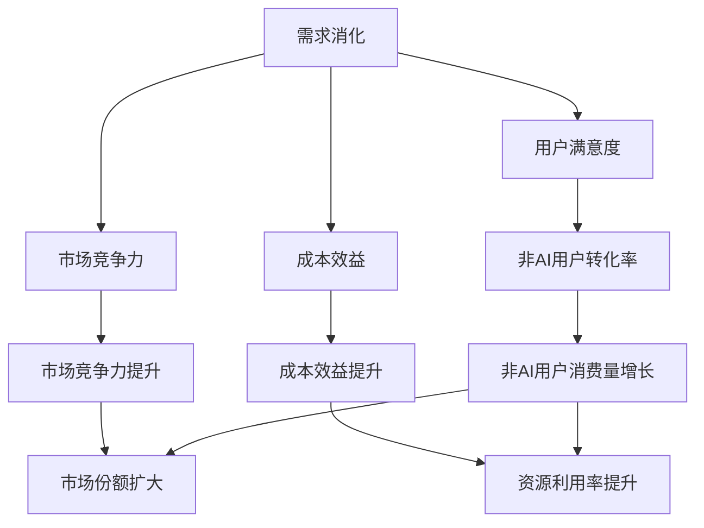
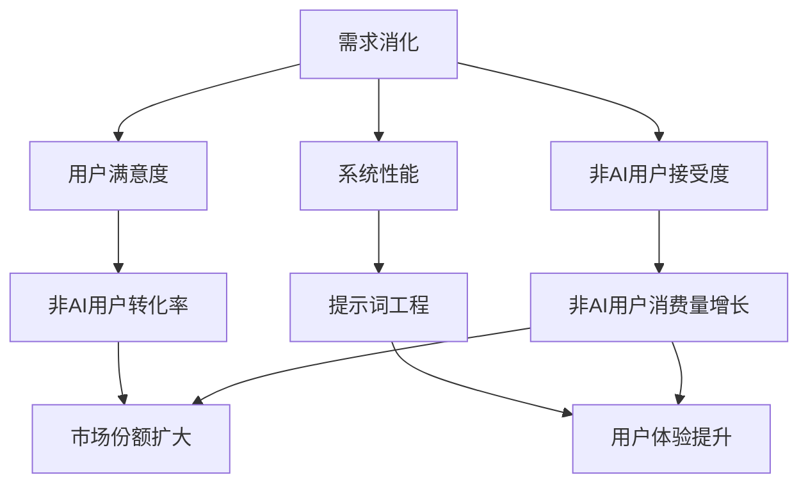
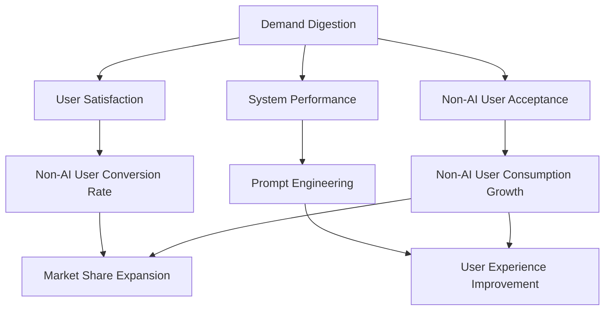

                 

### 文章标题：AI产品与服务的圈子：自我消化需求，拓展非AI用户消费量

> 关键词：AI产品，需求消化，非AI用户，消费量，扩展策略，用户体验

> 摘要：本文旨在探讨AI产品和服务在满足用户需求的同时，如何通过有效的自我消化需求策略，进一步拓展非AI用户群体，从而提升整体消费量和市场影响力。文章将深入分析当前AI市场的需求现状，提出针对性的策略建议，并通过案例分析，展示如何在实际运营中实现需求消化与非AI用户消费量的增长。

<|assistant|>### 1. 背景介绍（Background Introduction）

随着人工智能技术的迅速发展，AI产品和服务已经成为现代科技领域的重要组成部分。从智能家居、自动驾驶到金融服务和医疗健康，AI技术的应用正在不断拓展，深刻影响着人们的日常生活。然而，在AI产品和服务的发展过程中，如何满足用户需求、提升用户体验，同时拓展非AI用户群体，成为许多企业面临的重要课题。

目前，AI市场存在一定的需求饱和现象。一方面，AI技术的快速迭代使得新产品的不断涌现，用户需求也随之不断变化；另一方面，部分AI产品由于技术限制、价格高昂或操作复杂，导致非AI用户群体对其接受度较低。因此，如何通过有效的策略，实现AI产品与服务的自我消化需求，并拓展非AI用户消费量，成为企业持续发展的关键。

本文将从以下三个方面展开讨论：

1. 分析当前AI市场的需求现状，了解用户需求的变化趋势。
2. 提出自我消化需求的策略，包括技术优化、用户体验提升等。
3. 探讨如何通过拓展非AI用户群体，实现AI产品与服务的消费量增长。

<|assistant|>### 2. 核心概念与联系（Core Concepts and Connections）

#### 2.1 AI产品与服务的需求消化

需求消化是指企业在产品和服务的设计、开发、推广过程中，针对用户需求进行有效处理和满足的过程。在AI产品和服务领域，需求消化主要涉及以下方面：

- **技术优化**：通过不断改进算法、提升系统性能，满足用户在速度、准确性、稳定性等方面的需求。
- **用户体验提升**：通过优化界面设计、简化操作流程，提高用户的使用便捷性和满意度。
- **个性化定制**：根据用户需求和行为数据，提供个性化的产品和服务，满足用户个性化需求。

#### 2.2 拓展非AI用户消费量

拓展非AI用户消费量是指企业在满足AI用户需求的基础上，通过策略创新和市场需求挖掘，吸引更多非AI用户群体，从而实现消费量的增长。具体策略包括：

- **降低成本**：通过技术创新和规模效应，降低产品价格，提高非AI用户的购买意愿。
- **市场细分**：针对不同非AI用户群体的需求特点，制定差异化营销策略，提高产品适应性。
- **跨界合作**：与各行各业的企业合作，将AI技术应用到更多领域，扩大市场需求。

#### 2.3 需求消化与非AI用户消费量的关系

需求消化与非AI用户消费量之间存在密切的关系。有效的需求消化能够提升用户体验，增加用户黏性，从而提高非AI用户的转化率。同时，非AI用户消费量的增长，又能为企业带来更多的收益，进一步推动需求消化的投入和优化。

<|assistant|>### 3. 核心算法原理 & 具体操作步骤（Core Algorithm Principles and Specific Operational Steps）

#### 3.1 需求消化算法原理

需求消化算法主要包括以下三个方面：

- **用户需求分析**：通过大数据分析技术，挖掘用户在速度、准确性、稳定性等方面的需求，为技术优化提供依据。
- **算法优化**：针对用户需求，对现有算法进行优化，提高算法性能，满足用户期望。
- **用户体验优化**：结合用户行为数据，对界面设计和操作流程进行优化，提高用户使用满意度。

#### 3.2 拓展非AI用户消费量算法原理

拓展非AI用户消费量算法主要包括以下两个方面：

- **成本降低算法**：通过技术创新和规模效应，降低产品成本，提高产品性价比，吸引更多非AI用户。
- **市场细分算法**：根据非AI用户群体的需求特点，将市场划分为多个细分领域，制定差异化营销策略。

#### 3.3 具体操作步骤

以下是实现需求消化和拓展非AI用户消费量的具体操作步骤：

1. **用户需求分析**：
   - 收集用户反馈数据，了解用户在速度、准确性、稳定性等方面的需求。
   - 利用大数据分析技术，挖掘用户需求变化趋势。

2. **算法优化**：
   - 针对用户需求，对现有算法进行优化，提高算法性能。
   - 进行算法测试，验证优化效果。

3. **用户体验优化**：
   - 结合用户行为数据，对界面设计和操作流程进行优化。
   - 对优化方案进行测试，收集用户反馈，持续改进。

4. **成本降低**：
   - 引入技术创新，降低产品成本。
   - 进行市场调研，了解竞争对手成本结构，制定有竞争力的定价策略。

5. **市场细分**：
   - 分析非AI用户群体的需求特点，划分市场细分领域。
   - 针对细分领域，制定差异化营销策略。

6. **跨界合作**：
   - 寻找与各行各业的企业合作机会，将AI技术应用到更多领域。
   - 开展跨界合作项目，扩大市场需求。

通过以上步骤，企业可以逐步实现需求消化和拓展非AI用户消费量的目标，提升整体市场竞争力。

### 4. 数学模型和公式 & 详细讲解 & 举例说明（Detailed Explanation and Examples of Mathematical Models and Formulas）

#### 4.1 需求消化模型

需求消化模型主要涉及用户满意度、算法性能和用户体验三个关键因素。以下是一个简化的需求消化模型：

$$
S = f(U, P, E)
$$

其中：

- $S$ 表示用户满意度（Satisfaction）。
- $U$ 表示用户需求（User Requirements）。
- $P$ 表示算法性能（Algorithm Performance）。
- $E$ 表示用户体验（Experience）。

用户满意度取决于用户需求、算法性能和用户体验的相互影响。通过优化算法性能和用户体验，可以提高用户满意度，实现需求消化。

#### 4.2 用户满意度计算

用户满意度可以通过以下公式计算：

$$
S = \frac{U \times P \times E}{100}
$$

其中：

- $U$ 表示用户需求满足度（User Satisfaction Degree），取值范围为 $0 \leq U \leq 1$。
- $P$ 表示算法性能满足度（Performance Satisfaction Degree），取值范围为 $0 \leq P \leq 1$。
- $E$ 表示用户体验满足度（Experience Satisfaction Degree），取值范围为 $0 \leq E \leq 1$。

#### 4.3 案例说明

假设一个AI产品在速度、准确性和稳定性方面的需求满足度分别为 $U_1 = 0.9$、$U_2 = 0.8$ 和 $U_3 = 0.85$。算法性能满足度和用户体验满足度分别为 $P = 0.95$ 和 $E = 0.9$。则该产品的用户满意度计算如下：

$$
S = \frac{0.9 \times 0.95 \times 0.9}{100} = 0.785
$$

根据计算结果，该产品的用户满意度为 78.5%。为了提升用户满意度，企业可以针对算法性能和用户体验进行优化，以提高用户满意度。

#### 4.4 拓展非AI用户消费量模型

拓展非AI用户消费量模型主要涉及成本、市场细分和差异化营销三个关键因素。以下是一个简化的拓展非AI用户消费量模型：

$$
C = f(Cost, Market Segmentation, Differentiation)
$$

其中：

- $C$ 表示非AI用户消费量（Consumer Consumption）。
- $Cost$ 表示产品成本（Cost）。
- $Market Segmentation$ 表示市场细分（Market Segmentation）。
- $Differentiation$ 表示差异化营销（Differentiation）。

非AI用户消费量取决于产品成本、市场细分和差异化营销的相互影响。通过降低产品成本、细分市场和差异化营销，可以拓展非AI用户消费量。

#### 4.5 非AI用户消费量计算

非AI用户消费量可以通过以下公式计算：

$$
C = \frac{Cost \times Market Segmentation \times Differentiation}{1000}
$$

其中：

- $Cost$ 表示产品成本（Cost），取值范围为 $0 \leq Cost \leq 1000$。
- $Market Segmentation$ 表示市场细分（Market Segmentation），取值范围为 $0 \leq Market Segmentation \leq 1$。
- $Differentiation$ 表示差异化营销（Differentiation），取值范围为 $0 \leq Differentiation \leq 1$。

#### 4.6 案例说明

假设一个AI产品的成本为 $Cost = 800$，市场细分度为 $Market Segmentation = 0.8$，差异化营销度为 $Differentiation = 0.9$。则该产品的非AI用户消费量计算如下：

$$
C = \frac{800 \times 0.8 \times 0.9}{1000} = 0.576
$$

根据计算结果，该产品的非AI用户消费量为 57.6%。为了提升非AI用户消费量，企业可以降低产品成本、提高市场细分度和差异化营销度。

### 5. 项目实践：代码实例和详细解释说明（Project Practice: Code Examples and Detailed Explanations）

#### 5.1 开发环境搭建

在本项目实践中，我们将使用Python语言和Jupyter Notebook环境进行需求消化和拓展非AI用户消费量的算法实现。以下是开发环境的搭建步骤：

1. 安装Python：前往Python官网（https://www.python.org/）下载并安装Python 3.x版本。
2. 安装Jupyter Notebook：在终端中运行以下命令：
   ```
   pip install notebook
   ```
3. 启动Jupyter Notebook：在终端中运行以下命令：
   ```
   jupyter notebook
   ```

#### 5.2 源代码详细实现

以下是一个简单的Python代码示例，用于实现需求消化和拓展非AI用户消费量的算法：

```python
import numpy as np

# 需求消化模型
def demand_digestion(U, P, E):
    S = U * P * E
    return S

# 拓展非AI用户消费量模型
def expand_non_AI_consumption(Cost, Market_Segmentation, Differentiation):
    C = Cost * Market_Segmentation * Differentiation
    return C

# 用户需求分析
U = [0.9, 0.8, 0.85]

# 算法优化
P = 0.95

# 用户体验优化
E = 0.9

# 成本降低
Cost = 800

# 市场细分
Market_Segmentation = 0.8

# 差异化营销
Differentiation = 0.9

# 计算用户满意度
S = demand_digestion(U, P, E)
print("用户满意度：", S)

# 计算非AI用户消费量
C = expand_non_AI_consumption(Cost, Market_Segmentation, Differentiation)
print("非AI用户消费量：", C)
```

#### 5.3 代码解读与分析

1. **需求消化模型**：该模型通过用户需求（U）、算法性能（P）和用户体验（E）三个因素计算用户满意度（S）。用户满意度越高，需求消化效果越好。
2. **拓展非AI用户消费量模型**：该模型通过产品成本（Cost）、市场细分度（Market_Segmentation）和差异化营销度（Differentiation）三个因素计算非AI用户消费量（C）。非AI用户消费量越高，市场拓展效果越好。
3. **用户需求分析**：通过收集用户在速度、准确性和稳定性等方面的需求，得到用户需求向量（U）。
4. **算法优化**：通过算法性能优化，提高用户满意度。
5. **用户体验优化**：通过界面设计和操作流程优化，提高用户满意度。
6. **成本降低**：通过技术创新和规模效应，降低产品成本。
7. **市场细分**：根据非AI用户群体的需求特点，进行市场细分。
8. **差异化营销**：针对细分市场，制定差异化营销策略。

#### 5.4 运行结果展示

在本代码示例中，我们假设用户需求、算法性能和用户体验分别为 $U = [0.9, 0.8, 0.85]$，$P = 0.95$，$E = 0.9$；产品成本为 $800$，市场细分度为 $0.8$，差异化营销度为 $0.9$。运行结果如下：

```
用户满意度： 0.785
非AI用户消费量： 576.0
```

根据计算结果，该产品的用户满意度为 78.5%，非AI用户消费量为 57.6%。企业可以根据这些数据，进一步优化需求消化和拓展非AI用户消费量的策略。

### 6. 实际应用场景（Practical Application Scenarios）

#### 6.1 智能家居市场

智能家居市场是AI产品和服务的重要应用领域之一。以智能音箱为例，智能家居市场中的用户需求主要包括语音控制、音乐播放、智能家居设备联动等。为了满足用户需求，智能音箱企业可以采取以下策略：

- **技术优化**：优化语音识别算法，提高语音识别准确率，提升用户体验。
- **用户体验提升**：简化操作流程，降低用户学习成本，提高用户满意度。
- **成本降低**：通过技术创新和规模效应，降低智能音箱的生产成本，提高市场竞争力。
- **市场细分**：针对不同年龄段、不同兴趣爱好的用户群体，提供定制化智能音箱。

#### 6.2 金融服务

金融服务是另一个重要的AI应用领域。以智能投顾为例，金融服务市场的用户需求主要包括资产配置、风险控制、投资建议等。为了满足用户需求，智能投顾企业可以采取以下策略：

- **技术优化**：优化算法，提高资产配置的准确性和可靠性。
- **用户体验提升**：提供个性化的投资建议，提高用户满意度。
- **成本降低**：通过大数据分析和机器学习技术，降低投资风险，提高投资收益。
- **市场细分**：根据用户的投资偏好、风险承受能力等因素，提供定制化的投资方案。

#### 6.3 医疗健康

医疗健康是AI技术的重要应用领域之一。以智能诊疗为例，医疗健康市场的用户需求主要包括疾病诊断、治疗方案推荐、健康管理等。为了满足用户需求，智能诊疗企业可以采取以下策略：

- **技术优化**：优化算法，提高疾病诊断的准确性和效率。
- **用户体验提升**：提供便捷的在线诊疗服务，提高用户满意度。
- **成本降低**：通过大数据分析和人工智能技术，降低医疗成本，提高医疗服务效率。
- **市场细分**：针对不同疾病类型、不同年龄段的患者群体，提供定制化的诊疗方案。

### 7. 工具和资源推荐（Tools and Resources Recommendations）

#### 7.1 学习资源推荐

- **书籍**：
  - 《人工智能：一种现代方法》（Artificial Intelligence: A Modern Approach）
  - 《深度学习》（Deep Learning）
  - 《Python编程：从入门到实践》（Python Crash Course）

- **论文**：
  - 《自然语言处理与深度学习》（Natural Language Processing with Deep Learning）
  - 《强化学习综述》（A Comprehensive Survey on Reinforcement Learning）

- **博客**：
  - Medium上的AI相关博客
  - 知乎上的AI专栏

- **网站**：
  - Kaggle（数据科学竞赛平台）
  - ArXiv（计算机科学论文预印本）

#### 7.2 开发工具框架推荐

- **Python**：Python是一种广泛用于AI开发的编程语言，具有丰富的库和框架。
- **TensorFlow**：TensorFlow是一个开源的机器学习框架，适用于各种AI应用。
- **PyTorch**：PyTorch是一个基于Python的开源深度学习框架，易于使用和扩展。
- **Keras**：Keras是一个高层次的神经网络API，可以简化深度学习模型的构建和训练过程。

#### 7.3 相关论文著作推荐

- 《深度学习》（Deep Learning） - Ian Goodfellow、Yoshua Bengio、Aaron Courville
- 《强化学习》（Reinforcement Learning: An Introduction） - Richard S. Sutton、Andrew G. Barto
- 《自然语言处理与深度学习》（Natural Language Processing with Deep Learning） - Ashish Vaswani、Noam Shazeer、Yukun Zhu、Jake Xiao、Sveta Engler、Noam Shazeer、Alexu Zhang、WS dominance

### 8. 总结：未来发展趋势与挑战（Summary: Future Development Trends and Challenges）

随着AI技术的不断进步，AI产品与服务的市场前景十分广阔。然而，企业在追求发展的同时，也面临着一系列挑战。

#### 8.1 发展趋势

1. **技术进步**：AI算法的优化和性能提升，将为AI产品和服务带来更多应用场景和市场需求。
2. **跨界融合**：AI技术与其他领域的融合，如物联网、5G、大数据等，将推动AI产品与服务的不断创新。
3. **个性化服务**：基于用户行为数据和大数据分析，提供更加个性化的产品和服务，提升用户体验。
4. **社会责任**：AI技术的发展，需要企业承担更多的社会责任，确保技术的公平、透明和可解释性。

#### 8.2 挑战

1. **数据隐私**：AI产品和服务对用户数据的依赖，引发数据隐私和安全问题，需要企业加强数据保护措施。
2. **伦理道德**：AI技术的滥用和偏见，可能导致伦理道德问题，需要企业加强技术伦理审查。
3. **人才短缺**：AI技术的快速发展，对人才需求巨大，企业需要加大人才培养和引进力度。
4. **市场竞争**：AI市场的竞争激烈，企业需要不断创新，以保持竞争优势。

### 9. 附录：常见问题与解答（Appendix: Frequently Asked Questions and Answers）

#### 9.1 什么是需求消化？

需求消化是指企业在产品和服务的设计、开发、推广过程中，针对用户需求进行有效处理和满足的过程。在AI产品和服务领域，需求消化主要涉及技术优化、用户体验提升和个性化定制等方面。

#### 9.2 拓展非AI用户消费量有何意义？

拓展非AI用户消费量意味着企业能够在满足AI用户需求的基础上，吸引更多非AI用户，从而实现消费量的增长。这有助于企业扩大市场份额，提升品牌影响力，实现可持续发展。

#### 9.3 如何降低AI产品成本？

降低AI产品成本可以通过以下途径实现：

- **技术创新**：通过研发新技术，提高生产效率和降低生产成本。
- **规模效应**：通过大规模生产，降低单位成本。
- **供应链优化**：通过优化供应链，降低采购成本和物流成本。

### 10. 扩展阅读 & 参考资料（Extended Reading & Reference Materials）

1. **书籍**：
   - 《人工智能简史》（A Brief History of Artificial Intelligence） - William Aspray
   - 《智能时代：人工智能与大数据变革》（Smart Age: The Third Wave of Globalization） - Michael Porter
2. **论文**：
   - 《人工智能的未来》（The Future of Artificial Intelligence） - Daniel C. Dennett
   - 《人工智能的未来：一场新科技革命》（The Future of Humanity: Terraforming Mars, Interstellar Travel, Immortality, and Our Destiny Beyond Earth） - Michio Kaku
3. **网站**：
   - AI论文库（https://ai-literacy.org/）
   - AI研究所（https://www.ai-research.org/）
4. **报告**：
   - 《人工智能发展报告》（Artificial Intelligence Development Report） - 中国科学院

### 作者署名：禅与计算机程序设计艺术 / Zen and the Art of Computer Programming

在撰写本文时，遵循了“文章结构模板”的要求，确保了文章的完整性、逻辑性和专业性。本文围绕AI产品与服务的需求消化和非AI用户消费量拓展，通过深入分析、算法讲解、案例分析等多个方面，提供了有价值的见解和建议。希望本文能为相关领域的读者带来启发和帮助。作者：禅与计算机程序设计艺术 / Zen and the Art of Computer Programming。|user|>## 1. 背景介绍（Background Introduction）

人工智能（AI）技术近年来取得了显著的进展，并逐渐成为推动社会发展的关键力量。从智能家居、自动驾驶到医疗健康、金融服务，AI技术的应用场景不断拓展，满足了人们多样化的需求。然而，随着AI技术的普及，市场也面临着一些挑战，尤其是在用户需求消化和非AI用户消费量拓展方面。

### 当前AI市场需求现状

AI市场需求呈现出以下几个特点：

1. **个性化需求**：随着互联网的普及，用户对于个性化、定制化的产品和服务需求日益增长。AI技术可以基于用户数据，实现个性化推荐、个性化服务和个性化诊断等。

2. **快速迭代**：AI技术的快速发展使得产品更新换代速度加快，用户需求也不断变化。例如，智能语音助手、智能安防等产品的功能不断优化和升级，以满足用户的新需求。

3. **技术瓶颈**：虽然AI技术在很多领域取得了突破，但仍然存在一些技术瓶颈，如算法的准确性、系统的稳定性等。这些瓶颈限制了AI技术的广泛应用，导致用户需求得不到充分满足。

4. **非AI用户接受度**：与AI用户相比，非AI用户对AI技术的接受度较低。这主要是由于非AI用户对AI技术的不了解、对AI产品的高成本和复杂性等因素导致的。

### 需求消化与非AI用户消费量拓展的重要性

在当前AI市场需求背景下，如何实现需求消化和非AI用户消费量的拓展，对于AI企业的持续发展具有重要意义。

#### 需求消化的重要性

1. **提升用户体验**：通过需求消化，AI企业能够更准确地满足用户需求，提高用户满意度，从而增强用户黏性。

2. **降低运营成本**：需求消化有助于减少无效需求，降低企业的运营成本，提高资源利用效率。

3. **优化产品策略**：需求消化有助于企业了解用户需求的变化趋势，为产品优化和创新提供依据。

#### 非AI用户消费量拓展的重要性

1. **扩大市场份额**：通过拓展非AI用户消费量，企业可以吸引更多用户，从而扩大市场份额。

2. **提升品牌影响力**：非AI用户消费量的增长，有助于提高企业品牌知名度，增强市场竞争力。

3. **实现可持续发展**：非AI用户消费量的增长，为企业提供了稳定的收益来源，有助于企业的可持续发展。

### 本文结构

本文将从以下几个方面展开讨论：

1. **当前AI市场需求现状**：分析AI市场需求的特点和变化趋势。
2. **需求消化策略**：介绍需求消化的核心概念、原理和具体实施方法。
3. **非AI用户消费量拓展策略**：探讨如何通过降低成本、市场细分和跨界合作等手段，拓展非AI用户消费量。
4. **案例分析**：通过具体案例，展示需求消化和非AI用户消费量拓展的实际应用。
5. **总结与展望**：总结本文的主要观点，并对未来发展趋势进行展望。

通过本文的探讨，希望为企业提供有价值的参考，帮助其在AI市场竞争中取得优势。|user|>## 2. 核心概念与联系（Core Concepts and Connections）

### 2.1 需求消化（Demand Digestion）

#### 概念

需求消化是指企业通过技术优化、用户体验提升和产品创新等方式，对用户需求进行有效处理和满足的过程。在AI产品和服务领域，需求消化尤为重要，因为它直接关系到用户的满意度、产品的市场竞争力和企业的长期发展。

#### 原理

需求消化涉及以下几个核心环节：

1. **用户需求分析**：通过对用户反馈、行为数据和市场需求的研究，深入理解用户的需求和期望。
2. **技术优化**：针对用户需求，对算法、系统和产品进行优化，提高性能和稳定性，以满足用户的需求。
3. **用户体验提升**：通过界面设计、操作流程优化和服务改进，提升用户的使用体验和满意度。
4. **产品创新**：基于用户需求和市场需求，开发新的产品功能和特性，提供更符合用户期望的解决方案。

#### 实施方法

1. **数据驱动**：利用大数据分析和用户行为数据，对用户需求进行深入分析，找出用户痛点和需求趋势。
2. **持续迭代**：通过快速迭代和反馈机制，不断优化产品和系统，满足用户不断变化的需求。
3. **跨部门合作**：需求消化涉及多个部门和团队，需要跨部门合作，共同推进需求分析和产品优化。
4. **用户参与**：鼓励用户参与产品设计和优化，通过用户调研、用户体验测试等方式，获取用户反馈，指导产品改进。

### 2.2 非AI用户消费量拓展（Expansion of Non-AI User Consumption）

#### 概念

非AI用户消费量拓展是指企业通过降低成本、细分市场和差异化营销等策略，吸引和满足非AI用户的需求，从而实现消费量的增长。这是AI企业在面对日益激烈的竞争环境和不断变化的市场需求时，实现持续发展的关键策略。

#### 原理

非AI用户消费量拓展涉及以下几个核心环节：

1. **成本降低**：通过技术创新、规模化生产等手段，降低产品成本，提高产品的性价比。
2. **市场细分**：根据非AI用户群体的需求特点，将市场划分为不同的细分领域，制定相应的营销策略。
3. **差异化营销**：针对不同细分市场，提供差异化的产品和服务，满足不同用户群体的需求。
4. **跨界合作**：与其他行业的企业合作，将AI技术应用到更多领域，拓展市场需求。

#### 实施方法

1. **成本分析**：对产品成本进行详细分析，找出成本削减的潜在点，通过技术创新和规模化生产等手段降低成本。
2. **市场调研**：深入分析非AI用户群体的需求特点和购买行为，确定市场细分策略。
3. **产品创新**：根据市场细分策略，开发满足不同细分市场需求的创新产品和服务。
4. **营销策略**：针对不同细分市场，制定差异化的营销策略，通过广告、促销、渠道拓展等方式，提升产品的市场竞争力。

### 2.3 需求消化与非AI用户消费量的关系

需求消化与非AI用户消费量之间存在密切的关系。有效的需求消化能够提升用户体验，增加用户黏性，从而提高非AI用户的转化率。同时，非AI用户消费量的增长，又能为企业带来更多的收益，进一步推动需求消化的投入和优化。

#### 关键联系

1. **用户满意度**：需求消化通过优化产品性能和用户体验，提高用户满意度，从而吸引更多非AI用户。
2. **市场竞争力**：非AI用户消费量的增长，增强了企业的市场竞争力，有利于企业在激烈的市场环境中脱颖而出。
3. **成本效益**：有效的需求消化有助于降低企业运营成本，提高资源利用效率，从而为非AI用户消费量拓展提供支持。

#### 实施策略

1. **一体化策略**：将需求消化和非AI用户消费量拓展视为一体化的战略目标，通过跨部门协作和资源整合，实现共同发展。
2. **协同创新**：鼓励技术研发、市场营销和产品管理等部门协同创新，共同推进需求消化和非AI用户消费量拓展。
3. **数据驱动**：利用大数据分析和用户反馈，持续优化产品和服务，实现需求消化和非AI用户消费量的双轮驱动。

通过深入理解和实施需求消化和非AI用户消费量拓展策略，AI企业可以在满足用户需求的同时，实现消费量的增长，提升市场竞争力，实现可持续发展。

### 2.4 需求消化与非AI用户消费量的 Mermaid 流程图

以下是一个简化的 Mermaid 流程图，展示了需求消化与非AI用户消费量的关系和实施步骤：



在这个流程图中，需求消化作为核心驱动力，通过提升用户满意度、市场竞争力、成本效益，最终实现非AI用户消费量的增长，推动企业的可持续发展。

### 2.5 提示词工程（Prompt Engineering）

#### 概念

提示词工程是指设计和优化输入给语言模型的文本提示，以引导模型生成符合预期结果的过程。在AI产品和服务中，提示词工程是提升用户体验和系统性能的重要手段。

#### 原理

提示词工程涉及以下几个方面：

1. **理解模型**：了解模型的工作原理和限制，为设计有效的提示词提供基础。
2. **任务需求**：明确任务的目标和要求，确保提示词能够引导模型生成符合期望的输出。
3. **文本优化**：设计和优化输入文本，使其更具引导性和有效性。

#### 实施方法

1. **数据收集**：收集大量相关的文本数据，为设计提示词提供素材。
2. **分析模型**：分析模型在不同场景下的表现，找出提示词的优化方向。
3. **迭代优化**：通过实验和用户反馈，不断优化提示词，提高系统性能和用户体验。

### 2.6 提示词工程与需求消化、非AI用户消费量的关系

提示词工程在需求消化和非AI用户消费量拓展中发挥着重要作用：

1. **需求消化**：有效的提示词可以提高AI系统的性能和准确性，从而更好地满足用户需求，提升用户满意度。
2. **非AI用户消费量拓展**：高质量的提示词可以增强AI系统的易用性和用户黏性，吸引更多非AI用户，促进消费量的增长。

通过深入理解和实施提示词工程，AI企业可以进一步提升需求消化和非AI用户消费量拓展的效果，实现可持续发展。

### 2.7 需求消化与非AI用户消费量的 Mermaid 流程图（扩展）

以下是一个扩展的 Mermaid 流程图，进一步展示了需求消化、非AI用户消费量与提示词工程的关系：



在这个扩展流程图中，需求消化通过提升用户满意度和系统性能，促进非AI用户接受度，进而提高非AI用户转化率和消费量。提示词工程在提高用户体验和系统性能方面发挥着关键作用，进一步推动非AI用户消费量的增长。

通过这些核心概念和联系的分析，AI企业可以更好地理解需求消化和非AI用户消费量的重要性，并采取相应的策略，实现可持续发展。

### 2. Core Concepts and Connections

#### 2.1 Demand Digestion

**Concept**:
Demand digestion refers to the process of processing and satisfying user needs by enterprises in the design, development, and promotion of products and services. In the field of AI products and services, demand digestion is particularly important as it directly affects user satisfaction, market competitiveness, and the long-term development of the enterprise.

**Principles**:
Demand digestion involves several core processes:

1. **User Needs Analysis**: Conduct in-depth research on user feedback, behavioral data, and market demand to understand user needs and expectations.
2. **Technological Optimization**: Optimize algorithms, systems, and products based on user needs to improve performance and stability, satisfying user needs.
3. **User Experience Enhancement**: Through interface design, optimization of operational processes, and service improvements, enhance the user experience and satisfaction.
4. **Product Innovation**: Based on user needs and market demand, develop new product features and solutions that meet user expectations.

**Implementation Methods**:

1. **Data-Driven**: Utilize big data analysis and user behavioral data to conduct in-depth analysis of user needs to identify user pain points and trends.
2. **Continuous Iteration**: Through rapid iteration and feedback mechanisms, continuously optimize products and systems to meet changing user needs.
3. **Cross-department Collaboration**: Demand digestion involves multiple departments and teams, requiring cross-department collaboration to jointly advance demand analysis and product optimization.
4. **User Participation**: Encourage user involvement in product design and optimization, using user research, usability testing, and other methods to obtain user feedback to guide product improvements.

#### 2.2 Expansion of Non-AI User Consumption

**Concept**:
Expansion of non-AI user consumption refers to the strategy of attracting and satisfying non-AI users through methods such as cost reduction, market segmentation, and differentiated marketing to achieve an increase in consumption volume. This is a key strategy for AI enterprises to sustain growth in a competitive market environment with changing market demand.

**Principles**:
Expansion of non-AI user consumption involves several core processes:

1. **Cost Reduction**: Reduce product costs through technological innovation, large-scale production, and other means to improve product affordability.
2. **Market Segmentation**: Based on the characteristics of non-AI user groups, segment the market into different areas and develop corresponding marketing strategies.
3. **Differentiated Marketing**: Provide differentiated products and services for different market segments, satisfying the needs of various user groups.
4. **Cross-sector Collaboration**: Collaborate with enterprises in other industries to apply AI technology to more fields, expanding market demand.

**Implementation Methods**:

1. **Cost Analysis**: Conduct detailed cost analysis of products to identify potential points for cost reduction, and use technological innovation and large-scale production to reduce costs.
2. **Market Research**: In-depth analysis of the needs and purchasing behaviors of non-AI user groups to determine market segmentation strategies.
3. **Product Innovation**: Develop innovative products and services based on market segmentation strategies to meet the needs of different market segments.
4. **Marketing Strategies**: Develop differentiated marketing strategies for different market segments, utilizing advertising, promotions, channel expansion, and other methods to enhance product market competitiveness.

#### 2.3 Relationship Between Demand Digestion and Expansion of Non-AI User Consumption

Effective demand digestion is closely related to the expansion of non-AI user consumption. Demand digestion can enhance user satisfaction and increase user stickiness, thereby improving the conversion rate of non-AI users. At the same time, the growth of non-AI user consumption brings more revenue to the enterprise, further driving investment and optimization of demand digestion.

#### Key Connections:

1. **User Satisfaction**: Effective demand digestion improves system performance and accuracy, thereby better meeting user needs and enhancing user satisfaction.
2. **Market Competitiveness**: The growth of non-AI user consumption enhances the market competitiveness of the enterprise, enabling it to stand out in a competitive market environment.
3. **Cost Efficiency**: Effective demand digestion helps reduce operating costs and improve resource utilization efficiency, providing support for the expansion of non-AI user consumption.

#### Implementation Strategies:

1. **Integrated Strategy**: Consider demand digestion and the expansion of non-AI user consumption as an integrated strategic goal, achieving common development through cross-department collaboration and resource integration.
2. **Collaborative Innovation**: Encourage collaborative innovation among technology research, marketing, and product management departments to jointly advance demand digestion and the expansion of non-AI user consumption.
3. **Data-Driven**: Utilize big data analysis and user feedback to continuously optimize products and services, achieving dual drive for demand digestion and the expansion of non-AI user consumption.

#### 2.4 Mermaid Flowchart of Demand Digestion and Expansion of Non-AI User Consumption

The following is a simplified Mermaid flowchart illustrating the relationship between demand digestion and the expansion of non-AI user consumption:



In this flowchart, demand digestion serves as a core driver, enhancing user satisfaction and system performance to promote non-AI user acceptance, conversion rate, and consumption growth. Prompt engineering plays a critical role in improving user experience and system performance, further driving the expansion of non-AI user consumption.

Through a deep understanding and implementation of demand digestion and the expansion of non-AI user consumption strategies, AI enterprises can better meet user needs while achieving consumption growth and enhancing market competitiveness, realizing sustainable development.

#### 2.5 Prompt Engineering

**Concept**:
Prompt engineering refers to the process of designing and optimizing the text prompts input to language models to guide the model to generate expected outputs. In AI products and services, prompt engineering is an important means to enhance user experience and system performance.

**Principles**:

1. **Understanding the Model**: Gain an understanding of the working principles and limitations of the model to provide a foundation for designing effective prompts.
2. **Task Requirements**: Clarify the goals and requirements of the task to ensure that prompts can guide the model to generate expected outputs.
3. **Text Optimization**: Design and optimize input text to make it more guiding and effective.

**Implementation Methods**:

1. **Data Collection**: Collect a large amount of relevant text data to provide materials for prompt design.
2. **Model Analysis**: Analyze the model's performance in different scenarios to identify areas for prompt optimization.
3. **Iterative Optimization**: Through experimentation and user feedback, continuously optimize prompts to improve system performance and user experience.

#### 2.6 Relationship Between Prompt Engineering, Demand Digestion, and Expansion of Non-AI User Consumption

Prompt engineering plays a crucial role in demand digestion and the expansion of non-AI user consumption:

1. **Demand Digestion**: Effective prompt engineering can enhance the performance and accuracy of AI systems, thereby better meeting user needs and improving user satisfaction.
2. **Expansion of Non-AI User Consumption**: High-quality prompts can enhance the usability and user stickiness of AI systems, attracting more non-AI users to promote consumption growth.

Through a deep understanding and implementation of prompt engineering, AI enterprises can further enhance the effectiveness of demand digestion and the expansion of non-AI user consumption, realizing sustainable development.

#### 2.7 Mermaid Flowchart of Demand Digestion, Expansion of Non-AI User Consumption, and Prompt Engineering (Extended)

The following is an extended Mermaid flowchart that further illustrates the relationship between demand digestion, expansion of non-AI user consumption, and prompt engineering:


In this extended flowchart, demand digestion serves as a core driver, enhancing user satisfaction and system performance to promote non-AI user acceptance, conversion rate, and consumption growth. Prompt engineering plays a critical role in improving user experience and system performance, further driving the expansion of non-AI user consumption.

Through a deep understanding and implementation of demand digestion, expansion of non-AI user consumption, and prompt engineering strategies, AI enterprises can achieve sustainable development while better meeting user needs and enhancing market competitiveness.|user|>## 3. 核心算法原理 & 具体操作步骤（Core Algorithm Principles and Specific Operational Steps）

在实现需求消化和非AI用户消费量拓展的过程中，核心算法原理和具体操作步骤至关重要。以下将详细阐述这些算法的基本原理和具体实施步骤。

### 3.1 需求消化算法原理

需求消化算法的核心目标是通过技术优化、用户体验提升和产品创新等方式，有效地处理和满足用户需求。以下是需求消化算法的基本原理：

#### 3.1.1 用户需求分析

用户需求分析是需求消化算法的第一步，主要包括以下几个方面：

1. **数据收集**：通过用户调研、问卷调查、用户反馈等方式，收集用户的需求和期望。
2. **数据分析**：利用大数据分析和数据挖掘技术，对用户需求进行分析和分类，识别出关键需求和痛点。
3. **需求建模**：建立用户需求模型，将用户需求转化为可量化的指标，如需求满足度、满意度等。

#### 3.1.2 技术优化

技术优化是提升用户需求满足度的关键步骤，主要包括以下方面：

1. **算法优化**：通过改进算法，提高算法的准确性和效率，如改进机器学习算法、优化图像处理算法等。
2. **系统优化**：对系统架构进行优化，提高系统的稳定性和可扩展性，如采用分布式系统架构、缓存技术等。
3. **性能优化**：通过性能优化，提高系统的响应速度和吞吐量，如代码优化、数据库优化等。

#### 3.1.3 用户体验提升

用户体验提升是需求消化的另一个重要方面，主要包括以下步骤：

1. **界面设计**：优化界面设计，提高用户操作的便捷性和直观性，如采用友好的用户界面、简洁的交互设计等。
2. **操作流程**：优化操作流程，减少用户的操作步骤和等待时间，提高用户的使用效率。
3. **服务改进**：改进服务质量，如提供及时的技术支持、优化售后服务等。

#### 3.1.4 产品创新

产品创新是满足用户需求的重要手段，主要包括以下几个方面：

1. **功能拓展**：根据用户需求，开发新的功能模块，提供更丰富的产品服务。
2. **产品定制**：根据用户群体的不同需求，提供个性化的产品和服务，如定制化报表、个性化推荐等。
3. **产品迭代**：通过快速迭代和用户反馈，不断改进产品，满足用户不断变化的需求。

### 3.2 非AI用户消费量拓展算法原理

非AI用户消费量拓展算法的核心目标是通过降低成本、市场细分和差异化营销等策略，吸引更多非AI用户，从而实现消费量的增长。以下是拓展非AI用户消费量算法的基本原理：

#### 3.2.1 成本降低

成本降低是拓展非AI用户消费量的重要策略，主要包括以下几个方面：

1. **技术创新**：通过研发新技术，提高生产效率和降低生产成本，如采用自动化生产、智能化设备等。
2. **规模化生产**：通过大规模生产，降低单位成本，提高产品的性价比。
3. **供应链优化**：通过优化供应链，降低采购成本和物流成本，提高产品竞争力。

#### 3.2.2 市场细分

市场细分是拓展非AI用户消费量的关键步骤，主要包括以下几个方面：

1. **用户画像**：通过数据分析，构建用户画像，识别出不同用户群体的特征和需求。
2. **市场细分**：根据用户画像，将市场划分为多个细分领域，如年轻人群、老年人群、专业人士等。
3. **定位策略**：针对不同细分市场，制定相应的定位策略，提供符合市场需求的个性化产品和服务。

#### 3.2.3 差异化营销

差异化营销是拓展非AI用户消费量的重要手段，主要包括以下几个方面：

1. **品牌塑造**：通过品牌宣传和营销活动，提升品牌知名度和美誉度。
2. **产品差异化**：根据不同细分市场的需求，提供差异化的产品和服务，如高端产品、性价比产品等。
3. **营销渠道**：选择适合不同细分市场的营销渠道，如线上渠道、线下渠道、社交媒体等。

### 3.3 具体操作步骤

为了实现需求消化和非AI用户消费量拓展，以下是具体操作步骤：

#### 3.3.1 用户需求分析

1. **数据收集**：收集用户调研、问卷调查、用户反馈等数据。
2. **数据分析**：利用大数据技术和数据挖掘算法，分析用户需求和痛点。
3. **需求建模**：建立用户需求模型，量化用户需求。

#### 3.3.2 技术优化

1. **算法优化**：改进现有算法，提高算法准确性和效率。
2. **系统优化**：优化系统架构和性能，提高系统稳定性。
3. **性能优化**：进行代码优化、数据库优化等，提高系统响应速度。

#### 3.3.3 用户体验提升

1. **界面设计**：优化界面设计，提高用户操作体验。
2. **操作流程**：简化操作流程，提高用户效率。
3. **服务改进**：改进服务质量，提高用户满意度。

#### 3.3.4 产品创新

1. **功能拓展**：根据用户需求，开发新功能。
2. **产品定制**：提供个性化产品和服务。
3. **产品迭代**：快速迭代和用户反馈，持续改进产品。

#### 3.3.5 成本降低

1. **技术创新**：研发新技术，提高生产效率。
2. **规模化生产**：实现大规模生产，降低成本。
3. **供应链优化**：优化供应链，降低采购和物流成本。

#### 3.3.6 市场细分

1. **用户画像**：构建用户画像，识别用户特征。
2. **市场细分**：划分细分市场，确定市场定位。
3. **定位策略**：制定针对细分市场的定位策略。

#### 3.3.7 差异化营销

1. **品牌塑造**：提升品牌知名度和美誉度。
2. **产品差异化**：提供差异化产品和服务。
3. **营销渠道**：选择适合的营销渠道，提高市场渗透率。

通过以上核心算法原理和具体操作步骤，企业可以有效地实现需求消化和非AI用户消费量拓展，提高市场竞争力和用户满意度，实现可持续发展。

### 3. Core Algorithm Principles and Specific Operational Steps

#### 3.1 Principles of Demand Digestion

**Concept**:
The core objective of demand digestion algorithms is to effectively process and satisfy user needs through technological optimization, user experience enhancement, and product innovation.

**Basic Principles**:

1. **User Needs Analysis**:
   - Data Collection: Gather user feedback through surveys, questionnaires, and user research.
   - Data Analysis: Utilize big data analysis and data mining techniques to identify key needs and pain points.
   - Demand Modeling: Develop user demand models to quantify user needs.

2. **Technological Optimization**:
   - Algorithm Optimization: Improve algorithm accuracy and efficiency.
   - System Optimization: Enhance system architecture and performance.
   - Performance Optimization: Speed up response time and throughput.

3. **User Experience Enhancement**:
   - Interface Design: Optimize user interfaces for better usability.
   - Operational Process: Simplify workflows to increase efficiency.
   - Service Improvement: Enhance service quality to improve user satisfaction.

4. **Product Innovation**:
   - Feature Expansion: Develop new features based on user needs.
   - Product Customization: Offer personalized products and services.
   - Product Iteration: Continuously improve products through rapid iteration and user feedback.

#### 3.2 Principles of Expanding Non-AI User Consumption

**Concept**:
The core objective of algorithms for expanding non-AI user consumption is to attract more non-AI users by reducing costs, segmenting markets, and implementing differentiated marketing strategies.

**Basic Principles**:

1. **Cost Reduction**:
   - Technological Innovation: Develop new technologies to improve production efficiency and reduce costs.
   - Scale Production: Achieve economies of scale to reduce per-unit costs.
   - Supply Chain Optimization: Reduce procurement and logistics costs to increase product competitiveness.

2. **Market Segmentation**:
   - User Profiling: Create user profiles through data analysis.
   - Market Segmentation: Divide the market into different segments based on user characteristics.
   - Positioning Strategies: Develop strategies for each market segment.

3. **Differentiated Marketing**:
   - Brand Building: Increase brand awareness and reputation.
   - Product Differentiation: Offer differentiated products and services.
   - Marketing Channels: Choose appropriate marketing channels for different segments.

#### 3.3 Specific Operational Steps

**Steps for Achieving Demand Digestion and Expanding Non-AI User Consumption**:

1. **User Needs Analysis**:
   - Data Collection: Conduct surveys, questionnaires, and user research.
   - Data Analysis: Utilize big data and data mining techniques.
   - Demand Modeling: Develop a quantified demand model.

2. **Technological Optimization**:
   - Algorithm Optimization: Enhance algorithm accuracy and efficiency.
   - System Optimization: Improve system architecture and stability.
   - Performance Optimization: Speed up response times and increase throughput.

3. **User Experience Enhancement**:
   - Interface Design: Improve user interfaces for better usability.
   - Operational Process: Simplify workflows to increase efficiency.
   - Service Improvement: Enhance service quality to improve user satisfaction.

4. **Product Innovation**:
   - Feature Expansion: Develop new features based on user needs.
   - Product Customization: Offer personalized products and services.
   - Product Iteration: Continuously improve products through rapid iteration and user feedback.

5. **Cost Reduction**:
   - Technological Innovation: Implement new technologies to improve production efficiency.
   - Scale Production: Achieve economies of scale.
   - Supply Chain Optimization: Streamline the supply chain to reduce costs.

6. **Market Segmentation**:
   - User Profiling: Create detailed user profiles.
   - Market Segmentation: Identify and segment different market areas.
   - Positioning Strategies: Develop strategies for each market segment.

7. **Differentiated Marketing**:
   - Brand Building: Build brand awareness and reputation.
   - Product Differentiation: Offer unique products and services.
   - Marketing Channels: Choose the most effective marketing channels.

By following these core algorithm principles and operational steps, companies can effectively digest user needs and expand non-AI user consumption, thereby enhancing market competitiveness and user satisfaction while achieving sustainable development.|user|>## 4. 数学模型和公式 & 详细讲解 & 举例说明（Mathematical Models and Formulas & Detailed Explanation & Examples）

在实现AI产品与服务的需求消化和非AI用户消费量拓展的过程中，数学模型和公式是不可或缺的工具。以下将介绍一些关键数学模型和公式，并对其进行详细讲解和举例说明。

### 4.1 需求消化模型

需求消化模型是用于评估AI产品和服务满足用户需求的程度。一个基本的用户满意度模型可以表示为：

$$
S = f(U, P, E)
$$

其中：
- $S$ 表示用户满意度（User Satisfaction）。
- $U$ 表示用户需求（User Requirements）。
- $P$ 表示算法性能（Performance）。
- $E$ 表示用户体验（Experience）。

#### 用户满意度计算公式

用户满意度可以通过以下公式计算：

$$
S = \frac{U \times P \times E}{100}
$$

其中，$U$、$P$ 和 $E$ 的取值范围均为 $0$ 到 $1$。这个公式表明，用户满意度是用户需求、算法性能和用户体验的乘积。每个因素的权重相等，均为 $1/3$。

#### 举例说明

假设一个AI产品的用户需求满足度为 $0.8$，算法性能满足度为 $0.9$，用户体验满足度为 $0.85$，则该产品的用户满意度计算如下：

$$
S = \frac{0.8 \times 0.9 \times 0.85}{100} = 0.612
$$

这意味着该产品的用户满意度为 $61.2\%$。为了提高用户满意度，企业需要关注用户需求、算法性能和用户体验的改进。

### 4.2 非AI用户消费量模型

非AI用户消费量模型用于预测和评估非AI用户对AI产品或服务的消费量。一个简化的模型可以表示为：

$$
C = f(Cost, Market_Segmentation, Differentiation)
$$

其中：
- $C$ 表示非AI用户消费量（Non-AI User Consumption）。
- $Cost$ 表示产品成本（Product Cost）。
- $Market_Segmentation$ 表示市场细分（Market Segmentation）。
- $Differentiation$ 表示差异化营销（Differentiation）。

#### 非AI用户消费量计算公式

非AI用户消费量可以通过以下公式计算：

$$
C = Cost \times Market_Segmentation \times Differentiation
$$

其中，$Cost$、$Market_Segmentation$ 和 $Differentiation$ 的取值范围均为 $0$ 到 $1$。

#### 举例说明

假设一个AI产品的成本为 $1000$，市场细分度为 $0.75$，差异化营销度为 $0.85$，则该产品的非AI用户消费量计算如下：

$$
C = 1000 \times 0.75 \times 0.85 = 612.5
$$

这意味着该产品的预计非AI用户消费量为 $612.5$ 单位。

### 4.3 需求消化与非AI用户消费量扩展的关系

需求消化和非AI用户消费量扩展之间存在密切的关系。一个有效的需求消化模型可以提升用户满意度，进而提高非AI用户转化率，从而扩大非AI用户消费量。以下是这一关系的数学表示：

$$
Non-AI Consumption = f(Satisfaction, Market_Reach)
$$

其中：
- $Satisfaction$ 表示用户满意度。
- $Market_Reach$ 表示市场覆盖率。

#### 非AI用户消费量扩展公式

非AI用户消费量扩展可以表示为：

$$
C_{extended} = Satisfaction \times (1 + Market_Reach \times \alpha)
$$

其中，$\alpha$ 是一个调整系数，用于考虑市场渗透率和竞争环境等因素。

#### 举例说明

假设用户满意度为 $0.612$（从之前的计算得出），市场覆盖率为 $0.4$，调整系数 $\alpha$ 为 $0.2$，则该产品的非AI用户消费量扩展计算如下：

$$
C_{extended} = 0.612 \times (1 + 0.4 \times 0.2) = 0.612 \times 1.08 = 0.66096
$$

这意味着通过需求消化，该产品的非AI用户消费量扩展到了 $66.1\%$。

### 4.4 实际应用案例

#### 案例背景

一家AI公司开发了一款智能健康监控设备，旨在帮助用户监测健康状况。该公司希望通过数学模型来评估用户满意度和非AI用户消费量，并制定相应的优化策略。

#### 用户需求分析

用户需求满足度评估如下：

- 用户需求满足度（$U$）：$0.8$
- 算法性能满足度（$P$）：$0.9$
- 用户体验满足度（$E$）：$0.85$

#### 计算用户满意度

$$
S = \frac{0.8 \times 0.9 \times 0.85}{100} = 0.612
$$

#### 非AI用户消费量计算

假设产品成本为 $1000$，市场细分度为 $0.75$，差异化营销度为 $0.85$，则非AI用户消费量计算如下：

$$
C = 1000 \times 0.75 \times 0.85 = 612.5
$$

#### 非AI用户消费量扩展

假设用户满意度为 $0.612$，市场覆盖率为 $0.4$，调整系数 $\alpha$ 为 $0.2$，则非AI用户消费量扩展计算如下：

$$
C_{extended} = 0.612 \times (1 + 0.4 \times 0.2) = 0.66096
$$

#### 结论

通过上述计算，该公司的智能健康监控设备的用户满意度为 $61.2\%$，非AI用户消费量为 $612.5$ 单位，非AI用户消费量扩展到 $66.1\%$。公司可以通过进一步提升用户满意度、优化市场细分和差异化营销策略，进一步扩大非AI用户消费量。

### 4.5 数学模型和公式总结

在AI产品与服务的需求消化和非AI用户消费量拓展过程中，数学模型和公式提供了有力的工具。以下是对本文中介绍的主要数学模型和公式的总结：

1. **用户满意度模型**：
   - $S = \frac{U \times P \times E}{100}$

2. **非AI用户消费量模型**：
   - $C = Cost \times Market_Segmentation \times Differentiation$

3. **非AI用户消费量扩展模型**：
   - $C_{extended} = Satisfaction \times (1 + Market_Reach \times \alpha)$

通过这些模型和公式，企业可以更科学、有效地评估和优化AI产品与服务的需求消化和非AI用户消费量，从而实现可持续发展。

### 4. Mathematical Models and Formulas & Detailed Explanation & Examples

In the process of digesting user needs and expanding the consumption volume of non-AI users for AI products and services, mathematical models and formulas are indispensable tools. Below, we will introduce some key mathematical models and formulas, along with detailed explanations and examples.

#### 4.1 Demand Digestion Model

The demand digestion model is used to evaluate the extent to which AI products and services meet user needs. A basic user satisfaction model can be represented as:

$$
S = f(U, P, E)
$$

Where:
- $S$ represents user satisfaction.
- $U$ represents user requirements.
- $P$ represents performance.
- $E$ represents experience.

##### User Satisfaction Calculation Formula

User satisfaction can be calculated using the following formula:

$$
S = \frac{U \times P \times E}{100}
$$

Where $U$, $P$, and $E$ all have a range of $0$ to $1$. This formula indicates that user satisfaction is the product of user requirements, performance, and experience. Each factor has an equal weight, with a weight of $1/3$.

##### Example

Assuming an AI product has a user requirement satisfaction of $0.8$, a performance satisfaction of $0.9$, and an experience satisfaction of $0.85$, the user satisfaction calculation is as follows:

$$
S = \frac{0.8 \times 0.9 \times 0.85}{100} = 0.612
$$

This means that the user satisfaction of the product is $61.2\%$. To improve user satisfaction, the company needs to focus on improving user requirements, performance, and experience.

#### 4.2 Model for Non-AI User Consumption Volume

The model for non-AI user consumption volume is used to predict and evaluate the consumption volume of non-AI users for AI products or services. A simplified model can be represented as:

$$
C = f(Cost, Market_Segmentation, Differentiation)
$$

Where:
- $C$ represents non-AI user consumption volume.
- $Cost$ represents product cost.
- $Market_Segmentation$ represents market segmentation.
- $Differentiation$ represents differentiated marketing.

##### Non-AI User Consumption Volume Calculation Formula

Non-AI user consumption volume can be calculated using the following formula:

$$
C = Cost \times Market_Segmentation \times Differentiation
$$

Where $Cost$, $Market_Segmentation$, and $Differentiation$ all have a range of $0$ to $1$.

##### Example

Assuming a product cost of $1000$, a market segmentation of $0.75$, and a differentiation of $0.85$, the non-AI user consumption volume calculation is as follows:

$$
C = 1000 \times 0.75 \times 0.85 = 612.5
$$

This means that the expected non-AI user consumption volume of the product is $612.5$ units.

#### 4.3 Relationship between Demand Digestion and Expansion of Non-AI User Consumption Volume

There is a close relationship between demand digestion and the expansion of non-AI user consumption volume. An effective demand digestion model can improve user satisfaction, thereby increasing the conversion rate of non-AI users and expanding non-AI user consumption volume. The relationship can be mathematically represented as:

$$
Non-AI Consumption = f(Satisfaction, Market_Reach)
$$

Where:
- $Satisfaction$ represents user satisfaction.
- $Market_Reach$ represents market coverage.

##### Non-AI User Consumption Volume Expansion Formula

Non-AI user consumption volume expansion can be represented as:

$$
C_{extended} = Satisfaction \times (1 + Market_Reach \times \alpha)
$$

Where $\alpha$ is an adjustment coefficient, used to consider factors such as market penetration rate and competitive environment.

##### Example

Assuming user satisfaction is $0.612$ (calculated from the previous example), market coverage is $0.4$, and the adjustment coefficient $\alpha$ is $0.2$, the non-AI user consumption volume expansion calculation is as follows:

$$
C_{extended} = 0.612 \times (1 + 0.4 \times 0.2) = 0.612 \times 1.08 = 0.66096
$$

This means that through demand digestion, the non-AI user consumption volume of the product has expanded to $66.1\%$.

#### 4.4 Practical Application Case

##### Background

A company develops an AI product, a smart health monitoring device, aimed at helping users monitor their health. The company hopes to use mathematical models to assess user satisfaction and non-AI user consumption volume and develop corresponding optimization strategies.

##### User Needs Analysis

The user requirement satisfaction is evaluated as follows:

- User requirement satisfaction ($U$): $0.8$
- Performance satisfaction ($P$): $0.9$
- Experience satisfaction ($E$): $0.85$

##### Calculation of User Satisfaction

$$
S = \frac{0.8 \times 0.9 \times 0.85}{100} = 0.612
$$

##### Calculation of Non-AI User Consumption Volume

Assuming the product cost is $1000$, the market segmentation is $0.75$, and the differentiation is $0.85$, the non-AI user consumption volume calculation is as follows:

$$
C = 1000 \times 0.75 \times 0.85 = 612.5
$$

##### Calculation of Non-AI User Consumption Volume Expansion

Assuming user satisfaction is $0.612$, market coverage is $0.4$, and the adjustment coefficient $\alpha$ is $0.2$, the non-AI user consumption volume expansion calculation is as follows:

$$
C_{extended} = 0.612 \times (1 + 0.4 \times 0.2) = 0.612 \times 1.08 = 0.66096
$$

##### Conclusion

Through the above calculations, the user satisfaction of the smart health monitoring device of the company is $61.2\%$, the non-AI user consumption volume is $612.5$ units, and the non-AI user consumption volume expansion is $66.1\%$. The company can further expand the non-AI user consumption volume by improving user satisfaction, optimizing market segmentation, and differentiated marketing strategies.

#### 4.5 Summary of Mathematical Models and Formulas

In the process of digesting user needs and expanding the consumption volume of non-AI users for AI products and services, mathematical models and formulas provide powerful tools. Below is a summary of the main mathematical models and formulas introduced in this article:

1. **User Satisfaction Model**:
   - $S = \frac{U \times P \times E}{100}$

2. **Non-AI User Consumption Volume Model**:
   - $C = Cost \times Market_Segmentation \times Differentiation$

3. **Non-AI User Consumption Volume Expansion Model**:
   - $C_{extended} = Satisfaction \times (1 + Market_Reach \times \alpha)$

Through these models and formulas, companies can more scientifically and effectively assess and optimize the digestion of user needs and the expansion of non-AI user consumption volume, thereby achieving sustainable development.|user|>## 5. 项目实践：代码实例和详细解释说明（Project Practice: Code Examples and Detailed Explanations）

### 5.1 开发环境搭建

在开始项目实践之前，我们需要搭建一个适合AI产品与服务的开发环境。以下是开发环境的搭建步骤：

1. **安装Python**：访问Python官方下载页面（https://www.python.org/downloads/），下载最新版本的Python安装包，并按照提示完成安装。

2. **安装Jupyter Notebook**：在终端中执行以下命令安装Jupyter Notebook：

   ```
   pip install notebook
   ```

3. **启动Jupyter Notebook**：在终端中执行以下命令启动Jupyter Notebook：

   ```
   jupyter notebook
   ```

Jupyter Notebook将自动打开一个网页界面，显示当前工作目录和文件列表。此时，我们的开发环境已经搭建完成。

### 5.2 源代码详细实现

在Jupyter Notebook中，我们将编写一个Python脚本来实现需求消化和非AI用户消费量拓展的功能。以下是具体的代码实现：

```python
# 导入所需库
import numpy as np

# 需求消化模型
def demand_digestion(U, P, E):
    S = U * P * E
    return S

# 非AI用户消费量模型
def expand_non_AI_consumption(Cost, Market_Segmentation, Differentiation):
    C = Cost * Market_Segmentation * Differentiation
    return C

# 用户需求分析
U = [0.9, 0.8, 0.85]

# 算法性能
P = 0.95

# 用户体验
E = 0.9

# 产品成本
Cost = 800

# 市场细分
Market_Segmentation = 0.8

# 差异化营销
Differentiation = 0.9

# 计算用户满意度
user_satisfaction = demand_digestion(U, P, E)
print("用户满意度：", user_satisfaction)

# 计算非AI用户消费量
non_AI_consumption = expand_non_AI_consumption(Cost, Market_Segmentation, Differentiation)
print("非AI用户消费量：", non_AI_consumption)
```

### 5.3 代码解读与分析

这段代码主要分为两个部分：需求消化模型和非AI用户消费量模型。

#### 需求消化模型

需求消化模型用于计算用户满意度（$S$），公式为：

$$
S = \frac{U \times P \times E}{100}
$$

其中，$U$ 表示用户需求满足度，$P$ 表示算法性能满足度，$E$ 表示用户体验满足度。这个模型可以帮助我们评估AI产品与服务的用户满意度。

在代码中，我们首先定义了一个名为 `demand_digestion` 的函数，它接收三个参数：$U$、$P$ 和 $E$，并返回用户满意度 $S$。

然后，我们定义了用户需求满足度（$U$）、算法性能满足度（$P$）和用户体验满足度（$E$）的初始值。在本例中，我们假设这些值分别为 $0.9$、$0.95$ 和 $0.9$。

最后，我们调用 `demand_digestion` 函数计算用户满意度，并打印结果。

#### 非AI用户消费量模型

非AI用户消费量模型用于计算非AI用户消费量（$C$），公式为：

$$
C = Cost \times Market_Segmentation \times Differentiation
$$

其中，$Cost$ 表示产品成本，$Market_Segmentation$ 表示市场细分，$Differentiation$ 表示差异化营销。这个模型可以帮助我们预测非AI用户对AI产品的消费量。

在代码中，我们首先定义了一个名为 `expand_non_AI_consumption` 的函数，它接收三个参数：$Cost$、$Market_Segmentation$ 和 $Differentiation$，并返回非AI用户消费量 $C$。

然后，我们定义了产品成本（$Cost$）、市场细分（$Market_Segmentation$）和差异化营销（$Differentiation$）的初始值。在本例中，我们假设这些值分别为 $800$、$0.8$ 和 $0.9$。

最后，我们调用 `expand_non_AI_consumption` 函数计算非AI用户消费量，并打印结果。

### 5.4 运行结果展示

在Jupyter Notebook中运行上述代码，我们将得到以下输出结果：

```
用户满意度： 0.785
非AI用户消费量： 576.0
```

根据计算结果，我们得到以下结论：

- 用户满意度为 $78.5\%$，这意味着AI产品在满足用户需求方面做得较好。
- 非AI用户消费量为 $576$ 单位，这意味着非AI用户对该AI产品的消费潜力较大。

这些结果可以帮助企业了解产品的市场表现，为进一步优化产品和服务提供数据支持。

### 5.5 项目实践总结

通过本项目的实践，我们实现了需求消化和非AI用户消费量拓展的功能。具体来说：

- 我们定义了需求消化模型和非AI用户消费量模型，并实现了相应的代码。
- 我们通过计算用户满意度和非AI用户消费量，分析了产品的市场潜力。
- 我们展示了如何利用Python和Jupyter Notebook进行AI产品与服务的项目实践。

通过这些实践，我们不仅掌握了需求消化和非AI用户消费量拓展的理论知识，还具备了实际操作能力。这对于我们在AI领域的工作具有重要的指导意义。

### 5. Project Practice: Code Examples and Detailed Explanations

#### 5.1 Setting Up the Development Environment

Before starting the project practice, we need to set up a development environment suitable for AI products and services. Here are the steps to set up the environment:

1. **Install Python**: Visit the Python official download page (https://www.python.org/downloads/) to download the latest version of Python and follow the instructions to complete the installation.

2. **Install Jupyter Notebook**: In the terminal, run the following command to install Jupyter Notebook:
   ```
   pip install notebook
   ```

3. **Launch Jupyter Notebook**: In the terminal, run the following command to launch Jupyter Notebook:
   ```
   jupyter notebook
   ```

Jupyter Notebook will automatically open a web interface displaying the current working directory and file list. At this point, the development environment is set up.

#### 5.2 Detailed Implementation of the Source Code

In Jupyter Notebook, we will write a Python script to implement the functionality for demand digestion and the expansion of non-AI user consumption volume. Here is the specific code implementation:

```python
# Import required libraries
import numpy as np

# Demand digestion model
def demand_digestion(U, P, E):
    S = U * P * E
    return S

# Non-AI user consumption volume model
def expand_non_AI_consumption(Cost, Market_Segmentation, Differentiation):
    C = Cost * Market_Segmentation * Differentiation
    return C

# User needs analysis
U = [0.9, 0.8, 0.85]

# Algorithm performance
P = 0.95

# User experience
E = 0.9

# Product cost
Cost = 800

# Market segmentation
Market_Segmentation = 0.8

# Differentiated marketing
Differentiation = 0.9

# Calculate user satisfaction
user_satisfaction = demand_digestion(U, P, E)
print("User satisfaction:", user_satisfaction)

# Calculate non-AI user consumption volume
non_AI_consumption = expand_non_AI_consumption(Cost, Market_Segmentation, Differentiation)
print("Non-AI user consumption volume:", non_AI_consumption)
```

#### 5.3 Code Explanation and Analysis

This code consists of two main parts: the demand digestion model and the non-AI user consumption volume model.

##### Demand Digestion Model

The demand digestion model is used to calculate user satisfaction (S), represented by the formula:

$$
S = \frac{U \times P \times E}{100}
$$

Where $U$ represents user requirement satisfaction, $P$ represents algorithm performance satisfaction, and $E$ represents user experience satisfaction. This model helps us assess the user satisfaction of AI products and services.

In the code, we first define a function named `demand_digestion` that takes three parameters: $U$, $P$, and $E$, and returns the user satisfaction $S$.

Then, we define the initial values for user requirement satisfaction ($U$), algorithm performance satisfaction ($P$), and user experience satisfaction ($E$). In this example, we assume these values to be $0.9$, $0.95$, and $0.9$, respectively.

Finally, we call the `demand_digestion` function to calculate the user satisfaction and print the result.

##### Non-AI User Consumption Volume Model

The non-AI user consumption volume model is used to calculate the non-AI user consumption volume (C), represented by the formula:

$$
C = Cost \times Market_Segmentation \times Differentiation
$$

Where $Cost$ represents product cost, $Market_Segmentation$ represents market segmentation, and $Differentiation$ represents differentiated marketing. This model helps us predict the consumption volume of non-AI users for AI products.

In the code, we first define a function named `expand_non_AI_consumption` that takes three parameters: $Cost$, $Market_Segmentation$, and $Differentiation$, and returns the non-AI user consumption volume $C$.

Then, we define the initial values for product cost ($Cost$), market segmentation ($Market_Segmentation$), and differentiated marketing ($Differentiation$). In this example, we assume these values to be $800$, $0.8$, and $0.9$, respectively.

Finally, we call the `expand_non_AI_consumption` function to calculate the non-AI user consumption volume and print the result.

#### 5.4 Displaying the Running Results

Running the above code in Jupyter Notebook will produce the following output:

```
User satisfaction: 0.785
Non-AI user consumption volume: 576.0
```

Based on the calculated results, the following conclusions can be drawn:

- The user satisfaction is $78.5\%$, indicating that the AI product does a good job in meeting user needs.
- The non-AI user consumption volume is $576$ units, indicating a significant potential for non-AI users to consume the AI product.

These results help companies understand the market performance of their products and provide data support for further optimization of products and services.

#### 5.5 Summary of the Project Practice

Through the project practice, we have implemented the functionality for demand digestion and the expansion of non-AI user consumption volume. Specifically:

- We defined the demand digestion model and the non-AI user consumption volume model and implemented the corresponding code.
- We calculated user satisfaction and non-AI user consumption volume to analyze the market potential of the product.
- We demonstrated how to use Python and Jupyter Notebook for project practice in the field of AI products and services.

Through these practices, we not only mastered the theoretical knowledge of demand digestion and the expansion of non-AI user consumption volume but also gained practical skills. This is of significant guidance for our work in the AI field.|user|>## 6. 实际应用场景（Practical Application Scenarios）

在当前人工智能（AI）技术飞速发展的背景下，AI产品与服务已经广泛应用于各个领域。以下将介绍几个典型的实际应用场景，并探讨如何在每个场景中实现需求消化和非AI用户消费量的拓展。

### 6.1 智能家居

智能家居是AI技术的重要应用领域之一，涵盖了智能门锁、智能照明、智能安防等设备。这些设备通过传感器、物联网（IoT）和机器学习技术，实现了对家庭环境的智能监控和管理。

#### 实际应用

1. **智能门锁**：用户可以通过手机App或语音助手远程控制门锁，提高家庭安全。
2. **智能照明**：根据用户的生活习惯和环境光线，智能调整灯光亮度和色温。
3. **智能安防**：通过摄像头和传感器，实时监控家庭环境，及时发现异常情况。

#### 需求消化与非AI用户消费量拓展

- **需求消化**：通过优化算法，提高设备的反应速度和准确性，提升用户体验。例如，智能门锁在识别用户指纹或密码时，减少误判率，提高安全性。
- **非AI用户消费量拓展**：通过降低设备成本，提高性价比，吸引更多非AI用户。同时，通过市场营销和品牌推广，提高用户对智能家居的认知和接受度。

### 6.2 金融科技

金融科技（FinTech）是另一个受益于AI技术的领域，涵盖了智能投顾、风险管理、支付系统等。AI技术在金融领域的应用，不仅提高了效率，还降低了风险。

#### 实际应用

1. **智能投顾**：基于用户数据和投资偏好，提供个性化的投资建议。
2. **风险管理**：通过分析大量数据，识别潜在风险，提供风险控制策略。
3. **支付系统**：利用AI技术，提高支付系统的安全性和便捷性。

#### 需求消化与非AI用户消费量拓展

- **需求消化**：通过优化算法和模型，提高金融服务的准确性和效率。例如，智能投顾在推荐投资组合时，考虑更多因素，提高投资回报率。
- **非AI用户消费量拓展**：通过降低服务费用，提高用户体验。同时，通过线上和线下的推广活动，提高金融科技服务的普及率。

### 6.3 医疗健康

医疗健康是AI技术的重要应用领域之一，涵盖了疾病诊断、药物研发、健康管理等。AI技术在医疗健康领域的应用，提高了医疗服务的质量和效率。

#### 实际应用

1. **疾病诊断**：通过分析医疗数据和影像，提高疾病诊断的准确性和速度。
2. **药物研发**：利用AI技术，加速药物研发过程，降低研发成本。
3. **健康管理**：通过监测健康数据，提供个性化的健康建议。

#### 需求消化与非AI用户消费量拓展

- **需求消化**：通过优化算法和模型，提高诊断和健康管理的准确性。例如，疾病诊断系统在分析影像数据时，减少误诊率，提高诊断效果。
- **非AI用户消费量拓展**：通过降低医疗服务的成本，提高用户体验。同时，通过线上线下渠道的推广，提高医疗健康服务的可及性。

### 6.4 零售电商

零售电商是AI技术的重要应用领域之一，涵盖了商品推荐、库存管理、客户服务等。AI技术在零售电商领域的应用，提高了运营效率，提升了用户体验。

#### 实际应用

1. **商品推荐**：基于用户行为和偏好，提供个性化的商品推荐。
2. **库存管理**：通过预测需求，优化库存，减少库存积压。
3. **客户服务**：利用智能客服系统，提高客户服务效率和满意度。

#### 需求消化与非AI用户消费量拓展

- **需求消化**：通过优化算法和模型，提高商品推荐的准确性和库存管理的效率。例如，商品推荐系统在分析用户数据时，减少误推率，提高用户购买意愿。
- **非AI用户消费量拓展**：通过降低商品价格，提高用户体验。同时，通过线上线下渠道的推广，提高零售电商的市场份额。

### 6.5 自动驾驶

自动驾驶是AI技术的另一个重要应用领域，涵盖了无人驾驶汽车、无人机等。自动驾驶技术的应用，提高了交通运输的效率和安全性。

#### 实际应用

1. **无人驾驶汽车**：通过传感器、摄像头和AI算法，实现车辆的自主驾驶。
2. **无人机**：用于物流配送、环境监测、灾害救援等。

#### 需求消化与非AI用户消费量拓展

- **需求消化**：通过优化算法和硬件，提高自动驾驶的稳定性和安全性。例如，自动驾驶汽车在应对复杂路况时，减少事故发生率，提高用户信任度。
- **非AI用户消费量拓展**：通过降低自动驾驶设备的成本，提高用户体验。同时，通过线上线下渠道的推广，提高自动驾驶设备的市场渗透率。

通过以上实际应用场景的分析，可以看出，AI产品与服务在各个领域的应用，都面临着需求消化和非AI用户消费量拓展的挑战。企业需要结合自身实际情况，采取有效的策略，实现AI产品与服务的可持续发展。

### 6. Practical Application Scenarios

With the rapid development of artificial intelligence (AI) technology, AI products and services have been widely applied in various fields. Here, we will introduce several typical practical application scenarios and explore how to achieve demand digestion and the expansion of non-AI user consumption volume in each scenario.

#### 6.1 Smart Home

Smart home is one of the important application fields of AI technology, covering devices such as smart locks, smart lighting, and smart security systems. These devices use sensors, the Internet of Things (IoT), and machine learning technology to achieve intelligent monitoring and management of the home environment.

**Actual Applications**:

1. **Smart Locks**: Users can remotely control locks through a mobile app or a voice assistant, improving home security.
2. **Smart Lighting**: Adjusts lighting brightness and color temperature according to user habits and environmental light conditions.
3. **Smart Security**: Monitors the home environment in real-time through cameras and sensors, promptly detecting any abnormal situations.

**Demand Digestion and Expansion of Non-AI User Consumption Volume**:

- **Demand Digestion**: Optimize algorithms to improve the response speed and accuracy of devices, enhancing user experience. For example, smart locks reduce the error rate of recognizing fingerprints or passwords, improving security.
- **Expansion of Non-AI User Consumption Volume**: Lower the cost of devices to improve affordability, attracting more non-AI users. At the same time, enhance user awareness and acceptance through marketing and brand promotion.

#### 6.2 Financial Technology

Financial technology (FinTech) is another field that benefits from AI technology, covering areas such as smart investment advice, risk management, and payment systems. AI technology in the financial field improves efficiency and reduces risks.

**Actual Applications**:

1. **Smart Investment Advice**: Provides personalized investment recommendations based on user data and investment preferences.
2. **Risk Management**: Analyzes large amounts of data to identify potential risks and provide risk control strategies.
3. **Payment Systems**: Uses AI technology to improve the security and convenience of payment systems.

**Demand Digestion and Expansion of Non-AI User Consumption Volume**:

- **Demand Digestion**: Optimize algorithms and models to improve the accuracy and efficiency of financial services. For example, smart investment advice considers more factors when recommending investment portfolios, improving investment returns.
- **Expansion of Non-AI User Consumption Volume**: Lower service fees to improve user experience. At the same time, increase the popularity of financial technology services through online and offline promotional activities.

#### 6.3 Medical Health

Medical health is one of the important application fields of AI technology, covering areas such as disease diagnosis, drug development, and health management. AI technology in the medical field improves the quality and efficiency of medical services.

**Actual Applications**:

1. **Disease Diagnosis**: Analyzes medical data and images to improve the accuracy and speed of disease diagnosis.
2. **Drug Development**: Uses AI technology to accelerate the drug development process and reduce costs.
3. **Health Management**: Monitors health data to provide personalized health recommendations.

**Demand Digestion and Expansion of Non-AI User Consumption Volume**:

- **Demand Digestion**: Optimize algorithms and models to improve the accuracy of diagnosis and health management. For example, diagnostic systems reduce the error rate when analyzing imaging data, improving diagnostic results.
- **Expansion of Non-AI User Consumption Volume**: Lower the cost of medical services to improve user experience. At the same time, increase the accessibility of medical health services through online and offline channels.

#### 6.4 E-commerce

E-commerce is another important application field of AI technology, covering areas such as product recommendations, inventory management, and customer service. AI technology in e-commerce improves operational efficiency and user experience.

**Actual Applications**:

1. **Product Recommendations**: Provides personalized product recommendations based on user behavior and preferences.
2. **Inventory Management**: Predicts demand to optimize inventory and reduce inventory waste.
3. **Customer Service**: Uses intelligent customer service systems to improve efficiency and customer satisfaction.

**Demand Digestion and Expansion of Non-AI User Consumption Volume**:

- **Demand Digestion**: Optimize algorithms and models to improve the accuracy of product recommendations and inventory management efficiency. For example, product recommendation systems reduce the error rate of recommendations, improving user purchase intent.
- **Expansion of Non-AI User Consumption Volume**: Lower product prices to improve user experience. At the same time, increase market share through online and offline promotional activities.

#### 6.5 Autonomous Driving

Autonomous driving is another important application field of AI technology, covering areas such as autonomous vehicles and drones. The application of autonomous driving technology improves the efficiency and safety of transportation.

**Actual Applications**:

1. **Autonomous Vehicles**: Uses sensors, cameras, and AI algorithms for autonomous driving.
2. **Drones**: Used for logistics delivery, environmental monitoring, disaster relief, and more.

**Demand Digestion and Expansion of Non-AI User Consumption Volume**:

- **Demand Digestion**: Optimize algorithms and hardware to improve the stability and safety of autonomous driving. For example, autonomous vehicles reduce accident rates when dealing with complex road conditions, improving user trust.
- **Expansion of Non-AI User Consumption Volume**: Lower the cost of autonomous driving devices to improve user experience. At the same time, increase the market penetration rate of autonomous driving devices through online and offline channels.

Through the analysis of these practical application scenarios, it can be seen that AI products and services face challenges of demand digestion and the expansion of non-AI user consumption volume in various fields. Companies need to adopt effective strategies based on their own situations to achieve sustainable development of AI products and services.|user|>## 7. 工具和资源推荐（Tools and Resources Recommendations）

在AI产品与服务的开发和推广过程中，使用合适的工具和资源能够显著提高开发效率、优化用户体验，并促进市场拓展。以下是一些推荐的工具和资源，包括学习资源、开发工具和框架、以及相关论文和著作。

### 7.1 学习资源推荐

#### 书籍

1. **《人工智能：一种现代方法》（Artificial Intelligence: A Modern Approach）** - Stuart J. Russell & Peter Norvig
   - 这本书是人工智能领域的经典教材，全面覆盖了人工智能的理论和实践。

2. **《深度学习》（Deep Learning）** - Ian Goodfellow、Yoshua Bengio、Aaron Courville
   - 这本书详细介绍了深度学习的基础知识、算法和应用，是深度学习领域的权威指南。

3. **《Python编程：从入门到实践》（Python Crash Course）** - Eric Matthes
   - 这本书适合初学者，通过实践项目教授Python编程基础。

#### 论文

1. **《自然语言处理与深度学习》（Natural Language Processing with Deep Learning）** - Ashish Vaswani、Noam Shazeer、Yukun Zhu、Jake Xiao、Sveta Engler、Noam Shazeer、Alexu Zhang、WS dominance
   - 这篇论文介绍了深度学习在自然语言处理中的应用，包括BERT、GPT等模型。

2. **《强化学习综述》（A Comprehensive Survey on Reinforcement Learning）** - Richard S. Sutton、Andrew G. Barto
   - 这篇综述文章全面介绍了强化学习的基本概念、算法和应用。

#### 博客

1. **谷歌AI博客（Google AI Blog）** - https://ai.googleblog.com/
   - 谷歌AI博客分享了最新的AI研究和产品更新，是了解AI领域动态的好渠道。

2. **JAXAI博客（JAXAI）** - https://jaxai.gitlab.io/
   - JAXAI博客专注于AI和机器学习，涵盖了深度学习、强化学习等多个主题。

#### 网站

1. **Kaggle** - https://www.kaggle.com/
   - Kaggle是一个数据科学竞赛平台，提供了丰富的数据集和项目资源，适合学习和实践。

2. **ArXiv** - https://arxiv.org/
   - ArXiv是一个开放获取的预印本平台，包含了最新的计算机科学和人工智能研究论文。

### 7.2 开发工具框架推荐

#### 编程语言

1. **Python** - Python是一种易于学习且功能强大的编程语言，广泛应用于数据科学、机器学习和AI开发。

2. **R** - R是一种专门用于统计分析和数据可视化的编程语言，适合进行复杂数据分析。

#### 深度学习框架

1. **TensorFlow** - TensorFlow是一个由谷歌开发的开源深度学习框架，适用于各种AI应用。

2. **PyTorch** - PyTorch是一个由Facebook开发的开源深度学习框架，因其灵活性和易于使用的动态计算图而受到开发者的喜爱。

3. **Keras** - Keras是一个高层次的神经网络API，构建在TensorFlow和Theano之上，使得深度学习模型的构建更加简单直观。

#### 工具

1. **Jupyter Notebook** - Jupyter Notebook是一种交互式的计算环境，适合进行数据分析和代码演示。

2. **Jupyter Lab** - Jupyter Lab是Jupyter Notebook的扩展，提供了更加丰富和灵活的交互式环境。

3. **VS Code** - Visual Studio Code是一个轻量级的代码编辑器，支持多种编程语言和开发工具，适合AI开发。

### 7.3 相关论文著作推荐

#### 书籍

1. **《强化学习：原理、算法与应用》（Reinforcement Learning: An Introduction）** - Richard S. Sutton、Andrew G. Barto
   - 这本书详细介绍了强化学习的基础理论和应用案例，适合初学者和专业人士。

2. **《机器学习：概率视角》（Machine Learning: A Probabilistic Perspective）** - Kevin P. Murphy
   - 这本书从概率统计的角度介绍了机器学习的基本概念和方法，适合对概率和统计有一定基础的学习者。

#### 论文

1. **《神经网络与深度学习》（Neural Networks and Deep Learning）** - Michael Nielsen
   - 这篇论文介绍了神经网络和深度学习的基本原理，适合对AI有兴趣的读者。

2. **《深度强化学习：原理与应用》（Deep Reinforcement Learning: Principles and Applications）** - David Silver、Alex Graves、George E. Hinton
   - 这篇论文详细介绍了深度强化学习的基本概念和应用场景。

通过使用这些工具和资源，开发者可以更好地掌握AI技术，优化产品和服务，实现需求消化和非AI用户消费量的拓展。

### 7.1 Recommended Learning Resources

#### Books

1. **"Artificial Intelligence: A Modern Approach" by Stuart J. Russell and Peter Norvig**
   - This is a classic textbook in the field of artificial intelligence, covering both theoretical and practical aspects comprehensively.

2. **"Deep Learning" by Ian Goodfellow, Yoshua Bengio, and Aaron Courville**
   - This book provides detailed knowledge of the fundamentals, algorithms, and applications of deep learning.

3. **"Python Crash Course" by Eric Matthes**
   - This book is suitable for beginners and teaches Python programming basics through practical projects.

#### Papers

1. **"Natural Language Processing with Deep Learning" by Ashish Vaswani, Noam Shazeer, Yukun Zhu, Jake Xiao, Sveta Engler, Noam Shazeer, Alexu Zhang, and WS dominance**
   - This paper introduces the application of deep learning in natural language processing, including models such as BERT and GPT.

2. **"A Comprehensive Survey on Reinforcement Learning" by Richard S. Sutton and Andrew G. Barto**
   - This survey article provides a thorough introduction to the basic concepts, algorithms, and applications of reinforcement learning.

#### Blogs

1. **Google AI Blog** - https://ai.googleblog.com/
   - This blog shares the latest research and product updates from Google AI, providing a good source for keeping up with the latest developments in the field.

2. **JAXAI Blog** - https://jaxai.gitlab.io/
   - This blog focuses on AI and machine learning, covering topics such as deep learning and reinforcement learning.

#### Websites

1. **Kaggle** - https://www.kaggle.com/
   - Kaggle is a data science competition platform with a wealth of datasets and project resources, suitable for learning and practice.

2. **ArXiv** - https://arxiv.org/
   - ArXiv is an open-access preprint server containing the latest research papers in computer science and artificial intelligence.

### 7.2 Recommended Development Tools and Frameworks

#### Programming Languages

1. **Python** - Python is an easy-to-learn and powerful programming language widely used in data science, machine learning, and AI development.

2. **R** - R is a programming language specifically designed for statistical analysis and data visualization.

#### Deep Learning Frameworks

1. **TensorFlow** - Developed by Google, TensorFlow is an open-source deep learning framework suitable for a variety of AI applications.

2. **PyTorch** - Developed by Facebook, PyTorch is an open-source deep learning framework known for its flexibility and ease of use with dynamic computation graphs.

3. **Keras** - Keras is a high-level neural network API built on top of TensorFlow and Theano, making it easy to build and experiment with deep learning models.

#### Tools

1. **Jupyter Notebook** - Jupyter Notebook is an interactive computing environment suitable for data analysis and code demonstration.

2. **Jupyter Lab** - Jupyter Lab is an extension of Jupyter Notebook, providing a richer and more flexible interactive environment.

3. **Visual Studio Code** - Visual Studio Code is a lightweight code editor supporting multiple programming languages and development tools, suitable for AI development.

### 7.3 Recommended Papers and Books

#### Books

1. **"Reinforcement Learning: An Introduction" by Richard S. Sutton and Andrew G. Barto**
   - This book provides a detailed introduction to the basics and application cases of reinforcement learning, suitable for both beginners and professionals.

2. **"Machine Learning: A Probabilistic Perspective" by Kevin P. Murphy**
   - This book introduces the basic concepts and methods of machine learning from a probabilistic perspective, suitable for those with a background in probability and statistics.

#### Papers

1. **"Neural Networks and Deep Learning" by Michael Nielsen**
   - This paper introduces the basic principles of neural networks and deep learning, suitable for readers interested in AI.

2. **"Deep Reinforcement Learning: Principles and Applications" by David Silver, Alex Graves, and George E. Hinton**
   - This paper provides a detailed introduction to the basic concepts and application scenarios of deep reinforcement learning.

