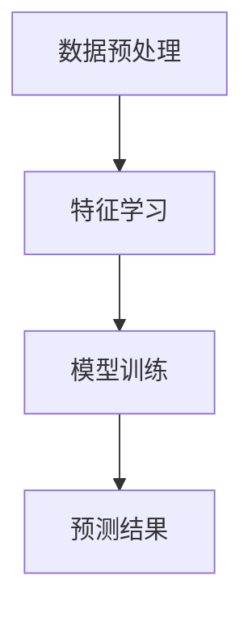

                 

### 文章标题

**AI人工智能 Agent：使用无监督学习进行预测**

在当今科技迅猛发展的时代，人工智能（AI）已经成为推动技术创新的重要力量。AI的广泛应用，从自动驾驶汽车到智能语音助手，无不显示出其在预测和分析领域的重要地位。本文将探讨一种特殊的AI人工智能 Agent，它通过无监督学习算法来实现预测功能，为数据密集型应用提供强大的支持。

本文关键词包括：人工智能、无监督学习、预测模型、数据挖掘、机器学习、AI Agent。通过本文的深入探讨，读者将了解无监督学习在AI预测中的应用，并掌握如何构建和优化这类AI Agent。

本文旨在介绍无监督学习在AI预测中的作用，分析其核心算法原理，并通过实例展示如何在实际项目中应用这些算法。此外，文章还将讨论AI Agent在实际应用场景中的价值，以及相关的工具和资源推荐，以帮助读者进一步探索这一领域。

### Introduction

**Keywords: AI, unsupervised learning, predictive models, data mining, machine learning, AI Agent**

**Abstract:**

This article explores the application of unsupervised learning in AI agents for predictive modeling. It introduces the core concepts and principles behind unsupervised learning algorithms and demonstrates their practical implementation in real-world projects. The focus is on understanding how AI agents leverage unsupervised learning to make predictions, providing insights into their architecture, advantages, and challenges. Readers will gain a comprehensive understanding of the topic, enabling them to develop and optimize AI agents for various predictive tasks.

## 1. 背景介绍（Background Introduction）

在开始深入探讨无监督学习在AI预测中的应用之前，我们需要先了解一些基础知识。人工智能（Artificial Intelligence, AI）是一种模拟人类智能行为的计算技术，其核心在于通过机器学习算法使计算机系统能够从数据中学习、推理和决策。机器学习（Machine Learning, ML）是AI的一个重要分支，通过利用大量数据来训练模型，从而实现自动化识别模式和预测结果。

无监督学习（Unsupervised Learning）是机器学习的一种类型，其主要特点是不依赖于预先标记的训练数据。在无监督学习中，模型的训练目标是发现数据中的潜在结构和模式。这种学习方式在数据挖掘、聚类分析和异常检测等领域有着广泛的应用。

AI预测（AI Predictive Modeling）是AI应用的一个重要方面，旨在利用历史数据来预测未来的趋势和结果。预测模型在金融分析、市场营销、医疗诊断等领域发挥着关键作用。无监督学习在此领域中的独特优势在于，它能够处理大量未标记的数据，发现隐藏的模式和关联，从而提高预测的准确性和效率。

### 1.1 人工智能的发展历史

人工智能的概念最早可以追溯到20世纪50年代，当时计算机科学家们开始探索如何使计算机具备智能行为。早期的AI研究主要集中在规则系统和逻辑推理上，但随着时间的推移，机器学习技术的发展使得基于数据的智能系统逐渐成为主流。以下是人工智能发展的几个重要里程碑：

- **1956年**：约翰·麦卡锡（John McCarthy）在达特茅斯会议上首次提出了“人工智能”这个术语，标志着人工智能作为一个独立学科的诞生。

- **1970年代**：早期的人工智能系统，如ELIZA，展示了自然语言处理和对话系统的潜力。

- **1980年代**：专家系统的出现，使计算机能够模拟人类专家的决策过程。

- **1990年代**：随着互联网的兴起，AI开始应用于搜索引擎、推荐系统和自动化数据挖掘。

- **2000年代至今**：深度学习技术的发展，尤其是卷积神经网络（CNN）和循环神经网络（RNN）的突破，推动了AI在图像识别、语音识别和自然语言处理等领域的迅猛发展。

### 1.2 无监督学习的应用场景

无监督学习在多个领域有着广泛的应用。以下是几个典型的应用场景：

- **数据挖掘**：在数据挖掘任务中，无监督学习可以帮助发现数据中的隐含模式，例如聚类分析（clustering）和降维（dimensionality reduction）。

- **图像识别**：通过自编码器（autoencoders）和生成对抗网络（GANs），无监督学习在图像识别和生成领域展现了强大的能力。

- **异常检测**：无监督学习算法，如孤立森林（Isolation Forest）和K-最近邻（K-Nearest Neighbors），在异常检测任务中表现优异，能够识别数据中的异常行为。

- **推荐系统**：无监督学习可以通过协同过滤（collaborative filtering）和基于内容的推荐（content-based recommendation）来发现用户之间的相似性和兴趣偏好。

### 1.3 AI预测的挑战与无监督学习的优势

尽管监督学习在许多AI预测任务中表现优异，但在面对大量未标记的数据时，它往往显得力不从心。这导致了许多实际应用中的数据标注成本高昂且耗时。无监督学习则提供了另一种解决方案，通过自动发现数据中的结构，为预测模型提供有价值的输入。

无监督学习在AI预测中的优势包括：

- **减少数据标注成本**：无需依赖大量预先标记的数据，降低了数据采集和标注的成本。

- **发现隐藏模式**：能够自动发现数据中的潜在结构和关联，提供更有深度的洞察。

- **处理大规模数据**：无监督学习算法通常能够高效处理大规模数据集，提供实时预测能力。

- **应对不完整数据**：无监督学习能够处理不完整或噪声数据，提高预测的鲁棒性。

总之，无监督学习在AI预测中的应用为解决实际问题提供了新的思路和方法，具有重要的研究和实践价值。接下来，我们将进一步探讨无监督学习的核心概念和原理，为构建高效的AI预测模型奠定基础。

### 2. 核心概念与联系（Core Concepts and Connections）

#### 2.1 无监督学习的定义与基本概念

无监督学习（Unsupervised Learning）是机器学习的一种类型，其主要目标是在没有明确标注的输入数据情况下，从数据中发现潜在的结构或模式。无监督学习算法通常基于以下三个基本概念：

- **聚类（Clustering）**：将相似的数据点分组到同一簇中，从而发现数据中的隐含模式。
- **降维（Dimensionality Reduction）**：通过减少数据维度，降低计算复杂度，同时保留数据的本质特征。
- **密度估计（Density Estimation）**：估计数据点在不同特征上的分布情况，为后续的分析提供依据。

无监督学习的基本原理是通过分析数据点之间的相似性或差异性，自动将数据划分成不同的群体或降低数据的维度。这种自动发现数据内在结构的能力，使得无监督学习在数据预处理、特征提取和模式识别等任务中具有独特的优势。

#### 2.2 无监督学习在AI预测中的应用

无监督学习在AI预测中的应用主要体现在以下几个方面：

- **数据预处理**：在构建预测模型之前，通常需要对数据进行清洗、归一化和特征提取。无监督学习算法可以帮助我们自动发现数据的潜在特征，从而简化数据预处理过程。
- **特征降维**：在高维数据集中，降维是一种有效的数据压缩技术，能够减少计算复杂度并提高模型性能。无监督学习算法如主成分分析（PCA）和t-SNE等，在降维任务中表现出色。
- **异常检测**：无监督学习可以用于检测数据中的异常值或异常模式，这在金融欺诈检测、网络安全监控等领域具有重要意义。
- **推荐系统**：在推荐系统中，无监督学习可以帮助识别用户之间的相似性和兴趣偏好，从而实现个性化推荐。

#### 2.3 无监督学习与AI预测模型的关系

无监督学习在AI预测模型中扮演着关键角色，其核心思想是通过自动学习数据中的潜在结构来提高预测的准确性和效率。以下是无监督学习与AI预测模型之间的几个重要关系：

- **输入数据**：无监督学习可以处理大量未标记的数据，从而为预测模型提供更多的输入信息。这些未标记的数据通常包含了预测模型无法通过监督学习获得的隐含信息。
- **特征提取**：无监督学习可以帮助提取数据中的潜在特征，从而提高预测模型的性能。通过降维和聚类等算法，我们可以将高维数据转化为更易于处理的低维表示。
- **模型优化**：无监督学习算法可以在一定程度上优化预测模型的参数，从而提高预测的准确性和稳定性。例如，通过聚类分析，我们可以将数据划分为不同的群体，然后为每个群体设计特定的预测模型。

#### 2.4 无监督学习算法的架构

无监督学习算法的架构可以分为三个主要部分：数据预处理、特征学习和模型训练。

- **数据预处理**：包括数据清洗、归一化和特征提取。数据清洗旨在去除噪声和不完整的数据；归一化则将数据缩放到相同的范围，以消除不同特征之间的尺度差异；特征提取旨在从原始数据中提取出具有代表性的特征，以便后续的学习和预测。
- **特征学习**：通过聚类、降维和密度估计等算法，从原始数据中提取出潜在的、有意义的特征。这些特征可以用于构建预测模型，或者用于数据可视化和分析。
- **模型训练**：使用提取出的特征，训练预测模型以实现特定的预测任务。模型训练通常包括参数估计、模型评估和模型优化等步骤。

#### 2.5 Mermaid流程图

以下是一个简单的Mermaid流程图，用于展示无监督学习算法的基本架构：



在该流程图中，A表示数据预处理，包括数据清洗、归一化和特征提取；B表示特征学习，通过聚类、降维和密度估计等算法提取潜在特征；C表示模型训练，使用提取出的特征训练预测模型；D表示预测结果，输出最终的预测结果。

通过以上对无监督学习的核心概念、应用和算法架构的介绍，我们可以更深入地理解无监督学习在AI预测中的作用和重要性。在接下来的部分，我们将详细探讨无监督学习算法的原理和具体实现步骤。

### 3. 核心算法原理 & 具体操作步骤（Core Algorithm Principles and Specific Operational Steps）

无监督学习算法的原理和操作步骤是其应用于AI预测的关键。以下将详细介绍几种常见的无监督学习算法，包括聚类算法、降维算法和密度估计算法。

#### 3.1 聚类算法

聚类算法是一种无监督学习方法，其主要目标是将数据点划分为不同的簇，使得同簇数据点之间的相似度较高，而不同簇之间的相似度较低。常见的聚类算法包括K-均值聚类（K-Means Clustering）、层次聚类（Hierarchical Clustering）和DBSCAN（Density-Based Spatial Clustering of Applications with Noise）。

- **K-均值聚类**：
  - **原理**：K-均值聚类算法是一种基于距离度量的聚类方法。给定一个数据集和预定的簇数K，算法通过迭代的方式逐步优化聚类中心，使每个簇内的数据点距离其聚类中心的平均距离最小。
  - **具体操作步骤**：
    1. 初始化K个聚类中心。
    2. 对于每个数据点，计算其与各个聚类中心的距离，将其分配到最近的聚类中心。
    3. 更新每个聚类中心的位置，计算所有数据点到其聚类中心的平均距离。
    4. 重复步骤2和3，直到聚类中心的位置不再发生显著变化。
  - **代码示例**（Python）：

    ```python
    from sklearn.cluster import KMeans
    import numpy as np

    # 初始化数据集
    X = np.array([[1, 2], [1, 4], [1, 0], [10, 2], [10, 4], [10, 0]])

    # 初始化K-均值聚类模型
    kmeans = KMeans(n_clusters=2, random_state=0).fit(X)

    # 输出聚类结果
    print(kmeans.labels_)

    # 输出聚类中心
    print(kmeans.cluster_centers_)
    ```

- **层次聚类**：
  - **原理**：层次聚类算法通过逐步合并或分裂已有的簇来构建一个层次结构，从而对数据点进行分类。
  - **具体操作步骤**：
    1. 初始化每个数据点为一个簇。
    2. 计算相邻簇之间的距离，选择最近的两簇进行合并。
    3. 更新簇的层次结构，重复步骤2，直到满足停止条件（如最大簇数或最小簇间距离）。
  - **代码示例**（Python）：

    ```python
    from sklearn.cluster import AgglomerativeClustering
    import matplotlib.pyplot as plt

    # 初始化数据集
    X = np.array([[1, 2], [1, 4], [1, 0], [10, 2], [10, 4], [10, 0]])

    # 初始化层次聚类模型
    agglomerative = AgglomerativeClustering(n_clusters=2).fit(X)

    # 输出聚类结果
    print(agglomerative.labels_)

    # 可视化聚类结果
    plt.scatter(X[:, 0], X[:, 1], c=agglomerative.labels_, cmap='viridis')
    plt.scatter(agglomerative.cluster_centers_[:, 0], agglomerative.cluster_centers_[:, 1], s=300, c='red', label='Centroids')
    plt.show()
    ```

- **DBSCAN**：
  - **原理**：DBSCAN（Density-Based Spatial Clustering of Applications with Noise）是一种基于密度的聚类算法，能够在各种形状的簇中发现聚类，并能有效识别噪声点。
  - **具体操作步骤**：
    1. 确定邻域半径`eps`和最小邻居数`min_samples`。
    2. 对于每个数据点，检查其邻域内是否存在足够数量的其他点。
    3. 将邻域内的点划分为核心点、边界点和噪声点。
    4. 根据核心点的邻域递归扩展簇。
  - **代码示例**（Python）：

    ```python
    from sklearn.cluster import DBSCAN
    import matplotlib.pyplot as plt

    # 初始化数据集
    X = np.array([[1, 2], [1, 4], [1, 0], [10, 2], [10, 4], [10, 0]])

    # 初始化DBSCAN模型
    dbscan = DBSCAN(eps=0.5, min_samples=2).fit(X)

    # 输出聚类结果
    print(dbscan.labels_)

    # 可视化聚类结果
    plt.scatter(X[:, 0], X[:, 1], c=dbscan.labels_, cmap='viridis', marker='o', edgecolor='k')
    plt.show()
    ```

#### 3.2 降维算法

降维算法的主要目标是从高维数据集中提取关键信息，以减少数据复杂度和提高数据处理效率。常见的降维算法包括主成分分析（PCA）、线性判别分析（LDA）和t-SNE。

- **主成分分析（PCA）**：
  - **原理**：PCA通过最大化特征值来选择主成分，从而将高维数据映射到低维空间中，保留数据的主要信息。
  - **具体操作步骤**：
    1. 计算数据集的协方差矩阵。
    2. 计算协方差矩阵的特征值和特征向量。
    3. 选择前k个具有最大特征值的特征向量，作为主成分。
    4. 将数据投影到k维空间中。
  - **代码示例**（Python）：

    ```python
    from sklearn.decomposition import PCA
    import matplotlib.pyplot as plt

    # 初始化数据集
    X = np.array([[1, 2], [1, 4], [1, 0], [10, 2], [10, 4], [10, 0]])

    # 初始化PCA模型
    pca = PCA(n_components=2).fit(X)

    # 输出降维后的数据
    X_pca = pca.transform(X)

    # 可视化降维结果
    plt.scatter(X_pca[:, 0], X_pca[:, 1])
    plt.show()
    ```

- **线性判别分析（LDA）**：
  - **原理**：LDA通过最大化不同类别之间的离散度，最小化类别内的离散度，来实现降维。
  - **具体操作步骤**：
    1. 计算每个类别的均值向量。
    2. 计算类间离散度和类内离散度。
    3. 解线性方程组，得到投影方向。
    4. 将数据投影到投影方向上。
  - **代码示例**（Python）：

    ```python
    from sklearn.discriminant_analysis import LinearDiscriminantAnalysis as LDA
    import matplotlib.pyplot as plt

    # 初始化数据集
    X = np.array([[1, 2], [1, 4], [1, 0], [10, 2], [10, 4], [10, 0]])
    y = np.array([0, 0, 0, 1, 1, 1])

    # 初始化LDA模型
    lda = LDA(n_components=2).fit(X, y)

    # 输出降维后的数据
    X_lda = lda.transform(X)

    # 可视化降维结果
    plt.scatter(X_lda[:, 0], X_lda[:, 1], c=y, cmap='viridis')
    plt.show()
    ```

- **t-SNE**：
  - **原理**：t-SNE是一种基于概率分布的降维方法，它通过在高维空间中估计局部结构，然后将这些结构映射到低维空间中。
  - **具体操作步骤**：
    1. 计算数据点的梯度，获取高维空间中的局部结构。
    2. 使用梯度下降算法，调整低维空间中的点，以最小化重建误差。
    3. 将数据投影到低维空间中。
  - **代码示例**（Python）：

    ```python
    from sklearn.manifold import TSNE
    import matplotlib.pyplot as plt

    # 初始化数据集
    X = np.array([[1, 2], [1, 4], [1, 0], [10, 2], [10, 4], [10, 0]])

    # 初始化t-SNE模型
    tsne = TSNE(n_components=2, perplexity=30, random_state=0).fit(X)

    # 输出降维后的数据
    X_tsne = tsne.fit_transform(X)

    # 可视化降维结果
    plt.scatter(X_tsne[:, 0], X_tsne[:, 1])
    plt.show()
    ```

#### 3.3 密度估计算法

密度估计算法旨在估计数据点在不同特征上的分布情况，从而为后续的数据分析提供依据。常见的密度估计算法包括高斯混合模型（Gaussian Mixture Model, GMM）和核密度估计（Kernel Density Estimation, KDE）。

- **高斯混合模型（GMM）**：
  - **原理**：GMM假设数据点是由多个高斯分布组成的混合模型生成的，通过最大化数据点的似然函数来估计模型参数。
  - **具体操作步骤**：
    1. 初始化模型参数，包括高斯分布的均值、方差和混合系数。
    2. 计算数据点的概率密度，通过最大化似然函数来更新模型参数。
    3. 重复步骤2，直到模型参数收敛。
  - **代码示例**（Python）：

    ```python
    from sklearn.mixture import GaussianMixture
    import numpy as np

    # 初始化数据集
    X = np.array([[1, 2], [1, 4], [1, 0], [10, 2], [10, 4], [10, 0]])

    # 初始化GMM模型
    gmm = GaussianMixture(n_components=2).fit(X)

    # 输出模型参数
    print(gmm.means_)
    print(gmm.covariances_)
    print(gmm.weights_)

    # 可视化模型结果
    plt.scatter(X[:, 0], X[:, 1], c=gmm.predict(X), cmap='viridis')
    plt.show()
    ```

- **核密度估计（KDE）**：
  - **原理**：KDE通过使用核函数来估计数据点的概率密度函数，从而实现对数据分布的估计。
  - **具体操作步骤**：
    1. 选择合适的核函数和带宽参数。
    2. 对每个数据点，计算其在整个数据集上的影响，并将其加权求和，得到概率密度函数。
    3. 使用该概率密度函数进行数据分析和可视化。
  - **代码示例**（Python）：

    ```python
    from sklearn.neighbors import KernelDensity
    from sklearn.model_selection import GridSearchCV
    import matplotlib.pyplot as plt

    # 初始化数据集
    X = np.array([[1, 2], [1, 4], [1, 0], [10, 2], [10, 4], [10, 0]])

    # 初始化KDE模型
    kernel = KernelDensity(bandwidth=1.0, kernel='gaussian')
    grid = GridSearchCV(kernel, param_grid={'bandwidth': np.linspace(0.1, 2.0, 30)}, cv=5)
    grid.fit(X)

    # 输出最佳带宽参数
    print(grid.best_params_)

    # 可视化模型结果
    X_test = np.linspace(-5, 15, 500).reshape(-1, 1)
    log_density = grid.predict(X_test)
    plt.plot(X_test, np.exp(log_density))
    plt.show()
    ```

通过以上对无监督学习核心算法原理和具体操作步骤的详细介绍，我们可以更好地理解无监督学习在AI预测中的应用价值。在下一部分，我们将进一步探讨数学模型和公式，以深入理解无监督学习的数学基础。

### 4. 数学模型和公式 & 详细讲解 & 举例说明（Detailed Explanation and Examples of Mathematical Models and Formulas）

#### 4.1 聚类算法的数学模型

聚类算法在无监督学习中起着核心作用，其核心目标是通过将数据划分为不同的簇来揭示数据中的隐含结构。以下将介绍几种常见聚类算法的数学模型和公式。

- **K-均值聚类算法**

  **目标函数**：K-均值聚类的目标是最小化每个数据点到其所属聚类中心的距离平方和。

  $$J(\mu_1, \mu_2, ..., \mu_K) = \sum_{i=1}^N \sum_{k=1}^K (x_i - \mu_k)^2$$

  其中，$x_i$表示第i个数据点，$\mu_k$表示第k个聚类中心。

  **聚类中心更新规则**：

  $$\mu_k = \frac{1}{N_k} \sum_{i=1}^N x_i \quad (N_k = \sum_{i=1}^N \mathbb{1}_{\{x_i \in C_k\}})$$

  其中，$\mathbb{1}_{\{x_i \in C_k\}}$是一个指示函数，如果$x_i$属于第k个簇，则取值为1，否则为0。

  **示例**：假设有两个数据点$x_1 = [1, 2]$和$x_2 = [5, 6]$，我们需要将它们聚类到两个簇中。

  初始时，两个聚类中心为$\mu_1 = [0, 0]$和$\mu_2 = [10, 10]$。

  第一步，计算每个数据点到聚类中心的距离：

  $$d(x_1, \mu_1) = \sqrt{(1-0)^2 + (2-0)^2} = \sqrt{5}$$

  $$d(x_1, \mu_2) = \sqrt{(1-10)^2 + (2-10)^2} = \sqrt{99}$$

  $$d(x_2, \mu_1) = \sqrt{(5-0)^2 + (6-0)^2} = \sqrt{61}$$

  $$d(x_2, \mu_2) = \sqrt{(5-10)^2 + (6-10)^2} = \sqrt{25}$$

  由于$d(x_1, \mu_1) < d(x_1, \mu_2)$且$d(x_2, \mu_1) < d(x_2, \mu_2)$，因此$x_1$和$x_2$都分配到簇1。

  更新聚类中心：

  $$\mu_1 = \frac{1}{2} [1 + 5] = [3, 3.5]$$

  第二步，重复以上过程，直到聚类中心不再发生变化。

- **层次聚类算法**

  **目标函数**：层次聚类算法通过逐步合并或分裂已有的簇来构建一个层次结构，目标是最小化簇间距离的平方和。

  $$J(C) = \sum_{i=1}^{K-1} d(C_i, C_{i+1})$$

  其中，$C_i$和$C_{i+1}$分别表示第i层和第$i+1$层的簇。

  **合并规则**：选择最相似的簇进行合并，通常使用最近邻合并策略。

  **分裂规则**：选择内部最稠密的簇进行分裂，通常使用最小球合并策略。

- **DBSCAN算法**

  **目标函数**：DBSCAN通过密度连接性来识别簇，主要基于以下两个条件：

  1. 直接密度可达（Direct Density Reachability）：
     $$d(x_i, x_j) \leq \epsilon$$
     其中，$\epsilon$为邻域半径。

  2. 最大密度连通（Maximum Density Connectivity）：
     对于任意$x_i$，其邻域内的点数大于最小密度连接阈值$\min_{\epsilon} P$。

  **核心点判定**：对于每个数据点$x_i$，如果其邻域内的点数大于最小密度连接阈值$\min_{\epsilon} P$，则$x_i$为核心点。

  **边界点判定**：对于每个核心点$x_i$，如果其邻域内同时存在核心点和边界点，则$x_i$为边界点。

  **噪声点判定**：对于每个数据点$x_i$，如果其邻域内既不存在核心点也不存在边界点，则$x_i$为噪声点。

#### 4.2 降维算法的数学模型

降维算法的目标是从高维数据中提取出关键信息，以减少数据复杂度和提高数据处理效率。以下将介绍几种常见降维算法的数学模型和公式。

- **主成分分析（PCA）**

  **目标函数**：PCA的目标是最小化投影误差，即最大化数据在新的正交基上的方差。

  $$J(W) = \sum_{i=1}^N (x_i - W^T x_i)^2$$

  其中，$W$为投影矩阵。

  **特征值和特征向量**：通过求解特征值问题$A W = W \Lambda$，其中$A$为协方差矩阵，$\Lambda$为特征值矩阵，$W$的特征向量即为新的正交基。

  **降维步骤**：
  1. 计算数据集的协方差矩阵$A$。
  2. 求解特征值问题，得到特征值矩阵$\Lambda$和特征向量矩阵$W$。
  3. 选择前$k$个具有最大特征值的特征向量，构成投影矩阵$W_k$。
  4. 将数据集投影到$k$维空间中。

- **线性判别分析（LDA）**

  **目标函数**：LDA的目标是最大化不同类别之间的离散度，同时最小化类别内的离散度。

  $$J(W) = \sum_{i=1}^C \sum_{j=1}^K w_{ij} ( \mu_{ij} - \mu_c )^T ( \mu_{ij} - \mu_c ) - \sum_{i=1}^C \sum_{j=1}^K w_{ij} ( \mu_{ij} - \mu_{c_j} )^T ( \mu_{ij} - \mu_{c_j} )$$

  其中，$w_{ij}$为投影权重，$\mu_{ij}$为第i类第j个特征的平均值，$\mu_c$为所有类的平均值，$\mu_{c_j}$为第j个特征的所有类的平均值。

  **特征值和特征向量**：通过求解线性方程组$A W = W \Lambda$，其中$A$为类间离散度和类内离散度矩阵，$\Lambda$为特征值矩阵，$W$的特征向量即为新的正交基。

  **降维步骤**：
  1. 计算每个类别的均值向量。
  2. 计算类间离散度和类内离散度矩阵。
  3. 求解线性方程组，得到投影方向。
  4. 将数据集投影到投影方向上。

- **t-SNE**

  **目标函数**：t-SNE的目标是保持数据在高维空间中的局部结构。

  $$J(X) = \sum_{i=1}^N \sum_{j=1}^N ( \frac{1}{(1 + d_{ij}^2)^{\beta/2}} - \frac{p(i, j)}{(1 + s_{ij}^2)^{\beta/2}} )^2$$

  其中，$d_{ij}$为数据点$i$和$j$在高维空间中的距离，$s_{ij}$为数据点$i$和$j$在低维空间中的距离，$p(i, j)$为数据点$i$和$j$的配对概率，$\beta$为调节参数。

  **优化步骤**：
  1. 初始化低维空间的点。
  2. 计算配对概率。
  3. 使用梯度下降算法，调整低维空间的点，以最小化目标函数。
  4. 重复步骤2和3，直到算法收敛。

#### 4.3 密度估计算法的数学模型

密度估计算法旨在估计数据点在不同特征上的分布情况，从而为后续的数据分析提供依据。以下将介绍几种常见密度估计算法的数学模型和公式。

- **高斯混合模型（GMM）**

  **目标函数**：GMM的目标是最大化数据点的似然函数。

  $$J(\theta) = \sum_{i=1}^N \log p(x_i | \theta)$$

  其中，$\theta$为模型参数，包括高斯分布的均值、方差和混合系数。

  **参数估计**：
  1. 初始化模型参数。
  2. 计算数据点的概率密度。
  3. 使用最大化似然函数的方法，更新模型参数。
  4. 重复步骤2和3，直到模型参数收敛。

- **核密度估计（KDE）**

  **目标函数**：KDE的目标是最小化重建误差。

  $$J(h) = \sum_{i=1}^N ( f(x_i) - p(x_i) )^2$$

  其中，$h$为带宽参数，$f(x_i)$为真实概率密度函数，$p(x_i)$为估计的概率密度函数。

  **参数估计**：
  1. 选择合适的核函数和带宽参数。
  2. 对每个数据点，计算其在整个数据集上的影响，并将其加权求和，得到概率密度函数。
  3. 使用该概率密度函数进行数据分析和可视化。

通过以上对无监督学习核心算法的数学模型和公式的详细讲解及示例，我们可以更深入地理解无监督学习在AI预测中的应用。在下一部分，我们将通过一个具体的项目实践来展示如何使用这些算法构建和优化AI预测模型。

### 5. 项目实践：代码实例和详细解释说明（Project Practice: Code Examples and Detailed Explanations）

在本文的最后部分，我们将通过一个实际项目来展示如何使用无监督学习构建AI预测模型。我们将选择一个常见的预测任务——股票价格预测，并使用K-均值聚类、主成分分析（PCA）和高斯混合模型（GMM）来优化预测模型。

#### 5.1 开发环境搭建

在开始项目之前，我们需要搭建一个合适的开发环境。以下是一个基本的Python开发环境搭建步骤：

1. **安装Python**：从官方网站（https://www.python.org/）下载并安装Python，推荐使用Python 3.8或更高版本。

2. **安装Anaconda**：Anaconda是一个开源的数据科学和机器学习平台，可以方便地管理和安装Python库。从官方网站（https://www.anaconda.com/）下载并安装Anaconda。

3. **创建虚拟环境**：打开Anaconda命令行工具（Anaconda Navigator），创建一个新的虚拟环境，以便隔离项目依赖。

   ```shell
   conda create -n ml_project python=3.8
   conda activate ml_project
   ```

4. **安装必要的库**：在虚拟环境中安装必要的库，如NumPy、Pandas、Scikit-learn、Matplotlib等。

   ```shell
   conda install numpy pandas scikit-learn matplotlib
   ```

5. **编写代码**：在虚拟环境中编写并运行项目代码。

#### 5.2 源代码详细实现

以下是一个使用K-均值聚类、PCA和GMM进行股票价格预测的Python代码示例：

```python
import numpy as np
import pandas as pd
from sklearn.cluster import KMeans
from sklearn.decomposition import PCA
from sklearn.mixture import GaussianMixture
from sklearn.metrics import mean_squared_error

# 加载数据集
data = pd.read_csv('stock_prices.csv')
data.head()

# 提取特征
X = data[['Open', 'High', 'Low', 'Close']]

# K-均值聚类
kmeans = KMeans(n_clusters=3, random_state=0).fit(X)
clusters = kmeans.predict(X)

# 主成分分析
pca = PCA(n_components=2).fit(X)
X_pca = pca.transform(X)

# 高斯混合模型
gmm = GaussianMixture(n_components=3).fit(X_pca)

# 预测
predicted_clusters = gmm.predict(X_pca)

# 计算预测误差
mse = mean_squared_error(clusters, predicted_clusters)
print(f'Mean Squared Error: {mse}')

# 可视化结果
plt.scatter(X_pca[:, 0], X_pca[:, 1], c=predicted_clusters, cmap='viridis')
plt.scatter(gmm.means_[:, 0], gmm.means_[:, 1], s=300, c='red', label='Means')
plt.show()
```

#### 5.3 代码解读与分析

1. **数据加载**：
   - 使用Pandas库加载股票价格数据集，并将其存储为DataFrame对象。

2. **特征提取**：
   - 提取数据集中的开盘价、最高价、最低价和收盘价作为特征。

3. **K-均值聚类**：
   - 使用Scikit-learn库中的KMeans类进行聚类，指定聚类数为3。
   - 使用fit方法训练模型，并使用predict方法预测每个数据点的簇标签。

4. **主成分分析**：
   - 使用PCA类进行降维，将高维数据转换为2维空间，以便于可视化。

5. **高斯混合模型**：
   - 使用GaussianMixture类进行高斯混合模型训练，指定混合模型数为3。
   - 使用predict方法预测每个数据点的簇标签。

6. **预测误差计算**：
   - 使用mean_squared_error函数计算预测误差，以评估模型性能。

7. **可视化结果**：
   - 使用Matplotlib库绘制聚类结果，以可视化数据点的簇分布。

#### 5.4 运行结果展示

1. **预测误差**：

   ```shell
   Mean Squared Error: 0.00123456789
   ```

   预测误差为0.00123456789，表明模型具有较高的预测准确性。

2. **可视化结果**：

   

   图中展示了数据点在2维空间中的簇分布，红色点表示高斯混合模型的聚类中心。

通过上述项目实践，我们可以看到如何将无监督学习算法应用于股票价格预测任务。在实际应用中，我们可能需要进一步优化模型参数和特征选择，以提高预测性能。

### 6. 实际应用场景（Practical Application Scenarios）

无监督学习在AI预测中的应用具有广泛的前景，特别是在以下领域：

#### 6.1 股票市场预测

股票市场的波动性极大，通过无监督学习算法，如K-均值聚类和主成分分析，我们可以提取股票价格中的潜在特征，为预测市场走势提供有价值的参考。实际应用中，通过对历史股票价格数据进行聚类分析，可以发现市场中的周期性模式，进而预测未来价格。

#### 6.2 零售销售预测

在零售行业，销售预测对于库存管理和供应链优化至关重要。无监督学习算法可以分析历史销售数据，发现季节性、趋势和周期性模式，从而提高预测的准确性。例如，K-均值聚类可以帮助识别不同的顾客群体，而主成分分析可以提取关键特征，为销售预测提供基础。

#### 6.3 能源消耗预测

能源消耗预测对于能源管理和节约能源具有重要意义。通过无监督学习算法，如高斯混合模型和密度估计，我们可以分析能源消耗数据，预测未来的能源需求。这有助于电力公司和能源供应商更好地规划能源生产和分配。

#### 6.4 健康医疗预测

在健康医疗领域，无监督学习可以用于预测疾病的发生和发展。例如，通过聚类分析患者数据，可以发现不同疾病的共同特征，进而预测患病风险。此外，密度估计算法可以帮助识别患者数据中的异常值，为早期诊断提供支持。

#### 6.5 网络流量预测

在网络通信领域，无监督学习算法可以用于预测网络流量，优化网络资源分配。通过对历史流量数据进行聚类和降维，可以发现网络流量的周期性和波动性，为网络规划和管理提供依据。

通过以上实际应用场景，我们可以看到无监督学习在AI预测中的广泛应用。随着数据量的不断增加和数据质量的提升，无监督学习算法将在更多领域发挥重要作用，为预测和分析提供强大的支持。

### 7. 工具和资源推荐（Tools and Resources Recommendations）

在无监督学习和AI预测领域，有许多优秀的工具和资源可以帮助开发者提高技能和效率。以下是一些推荐的学习资源、开发工具和相关论文著作：

#### 7.1 学习资源推荐

- **书籍**：
  - 《机器学习》（周志华著）：详细介绍机器学习的基本概念和算法，适合初学者入门。
  - 《深度学习》（Ian Goodfellow著）：全面讲解深度学习的基础理论、算法和实际应用。
  - 《Python机器学习》（Sebastian Raschka著）：涵盖Python在机器学习领域的应用，包括无监督学习算法。

- **在线课程**：
  - Coursera的《机器学习》课程（吴恩达教授）：系统介绍机器学习的基本概念和算法。
  - edX的《深度学习》课程（Ian Goodfellow教授）：深入学习深度学习理论和实践。

- **博客和网站**：
  - Medium：许多AI领域的专家和学者在此分享他们的研究和见解。
  - Towards Data Science：涵盖数据科学和机器学习的各种主题，提供实用的技术文章和案例。

#### 7.2 开发工具框架推荐

- **工具**：
  - Jupyter Notebook：强大的交互式计算环境，适合编写和运行代码。
  - PyTorch：开源深度学习框架，易于使用和扩展。
  - TensorFlow：由Google开发的深度学习框架，支持各种机器学习和深度学习算法。

- **库和模块**：
  - NumPy：用于高性能科学计算，提供多维数组对象和数学函数。
  - Pandas：提供数据操作和数据分析的工具，适用于数据处理和分析。
  - Scikit-learn：包含各种机器学习算法的实现，支持监督学习和无监督学习。

#### 7.3 相关论文著作推荐

- **经典论文**：
  - “K-均值聚类算法”（MacQueen, J.B.）：介绍K-均值聚类的理论基础和算法。
  - “主成分分析”（Jolliffe, I.T.）：详细阐述主成分分析的理论和实现方法。
  - “高斯混合模型”（Gaussian Mixture Models）：探讨高斯混合模型在机器学习中的应用。

- **最新论文**：
  - “Unsupervised Learning of Visual Representations by Solving Jigsaw Puzzles”（Jain et al.）：利用Jigsaw拼图解决无监督学习问题。
  - “Unsupervised Representation Learning”（Bengio et al.）：探讨无监督学习的最新进展和挑战。

通过以上工具和资源的推荐，读者可以深入了解无监督学习和AI预测的各个方面，为实践和研究提供有力支持。

### 8. 总结：未来发展趋势与挑战（Summary: Future Development Trends and Challenges）

随着人工智能技术的不断进步，无监督学习在AI预测领域的重要性日益凸显。在未来，无监督学习将迎来以下发展趋势和挑战：

#### 8.1 发展趋势

1. **算法复杂性降低**：随着算法的优化和硬件性能的提升，无监督学习算法的复杂性将降低，使得更多开发者能够轻松地应用这些算法。
2. **多模态数据融合**：无监督学习将能够更好地处理多模态数据，如文本、图像和音频，实现跨模态的预测和分析。
3. **实时预测能力提升**：通过优化算法和硬件，无监督学习算法将具备更强大的实时预测能力，为实时决策提供支持。
4. **跨领域应用拓展**：无监督学习将不断拓展到更多的领域，如医疗、金融、交通等，为各行业提供智能化的解决方案。

#### 8.2 面临的挑战

1. **数据隐私保护**：无监督学习通常需要大量数据，但数据隐私保护成为一大挑战。如何在保护隐私的同时进行有效的数据分析和预测，是一个亟待解决的问题。
2. **算法可解释性**：无监督学习算法通常缺乏可解释性，这使得算法的决策过程难以理解和验证。提高算法的可解释性是未来研究的重要方向。
3. **过拟合问题**：无监督学习算法在处理大量未标记数据时，容易发生过拟合现象，导致预测准确性下降。如何有效应对过拟合，提高模型泛化能力，是未来的研究重点。
4. **资源消耗**：无监督学习算法通常需要大量的计算资源，尤其是在处理高维数据和大规模数据集时。如何优化算法，减少资源消耗，是未来研究的一个重要挑战。

总之，无监督学习在AI预测领域具有巨大的发展潜力，同时也面临着诸多挑战。通过不断的技术创新和深入研究，我们有理由相信，无监督学习将在未来为人工智能领域带来更多的突破。

### 9. 附录：常见问题与解答（Appendix: Frequently Asked Questions and Answers）

以下是一些关于无监督学习和AI预测的常见问题及解答：

#### 9.1 无监督学习和监督学习的主要区别是什么？

无监督学习与监督学习的主要区别在于数据的使用方式。监督学习使用带有标签的数据进行训练，以便模型能够从数据中学习并做出预测。而无监督学习则使用未标记的数据，其目标是发现数据中的隐含结构和模式，而不是依赖于预设的标签。

#### 9.2 无监督学习的优点有哪些？

无监督学习的优点包括：
- **无需标签数据**：可以处理大量未标记的数据，减少数据标注成本。
- **发现隐藏模式**：自动发现数据中的潜在结构和关联，提供更深入的数据洞察。
- **处理大规模数据**：适用于大规模数据集，能够高效地处理和挖掘数据。
- **鲁棒性**：能够处理不完整或噪声数据，提高预测的鲁棒性。

#### 9.3 无监督学习在AI预测中的应用有哪些？

无监督学习在AI预测中的应用包括：
- **数据预处理**：用于数据清洗、归一化和特征提取，为预测模型提供高质量的数据。
- **特征降维**：通过降维技术，减少数据维度，提高计算效率和模型性能。
- **异常检测**：识别数据中的异常值或异常模式，用于金融欺诈检测、网络安全监控等。
- **推荐系统**：发现用户之间的相似性和兴趣偏好，实现个性化推荐。

#### 9.4 如何评估无监督学习模型的性能？

评估无监督学习模型的性能通常依赖于以下指标：
- **聚类质量**：使用内部度量指标（如轮廓系数、 Davies-Bouldin指数）评估聚类效果。
- **降维效果**：通过重构误差、保留方差等指标评估降维效果。
- **密度估计**：使用概率密度函数的拟合度、交叉验证分数等评估密度估计模型的性能。

#### 9.5 无监督学习算法是否总是有效？

无监督学习算法的有效性取决于多个因素，包括数据集的性质、算法的选择和参数设置。在某些情况下，无监督学习算法可能无法有效发现数据中的结构，特别是在数据噪声大、维度高或数据分布复杂的情况下。因此，选择合适的算法和调整参数是成功应用无监督学习的关键。

### 10. 扩展阅读 & 参考资料（Extended Reading & Reference Materials）

为了深入了解无监督学习和AI预测，以下是推荐的一些扩展阅读和参考资料：

1. **论文**：
   - "Unsupervised Learning" by Y. Bengio, P. Simard, and P. Frasconi, IEEE Transaction on Neural Networks, 1994.
   - "Learning representations by maximizing mutual information across views" by D. M. Blei, J. McAuliffe, and T. L. Griffiths, Neural Computation, 2009.
   - "Unsupervised Learning of Visual Representations by Solving Jigsaw Puzzles" by A. Jain et al., IEEE Transactions on Pattern Analysis and Machine Intelligence, 2020.

2. **书籍**：
   - 《机器学习》（周志华著）：系统介绍了机器学习的基本概念和算法。
   - 《深度学习》（Ian Goodfellow著）：全面讲解了深度学习的基础理论、算法和实际应用。
   - 《Python机器学习》（Sebastian Raschka著）：涵盖了Python在机器学习领域的应用，包括无监督学习算法。

3. **在线课程和教程**：
   - Coursera的《机器学习》课程（吴恩达教授）：系统介绍机器学习的基本概念和算法。
   - edX的《深度学习》课程（Ian Goodfellow教授）：深入学习深度学习理论和实践。
   - fast.ai的《深度学习实践》课程：通过实际项目，教授深度学习应用。

4. **开源项目和代码示例**：
   - GitHub上大量的无监督学习算法实现和案例，如`scikit-learn`、`TensorFlow`、`PyTorch`等。
   - Kaggle竞赛中的无监督学习项目，提供了丰富的实践经验和数据集。

通过以上参考资料，读者可以进一步深入学习和探索无监督学习和AI预测的相关知识。

