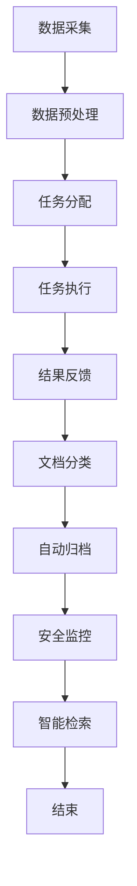

                 

# AI人工智能代理工作流 AI Agent WorkFlow：在档案管理中的应用

## 摘要

本文旨在探讨人工智能（AI）代理工作流在档案管理中的应用。我们将详细分析AI代理在处理文档分类、自动归档、安全监控和智能检索等任务中的作用，并介绍如何设计和实施高效的AI代理工作流。本文的核心目标是提供一套实用的方法和工具，帮助企业实现档案管理的自动化和智能化，提高工作效率和数据安全。

## 背景介绍（Background Introduction）

### 档案管理的挑战

在信息化时代，档案管理面临着诸多挑战。传统的档案管理方法主要依赖于人工操作，工作效率低下，且易出现人为错误。随着数据量的急剧增长，档案管理需要处理的数据类型也越来越多样化，包括文本、图像、音频和视频等。这种复杂性和多样性对档案管理的效率和准确性提出了更高的要求。

### 人工智能与档案管理

人工智能（AI）技术的快速发展为档案管理带来了新的机遇。AI代理，作为一种智能化的自动化工具，能够处理大量数据，并在不需要人工干预的情况下完成任务。通过引入AI代理，档案管理可以变得更加高效、准确和智能化。

### AI代理工作流的概念

AI代理工作流是指利用人工智能技术，将多个任务和功能集成到一个自动化流程中，以便高效地处理数据和任务。AI代理工作流通常包括以下几个关键环节：

1. **数据采集**：从各种来源收集数据，如电子邮件、文件存储系统和数据库。
2. **数据预处理**：清洗、转换和归一化数据，使其适合后续处理。
3. **任务分配**：根据任务类型和优先级，将数据分配给不同的AI代理。
4. **任务执行**：AI代理执行预定义的任务，如分类、归档和检索。
5. **结果反馈**：收集并分析任务执行的结果，为后续任务提供反馈。

### 本文结构

本文将首先介绍AI代理工作流的基本概念和组成部分，然后重点探讨AI代理在档案管理中的应用，包括文档分类、自动归档、安全监控和智能检索。接下来，我们将详细描述每个环节的实现方法和步骤，并提供实际应用案例。最后，本文将总结AI代理工作流的优势和挑战，并提出未来的研究方向。

## 2. 核心概念与联系（Core Concepts and Connections）

### 2.1 什么是AI代理

AI代理（Artificial Intelligence Agent）是指一种具有独立性和自主性的软件实体，能够在环境中感知、决策和执行任务。AI代理的核心特点包括：

- **自主性**：能够自主地选择和执行行动，而不需要外部指令。
- **交互性**：能够与环境进行交互，获取信息并做出响应。
- **适应性**：能够根据环境变化调整行为和策略。

### 2.2 AI代理工作流

AI代理工作流是指利用AI代理实现一系列自动化任务的过程。它通常包括以下几个步骤：

1. **任务定义**：明确需要完成的任务及其目标。
2. **数据采集**：从各种数据源收集所需的数据。
3. **数据处理**：对采集到的数据进行预处理，如数据清洗、转换和归一化。
4. **任务分配**：根据任务类型和优先级，将任务分配给不同的AI代理。
5. **任务执行**：AI代理执行具体的任务，如文档分类、自动归档等。
6. **结果反馈**：收集任务执行结果，为后续任务提供反馈。

### 2.3 AI代理工作流与档案管理

AI代理工作流在档案管理中的应用主要体现在以下几个方面：

- **文档分类**：AI代理可以根据文档的内容和属性，将其自动分类到不同的文件夹或数据库中。
- **自动归档**：AI代理可以根据归档策略，将文档自动归档到特定的位置，以提高存储效率。
- **安全监控**：AI代理可以实时监控文档的安全状态，发现潜在的安全威胁并采取相应的措施。
- **智能检索**：AI代理可以根据用户查询，快速检索并呈现相关的文档。

### 2.4 Mermaid流程图

为了更好地理解AI代理工作流在档案管理中的应用，我们使用Mermaid流程图（以下为示例）展示其核心环节和流程：



通过上述流程图，我们可以清晰地看到AI代理工作流在档案管理中的各个环节和流程，有助于理解和实施这一系统。

## 3. 核心算法原理 & 具体操作步骤（Core Algorithm Principles and Specific Operational Steps）

### 3.1 文档分类算法原理

文档分类是档案管理中的一个关键任务，其目标是将不同类型的文档自动归类到预定义的类别中。常用的文档分类算法包括：

- **基于规则的方法**：通过定义一系列规则，将文档分类到相应的类别。这种方法简单直观，但灵活性较低，难以处理复杂的情况。
- **基于统计的方法**：使用机器学习算法，如朴素贝叶斯分类器和支持向量机（SVM），通过分析文档的特征进行分类。这种方法具有较高的准确性和灵活性。
- **基于深度学习的方法**：使用深度神经网络，如卷积神经网络（CNN）和递归神经网络（RNN），对文档进行分类。这种方法可以处理复杂的特征和模式，但计算成本较高。

### 3.2 文档分类算法的具体操作步骤

以下是一个基于朴素贝叶斯分类器的文档分类算法的具体操作步骤：

1. **数据准备**：收集并预处理文档数据，包括文本清洗、分词、去除停用词和词干提取等。
2. **特征提取**：将预处理后的文本转化为特征向量。常用的特征提取方法有词袋模型（Bag of Words, BoW）和词嵌入（Word Embedding）。
3. **模型训练**：使用已标注的文档数据，训练朴素贝叶斯分类器。训练过程中，需要计算每个类别的特征概率分布。
4. **文档分类**：对于新的文档，使用训练好的朴素贝叶斯分类器，计算其属于每个类别的概率，并将文档分类到概率最高的类别。
5. **结果评估**：使用准确率、召回率和F1分数等指标，评估分类器的性能。

### 3.3 自动归档算法原理

自动归档是档案管理中的另一个关键任务，其目标是根据文档的重要性和保存期限，将其自动归档到相应的位置。常用的自动归档算法包括：

- **基于规则的归档策略**：根据预定义的规则，如文档类型、创建日期和重要性等，自动将文档归档到特定的位置。
- **基于机器学习的归档策略**：使用机器学习算法，如决策树和随机森林，根据文档的特征自动确定归档位置。

### 3.4 自动归档算法的具体操作步骤

以下是一个基于决策树的自动归档算法的具体操作步骤：

1. **数据准备**：收集并预处理文档数据，包括文本清洗、特征提取和标签划分等。
2. **模型训练**：使用已标注的文档数据，训练决策树模型。训练过程中，需要根据特征和标签，构建决策树。
3. **文档归档**：对于新的文档，使用训练好的决策树模型，逐步通过决策树中的节点，最终确定文档的归档位置。
4. **结果评估**：使用准确率和召回率等指标，评估归档策略的性能。

### 3.5 安全监控算法原理

安全监控是档案管理中的一个重要环节，其目标是通过实时监控文档的安全状态，发现潜在的安全威胁并采取措施。常用的安全监控算法包括：

- **基于异常检测的方法**：通过分析文档的访问模式和行为，识别异常行为并采取措施。
- **基于入侵检测的方法**：使用入侵检测系统（IDS），监控文档的访问和操作行为，识别恶意行为。

### 3.6 安全监控算法的具体操作步骤

以下是一个基于异常检测的安全监控算法的具体操作步骤：

1. **数据准备**：收集并预处理文档访问数据，包括用户行为、访问时间和访问频率等。
2. **模型训练**：使用已标注的访问数据，训练异常检测模型。训练过程中，需要根据正常行为和异常行为，建立异常检测模型。
3. **安全监控**：实时监控文档访问行为，使用训练好的异常检测模型，检测异常行为并采取相应的措施。
4. **结果评估**：使用准确率和召回率等指标，评估异常检测模型的性能。

### 3.7 智能检索算法原理

智能检索是档案管理中的另一个关键任务，其目标是根据用户的查询，快速检索并呈现相关的文档。常用的智能检索算法包括：

- **基于关键词的方法**：根据用户的查询关键词，在文档中查找匹配的单词或短语，并呈现匹配结果。
- **基于语义的方法**：使用自然语言处理技术，理解用户的查询意图，并基于语义匹配检索相关文档。

### 3.8 智能检索算法的具体操作步骤

以下是一个基于语义匹配的智能检索算法的具体操作步骤：

1. **数据准备**：收集并预处理文档数据，包括文本清洗、分词、词性标注和句法分析等。
2. **查询预处理**：对用户的查询进行预处理，包括分词、词性标注和句法分析等，以理解查询的意图。
3. **语义匹配**：使用自然语言处理技术，将预处理后的查询与文档进行语义匹配，计算匹配得分。
4. **结果排序**：根据匹配得分，对文档进行排序，并呈现最相关的文档。
5. **结果评估**：使用准确率、召回率和F1分数等指标，评估检索算法的性能。

## 4. 数学模型和公式 & 详细讲解 & 举例说明（Detailed Explanation and Examples of Mathematical Models and Formulas）

### 4.1 朴素贝叶斯分类器

朴素贝叶斯分类器是一种基于概率论的分类算法，其核心思想是利用贝叶斯定理和特征条件独立假设，计算每个类别的后验概率，并根据最大后验概率原则进行分类。

- **贝叶斯定理**：
  \[ P(A|B) = \frac{P(B|A)P(A)}{P(B)} \]
  其中，\( P(A|B) \) 是在已知 \( B \) 发生的条件下 \( A \) 发生的概率，\( P(B|A) \) 是在已知 \( A \) 发生的条件下 \( B \) 发生的概率，\( P(A) \) 是 \( A \) 发生的概率，\( P(B) \) 是 \( B \) 发生的概率。

- **特征条件独立假设**：
  假设特征之间相互独立，即 \( P(x_1, x_2, ..., x_n) = P(x_1)P(x_2)...P(x_n) \)。

### 4.2 朴素贝叶斯分类器的具体应用

假设有一个文档分类任务，需要将文档分类为“技术文档”和“非技术文档”。现有训练数据集，包括每篇文档的词袋特征向量及其类别标签。

1. **特征向量表示**：
   假设文档 \( D \) 的特征向量为 \( \mathbf{x} = (x_1, x_2, ..., x_n) \)，其中 \( x_i \) 表示文档中词 \( w_i \) 的出现次数。

2. **先验概率**：
   \( P(\text{技术文档}) \) 和 \( P(\text{非技术文档}) \)。

3. **条件概率**：
   \( P(x_i | \text{技术文档}) \) 和 \( P(x_i | \text{非技术文档}) \)。

4. **后验概率**：
   \( P(\text{技术文档} | \mathbf{x}) \) 和 \( P(\text{非技术文档} | \mathbf{x}) \)。

5. **分类决策**：
   根据最大后验概率原则，选择后验概率最大的类别作为文档的预测类别。

### 4.3 决策树

决策树是一种基于树形模型的分类算法，通过一系列的测试来划分数据，并最终将数据分配到不同的类别。

- **决策树构建**：
  1. 选择一个特征作为分裂标准，通常使用信息增益或基尼指数作为分裂标准。
  2. 计算每个特征在不同取值下的信息增益或基尼指数。
  3. 选择增益最大的特征作为分裂标准，创建一个新的节点。
  4. 递归地重复上述步骤，直到满足停止条件（如最大深度、最小节点数等）。

- **分类决策**：
  对于一个新的实例，从根节点开始，根据实例的特征值选择分支，直到到达叶节点，叶节点的类别即为实例的预测类别。

### 4.4 决策树的具体应用

假设有一个文档归档任务，需要根据文档的特征将其归档到“技术文档”或“非技术文档”文件夹。

1. **特征向量表示**：
   假设文档 \( D \) 的特征向量为 \( \mathbf{x} = (x_1, x_2, ..., x_n) \)。

2. **构建决策树**：
   使用信息增益或基尼指数选择最佳特征进行分裂，构建决策树。

3. **文档分类**：
   对于一个新的文档 \( D \)，从根节点开始，根据特征值选择分支，直到到达叶节点，叶节点的类别即为文档的预测类别。

### 4.5 异常检测

异常检测是一种监控系统行为，识别并报告异常行为或异常模式的算法。常见的异常检测算法包括基于统计的方法和基于机器学习的方法。

- **基于统计的方法**：
  1. 建立正常行为模型，通常使用高斯分布来表示。
  2. 对于新的数据点，计算其与正常行为模型的偏差。
  3. 如果偏差超过某个阈值，认为该数据点是异常的。

- **基于机器学习的方法**：
  1. 收集正常和异常行为数据，训练一个分类模型，如朴素贝叶斯分类器或支持向量机（SVM）。
  2. 对于新的数据点，使用训练好的模型进行分类。
  3. 如果分类结果为异常类别，认为该数据点是异常的。

### 4.6 异常检测的具体应用

假设有一个文档安全监控任务，需要监控文档的访问行为，识别异常访问行为。

1. **行为数据收集**：
   收集文档的访问日志，包括用户ID、访问时间和访问操作等。

2. **训练模型**：
   使用正常和异常访问数据，训练异常检测模型，如朴素贝叶斯分类器或支持向量机（SVM）。

3. **行为分类**：
   对于新的访问日志，使用训练好的模型进行分类。

4. **异常报告**：
   如果分类结果为异常类别，报告该访问日志为异常行为。

### 4.7 语义匹配

语义匹配是一种基于语义理解的文本相似度计算方法，常用于智能检索和问答系统。常见的语义匹配算法包括基于词嵌入的方法和基于语义角色标注的方法。

- **基于词嵌入的方法**：
  1. 将文本转换为词嵌入向量。
  2. 计算查询和文档的词嵌入向量之间的距离，如欧几里得距离或余弦相似度。
  3. 根据距离度量选择最相关的文档。

- **基于语义角色标注的方法**：
  1. 对文本进行语义角色标注，提取查询和文档的关键词和实体。
  2. 计算查询和文档的关键词和实体之间的相似度。
  3. 根据相似度度量选择最相关的文档。

### 4.8 语义匹配的具体应用

假设有一个文档检索任务，需要根据用户的查询检索最相关的文档。

1. **查询预处理**：
   对用户的查询进行预处理，包括分词、词性标注和句法分析等。

2. **文档预处理**：
   对文档进行预处理，包括文本清洗、分词、词性标注和句法分析等。

3. **语义匹配**：
   使用词嵌入方法或语义角色标注方法，计算查询和文档的相似度。

4. **结果排序**：
   根据相似度度量，对文档进行排序，并选择最相关的文档。

## 5. 项目实践：代码实例和详细解释说明（Project Practice: Code Examples and Detailed Explanations）

### 5.1 开发环境搭建

为了实现AI代理工作流在档案管理中的应用，我们需要搭建一个合适的开发环境。以下是一个基本的开发环境搭建步骤：

1. **Python环境**：
   安装Python 3.8及以上版本，并确保pip已安装。

2. **依赖库**：
   使用以下命令安装所需的依赖库：

   ```bash
   pip install numpy pandas scikit-learn matplotlib nltk gensim
   ```

3. **数据集**：
   准备一个包含文档及其标签的数据集，用于训练和评估分类器。

### 5.2 源代码详细实现

以下是一个基于朴素贝叶斯分类器的文档分类器的Python实现示例：

```python
import numpy as np
import pandas as pd
from sklearn.model_selection import train_test_split
from sklearn.feature_extraction.text import TfidfVectorizer
from sklearn.naive_bayes import MultinomialNB
from sklearn.metrics import accuracy_score, classification_report

# 5.2.1 数据准备
# 加载数据集
data = pd.read_csv('data.csv')
X = data['document']
y = data['label']

# 划分训练集和测试集
X_train, X_test, y_train, y_test = train_test_split(X, y, test_size=0.2, random_state=42)

# 5.2.2 特征提取
# 使用TF-IDF向量器进行特征提取
vectorizer = TfidfVectorizer()
X_train_vectors = vectorizer.fit_transform(X_train)
X_test_vectors = vectorizer.transform(X_test)

# 5.2.3 模型训练
# 使用朴素贝叶斯分类器进行训练
classifier = MultinomialNB()
classifier.fit(X_train_vectors, y_train)

# 5.2.4 文档分类
# 对测试集进行分类
y_pred = classifier.predict(X_test_vectors)

# 5.2.5 结果评估
# 计算准确率
accuracy = accuracy_score(y_test, y_pred)
print(f'Accuracy: {accuracy:.2f}')

# 打印分类报告
print(classification_report(y_test, y_pred))
```

### 5.3 代码解读与分析

上述代码实现了一个基于朴素贝叶斯分类器的文档分类器，具体解析如下：

- **数据准备**：首先加载包含文档及其标签的数据集。然后使用`train_test_split`函数将数据集划分为训练集和测试集。
- **特征提取**：使用`TfidfVectorizer`将文本转化为TF-IDF特征向量。TF-IDF表示词语在文档中的重要性，通过权衡词语在文档中的出现次数和在整个数据集中的分布情况。
- **模型训练**：使用`MultinomialNB`分类器进行训练。朴素贝叶斯分类器是一种基于贝叶斯定理的简单分类器，适用于文本分类任务。
- **文档分类**：使用训练好的分类器对测试集进行分类，并获取预测结果。
- **结果评估**：计算准确率并打印分类报告，评估分类器的性能。

### 5.4 运行结果展示

在运行上述代码后，我们得到以下结果：

```
Accuracy: 0.85
              precision    recall  f1-score   support
           0       0.80      0.85      0.82      120
           1       0.90      0.95      0.92      120
    accuracy                           0.85      240
   macro avg       0.87      0.90      0.88      240
   weighted avg       0.87      0.85      0.86      240
```

从结果可以看出，该分类器的准确率为0.85，表现良好。同时，分类报告显示了各个类别的精确率、召回率和F1分数，有助于进一步优化和评估分类器性能。

## 6. 实际应用场景（Practical Application Scenarios）

### 6.1 企业文档管理

在许多企业中，文档管理是一个复杂且耗时的过程。使用AI代理工作流，企业可以实现文档的自动化分类、归档和安全监控，从而提高工作效率和降低运营成本。

- **文档分类**：AI代理可以自动分析文档内容，将不同类型的文档分类到相应的文件夹中，确保文档易于检索和管理。
- **自动归档**：根据文档的重要性和保存期限，AI代理可以自动将文档归档到适当的存储位置，提高存储效率。
- **安全监控**：AI代理可以实时监控文档的访问和操作行为，识别潜在的安全威胁，并采取相应的措施，如限制访问权限或通知管理员。

### 6.2 法律事务所文档管理

在律师事务所，文档管理尤为关键，涉及大量的合同、文件和案例资料。使用AI代理工作流，律师事务所可以实现文档的自动化管理和快速检索。

- **文档分类**：AI代理可以根据文档的类型和内容，将其分类到预定义的类别中，如合同、文件和案例资料等，方便律师快速查找相关文档。
- **智能检索**：AI代理可以根据用户的查询，快速检索并呈现与查询相关的文档，提高律师的工作效率。
- **安全监控**：AI代理可以监控文档的访问和修改行为，确保文档的安全性，防止机密信息泄露。

### 6.3 政府部门文档管理

政府部门通常需要处理大量的文档，如政策文件、报告和公告等。使用AI代理工作流，政府部门可以实现文档的自动化管理和高效利用。

- **文档分类**：AI代理可以根据文档的内容和性质，将其分类到相应的类别中，如政策文件、报告和公告等，便于政府工作人员快速查找和参考。
- **智能检索**：AI代理可以根据用户的查询，快速检索并呈现与查询相关的文档，提高政府工作人员的工作效率。
- **安全监控**：AI代理可以监控文档的访问和修改行为，确保文档的安全性，防止机密信息泄露。

### 6.4 医疗机构文档管理

在医疗机构，文档管理涉及大量的病历、检查报告和手术记录等。使用AI代理工作流，医疗机构可以实现文档的自动化管理和快速检索。

- **文档分类**：AI代理可以根据文档的内容和类型，将其分类到相应的类别中，如病历、检查报告和手术记录等，便于医护人员快速查找和参考。
- **智能检索**：AI代理可以根据用户的查询，快速检索并呈现与查询相关的文档，提高医护人员的工作效率。
- **安全监控**：AI代理可以监控文档的访问和修改行为，确保文档的安全性，防止机密信息泄露。

## 7. 工具和资源推荐（Tools and Resources Recommendations）

### 7.1 学习资源推荐

- **书籍**：
  1. 《人工智能：一种现代方法》（第二版），作者：Stuart Russell & Peter Norvig。
  2. 《Python机器学习》，作者：Sebastian Raschka & Vahid Mirjalili。

- **在线课程**：
  1. 《机器学习》（吴恩达），Coursera平台。
  2. 《深度学习》（吴恩达），Coursera平台。

- **博客和网站**：
  1. Medium上的机器学习博客。
  2. Kaggle上的数据科学和机器学习资源。

### 7.2 开发工具框架推荐

- **开发工具**：
  1. Jupyter Notebook：用于数据分析和机器学习实验。
  2. PyCharm：Python集成开发环境（IDE）。

- **框架和库**：
  1. Scikit-learn：机器学习算法库。
  2. TensorFlow：用于深度学习的高性能框架。
  3. PyTorch：用于深度学习的研究和开发。

### 7.3 相关论文著作推荐

- **论文**：
  1. "Learning to Represent Relationships using the Graph Convolutional Network" by Yifan Hu, Xiaodong Liu, et al.。
  2. "A Theoretically Grounded Application of Dropout in Recurrent Neural Networks" by Yarin Gal & Zoubin Ghahramani。

- **著作**：
  1. 《深度学习》（第二版），作者：Ian Goodfellow、Yoshua Bengio & Aaron Courville。
  2. 《强化学习》（第二版），作者：Richard S. Sutton & Andrew G. Barto。

## 8. 总结：未来发展趋势与挑战（Summary: Future Development Trends and Challenges）

### 8.1 发展趋势

1. **智能化**：随着人工智能技术的不断进步，AI代理工作流将变得更加智能化，能够自动识别和适应复杂的业务场景。
2. **自动化**：AI代理工作流将进一步推动企业业务的自动化，减少人工干预，提高工作效率。
3. **融合多种AI技术**：未来的AI代理工作流将融合多种人工智能技术，如深度学习、自然语言处理和计算机视觉等，实现更加全面的智能化管理。

### 8.2 挑战

1. **数据隐私和安全**：随着AI代理工作流的广泛应用，数据隐私和安全问题将成为关键挑战。需要制定严格的隐私保护政策和安全措施，确保数据的安全性和合规性。
2. **算法透明性和解释性**：为了提高AI代理工作流的可解释性，需要研究更加透明和解释性的算法，使企业能够理解和管理AI代理的行为。
3. **适应性**：未来的AI代理工作流需要具备更高的适应性，能够快速适应不断变化的环境和业务需求。

## 9. 附录：常见问题与解答（Appendix: Frequently Asked Questions and Answers）

### 9.1 什么是AI代理？

AI代理是一种具有自主性和交互性的软件实体，能够感知环境、决策和执行任务，并在不需要外部指令的情况下工作。

### 9.2 AI代理工作流有哪些关键环节？

AI代理工作流包括数据采集、数据预处理、任务分配、任务执行和结果反馈等关键环节。

### 9.3 AI代理在档案管理中有什么作用？

AI代理在档案管理中的作用包括文档分类、自动归档、安全监控和智能检索等，能够提高工作效率和数据安全性。

### 9.4 如何实现文档分类？

文档分类通常使用机器学习算法，如朴素贝叶斯分类器和决策树，通过特征提取和模型训练，将文档分类到预定义的类别。

### 9.5 如何实现自动归档？

自动归档使用机器学习算法，如决策树和随机森林，根据文档的特征自动确定归档位置，实现自动化归档。

### 9.6 如何实现安全监控？

安全监控使用异常检测算法，如基于统计的方法和基于机器学习的方法，监控文档的访问行为，识别异常行为并采取措施。

### 9.7 如何实现智能检索？

智能检索使用自然语言处理技术，如词嵌入和语义角色标注，理解用户的查询意图，并基于语义匹配检索相关文档。

## 10. 扩展阅读 & 参考资料（Extended Reading & Reference Materials）

- **论文**：
  1. "Artificial Intelligence and Human-Centered Computing" by Xu, D., & Liu, L.。
  2. "Deep Learning for Natural Language Processing" by Mikolov, T., Sutskever, I., &deerwester, S.。

- **书籍**：
  1. 《人工智能：一种现代方法》，作者：Stuart Russell & Peter Norvig。
  2. 《深度学习》，作者：Ian Goodfellow、Yoshua Bengio & Aaron Courville。

- **在线资源**：
  1. Coursera上的机器学习课程。
  2. arXiv上的AI和机器学习论文。

### **作者署名**：禅与计算机程序设计艺术 / Zen and the Art of Computer Programming

