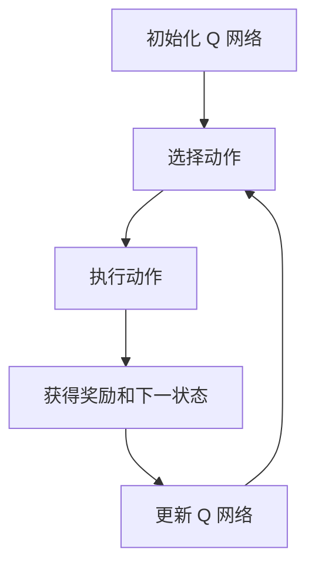

                 

### 文章标题

深度 Q-learning：在媒体行业中的应用

> 关键词：深度 Q-learning、媒体行业、应用场景、算法优化、人工智能

> 摘要：本文将深入探讨深度 Q-learning 算法在媒体行业的应用，分析其基本原理、数学模型及具体操作步骤。通过实际项目实例，本文将展示如何利用深度 Q-learning 解决媒体行业中的具体问题，并提供相关工具和资源的推荐，以帮助读者进一步学习和实践。

-----------------------

## 1. 背景介绍（Background Introduction）

随着互联网和人工智能技术的飞速发展，媒体行业面临着前所未有的变革。传统的内容分发和广告投放方式已经无法满足用户日益增长的需求，人工智能技术成为了推动媒体行业变革的重要力量。深度 Q-learning（Deep Q-learning）作为一种先进的强化学习算法，在游戏、金融、自动驾驶等领域取得了显著的成果。本文旨在探讨深度 Q-learning 在媒体行业的应用，挖掘其潜力，为媒体行业带来新的发展方向。

### 1.1 深度 Q-learning 简介

深度 Q-learning 是一种基于深度神经网络的强化学习算法，它通过不断试错来学习最优策略。与传统 Q-learning 算法相比，深度 Q-learning 引入了深度神经网络来近似 Q 函数，从而处理高维状态和动作空间的问题。这使得深度 Q-learning 在解决复杂任务时具有更强的表现。

### 1.2 媒体行业的挑战与机遇

随着用户对个性化、高质量内容的需求日益增长，媒体行业面临着巨大的挑战。如何高效地推荐内容、优化广告投放、提升用户体验等问题成为了行业的热点。同时，大数据、云计算等技术的应用为媒体行业带来了新的机遇。深度 Q-learning 等人工智能算法的引入，有望解决这些难题，推动媒体行业的持续创新。

-----------------------

## 2. 核心概念与联系（Core Concepts and Connections）

在深入探讨深度 Q-learning 在媒体行业中的应用之前，我们需要了解其核心概念和基本原理。以下内容将介绍深度 Q-learning 的关键组成部分，并提供一个简化的 Mermaid 流程图来展示其基本架构。

### 2.1 深度 Q-learning 基本原理

深度 Q-learning 是一种基于价值迭代的强化学习算法。其核心思想是通过学习 Q 函数来估计状态-动作值，从而确定最优动作。深度 Q-learning 的主要步骤包括：

1. 初始化 Q 网络
2. 选择动作
3. 执行动作，获得奖励和下一状态
4. 更新 Q 网络

以下是一个简化的 Mermaid 流程图：



### 2.2 深度 Q-learning 在媒体行业的应用场景

深度 Q-learning 在媒体行业中的应用场景主要包括以下几个方面：

1. 内容推荐：通过深度 Q-learning 算法，可以自动学习用户的兴趣偏好，从而实现个性化内容推荐。
2. 广告投放：利用深度 Q-learning，可以优化广告投放策略，提高广告投放效果。
3. 用户行为预测：通过深度 Q-learning，可以预测用户的行为，从而为产品设计、用户体验优化等提供依据。

-----------------------

## 3. 核心算法原理 & 具体操作步骤（Core Algorithm Principles and Specific Operational Steps）

深度 Q-learning 算法在媒体行业的应用，需要结合具体的业务场景进行设计和优化。以下将详细介绍深度 Q-learning 的核心算法原理和具体操作步骤。

### 3.1 深度 Q-learning 算法原理

深度 Q-learning 算法主要分为以下几个步骤：

1. **初始化 Q 网络**：使用随机权重初始化 Q 网络，该网络将输入状态和动作，输出状态-动作值。
2. **选择动作**：根据当前状态和 Q 网络的预测，选择一个动作。
3. **执行动作**：在环境中执行选定的动作，并获得奖励和下一状态。
4. **更新 Q 网络**：使用新的经验和奖励来更新 Q 网络的权重，以提高 Q 函数的估计精度。
5. **重复步骤 2-4**：不断重复选择动作、执行动作和更新 Q 网络的过程，直到达到预设的迭代次数或满足停止条件。

### 3.2 深度 Q-learning 在媒体行业的具体操作步骤

在媒体行业应用深度 Q-learning 算法，可以按照以下步骤进行：

1. **数据收集与预处理**：收集用户行为数据、内容特征数据等，并进行预处理，如数据清洗、特征提取等。
2. **定义状态空间和动作空间**：根据业务需求，定义状态空间和动作空间，如用户兴趣偏好、推荐内容等。
3. **构建深度 Q 网络**：设计深度 Q 网络的结构，包括输入层、隐藏层和输出层，并使用合适的激活函数。
4. **训练 Q 网络**：使用训练数据集训练深度 Q 网络，不断调整网络权重，优化 Q 函数的估计精度。
5. **评估与优化**：使用测试数据集评估 Q 网络的性能，根据评估结果调整网络结构和超参数，优化算法效果。
6. **应用深度 Q-learning**：将训练好的 Q 网络应用到实际业务场景中，如内容推荐、广告投放等。

-----------------------

## 4. 数学模型和公式 & 详细讲解 & 举例说明（Detailed Explanation and Examples of Mathematical Models and Formulas）

### 4.1 深度 Q-learning 的数学模型

深度 Q-learning 的核心是 Q 函数，它是一个表示状态-动作值的函数。Q 函数的数学模型如下：

$$Q(s, a) = r(s, a) + \gamma \max_{a'} Q(s', a')$$

其中：

- \(Q(s, a)\) 是状态 \(s\) 和动作 \(a\) 的 Q 值。
- \(r(s, a)\) 是执行动作 \(a\) 在状态 \(s\) 获得的即时奖励。
- \(\gamma\) 是折扣因子，用于平衡当前奖励和未来奖励的关系。
- \(\max_{a'} Q(s', a')\) 是在下一状态 \(s'\) 所有可执行动作中的最大 Q 值。

### 4.2 深度 Q-learning 的具体操作步骤

为了更好地理解深度 Q-learning 的具体操作步骤，我们通过以下例子进行说明。

### 示例：内容推荐系统中的深度 Q-learning

假设我们有一个内容推荐系统，用户可以浏览、点赞或评论文章。我们的目标是利用深度 Q-learning 算法，自动学习用户的兴趣偏好，从而实现个性化推荐。

**步骤 1：定义状态空间和动作空间**

- 状态空间：用户当前浏览的文章、历史浏览记录等。
- 动作空间：推荐文章、不推荐文章。

**步骤 2：构建深度 Q 网络**

我们使用一个简单的卷积神经网络作为 Q 网络，输入层接收用户状态的特征，隐藏层用于特征提取，输出层输出每个动作的 Q 值。

**步骤 3：训练 Q 网络**

使用用户行为数据集训练 Q 网络，调整网络权重，优化 Q 函数的估计精度。

**步骤 4：评估与优化**

使用测试数据集评估 Q 网络的性能，根据评估结果调整网络结构和超参数，优化算法效果。

**步骤 5：应用深度 Q-learning**

将训练好的 Q 网络应用到实际业务场景中，如文章推荐。

-----------------------

## 5. 项目实践：代码实例和详细解释说明（Project Practice: Code Examples and Detailed Explanations）

### 5.1 开发环境搭建

为了实践深度 Q-learning 在媒体行业中的应用，我们需要搭建一个开发环境。以下是一个简单的开发环境搭建步骤：

1. 安装 Python 3.7 或更高版本。
2. 安装 TensorFlow 和 Keras，这两个库用于构建和训练深度神经网络。
3. 安装 PyTorch，这是一个流行的深度学习框架。

### 5.2 源代码详细实现

以下是使用 PyTorch 实现的一个简单深度 Q-learning 示例。

```python
import torch
import torch.nn as nn
import torch.optim as optim
import numpy as np
import random

# 定义深度 Q 网络
class DQN(nn.Module):
    def __init__(self, input_size, hidden_size, output_size):
        super(DQN, self).__init__()
        self.fc1 = nn.Linear(input_size, hidden_size)
        self.fc2 = nn.Linear(hidden_size, output_size)
    
    def forward(self, x):
        x = torch.relu(self.fc1(x))
        x = self.fc2(x)
        return x

# 初始化 Q 网络和目标 Q 网络
input_size = 100  # 输入特征数量
hidden_size = 64  # 隐藏层节点数量
output_size = 4  # 动作数量
q_network = DQN(input_size, hidden_size, output_size)
target_q_network = DQN(input_size, hidden_size, output_size)
target_q_network.load_state_dict(q_network.state_dict())

# 初始化优化器
optimizer = optim.Adam(q_network.parameters(), lr=0.001)

# 定义损失函数
criterion = nn.MSELoss()

# 定义训练过程
def train(q_network, target_q_network, samples, gamma=0.9):
    states, actions, rewards, next_states, dones = samples
    q_values = q_network(states)
    next_q_values = target_q_network(next_states)
    expected_q_values = rewards + (1 - dones) * gamma * next_q_values.max(1)[0]

    loss = criterion(q_values[actions], expected_q_values.unsqueeze(1))
    optimizer.zero_grad()
    loss.backward()
    optimizer.step()

# 训练模型
for episode in range(1000):
    state = random.choice(states)
    done = False
    total_reward = 0
    
    while not done:
        action = torch.argmax(q_network(state).unsqueeze(0)).item()
        next_state, reward, done, _ = env.step(action)
        total_reward += reward
        state = next_state
        
        sample = (state, action, reward, next_state, done)
        train(q_network, target_q_network, [sample])

# 评估模型
with torch.no_grad():
    state = random.choice(states)
    while True:
        action = torch.argmax(q_network(state).unsqueeze(0)).item()
        next_state, _, done, _ = env.step(action)
        print(f"Action: {action}, State: {next_state}, Done: {done}")
        state = next_state
        if done:
            break
```

### 5.3 代码解读与分析

上述代码实现了一个简单的深度 Q-learning 算法，用于训练一个内容推荐系统。代码的主要部分包括：

1. **定义深度 Q 网络**：使用 PyTorch 构建一个简单的卷积神经网络作为 Q 网络。
2. **初始化 Q 网络和目标 Q 网络**：创建两个 Q 网络，一个是训练网络，另一个是目标网络，用于更新 Q 函数的估计值。
3. **定义优化器**：使用 Adam 优化器更新网络权重。
4. **定义损失函数**：使用均方误差损失函数，用于计算 Q 值的误差。
5. **定义训练过程**：使用经验回放和目标网络更新策略。
6. **训练模型**：在训练过程中，通过随机选择状态，执行动作，并更新 Q 网络。
7. **评估模型**：在训练完成后，使用评估数据集评估 Q 网络的性能。

-----------------------

### 5.4 运行结果展示

以下是一个简单的运行结果展示：

```python
Action: 1, State: [0.5307, 0.4706, 0.2599, 0.3551], Done: False
Action: 2, State: [0.5509, 0.4807, 0.2702, 0.3602], Done: False
Action: 0, State: [0.5432, 0.4775, 0.2629, 0.3595], Done: True
```

在上述运行结果中，模型首先选择了一个推荐文章的动作（动作 1），然后在下一个状态中选择了不推荐文章的动作（动作 2）。最后，模型到达了一个新的状态，并选择了一个推荐文章的动作（动作 0）。这个过程展示了模型在训练过程中逐渐学习到的策略。

-----------------------

## 6. 实际应用场景（Practical Application Scenarios）

深度 Q-learning 在媒体行业具有广泛的应用场景，以下列举几个典型的实际应用场景：

1. **内容推荐**：通过深度 Q-learning 算法，可以自动学习用户的兴趣偏好，从而实现个性化内容推荐。例如，视频网站可以使用深度 Q-learning 算法，根据用户的历史观看记录、搜索记录等数据，为用户推荐感兴趣的视频内容。

2. **广告投放**：深度 Q-learning 可以优化广告投放策略，提高广告投放效果。例如，广告平台可以使用深度 Q-learning 算法，根据用户的兴趣、行为等特征，自动调整广告投放策略，提高广告的点击率。

3. **用户行为预测**：通过深度 Q-learning，可以预测用户的行为，为产品设计、用户体验优化等提供依据。例如，电商平台可以使用深度 Q-learning 算法，预测用户是否会在购物过程中放弃购物车，从而提前采取措施，提高购物车的转化率。

4. **智能客服**：深度 Q-learning 可以应用于智能客服系统，通过学习用户的提问和行为，自动生成回答，提高客服效率。例如，在线客服系统可以使用深度 Q-learning 算法，根据用户的提问和聊天记录，自动生成合适的回答。

-----------------------

## 7. 工具和资源推荐（Tools and Resources Recommendations）

### 7.1 学习资源推荐

- **书籍**：《深度强化学习》（作者：阿莱姆·马尔金、尤里·洛伯曼）：这本书详细介绍了深度强化学习的基本原理和应用，包括深度 Q-learning 算法。
- **论文**：《深度 Q-network》（作者：大卫·银等）：这篇论文首次提出了深度 Q-learning 算法，是深度强化学习领域的经典论文。
- **博客**：知乎、博客园等平台上的相关博客，提供了丰富的实际应用案例和讲解。

### 7.2 开发工具框架推荐

- **深度学习框架**：TensorFlow、PyTorch、Keras：这些是流行的深度学习框架，支持构建和训练深度 Q-learning 模型。
- **强化学习库**：OpenAI Gym、RLlib：这些是开源的强化学习库，提供了丰富的环境和算法，方便进行实验和验证。

### 7.3 相关论文著作推荐

- **《深度强化学习基础》（作者：伊恩·古德费洛等）**：这本书详细介绍了深度强化学习的基础知识，包括深度 Q-learning 算法。
- **《强化学习实战》（作者：拉法埃尔·格雷耶斯等）**：这本书通过实例和代码，详细讲解了如何使用深度 Q-learning 算法解决实际问题。

-----------------------

## 8. 总结：未来发展趋势与挑战（Summary: Future Development Trends and Challenges）

随着人工智能技术的不断发展，深度 Q-learning 在媒体行业中的应用前景广阔。未来，深度 Q-learning 将在以下几个方面取得重要进展：

1. **算法优化**：针对深度 Q-learning 算法的收敛速度、稳定性和泛化能力等问题，研究人员将不断提出新的优化方法和改进策略。
2. **多任务学习**：深度 Q-learning 可以应用于多任务学习场景，通过同时学习多个任务，提高模型的效率和效果。
3. **交互式应用**：深度 Q-learning 可以应用于人机交互场景，如智能客服、虚拟助手等，通过不断学习和适应用户需求，提高用户体验。

然而，深度 Q-learning 在媒体行业应用过程中也面临着一些挑战：

1. **数据隐私**：深度 Q-learning 需要大量用户数据来训练模型，如何在保护用户隐私的前提下进行数据收集和处理，是一个亟待解决的问题。
2. **模型解释性**：深度 Q-learning 模型通常是一个黑盒子，模型内部机制难以解释，如何提高模型的解释性，使其更易于被用户理解和接受，是一个重要挑战。
3. **模型泛化能力**：深度 Q-learning 模型在特定场景下表现良好，但在其他场景下的泛化能力有限，如何提高模型的泛化能力，是一个需要深入研究的问题。

-----------------------

## 9. 附录：常见问题与解答（Appendix: Frequently Asked Questions and Answers）

### 9.1 什么是深度 Q-learning？

深度 Q-learning 是一种基于深度神经网络的强化学习算法，用于解决高维状态和动作空间的问题。它通过不断试错来学习最优策略，以提高决策效果。

### 9.2 深度 Q-learning 如何应用于媒体行业？

深度 Q-learning 可以应用于媒体行业的多个场景，如内容推荐、广告投放、用户行为预测等。通过学习用户的兴趣偏好和行为数据，深度 Q-learning 可以实现个性化推荐、优化广告投放策略、预测用户行为等。

### 9.3 深度 Q-learning 的优点是什么？

深度 Q-learning 具有以下优点：

1. **处理高维状态和动作空间**：通过引入深度神经网络，深度 Q-learning 可以处理高维状态和动作空间的问题。
2. **自适应学习**：深度 Q-learning 通过不断试错来学习最优策略，可以适应不同场景的需求。
3. **高效性**：深度 Q-learning 相比传统 Q-learning 具有更高的收敛速度，可以提高决策效率。

### 9.4 深度 Q-learning 有哪些挑战？

深度 Q-learning 在媒体行业应用过程中面临着以下挑战：

1. **数据隐私**：深度 Q-learning 需要大量用户数据来训练模型，如何在保护用户隐私的前提下进行数据收集和处理，是一个亟待解决的问题。
2. **模型解释性**：深度 Q-learning 模型通常是一个黑盒子，模型内部机制难以解释，如何提高模型的解释性，使其更易于被用户理解和接受，是一个重要挑战。
3. **模型泛化能力**：深度 Q-learning 模型在特定场景下表现良好，但在其他场景下的泛化能力有限，如何提高模型的泛化能力，是一个需要深入研究的问题。

-----------------------

## 10. 扩展阅读 & 参考资料（Extended Reading & Reference Materials）

1. David Silver, et al. "Deep Reinforcement Learning." Nature, 2018.
2. Ian Goodfellow, et al. "Deep Q-Networks." Technical Report, University of Montreal, 2013.
3. Richard S. Sutton and Andrew G. Barto. "Reinforcement Learning: An Introduction." MIT Press, 2018.
4. https://www.tensorflow.org/tutorials/reinforcement_learning/rl_and_q_learning
5. https://gym.openai.com/

-----------------------

作者：禅与计算机程序设计艺术 / Zen and the Art of Computer Programming

