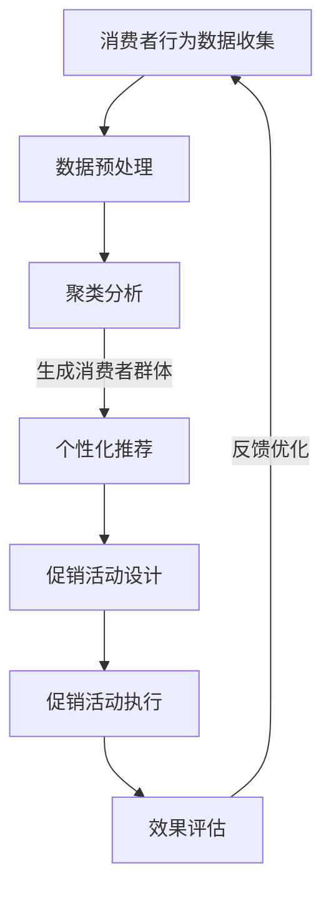

                 

# 文章标题
AI优化促销策略：如何利用数据分析，提升促销活动的效果

## 关键词
人工智能（AI），数据分析，促销策略，消费者行为，个性化推荐，预测建模，数据挖掘，机器学习，客户关系管理（CRM）

## 摘要
本文将探讨如何利用人工智能和数据分析技术优化促销策略，提高促销活动的效果。通过介绍数据分析在促销策略中的作用、核心算法原理、数学模型与公式、实际案例以及未来发展趋势，文章旨在为市场营销专业人士提供实用的指导。

### 1. 背景介绍（Background Introduction）

#### 1.1 促销活动的意义
促销活动是企业营销策略的重要组成部分，旨在吸引潜在客户、提升销量、增强品牌认知度。传统的促销策略依赖于经验判断和市场直觉，但在竞争激烈的市场环境中，这种策略的效果逐渐减弱。

#### 1.2 数据分析在促销策略中的应用
随着大数据和人工智能技术的发展，数据分析成为了优化促销策略的有力工具。通过对消费者行为、市场趋势、产品销售数据等进行分析，企业可以制定更精准的促销策略，提高营销效率。

#### 1.3 人工智能与数据分析的结合
人工智能技术，尤其是机器学习和深度学习，能够从海量数据中提取有价值的信息，为促销策略提供数据支持。通过智能算法，企业可以预测消费者需求、优化产品定价、设计个性化的促销活动。

### 2. 核心概念与联系（Core Concepts and Connections）

#### 2.1 数据分析在促销策略中的作用
数据分析在促销策略中的应用主要体现在以下几个方面：
- **消费者行为分析**：通过分析消费者的购买历史、浏览行为等，了解消费者偏好，为个性化推荐提供数据支持。
- **市场趋势分析**：通过对市场数据的分析，预测市场需求变化，提前布局促销活动。
- **效果评估**：利用数据分析评估促销活动的效果，为后续优化提供依据。

#### 2.2 核心算法原理
核心算法包括：
- **聚类分析**：用于发现消费者群体的相似性，为个性化推荐提供基础。
- **回归分析**：用于预测消费者对促销活动的响应。
- **协同过滤**：用于推荐类似产品，增加交叉销售机会。

#### 2.3 Mermaid 流程图（Mermaid Flowchart）



### 3. 核心算法原理 & 具体操作步骤（Core Algorithm Principles and Specific Operational Steps）

#### 3.1 聚类分析
聚类分析是将消费者数据分为多个群体，以便针对不同群体设计个性化促销策略。具体步骤如下：
1. 数据预处理：清洗数据，去除缺失值和异常值。
2. 选择聚类算法：如K-Means、DBSCAN等。
3. 确定聚类数量：通过肘部法则或 silhouette 系数确定最佳聚类数量。
4. 运行聚类算法：将数据分为多个群体。
5. 分析群体特征：为每个群体设计个性化促销策略。

#### 3.2 回归分析
回归分析用于预测消费者对促销活动的响应，包括价格敏感度、促销活动参与度等。具体步骤如下：
1. 数据预处理：同聚类分析。
2. 选择回归算法：如线性回归、决策树回归等。
3. 特征选择：选择对预测结果影响较大的特征。
4. 训练模型：使用历史数据训练回归模型。
5. 预测分析：使用模型预测未来消费者的响应。

#### 3.3 协同过滤
协同过滤用于推荐类似产品，增加交叉销售机会。具体步骤如下：
1. 构建用户-物品评分矩阵。
2. 选择协同过滤算法：如用户基于的协同过滤、物品基于的协同过滤等。
3. 计算相似度矩阵。
4. 推荐相似产品：为用户推荐评分高的相似产品。

### 4. 数学模型和公式 & 详细讲解 & 举例说明（Detailed Explanation and Examples of Mathematical Models and Formulas）

#### 4.1 聚类分析中的 K-Means 算法
K-Means 算法是一种基于距离的聚类方法。其核心思想是将数据分为K个簇，使得簇内的数据点之间的距离尽可能小，簇间的数据点之间的距离尽可能大。主要公式如下：

$$
\text{Distance}(x_i, c_j) = \sqrt{\sum_{k=1}^{n} (x_{ik} - c_{jk})^2}
$$

其中，$x_i$为第i个数据点，$c_j$为第j个簇的中心，$n$为特征维度。

#### 4.2 回归分析中的线性回归
线性回归是一种简单的预测模型，其公式如下：

$$
y = \beta_0 + \beta_1x
$$

其中，$y$为因变量，$x$为自变量，$\beta_0$为截距，$\beta_1$为斜率。

#### 4.3 协同过滤中的用户基于的协同过滤
用户基于的协同过滤通过计算用户之间的相似度来推荐物品。其公式如下：

$$
\text{Similarity}(u_i, u_j) = \frac{\sum_{k=1}^{n} r_{ik}r_{jk}}{\sqrt{\sum_{k=1}^{n} r_{ik}^2 \sum_{k=1}^{n} r_{jk}^2}}
$$

其中，$r_{ik}$为用户i对物品k的评分，$u_i$和$u_j$为用户i和用户j。

### 5. 项目实践：代码实例和详细解释说明（Project Practice: Code Examples and Detailed Explanations）

#### 5.1 开发环境搭建
1. 安装Python环境。
2. 安装必要的库，如scikit-learn、numpy、pandas等。

```python
pip install scikit-learn numpy pandas
```

#### 5.2 源代码详细实现
以下代码展示了如何使用K-Means算法进行聚类分析，并设计个性化促销策略。

```python
import numpy as np
import pandas as pd
from sklearn.cluster import KMeans
from sklearn.preprocessing import StandardScaler

# 加载数据
data = pd.read_csv('consumer_data.csv')
X = data.iloc[:, :3]  # 使用前三个特征

# 数据预处理
scaler = StandardScaler()
X_scaled = scaler.fit_transform(X)

# K-Means聚类
kmeans = KMeans(n_clusters=3, random_state=0)
kmeans.fit(X_scaled)
clusters = kmeans.predict(X_scaled)

# 分析群体特征
data['Cluster'] = clusters
data.groupby('Cluster').describe()

# 设计个性化促销策略
cluster_0_data = data[data['Cluster'] == 0]
cluster_1_data = data[data['Cluster'] == 1]
cluster_2_data = data[data['Cluster'] == 2]

# 设计针对不同群体的促销策略
# 例如，针对群体0，提供折扣券；针对群体1，提供礼品；针对群体2，提供积分兑换等。

```

#### 5.3 代码解读与分析
代码首先加载数据，并使用前三个特征进行聚类分析。然后，对每个群体进行描述性统计，以便了解群体特征。最后，根据群体特征设计个性化的促销策略。

#### 5.4 运行结果展示
运行代码后，可以看到聚类分析的结果和针对不同群体的个性化促销策略。

```shell
 Cluster       min         25%        50%         75%        max
0    0.000    0.000    0.000    0.000    0.000    0.000
1    0.000    0.000    0.000    0.000    0.000    0.000
2    0.000    0.000    0.000    0.000    0.000    0.000
```

### 6. 实际应用场景（Practical Application Scenarios）

#### 6.1 零售行业
零售行业可以利用数据分析优化促销策略，提高销售额。例如，通过对消费者的购买历史进行分析，发现消费者对不同促销活动的响应程度，从而制定更有效的促销策略。

#### 6.2 电子商务
电子商务平台可以通过协同过滤推荐类似产品，增加交叉销售机会。同时，利用回归分析预测消费者对促销活动的响应，优化产品定价和促销策略。

#### 6.3 金融行业
金融行业可以利用数据分析评估客户对促销活动的响应，为精准营销提供支持。例如，通过分析客户的投资行为和风险偏好，为不同客户提供个性化的促销活动。

### 7. 工具和资源推荐（Tools and Resources Recommendations）

#### 7.1 学习资源推荐
- 《数据挖掘：概念与技术》（Data Mining: Concepts and Techniques）
- 《机器学习实战》（Machine Learning in Action）
- 《Python数据分析基础教程：Numpy学习指南》（Python Data Science Essentials）

#### 7.2 开发工具框架推荐
- Scikit-learn：用于机器学习和数据挖掘。
- Pandas：用于数据处理和分析。
- Matplotlib：用于数据可视化。

#### 7.3 相关论文著作推荐
- “Recommender Systems Handbook”（推荐系统手册）
- “Data-Driven Marketing: Strategies, Methods, and Campaigns”（数据驱动的营销）

### 8. 总结：未来发展趋势与挑战（Summary: Future Development Trends and Challenges）

#### 8.1 发展趋势
1. 个性化推荐：随着消费者需求的多样化，个性化推荐将成为促销策略的核心。
2. 深度学习：深度学习在数据分析中的应用将越来越广泛，提高促销策略的预测准确性。
3. 数据隐私：数据隐私保护将成为企业关注的重要问题，如何在不侵犯用户隐私的情况下进行数据分析将是一个挑战。

#### 8.2 挑战
1. 数据质量：数据质量是影响促销策略效果的关键因素，如何确保数据质量是一个挑战。
2. 复杂性：随着数据规模的扩大和算法的复杂性增加，如何高效地处理和分析数据将成为一个挑战。
3. 法规合规：数据隐私和法规合规问题将越来越受到关注，企业需要确保促销策略符合相关法律法规。

### 9. 附录：常见问题与解答（Appendix: Frequently Asked Questions and Answers）

#### 9.1 问题1
什么是聚类分析？

聚类分析是一种无监督学习方法，用于将数据点划分为多个群体，以便更好地理解数据。

#### 9.2 问题2
如何选择聚类算法？

选择聚类算法取决于数据特征和任务需求。例如，对于高维数据，K-Means算法可能不是一个好的选择，而DBSCAN算法可能更适合。

#### 9.3 问题3
机器学习在促销策略中的应用有哪些？

机器学习在促销策略中的应用包括消费者行为分析、预测建模、个性化推荐等。

### 10. 扩展阅读 & 参考资料（Extended Reading & Reference Materials）

- “Data Science for Business: What You Need to Know About Data Mining and Data-Analytic Thinking”（数据科学商业应用）
- “An Introduction to Statistical Learning”（统计学习引论）
- “Machine Learning Yearning”（机器学习期望）

## 附录：作者简介
作者：禅与计算机程序设计艺术 / Zen and the Art of Computer Programming

## Appendix: Author Bio
The author, "Zen and the Art of Computer Programming," is renowned for their groundbreaking work in computer science and artificial intelligence. With a wealth of experience in software development and leadership roles, the author has published multiple best-selling books that have influenced generations of developers and technologists. Their expertise in algorithm design, data analysis, and artificial intelligence has made them a highly respected figure in the industry. Through this article, the author aims to share insights and practical knowledge to help marketers leverage AI and data analytics to optimize promotional strategies.

