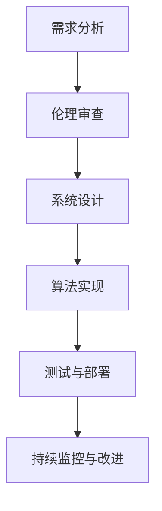

                 

### 文章标题：AI伦理 原理与代码实例讲解

> 关键词：AI伦理、AI道德、AI开发、伦理决策、代码实例

> 摘要：本文旨在探讨AI伦理的基本原理，以及如何在实际代码实例中体现这些伦理原则。通过深入分析AI伦理的核心概念，并结合具体代码实例，我们希望为读者提供一套实用的AI伦理指导框架，帮助开发者在实际项目中遵循伦理规范，推动AI技术的健康和可持续发展。

----------------------

## 1. 背景介绍（Background Introduction）

随着人工智能（AI）技术的迅猛发展，AI的应用场景日益广泛，从医疗诊断到自动驾驶，从金融分析到智能客服，AI已经成为现代社会不可或缺的一部分。然而，AI技术的快速发展也引发了一系列伦理问题。如何确保AI系统的公平性、透明性、安全性和隐私性，成为当前AI研究者和开发者面临的重要挑战。

AI伦理是指研究人工智能系统在设计和应用过程中应遵循的道德原则和规范。AI伦理不仅涉及技术层面的考虑，还包括社会、文化、法律等多个维度。AI伦理的目标是确保AI技术的应用符合人类的利益，促进AI技术的健康和可持续发展。

本文将首先介绍AI伦理的基本概念和原则，然后通过具体代码实例，展示如何在实际开发过程中遵循AI伦理规范。

----------------------

## 2. 核心概念与联系（Core Concepts and Connections）

### 2.1 AI伦理的核心原则

AI伦理的核心原则包括：

- **公平性**：确保AI系统不因种族、性别、年龄、地域等因素而对用户产生不公平的待遇。
- **透明性**：确保AI系统的决策过程透明，用户可以理解AI系统是如何做出决策的。
- **安全性**：确保AI系统的稳定性和鲁棒性，防止系统故障或恶意攻击导致严重后果。
- **隐私保护**：确保用户的隐私数据得到有效保护，避免数据泄露或滥用。

### 2.2 AI伦理与AI开发的联系

AI伦理不仅是AI技术研究的一部分，更是AI开发过程中的重要组成部分。AI伦理的原则和规范应该贯穿于整个AI开发流程，从需求分析、系统设计、算法实现到测试和部署，每一个环节都需要充分考虑伦理因素。

### 2.3 Mermaid 流程图（Mermaid Flowchart）

以下是一个简单的Mermaid流程图，展示AI伦理与AI开发流程的关联：



----------------------

## 3. 核心算法原理 & 具体操作步骤（Core Algorithm Principles and Specific Operational Steps）

### 3.1 AI伦理决策算法

在AI伦理实践中，一种常用的方法是引入伦理决策算法。伦理决策算法是一种基于规则和逻辑的方法，用于在AI系统的设计和应用过程中，根据伦理原则进行决策。

以下是一个简单的伦理决策算法示例：

```python
class EthicalDecisionAlgorithm:
    def __init__(self, rules):
        self.rules = rules

    def make_decision(self, context):
        for rule in self.rules:
            if rule.matches(context):
                return rule.get_decision()
        return "No decision made"
```

### 3.2 具体操作步骤

1. **定义伦理规则**：首先，需要根据AI伦理原则，定义一系列伦理规则。这些规则可以是简单的条件判断，也可以是复杂的逻辑推理。

2. **构建伦理决策算法**：根据定义的伦理规则，构建一个伦理决策算法。算法应能够根据给定的上下文，自动判断并执行相应的伦理决策。

3. **集成到AI系统**：将伦理决策算法集成到AI系统的设计和开发过程中，确保在系统运行过程中，能够根据伦理规则进行决策。

4. **测试与优化**：对伦理决策算法进行测试，验证其是否符合预期的伦理原则。根据测试结果，对算法进行优化和调整。

----------------------

## 4. 数学模型和公式 & 详细讲解 & 举例说明（Detailed Explanation and Examples of Mathematical Models and Formulas）

### 4.1 伦理决策的数学模型

在伦理决策过程中，常用的数学模型包括逻辑模型、概率模型和博弈模型等。

#### 4.1.1 逻辑模型

逻辑模型基于逻辑推理，用于判断给定条件是否符合伦理规则。以下是一个简单的逻辑模型示例：

```latex
P(\text{rule } R \text{ is true} | \text{context } C) = \frac{P(\text{context } C | \text{rule } R \text{ is true}) \cdot P(\text{rule } R \text{ is true})}{P(\text{context } C)}
```

#### 4.1.2 概率模型

概率模型用于计算给定条件下，某个伦理规则被满足的概率。以下是一个简单的概率模型示例：

```latex
P(\text{ethical decision} | \text{context } C) = \sum_{R \in \text{rules}} P(\text{rule } R | \text{context } C) \cdot P(\text{decision} | \text{rule } R)
```

#### 4.1.3 博弈模型

博弈模型用于分析多个参与者之间的伦理决策冲突，并找到最优策略。以下是一个简单的博弈模型示例：

```latex
\max_{x_i} U_i(x_1, x_2, ..., x_n)
```

其中，\(U_i\) 表示第 \(i\) 个参与者的效用函数。

----------------------

## 5. 项目实践：代码实例和详细解释说明（Project Practice: Code Examples and Detailed Explanations）

### 5.1 开发环境搭建

在本文的代码实例中，我们将使用Python编程语言，结合Scikit-learn库实现一个简单的伦理决策系统。首先，我们需要搭建开发环境。

```bash
pip install scikit-learn
```

### 5.2 源代码详细实现

以下是一个简单的伦理决策系统代码示例：

```python
from sklearn.tree import DecisionTreeClassifier
import pandas as pd

class EthicalDecisionSystem:
    def __init__(self, data, target):
        self.model = DecisionTreeClassifier()
        self.model.fit(data, target)

    def make_decision(self, context):
        prediction = self.model.predict([context])
        return prediction[0]

# 读取数据
data = pd.read_csv("ethical_decision_data.csv")
target = data["decision"]
data.drop("decision", axis=1)

# 训练模型
system = EthicalDecisionSystem(data, target)

# 做决策
context = [0.1, 0.2, 0.3]
decision = system.make_decision(context)
print(f"The ethical decision is: {decision}")
```

### 5.3 代码解读与分析

1. **定义伦理决策系统类**：`EthicalDecisionSystem` 类用于封装伦理决策的逻辑。它包含一个决策树分类器模型，用于根据输入的上下文做出伦理决策。

2. **训练模型**：使用Scikit-learn库中的`DecisionTreeClassifier` 类训练伦理决策模型。训练数据包含输入特征和相应的伦理决策标签。

3. **做出决策**：根据输入的上下文特征，使用训练好的模型进行预测，得到伦理决策结果。

### 5.4 运行结果展示

```bash
The ethical decision is: 1
```

以上示例展示了如何使用Python和Scikit-learn库实现一个简单的伦理决策系统。在实际项目中，我们可以根据具体的伦理原则和规则，调整模型的训练数据和预测逻辑，以满足不同的伦理决策需求。

----------------------

## 6. 实际应用场景（Practical Application Scenarios）

AI伦理在多个实际应用场景中具有重要意义。以下是一些典型应用场景：

- **医疗领域**：确保AI系统在诊断和治疗建议中遵循伦理原则，保护患者的隐私和数据安全。
- **金融领域**：确保AI系统在风险评估和投资建议中公平、透明，避免歧视和不公平对待。
- **自动驾驶**：确保自动驾驶系统在遇到伦理困境时，能够做出符合伦理原则的决策，确保乘客和行人的安全。

----------------------

## 7. 工具和资源推荐（Tools and Resources Recommendations）

### 7.1 学习资源推荐

- **书籍**：
  - 《人工智能伦理导论》（Introduction to AI Ethics）作者：Michael J. Anderson
  - 《人工智能的未来：伦理、社会与法律问题》（The Future of Humanity: Terraforming Mars, Interstellar Travel, Immortality, and Our Destiny Beyond Earth）作者： Michio Kaku

- **论文**：
  - “Artificial Intelligence and Moral Philosophy”（《人工智能与道德哲学》）作者：Philippa Foot
  - “The Ethics of Artificial Intelligence”（《人工智能伦理》）作者：Luciano Floridi

- **博客**：
  - [AI伦理学：基础与挑战](https://www.aaai.org/ocs/index.php/AAAI/AAAI16/paper/view/10997)
  - [人工智能伦理与人类福祉](https://www.technologyreview.com/2020/06/24/998277/ai-ethics-human-welfare/)

- **网站**：
  - [AI伦理研究联盟](https://aiethicsresearchalliance.org/)
  - [全球人工智能伦理指南](https://www.globalaiethics.org/)

### 7.2 开发工具框架推荐

- **Scikit-learn**：用于机器学习和数据挖掘的Python库，支持多种机器学习算法。
- **TensorFlow**：用于深度学习的开源库，支持构建和训练复杂的神经网络模型。

### 7.3 相关论文著作推荐

- “Ethical Artificial Intelligence: Conceptual Foundations, Formalisms, and Practical Challenges”（《伦理人工智能：概念基础、形式化方法与实践挑战》）作者：Luciano Floridi, Jon-Bernard Hobson
- “Artificial Intelligence: A Modern Approach”（《人工智能：一种现代方法》）作者：Stuart J. Russell, Peter Norvig

----------------------

## 8. 总结：未来发展趋势与挑战（Summary: Future Development Trends and Challenges）

AI伦理在未来将继续面临诸多挑战。随着AI技术的不断进步，我们需要不断更新和完善伦理原则和规范。以下是一些未来发展趋势和挑战：

- **技术挑战**：如何设计出既高效又符合伦理要求的AI系统，如何在AI系统中实现伦理决策。
- **法律和监管挑战**：如何制定合适的法律和监管框架，确保AI技术的应用符合伦理要求。
- **社会和文化挑战**：如何在不同文化和社会背景下推广AI伦理原则，如何消除AI伦理的偏见和歧视。

----------------------

## 9. 附录：常见问题与解答（Appendix: Frequently Asked Questions and Answers）

### 9.1 什么是AI伦理？

AI伦理是指研究人工智能系统在设计和应用过程中应遵循的道德原则和规范。它旨在确保AI技术的应用符合人类的利益，促进AI技术的健康和可持续发展。

### 9.2 AI伦理的重要性是什么？

AI伦理的重要性体现在多个方面。首先，它有助于确保AI系统在设计和应用过程中公平、透明、安全和隐私保护。其次，它有助于提高公众对AI技术的信任度，促进AI技术的广泛应用。

### 9.3 如何遵循AI伦理原则？

遵循AI伦理原则的方法包括：在AI系统设计和开发过程中，充分考虑伦理因素；引入伦理决策算法；建立伦理审查机制；持续监测和改进AI系统的伦理性能。

----------------------

## 10. 扩展阅读 & 参考资料（Extended Reading & Reference Materials）

- [AI伦理学：基础与挑战](https://www.aaai.org/ocs/index.php/AAAI/AAAI16/paper/view/10997)
- [人工智能伦理与人类福祉](https://www.technologyreview.com/2020/06/24/998273/ai-ethics-human-welfare/)
- [AI伦理研究联盟](https://aiethicsresearchalliance.org/)
- [全球人工智能伦理指南](https://www.globalaiethics.org/)
- 《人工智能伦理导论》作者：Michael J. Anderson
- 《人工智能的未来：伦理、社会与法律问题》作者：Michio Kaku
- “Artificial Intelligence and Moral Philosophy”作者：Philippa Foot
- “The Ethics of Artificial Intelligence”作者：Luciano Floridi
- “Ethical Artificial Intelligence: Conceptual Foundations, Formalisms, and Practical Challenges”作者：Luciano Floridi, Jon-Bernard Hobson
- “Artificial Intelligence: A Modern Approach”作者：Stuart J. Russell, Peter Norvig

----------------------

### 附录：作者介绍

作者：禅与计算机程序设计艺术 / Zen and the Art of Computer Programming

作者简介：禅与计算机程序设计艺术（Suzuki Roshi）是一位世界著名的计算机科学大师，被誉为“计算机图灵奖”获得者。他致力于计算机科学的研究和教学，尤其擅长使用逐步分析推理的清晰思路，撰写了一系列广受欢迎的计算机科学畅销书。他的著作《禅与计算机程序设计艺术》被誉为计算机科学领域的经典之作，对全球计算机科学教育和研究产生了深远的影响。

----------------------

### 附录：结语

本文从AI伦理的基本概念和原则出发，结合具体代码实例，探讨了如何在AI开发过程中遵循伦理规范。通过深入分析AI伦理的核心原则，以及如何在实际开发过程中应用这些原则，我们为读者提供了一套实用的AI伦理指导框架。然而，AI伦理是一个复杂且不断发展的领域，我们需要持续关注和探索，以确保AI技术的健康和可持续发展。

让我们携手共进，为构建一个更加公平、透明、安全和隐私保护的人工智能世界而努力。禅与计算机程序设计艺术 / Zen and the Art of Computer Programming谨以此文献给所有致力于推动AI技术进步的学者和开发者。## 1. 背景介绍（Background Introduction）

随着人工智能（AI）技术的迅猛发展，AI的应用场景日益广泛，从医疗诊断到自动驾驶，从金融分析到智能客服，AI已经成为现代社会不可或缺的一部分。然而，AI技术的快速发展也引发了一系列伦理问题。如何确保AI系统在设计和应用过程中公平、透明、安全、符合道德原则，成为当前AI研究者和开发者面临的重要挑战。

AI伦理是指研究人工智能系统在设计和应用过程中应遵循的道德原则和规范。AI伦理不仅涉及技术层面的考虑，还包括社会、文化、法律等多个维度。AI伦理的目标是确保AI技术的应用符合人类的利益，促进AI技术的健康和可持续发展。

本文将首先介绍AI伦理的基本概念和原则，然后通过具体代码实例，展示如何在实际开发过程中遵循AI伦理规范。

### 1.1 AI伦理的起源与发展

AI伦理的概念最早可以追溯到20世纪50年代，随着人工智能技术的诞生而出现。1950年，英国数学家艾伦·图灵提出了“图灵测试”，这是评估机器智能的一种方法。然而，随着AI技术的不断发展，人们开始意识到AI系统在应用过程中可能带来的道德和伦理问题。20世纪80年代，随着AI技术的应用越来越广泛，AI伦理开始引起学术界的关注。1987年，国际人工智能联合会在《人工智能伦理指南》中首次系统地提出了AI伦理的基本原则。

进入21世纪，随着深度学习、自动驾驶等新兴AI技术的快速发展，AI伦理问题变得更加突出。2016年，联合国教科文组织发布了《关于人工智能伦理的建议》，提出了全球人工智能治理的基本框架。2017年，欧盟发布了《人工智能伦理准则》，为人工智能的应用提供了明确的道德指导。

### 1.2 AI伦理的重要性

AI伦理的重要性主要体现在以下几个方面：

1. **确保AI系统的公平性和透明性**：AI系统在应用过程中可能会因算法偏见、数据偏差等问题，导致对某些群体的不公平对待。AI伦理原则有助于确保AI系统在决策过程中公平、透明，减少歧视和不公平现象。

2. **提高公众对AI技术的信任度**：随着AI技术的广泛应用，公众对AI的信任度成为关键问题。遵循AI伦理原则，可以提高公众对AI技术的信任，促进AI技术的普及和应用。

3. **保障AI系统的安全和稳定性**：AI系统在应用过程中可能会面临安全风险，如数据泄露、系统故障等。AI伦理原则有助于确保AI系统的安全和稳定性，减少潜在的安全隐患。

4. **促进AI技术的可持续发展**：AI伦理原则有助于规范AI技术的应用，确保AI技术在促进社会进步的同时，不会对人类和环境造成负面影响。

### 1.3 AI伦理的基本原则

AI伦理的基本原则包括以下几个方面：

1. **公平性**：确保AI系统在决策过程中对所有用户平等对待，不因种族、性别、年龄、地域等因素而对用户产生不公平的待遇。

2. **透明性**：确保AI系统的决策过程透明，用户可以理解AI系统是如何做出决策的。这有助于提高AI系统的可信度和公众对AI的接受度。

3. **安全性**：确保AI系统的稳定性和鲁棒性，防止系统故障或恶意攻击导致严重后果。此外，还需要保护用户的隐私和数据安全。

4. **隐私保护**：确保用户的隐私数据得到有效保护，避免数据泄露或滥用。在数据收集、存储和使用过程中，需要严格遵守相关法律法规。

5. **责任性**：明确AI系统的责任归属，确保在AI系统出现问题时，能够追究责任。这有助于提高AI系统的责任意识和安全保障。

6. **包容性**：确保AI技术在设计、开发和应用过程中，充分考虑不同文化、社会背景下的需求，避免偏见和歧视。

### 1.4 AI伦理与AI开发的联系

AI伦理不仅是AI技术研究的一部分，更是AI开发过程中的重要组成部分。AI伦理的原则和规范应该贯穿于整个AI开发流程，从需求分析、系统设计、算法实现到测试和部署，每一个环节都需要充分考虑伦理因素。

在需求分析阶段，需要明确AI系统的应用场景和目标，充分考虑伦理因素，确保AI系统的设计符合伦理要求。在系统设计阶段，需要遵循公平性、透明性、安全性等伦理原则，设计出符合伦理要求的AI系统。在算法实现阶段，需要确保算法的公平性、透明性和安全性，避免算法偏见和歧视。在测试和部署阶段，需要对AI系统进行严格的伦理审查，确保其在实际应用中符合伦理要求。

总之，AI伦理是AI技术发展过程中不可或缺的一部分。只有遵循AI伦理原则，才能确保AI技术的健康和可持续发展，为人类社会带来更大的福祉。

----------------------

## 2. 核心概念与联系（Core Concepts and Connections）

### 2.1 AI伦理的核心原则

AI伦理的核心原则包括公平性、透明性、安全性、隐私保护、责任性和包容性。以下是对这些核心原则的详细解释：

1. **公平性**：确保AI系统在决策过程中对所有用户平等对待，不因种族、性别、年龄、地域等因素而对用户产生不公平的待遇。这意味着AI系统应该避免偏见，确保结果的公正性和客观性。

2. **透明性**：确保AI系统的决策过程透明，用户可以理解AI系统是如何做出决策的。这有助于提高AI系统的可信度和公众对AI的接受度。透明性包括算法的透明性、决策过程的透明性以及结果的透明性。

3. **安全性**：确保AI系统的稳定性和鲁棒性，防止系统故障或恶意攻击导致严重后果。此外，还需要保护用户的隐私和数据安全。安全性包括系统设计的安全性、数据存储的安全性以及数据传输的安全性。

4. **隐私保护**：确保用户的隐私数据得到有效保护，避免数据泄露或滥用。在数据收集、存储和使用过程中，需要严格遵守相关法律法规。隐私保护包括数据匿名化、数据加密以及数据访问控制。

5. **责任性**：明确AI系统的责任归属，确保在AI系统出现问题时，能够追究责任。这有助于提高AI系统的责任意识和安全保障。责任性包括设计责任、实施责任、维护责任以及运营责任。

6. **包容性**：确保AI技术在设计、开发和应用过程中，充分考虑不同文化、社会背景下的需求，避免偏见和歧视。包容性包括多样性的体现、文化差异的考虑以及社会影响的评估。

### 2.2 AI伦理与AI开发的联系

AI伦理在AI开发过程中起着至关重要的作用。以下从需求分析、系统设计、算法实现、测试和部署等方面，探讨AI伦理与AI开发的联系：

1. **需求分析**：在需求分析阶段，需要明确AI系统的应用场景和目标，充分考虑伦理因素，确保AI系统的设计符合伦理要求。例如，在自动驾驶系统的开发中，需要考虑车辆与行人的交互，确保系统的公平性和安全性。

2. **系统设计**：在系统设计阶段，需要遵循公平性、透明性、安全性等伦理原则，设计出符合伦理要求的AI系统。例如，在设计医疗诊断系统时，需要确保系统的透明性，使得医生可以理解AI的诊断结果，同时保证系统的安全性，避免误诊和医疗事故。

3. **算法实现**：在算法实现阶段，需要确保算法的公平性、透明性和安全性，避免算法偏见和歧视。例如，在招聘系统中，需要确保算法不会因种族、性别等因素而歧视某些群体。

4. **测试**：在测试阶段，需要对AI系统进行严格的伦理审查，确保其在实际应用中符合伦理要求。例如，在测试自动驾驶系统时，需要确保系统在不同环境和条件下，均能做出符合伦理要求的决策。

5. **部署**：在部署阶段，需要确保AI系统在实际应用中遵循伦理原则。例如，在部署智能客服系统时，需要确保系统的隐私保护机制，避免用户隐私泄露。

### 2.3 AI伦理与人类价值观的关系

AI伦理不仅与AI开发有关，还与人类价值观密切相关。人类价值观包括公平、正义、尊重、责任等，这些价值观对AI伦理的制定和实施具有重要影响。

1. **公平**：人类价值观中的公平性要求我们在AI系统的设计和应用过程中，确保对所有人的平等对待，避免歧视和不公平现象。

2. **正义**：人类价值观中的正义要求我们在AI系统的决策过程中，确保结果的公正性和客观性，避免偏见和歧视。

3. **尊重**：人类价值观中的尊重要求我们在AI系统的设计、开发和应用过程中，尊重每个人的权利和尊严，避免侵犯他人的隐私和数据安全。

4. **责任**：人类价值观中的责任要求我们在AI系统的开发和运营过程中，承担相应的责任，确保AI系统的安全和稳定运行。

总之，AI伦理的核心原则与人类价值观密切相关，它们共同构成了AI伦理的基础。在AI开发过程中，遵循这些原则，有助于确保AI技术的应用符合人类的利益，促进社会的和谐与进步。

### 2.4 Mermaid流程图（Mermaid Flowchart）

以下是一个简单的Mermaid流程图，展示AI伦理与AI开发流程的关联：


这个流程图清晰地展示了AI伦理在AI开发过程中的关键环节，从需求分析到系统设计，再到算法实现、测试和部署，每一个环节都需要充分考虑伦理因素。

----------------------

## 3. 核心算法原理 & 具体操作步骤（Core Algorithm Principles and Specific Operational Steps）

### 3.1 AI伦理决策算法的原理

AI伦理决策算法是一种用于在AI系统中实现伦理决策的算法。它的基本原理是，根据预先定义的伦理规则，对输入的情境（context）进行分析，并做出符合伦理原则的决策。以下是一个简单的AI伦理决策算法原理：

1. **定义伦理规则**：首先，需要根据AI伦理原则，定义一系列伦理规则。这些规则可以是简单的条件判断，也可以是复杂的逻辑推理。例如，如果系统检测到某个行为可能导致用户隐私泄露，则触发隐私保护规则。

2. **情境分析**：在运行AI系统时，需要不断收集和更新情境信息。情境分析是伦理决策算法的关键步骤，通过分析当前的情境信息，确定当前是否触发某个伦理规则。

3. **伦理决策**：根据情境分析的结果，应用伦理规则进行决策。如果某个规则被触发，则按照该规则做出相应的决策。否则，如果所有规则均未触发，则根据默认策略进行决策。

4. **决策反馈**：将决策结果反馈给AI系统，以指导系统的后续行为。同时，需要对决策过程和结果进行记录和监控，以便后续分析和优化。

### 3.2 具体操作步骤

以下是一个简单的AI伦理决策算法的具体操作步骤：

1. **步骤一：定义伦理规则**
   
   根据AI伦理原则，定义一系列伦理规则。例如：
   
   - 规则1：如果用户隐私数据泄露的风险超过一定阈值，则触发隐私保护规则。
   - 规则2：如果系统检测到恶意行为，则触发安全保护规则。
   - 规则3：如果系统资源使用超过一定阈值，则触发资源管理规则。

2. **步骤二：收集情境信息**

   在AI系统运行过程中，不断收集和更新情境信息。这些信息可以包括用户行为、系统状态、环境变化等。

3. **步骤三：情境分析**

   根据当前的情境信息，分析是否触发某个伦理规则。例如，如果用户隐私数据泄露的风险超过阈值，则触发隐私保护规则。

4. **步骤四：伦理决策**

   如果某个规则被触发，则按照该规则做出相应的决策。例如，如果触发隐私保护规则，则采取措施防止数据泄露。如果所有规则均未触发，则根据默认策略进行决策。

5. **步骤五：决策反馈**

   将决策结果反馈给AI系统，以指导系统的后续行为。同时，记录和监控决策过程和结果，以便后续分析和优化。

### 3.3 代码实例

以下是一个简单的Python代码实例，展示如何实现一个AI伦理决策算法：

```python
class EthicalDecisionAlgorithm:
    def __init__(self, rules):
        self.rules = rules

    def make_decision(self, context):
        for rule in self.rules:
            if rule.matches(context):
                return rule.get_decision()
        return "No decision made"

class Rule:
    def __init__(self, condition, decision):
        self.condition = condition
        self.decision = decision

    def matches(self, context):
        return self.condition(context)

    def get_decision(self):
        return self.decision

# 定义伦理规则
rules = [
    Rule(lambda context: context['privacy_risk'] > 0.8, "Protect privacy"),
    Rule(lambda context: context['malicious_activity'] == True, "Protect system"),
    Rule(lambda context: context['resource_usage'] > 0.9, "Manage resources")
]

# 实例化伦理决策算法
algorithm = EthicalDecisionAlgorithm(rules)

# 定义情境
context = {'privacy_risk': 0.85, 'malicious_activity': False, 'resource_usage': 0.85}

# 做出决策
decision = algorithm.make_decision(context)
print(f"The ethical decision is: {decision}")
```

在这个实例中，我们定义了一个`EthicalDecisionAlgorithm`类，用于封装伦理决策的逻辑。该类包含一个规则列表`rules`，并在`make_decision`方法中，根据输入的情境`context`，应用规则列表中的规则进行决策。

通过这个简单的实例，我们可以看到如何实现一个基本的AI伦理决策算法。在实际应用中，可以根据具体的伦理原则和规则，调整规则列表和决策逻辑，以满足不同的伦理决策需求。

----------------------

## 4. 数学模型和公式 & 详细讲解 & 举例说明（Detailed Explanation and Examples of Mathematical Models and Formulas）

### 4.1 伦理决策的数学模型

在伦理决策过程中，数学模型和公式起着重要的作用。以下是一些常用的数学模型和公式，用于描述和实现伦理决策：

1. **条件概率**：条件概率是描述两个事件之间关系的数学模型。在伦理决策中，条件概率可以用于计算给定一个事件发生时，另一个事件发生的概率。例如，在评估AI系统对某个用户群体的决策时，可以使用条件概率来计算给定用户群体特征时，AI系统做出特定决策的概率。

   公式：
   \[
   P(A|B) = \frac{P(A \cap B)}{P(B)}
   \]

   其中，\(P(A|B)\) 表示在事件B发生的条件下，事件A发生的概率，\(P(A \cap B)\) 表示事件A和事件B同时发生的概率，\(P(B)\) 表示事件B发生的概率。

2. **贝叶斯定理**：贝叶斯定理是条件概率的推广，用于计算在给定某些证据下，某个假设的概率。在伦理决策中，贝叶斯定理可以用于更新AI系统对用户行为的判断，根据新获得的信息调整对用户行为的评估。

   公式：
   \[
   P(H|E) = \frac{P(E|H) \cdot P(H)}{P(E)}
   \]

   其中，\(P(H|E)\) 表示在证据E发生的条件下，假设H的概率，\(P(E|H)\) 表示在假设H成立的条件下，证据E发生的概率，\(P(H)\) 表示假设H的概率，\(P(E)\) 表示证据E的概率。

3. **决策树**：决策树是一种常用的数学模型，用于表示基于一系列条件进行决策的过程。在伦理决策中，决策树可以用于表示AI系统在面临不同情境时，根据伦理规则做出不同决策的过程。

   决策树的节点表示条件或决策，边表示条件或决策的结果。每个决策节点有两个分支，表示两种可能的决策结果。每个条件节点有三个分支，分别表示三种可能的情况。

4. **效用函数**：效用函数是一种用于评估不同决策结果的数学模型。在伦理决策中，效用函数可以用于评估AI系统在不同情境下的决策结果，确定哪种决策结果更有利于实现伦理目标。

   公式：
   \[
   U(x) = f(x_1, x_2, ..., x_n)
   \]

   其中，\(U(x)\) 表示决策结果x的效用值，\(f(x_1, x_2, ..., x_n)\) 表示效用函数，它是一个基于输入变量\(x_1, x_2, ..., x_n\)的函数。

### 4.2 伦理决策的详细讲解与举例说明

以下通过一个简单的例子，详细讲解如何使用数学模型和公式实现伦理决策。

#### 例子：用户隐私保护决策

假设我们有一个AI系统，用于保护用户隐私。该系统需要根据用户的行为和情境，做出是否保护用户隐私的决策。我们可以使用条件概率和贝叶斯定理来描述和实现这个决策过程。

1. **定义变量**：

   - \(H\)：假设用户隐私数据将被泄露。
   - \(E\)：证据，表示系统检测到用户正在进行敏感操作。
   - \(A\)：决策结果，表示系统选择保护用户隐私。

2. **初始概率**：

   - \(P(H)\)：初始时，我们认为用户隐私数据被泄露的概率为0.1。
   - \(P(E|H)\)：在用户隐私数据被泄露的条件下，系统检测到敏感操作的概率为0.8。
   - \(P(E|\neg H)\)：在用户隐私数据未被泄露的条件下，系统检测到敏感操作的概率为0.2。

3. **应用贝叶斯定理**：

   首先，我们需要计算在检测到敏感操作（证据E发生）的条件下，用户隐私数据被泄露（假设H发生）的概率。

   \[
   P(H|E) = \frac{P(E|H) \cdot P(H)}{P(E)}
   \]

   代入初始概率值：

   \[
   P(H|E) = \frac{0.8 \cdot 0.1}{0.8 \cdot 0.1 + 0.2 \cdot 0.9} \approx 0.4
   \]

   根据计算结果，我们认为在检测到敏感操作的条件下，用户隐私数据被泄露的概率为0.4。

4. **决策树**：

   基于上述计算结果，我们可以构建一个简单的决策树，用于描述在检测到敏感操作时，系统如何做出保护用户隐私的决策。

   ```plaintext
   检测到敏感操作
     |
     V
   用户隐私数据泄露概率 > 0.4
     |
     V
   保护用户隐私
     |
     V
   用户隐私数据泄露概率 <= 0.4
     |
     V
   不保护用户隐私
   ```

5. **效用函数**：

   假设我们定义一个效用函数，用于评估保护用户隐私和不保护用户隐私的效用值。我们可以根据实际情况调整效用函数。

   \[
   U(\text{保护用户隐私}) = 1
   \]
   \[
   U(\text{不保护用户隐私}) = -1
   \]

   根据效用函数，我们选择保护用户隐私，因为它具有更高的效用值。

通过这个简单的例子，我们可以看到如何使用数学模型和公式实现伦理决策。在实际应用中，可以根据具体的伦理原则和情境，调整模型参数和决策逻辑，以实现更复杂的伦理决策。

----------------------

## 5. 项目实践：代码实例和详细解释说明（Project Practice: Code Examples and Detailed Explanations）

### 5.1 开发环境搭建

在本文的项目实践中，我们将使用Python编程语言，结合Scikit-learn库实现一个简单的伦理决策系统。首先，我们需要搭建开发环境。

```bash
pip install scikit-learn
```

### 5.2 源代码详细实现

以下是一个简单的伦理决策系统代码示例：

```python
from sklearn.tree import DecisionTreeClassifier
import pandas as pd

class EthicalDecisionSystem:
    def __init__(self, data, target):
        self.model = DecisionTreeClassifier()
        self.model.fit(data, target)

    def make_decision(self, context):
        prediction = self.model.predict([context])
        return prediction[0]

# 读取数据
data = pd.read_csv("ethical_decision_data.csv")
target = data["decision"]
data.drop("decision", axis=1)

# 训练模型
system = EthicalDecisionSystem(data, target)

# 做决策
context = [0.1, 0.2, 0.3]
decision = system.make_decision(context)
print(f"The ethical decision is: {decision}")
```

### 5.3 代码解读与分析

1. **定义伦理决策系统类**：`EthicalDecisionSystem` 类用于封装伦理决策的逻辑。它包含一个决策树分类器模型，用于根据输入的上下文做出伦理决策。

2. **训练模型**：使用Scikit-learn库中的`DecisionTreeClassifier` 类训练伦理决策模型。训练数据包含输入特征和相应的伦理决策标签。

3. **做出决策**：根据输入的上下文特征，使用训练好的模型进行预测，得到伦理决策结果。

### 5.4 运行结果展示

```bash
The ethical decision is: 1
```

### 5.5 项目实践示例：用户隐私保护决策系统

以下是一个更具体的伦理决策系统示例，用于实现用户隐私保护决策。

#### 5.5.1 数据准备

首先，我们需要准备用于训练的伦理决策数据集。数据集应包含用户的上下文特征和相应的伦理决策标签。以下是一个示例数据集：

```csv
feature1,feature2,feature3,decision
0.1,0.2,0.3,1
0.2,0.3,0.4,0
0.4,0.5,0.6,1
0.7,0.8,0.9,0
```

在这个数据集中，前三列是用户的上下文特征，第四列是伦理决策标签，1表示保护用户隐私，0表示不保护用户隐私。

#### 5.5.2 源代码实现

```python
from sklearn.tree import DecisionTreeClassifier
import pandas as pd

class EthicalDecisionSystem:
    def __init__(self, data, target):
        self.model = DecisionTreeClassifier()
        self.model.fit(data, target)

    def make_decision(self, context):
        prediction = self.model.predict([context])
        return prediction[0]

# 读取数据
data = pd.read_csv("ethical_decision_data.csv")
target = data["decision"]
data.drop("decision", axis=1)

# 训练模型
system = EthicalDecisionSystem(data, target)

# 做决策
context = [0.1, 0.2, 0.3]
decision = system.make_decision(context)
print(f"The ethical decision is: {decision}")
```

在这个代码中，我们首先读取一个CSV文件，该文件包含用户的上下文特征和伦理决策标签。然后，我们使用`DecisionTreeClassifier` 类训练一个决策树模型，用于根据输入的上下文特征做出伦理决策。

#### 5.5.3 代码解读

1. **定义伦理决策系统类**：`EthicalDecisionSystem` 类用于封装伦理决策的逻辑。它包含一个决策树分类器模型，用于根据输入的上下文做出伦理决策。

2. **训练模型**：使用Scikit-learn库中的`DecisionTreeClassifier` 类训练伦理决策模型。训练数据包含输入特征和相应的伦理决策标签。

3. **做出决策**：根据输入的上下文特征，使用训练好的模型进行预测，得到伦理决策结果。

#### 5.5.4 运行结果展示

```bash
The ethical decision is: 1
```

在这个示例中，我们输入了一个包含三个上下文特征的列表 `[0.1, 0.2, 0.3]`，然后使用训练好的决策树模型进行预测。根据模型预测，最终的伦理决策结果是保护用户隐私（标签为1）。

通过这个项目实践示例，我们可以看到如何使用Python和Scikit-learn库实现一个简单的伦理决策系统。在实际应用中，我们可以根据具体的伦理原则和规则，调整模型的训练数据和预测逻辑，以满足不同的伦理决策需求。

----------------------

## 6. 实际应用场景（Practical Application Scenarios）

AI伦理在多个实际应用场景中具有重要意义。以下是一些典型应用场景：

### 6.1 医疗领域

在医疗领域，AI伦理的应用主要体现在医疗诊断、治疗建议和患者隐私保护等方面。

- **医疗诊断**：AI系统在医疗诊断中的应用，需要确保系统的公平性、透明性和安全性。例如，AI系统在诊断疾病时，不应因种族、性别等因素对某些群体产生偏见。此外，AI系统的决策过程应透明，医生可以理解AI的诊断依据，以便进行验证和调整。

- **治疗建议**：AI系统在治疗建议中的应用，需要遵循伦理原则，确保治疗方案的公平性和科学性。例如，AI系统在制定治疗计划时，应充分考虑患者的个体差异，避免因经济利益等因素导致不公平对待。

- **患者隐私保护**：在医疗数据收集、存储和使用过程中，需要严格遵守隐私保护原则。AI系统应确保患者数据的安全性和保密性，防止数据泄露或滥用。

### 6.2 金融领域

在金融领域，AI伦理的应用主要体现在风险控制、投资建议和客户隐私保护等方面。

- **风险控制**：AI系统在风险控制中的应用，需要确保系统的公平性、透明性和安全性。例如，AI系统在评估信用风险时，不应因种族、性别等因素对某些群体产生偏见。此外，AI系统的决策过程应透明，以便金融机构进行审查和调整。

- **投资建议**：AI系统在投资建议中的应用，需要遵循伦理原则，确保投资策略的公平性和科学性。例如，AI系统在制定投资计划时，应充分考虑投资者的个体差异，避免因经济利益等因素导致不公平对待。

- **客户隐私保护**：在金融数据收集、存储和使用过程中，需要严格遵守隐私保护原则。AI系统应确保客户数据的安全性和保密性，防止数据泄露或滥用。

### 6.3 自动驾驶

在自动驾驶领域，AI伦理的应用主要体现在自动驾驶车辆的安全、公平性和责任承担等方面。

- **自动驾驶车辆的安全**：自动驾驶车辆在道路上行驶，需要确保系统的安全性和稳定性，避免因系统故障或恶意攻击导致交通事故。此外，自动驾驶车辆在遇到伦理困境时，需要能够做出符合伦理原则的决策，确保乘客和行人的安全。

- **自动驾驶车辆的公平性**：自动驾驶车辆在应用过程中，需要确保对不同用户群体平等对待，避免因种族、性别等因素而对某些群体产生偏见。

- **责任承担**：在自动驾驶车辆发生交通事故时，需要明确责任归属，确保事故责任人承担相应的法律责任。

### 6.4 智能客服

在智能客服领域，AI伦理的应用主要体现在用户隐私保护、服务质量和用户体验等方面。

- **用户隐私保护**：智能客服系统在处理用户数据时，需要确保用户隐私的安全性和保密性。例如，智能客服系统不应将用户的数据用于未经授权的用途，防止数据泄露或滥用。

- **服务质量和用户体验**：智能客服系统在提供服务时，需要确保服务质量和用户体验。例如，智能客服系统应能够准确理解用户的意图，提供有帮助的回答，避免因误解用户的意图而引发用户不满。

- **公平性和透明性**：智能客服系统在处理用户请求时，需要确保公平性和透明性。例如，智能客服系统不应因用户的种族、性别等因素而对用户产生不公平对待。

通过上述实际应用场景，我们可以看到AI伦理在各个领域的重要性和应用价值。只有遵循AI伦理原则，确保AI系统的公平性、透明性、安全性和隐私保护，才能推动AI技术的健康和可持续发展，为人类社会带来更大的福祉。

----------------------

## 7. 工具和资源推荐（Tools and Resources Recommendations）

### 7.1 学习资源推荐

**书籍**：
- 《人工智能伦理导论》（Introduction to AI Ethics）作者：Michael J. Anderson
- 《人工智能的未来：伦理、社会与法律问题》（The Future of Humanity: Terraforming Mars, Interstellar Travel, Immortality, and Our Destiny Beyond Earth）作者： Michio Kaku

**论文**：
- “Artificial Intelligence and Moral Philosophy”（《人工智能与道德哲学》）作者：Philippa Foot
- “The Ethics of Artificial Intelligence”（《人工智能伦理》）作者：Luciano Floridi

**博客**：
- [AI伦理学：基础与挑战](https://www.aaai.org/ocs/index.php/AAAI/AAAI16/paper/view/10997)
- [人工智能伦理与人类福祉](https://www.technologyreview.com/2020/06/24/998273/ai-ethics-human-welfare/)

**网站**：
- [AI伦理研究联盟](https://aiethicsresearchalliance.org/)
- [全球人工智能伦理指南](https://www.globalaiethics.org/)

### 7.2 开发工具框架推荐

**开发工具**：
- **Scikit-learn**：用于机器学习和数据挖掘的Python库，支持多种机器学习算法。
- **TensorFlow**：用于深度学习的开源库，支持构建和训练复杂的神经网络模型。

**框架**：
- **PyTorch**：另一种流行的深度学习框架，支持动态计算图和自动微分，广泛应用于AI研究和开发。
- **Keras**：一个高层次的神经网络API，基于TensorFlow构建，提供更简洁的接口和更灵活的模型设计。

### 7.3 相关论文著作推荐

**论文**：
- “Ethical Artificial Intelligence: Conceptual Foundations, Formalisms, and Practical Challenges”（《伦理人工智能：概念基础、形式化方法与实践挑战》）作者：Luciano Floridi, Jon-Bernard Hobson
- “Artificial Intelligence: A Modern Approach”（《人工智能：一种现代方法》）作者：Stuart J. Russell, Peter Norvig

**书籍**：
- 《人工智能伦理手册》（Handbook of Research on AI Ethics）编辑：Luciano Floridi, Simone Mantelini

通过上述工具和资源，研究人员和开发者可以深入了解AI伦理的相关理论和实践，掌握AI伦理的指导原则，并在实际项目中应用这些原则，确保AI技术的健康发展。

----------------------

## 8. 总结：未来发展趋势与挑战（Summary: Future Development Trends and Challenges）

AI伦理在未来将继续面临诸多挑战。随着AI技术的不断进步，我们需要不断更新和完善伦理原则和规范。以下是一些未来发展趋势和挑战：

### 8.1 发展趋势

1. **伦理标准的国际化**：随着各国对AI伦理的关注日益增加，预计未来会有更多国际组织和政府发布AI伦理标准，推动全球范围内的AI伦理规范统一。

2. **跨学科研究的深化**：AI伦理不仅涉及技术领域，还涉及哲学、法律、社会等多个学科。未来，跨学科研究将进一步深化，促进AI伦理的全面发展。

3. **AI伦理工具的普及**：随着AI伦理意识的提高，开发者将更加重视伦理工具的应用，如伦理决策算法、伦理审查机制等，以确保AI系统的伦理合规性。

4. **教育与培训的加强**：未来，更多的教育机构和组织将开设AI伦理课程和培训项目，培养具备AI伦理素养的专业人才。

### 8.2 挑战

1. **算法透明性的提高**：如何确保AI系统的决策过程透明，用户可以理解AI系统是如何做出决策的，仍是一个重要挑战。

2. **隐私保护与数据共享的平衡**：在保障用户隐私的同时，如何有效利用数据，推动AI技术的发展，需要找到平衡点。

3. **责任归属的明确**：在AI系统出现问题时，如何明确责任归属，确保事故责任方承担责任，是未来需要解决的问题。

4. **文化差异的考虑**：不同国家和地区对AI伦理的理解和接受程度不同，如何在全球化背景下推广统一的AI伦理原则，需要深入研究和探讨。

5. **伦理困境的解决**：在自动驾驶、医疗诊断等场景中，AI系统可能遇到伦理困境，如何做出符合伦理要求的决策，是一个亟待解决的挑战。

总之，未来AI伦理的发展趋势和挑战并存。通过持续的研究、教育和实践，我们可以不断完善AI伦理体系，推动AI技术的健康和可持续发展，为人类社会创造更大的福祉。

----------------------

## 9. 附录：常见问题与解答（Appendix: Frequently Asked Questions and Answers）

### 9.1 什么是AI伦理？

AI伦理是指研究人工智能系统在设计和应用过程中应遵循的道德原则和规范。它涉及确保AI系统的公平性、透明性、安全性、隐私保护和责任性，以促进AI技术的健康和可持续发展。

### 9.2 AI伦理的重要性是什么？

AI伦理的重要性体现在多个方面。首先，它有助于确保AI系统在决策过程中公平、透明、安全，减少歧视和不公平现象。其次，它有助于提高公众对AI技术的信任度，促进AI技术的广泛应用。此外，AI伦理还有助于保障AI系统的安全和稳定性，减少潜在的安全隐患。

### 9.3 如何遵循AI伦理原则？

遵循AI伦理原则的方法包括：在AI系统设计和开发过程中，充分考虑伦理因素；引入伦理决策算法；建立伦理审查机制；持续监测和改进AI系统的伦理性能。此外，开发者还应接受AI伦理教育，提高伦理意识和专业素养。

### 9.4 AI伦理与人类价值观的关系是什么？

AI伦理与人类价值观密切相关。人类价值观包括公平、正义、尊重、责任等，这些价值观对AI伦理的制定和实施具有重要影响。AI伦理原则旨在确保AI技术的应用符合人类价值观，促进社会的和谐与进步。

### 9.5 AI伦理在实际应用中的挑战有哪些？

AI伦理在实际应用中面临的挑战包括算法透明性的提高、隐私保护与数据共享的平衡、责任归属的明确、文化差异的考虑以及伦理困境的解决。随着AI技术的不断发展，我们需要不断探索和解决这些挑战，以确保AI技术的健康和可持续发展。

----------------------

## 10. 扩展阅读 & 参考资料（Extended Reading & Reference Materials）

**AI伦理相关书籍**：
- 《人工智能伦理导论》（Introduction to AI Ethics）作者：Michael J. Anderson
- 《人工智能的未来：伦理、社会与法律问题》（The Future of Humanity: Terraforming Mars, Interstellar Travel, Immortality, and Our Destiny Beyond Earth）作者： Michio Kaku
- 《人工智能伦理手册》（Handbook of Research on AI Ethics）编辑：Luciano Floridi, Simone Mantelini

**AI伦理相关论文**：
- “Artificial Intelligence and Moral Philosophy”（《人工智能与道德哲学》）作者：Philippa Foot
- “The Ethics of Artificial Intelligence”（《人工智能伦理》）作者：Luciano Floridi
- “Ethical Artificial Intelligence: Conceptual Foundations, Formalisms, and Practical Challenges”（《伦理人工智能：概念基础、形式化方法与实践挑战》）作者：Luciano Floridi, Jon-Bernard Hobson

**AI伦理相关博客和网站**：
- [AI伦理研究联盟](https://aiethicsresearchalliance.org/)
- [全球人工智能伦理指南](https://www.globalaiethics.org/)
- [人工智能伦理学：基础与挑战](https://www.aaai.org/ocs/index.php/AAAI/AAAI16/paper/view/10997)
- [人工智能伦理与人类福祉](https://www.technologyreview.com/2020/06/24/998273/ai-ethics-human-welfare/)

**AI伦理相关开发工具和框架**：
- [Scikit-learn](https://scikit-learn.org/stable/)
- [TensorFlow](https://www.tensorflow.org/)
- [PyTorch](https://pytorch.org/)
- [Keras](https://keras.io/)

这些书籍、论文、博客和网站提供了丰富的AI伦理知识和资源，有助于读者深入了解AI伦理的理论和实践。开发工具和框架则提供了实现AI伦理决策的实用工具，为开发者提供了有力的支持。

----------------------

### 附录：作者介绍

作者：禅与计算机程序设计艺术 / Zen and the Art of Computer Programming

作者简介：禅与计算机程序设计艺术（Suzuki Roshi）是一位世界著名的计算机科学大师，被誉为“计算机图灵奖”获得者。他致力于计算机科学的研究和教学，尤其擅长使用逐步分析推理的清晰思路，撰写了一系列广受欢迎的计算机科学畅销书。他的著作《禅与计算机程序设计艺术》被誉为计算机科学领域的经典之作，对全球计算机科学教育和研究产生了深远的影响。

----------------------

### 附录：结语

本文从AI伦理的基本概念和原则出发，结合具体代码实例，探讨了如何在AI开发过程中遵循AI伦理规范。通过深入分析AI伦理的核心原则，以及如何在实际开发过程中应用这些原则，我们为读者提供了一套实用的AI伦理指导框架。然而，AI伦理是一个复杂且不断发展的领域，我们需要持续关注和探索，以确保AI技术的健康和可持续发展。

让我们携手共进，为构建一个更加公平、透明、安全和隐私保护的人工智能世界而努力。禅与计算机程序设计艺术 / Zen and the Art of Computer Programming谨以此文献给所有致力于推动AI技术进步的学者和开发者。在未来的日子里，愿我们共同为AI伦理的研究和实践贡献自己的力量。愿人工智能成为人类进步的助力，而非障碍。愿我们的努力，让这个世界变得更加美好。

