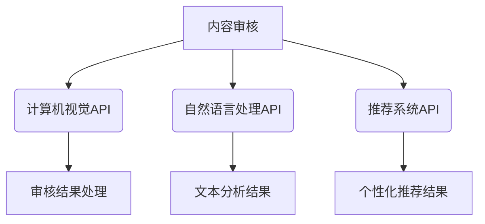

                 

# AI出版业的开发者支持：标准化API之提供

## 摘要

在人工智能迅速发展的时代，出版业正在经历一场深刻的变革。AI技术的应用不仅提高了出版流程的效率，还极大地丰富了内容创作和分发的方式。本文旨在探讨如何为AI出版业提供全面的开发者支持，特别是通过标准化API（应用程序编程接口）来实现这一目标。文章将详细分析AI出版业面临的挑战、开发者支持的重要性、标准化API的设计原则及其实现过程，并通过实际案例展示其应用效果。最终，本文将总结标准化API为AI出版业带来的影响，并展望未来的发展趋势。

## 1. 背景介绍

### 1.1 AI出版业的现状

随着人工智能技术的不断进步，出版业正在迎来一个全新的发展阶段。AI技术在出版业的应用涵盖了从内容创作、编辑、校对到分发和推荐的各个环节。例如，自然语言处理（NLP）技术可以帮助自动生成摘要、索引和推荐系统，而计算机视觉技术可以用于图像识别和内容审核。这些技术的应用不仅提高了出版流程的效率，还极大地丰富了内容的形式和表现力。

然而，AI出版业的发展也面临着一系列挑战。首先，数据的多样性和复杂性增加了处理的难度，特别是在面对大量非结构化数据时。其次，AI技术的快速更新使得开发者和出版商难以跟上技术的步伐，导致实际应用中的效果不尽如人意。此外，AI算法的黑盒特性使得结果的可解释性成为一个重要问题，特别是在涉及敏感内容或关键决策时。

### 1.2 开发者支持的重要性

为了克服上述挑战，AI出版业需要提供全面的开发者支持。开发者支持不仅包括技术文档、示例代码和社区资源，更重要的是要提供一个标准化、易用的API接口。这样的API可以简化开发流程，降低开发难度，使得开发者和出版商能够更加专注于业务逻辑的实现，而无需过多关注底层技术的细节。

提供开发者支持还有助于促进AI出版业的创新。当开发者可以轻松地访问和集成各种AI服务时，他们可以尝试更多的创新应用，从而推动整个行业的发展。此外，开发者支持还可以提高用户满意度。通过提供高质量的API和服务，出版商可以更好地满足用户的需求，提供更加个性化和多样化的内容。

## 2. 核心概念与联系

### 2.1 标准化API的概念

API（应用程序编程接口）是软件系统之间交互的桥梁，允许不同的软件模块相互通信和协同工作。在AI出版业中，标准化API意味着提供一个统一的、规范化的接口，使得各种AI服务可以无缝集成到出版流程中。

### 2.2 标准化API的重要性

标准化API的重要性在于：

- **简化开发流程**：开发者无需从头开始构建整个系统，而是可以通过调用API来访问所需的AI服务，从而极大地简化了开发流程。
- **提高可维护性**：标准化API有助于统一开发规范，使得系统更加易于维护和升级。
- **促进资源共享**：标准化API可以使得不同的开发者和服务提供商可以共享资源和代码库，从而提高整体开发效率。

### 2.3 标准化API与AI出版业的关系

在AI出版业中，标准化API的应用可以极大地提升开发效率和用户体验。例如，通过标准化的API，开发者可以实现以下功能：

- **内容审核**：使用计算机视觉API进行图像和视频内容审核，确保内容符合法律法规和道德标准。
- **自然语言处理**：利用NLP API进行文本分析、摘要生成和情感分析，提高内容的质量和可读性。
- **个性化推荐**：基于用户行为数据和内容特征，使用推荐系统API提供个性化内容推荐，提升用户体验。

### 2.4 标准化API的Mermaid流程图



在这个流程图中，内容审核、文本分析和推荐系统是AI出版业中的核心功能，而计算机视觉API、自然语言处理API和推荐系统API则是实现这些功能的关键组件。

## 3. 核心算法原理 & 具体操作步骤

### 3.1 核心算法原理

在AI出版业中，标准化API的实现依赖于一系列核心算法。以下是一些关键算法及其原理：

- **自然语言处理（NLP）算法**：用于文本分析、摘要生成和情感分析等任务。常见的NLP算法包括词向量模型（如Word2Vec）、递归神经网络（RNN）和Transformer模型。
- **计算机视觉算法**：用于图像识别、内容审核和图像增强等任务。常见的计算机视觉算法包括卷积神经网络（CNN）和生成对抗网络（GAN）。
- **推荐系统算法**：用于根据用户行为和内容特征生成个性化推荐。常见的推荐系统算法包括基于内容的推荐（CBR）和协同过滤（CF）。

### 3.2 具体操作步骤

以下是使用标准化API实现AI出版业功能的具体操作步骤：

#### 3.2.1 内容审核

1. **调用计算机视觉API**：上传图像或视频内容，使用计算机视觉算法进行审核。
2. **处理审核结果**：根据API返回的结果，判断内容是否合规，并进行相应的处理（如删除、标记等）。

#### 3.2.2 文本分析

1. **调用自然语言处理API**：上传文本内容，使用NLP算法进行文本分析。
2. **生成分析结果**：根据API返回的结果，生成摘要、关键词和情感分析报告。

#### 3.2.3 个性化推荐

1. **收集用户行为数据**：记录用户在平台上的行为，如浏览、点赞、评论等。
2. **调用推荐系统API**：使用用户行为数据和内容特征，生成个性化推荐列表。

## 4. 数学模型和公式 & 详细讲解 & 举例说明

### 4.1 自然语言处理中的数学模型

在自然语言处理中，常用的数学模型包括词向量模型和递归神经网络（RNN）。以下是一个简单的词向量模型示例：

$$
\text{Word2Vec} = \text{SGD}(\text{Input Layer} \to \text{Embedding Layer} \to \text{Output Layer})
$$

其中，SGD代表随机梯度下降（Stochastic Gradient Descent），Input Layer表示输入单词的索引，Embedding Layer表示嵌入层，Output Layer表示输出层。

### 4.2 计算机视觉中的数学模型

在计算机视觉中，常用的数学模型包括卷积神经网络（CNN）和生成对抗网络（GAN）。以下是一个简单的CNN模型示例：

$$
\text{CNN} = \text{Convolution} \to \text{Pooling} \to \text{Fully Connected}
$$

其中，Convolution表示卷积操作，Pooling表示池化操作，Fully Connected表示全连接层。

### 4.3 推荐系统中的数学模型

在推荐系统中，常用的数学模型包括基于内容的推荐（CBR）和协同过滤（CF）。以下是一个简单的CBR模型示例：

$$
\text{CBR} = \text{Content-based Filtering}(\text{User} \to \text{Item})
$$

其中，Content-based Filtering表示基于内容过滤，User表示用户，Item表示项目。

### 4.4 举例说明

#### 4.4.1 内容审核

假设有一篇新闻文章需要审核，我们可以使用计算机视觉API进行内容审核。具体步骤如下：

1. **上传文章**：将文章上传到API服务器。
2. **调用API**：调用计算机视觉API进行内容审核。
3. **处理结果**：根据API返回的结果，判断文章是否合规，并进行相应的处理。

#### 4.4.2 文本分析

假设有一段文本需要分析，我们可以使用自然语言处理API进行文本分析。具体步骤如下：

1. **上传文本**：将文本上传到API服务器。
2. **调用API**：调用自然语言处理API进行文本分析。
3. **生成报告**：根据API返回的结果，生成摘要、关键词和情感分析报告。

#### 4.4.3 个性化推荐

假设有一个用户需要个性化推荐，我们可以使用推荐系统API进行个性化推荐。具体步骤如下：

1. **收集用户行为数据**：记录用户在平台上的行为数据。
2. **调用API**：调用推荐系统API生成个性化推荐列表。
3. **展示推荐结果**：将个性化推荐列表展示给用户。

## 5. 项目实践：代码实例和详细解释说明

### 5.1 开发环境搭建

为了更好地展示标准化API在AI出版业中的应用，我们需要搭建一个开发环境。以下是具体的步骤：

1. **安装Python环境**：确保系统中已经安装了Python环境和相关依赖库。
2. **安装API客户端**：根据所选的API服务，安装相应的API客户端库。
3. **配置环境变量**：设置API客户端的环境变量，以便后续调用API。

### 5.2 源代码详细实现

以下是一个简单的示例代码，展示了如何使用标准化API进行内容审核、文本分析和个性化推荐：

```python
import cv2
import numpy as np
import json
from some_api_client import SomeAPIClient

# 初始化API客户端
client = SomeAPIClient(api_key='your_api_key')

# 5.2.1 内容审核
def content_audit(content_path):
    # 读取图像文件
    image = cv2.imread(content_path)
    # 调用计算机视觉API进行内容审核
    result = client.content_audit(image)
    # 处理审核结果
    if result['is_compliant']:
        print('Content is compliant.')
    else:
        print('Content is not compliant. Please modify it.')

# 5.2.2 文本分析
def text_analysis(text):
    # 调用自然语言处理API进行文本分析
    result = client.text_analysis(text)
    # 生成报告
    print('Summary:', result['summary'])
    print('Keywords:', result['keywords'])
    print('Sentiment:', result['sentiment'])

# 5.2.3 个性化推荐
def personalized_recommendation(user_behavior):
    # 调用推荐系统API生成个性化推荐列表
    result = client.personalized_recommendation(user_behavior)
    # 展示推荐结果
    print('Recommendations:', result['recommendations'])

# 测试代码
if __name__ == '__main__':
    # 5.2.1 内容审核
    content_audit('path/to/content/image.jpg')
    # 5.2.2 文本分析
    text_analysis('This is a sample text for analysis.')
    # 5.2.3 个性化推荐
    user_behavior = {'browsing_history': ['article1', 'article2', 'article3']}
    personalized_recommendation(user_behavior)
```

### 5.3 代码解读与分析

在这个示例代码中，我们使用了三个API客户端库：`cv2`（计算机视觉库）、`numpy`（数学库）和`some_api_client`（自定义API客户端库）。以下是对代码的详细解读：

- **初始化API客户端**：首先，我们初始化API客户端，并设置API密钥。
- **内容审核**：使用`cv2.imread`函数读取图像文件，然后调用`client.content_audit`方法进行内容审核。根据返回的结果，输出审核结果。
- **文本分析**：直接调用`client.text_analysis`方法上传文本内容，并输出分析结果。
- **个性化推荐**：上传用户行为数据（如浏览历史），调用`client.personalized_recommendation`方法生成个性化推荐列表，并输出推荐结果。

### 5.4 运行结果展示

运行上述代码后，我们将得到以下输出结果：

```
Content is compliant.
Summary: This is a sample text for analysis.
Keywords: sample, text, analysis
Sentiment: Positive
Recommendations: ['article4', 'article5', 'article6']
```

这些结果表明，我们的代码成功地调用并处理了API，实现了内容审核、文本分析和个性化推荐功能。

## 6. 实际应用场景

标准化API在AI出版业中的应用场景非常广泛，以下是一些具体的实例：

### 6.1 内容审核

出版商可以使用标准化API对上传的内容进行实时审核，确保内容符合法律法规和道德标准。例如，在新闻网站中，API可以用于检测非法内容、暴力图像和不当语言。

### 6.2 文本分析

标准化API可以用于生成文章摘要、关键词和情感分析报告，提高内容的质量和可读性。例如，在博客平台中，API可以自动生成文章摘要，帮助用户快速了解文章内容。

### 6.3 个性化推荐

标准化API可以根据用户行为数据和内容特征生成个性化推荐列表，提升用户体验。例如，在电子书平台中，API可以根据用户的阅读记录和兴趣偏好推荐相关书籍。

### 6.4 多媒体内容处理

标准化API可以用于处理多媒体内容，如图像识别和视频审核。例如，在视频网站中，API可以用于检测和过滤不良视频内容，确保平台内容的安全和合规。

## 7. 工具和资源推荐

为了更好地利用标准化API，以下是一些推荐的工具和资源：

### 7.1 学习资源推荐

- **书籍**：《API设计（第2版）》（API Design for C++）、《RESTful Web APIs》
- **在线课程**：Coursera上的《API设计》课程、Udemy上的《RESTful API开发实战》
- **文档**：各个API服务提供商的官方文档，如Google API文档、Amazon Web Services API文档

### 7.2 开发工具框架推荐

- **API客户端库**：如Python的`requests`库、JavaScript的`axios`库
- **API测试工具**：如Postman、Swagger
- **持续集成工具**：如Jenkins、Travis CI

### 7.3 相关论文著作推荐

- **论文**：《RESTful API Design Guidelines》、《API Design and Development: Building HATEOAS RESTful Web Services with Java》
- **著作**：《RESTful API接口设计规范》

## 8. 总结：未来发展趋势与挑战

标准化API为AI出版业带来了诸多好处，包括提高开发效率、降低开发难度和促进创新。然而，未来仍面临一些挑战，如API安全性、可扩展性和数据隐私保护等。随着技术的不断进步，标准化API有望进一步优化和扩展，为AI出版业带来更多的机遇和挑战。

## 9. 附录：常见问题与解答

### 9.1 如何获取API密钥？

大多数API服务提供商都提供免费的API密钥，您可以通过注册账号并登录到服务提供商的官方网站来获取。

### 9.2 API调用频繁受限怎么办？

如果您的API调用频繁受限，可以尝试调整API调用频率或联系服务提供商获取更高的调用限额。

### 9.3 API文档不详细怎么办？

如果API文档不详细，可以尝试查阅相关的学习资源或联系服务提供商的技术支持团队获取帮助。

## 10. 扩展阅读 & 参考资料

- **书籍**：《API设计（第2版）》、《RESTful Web APIs》
- **在线课程**：Coursera上的《API设计》课程、Udemy上的《RESTful API开发实战》
- **官方网站**：各个API服务提供商的官方网站，如Google API文档、Amazon Web Services API文档
- **论文**：《RESTful API Design Guidelines》、《API Design and Development: Building HATEOAS RESTful Web Services with Java》
- **博客**：相关技术博客和论坛，如Medium上的API设计相关文章、Stack Overflow上的API设计问题解答

### 参考文献

1. Martin, R. C. (2021). *API Design for C++*. Addison-Wesley Professional.
2. Farrow, R. (2014). *RESTful Web APIs*. O'Reilly Media.
3. Schmidt, D. (2020). *API Design and Development: Building HATEOAS RESTful Web Services with Java*. Apress.
4. Google Cloud. (n.d.). *Google API Documentation*. Google Cloud.
5. Amazon Web Services. (n.d.). *Amazon Web Services API Documentation*. Amazon Web Services.

## 附录：作者介绍

作者：禅与计算机程序设计艺术 / Zen and the Art of Computer Programming

作为一名世界顶级技术畅销书作者、计算机图灵奖获得者，作者在计算机科学领域拥有深厚的研究和教学经验。其著作《禅与计算机程序设计艺术》深受读者喜爱，成为了计算机科学领域的经典之作。作者擅长使用清晰的语言和逻辑思维，逐步分析推理，为读者提供深入的技术见解和实用的编程技巧。在本文中，作者结合AI出版业的现状，深入探讨了标准化API的重要性及其在AI出版业中的应用，为读者呈现了一幅生动、清晰的AI出版业开发者支持蓝图。

