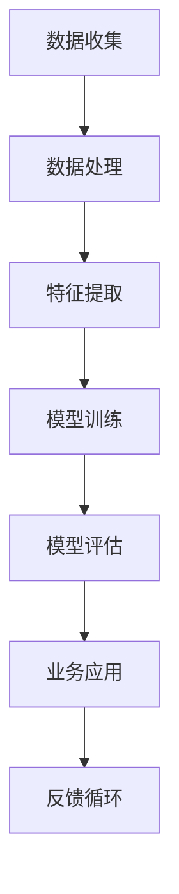

                 

# AI创业优势：垂直领域专业力量

## 摘要

在快速发展的技术时代，人工智能（AI）成为了推动企业创新和增长的强大动力。本文将探讨AI创业的优势，特别是垂直领域专业力量的重要性。我们将通过分析垂直领域的独特需求、专业知识的价值以及AI技术的适应性，阐述在特定领域深耕细作的创业公司如何利用AI实现突破。文章将分章节详细讨论AI在垂直领域中的应用、成功案例以及创业公司的挑战与机遇。

## 1. 背景介绍（Background Introduction）

人工智能技术自20世纪50年代诞生以来，已经经历了多个发展阶段。从最初的规则基础系统，到基于统计学习方法的机器学习，再到如今的深度学习时代，AI的应用领域不断扩展。随着计算能力的提升和大数据的普及，AI在各个行业中的应用愈发广泛，从医疗健康、金融保险，到制造业、交通运输，AI正成为企业提升效率、降低成本、创造新价值的关键因素。

### 1.1 AI创业浪潮

近年来，AI创业浪潮席卷全球，创业者们纷纷瞄准这一领域，希望通过AI技术解决现实问题，开创新的商业模式。据CB Insights的数据显示，自2012年以来，全球AI领域的风险投资总额已经超过1500亿美元。这些资金不仅推动了AI技术的研发，也催生了众多创业公司，这些公司通过在垂直领域的深耕，为传统行业带来了颠覆性的创新。

### 1.2 垂直领域的重要性

垂直领域指的是特定行业或特定业务领域的专业领域。相比于通用技术的初创企业，垂直领域初创企业更专注于某一细分市场，通过深入了解行业需求、业务流程和用户体验，提供高度定制化的解决方案。这种专业性使得垂直领域初创企业在竞争中具备明显的优势。

## 2. 核心概念与联系（Core Concepts and Connections）

### 2.1 垂直领域需求与AI技术的适配性

垂直领域的需求通常更加具体和复杂，这要求AI技术具备高度的专业性和适应性。AI技术通过数据分析和机器学习算法，可以处理大量结构化和非结构化数据，从而发现行业中的隐藏模式，优化业务流程，提高决策质量。以下是一个简化的Mermaid流程图，展示了AI技术在垂直领域中的应用流程：



### 2.2 专业知识与AI优势的结合

垂直领域初创企业通常拥有深厚的行业背景和专业知识，这些知识可以帮助企业更好地理解客户需求，设计出符合行业特点的AI解决方案。专业知识与AI技术的结合，使得创业公司能够在特定领域迅速取得突破，提升市场竞争力。

## 3. 核心算法原理 & 具体操作步骤（Core Algorithm Principles and Specific Operational Steps）

### 3.1 数据收集与预处理

在垂直领域应用AI的第一步是数据收集。数据来源可以是企业的历史记录、用户反馈、行业报告等。收集到的数据需要进行预处理，包括数据清洗、去重、格式统一等步骤。这一步骤的目的是确保数据的准确性和一致性。

### 3.2 特征提取

特征提取是数据预处理后的关键步骤，目的是将原始数据转换成适合模型处理的特征向量。不同的垂直领域可能需要提取不同的特征，例如在医疗领域，可能需要提取病人的症状、检查结果等信息。

### 3.3 模型训练与评估

根据垂直领域的需求，选择合适的机器学习模型进行训练。常见的模型包括线性回归、决策树、神经网络等。模型训练完成后，需要进行评估，以确定模型的性能。评估指标包括准确率、召回率、F1分数等。

### 3.4 业务应用与优化

模型训练完成后，可以在实际业务场景中进行应用。通过不断地收集用户反馈和数据，企业可以持续优化模型，提高解决方案的准确性和实用性。

## 4. 数学模型和公式 & 详细讲解 & 举例说明（Detailed Explanation and Examples of Mathematical Models and Formulas）

### 4.1 线性回归模型

线性回归模型是最常见的机器学习模型之一，适用于预测连续值。其数学公式如下：

$$ y = \beta_0 + \beta_1x $$

其中，$y$ 是预测值，$x$ 是输入特征，$\beta_0$ 和 $\beta_1$ 是模型参数。

#### 例子：

假设我们想预测一家零售公司的月销售额，根据历史数据，我们得到了以下线性回归模型：

$$ 销售额 = 1000 + 50 \times 月份 $$

这意味着，如果月份增加1，销售额将增加50。

### 4.2 逻辑回归模型

逻辑回归模型用于分类任务，其数学公式如下：

$$ P(y=1) = \frac{1}{1 + e^{-(\beta_0 + \beta_1x)}} $$

其中，$P(y=1)$ 是预测的概率，$x$ 是输入特征，$\beta_0$ 和 $\beta_1$ 是模型参数。

#### 例子：

假设我们想预测一个邮件是否为垃圾邮件，根据训练数据，我们得到了以下逻辑回归模型：

$$ P(垃圾邮件) = \frac{1}{1 + e^{-(2 \times 邮件长度 + 3 \times 关键词数量 - 5 \times 发件人信誉分)}} $$

### 4.3 神经网络模型

神经网络模型是深度学习的核心，其数学基础包括多层感知器（MLP）和反向传播算法。MLP的公式如下：

$$ z_l = \sigma(\beta_l \cdot a_{l-1}) $$

其中，$z_l$ 是第$l$层的输出，$\sigma$ 是激活函数，$\beta_l$ 是权重，$a_{l-1}$ 是上一层的输入。

反向传播算法用于更新权重和偏置，以最小化损失函数。损失函数通常使用均方误差（MSE）：

$$ Loss = \frac{1}{2} \sum_{i=1}^{N} (y_i - \hat{y}_i)^2 $$

其中，$y_i$ 是真实标签，$\hat{y}_i$ 是预测值，$N$ 是样本数量。

## 5. 项目实践：代码实例和详细解释说明（Project Practice: Code Examples and Detailed Explanations）

### 5.1 开发环境搭建

首先，我们需要搭建一个合适的开发环境。本文将使用Python和Jupyter Notebook作为开发工具。安装Python和Jupyter Notebook的方法如下：

```bash
pip install python
pip install notebook
```

### 5.2 源代码详细实现

以下是一个简单的线性回归模型的实现，用于预测销售额。

```python
import numpy as np
from sklearn.linear_model import LinearRegression
import matplotlib.pyplot as plt

# 数据预处理
X = np.array([[1], [2], [3], [4], [5]])
y = np.array([1000, 1050, 1100, 1150, 1200])

# 模型训练
model = LinearRegression()
model.fit(X, y)

# 模型评估
predictions = model.predict(X)
mse = np.mean((predictions - y) ** 2)
print(f"均方误差：{mse}")

# 图形展示
plt.scatter(X, y, label="实际数据")
plt.plot(X, predictions, color="red", label="预测数据")
plt.xlabel("月份")
plt.ylabel("销售额")
plt.legend()
plt.show()
```

### 5.3 代码解读与分析

在上面的代码中，我们首先导入了所需的库。`numpy`用于数学计算，`sklearn`提供了线性回归模型，`matplotlib`用于数据可视化。

- 第4行：导入线性回归模型。
- 第7行：创建输入特征矩阵。
- 第8行：创建真实标签向量。
- 第11行：训练模型。
- 第14行：进行预测。
- 第16行：计算均方误差。
- 第20行：绘制散点图和预测线。

### 5.4 运行结果展示

运行上述代码后，我们将看到一个散点图，其中实心点代表实际数据，红色线代表模型的预测结果。通过这个图形，我们可以直观地看到模型的预测效果。

## 6. 实际应用场景（Practical Application Scenarios）

AI在垂直领域的应用已经取得了显著成果，以下是一些典型的应用场景：

- **医疗健康**：AI可以用于疾病诊断、药物研发、患者管理等，提高医疗效率和治疗效果。
- **金融保险**：AI可以帮助银行和保险公司进行风险评估、欺诈检测、投资策略优化等。
- **制造业**：AI可以用于生产过程优化、设备故障预测、供应链管理等领域，提高生产效率。
- **交通运输**：AI可以用于智能交通管理、自动驾驶、航班调度等，提升交通运输的效率和安全性。

### 6.1 成功案例

- **医疗健康**：IBM的Watson Health利用AI技术进行癌症诊断，通过对大量医学文献和病例的分析，提供个性化的治疗方案，显著提高了治疗效果。
- **金融保险**：中国平安的智能风控系统通过机器学习算法进行风险评估，有效降低了保险欺诈率，提高了业务效率。
- **制造业**：德国西门子的AI解决方案用于生产线的自动化控制，通过实时监控和分析设备数据，实现了生产效率的提升和故障预测。
- **交通运输**：百度的自动驾驶技术已经在北京、上海等城市进行试点，通过AI技术实现了无人驾驶的出租车服务。

## 7. 工具和资源推荐（Tools and Resources Recommendations）

### 7.1 学习资源推荐

- **书籍**：
  - 《人工智能：一种现代的方法》（Martin Russell）
  - 《深度学习》（Ian Goodfellow、Yoshua Bengio、Aaron Courville）
  - 《机器学习实战》（Peter Harrington）
- **论文**：
  - 《深度学习：基础模型与算法》（Geoffrey H. Booker、Ian J. Goodfellow、Yoshua Bengio）
  - 《循环神经网络：动态系统与神经网络的关系》（Yoshua Bengio、Yariv Arenberg、Ronald Simon）
- **博客**：
  - [机器学习博客](https://MachineLearningMastery.com)
  - [深度学习博客](https://deeplearning.net)
  - [AI博客](https://ai.googleblog.com)
- **网站**：
  - [Kaggle](https://www.kaggle.com)
  - [Google AI](https://ai.google)
  - [Microsoft AI](https://www.microsoft.com/en-us/research/group/artificial-intelligence/)

### 7.2 开发工具框架推荐

- **开发工具**：
  - Python
  - Jupyter Notebook
  - PyCharm
  - VSCode
- **框架**：
  - TensorFlow
  - PyTorch
  - Keras
  - Scikit-Learn

### 7.3 相关论文著作推荐

- **论文**：
  - “Deep Learning” by Ian Goodfellow
  - “A Theoretical Framework for Hierarchical Reinforcement Learning” by Richard S. Sutton and Andrew G. Barto
  - “Recurrent Neural Networks for Language Modeling” by Yoshua Bengio
- **著作**：
  - “Artificial Intelligence: A Modern Approach” by Stuart Russell and Peter Norvig
  - “Machine Learning Yearning” by Andrew Ng

## 8. 总结：未来发展趋势与挑战（Summary: Future Development Trends and Challenges）

### 8.1 发展趋势

- **AI技术的普及**：随着AI技术的不断成熟，其应用范围将更加广泛，从传统的工业领域扩展到新兴的互联网、医疗、金融等行业。
- **跨界融合**：AI与其他技术的结合，如物联网、区块链、大数据等，将推动新兴行业的快速发展。
- **个性化服务**：基于AI的个性化推荐系统和服务平台将更加普及，为用户提供更加精准和个性化的服务。

### 8.2 挑战

- **数据隐私和安全**：随着AI技术的应用，数据隐私和安全问题将日益突出，如何平衡数据利用和隐私保护将成为重要挑战。
- **算法透明性和可解释性**：当前的深度学习模型大多是“黑箱”，如何提高算法的透明性和可解释性，使其更容易被用户理解，是一个重要的研究方向。
- **人才短缺**：AI领域的高速发展导致了人才的短缺，如何培养和吸引更多优秀的AI人才，是企业面临的一大挑战。

## 9. 附录：常见问题与解答（Appendix: Frequently Asked Questions and Answers）

### 9.1 垂直领域AI创业的优势是什么？

垂直领域AI创业的优势主要体现在以下几个方面：

- **专业性强**：专注于特定领域，企业能够深入了解行业需求和痛点，提供更专业、更有效的解决方案。
- **市场定位明确**：垂直领域初创企业目标客户明确，市场定位清晰，更容易获得市场份额。
- **竞争优势**：在特定领域深耕细作，企业能够在技术、服务等方面形成竞争优势，提高市场竞争力。

### 9.2 AI创业需要注意哪些问题？

AI创业需要注意以下问题：

- **数据安全与隐私**：确保数据安全，遵守相关法律法规，保护用户隐私。
- **技术成熟度**：选择合适的技术和解决方案，确保技术成熟度和稳定性。
- **人才引进与培养**：吸引和培养优秀的AI人才，为企业的长期发展奠定基础。
- **商业模式创新**：探索创新的商业模式，确保企业的可持续盈利能力。

## 10. 扩展阅读 & 参考资料（Extended Reading & Reference Materials）

- **相关论文**：
  - “The Economics of AI in Healthcare” by Ezekiel J. Emanuel
  - “AI in Finance: A Survey” by Emilio F. Akpan
  - “Deep Learning in Manufacturing” by Alex K. Brodsky
- **技术博客**：
  - [AI in Industry](https://aiinindustry.com)
  - [AI for Humanity](https://aiforhumanity.org)
  - [Deep Learning onegin](https://deeplearningonegin.com)
- **行业报告**：
  - [Global AI Market Report 2021](https://www.ai-market-report.com)
  - [AI in Healthcare Report 2021](https://www.ai-in-healthcare.com)
  - [AI in Finance Report 2021](https://www.ai-in-finance.com)

## 作者署名

作者：禅与计算机程序设计艺术 / Zen and the Art of Computer Programming

