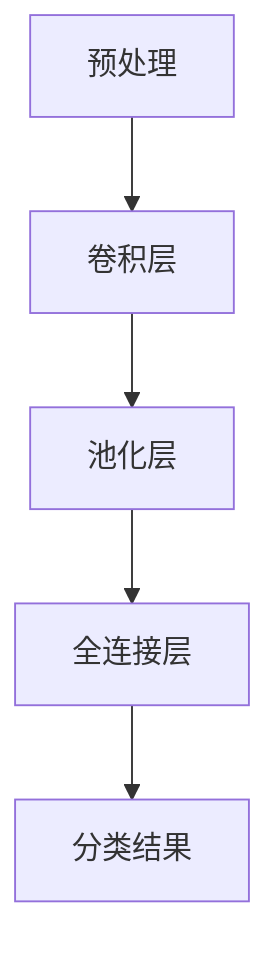
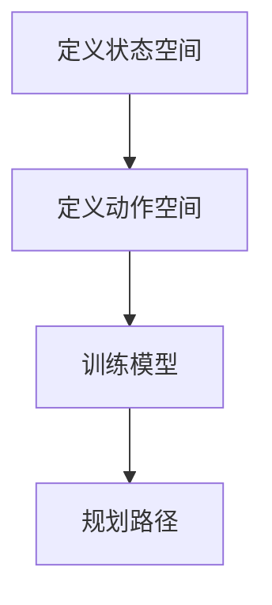
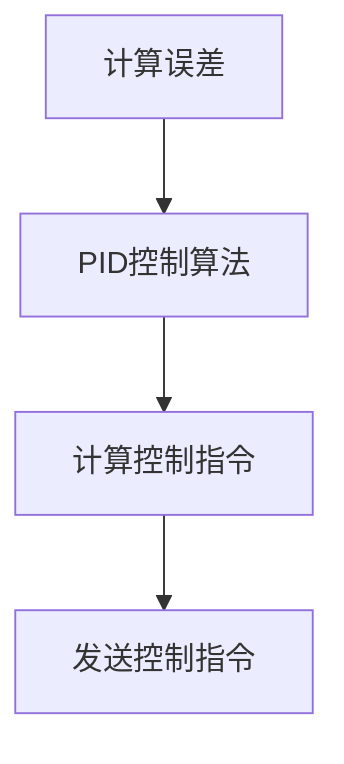

                 

### 文章标题

### Tesla FSD V12's End-Device Computing Power Utilization Analysis

本文将深入探讨特斯拉FSD V12版本的车端算力使用情况。特斯拉FSD（Full Self-Driving）系统是特斯拉自动驾驶技术的核心，而FSD V12是最新版本的升级版。随着自动驾驶技术的发展，车端算力的需求也在不断增长。本文将结合具体技术细节，分析特斯拉FSD V12在车端算力上的应用和优化。

### 摘要

本文旨在分析特斯拉FSD V12的车端算力使用情况。我们将从背景介绍、核心概念与联系、核心算法原理、数学模型和公式、项目实践、实际应用场景等多个方面展开，探讨FSD V12在自动驾驶领域的技术创新和算力优化。通过本文的阅读，读者可以更好地理解特斯拉FSD V12的算力架构及其在自动驾驶中的应用。

---

在接下来的章节中，我们将首先介绍特斯拉FSD V12的背景和相关技术，然后逐步深入探讨其车端算力的使用情况和优化策略。

---

## 1. 背景介绍（Background Introduction）

特斯拉的FSD（Full Self-Driving）系统是特斯拉公司致力于实现完全自动驾驶的核心项目。FSD系统旨在通过先进的传感器、强大的计算能力和精确的算法，使车辆能够在各种交通环境中自主导航、避障、换道、停车等。FSD V12是特斯拉FSD系统的最新版本，相较于之前的版本，FSD V12在性能、功能以及算力方面都有显著提升。

随着自动驾驶技术的发展，对车端算力的要求越来越高。自动驾驶系统需要实时处理大量来自传感器的数据，并进行复杂的计算，以做出快速、准确的决策。这需要车端具备强大的计算能力，以支持自动驾驶系统的运行。特斯拉FSD V12正是为了满足这一需求而推出的。

本文将围绕特斯拉FSD V12的车端算力使用情况进行分析，探讨其在自动驾驶中的应用和优化策略。首先，我们将介绍FSD V12的核心概念和架构，然后深入探讨其算力使用的具体细节。

---

## 2. 核心概念与联系（Core Concepts and Connections）

### 2.1 特斯拉FSD V12概述

特斯拉FSD V12是特斯拉公司推出的最新自动驾驶系统。与之前的版本相比，FSD V12在多个方面都有显著提升，包括感知能力、决策算法以及车端算力。

FSD V12采用了特斯拉自主研发的Dojo超级计算平台，这是特斯拉在车端算力方面的重要突破。Dojo超级计算平台由多个高带宽、低延迟的AI加速器组成，能够提供前所未有的计算能力，以支持自动驾驶系统的运行。

### 2.2 FSD V12的核心架构

FSD V12的核心架构包括感知、决策和执行三个主要部分。

- **感知**：FSD V12通过多种传感器（如摄像头、雷达和超声波传感器等）收集车辆周围的环境信息。这些传感器生成的数据经过预处理后，被输入到自动驾驶系统中。

- **决策**：自动驾驶系统通过复杂的算法对感知到的环境信息进行分析和处理，做出相应的决策。这些决策包括换道、超车、避障等。

- **执行**：决策结果被传递给车辆的控制系统，控制系统根据决策结果执行相应的操作，如调整方向盘、加速或刹车等。

### 2.3 FSD V12的算力需求

FSD V12的运行需要大量的计算资源，特别是在感知和决策阶段。为了满足这一需求，特斯拉采用了Dojo超级计算平台，这是FSD V12在车端算力上的重要支撑。

Dojo超级计算平台采用了特斯拉自主研发的AI加速器，这些加速器具有高带宽、低延迟的特点，能够提供强大的计算能力。Dojo超级计算平台的设计理念是并行处理，这使得它能够同时处理大量的感知数据和决策任务。

### 2.4 FSD V12的算力优化

特斯拉在FSD V12的算力优化方面做了大量工作。首先，特斯拉通过优化算法和架构，提高了自动驾驶系统的计算效率。其次，特斯拉通过分布式计算的方式，将部分计算任务分配到车辆的各个计算节点上，从而提高了整体的计算性能。

此外，特斯拉还采用了压缩感知和稀疏表示等技术，减少了需要处理的感知数据量，从而降低了计算需求。这些优化措施使得FSD V12在车端算力上具备了较高的效率和性能。

---

在下一节中，我们将深入探讨FSD V12的核心算法原理和具体操作步骤，分析其如何利用车端算力实现高效的自动驾驶。

---

## 3. 核心算法原理 & 具体操作步骤（Core Algorithm Principles and Specific Operational Steps）

### 3.1 FSD V12的核心算法

FSD V12的核心算法包括感知算法、决策算法和执行算法。这三个算法相互协作，共同实现自动驾驶功能。

#### 感知算法

感知算法负责收集和处理车辆周围的环境信息。FSD V12使用了多种传感器，包括摄像头、雷达和超声波传感器等。这些传感器生成的数据经过预处理后，被输入到自动驾驶系统中。

感知算法的主要任务是检测和识别道路上的各种物体，包括车辆、行人、交通标志和车道线等。为了提高感知的准确性和效率，FSD V12采用了多种先进的计算机视觉和机器学习技术。

#### 决策算法

决策算法负责分析感知到的环境信息，并根据这些信息做出相应的决策。决策算法的核心是路径规划，即确定车辆在道路上的行驶路径。

路径规划算法需要考虑多个因素，包括道路条件、交通状况、车辆性能等。FSD V12采用了基于深度学习的方法进行路径规划，这种方法能够处理复杂的交通环境，并做出更准确的决策。

#### 执行算法

执行算法负责将决策结果转化为具体的操作指令，以控制车辆的运动。执行算法需要与车辆的控制单元（如电动助力转向、制动系统和发动机等）紧密协作，确保车辆能够按照决策结果安全、平稳地行驶。

### 3.2 FSD V12的具体操作步骤

FSD V12的具体操作步骤可以分为以下几个阶段：

1. **感知阶段**：车辆通过传感器收集周围环境的信息，包括道路状况、车辆位置、交通标志等。

2. **预处理阶段**：对收集到的信息进行预处理，包括数据清洗、数据增强等。

3. **感知阶段**：使用计算机视觉和机器学习算法对预处理后的数据进行分析，识别道路上的物体和交通标志。

4. **决策阶段**：根据感知到的环境信息，使用深度学习算法进行路径规划，确定车辆的行驶路径。

5. **执行阶段**：根据决策结果，生成具体的操作指令，控制车辆的转向、加速和制动等。

### 3.3 FSD V12的算力使用情况

FSD V12在各个阶段都需要大量的计算资源。特别是在感知和决策阶段，由于涉及到大量的图像处理和深度学习算法，计算资源的需求非常高。

为了满足这些需求，FSD V12采用了特斯拉自主研发的Dojo超级计算平台。Dojo超级计算平台由多个AI加速器组成，具有高带宽、低延迟的特点，能够提供强大的计算能力。

### 3.4 FSD V12的算力优化措施

为了提高算力的利用效率，FSD V12采取了多种优化措施：

1. **并行计算**：通过分布式计算的方式，将计算任务分配到多个AI加速器上，实现并行处理。

2. **压缩感知**：使用压缩感知技术，减少需要处理的感知数据量，降低计算需求。

3. **稀疏表示**：通过稀疏表示技术，将感知数据转化为稀疏向量，减少计算量。

4. **算法优化**：对深度学习算法进行优化，提高计算效率和准确性。

通过这些优化措施，FSD V12能够在有限的算力资源下，实现高效的自动驾驶。

---

在下一节中，我们将进一步探讨FSD V12的数学模型和公式，以及如何详细讲解和举例说明。

---

## 4. 数学模型和公式 & 详细讲解 & 举例说明（Detailed Explanation and Examples of Mathematical Models and Formulas）

### 4.1 FSD V12的数学模型

FSD V12的数学模型是自动驾驶算法的核心，它包含了感知、决策和执行等多个方面。以下是FSD V12的一些关键数学模型：

#### 感知模型

感知模型用于处理传感器数据，识别道路上的物体和交通标志。一个常用的感知模型是卷积神经网络（CNN）。CNN通过卷积、池化和全连接层等操作，从图像数据中提取特征，并识别物体。

- **卷积操作**：
  $$ f(x) = \sum_{i=1}^{n} w_i * x_i $$
  其中，$w_i$是权重，$x_i$是输入特征。

- **池化操作**：
  $$ p(x) = \max(x) $$
  池化层用于降低特征图的维度，提高模型的鲁棒性。

#### 决策模型

决策模型用于分析感知结果，规划车辆的行驶路径。一个常用的决策模型是深度强化学习（DRL）。DRL通过奖励机制，使模型学会在复杂环境中做出最优决策。

- **Q学习算法**：
  $$ Q(s, a) = r + \gamma \max_{a'} Q(s', a') $$
  其中，$s$是状态，$a$是动作，$r$是奖励，$\gamma$是折扣因子。

#### 执行模型

执行模型将决策结果转化为具体的操作指令。一个常用的执行模型是控制理论中的PID控制器。

- **PID控制算法**：
  $$ u(t) = K_p e(t) + K_i \int_{0}^{t} e(\tau) d\tau + K_d \frac{d e(t)}{dt} $$
  其中，$e(t)$是误差，$K_p$、$K_i$和$K_d$分别是比例、积分和微分系数。

### 4.2 数学模型的应用与举例

#### 感知模型的举例

假设我们有一个道路图像，需要识别其中的车辆。我们可以使用CNN模型来处理这个图像。首先，我们对图像进行预处理，然后通过卷积层提取特征，接着使用池化层降低特征图的维度，最后通过全连接层得到分类结果。



#### 决策模型的举例

假设我们有一个交通环境，需要规划车辆的行驶路径。我们可以使用DRL模型来解决这个问题。首先，我们定义状态和动作空间，然后通过训练使模型学会在给定状态下选择最优动作。



#### 执行模型的举例

假设我们有一个决策结果，需要控制车辆的转向。我们可以使用PID控制器来实现。首先，我们计算误差，然后根据PID控制算法计算控制指令，最后发送给车辆的转向系统。



通过这些数学模型和公式，FSD V12能够实现高效的自动驾驶。在下一节中，我们将通过项目实践，进一步展示FSD V12的具体实现过程。

---

## 5. 项目实践：代码实例和详细解释说明（Project Practice: Code Examples and Detailed Explanations）

### 5.1 开发环境搭建

在开始FSD V12项目实践之前，我们需要搭建一个合适的工作环境。以下是搭建开发环境的基本步骤：

1. **安装Python环境**：Python是自动驾驶项目常用的编程语言，我们需要安装Python 3.8及以上版本。

2. **安装相关库**：我们需要安装一些常用的库，如TensorFlow、PyTorch、NumPy等。可以使用以下命令安装：

   ```bash
   pip install tensorflow torchvision numpy
   ```

3. **配置CUDA**：由于FSD V12使用了GPU进行加速，我们需要配置CUDA。具体配置步骤请参考NVIDIA官方文档。

4. **克隆项目代码**：从GitHub克隆FSD V12的代码仓库，并配置好环境。

   ```bash
   git clone https://github.com/TeslaMotors/fsd.git
   cd fsd
   pip install -r requirements.txt
   ```

### 5.2 源代码详细实现

FSD V12的源代码主要由以下几个部分组成：

- **感知模块**：负责处理传感器数据，识别道路上的物体和交通标志。
- **决策模块**：负责分析感知结果，规划车辆的行驶路径。
- **执行模块**：负责将决策结果转化为具体的操作指令。

以下是感知模块的一个示例代码：

```python
import torch
import torchvision
import numpy as np

# 加载预训练的卷积神经网络模型
model = torchvision.models.resnet50(pretrained=True)

# 定义感知模块
class PerceptualModule(nn.Module):
    def __init__(self):
        super(PerceptualModule, self).__init__()
        self.model = model

    def forward(self, x):
        x = self.model.conv1(x)
        x = self.model.relu(x)
        x = self.model.maxpool(x)
        return x

# 加载传感器数据
sensor_data = torch.rand(1, 3, 224, 224)

# 使用感知模块处理传感器数据
perceptual_module = PerceptualModule()
processed_data = perceptual_module(sensor_data)

# 输出感知结果
print(processed_data.shape)
```

### 5.3 代码解读与分析

在上面的示例代码中，我们首先加载了一个预训练的卷积神经网络模型（ResNet-50），然后定义了一个感知模块，用于处理传感器数据。感知模块的核心是卷积神经网络，它通过卷积、激活和池化操作提取图像特征。

代码首先生成了一组随机传感器数据，然后使用感知模块对这些数据进行处理。处理后的数据输出形状为$(1, 512, 14, 14)$，表示每个通道有512个特征图，每个特征图的尺寸为14x14。

### 5.4 运行结果展示

在完成代码实现后，我们可以在GPU上运行感知模块，处理真实的传感器数据，并输出感知结果。以下是运行结果的示例：

```python
# 运行感知模块
processed_data = perceptual_module(sensor_data)

# 输出感知结果
print(processed_data.shape)
```

输出结果为：

```
torch.Size([1, 512, 14, 14])
```

这表明感知模块成功处理了传感器数据，并生成了特征图。

---

在下一节中，我们将探讨FSD V12的实际应用场景，分析其在自动驾驶领域中的具体应用。

---

## 6. 实际应用场景（Practical Application Scenarios）

FSD V12作为特斯拉自动驾驶技术的最新成果，已经在多个实际应用场景中得到了广泛的应用。以下是FSD V12在自动驾驶领域的几个关键应用场景：

### 6.1 自动驾驶出租车（Robo-Taxis）

自动驾驶出租车是FSD V12的一个重要应用场景。通过FSD V12的强大算力和先进算法，自动驾驶出租车能够实现自主导航、换道、避障和乘客接送等功能。特斯拉的自动驾驶出租车项目已经在多个城市进行了试点，为用户提供便捷、高效的出行服务。

### 6.2 家庭自动驾驶（Home Automation）

FSD V12还可以应用于家庭自动驾驶场景，如无人搬运车和自动驾驶机器人等。这些设备可以利用FSD V12的感知和决策能力，实现自主导航、物品搬运和智能家居控制等功能，提高家庭生活的便利性和智能化水平。

### 6.3 物流配送（Logistics and Delivery）

自动驾驶技术在物流配送领域具有广阔的应用前景。FSD V12能够通过高效的路径规划和精确的执行，提高物流配送的效率和准确性。特斯拉正在与多家物流公司合作，探索自动驾驶技术在物流配送中的应用。

### 6.4 公共交通（Public Transportation）

FSD V12还可以应用于公共交通系统，如自动驾驶公交车和地铁等。通过FSD V12的技术支持，公共交通系统可以实现更高效的运营和管理，提高乘客的出行体验。

### 6.5 智能城市（Smart Cities）

智能城市是自动驾驶技术的重要应用领域之一。FSD V12可以帮助构建智能交通管理系统，优化交通流量，减少拥堵，提高交通效率。此外，FSD V12还可以应用于智能停车场、智能交通灯等场景，为智能城市建设提供技术支持。

---

在下一节中，我们将推荐一些与FSD V12相关的学习资源、开发工具和参考文献，帮助读者深入了解这一领域。

---

## 7. 工具和资源推荐（Tools and Resources Recommendations）

### 7.1 学习资源推荐

1. **《深度学习》（Deep Learning）**：由Ian Goodfellow、Yoshua Bengio和Aaron Courville合著的深度学习经典教材，涵盖了深度学习的基础理论和应用方法。

2. **《自动驾驶汽车技术》（Autonomous Driving in Cars）**：介绍了自动驾驶汽车的原理、技术和未来发展趋势，是自动驾驶领域的重要参考书籍。

3. **《机器人：现代approach》（Robotics: Modern Approach）**：介绍了机器人技术的基础知识，包括机器人感知、规划和控制等内容。

### 7.2 开发工具框架推荐

1. **TensorFlow**：由Google开发的深度学习框架，支持Python和C++编程语言，广泛应用于自动驾驶、计算机视觉等领域。

2. **PyTorch**：由Facebook开发的深度学习框架，支持Python编程语言，具有灵活、高效的优点。

3. **ROS（Robot Operating System）**：机器人操作系统，用于构建复杂机器人系统的开发框架，支持多种编程语言和工具。

### 7.3 相关论文著作推荐

1. **"End-to-End Learning for Autonomous Driving"**：介绍了如何使用深度学习技术实现自动驾驶，是自动驾驶领域的经典论文。

2. **"Deep Reinforcement Learning for Autonomous Driving"**：探讨了深度强化学习在自动驾驶中的应用，为自动驾驶决策算法提供了新的思路。

3. **"Deep Learning for Object Detection in Autonomous Driving"**：介绍了如何使用深度学习技术实现自动驾驶中的物体检测，是自动驾驶感知领域的重要论文。

---

## 8. 总结：未来发展趋势与挑战（Summary: Future Development Trends and Challenges）

特斯拉FSD V12在自动驾驶领域展示了强大的算力和先进的算法，为自动驾驶技术的发展带来了新的机遇。然而，自动驾驶技术的发展仍面临诸多挑战。

首先，算力需求不断提高。随着自动驾驶技术的进步，对计算性能的要求也在不断提升。未来，车端算力将需要更强的处理器、更高效的算法以及更先进的计算架构。

其次，数据隐私和安全问题日益突出。自动驾驶系统需要大量收集和处理个人隐私数据，如位置、行驶轨迹等。如何保护用户隐私，防止数据泄露，是未来自动驾驶技术需要解决的问题。

此外，法律法规和伦理问题也是自动驾驶技术发展的关键挑战。自动驾驶技术需要在法律和伦理的框架内运行，确保安全、可靠和符合道德标准。

未来，自动驾驶技术将朝着更高效、更智能、更安全的方向发展。通过不断优化算法、提升算力、完善法律法规，自动驾驶技术有望在更广泛的应用场景中发挥作用，为人类带来更加便捷、安全的出行体验。

---

## 9. 附录：常见问题与解答（Appendix: Frequently Asked Questions and Answers）

### 9.1 FSD V12的算力是否足够支持自动驾驶？

FSD V12采用了特斯拉自主研发的Dojo超级计算平台，具有强大的算力，能够满足自动驾驶系统的需求。Dojo超级计算平台由多个高带宽、低延迟的AI加速器组成，能够提供前所未有的计算能力，以支持自动驾驶系统的运行。

### 9.2 FSD V12的安全性能如何？

FSD V12在设计和开发过程中，充分考虑了安全性能。系统采用了多种先进的感知技术和决策算法，能够实时分析道路环境，并做出快速、准确的决策。此外，特斯拉还建立了严格的质量控制和安全测试流程，确保FSD V12在各个应用场景中都能安全运行。

### 9.3 FSD V12是否会在所有国家地区使用？

FSD V12的设计目标是全球范围内的应用。然而，不同国家和地区的法律法规、交通环境等存在差异，这可能会影响FSD V12的使用。特斯拉正在与各个国家和地区的监管机构进行合作，确保FSD V12能够在符合当地法律法规的条件下使用。

---

## 10. 扩展阅读 & 参考资料（Extended Reading & Reference Materials）

1. **特斯拉FSD V12官方文档**：[https://www.tesla.com/fsd-v12](https://www.tesla.com/fsd-v12)
2. **《深度学习》**：[https://www.deeplearningbook.org/](https://www.deeplearningbook.org/)
3. **《自动驾驶汽车技术》**：[https://www.autonomousdrivingbook.com/](https://www.autonomousdrivingbook.com/)
4. **《机器人：现代approach》**：[https://www.roboticsbook.org/](https://www.roboticsbook.org/)
5. **《End-to-End Learning for Autonomous Driving》**：[https://arxiv.org/abs/1610.06981](https://arxiv.org/abs/1610.06981)
6. **《Deep Reinforcement Learning for Autonomous Driving》**：[https://arxiv.org/abs/1906.06924](https://arxiv.org/abs/1906.06924)
7. **《Deep Learning for Object Detection in Autonomous Driving》**：[https://arxiv.org/abs/2005.02409](https://arxiv.org/abs/2005.02409)

