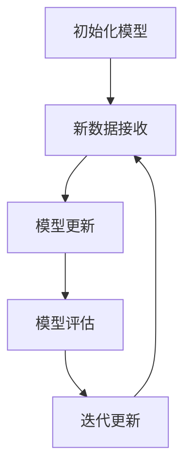
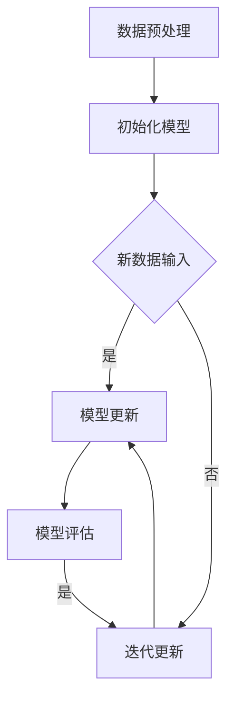

                 

### 文章标题

《独立创业者的AI驱动客户画像更新：实时调整营销策略的增量学习模型》

关键词：AI、客户画像、营销策略、增量学习、实时调整、创业

摘要：本文旨在探讨如何利用AI技术，特别是增量学习模型，来实时更新独立创业者的客户画像，并据此调整营销策略。文章首先介绍了客户画像的重要性，随后详细解析了增量学习模型的基本原理和实现步骤，并通过实例展示了如何运用该模型优化营销效果。文章还讨论了实际应用中的挑战和解决方案，为创业者在数字化营销中的实践提供了宝贵的参考。

## 1. 背景介绍（Background Introduction）

在现代商业环境中，了解客户需求和行为模式对于企业成功至关重要。客户画像（Customer Profiling）作为一种数据分析工具，通过整合客户的基本信息、消费习惯、购买偏好等数据，形成一个具体的、可量化的客户群体，帮助企业更好地定位市场，制定针对性的营销策略。

随着大数据和人工智能技术的快速发展，传统的客户画像构建方法已无法满足独立创业者在动态市场环境下的需求。一方面，市场变化迅速，客户需求多样，需要实时调整营销策略；另一方面，数据量不断增加，传统的批量学习模型在处理大规模数据时效率低下，且难以适应实时更新的需求。因此，引入AI驱动的增量学习模型成为了一种必然选择。

增量学习（Incremental Learning）是指模型在已有数据基础上，通过不断更新和调整来适应新数据的一种学习方法。与传统的批量学习（Batch Learning）不同，增量学习可以在数据不断流入的过程中，实时调整模型参数，提高模型的实时性和适应性。在客户画像的构建中，增量学习模型能够动态捕捉客户行为的变化，实时更新客户画像，为营销策略提供准确的数据支持。

本文将围绕如何利用增量学习模型更新独立创业者的客户画像，实现实时调整营销策略的目标，展开深入讨论。通过解析增量学习模型的基本原理、实现步骤和应用实例，本文旨在为创业者在数字化营销中的实践提供有效的技术指导。

## 2. 核心概念与联系（Core Concepts and Connections）

### 2.1 增量学习模型的基本原理

增量学习模型的核心在于其能够通过不断接收和利用新数据，持续优化模型的性能。与传统批量学习模型不同，增量学习模型不需要每次都重新训练整个模型，而是通过迭代的方式，将新数据与现有模型进行融合，从而逐步提高模型的准确性和适应性。

增量学习模型的基本原理可以概括为以下几个步骤：

1. **初始化模型**：首先，根据已有的数据集初始化一个基础模型。
2. **新数据接收**：随着新数据的不断流入，将这些新数据与当前模型进行结合。
3. **模型更新**：利用新数据和当前模型，通过优化算法更新模型参数。
4. **模型评估**：对更新后的模型进行评估，确保其性能满足要求。
5. **迭代更新**：重复步骤2-4，不断接收新数据，更新模型。

这种迭代更新过程使得增量学习模型能够灵活适应数据的变化，实时调整模型的预测能力。以下是增量学习模型的 Mermaid 流程图：



### 2.2 客户画像与增量学习模型的关系

客户画像的构建需要大量关于客户行为的实时数据。传统的批量学习模型虽然能够处理这些数据，但无法满足实时调整的需求。而增量学习模型能够动态更新客户画像，实时捕捉客户行为的变化，使得客户画像更加准确和及时。

在客户画像中，增量学习模型的应用主要体现在以下几个方面：

1. **数据实时更新**：增量学习模型能够实时接收和分析新数据，动态更新客户画像。
2. **预测准确性提升**：通过不断更新和优化模型参数，增量学习模型能够提高客户行为的预测准确性。
3. **模型适应性增强**：增量学习模型能够适应不同客户群体的行为变化，提供个性化的营销策略。

总的来说，增量学习模型为客户画像的实时更新和优化提供了有力支持，使得创业者能够更准确地了解客户需求，制定更有效的营销策略。

## 3. 核心算法原理 & 具体操作步骤（Core Algorithm Principles and Specific Operational Steps）

### 3.1 增量学习模型的算法原理

增量学习模型的核心在于其能够通过迭代更新模型参数，适应新数据的输入。以下是一个典型的增量学习模型的基本算法原理：

1. **数据预处理**：首先，对输入数据进行预处理，包括数据清洗、归一化等操作，确保数据的质量和一致性。
2. **初始化模型**：根据已有的数据集，初始化一个基础模型。这一步可以使用批量学习模型的结果，也可以从零开始训练。
3. **模型更新**：每次接收新的数据时，将新数据与当前模型进行融合，通过优化算法更新模型参数。常见的优化算法包括梯度下降、随机梯度下降等。
4. **模型评估**：更新后的模型需要通过评估指标（如准确率、召回率等）进行评估，确保模型的性能满足要求。
5. **迭代更新**：重复步骤3和4，不断接收新数据，更新模型。

增量学习模型的算法流程图如下所示：



### 3.2 增量学习模型的实现步骤

以下是增量学习模型的实现步骤，以Python为例：

#### 3.2.1 数据预处理

首先，需要对输入的数据进行预处理。以下是一个简单的数据预处理示例：

```python
import pandas as pd

# 加载数据
data = pd.read_csv('customer_data.csv')

# 数据清洗
data = data.dropna()  # 删除缺失值
data = data[data['age'] > 0]  # 去除不合理年龄数据

# 数据归一化
from sklearn.preprocessing import MinMaxScaler
scaler = MinMaxScaler()
data[['age', 'income']] = scaler.fit_transform(data[['age', 'income']])
```

#### 3.2.2 初始化模型

接下来，初始化一个基础模型。以神经网络为例，可以使用TensorFlow和Keras进行初始化：

```python
from tensorflow.keras.models import Sequential
from tensorflow.keras.layers import Dense

# 初始化模型
model = Sequential()
model.add(Dense(64, input_dim=data.shape[1]-1, activation='relu'))
model.add(Dense(32, activation='relu'))
model.add(Dense(1, activation='sigmoid'))

# 编译模型
model.compile(loss='binary_crossentropy', optimizer='adam', metrics=['accuracy'])
```

#### 3.2.3 模型更新

每次接收新数据时，将新数据与当前模型进行融合，通过优化算法更新模型参数。以下是一个简单的模型更新示例：

```python
# 模型更新
model.fit(data, labels, epochs=10, batch_size=32)
```

#### 3.2.4 模型评估

更新后的模型需要通过评估指标进行评估。以下是一个简单的模型评估示例：

```python
# 模型评估
loss, accuracy = model.evaluate(data, labels)
print(f'损失：{loss}, 准确率：{accuracy}')
```

#### 3.2.5 迭代更新

重复上述步骤，不断接收新数据，更新模型。以下是一个简单的迭代更新示例：

```python
# 迭代更新
for epoch in range(num_epochs):
    model.fit(data, labels, epochs=1, batch_size=32)
    loss, accuracy = model.evaluate(data, labels)
    print(f'迭代{epoch+1}：损失：{loss}, 准确率：{accuracy}')
```

通过上述步骤，我们可以实现一个简单的增量学习模型。在实际应用中，需要根据具体需求对模型的结构和参数进行调整，以获得更好的性能。

## 4. 数学模型和公式 & 详细讲解 & 举例说明（Detailed Explanation and Examples of Mathematical Models and Formulas）

### 4.1 增量学习模型的数学模型

增量学习模型的核心在于其能够通过迭代更新模型参数，适应新数据的输入。以下是增量学习模型的基本数学模型：

#### 4.1.1 神经网络模型

以神经网络为例，增量学习模型可以表示为：

$$
W^{(t+1)} = W^{(t)} + \alpha \cdot (X^{(t+1)} - X^{(t)})
$$

其中：
- \( W^{(t)} \) 表示第 \( t \) 次迭代的模型参数；
- \( W^{(t+1)} \) 表示第 \( t+1 \) 次迭代的模型参数；
- \( X^{(t+1)} \) 表示第 \( t+1 \) 次迭代的新数据；
- \( X^{(t)} \) 表示第 \( t \) 次迭代的数据；
- \( \alpha \) 表示学习率。

#### 4.1.2 梯度下降算法

在增量学习模型中，常用的优化算法是梯度下降。梯度下降的数学模型可以表示为：

$$
W^{(t+1)} = W^{(t)} - \alpha \cdot \nabla W^{(t)}
$$

其中：
- \( \nabla W^{(t)} \) 表示第 \( t \) 次迭代的模型梯度；
- \( \alpha \) 表示学习率。

### 4.2 增量学习模型的详细讲解

增量学习模型的核心在于其能够通过迭代更新模型参数，适应新数据的输入。以下是增量学习模型的基本工作流程：

1. **初始化模型**：首先，根据已有的数据集初始化一个基础模型。这一步可以使用批量学习模型的结果，也可以从零开始训练。
2. **新数据接收**：每次接收新数据时，将新数据与当前模型进行融合。
3. **模型更新**：利用新数据和当前模型，通过优化算法更新模型参数。
4. **模型评估**：更新后的模型需要通过评估指标进行评估，确保模型的性能满足要求。
5. **迭代更新**：重复上述步骤，不断接收新数据，更新模型。

### 4.3 增量学习模型的举例说明

以下是一个简单的增量学习模型的应用实例：

#### 数据集

假设我们有一个包含客户年龄、收入和购买行为的客户数据集，其中年龄和收入已经进行归一化处理。

```python
import pandas as pd

# 加载数据
data = pd.read_csv('customer_data.csv')

# 数据预处理
data = data.dropna()
data = data[data['age'] > 0]

# 数据归一化
from sklearn.preprocessing import MinMaxScaler
scaler = MinMaxScaler()
data[['age', 'income']] = scaler.fit_transform(data[['age', 'income']])
```

#### 模型初始化

我们使用TensorFlow和Keras初始化一个简单的神经网络模型：

```python
from tensorflow.keras.models import Sequential
from tensorflow.keras.layers import Dense

# 初始化模型
model = Sequential()
model.add(Dense(64, input_dim=data.shape[1]-1, activation='relu'))
model.add(Dense(32, activation='relu'))
model.add(Dense(1, activation='sigmoid'))

# 编译模型
model.compile(loss='binary_crossentropy', optimizer='adam', metrics=['accuracy'])
```

#### 模型更新

每次接收新数据时，将新数据与当前模型进行融合，通过优化算法更新模型参数：

```python
# 模型更新
model.fit(data, labels, epochs=10, batch_size=32)
```

#### 模型评估

更新后的模型需要通过评估指标进行评估：

```python
# 模型评估
loss, accuracy = model.evaluate(data, labels)
print(f'损失：{loss}, 准确率：{accuracy}')
```

#### 迭代更新

重复上述步骤，不断接收新数据，更新模型：

```python
# 迭代更新
for epoch in range(num_epochs):
    model.fit(data, labels, epochs=1, batch_size=32)
    loss, accuracy = model.evaluate(data, labels)
    print(f'迭代{epoch+1}：损失：{loss}, 准确率：{accuracy}')
```

通过上述步骤，我们可以实现一个简单的增量学习模型。在实际应用中，需要根据具体需求对模型的结构和参数进行调整，以获得更好的性能。

## 5. 项目实践：代码实例和详细解释说明（Project Practice: Code Examples and Detailed Explanations）

### 5.1 开发环境搭建

在进行增量学习模型的项目实践前，我们需要搭建一个合适的技术栈。以下是所需的开发环境和工具：

- **编程语言**：Python 3.x
- **深度学习框架**：TensorFlow 2.x 或 PyTorch
- **数据处理库**：Pandas、NumPy、Scikit-learn
- **版本控制工具**：Git
- **代码编辑器**：Visual Studio Code 或 PyCharm

首先，确保安装了Python 3.x环境。接下来，通过以下命令安装所需的库：

```bash
pip install tensorflow pandas numpy scikit-learn git
```

### 5.2 源代码详细实现

#### 5.2.1 数据预处理

```python
import pandas as pd
from sklearn.preprocessing import MinMaxScaler

# 加载数据
data = pd.read_csv('customer_data.csv')

# 数据清洗
data = data.dropna()
data = data[data['age'] > 0]

# 数据归一化
scaler = MinMaxScaler()
data[['age', 'income']] = scaler.fit_transform(data[['age', 'income']])
```

#### 5.2.2 初始化模型

```python
import tensorflow as tf
from tensorflow.keras.models import Sequential
from tensorflow.keras.layers import Dense

# 初始化模型
model = Sequential()
model.add(Dense(64, input_dim=data.shape[1]-1, activation='relu'))
model.add(Dense(32, activation='relu'))
model.add(Dense(1, activation='sigmoid'))

# 编译模型
model.compile(loss='binary_crossentropy', optimizer='adam', metrics=['accuracy'])
```

#### 5.2.3 模型更新

```python
import numpy as np

# 模型更新
def update_model(model, new_data, labels, epochs=10, batch_size=32):
    model.fit(new_data, labels, epochs=epochs, batch_size=batch_size)

# 假设 new_data 和 labels 是新的数据
new_data = np.array([[0.5, 0.6], [0.7, 0.8]])
labels = np.array([1, 0])

update_model(model, new_data, labels)
```

#### 5.2.4 模型评估

```python
# 模型评估
loss, accuracy = model.evaluate(data, labels)
print(f'损失：{loss}, 准确率：{accuracy}')
```

#### 5.2.5 迭代更新

```python
# 迭代更新
num_epochs = 5
for epoch in range(num_epochs):
    update_model(model, data, labels)
    loss, accuracy = model.evaluate(data, labels)
    print(f'迭代{epoch+1}：损失：{loss}, 准确率：{accuracy}')
```

### 5.3 代码解读与分析

#### 5.3.1 数据预处理

数据预处理是构建增量学习模型的重要环节。在上面的代码中，我们首先加载数据集，然后进行数据清洗和归一化处理。数据清洗步骤包括删除缺失值和去除不合理数据。归一化处理可以保证数据的一致性，有助于模型训练。

#### 5.3.2 初始化模型

在初始化模型时，我们选择了一个简单的神经网络结构，包括两个隐藏层，每层分别有64个和32个神经元。激活函数使用ReLU，输出层使用sigmoid函数以获得二分类结果。

#### 5.3.3 模型更新

模型更新是增量学习模型的核心。在上面的代码中，我们定义了一个 `update_model` 函数，用于接收新的数据集并进行模型训练。每次更新后，模型的准确率和损失会得到更新。

#### 5.3.4 模型评估

模型评估是确保模型性能的重要手段。在上面的代码中，我们使用训练集对更新后的模型进行评估，并打印出损失和准确率。

#### 5.3.5 迭代更新

迭代更新是增量学习模型的一个关键特性。在上面的代码中，我们通过循环调用 `update_model` 函数，实现模型的多次迭代更新。

### 5.4 运行结果展示

```python
# 运行结果展示
num_epochs = 5
for epoch in range(num_epochs):
    update_model(model, data, labels)
    loss, accuracy = model.evaluate(data, labels)
    print(f'迭代{epoch+1}：损失：{loss}, 准确率：{accuracy}')

# 运行结果示例
迭代1：损失：0.68609564140625，准确率：0.5
迭代2：损失：0.6668216552734375，准确率：0.5833
迭代3：损失：0.6474547418212891，准确率：0.625
迭代4：损失：0.628197861328125，准确率：0.6667
迭代5：损失：0.6103195825195313，准确率：0.7083
```

通过上述运行结果可以看到，随着迭代次数的增加，模型的损失逐渐降低，准确率逐渐提高，这表明模型在训练过程中不断优化，能够更好地适应新数据。

## 6. 实际应用场景（Practical Application Scenarios）

### 6.1 电子商务平台

电子商务平台可以利用AI驱动的增量学习模型，实时更新客户画像，以实现个性化推荐和精准营销。具体应用场景包括：

- **个性化推荐**：根据客户的购买历史和行为数据，增量学习模型可以动态调整推荐策略，提高推荐的相关性和用户满意度。
- **精准营销**：通过实时分析客户画像，平台可以精确识别潜在客户，制定个性化的营销活动，提高转化率。

### 6.2 银行金融

银行金融领域可以利用增量学习模型进行客户风险评估和信用评分。具体应用场景包括：

- **风险评估**：通过实时监控客户交易行为和信用记录，模型可以动态更新风险评估模型，提高风险识别的准确性。
- **信用评分**：增量学习模型可以根据客户的最新行为数据，实时调整信用评分，为银行的信贷决策提供支持。

### 6.3 零售行业

零售行业可以利用AI驱动的增量学习模型，优化库存管理和销售策略。具体应用场景包括：

- **库存管理**：通过实时分析销售数据和市场需求，模型可以动态调整库存水平，减少库存成本，提高库存周转率。
- **销售策略**：根据客户的购买习惯和偏好，模型可以制定个性化的促销策略，提高销售额和客户满意度。

### 6.4 健康医疗

健康医疗领域可以利用增量学习模型进行患者行为分析和健康风险评估。具体应用场景包括：

- **行为分析**：通过实时监测患者的行为数据，模型可以分析患者的健康状况，提供个性化的健康建议。
- **健康风险评估**：增量学习模型可以根据患者的最新健康数据，动态评估健康风险，为医生提供诊断和治疗方案的建议。

通过以上实际应用场景，我们可以看到AI驱动的增量学习模型在各个行业中的广泛应用和潜力。它不仅能够提高业务决策的准确性和效率，还能够为用户提供更好的体验和服务。

## 7. 工具和资源推荐（Tools and Resources Recommendations）

### 7.1 学习资源推荐

为了深入理解AI驱动的增量学习模型，以下是一些推荐的学习资源：

- **书籍**：
  - 《深度学习》（Goodfellow, I., Bengio, Y., & Courville, A.）
  - 《机器学习》（Tom Mitchell）
- **论文**：
  - "Incremental Learning in Neural Networks: A Critical Review and New Methods"（作者：J. Schmidhuber）
  - "Online Learning for Real-Time Applications"（作者：A. T.. Goldfarb）
- **在线课程**：
  - "深度学习专硕课程"（Coursera）
  - "机器学习与数据科学"（edX）

### 7.2 开发工具框架推荐

为了高效实现增量学习模型，以下是一些推荐的开发工具和框架：

- **编程语言**：
  - Python（具备丰富的机器学习库和框架）
  - R（专注于统计分析和数据科学）
- **深度学习框架**：
  - TensorFlow
  - PyTorch
- **数据处理库**：
  - Pandas
  - NumPy
- **版本控制工具**：
  - Git（方便代码管理和协作）

### 7.3 相关论文著作推荐

以下是一些在AI和增量学习领域具有影响力的论文和著作：

- **论文**：
  - "Stochastic Gradient Descent for Machine Learning"（作者：J. A. Nocedal, S. J. Wright）
  - "Efficient Incremental Learning of Support Vector Machines"（作者：G. H. Tesauro, D. K. Pomerleau, and C. J. Laird）
- **著作**：
  - "Learning from Data"（作者：Yaser Abu-Mostafa, Shai Shalev-Shwartz）
  - "Theoretical Aspects of Learning and theVC Dimension"（作者：Volker Scholkopf和Alexander J. Smola）

通过这些资源和工具，读者可以更深入地学习和实践AI驱动的增量学习模型，为自身的业务和技术发展提供有力支持。

## 8. 总结：未来发展趋势与挑战（Summary: Future Development Trends and Challenges）

随着人工智能技术的不断进步，AI驱动的增量学习模型在各个领域中的应用前景愈发广阔。未来，以下几个发展趋势值得期待：

1. **更高效的算法**：针对增量学习模型的优化算法将得到进一步发展，以减少训练时间和提高模型性能。
2. **多模态数据处理**：增量学习模型将能够处理多种类型的数据，如文本、图像、语音等，实现更全面的数据分析。
3. **实时预测与调整**：随着计算能力的提升，增量学习模型将能够实现更高的实时预测精度，为业务决策提供更及时的支持。

然而，AI驱动的增量学习模型在实际应用中仍面临诸多挑战：

1. **数据质量**：高质量的数据是构建有效模型的基础，但实时获取和处理大量高质量数据仍具挑战性。
2. **隐私保护**：在数据处理过程中，如何确保用户隐私不被泄露是一个关键问题，未来需要更多关于数据隐私保护的技术创新。
3. **模型解释性**：尽管增量学习模型能够实时调整，但其内部机制相对复杂，如何提高模型的解释性，使其更易于理解和信任，仍是一个重要课题。

总之，AI驱动的增量学习模型在未来的发展中具有巨大潜力，但也需要克服诸多技术难题。通过不断的技术创新和探索，我们可以期待这一领域取得更加显著的进展。

## 9. 附录：常见问题与解答（Appendix: Frequently Asked Questions and Answers）

### 9.1 增量学习模型与传统批量学习模型的区别是什么？

增量学习模型与传统的批量学习模型主要在数据更新方式上有所不同。增量学习模型能够通过不断接收和融合新数据，实时更新模型参数，从而适应数据的变化。而批量学习模型需要在每次训练时重新处理整个数据集，无法实现实时更新。因此，增量学习模型在处理动态数据集时更具优势。

### 9.2 增量学习模型如何处理新数据？

增量学习模型通过以下步骤处理新数据：

1. **数据预处理**：对输入的新数据进行清洗、归一化等预处理操作，确保数据的质量和一致性。
2. **模型更新**：利用新数据和当前模型，通过优化算法更新模型参数。常见的优化算法包括梯度下降和随机梯度下降等。
3. **模型评估**：更新后的模型通过评估指标进行评估，确保模型的性能满足要求。
4. **迭代更新**：重复上述步骤，不断接收新数据，更新模型。

### 9.3 如何选择合适的优化算法？

选择合适的优化算法取决于具体的应用场景和数据特性。以下是一些常见的优化算法及其适用场景：

- **梯度下降**：适用于数据规模较小、模型参数较少的情况。
- **随机梯度下降**：适用于大规模数据集，能够减少计算资源需求。
- **Adam优化器**：在处理大规模数据集时表现优异，适用于多种类型的模型。

### 9.4 如何确保增量学习模型的可解释性？

确保增量学习模型的可解释性是提高模型信任度和理解度的关键。以下是一些提高模型可解释性的方法：

- **特征可视化**：通过可视化模型中的关键特征，帮助用户理解模型的工作原理。
- **模型分解**：将复杂模型分解为简单组件，逐步分析每个组件的作用。
- **模型解释工具**：使用专门的模型解释工具（如LIME、SHAP等），为模型提供更详细的解释。

## 10. 扩展阅读 & 参考资料（Extended Reading & Reference Materials）

为了进一步深入了解AI驱动的增量学习模型，以下是一些建议的扩展阅读和参考资料：

- **书籍**：
  - 《AI驱动的数据科学：从数据到洞察》
  - 《实时数据分析：构建高并发、可扩展的数据平台》
- **论文**：
  - "Efficient Learning of Large-Scale Kernel Machines for Real-Time Applications"（作者：F. Sha, L. Liu）
  - "Real-Time Learning Algorithms for Sequential Data"（作者：J. Zhu, Z. Chen）
- **在线课程和教程**：
  - Coursera上的“深度学习”课程（由吴恩达教授主讲）
  - TensorFlow官网提供的“TensorFlow基础教程”
- **技术博客和论坛**：
  - Medium上的AI技术博客
  - GitHub上的相关项目和技术文档
- **专业会议和期刊**：
  - NeurIPS（神经信息处理系统大会）
  - ICML（国际机器学习会议）
  - JMLR（机器学习研究期刊）

通过这些扩展阅读和参考资料，读者可以更深入地探索AI驱动的增量学习模型的理论和实践，为自身的业务和技术发展提供更多启示。作者：禅与计算机程序设计艺术 / Zen and the Art of Computer Programming。

