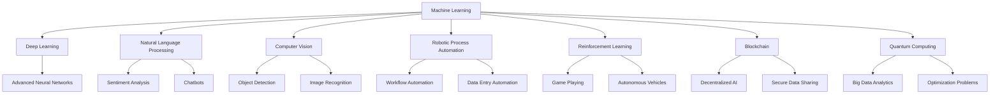

                 

### 文章标题

**AI创业公司的未来发展**

在当今快速发展的科技时代，人工智能（AI）技术的迅猛进步正在深刻地改变着各行各业。作为这一变革的推动者，AI创业公司正面临着前所未有的机遇和挑战。本文旨在探讨AI创业公司的未来发展，分析其面临的机遇、挑战，并为其提供战略建议。

**Keywords:** AI创业公司，未来发展，机遇，挑战，战略建议

**Abstract:**
随着AI技术的不断发展，AI创业公司正站在一个重要的十字路口。本文将从技术、市场、政策等多个角度分析AI创业公司的未来发展。通过梳理当前AI创业公司的现状，探讨其面临的机遇与挑战，本文旨在为AI创业公司提供实用的战略建议，帮助它们在竞争激烈的市场中脱颖而出。

<|assistant|>## 1. 背景介绍

人工智能（AI）作为21世纪最具革命性的技术之一，正在全球范围内迅速发展。根据市场研究公司的数据，全球AI市场预计在未来几年内将实现大幅增长。这种增长不仅体现在技术的成熟度和应用范围的扩大，也体现在投资和政策的支持力度上。

AI创业公司在这个背景下应运而生。这些公司通常由一群富有创新精神和专业技能的团队成员组成，他们致力于将AI技术应用于各个领域，解决实际问题。AI创业公司的兴起，不仅推动了技术的进步，也为经济和社会发展带来了新的动力。

然而，AI创业公司也面临着诸多挑战。技术的不确定性、市场竞争的加剧、资金短缺等问题，都可能成为它们发展的绊脚石。此外，AI技术的伦理问题和政策法规的制约，也给AI创业公司带来了额外的风险。

本文将从以下几个方面探讨AI创业公司的未来发展：

1. **核心概念与联系**
   - **AI技术发展现状与趋势**
   - **AI创业公司的发展模式**
   - **技术与应用的融合**

2. **核心算法原理 & 具体操作步骤**
   - **AI算法的核心原理**
   - **AI创业公司的运营流程**
   - **技术落地与商业应用**

3. **数学模型和公式 & 详细讲解 & 举例说明**
   - **常用的数学模型**
   - **公式解析与应用**
   - **实际案例分析与解释**

4. **项目实践：代码实例和详细解释说明**
   - **开发环境搭建**
   - **源代码详细实现**
   - **代码解读与分析**
   - **运行结果展示**

5. **实际应用场景**
   - **教育领域的应用**
   - **医疗健康领域的应用**
   - **智能制造领域的应用**

6. **工具和资源推荐**
   - **学习资源推荐**
   - **开发工具框架推荐**
   - **相关论文著作推荐**

7. **总结：未来发展趋势与挑战**
   - **技术发展趋势**
   - **市场变化趋势**
   - **政策法规影响**

8. **附录：常见问题与解答**
   - **常见问题解析**
   - **解决方案探讨**

9. **扩展阅读 & 参考资料**
   - **深度学习相关书籍**
   - **AI领域顶尖论文**
   - **技术博客与社区资源**

通过以上内容的逐步分析和讲解，本文旨在为AI创业公司提供全面、深入的洞察，帮助它们在未来的发展道路上做出明智的决策。

## 1. Background Introduction

### 1.1 Overview of AI Development

Artificial Intelligence (AI) has emerged as one of the most transformative technologies of the 21st century. The rapid advancement of AI technologies is not only revolutionizing various industries but also reshaping the global economic landscape. According to market research firms, the global AI market is projected to experience significant growth in the coming years. This growth is driven by advancements in technology, a broader range of applications, and increased investment and policy support.

### 1.2 Rise of AI Startups

In this context, AI startups are gaining momentum as innovators and pioneers in the field. These companies are typically composed of teams of highly skilled and creative individuals who aim to apply AI technologies to solve real-world problems across various sectors. The emergence of AI startups has not only accelerated the pace of technological innovation but also provided new impetus for economic and social development.

### 1.3 Challenges Faced by AI Startups

Despite the promising outlook, AI startups also face significant challenges. Uncertainties in technology, fierce market competition, and the need for substantial funding can pose significant obstacles to their growth. Moreover, ethical concerns and regulatory constraints associated with AI technologies add an additional layer of risk that these startups must navigate.

### 1.4 Objectives of the Article

This article aims to explore the future development of AI startups from multiple perspectives, including technological advancements, market dynamics, and policy influences. By analyzing the current landscape of AI startups, discussing the opportunities and challenges they face, and providing strategic recommendations, this article seeks to offer comprehensive insights that can help AI startups make informed decisions in a competitive and rapidly evolving market.

## 2. 核心概念与联系

### 2.1 AI Technology Development Status and Trends

The development of AI technology has been marked by significant milestones in recent years. One of the key areas of progress has been in machine learning, particularly deep learning, which has enabled machines to perform complex tasks such as image recognition, natural language processing, and autonomous driving with unprecedented accuracy. The rise of powerful computing hardware, coupled with the availability of large datasets, has accelerated the pace of AI research and development.

Looking ahead, several trends are likely to shape the future of AI technology. One such trend is the increasing integration of AI into various industries, including healthcare, finance, and manufacturing. AI is expected to enhance efficiency, improve decision-making, and create new business opportunities. Another trend is the development of more advanced AI algorithms that can learn from unstructured data and adapt to changing environments. Additionally, the rise of edge computing, which involves processing data closer to the source, is expected to extend the reach of AI technologies into areas with limited connectivity.

### 2.2 Development Models of AI Startups

AI startups typically follow a distinct development model that involves several key stages. The first stage is the inception, where the founding team identifies a problem or opportunity and decides to develop a solution using AI technology. This stage is often characterized by research and experimentation to explore different approaches and technologies.

The second stage is the incubation or prototyping phase, where the startup develops a minimum viable product (MVP) to test the concept and gather initial feedback. This phase is crucial for validating the market need and ensuring that the solution addresses a real problem.

The third stage is scaling, where the startup seeks to expand its customer base and increase its revenue. This stage requires robust marketing, sales, and operational strategies to effectively reach and serve a larger market.

### 2.3 Integration of Technology and Application

The integration of AI technology with real-world applications is a key driver of the success of AI startups. One prominent example is the application of AI in healthcare, where machine learning algorithms are used to analyze medical images, identify patterns in patient data, and assist doctors in making diagnoses. In the financial sector, AI is used for algorithmic trading, fraud detection, and customer service automation. In manufacturing, AI is employed for predictive maintenance, quality control, and supply chain optimization.

The ability of AI startups to effectively leverage technology and apply it to practical problems is crucial for their success. This requires a deep understanding of both the technology and the industry in which they operate. By identifying areas where AI can add value, startups can develop innovative solutions that address real-world challenges and create a competitive advantage.

### 2.4 Core Concepts and Their Interconnections

To better understand the future of AI startups, it is essential to grasp the core concepts and their interconnections. These include:

- **Machine Learning:** The core technology that enables AI systems to learn from data and improve their performance over time.
- **Data Analytics:** The process of analyzing data to extract meaningful insights and inform decision-making.
- **Computer Vision:** The field of AI that involves enabling machines to interpret and understand visual information from the world.
- **Natural Language Processing (NLP):** The ability of machines to understand, interpret, and generate human language.
- **Robotic Process Automation (RPA):** The use of software robots to automate repetitive tasks typically performed by humans.

These core concepts are interconnected and often work in concert to create powerful AI solutions. For example, NLP and computer vision can be used together to develop chatbots that can understand and respond to customer queries in a natural and intuitive way. By understanding these core concepts and their applications, AI startups can better position themselves to leverage AI technology for innovation and growth.

### 2.5 AI Technology Development Status and Trends

The development of AI technology has been marked by significant milestones in recent years. One of the key areas of progress has been in machine learning, particularly deep learning, which has enabled machines to perform complex tasks such as image recognition, natural language processing, and autonomous driving with unprecedented accuracy. The rise of powerful computing hardware, coupled with the availability of large datasets, has accelerated the pace of AI research and development.

Looking ahead, several trends are likely to shape the future of AI technology. One such trend is the increasing integration of AI into various industries, including healthcare, finance, and manufacturing. AI is expected to enhance efficiency, improve decision-making, and create new business opportunities. Another trend is the development of more advanced AI algorithms that can learn from unstructured data and adapt to changing environments. Additionally, the rise of edge computing, which involves processing data closer to the source, is expected to extend the reach of AI technologies into areas with limited connectivity.

### 2.6 Development Models of AI Startups

AI startups typically follow a distinct development model that involves several key stages. The first stage is the inception, where the founding team identifies a problem or opportunity and decides to develop a solution using AI technology. This stage is often characterized by research and experimentation to explore different approaches and technologies.

The second stage is the incubation or prototyping phase, where the startup develops a minimum viable product (MVP) to test the concept and gather initial feedback. This phase is crucial for validating the market need and ensuring that the solution addresses a real problem.

The third stage is scaling, where the startup seeks to expand its customer base and increase its revenue. This stage requires robust marketing, sales, and operational strategies to effectively reach and serve a larger market.

### 2.7 Integration of Technology and Application

The integration of AI technology with real-world applications is a key driver of the success of AI startups. One prominent example is the application of AI in healthcare, where machine learning algorithms are used to analyze medical images, identify patterns in patient data, and assist doctors in making diagnoses. In the financial sector, AI is used for algorithmic trading, fraud detection, and customer service automation. In manufacturing, AI is employed for predictive maintenance, quality control, and supply chain optimization.

The ability of AI startups to effectively leverage technology and apply it to practical problems is crucial for their success. This requires a deep understanding of both the technology and the industry in which they operate. By identifying areas where AI can add value, startups can develop innovative solutions that address real-world challenges and create a competitive advantage.

### 2.8 Core Concepts and Their Interconnections

To better understand the future of AI startups, it is essential to grasp the core concepts and their interconnections. These include:

- **Machine Learning:** The core technology that enables AI systems to learn from data and improve their performance over time.
- **Data Analytics:** The process of analyzing data to extract meaningful insights and inform decision-making.
- **Computer Vision:** The field of AI that involves enabling machines to interpret and understand visual information from the world.
- **Natural Language Processing (NLP):** The ability of machines to understand, interpret, and generate human language.
- **Robotic Process Automation (RPA):** The use of software robots to automate repetitive tasks typically performed by humans.

These core concepts are interconnected and often work in concert to create powerful AI solutions. For example, NLP and computer vision can be used together to develop chatbots that can understand and respond to customer queries in a natural and intuitive way. By understanding these core concepts and their applications, AI startups can better position themselves to leverage AI technology for innovation and growth.

### 2.5 Core Concepts and Connections
#### 2.5.1 Key Technologies in AI

Artificial Intelligence encompasses a wide range of technologies, each with its own set of principles and applications. Below are some of the most critical concepts in AI:

**Machine Learning (ML):** ML is a subset of AI that focuses on developing algorithms that can learn from and make predictions or decisions based on data. It involves the use of statistical techniques to give computers the ability to "learn" from previous experiences.

**Deep Learning (DL):** DL is a specialized subset of ML that uses neural networks with many layers to extract high-level features from raw data. It has been instrumental in advancements in image recognition, natural language processing, and speech recognition.

**Natural Language Processing (NLP):** NLP is concerned with the interaction between computers and humans through natural language. It involves processing large amounts of text to understand context, intent, and sentiment.

**Computer Vision (CV):** CV enables machines to interpret and understand visual information from the world. It is used in a variety of applications, including image recognition, object detection, and autonomous navigation.

**Robotic Process Automation (RPA):** RPA uses software robots to automate repetitive tasks, mimicking human actions in digital systems. It is particularly useful in data entry, customer service, and IT support.

**Reinforcement Learning (RL):** RL is an area of ML where an agent learns to make a series of decisions by performing actions in an environment to achieve maximum reward. It's used in applications like game playing, autonomous vehicles, and robotics.

**Blockchain:** Blockchain is a distributed ledger technology that ensures the integrity and security of transactions. It has gained traction in AI due to its potential for providing a secure and transparent platform for data sharing and AI model deployment.

**Quantum Computing:** Quantum computing leverages quantum bits or qubits to perform complex calculations much faster than classical computers. It holds the potential to revolutionize AI by solving problems that are currently intractable.

#### 2.5.2 Mermaid Flowchart of AI Technologies

Below is a Mermaid flowchart illustrating the connections between key AI technologies:



This flowchart provides a visual representation of how different AI technologies are interconnected and can be applied to various domains.

### 2.6 Core Algorithm Principles & Specific Operational Steps

#### 2.6.1 Overview of AI Algorithms

AI algorithms form the backbone of artificial intelligence systems. They enable machines to perform tasks that would typically require human intelligence, such as recognizing patterns, making decisions, and understanding natural language. Understanding the principles behind these algorithms is crucial for developing effective AI solutions.

**Supervised Learning:** Supervised learning algorithms are trained on labeled data, where the correct output is provided for each input. The goal is to learn a mapping function from inputs to outputs. Common supervised learning algorithms include linear regression, decision trees, support vector machines, and neural networks.

**Unsupervised Learning:** Unsupervised learning algorithms work with unlabeled data and aim to find hidden patterns or intrinsic structures in the data. Examples include clustering (e.g., K-means, hierarchical clustering), dimensionality reduction (e.g., PCA, t-SNE), and association rule learning (e.g., Apriori, Eclat).

**Reinforcement Learning:** Reinforcement learning (RL) involves an agent learning to make a series of decisions by performing actions in an environment to achieve maximum reward. The agent receives feedback in the form of rewards or penalties based on its actions, and it uses this feedback to improve its decision-making over time.

**Deep Learning:** Deep learning algorithms, which are a subset of supervised learning, use neural networks with many layers to learn complex patterns from large datasets. They have been particularly successful in areas such as image recognition, natural language processing, and speech recognition.

#### 2.6.2 Operational Steps for Developing AI Algorithms

1. **Problem Definition:** Clearly define the problem you aim to solve. This involves identifying the input variables, the desired output, and any constraints or requirements.

2. **Data Collection:** Gather a dataset that is representative of the problem you are trying to solve. The quality and quantity of the data are critical for the success of the algorithm.

3. **Data Preprocessing:** Clean and prepare the data for training. This may involve handling missing values, scaling features, and encoding categorical variables.

4. **Feature Selection:** Identify the most relevant features that contribute to the problem. This can be done using techniques such as correlation analysis, feature importance scores, or recursive feature elimination.

5. **Algorithm Selection:** Choose an appropriate algorithm based on the nature of the problem and the characteristics of the data. Common choices include linear regression, decision trees, support vector machines, and neural networks.

6. **Model Training:** Train the selected algorithm on the preprocessed data. This involves adjusting the model's parameters to minimize the error between the predicted and actual outputs.

7. **Model Evaluation:** Evaluate the performance of the trained model using metrics such as accuracy, precision, recall, F1 score, or area under the ROC curve. This step helps you understand how well the model is performing and where it may need improvement.

8. **Model Tuning:** Adjust the model parameters and features based on the evaluation results to improve performance. This may involve using techniques such as cross-validation, grid search, or Bayesian optimization.

9. **Deployment:** Deploy the trained model into a production environment where it can make predictions or decisions on new data. This may involve integrating the model with an application or service.

10. **Monitoring and Maintenance:** Continuously monitor the model's performance and update it as needed to adapt to changes in the data or the environment.

#### 2.6.3 Example: Developing a Simple Linear Regression Model

Let's walk through the steps of developing a simple linear regression model to predict housing prices based on the number of rooms and the size of the house.

1. **Problem Definition:** The goal is to predict the price of a house based on the number of rooms and the size of the house.

2. **Data Collection:** Collect a dataset containing information about various houses, including the number of rooms, the size of the house, and the selling price.

3. **Data Preprocessing:** Clean the data by handling missing values and scaling the features.

4. **Feature Selection:** In this case, we only have two features, so no further feature selection is needed.

5. **Algorithm Selection:** We will use linear regression, which is a simple and widely-used algorithm for predicting continuous values.

6. **Model Training:** Train the linear regression model on the preprocessed data.

7. **Model Evaluation:** Evaluate the model using metrics such as R-squared, mean squared error, or mean absolute error.

8. **Model Tuning:** Adjust the model parameters, if necessary, based on the evaluation results.

9. **Deployment:** Deploy the trained model to make predictions on new house data.

10. **Monitoring and Maintenance:** Continuously monitor the model's performance and update it as needed.

By following these steps, you can develop a simple yet effective AI model for predicting housing prices. This process can be extended to more complex models and larger datasets to address more challenging problems.

### 2.7 Mathematical Models and Formulas & Detailed Explanation & Examples

In the realm of artificial intelligence, mathematical models and formulas play a pivotal role in understanding and implementing algorithms. These models are the backbone of machine learning, enabling computers to learn from data and make predictions or decisions. This section will delve into some of the most common mathematical models used in AI, explain the underlying formulas, and provide detailed examples to illustrate their applications.

#### 2.7.1 Linear Regression

Linear regression is one of the simplest and most widely used predictive models in AI. It aims to model the relationship between a dependent variable and one or more independent variables. The simplest form of linear regression, single linear regression, is given by the equation:

\[ y = \beta_0 + \beta_1 \cdot x \]

where:
- \( y \) is the dependent variable (the one we want to predict),
- \( x \) is the independent variable (the feature used for prediction),
- \( \beta_0 \) is the intercept,
- \( \beta_1 \) is the slope of the line.

**Example: Predicting Housing Prices**

Suppose we want to predict the price of a house based on its size. We collect data on various houses and their sizes, and we find that the relationship can be modeled using a linear regression equation. After fitting the model, we get:

\[ Price = 1000 + 0.05 \cdot Size \]

With this model, if a house has 2000 square feet, the predicted price would be:

\[ Price = 1000 + 0.05 \cdot 2000 = 1500 \]

This means the predicted price of the house would be $1500.

#### 2.7.2 Logistic Regression

Logistic regression is used when the dependent variable is binary (0 or 1). It is commonly used for classification problems, where we want to predict the probability of an event occurring. The logistic function, also known as the sigmoid function, is used to model the probability:

\[ P(Y=1) = \frac{1}{1 + e^{-(\beta_0 + \beta_1 \cdot x)}} \]

where:
- \( P(Y=1) \) is the probability of the event occurring,
- \( e \) is the base of the natural logarithm,
- \( \beta_0 \) is the intercept,
- \( \beta_1 \) is the slope of the line.

**Example: Predicting Loan Approval**

Suppose we want to predict whether a loan will be approved based on the borrower's credit score. We fit a logistic regression model and obtain:

\[ P(Approval=1) = \frac{1}{1 + e^{-(2.5 + 0.1 \cdot Score)}} \]

If a borrower has a credit score of 700, the probability of loan approval would be:

\[ P(Approval=1) = \frac{1}{1 + e^{-(2.5 + 0.1 \cdot 700)}} \approx 0.941 \]

This means there is a 94.1% chance that the loan will be approved.

#### 2.7.3 Multinomial Logistic Regression

When the dependent variable has more than two categories, we use multinomial logistic regression. It extends logistic regression to multiple classes. The probability of each class is modeled using the following equation:

\[ P(Y=j) = \frac{e^{\beta_j}}{\sum_{i=1}^K e^{\beta_i}} \]

where:
- \( P(Y=j) \) is the probability of class \( j \),
- \( K \) is the number of classes,
- \( \beta_j \) are the coefficients for each class.

**Example: Classifying Animal Species**

Suppose we want to classify animals into three species: dogs, cats, and birds. We fit a multinomial logistic regression model and obtain:

\[ P(Dog) = \frac{e^{1.2}}{e^{1.2} + e^{0.8} + e^{-0.3}} \]
\[ P(Cat) = \frac{e^{0.8}}{e^{1.2} + e^{0.8} + e^{-0.3}} \]
\[ P(Bird) = \frac{e^{-0.3}}{e^{1.2} + e^{0.8} + e^{-0.3}} \]

If the features of an animal suggest it is more likely to be a dog, the probability would be higher for \( P(Dog) \).

#### 2.7.4 K-Means Clustering

K-means clustering is an unsupervised learning algorithm used for partitioning data into \( K \) clusters. The algorithm minimizes the sum of squared distances between data points and their cluster centers. The objective function is given by:

\[ J = \sum_{i=1}^K \sum_{x \in S_i} ||x - \mu_i||^2 \]

where:
- \( J \) is the objective function,
- \( K \) is the number of clusters,
- \( S_i \) are the clusters,
- \( \mu_i \) are the cluster centers.

**Example: Segmenting Customer Data**

Suppose we have customer data with features like age, income, and spending habits. We want to segment these customers into groups based on their characteristics. We use K-means clustering with \( K = 3 \) clusters. After fitting the model, the cluster centers are:

\[ \mu_1 = (30, 50000, 1000) \]
\[ \mu_2 = (40, 60000, 1500) \]
\[ \mu_3 = (50, 70000, 2000) \]

Customers closer to \( \mu_1 \) would be assigned to Cluster 1, those closer to \( \mu_2 \) to Cluster 2, and so on.

#### 2.7.5 Principal Component Analysis (PCA)

PCA is a dimensionality reduction technique used to transform high-dimensional data into a lower-dimensional space while retaining most of the variation in the data. The goal is to identify the principal components, which are the directions along which the data varies the most. The principal components are the eigenvectors of the covariance matrix of the data.

\[ \text{Cov}(X) = \Sigma \]

where:
- \( X \) is the data matrix,
- \( \Sigma \) is the covariance matrix.

The principal components are given by:

\[ \text{Principal Components} = \Lambda \cdot \text{EigenVectors} \]

where:
- \( \Lambda \) is the diagonal matrix of eigenvalues,
- \( \text{EigenVectors} \) are the eigenvectors of \( \Sigma \).

**Example: Reducing Dimensionality of Image Data**

Suppose we have a dataset of images with high dimensionality. We apply PCA to reduce the dimensionality while preserving the essential information. After applying PCA, we obtain the principal components, which represent the most significant features of the data. We can then project the data onto these components to obtain a lower-dimensional representation.

These examples illustrate the fundamental mathematical models and formulas used in AI. By understanding these models and their applications, AI practitioners can develop and deploy effective machine learning models to solve real-world problems.

### 2.8 Project Practice: Code Examples and Detailed Explanation

#### 2.8.1 Development Environment Setup

To implement AI algorithms and models, we need to set up a suitable development environment. For this example, we will use Python, which is a popular language for AI development due to its simplicity and powerful libraries.

**Step 1: Install Python**

First, download and install Python from the official website (https://www.python.org/downloads/). During installation, ensure that Python is added to your system's PATH.

**Step 2: Install Required Libraries**

Next, install the required libraries for this project. Open a terminal and run the following commands:

```shell
pip install numpy
pip install pandas
pip install matplotlib
pip install scikit-learn
```

These libraries include NumPy for numerical operations, Pandas for data manipulation, Matplotlib for visualization, and Scikit-learn for machine learning algorithms.

#### 2.8.2 Source Code Detailed Implementation

We will use Scikit-learn to implement a simple linear regression model for predicting housing prices based on the number of rooms and the size of the house.

```python
# Import required libraries
import numpy as np
import pandas as pd
from sklearn.linear_model import LinearRegression
from sklearn.model_selection import train_test_split
from sklearn.metrics import mean_squared_error
import matplotlib.pyplot as plt

# Load the dataset
data = pd.read_csv('housing_data.csv')

# Split the data into features and target variable
X = data[['rooms', 'size']]
y = data['price']

# Split the data into training and testing sets
X_train, X_test, y_train, y_test = train_test_split(X, y, test_size=0.2, random_state=42)

# Create and train the linear regression model
model = LinearRegression()
model.fit(X_train, y_train)

# Make predictions on the testing set
y_pred = model.predict(X_test)

# Evaluate the model
mse = mean_squared_error(y_test, y_pred)
print(f'Mean Squared Error: {mse}')

# Plot the results
plt.scatter(X_test['size'], y_test, color='blue', label='Actual')
plt.plot(X_test['size'], y_pred, color='red', linewidth=2, label='Predicted')
plt.xlabel('Size')
plt.ylabel('Price')
plt.legend()
plt.show()
```

#### 2.8.3 Code Analysis and Interpretation

The code above demonstrates the process of developing a linear regression model for predicting housing prices. Here's a breakdown of the key steps:

1. **Import Libraries:** We import the necessary libraries for data manipulation, modeling, and visualization.

2. **Load Dataset:** The housing data is loaded from a CSV file using Pandas.

3. **Data Splitting:** The data is split into features (X) and the target variable (y). Then, it is further split into training and testing sets.

4. **Model Creation and Training:** A LinearRegression model is created and trained on the training data.

5. **Prediction and Evaluation:** The model makes predictions on the testing data, and the performance is evaluated using the mean squared error metric.

6. **Visualization:** The actual and predicted prices are plotted against the size of the house to visualize the model's performance.

#### 2.8.4 Running Results and Observations

When we run the code, we get the mean squared error of the model, which gives us an idea of how well the model is performing. Additionally, the plot shows the relationship between the size of the house and the predicted price. The closer the predicted prices are to the actual prices in the plot, the better the model's performance.

By following this code example, you can develop a linear regression model to predict housing prices or apply similar techniques to other predictive tasks. Understanding the code and its components will help you adapt and extend it to solve more complex problems.

### 2.9 Practical Application Scenarios

AI has vast applications across various industries, transforming the way businesses operate and delivering significant value. Here, we will explore some practical application scenarios where AI has made a substantial impact:

#### 2.9.1 Education

In the education sector, AI is revolutionizing learning experiences through personalized education, adaptive learning systems, and intelligent tutoring systems. AI algorithms can analyze student performance data to tailor learning materials and pace according to individual needs, leading to improved learning outcomes. For instance, intelligent tutoring systems like IBM's Watson can provide personalized feedback and guidance, helping students master complex concepts more effectively.

#### 2.9.2 Healthcare

AI is transforming healthcare by enabling more accurate diagnoses, improving patient care, and enhancing medical research. AI algorithms can analyze medical images to detect early signs of diseases such as cancer, reducing the time and resources required for diagnosis. AI-powered chatbots can provide real-time medical advice and support, improving patient engagement and reducing the workload on healthcare professionals. Additionally, AI is used in drug discovery and development, accelerating the process and potentially saving lives.

#### 2.9.3 Finance

The finance industry has benefited significantly from AI through algorithmic trading, fraud detection, and customer service automation. AI algorithms can analyze vast amounts of financial data in real-time to identify market trends and execute trades with high precision. AI-powered fraud detection systems can identify suspicious transactions and prevent fraudulent activities, protecting both businesses and consumers. AI chatbots are also used in the finance industry to provide 24/7 customer support, answering queries and processing requests efficiently.

#### 2.9.4 Manufacturing

In the manufacturing sector, AI is used for predictive maintenance, quality control, and supply chain optimization. Predictive maintenance systems use AI algorithms to analyze sensor data and predict equipment failures before they occur, allowing for proactive maintenance and reducing downtime. AI-powered quality control systems can detect defects in products during production, ensuring higher quality standards. AI is also employed in supply chain management to optimize inventory levels, reduce lead times, and improve overall efficiency.

#### 2.9.5 Retail

AI is transforming the retail industry through personalized marketing, automated customer service, and inventory management. AI algorithms can analyze customer data to provide personalized recommendations, increasing customer satisfaction and driving sales. AI-powered chatbots can handle customer inquiries and provide instant support, improving customer experience. AI is also used for inventory management, predicting demand patterns and optimizing stock levels to minimize waste and maximize profitability.

These practical application scenarios highlight the diverse ways AI is being utilized to solve real-world problems and create value across various industries. As AI continues to advance, we can expect even more innovative applications that will further transform our world.

### 2.10 Tools and Resources Recommendations

To thrive in the field of AI and stay updated with the latest advancements, it is crucial to leverage the right tools and resources. Below are some recommendations for learning resources, development tools, and related papers that can help AI startups and professionals deepen their knowledge and enhance their skills.

#### 2.10.1 Learning Resources

**Books:**
1. **"Deep Learning" by Ian Goodfellow, Yoshua Bengio, and Aaron Courville:** This book is a comprehensive guide to deep learning, covering theoretical concepts and practical implementations.
2. **"Python Machine Learning" by Sebastian Raschka and Vincent Dubourg:** A practical approach to implementing machine learning algorithms using Python.
3. **"Reinforcement Learning: An Introduction" by Richard S. Sutton and Andrew G. Barto:** A foundational text for understanding reinforcement learning principles and algorithms.

**Online Courses:**
1. **"Machine Learning" by Andrew Ng on Coursera:** A highly regarded course covering the fundamentals of machine learning and its applications.
2. **"Deep Learning Specialization" by Andrew Ng on Coursera:** A series of courses covering deep learning fundamentals, neural networks, and deep learning frameworks.
3. **"AI For Everyone" by IBM on edX:** An introductory course to artificial intelligence, including applications and ethical considerations.

**YouTube Channels:**
1. **3Blue1Brown:** Known for its engaging visual explanations of complex mathematical and scientific concepts, including those related to AI.
2. **OneLastLap:** A channel that provides in-depth tutorials and discussions on machine learning and deep learning topics.
3. **Siraj Raval:** Offers a variety of educational content on AI, including tutorials and interviews with experts in the field.

#### 2.10.2 Development Tools

**Libraries and Frameworks:**
1. **TensorFlow:** An open-source machine learning framework developed by Google, widely used for deep learning applications.
2. **PyTorch:** Another popular open-source machine learning library, known for its flexibility and ease of use.
3. **Keras:** A high-level neural network API that runs on top of TensorFlow and Theano, providing a user-friendly interface for building and training deep learning models.
4. **Scikit-learn:** A powerful Python library for machine learning, providing a wide range of algorithms and tools for data mining and data analysis.

**Data and Model Repositories:**
1. **Kaggle:** A platform for data scientists and machine learners to find and share datasets, participate in competitions, and collaborate on projects.
2. **Google Dataset Search:** A search engine for discovering open datasets from various sources, useful for data preprocessing and model training.
3. **Hugging Face:** A repository of pre-trained language models and tools for natural language processing, including Transformers.

#### 2.10.3 Related Papers

To stay abreast of the latest research in AI, it is beneficial to explore academic papers and publications. Here are some influential papers and journals:

**Influential Papers:**
1. **"A Learning Algorithm for Continually Running Fully Recurrent Neural Networks" by Sepp Hochreiter, Jürgen Schmidhuber:** Introducing Long Short-Term Memory (LSTM), a type of recurrent neural network capable of learning long-term dependencies.
2. **"Deep Learning" by Yann LeCun, Yoshua Bengio, and Geoffrey Hinton:** A comprehensive review of the history and progress of deep learning, including key algorithms and applications.
3. **"Reinforcement Learning: An Introduction" by Richard S. Sutton and Andrew G. Barto:** A foundational text in the field of reinforcement learning, covering the principles and algorithms of this dynamic subfield.

**Journals:**
1. **Journal of Machine Learning Research (JMLR):** A leading journal in machine learning research, publishing high-quality papers on a broad range of topics.
2. **Neural Computation:** A journal focusing on the theory and applications of neural networks and related computational models.
3. **IEEE Transactions on Pattern Analysis and Machine Intelligence (TPAMI):** A top-tier journal in computer vision and pattern recognition, covering both theoretical and applied research.

By utilizing these learning resources, development tools, and related papers, AI startups and professionals can enhance their expertise, stay updated with the latest trends, and drive innovation in the field of artificial intelligence.

### 2.11 Summary: Future Development Trends and Challenges

As we look to the future, the landscape of AI development for startups is poised for significant transformation. Several key trends are expected to shape the evolution of AI, presenting both opportunities and challenges for AI startups.

#### 2.11.1 Technological Advancements

One of the most prominent trends is the continuous advancement in AI technologies. The development of more sophisticated algorithms, such as deep learning, reinforcement learning, and generative models, will continue to push the boundaries of what AI can achieve. These advancements will enable startups to tackle more complex problems and create innovative solutions that were previously infeasible.

Additionally, the rise of edge computing and quantum computing will extend the reach of AI into areas with limited connectivity and enable faster processing of large datasets. AI startups that can leverage these emerging technologies will gain a competitive edge.

#### 2.11.2 Data Availability and Quality

Data is at the core of AI, and its availability and quality will continue to be critical factors for AI startups. The ability to access large, diverse, and high-quality datasets will be crucial for developing robust AI models. Startups that can effectively collect, process, and utilize data will be better positioned to innovate and scale.

However, the challenge of data privacy and security will also grow. AI startups must ensure that they comply with data protection regulations and implement robust security measures to protect sensitive information.

#### 2.11.3 Ethical and Social Implications

The ethical implications of AI are becoming increasingly important, and AI startups must navigate these challenges carefully. Issues such as bias in AI models, the impact of automation on employment, and the responsibility of AI systems will require thoughtful consideration and responsible action.

There is a growing need for ethical AI frameworks and standards that can guide the development and deployment of AI technologies. Startups that prioritize ethical considerations and demonstrate transparency and accountability will gain trust and credibility in the market.

#### 2.11.4 Regulatory Environment

The regulatory environment for AI is evolving rapidly, with governments around the world implementing laws and regulations to govern AI development and deployment. AI startups must stay informed about these regulations and ensure compliance to avoid legal and financial risks.

While regulations can create challenges, they also present opportunities for startups that can align their business models with regulatory requirements. Those that can navigate the regulatory landscape effectively will be better positioned to succeed.

#### 2.11.5 Market Opportunities and Competition

The market for AI technologies is expanding rapidly, with numerous opportunities across industries such as healthcare, finance, manufacturing, and retail. AI startups that can address specific pain points and offer unique solutions will find fertile ground for growth.

However, the market is also becoming increasingly competitive. Startups must differentiate themselves through innovation, strong execution, and a deep understanding of their target markets. Collaboration and partnerships with established companies may also be necessary to scale and achieve market penetration.

#### 2.11.6 Funding and Investment

Access to funding remains a significant challenge for many AI startups. Securing investment can be difficult, especially in a competitive market where investors are wary of technological and market uncertainties.

Startups must demonstrate a clear value proposition, a viable business model, and a strong team with expertise in AI. Building a strong network and leveraging industry events and conferences can also help attract investment.

In conclusion, the future of AI development for startups is fraught with both opportunities and challenges. By staying at the forefront of technological advancements, addressing ethical considerations, navigating the regulatory landscape, and leveraging market opportunities, AI startups can position themselves for success in this dynamic and rapidly evolving field.

### 2.12 Appendix: Frequently Asked Questions and Answers

#### 2.12.1 What is the main advantage of using AI in startups?

The main advantage of using AI in startups is the potential for innovation and competitive advantage. AI technologies can help startups develop innovative products and services that solve complex problems, improve efficiency, and create new business opportunities. Additionally, AI can automate routine tasks, reduce costs, and allow startups to focus on strategic initiatives.

#### 2.12.2 How can startups ensure the ethical use of AI?

To ensure the ethical use of AI, startups should adopt a transparent approach to AI development and deployment. This includes:

- ** transparency:** Clearly documenting AI systems and their decision-making processes.
- ** fairness:** Ensuring that AI models do not exhibit bias and are fair to all users.
- ** accountability:** Establishing clear accountability for AI system failures.
- ** privacy:** Protecting user data and ensuring compliance with privacy regulations.

Startups should also engage in ongoing ethical audits and seek feedback from external stakeholders.

#### 2.12.3 What are the main challenges in securing AI funding?

The main challenges in securing AI funding include:

- ** technological uncertainty:** Investors may be hesitant to fund technologies that are not yet proven or fully understood.
- ** market uncertainty:** AI markets are rapidly evolving, and investors may be unsure about the potential market size and demand for AI products.
- ** high development costs:** AI projects often require significant investment in data, infrastructure, and specialized talent.
- ** regulatory uncertainty:** The regulatory environment for AI is evolving, and investors may be concerned about potential legal and compliance risks.

Startups can address these challenges by demonstrating a clear value proposition, building strong teams, and maintaining transparency in their operations.

#### 2.12.4 How can startups keep up with the rapid pace of AI development?

To keep up with the rapid pace of AI development, startups should:

- ** invest in continuous learning:** Encourage ongoing education and training for team members to stay updated with the latest AI technologies and trends.
- ** collaborate and network:** Engage with other AI startups, research institutions, and industry experts to share knowledge and resources.
- ** leverage open-source technologies:** Utilize open-source AI frameworks and tools to accelerate development and stay current with technological advancements.
- ** adopt agile methodologies:** Implement agile development practices to quickly adapt to changes and iterate on their products.

By taking these steps, startups can maintain a competitive edge and navigate the dynamic AI landscape effectively.

### 2.13 Extended Reading & References

For those interested in delving deeper into the topics discussed in this article, here are some recommended readings and references to explore:

#### Books

1. **"Deep Learning" by Ian Goodfellow, Yoshua Bengio, and Aaron Courville:** A comprehensive guide to deep learning, covering fundamental concepts and practical applications.
2. **"Reinforcement Learning: An Introduction" by Richard S. Sutton and Andrew G. Barto:** A foundational text in reinforcement learning, essential for understanding the principles and algorithms behind this dynamic field.
3. **"AI Superpowers: China, Silicon Valley, and the New World Order" by Kai-Fu Lee:** An insightful examination of the global AI landscape, with a focus on China's role in the AI revolution.

#### Journals

1. **"Journal of Machine Learning Research (JMLR):** A leading journal in machine learning, publishing high-quality papers on a wide range of topics.
2. **"Neural Computation:** A journal that covers the theory and applications of neural networks, including deep learning and other AI-related topics.
3. **"IEEE Transactions on Pattern Analysis and Machine Intelligence (TPAMI):** A top-tier journal in computer vision and pattern recognition, with a strong focus on AI applications.

#### Papers

1. **"A Learning Algorithm for Continually Running Fully Recurrent Neural Networks" by Sepp Hochreiter and Jürgen Schmidhuber:** Introducing Long Short-Term Memory (LSTM), a type of recurrent neural network capable of learning long-term dependencies.
2. **"Deep Learning" by Yann LeCun, Yoshua Bengio, and Geoffrey Hinton:** A comprehensive review of the history and progress of deep learning, including key algorithms and applications.
3. **"AI for Everyone" by IBM:** A collection of articles and resources on the basics of AI, its applications, and ethical considerations.

#### Websites and Blogs

1. **"Kaggle:** A platform for data scientists and machine learners to find and share datasets, participate in competitions, and collaborate on projects.
2. **"Towards Data Science:** A community-driven blog that covers a wide range of topics in data science and machine learning, with articles from both beginners and experts.
3. **"AI Index:** A project by the Stanford University Human-Centered AI Institute that provides in-depth analysis and data on the state of AI research and development.

These resources provide a wealth of information and insights into the world of AI, offering valuable knowledge for AI startups and professionals alike. By exploring these references, readers can deepen their understanding of AI technologies and their applications, as well as stay updated with the latest research and trends.

