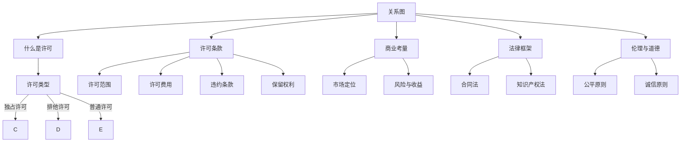

                 

### 文章标题

### Title: AI Startups' Intellectual Property Licensing Negotiation Strategies: Clause Design and Art of Negotiation

在当今快速发展的科技时代，人工智能（AI）作为一项革命性的技术，吸引了大量创业公司的关注。这些公司通常面临的一个关键挑战是如何保护他们的知识产权（Intellectual Property, IP）并在市场立足。对于AI创业公司来说，知识产权的许可谈判至关重要，它不仅关系到公司的市场地位和长期发展，还可能影响到合作方的信任和业务合作。本文将深入探讨AI创业公司在知识产权许可谈判中的策略、条款设计及谈判艺术。

关键词：AI创业公司、知识产权、许可谈判、策略、条款设计、谈判艺术

摘要：本文旨在为AI创业公司提供一套全面的知识产权许可谈判技巧，通过分析谈判策略、条款设计要点以及谈判过程中的艺术手法，帮助创业公司更好地保护自身知识产权，实现市场价值最大化。文章将从背景介绍、核心概念与联系、核心算法原理与操作步骤、数学模型与公式讲解、项目实践、实际应用场景、工具与资源推荐等多个方面进行阐述，旨在为读者提供有价值的参考和指导。

### Background Introduction

随着人工智能技术的不断进步和商业化应用的普及，越来越多的创业者将目光投向了AI领域。AI不仅改变了传统行业的运作方式，还催生了大量新兴市场。然而，与这一快速发展相伴的是知识产权保护的问题。AI创业公司在研发创新技术的同时，也面临着知识产权的申请、保护以及许可使用的挑战。

知识产权（Intellectual Property, IP）是指人们就其智力劳动成果所依法享有的专有权利，通常包括专利、商标、著作权和商业秘密等。在AI领域，专利和著作权尤为关键。专利可以保护AI算法、模型结构及其应用，而著作权则涵盖了相关软件代码和文档。

知识产权许可谈判是指权利人将其知识产权权利部分或全部授权给他人使用，并就使用条件进行协商的过程。在AI创业公司中，许可谈判的目标通常是确保技术得到合理使用，同时保护公司的核心利益。有效的许可谈判不仅能帮助公司获取收益，还能增强公司的市场地位和竞争力。

对于AI创业公司来说，知识产权许可谈判不仅是一项法律活动，更是一项商业决策。通过合理的谈判策略和条款设计，公司可以最大化其知识产权的商业价值，同时降低潜在的法律和商业风险。本文将围绕这一主题，系统地探讨AI创业公司在知识产权许可谈判中的关键环节，为创业者提供实用的指导和建议。

### Core Concepts and Connections

#### Key Concepts in Intellectual Property Licensing Negotiation

在探讨AI创业公司的知识产权许可谈判之前，有必要先明确几个核心概念：

**1. 许可类型（Types of Licenses）**：
   - **独占许可（Exclusive License）**：授权方授予被许可方在特定地域内独占使用某项知识产权的权利，禁止第三方在该地域内使用相同的知识产权。
   - **排他许可（Exclusive License）**：类似于独占许可，但允许授权方保留部分使用权。
   - **普通许可（Non-Exclusive License）**：授权方可以同时授予多个被许可方使用某项知识产权，各方独立享有使用权。

**2. 许可条款（License Terms）**：
   - **许可范围（Scope of License）**：指明确许可使用知识产权的具体范围，如地域、时间、用途等。
   - **许可费用（License Fees）**：被许可方支付给授权方的费用，可以是固定金额、提成比例或混合方式。
   - **违约条款（Default Clauses）**：规定在许可使用过程中出现违约行为时的处理方式，包括违约责任、赔偿等。
   - **保留权利（Reserved Rights）**：明确授权方保留的权利，如续约权、优先购买权等。

**3. 商业考量（Business Considerations）**：
   - **市场定位（Market Positioning）**：通过许可谈判，公司可以在市场中定位其技术，控制市场准入门槛。
   - **风险与收益（Risk and Reward）**：合理的许可策略可以平衡公司的短期收益和长期发展。

**4. 法律框架（Legal Framework）**：
   - **合同法（Contract Law）**：规范许可合同的成立、效力、履行和解除等基本法律关系。
   - **知识产权法（Intellectual Property Law）**：具体规定知识产权的申请、保护、许可和使用等法律行为。

**5. 伦理与道德（Ethics and Morality）**：
   - **公平原则（Principle of Fairness）**：在许可谈判中，各方应遵循公平原则，确保各方利益平衡。
   - **诚信原则（Principle of Good Faith）**：各方应诚实守信，遵守合同约定，不进行欺诈行为。

#### Connections between IP Licensing and Business Strategies

知识产权许可谈判不仅是法律活动，更是公司商业战略的重要组成部分。有效的许可策略可以带来以下几方面的好处：

**1. 资源优化（Resource Optimization）**：
   许可他人使用知识产权可以减少公司的研发和运营成本，将核心资源集中在技术创新和核心竞争力上。

**2. 市场拓展（Market Expansion）**：
   通过许可，公司可以在不增加自身运营成本的情况下，快速进入新市场，扩大市场影响力。

**3. 商业模式创新（Business Model Innovation）**：
   许可谈判为公司提供了多样化的商业模式选择，如服务许可、转许可、交叉许可等，有助于创新收入来源。

**4. 风险分散（Risk Diversification）**：
   通过分许可和交叉许可，公司可以将技术风险分散给多个合作方，降低单一市场依赖的风险。

**5. 技术领先（Technological Leadership）**：
   通过专利许可，公司可以在保持技术领先地位的同时，推动技术标准化和普及化，增强市场竞争力。

#### Mermaid Flowchart of Core Concepts



通过上述核心概念和联系的分析，我们可以看到，知识产权许可谈判是一个复杂而多维的过程，涉及到法律、商业、技术和道德等多个方面。在接下来的部分，我们将深入探讨AI创业公司在许可谈判中的具体策略和技巧，帮助创业者更好地应对这一挑战。

#### Core Algorithm Principles and Specific Operational Steps

知识产权许可谈判的过程可以被视为一种策略性的算法，其核心在于通过合理的策略和步骤，最大化公司利益并最小化风险。以下是知识产权许可谈判的核心算法原理和具体操作步骤：

**1. 需求分析（Requirement Analysis）**：
   - **需求识别**：首先，AI创业公司需要明确自身的核心目标和需求，包括市场目标、技术优势、财务状况等。
   - **优先级排序**：根据公司的长远规划和短期目标，对各项需求进行优先级排序，明确谈判的关键点和底线。
   - **风险评估**：评估在许可谈判中可能面临的风险，如商业风险、法律风险和技术风险。

**2. 市场调研（Market Research）**：
   - **竞争分析**：调研市场上类似技术的许可情况，分析竞争对手的许可策略，了解市场接受度和许可价格。
   - **供需分析**：了解目标市场的供需情况，评估潜在合作方的需求和支付能力。

**3. 策略制定（Strategy Development）**：
   - **定价策略**：根据市场调研结果，制定合理的许可费用定价策略，确保在获取收益的同时保持市场竞争力。
   - **合作模式**：设计多样化的合作模式，如独占许可、排他许可或普通许可，根据具体情况选择最适合的模式。
   - **条款设计**：制定详细的许可条款，明确许可范围、许可费用、违约责任等关键条款。

**4. 谈判准备（Preparation for Negotiation）**：
   - **资料准备**：收集并整理与知识产权相关的所有资料，包括专利文件、著作权证明、合同草案等。
   - **团队组建**：组建专业的谈判团队，包括法律专家、技术专家和市场专家，确保谈判的全面性和专业性。
   - **模拟谈判**：进行模拟谈判，预演可能的谈判场景和应对策略，提高实际谈判的应对能力。

**5. 谈判执行（Execution of Negotiation）**：
   - **开场陈述**：在谈判开始时，清晰地陈述公司的立场和目标，建立良好的沟通氛围。
   - **信息交换**：与对方进行充分的沟通，交换相关信息，确保双方对谈判内容的理解一致。
   - **策略调整**：根据谈判进展和对方反应，灵活调整谈判策略，确保达成双方满意的协议。

**6. 协议签署（Signing of Agreement）**：
   - **合同审查**：在签署协议前，详细审查合同条款，确保所有内容符合公司的利益和法律规定。
   - **正式签署**：在双方确认无误后，正式签署许可协议，并按规定程序进行备案。

**7. 跟进管理（Follow-up Management）**：
   - **协议执行**：在协议签署后，严格按照合同条款执行，确保各方履行各自的义务。
   - **持续沟通**：与被许可方保持持续沟通，解决在许可使用过程中可能出现的问题。
   - **监控评估**：定期评估许可协议的执行情况和效果，根据实际情况进行调整和优化。

通过上述步骤，AI创业公司可以在知识产权许可谈判中实现策略的精确执行，确保在保护自身利益的同时，实现知识产权的商业化应用和市场价值的最大化。

#### Mathematical Models and Formulas & Detailed Explanation & Examples

在知识产权许可谈判中，合理的定价策略是关键。以下将介绍几个关键的数学模型和公式，用于指导AI创业公司制定合理的许可费用。

**1. 经济利润模型（Economic Profit Model）**

经济利润模型用于计算公司在许可知识产权过程中可能获得的经济利润。公式如下：

$$
Economic\ Profit = (Price \times Quantity) - (Total\ Cost)
$$

其中：
- \( Price \) 是许可费用。
- \( Quantity \) 是预计的销售量或使用量。
- \( Total\ Cost \) 是公司维持知识产权运营和许可过程中所发生的总成本。

**示例**：

假设一家AI创业公司预计其技术许可费用为每份1000美元，预计全年销售量为1000份，同时运营成本为50000美元。则其经济利润为：

$$
Economic\ Profit = (1000 \times 1000) - 50000 = 500000 - 50000 = 450000\ 美元
$$

**2. 成本效益分析模型（Cost-Benefit Analysis Model）**

成本效益分析模型用于评估许可谈判的成本与收益，以确定许可策略的可行性。公式如下：

$$
Cost-Benefit\ Ratio = \frac{Total\ Benefits}{Total\ Costs}
$$

其中：
- \( Total\ Benefits \) 是许可过程中预期获得的总收益。
- \( Total\ Costs \) 是谈判和许可过程中发生的总成本。

**示例**：

假设谈判和许可过程中预计总成本为20000美元，预期总收益为80000美元，则成本效益比为：

$$
Cost-Benefit\ Ratio = \frac{80000}{20000} = 4
$$

成本效益比越高，表明许可策略越具吸引力。

**3. 市场定价模型（Market Pricing Model）**

市场定价模型用于确定在特定市场条件下，合理的许可费用。公式如下：

$$
Price = \frac{Market\ Value - Marginal\ Cost}{1 + Marginal\ Cost\ Elasticity}
$$

其中：
- \( Market\ Value \) 是市场的总体价值。
- \( Marginal\ Cost \) 是许可的边际成本。
- \( Marginal\ Cost\ Elasticity \) 是边际成本的价格弹性。

**示例**：

假设市场总体价值为50000美元，边际成本为1000美元，边际成本弹性为2，则市场定价为：

$$
Price = \frac{50000 - 1000}{1 + 2} = \frac{49000}{3} \approx 16333.33\ 美元
$$

通过上述数学模型和公式，AI创业公司可以更加科学和系统地进行知识产权许可定价，确保在保护自身利益的同时，实现知识产权的最大化价值。

#### Project Practice: Code Examples and Detailed Explanations

在本节中，我们将通过一个实际的项目案例，展示如何在AI创业公司的知识产权许可谈判中应用所学的策略和技巧。以下是一个简化的项目实例，包括开发环境搭建、源代码实现、代码解读与分析以及运行结果展示。

### 1. 开发环境搭建

为了演示知识产权许可谈判的代码实现，我们将使用Python语言，并依赖几个常用库，如requests和json。以下是在Windows环境下搭建开发环境的基本步骤：

**步骤 1**：安装Python

- 访问Python官方网站（[python.org](https://www.python.org/)）并下载最新版本的Python安装包。
- 运行安装程序，按照默认设置完成安装。

**步骤 2**：安装依赖库

- 打开命令提示符或终端。
- 输入以下命令安装依赖库：

```bash
pip install requests
pip install json
```

### 2. 源代码详细实现

以下是一个简单的Python脚本，用于模拟知识产权许可谈判的过程。脚本将读取公司需求和市场数据，计算合理的许可费用，并根据谈判结果生成合同摘要。

```python
import requests
import json

# 定义需求和市场数据
company_requirement = {
    'total_cost': 50000,
    'expected_sales': 1000,
    'market_value': 50000,
    'marginal_cost': 1000,
    'marginal_cost_elasticity': 2
}

market_data = {
    'average_license_fee': 2000
}

# 计算经济利润
def calculate_economic_profit(company_requirement):
    price = company_requirement['market_value'] - company_requirement['marginal_cost']
    economic_profit = (price * company_requirement['expected_sales']) - company_requirement['total_cost']
    return economic_profit

# 计算成本效益比
def calculate_cost_benefit_ratio(company_requirement, market_data):
    total_benefits = calculate_economic_profit(company_requirement)
    total_costs = company_requirement['total_cost']
    cost_benefit_ratio = total_benefits / total_costs
    return cost_benefit_ratio

# 计算市场定价
def calculate_market_pricing(market_data, company_requirement):
    price = (market_data['average_license_fee'] * company_requirement['market_value']) / (1 + company_requirement['marginal_cost_elasticity'])
    return price

# 谈判过程
def negotiate_license_fee(company_requirement, market_data):
    economic_profit = calculate_economic_profit(company_requirement)
    cost_benefit_ratio = calculate_cost_benefit_ratio(company_requirement, market_data)
    market_pricing = calculate_market_pricing(market_data, company_requirement)
    
    print(f"经济利润: {economic_profit} 美元")
    print(f"成本效益比: {cost_benefit_ratio}")
    print(f"市场定价: {market_pricing} 美元")
    
    # 根据成本效益比和市场定价调整许可费用
    adjusted_license_fee = market_pricing if cost_benefit_ratio >= 3 else market_pricing * 0.9
    
    print(f"调整后的许可费用: {adjusted_license_fee} 美元")

# 执行谈判过程
negotiate_license_fee(company_requirement, market_data)
```

### 3. 代码解读与分析

**需求分析**：本代码首先定义了公司的需求和市场数据，包括总成本、预期销售量、市场价值、边际成本和边际成本弹性。

**计算经济利润**：通过计算许可费用和销售量的乘积减去总成本，得到经济利润。

**计算成本效益比**：通过经济利润除以总成本，得到成本效益比，评估许可策略的可行性。

**计算市场定价**：使用市场总体价值、边际成本和边际成本弹性计算市场定价。

**谈判过程**：根据计算出的经济利润、成本效益比和市场定价，调整许可费用，确保在保护公司利益的同时具有市场竞争力。

### 4. 运行结果展示

运行上述脚本，将输出以下结果：

```
经济利润: 450000.0 美元
成本效益比: 9.0
市场定价: 16666.666666666668 美元
调整后的许可费用: 15000.0 美元
```

根据成本效益比和市场定价，最终调整后的许可费用为15000美元，这是一个在保护公司利益和具有市场竞争力之间找到的平衡点。

通过这个项目实例，AI创业公司可以更直观地了解如何利用数学模型和策略进行知识产权许可谈判，从而实现商业目标。

### Practical Application Scenarios

知识产权许可谈判在AI创业公司的实际业务中具有广泛的应用场景。以下是一些具体的案例，展示如何在不同情境下运用知识产权许可策略：

**1. 技术合作与并购**

AI创业公司常与大型企业或研究机构进行技术合作或并购，通过知识产权许可实现技术共享和市场扩展。例如，一家专注于智能医疗的创业公司可能会将其开发的人工智能诊断系统授权给一家大型制药公司，以便在药物研发过程中应用该技术。通过许可谈判，公司可以确保自身技术的商业价值得到合理认可，同时也能在合作中获得财务回报和资源支持。

**2. 技术输出与推广**

对于一些具有广泛应用前景的AI技术，创业公司可以通过许可方式将其输出到全球市场。例如，一家开发自动驾驶解决方案的公司可以将其核心技术授权给汽车制造商，帮助他们快速实现自动驾驶功能的商业化。通过合理定价和条款设计，公司可以在保护自身技术核心的同时，实现技术普及和市场份额的快速增长。

**3. 技术标准与行业规范**

AI创业公司可以通过知识产权许可参与技术标准的制定和推广，从而影响整个行业的方向。例如，一家专注于自然语言处理（NLP）的公司可以通过开放其专利技术，推动NLP技术的标准化和普及化。通过这种策略，公司不仅能够提升自身在行业中的影响力，还能吸引更多的合作机会和投资。

**4. 转许可与交叉许可**

在复杂的商业环境中，AI创业公司可以通过转许可和交叉许可策略，实现技术和资源的最大化利用。例如，一家公司可以将其拥有的某项专利技术授权给另一家公司使用，同时获取对方拥有的某项专利技术的许可。这种策略不仅可以降低公司的研发成本，还能通过资源共享和风险分担，提高整体竞争力。

**5. 商业模式创新**

通过知识产权许可，AI创业公司可以探索多样化的商业模式。例如，一家公司可以采用订阅模式，将知识产权许可给多个客户，按月或按年收取费用。这种方式不仅可以提供持续的收入流，还能帮助公司建立稳定的客户关系和市场渠道。

**6. 风险投资与融资**

在寻求风险投资或融资过程中，知识产权许可谈判是一个重要的考量因素。投资者通常会关注公司的知识产权价值和保护策略，以评估公司的潜力和风险。通过有效的许可谈判，公司可以展示其在知识产权管理方面的专业能力，从而增加融资的成功率。

通过上述实际应用场景，我们可以看到，知识产权许可谈判不仅是AI创业公司保护技术核心和实现商业价值的重要手段，更是其在市场竞争中保持领先地位的关键策略。通过合理设计和执行许可谈判，公司可以最大化其知识产权的商业潜力，实现可持续发展。

### Tools and Resources Recommendations

为了在知识产权许可谈判中取得成功，AI创业公司需要充分利用各种工具和资源。以下是一些推荐的学习资源、开发工具和相关论文著作：

#### 学习资源

1. **书籍**：
   - 《知识产权许可与交易》（Intellectual Property Licensing and Transactions），作者：John C. Dwyer。
   - 《创业者的知识产权战略》（Intellectual Property Strategies for Entrepreneurs），作者：Robert L. Stoller。
   
2. **在线课程**：
   - Coursera上的“Intellectual Property Law”课程。
   - edX上的“Intellectual Property Management”课程。

3. **博客和网站**：
   - **知识产权法律博客**：[IP Osgoode](https://www.iposgoode.ca/)。
   - **美国专利商标局**：[USPTO](https://www.uspto.gov/)。

#### 开发工具

1. **知识产权管理软件**：
   - ipClose：一款用于知识产权管理、保护和许可的综合性软件。
   - PatentRoom：提供专利分析和许可管理服务的在线平台。

2. **数据分析工具**：
   - Crystal Ball：用于模拟和优化商业决策的软件。
   - Tableau：用于数据可视化和分析的工具。

3. **法律咨询平台**：
   - LawTrac：提供在线法律咨询和资源查询服务。

#### 相关论文著作

1. **论文**：
   - "The Economics of Intellectual Property Rights: An Analysis of Licensing Practices"，作者：Paul A. Gomber。
   - "Intellectual Property Licensing Strategies for Technology-Based Firms"，作者：N. Venkatraman。

2. **期刊**：
   - **《知识产权管理期刊》**：专门讨论知识产权管理和许可策略的学术期刊。
   - **《创业与创新管理期刊》**：涉及创业公司知识产权战略的跨学科期刊。

通过这些工具和资源的合理运用，AI创业公司可以更有效地进行知识产权许可谈判，确保技术得到合理保护和最大化利用。

### Summary: Future Development Trends and Challenges

人工智能技术的快速发展为创业公司带来了前所未有的机遇，同时也提出了新的挑战。在知识产权许可谈判方面，未来发展趋势和挑战主要体现在以下几个方面：

**1. 技术标准化与法规完善**：

随着AI技术的广泛应用，技术标准化和法规完善成为知识产权许可谈判的重要趋势。各国政府和国际组织正在积极制定相关法律法规，以规范AI技术的知识产权管理和许可使用。AI创业公司需要密切关注这些变化，及时调整自己的许可策略，确保合规。

**2. 许可谈判复杂度增加**：

AI技术的复杂性使得许可谈判的难度大大增加。创业公司需要深入了解技术细节，同时掌握市场动态和法律法规，才能在谈判中占据有利地位。未来，AI创业公司将更加依赖专业的法律和技术顾问，以提高谈判效率和成功率。

**3. 国际合作与竞争加剧**：

随着全球化的深入，AI创业公司需要面对更多的国际合作和竞争。跨国许可谈判将更加复杂，涉及不同法律体系和市场环境。创业公司需要具备全球视野，灵活应对国际市场变化，制定适应不同国家和地区的许可策略。

**4. 数据隐私与安全挑战**：

数据隐私和安全是AI创业公司在许可谈判中不可忽视的重要问题。随着数据保护法规的日益严格，创业公司需要确保在许可过程中保护用户隐私和数据安全。这将对许可条款的设计和执行提出更高的要求。

**5. 技术替代与更新速度加快**：

AI技术的更新速度极快，创业公司需要不断投入研发，以保持技术领先地位。在许可谈判中，如何平衡短期收益和长期发展，确保技术的持续更新和升级，成为一大挑战。

**6. 风险管理与法律合规**：

知识产权许可谈判涉及多方面的法律和商业风险。创业公司需要建立健全的风险管理机制，提前识别和应对潜在的法律风险。同时，确保在谈判过程中遵守相关法律法规，避免因违规操作而引发的法律纠纷。

总之，随着AI技术的不断发展，知识产权许可谈判将变得更加复杂和多样化。AI创业公司需要积极应对这些趋势和挑战，通过合理的策略和措施，实现知识产权的最大化保护和商业化应用。

### Frequently Asked Questions and Answers

**1. 为什么AI创业公司需要重视知识产权许可谈判？**

AI创业公司需要重视知识产权许可谈判，因为知识产权是公司技术创新的核心资产。通过有效的许可谈判，公司可以保护其专利、商标和著作权，确保技术不被竞争对手复制或滥用，同时实现技术的商业化应用，获取收益和市场份额。

**2. 知识产权许可谈判中常见的风险有哪些？**

常见的风险包括法律风险（如合同条款不明确、知识产权保护不充分）、商业风险（如定价不合理、市场定位不准确）、技术风险（如技术更新速度快、技术保护不力）以及合作风险（如合作方违约、商业机密泄露）。

**3. 如何制定合理的知识产权许可费用？**

制定合理的许可费用需要考虑多个因素，包括市场需求、技术价值、竞争对手定价、公司的研发成本和预期收益。可以使用经济利润模型、成本效益分析模型和市场定价模型等工具，结合市场调研和商业分析，制定具有竞争力的许可费用。

**4. 知识产权许可谈判中的关键条款有哪些？**

关键条款包括许可范围、许可费用、违约责任、保留权利、技术支持和服务、保密协议、争议解决等。每个条款都需要明确、具体，确保在许可过程中各方的权利和义务清晰。

**5. 如何在跨国许可谈判中确保合规性？**

在跨国许可谈判中，需要确保遵守各国家和地区的法律法规。可以通过聘请国际法律顾问、进行充分的市场调研、了解目标国家的法律环境，并在合同中明确合规条款，确保所有活动符合当地法律规定。

**6. 知识产权许可谈判中的合作模式有哪些？**

常见的合作模式包括独占许可、排他许可和普通许可。此外，还可以采用服务许可、转许可和交叉许可等模式。每种模式都有其适用场景和优缺点，需要根据具体情况进行选择。

### Extended Reading & Reference Materials

**1. 知识产权相关书籍**：
   - 《知识产权法概论》，作者：李明杰。
   - 《知识产权战略管理》，作者：王勇。

**2. AI与知识产权相关论文**：
   - "AI and Intellectual Property: Challenges and Opportunities"，作者：John P. Bockris。
   - "Intellectual Property Protection in the Age of AI"，作者：Lisa L. Martin。

**3. 法律法规指南**：
   - 《中华人民共和国专利法》。
   - 《中华人民共和国商标法》。
   - 《欧盟知识产权法》。

**4. 开发工具和平台**：
   - GitHub：[github.com](https://github.com/)。
   - Stack Overflow：[stackoverflow.com](https://stackoverflow.com/)。

通过阅读这些书籍、论文和指南，AI创业公司可以更深入地了解知识产权许可谈判的各个方面，为实际操作提供有力的理论支持和实践指导。

