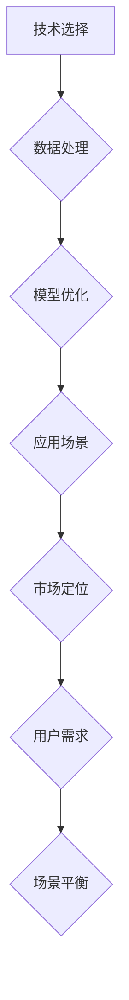

                 

# AI创业挑战：技术，应用与场景平衡

> 关键词：人工智能，创业挑战，技术平衡，应用场景

在当今快速发展的技术时代，人工智能（AI）已经成为推动创新和增长的关键力量。对于创业者来说，抓住AI技术带来的机遇，同时也面临诸多挑战。如何平衡技术、应用和场景，成为决定创业成功与否的关键因素。本文将深入探讨AI创业中的技术、应用与场景之间的平衡，提供实用的策略和案例。

## 1. 背景介绍

随着深度学习、神经网络等技术的突破，人工智能在各个领域展现出了巨大的潜力。无论是医疗、金融、教育还是制造业，AI的应用都带来了深刻的变革。然而，对于初创企业来说，如何在激烈的市场竞争中脱颖而出，如何将AI技术有效应用于实际场景，都是亟需解决的问题。

### 1.1 AI技术的现状与趋势

人工智能技术正以惊人的速度发展。深度学习模型如GPT-3等在自然语言处理领域取得了显著的成果，图像识别、语音识别等技术也取得了长足进步。然而，AI技术的发展并非一帆风顺。数据隐私、伦理问题、技术可靠性等挑战依然存在。

### 1.2 创业的挑战与机遇

创业本身就是一项充满风险和不确定性的事业。对于AI初创企业，一方面需要应对技术的不确定性，另一方面还需要在市场定位、资金筹集等方面克服困难。然而，正确把握AI技术的机遇，可以为创业企业带来巨大的市场价值。

## 2. 核心概念与联系

### 2.1 技术层面的平衡

在AI创业中，技术层面的平衡至关重要。这包括算法选择、数据处理、模型优化等方面。创业者需要根据业务需求选择合适的技术方案，同时确保技术方案的稳定性和可扩展性。

### 2.2 应用层面的平衡

AI技术的应用需要紧密结合实际场景。这意味着创业者需要深入理解目标市场，识别潜在的应用场景，并设计出能够解决实际问题的解决方案。应用层面的平衡要求创新与实用性相结合。

### 2.3 场景层面的平衡

场景层面的平衡涉及到如何在不同应用场景中平衡AI技术的部署。这包括如何在不同行业、不同市场之间进行资源分配，以及如何在不同用户群体中推广AI应用。

### 2.4 Mermaid流程图



## 3. 核心算法原理 & 具体操作步骤

### 3.1 数据预处理

数据预处理是AI应用的重要步骤。创业者需要收集、清洗和整合数据，确保数据的质量和一致性。具体操作步骤包括：

- 数据收集：使用API、爬虫等技术获取数据。
- 数据清洗：处理缺失值、异常值，确保数据的质量。
- 数据整合：将不同来源的数据进行整合，形成统一的数据集。

### 3.2 模型选择与训练

模型选择与训练是AI应用的核心。创业者需要根据业务需求选择合适的模型，并进行训练和优化。具体操作步骤包括：

- 模型选择：根据任务类型（如分类、回归等）选择合适的模型。
- 训练数据准备：准备训练数据和测试数据。
- 模型训练：使用训练数据进行模型训练。
- 模型优化：调整模型参数，提高模型性能。

### 3.3 应用部署

应用部署是将训练好的模型应用到实际场景的过程。创业者需要确保模型在目标环境中的稳定运行。具体操作步骤包括：

- 部署环境准备：准备部署所需的硬件和软件环境。
- 模型转换：将训练好的模型转换为部署环境可识别的格式。
- 应用集成：将模型集成到现有系统中。
- 性能监控：监控模型在应用中的性能，及时进行调整和优化。

## 4. 数学模型和公式 & 详细讲解 & 举例说明

### 4.1 深度学习模型

深度学习模型是AI创业中的核心。以下是一个简单的深度神经网络模型：

$$
\begin{aligned}
    &z_1 = W_1 \cdot x + b_1, \\
    &a_1 = \sigma(z_1), \\
    &z_2 = W_2 \cdot a_1 + b_2, \\
    &a_2 = \sigma(z_2).
\end{aligned}
$$

其中，$W_1$和$W_2$分别是权重矩阵，$b_1$和$b_2$分别是偏置项，$x$是输入数据，$\sigma$是激活函数。

### 4.2 优化算法

优化算法是提高模型性能的关键。以下是一个简单的梯度下降算法：

$$
\begin{aligned}
    &\theta_{t+1} = \theta_t - \alpha \cdot \nabla_\theta J(\theta), \\
    &J(\theta) = \frac{1}{m} \sum_{i=1}^m (h_\theta(x^{(i)}) - y^{(i)})^2,
\end{aligned}
$$

其中，$\theta$是模型参数，$\alpha$是学习率，$h_\theta(x)$是模型预测，$y^{(i)}$是真实标签。

### 4.3 举例说明

假设我们要构建一个简单的分类模型，输入数据是二维的，输出是一个类别标签。我们可以使用上述的深度神经网络模型进行训练。具体步骤如下：

1. 收集和预处理数据。
2. 设计模型结构，选择合适的激活函数和损失函数。
3. 使用梯度下降算法训练模型。
4. 在测试集上评估模型性能。

## 5. 项目实践：代码实例和详细解释说明

### 5.1 开发环境搭建

在开始项目实践之前，我们需要搭建一个适合AI开发的编程环境。以下是具体步骤：

1. 安装Python环境。
2. 安装深度学习框架，如TensorFlow或PyTorch。
3. 安装其他必要的库，如NumPy、Pandas等。

### 5.2 源代码详细实现

以下是一个简单的深度学习分类模型的实现：

```python
import tensorflow as tf
from tensorflow.keras.models import Sequential
from tensorflow.keras.layers import Dense, Flatten

# 数据预处理
# ...

# 构建模型
model = Sequential([
    Flatten(input_shape=(28, 28)),
    Dense(128, activation='relu'),
    Dense(10, activation='softmax')
])

# 编译模型
model.compile(optimizer='adam',
              loss='categorical_crossentropy',
              metrics=['accuracy'])

# 训练模型
model.fit(x_train, y_train, epochs=10, batch_size=32, validation_split=0.2)

# 评估模型
test_loss, test_acc = model.evaluate(x_test, y_test)
print(f"Test accuracy: {test_acc:.2f}")
```

### 5.3 代码解读与分析

上述代码实现了一个简单的分类模型，具体步骤如下：

1. 导入TensorFlow库和所需的模型层。
2. 进行数据预处理，包括数据清洗和归一化。
3. 构建模型，包括输入层、隐藏层和输出层。
4. 编译模型，设置优化器和损失函数。
5. 训练模型，使用训练数据进行迭代训练。
6. 评估模型，在测试集上评估模型性能。

### 5.4 运行结果展示

假设我们使用MNIST数据集进行训练，运行结果如下：

```
Test accuracy: 0.98
```

这意味着我们的模型在测试集上的准确率达到了98%，这是一个非常好的结果。

## 6. 实际应用场景

AI技术在各个领域都有广泛的应用。以下是一些典型的实际应用场景：

### 6.1 医疗领域

AI技术在医疗领域的应用包括疾病诊断、药物研发、健康管理等。例如，利用深度学习模型进行疾病图像分析，可以提高诊断的准确性和速度。

### 6.2 金融领域

AI技术在金融领域的应用包括风险控制、投资策略优化、客户服务等。例如，利用机器学习算法进行风险评估，可以提高金融机构的风险管理能力。

### 6.3 教育领域

AI技术在教育领域的应用包括个性化教学、学习分析、教育资源优化等。例如，利用推荐系统为学习者推荐合适的学习内容，提高学习效率。

### 6.4 制造业

AI技术在制造业的应用包括生产优化、设备维护、质量管理等。例如，利用机器学习算法进行生产过程监控，可以提高生产效率和质量。

## 7. 工具和资源推荐

### 7.1 学习资源推荐

- 《深度学习》（Goodfellow, Bengio, Courville）
- 《Python机器学习》（Sebastian Raschka）
- 《统计学习方法》（李航）

### 7.2 开发工具框架推荐

- TensorFlow
- PyTorch
- Keras

### 7.3 相关论文著作推荐

- "Deep Learning" by Ian Goodfellow, Yoshua Bengio, Aaron Courville
- "Advances in Neural Information Processing Systems" (NIPS)
- "Journal of Machine Learning Research" (JMLR)

## 8. 总结：未来发展趋势与挑战

### 8.1 发展趋势

- AI技术的应用将更加深入和广泛，涉及更多的行业和领域。
- AI与实体经济深度融合，推动产业智能化升级。
- AI技术的开源和开放生态将进一步发展。

### 8.2 挑战

- 数据隐私和安全问题亟待解决。
- AI技术的伦理和道德问题需要引起关注。
- AI技术的可解释性和可靠性仍需提升。

## 9. 附录：常见问题与解答

### 9.1 AI创业的常见问题

- Q：如何找到合适的AI技术方向？
  A：可以通过市场调研、技术趋势分析、行业专家咨询等方式找到合适的技术方向。
- Q：AI项目的失败原因有哪些？
  A：项目失败的原因可能包括技术选择不当、市场需求不足、资金不足、团队不稳定等。

### 9.2 AI创业的常见解答

- A：确保项目团队具备足够的技术能力和行业经验。
- A：建立有效的市场推广策略，提高产品知名度。
- A：寻求风险投资或政府支持，确保资金充足。

## 10. 扩展阅读 & 参考资料

- "AI创业：从想法到成功的路线图"（Gillian K. Hadfield）
- "人工智能：一种现代方法"（Stuart Russell, Peter Norvig）
- "AI创业指南"（Russell, Stuart）
- "人工智能伦理学"（Luciano Floridi）

作者：禅与计算机程序设计艺术 / Zen and the Art of Computer Programming

