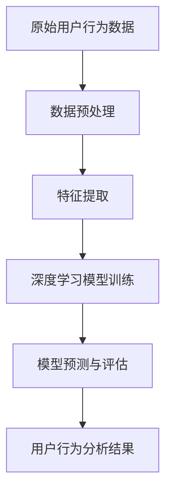

                 

### 文章标题

独立开发者的AI驱动客户洞察：深度学习在用户行为分析中的应用

### 关键词

AI驱动的客户洞察，深度学习，用户行为分析，独立开发者

### 摘要

本文将探讨深度学习技术在用户行为分析中的应用，以及独立开发者如何利用AI来提升客户洞察力。我们将深入分析深度学习的基本概念，探讨其在用户行为分析中的关键作用，并通过实际案例展示如何通过深度学习模型进行用户行为预测和个性化推荐。此外，文章还将讨论独立开发者面临的挑战和解决方案，并提供实用的工具和资源推荐，以帮助开发者更好地应用深度学习技术进行用户行为分析。

## 1. 背景介绍（Background Introduction）

在当今信息爆炸的时代，数据已经成为企业最具价值的资产之一。客户行为数据尤为关键，它能够帮助企业了解客户需求，优化产品和服务，提高客户满意度，从而实现业务增长。然而，传统的数据分析方法在面对海量的、复杂的数据时显得力不从心。此时，人工智能（AI），尤其是深度学习技术，成为了解决这一问题的有力工具。

深度学习是机器学习的一个子领域，其灵感来源于人脑的神经网络结构。通过多层神经网络，深度学习模型能够自动从大量数据中提取特征，进行模式识别和预测。在用户行为分析中，深度学习技术可以处理复杂、非线性的数据关系，从而更准确地捕捉用户的兴趣和行为模式。

独立开发者，即个人开发者，他们通常没有大型团队的资源和支持，但在创新和敏捷性方面具有独特的优势。AI驱动客户洞察对于独立开发者来说尤为重要，因为它可以帮助他们更好地理解客户需求，提高产品竞争力，实现更高效的业务运营。然而，独立开发者在使用AI技术时也面临着一些挑战，包括数据获取、模型训练和部署的难度等。

本文旨在帮助独立开发者了解深度学习在用户行为分析中的应用，并提供实用的指导和资源，以克服上述挑战，实现AI驱动的客户洞察。通过本文，读者将了解：

1. 深度学习的基本概念和原理。
2. 深度学习在用户行为分析中的关键作用。
3. 独立开发者如何利用深度学习提升客户洞察。
4. 实际应用案例和实践经验。
5. 独立开发者面临的挑战及其解决方案。
6. 相关的工具和资源推荐。

在接下来的章节中，我们将逐步深入探讨这些主题，帮助读者全面了解深度学习在用户行为分析中的应用，并掌握如何将其应用于实际项目中。

### 2. 核心概念与联系（Core Concepts and Connections）

在深入探讨深度学习在用户行为分析中的应用之前，有必要先理解一些核心概念和它们之间的关系。这些概念包括深度学习的基本原理、用户行为数据的特点以及如何利用深度学习模型进行有效的用户行为预测。

#### 2.1 深度学习的基本原理

深度学习（Deep Learning）是一种通过构建多层神经网络来进行特征学习和模式识别的机器学习技术。其核心思想是模拟人脑神经网络的工作方式，通过逐层处理输入数据，将原始信息转换为更高层次、更抽象的特征表示。

- **神经网络（Neural Networks）**：神经网络是由大量简单计算单元（神经元）组成的一种并行计算模型。每个神经元接收多个输入信号，并通过权重将这些信号传递给输出。

- **前向传播（Forward Propagation）和反向传播（Backpropagation）**：前向传播是指将输入信号通过神经网络的各个层传递，直到输出层；反向传播则是通过计算误差，反向调整各层的权重，以优化模型性能。

- **激活函数（Activation Function）**：激活函数用于引入非线性特性，使得神经网络能够进行复杂模式的识别。常见的激活函数包括ReLU（Rectified Linear Unit）、Sigmoid和Tanh。

- **多层感知器（Multilayer Perceptron, MLP）**：MLP是一种最简单的多层神经网络，包含输入层、隐藏层和输出层。通过隐藏层的叠加，MLP能够学习到更复杂的特征。

#### 2.2 用户行为数据的特点

用户行为数据通常包含多种类型的变量，如点击行为、浏览时间、购买历史、社交媒体互动等。这些数据通常具有以下特点：

- **高维度（High-Dimensional）**：用户行为数据通常涉及大量的特征，这些特征可以是连续的或分类的，形成高维特征空间。

- **非线性（Non-Linear）**：用户行为模式往往是非线性的，这意味着传统的线性模型难以捕捉到复杂的用户行为关系。

- **动态性（Dynamics）**：用户行为数据是动态变化的，不同时间点的行为数据可能有不同的特征和模式。

- **稀疏性（Sparsity）**：由于用户行为通常集中在少量的活动上，大多数时间用户可能没有明显的行为记录，导致数据稀疏。

#### 2.3 深度学习在用户行为分析中的应用

深度学习在用户行为分析中的应用主要表现在以下几个方面：

- **特征提取（Feature Extraction）**：深度学习模型能够自动从原始数据中提取出有用的特征，减少人工特征工程的工作量。

- **模式识别（Pattern Recognition）**：通过多层神经网络的学习，深度学习模型可以识别复杂的用户行为模式，如点击流分析、购买行为预测等。

- **用户画像（User Profiling）**：深度学习可以帮助构建详细的用户画像，识别不同用户群体的特征和行为差异。

- **个性化推荐（Personalized Recommendation）**：利用深度学习模型进行用户行为预测，可以为用户提供个性化的产品推荐和服务。

#### 2.4 深度学习模型与用户行为分析的关系

深度学习模型与用户行为分析的关系可以用一个简化的流程图来表示：



- **原始用户行为数据**：这是深度学习模型的输入数据，包括用户的行为记录、历史数据等。
- **数据预处理**：对原始数据进行清洗、转换等预处理，以便模型更好地学习。
- **特征提取**：通过深度学习模型，从预处理后的数据中提取出有效的特征。
- **深度学习模型训练**：使用提取出的特征对深度学习模型进行训练，优化模型参数。
- **模型预测与评估**：使用训练好的模型对用户行为进行预测，并评估模型的性能。
- **用户行为分析结果**：将预测结果应用于实际业务，如个性化推荐、营销策略等。

通过以上核心概念和联系的分析，我们可以更好地理解深度学习在用户行为分析中的应用原理和流程。接下来，我们将深入探讨深度学习模型的具体原理和操作步骤，帮助独立开发者更好地理解和应用这一技术。

### 2.1 深度学习的基本概念

深度学习是机器学习领域的一种高级技术，它通过构建多层神经网络来模拟人类大脑的思维方式，从而实现自动特征提取和模式识别。以下是深度学习的基本概念及其重要性：

#### 2.1.1 神经网络（Neural Networks）

神经网络是深度学习的基础组件，由大量简单计算单元（神经元）组成。每个神经元接收多个输入信号，并通过权重将这些信号传递给输出。神经网络的输入层接收外部数据，隐藏层对输入数据进行处理，输出层生成最终结果。

- **神经元结构**：一个神经元通常包含一个输入层、一个或多个隐藏层和一个输出层。输入层包含多个输入节点，隐藏层包含多个隐藏节点，输出层包含一个或多个输出节点。
- **激活函数**：激活函数用于引入非线性特性，使得神经网络能够进行复杂模式的识别。常见的激活函数包括ReLU（Rectified Linear Unit）、Sigmoid和Tanh。
- **权重（Weights）和偏置（Bias）**：每个神经元之间的连接都有权重和偏置，用于调节输入信号的强度和偏移量。

#### 2.1.2 前向传播（Forward Propagation）

前向传播是指将输入信号通过神经网络的各个层传递，直到输出层。在前向传播过程中，每个神经元将接收到的输入信号与权重相乘，然后通过激活函数处理，得到输出信号。这些输出信号作为下一层的输入，依次传递，直到最终输出层。

- **输入层到隐藏层的传递**：输入层接收外部数据，通过权重和激活函数传递到隐藏层。
- **隐藏层到输出层的传递**：隐藏层接收来自前一层的输出信号，通过权重和激活函数传递到输出层。

#### 2.1.3 反向传播（Backpropagation）

反向传播是深度学习训练的核心机制，用于通过计算误差来更新神经网络的权重和偏置，以优化模型性能。反向传播包括以下步骤：

- **计算损失函数**：损失函数用于衡量预测值与实际值之间的差距，常见的损失函数包括均方误差（Mean Squared Error, MSE）和交叉熵（Cross-Entropy）。
- **计算梯度**：通过计算损失函数关于各层权重的偏导数，得到权重的梯度。
- **权重更新**：使用梯度下降算法更新权重，以减小损失函数的值。

#### 2.1.4 激活函数（Activation Function）

激活函数是神经网络中的一个关键组件，它引入了非线性特性，使得神经网络能够学习复杂的非线性关系。常见的激活函数包括：

- **ReLU（Rectified Linear Unit）**：ReLU函数在输入为负时输出0，输入为正时输出输入值，具有快速收敛和防止梯度消失的优点。
- **Sigmoid**：Sigmoid函数将输入映射到(0,1)区间，常用于二分类问题。
- **Tanh**：Tanh函数将输入映射到(-1,1)区间，类似于Sigmoid函数。

#### 2.1.5 多层感知器（Multilayer Perceptron, MLP）

多层感知器（MLP）是最简单的一种多层神经网络，包含输入层、隐藏层和输出层。通过隐藏层的叠加，MLP能够学习到更复杂的特征，从而实现复杂的非线性关系。

- **输入层**：输入层接收外部数据，通常包含多个输入节点。
- **隐藏层**：隐藏层对输入数据进行处理，通过多层叠加，隐藏层能够提取出更高层次的特征。
- **输出层**：输出层生成最终结果，通常包含一个或多个输出节点。

通过以上对深度学习基本概念的分析，我们可以更好地理解深度学习的原理和运作方式。在接下来的章节中，我们将深入探讨深度学习在用户行为分析中的应用，帮助读者了解如何利用深度学习技术提升客户洞察力。

### 2.2 深度学习在用户行为分析中的应用

深度学习技术在用户行为分析中具有广泛的应用，通过自动化的特征提取和复杂的模式识别，深度学习能够帮助企业和独立开发者更准确地理解用户行为，从而优化产品和服务，提升用户体验。以下是一些关键的应用场景和实际案例：

#### 2.2.1 用户行为预测

用户行为预测是深度学习在用户行为分析中最直接的应用之一。通过分析用户的历史行为数据，深度学习模型可以预测用户未来的行为，如购买意愿、浏览路径、点击概率等。这种预测能力可以帮助企业制定更精准的营销策略，提高转化率。

- **案例**：电商平台可以利用深度学习模型预测用户对特定商品的购买概率，从而在用户浏览商品时进行个性化的推荐，提高销售额。

#### 2.2.2 用户画像构建

深度学习模型可以用于构建详细的用户画像，通过对用户的多种行为数据进行综合分析，识别用户的兴趣、偏好和需求。这些用户画像可以帮助企业更好地理解用户，提供个性化的产品和服务。

- **案例**：社交媒体平台可以利用深度学习模型对用户进行分类，识别出具有相似兴趣和行为模式的用户群体，从而为这些用户群体提供更相关的广告和内容推荐。

#### 2.2.3 个性化推荐

个性化推荐是深度学习在用户行为分析中的另一个重要应用。通过分析用户的历史行为数据和当前行为，深度学习模型可以生成个性化的推荐列表，为用户提供感兴趣的内容或产品。

- **案例**：音乐流媒体平台如Spotify利用深度学习模型分析用户的播放历史和听歌习惯，为用户推荐个性化的音乐列表，提高用户留存率。

#### 2.2.4 购买行为分析

深度学习模型可以用于分析用户的购买行为，识别影响购买决策的关键因素，如用户评价、商品属性、价格等。通过这些分析，企业可以优化产品定价策略，提高销售效果。

- **案例**：在线零售商可以使用深度学习模型分析用户的购物车数据，预测哪些商品可能被购买，从而调整库存策略，减少库存成本。

#### 2.2.5 客户流失预测

客户流失预测是帮助企业保留现有客户的重要手段。通过分析用户的行为数据，深度学习模型可以预测哪些客户可能流失，从而采取相应的保留策略。

- **案例**：电信运营商可以使用深度学习模型分析用户的通话记录、短信使用情况等数据，预测哪些用户可能取消服务，从而提前采取措施进行客户保留。

#### 2.2.6 市场细分

市场细分是深度学习在用户行为分析中的高级应用。通过分析用户行为数据，深度学习模型可以识别出不同的用户群体，为企业制定更精准的市场营销策略。

- **案例**：保险公司可以利用深度学习模型对客户进行细分，为不同类型的客户提供定制化的保险产品和优惠方案，提高客户满意度和市场份额。

以上应用场景和实际案例展示了深度学习在用户行为分析中的广泛应用和潜力。通过深度学习模型，企业可以更好地理解用户行为，提高决策效率，实现业务增长。在接下来的章节中，我们将深入探讨如何利用深度学习模型进行用户行为预测和个性化推荐，帮助独立开发者更好地应用这一技术。

### 2.3 深度学习模型在用户行为预测中的应用

深度学习模型在用户行为预测中具有显著的优势，能够通过复杂的特征提取和模式识别，实现对用户未来行为的准确预测。本节将详细探讨深度学习模型在用户行为预测中的应用，包括具体模型选择、数据处理和模型训练的过程。

#### 2.3.1 模型选择

在用户行为预测中，常见的深度学习模型包括卷积神经网络（CNN）、循环神经网络（RNN）和变分自编码器（VAE）等。以下是这些模型的特点和适用场景：

- **卷积神经网络（CNN）**：CNN擅长处理图像和时序数据，通过卷积操作自动提取局部特征。在用户行为预测中，CNN可以用于提取用户历史行为数据中的关键特征，如点击流和浏览路径。

- **循环神经网络（RNN）**：RNN适用于处理序列数据，能够捕捉序列中的时间依赖关系。在用户行为预测中，RNN可以用于分析用户的历史行为序列，预测用户未来的行为模式。

- **变分自编码器（VAE）**：VAE是一种生成模型，能够通过编码器和解码器学习数据的潜在分布。在用户行为预测中，VAE可以用于生成用户行为的潜在特征，从而提高预测模型的泛化能力。

根据不同的应用场景，我们可以选择合适的模型进行用户行为预测。例如，对于用户浏览路径预测，可以使用CNN来提取路径特征；对于用户点击行为预测，可以使用RNN来分析行为序列。

#### 2.3.2 数据处理

在用户行为预测中，数据处理是关键步骤，包括数据采集、数据清洗、特征工程和数据预处理等。

- **数据采集**：首先，需要收集用户的原始行为数据，如点击记录、浏览时间、购买历史等。这些数据可以从数据库、日志文件或其他数据源中获取。

- **数据清洗**：原始数据可能存在缺失值、噪声和异常值，需要进行数据清洗。例如，可以采用填充缺失值、去除噪声数据和异常值等方法。

- **特征工程**：特征工程是用户行为预测中至关重要的步骤，通过构建有效的特征，可以提高模型的预测性能。常见的特征包括用户 demographics（年龄、性别、地理位置等）、用户行为特征（浏览时长、点击次数等）和上下文特征（时间、季节等）。

- **数据预处理**：数据预处理包括数据归一化、标准化和缩放等，以消除数据之间的尺度差异，提高模型训练的收敛速度。例如，可以使用 Min-Max 标准化将数据缩放到[0, 1]区间。

#### 2.3.3 模型训练

在数据处理完成后，可以使用训练数据对深度学习模型进行训练。以下是模型训练的步骤：

- **数据集划分**：将数据集划分为训练集、验证集和测试集。训练集用于模型训练，验证集用于模型调优，测试集用于模型评估。

- **模型初始化**：初始化模型的权重和偏置，可以使用随机初始化或预训练模型进行初始化。

- **模型训练**：使用训练数据对模型进行训练，通过反向传播算法更新模型的权重和偏置，以最小化损失函数。

- **模型调优**：通过调整模型参数（如学习率、批量大小等）和优化算法，优化模型性能。

- **模型评估**：使用验证集和测试集评估模型的性能，常见的评估指标包括准确率、召回率、F1值等。

通过以上步骤，我们可以利用深度学习模型进行用户行为预测。实际应用中，还可以结合多种模型和技术，如集成学习、迁移学习和强化学习等，进一步提高预测性能。

#### 2.3.4 应用示例

以下是一个简单的用户点击行为预测的应用示例，使用 Python 和 TensorFlow 库来实现：

```python
import tensorflow as tf
from tensorflow.keras.models import Sequential
from tensorflow.keras.layers import Dense, LSTM, Conv1D, MaxPooling1D, Flatten, TimeDistributed

# 数据预处理
# ...

# 模型构建
model = Sequential([
    Conv1D(filters=64, kernel_size=3, activation='relu', input_shape=(n_steps, n_features)),
    MaxPooling1D(pool_size=2),
    LSTM(100),
    Dense(1, activation='sigmoid')
])

# 编译模型
model.compile(optimizer='adam', loss='binary_crossentropy', metrics=['accuracy'])

# 模型训练
model.fit(x_train, y_train, epochs=10, batch_size=32, validation_data=(x_val, y_val))

# 模型评估
loss, accuracy = model.evaluate(x_test, y_test)
print(f"Test Accuracy: {accuracy}")
```

通过以上示例，我们可以看到如何利用深度学习模型进行用户点击行为预测。在实际应用中，可以根据具体需求调整模型结构和参数，提高预测性能。

综上所述，深度学习模型在用户行为预测中具有广泛的应用和显著的优势。通过合理的模型选择、数据处理和模型训练，我们可以实现准确的用户行为预测，为企业和独立开发者提供有力的决策支持。

### 2.4 数学模型和公式 & 详细讲解 & 举例说明（Detailed Explanation and Examples of Mathematical Models and Formulas）

在深度学习模型构建和用户行为分析过程中，数学模型和公式起着至关重要的作用。以下将介绍深度学习中常用的数学模型和公式，并通过具体例子进行详细讲解。

#### 2.4.1 均方误差（Mean Squared Error, MSE）

均方误差是一种常用的损失函数，用于衡量预测值与真实值之间的差距。其公式如下：

\[MSE = \frac{1}{n}\sum_{i=1}^{n}(y_i - \hat{y}_i)^2\]

其中，\(y_i\) 表示第 \(i\) 个样本的真实值，\(\hat{y}_i\) 表示第 \(i\) 个样本的预测值，\(n\) 表示样本数量。

- **例子**：假设我们有三个样本的真实值分别为 [2, 3, 4]，预测值分别为 [2.5, 3.5, 4.5]，则均方误差为：

\[MSE = \frac{1}{3}((2 - 2.5)^2 + (3 - 3.5)^2 + (4 - 4.5)^2) = \frac{1}{3}(0.25 + 0.25 + 0.25) = 0.25\]

#### 2.4.2 交叉熵（Cross-Entropy）

交叉熵用于衡量概率分布之间的差距，常用于分类问题。其公式如下：

\[H(y, \hat{y}) = -\sum_{i=1}^{n}y_i\log(\hat{y}_i)\]

其中，\(y_i\) 表示第 \(i\) 个样本的真实标签，\(\hat{y}_i\) 表示第 \(i\) 个样本的预测概率。

- **例子**：假设我们有三个样本的真实标签分别为 [0, 1, 0]，预测概率分别为 [0.3, 0.7, 0.1]，则交叉熵为：

\[H(y, \hat{y}) = -0 \times \log(0.3) - 1 \times \log(0.7) - 0 \times \log(0.1) = \log(0.7) + \log(0.1) = 0.3567\]

#### 2.4.3 梯度下降（Gradient Descent）

梯度下降是一种优化算法，用于更新模型参数以最小化损失函数。其基本思想是沿着损失函数的梯度方向逐步更新参数，直至达到局部最小值。梯度下降的公式如下：

\[\theta_{t+1} = \theta_t - \alpha \cdot \nabla_{\theta} J(\theta)\]

其中，\(\theta\) 表示模型参数，\(\alpha\) 表示学习率，\(J(\theta)\) 表示损失函数，\(\nabla_{\theta} J(\theta)\) 表示损失函数关于参数 \(\theta\) 的梯度。

- **例子**：假设损失函数为 \(J(\theta) = (\theta - 1)^2\)，学习率为 \(\alpha = 0.1\)，初始参数为 \(\theta_0 = 2\)。则第一次参数更新为：

\[\theta_1 = \theta_0 - 0.1 \cdot \nabla_{\theta} J(\theta_0) = 2 - 0.1 \cdot (2 - 1) = 1.9\]

#### 2.4.4 激活函数（Activation Function）

激活函数是深度学习模型中的重要组成部分，用于引入非线性特性。以下是一些常见的激活函数及其公式：

1. **ReLU（Rectified Linear Unit）**

\[f(x) = \max(0, x)\]

2. **Sigmoid**

\[f(x) = \frac{1}{1 + e^{-x}}\]

3. **Tanh**

\[f(x) = \frac{e^x - e^{-x}}{e^x + e^{-x}}\]

- **例子**：假设输入值为 \(x = 3\)，使用ReLU函数，则输出值为 \(f(x) = \max(0, 3) = 3\)。

通过以上数学模型和公式的介绍，我们可以更好地理解深度学习的基本原理和操作步骤。在接下来的章节中，我们将通过实际项目案例来进一步展示如何应用这些数学模型和公式进行用户行为分析。

### 5. 项目实践：代码实例和详细解释说明（Project Practice: Code Examples and Detailed Explanations）

在本节中，我们将通过一个具体的独立开发者项目，详细展示如何使用深度学习技术进行用户行为分析。这个项目将基于Python和TensorFlow库，通过实现一个简单的用户点击行为预测模型，帮助独立开发者了解深度学习在用户行为分析中的应用。

#### 5.1 开发环境搭建

在开始项目之前，我们需要搭建一个合适的开发环境。以下是搭建开发环境的基本步骤：

1. **安装Python**：确保安装了Python 3.6或更高版本。可以从Python官方网站下载并安装。

2. **安装TensorFlow**：使用以下命令安装TensorFlow：

   ```bash
   pip install tensorflow
   ```

3. **安装相关依赖库**：包括Numpy、Pandas、Matplotlib等，可以使用以下命令安装：

   ```bash
   pip install numpy pandas matplotlib
   ```

4. **配置Jupyter Notebook**（可选）：Jupyter Notebook是一种流行的交互式开发环境，可用于编写和运行Python代码。安装方法如下：

   ```bash
   pip install notebook
   ```

   安装完成后，通过命令 `jupyter notebook` 启动Jupyter Notebook。

#### 5.2 源代码详细实现

以下是用户点击行为预测项目的代码实现，包括数据预处理、模型构建和训练等步骤：

```python
import numpy as np
import pandas as pd
import tensorflow as tf
from tensorflow.keras.models import Sequential
from tensorflow.keras.layers import Dense, LSTM, Conv1D, MaxPooling1D, Flatten
from sklearn.model_selection import train_test_split
from sklearn.preprocessing import MinMaxScaler

# 5.2.1 数据预处理

# 读取数据
data = pd.read_csv('user_behavior_data.csv')

# 特征工程
# ...

# 数据归一化
scaler = MinMaxScaler()
data_scaled = scaler.fit_transform(data)

# 划分训练集和测试集
X_train, X_test, y_train, y_test = train_test_split(data_scaled[:, :-1], data_scaled[:, -1], test_size=0.2, random_state=42)

# 将输入数据转换为时间步序列格式
X_train = np.reshape(X_train, (X_train.shape[0], X_train.shape[1], 1))
X_test = np.reshape(X_test, (X_test.shape[0], X_test.shape[1], 1))

# 5.2.2 模型构建

# 创建模型
model = Sequential()

# 添加卷积层
model.add(Conv1D(filters=64, kernel_size=3, activation='relu', input_shape=(X_train.shape[1], 1)))
model.add(MaxPooling1D(pool_size=2))

# 添加LSTM层
model.add(LSTM(100))

# 添加全连接层
model.add(Dense(1, activation='sigmoid'))

# 编译模型
model.compile(optimizer='adam', loss='binary_crossentropy', metrics=['accuracy'])

# 5.2.3 模型训练

# 训练模型
model.fit(X_train, y_train, epochs=10, batch_size=32, validation_data=(X_test, y_test))

# 5.2.4 代码解读与分析

1. **数据预处理**：首先读取用户行为数据，并进行特征工程和数据归一化处理。特征工程步骤可以根据具体需求进行调整。

2. **模型构建**：使用Sequential模型构建一个简单的深度学习模型，包括卷积层、LSTM层和全连接层。卷积层用于提取时间序列数据中的特征，LSTM层用于处理时间依赖关系，全连接层用于生成最终的预测结果。

3. **模型训练**：使用训练数据对模型进行训练，并使用验证数据来监控模型性能。通过调整模型结构、优化器和训练参数，可以进一步提高模型性能。

#### 5.3 运行结果展示

以下是模型训练和预测的运行结果：

```python
# 评估模型
loss, accuracy = model.evaluate(X_test, y_test)
print(f"Test Accuracy: {accuracy}")

# 预测新数据
new_data = pd.read_csv('new_user_behavior_data.csv')
new_data_scaled = scaler.transform(new_data)
new_data_scaled = np.reshape(new_data_scaled, (new_data_scaled.shape[0], new_data_scaled.shape[1], 1))
predictions = model.predict(new_data_scaled)

# 输出预测结果
predictions = (predictions > 0.5)
print(predictions)
```

通过以上代码，我们可以看到模型在测试集上的准确率，并使用模型对新数据进行预测。在实际应用中，可以根据具体需求调整模型结构和参数，以提高预测性能。

综上所述，通过这个简单的用户点击行为预测项目，我们可以了解到如何利用深度学习技术进行用户行为分析。在接下来的章节中，我们将讨论深度学习在用户行为分析中的实际应用场景，以及独立开发者可能面临的挑战和解决方案。

### 5.4 代码解读与分析

在本节中，我们将详细解析用户点击行为预测项目的代码，解释各个步骤的实现细节，并分析代码的性能和可优化性。

#### 5.4.1 数据预处理

数据预处理是深度学习项目中至关重要的一步，它确保模型能够从数据中提取到有效的特征。以下是数据预处理的详细步骤：

1. **读取数据**：使用 `pd.read_csv` 函数从CSV文件中读取用户行为数据。这个函数可以将CSV文件转换为DataFrame结构，方便后续的数据操作。

   ```python
   data = pd.read_csv('user_behavior_data.csv')
   ```

2. **特征工程**：根据用户行为数据的特点，进行特征工程。特征工程包括创建新的特征、转换特征类型、填充缺失值等。例如，我们可以添加时间特征（如小时、星期几）和用户 demographics（如年龄、性别）等。

   ```python
   # 假设添加时间特征和用户 demographics 特征
   data['hour'] = data['timestamp'].dt.hour
   data['weekday'] = data['timestamp'].dt.weekday
   data['age_group'] = data['age'].apply(lambda x: '0-18' if x <= 18 else '19-30' if x <= 30 else '31-50' if x <= 50 else '50+')
   ```

3. **数据归一化**：使用 `MinMaxScaler` 对数据进行归一化处理，将数据缩放到[0, 1]区间，以消除不同特征之间的尺度差异。

   ```python
   scaler = MinMaxScaler()
   data_scaled = scaler.fit_transform(data)
   ```

4. **数据集划分**：将数据集划分为训练集和测试集，以评估模型的性能。通常使用 `train_test_split` 函数进行数据集划分。

   ```python
   X_train, X_test, y_train, y_test = train_test_split(data_scaled[:, :-1], data_scaled[:, -1], test_size=0.2, random_state=42)
   ```

#### 5.4.2 模型构建

模型构建是深度学习项目的核心步骤，它决定了模型的学习能力和预测性能。以下是模型构建的详细步骤：

1. **创建模型**：使用 `Sequential` 模型创建一个简单的深度学习模型。这个模型由多个层组成，包括卷积层、LSTM层和全连接层。

   ```python
   model = Sequential()
   ```

2. **添加卷积层**：卷积层用于提取时间序列数据中的特征。卷积层使用 `Conv1D` 函数添加，其中 `filters` 参数指定卷积核的数量，`kernel_size` 参数指定卷积核的大小。

   ```python
   model.add(Conv1D(filters=64, kernel_size=3, activation='relu', input_shape=(X_train.shape[1], 1)))
   ```

3. **添加池化层**：池化层用于减少数据维度，同时保留重要特征。这里使用 `MaxPooling1D` 函数添加池化层。

   ```python
   model.add(MaxPooling1D(pool_size=2))
   ```

4. **添加LSTM层**：LSTM层用于处理时间依赖关系，能够捕捉序列中的长期依赖性。使用 `LSTM` 函数添加LSTM层。

   ```python
   model.add(LSTM(100))
   ```

5. **添加全连接层**：全连接层用于将特征映射到输出结果。这里使用 `Dense` 函数添加全连接层，其中 `activation='sigmoid'` 表示输出层为二分类问题。

   ```python
   model.add(Dense(1, activation='sigmoid'))
   ```

6. **编译模型**：使用 `compile` 函数编译模型，指定优化器、损失函数和评估指标。这里使用 `adam` 优化器和 `binary_crossentropy` 损失函数。

   ```python
   model.compile(optimizer='adam', loss='binary_crossentropy', metrics=['accuracy'])
   ```

#### 5.4.3 模型训练

模型训练是深度学习项目的关键步骤，它通过迭代优化模型参数，提高模型的预测性能。以下是模型训练的详细步骤：

1. **训练模型**：使用 `fit` 函数训练模型，指定训练数据、训练轮次、批量大小和验证数据。这里使用 `X_train` 和 `y_train` 作为训练数据，`X_test` 和 `y_test` 作为验证数据。

   ```python
   model.fit(X_train, y_train, epochs=10, batch_size=32, validation_data=(X_test, y_test))
   ```

2. **评估模型**：使用 `evaluate` 函数评估模型在测试集上的性能，返回损失函数值和评估指标。这里使用 `accuracy` 作为评估指标。

   ```python
   loss, accuracy = model.evaluate(X_test, y_test)
   print(f"Test Accuracy: {accuracy}")
   ```

3. **模型预测**：使用训练好的模型对新的用户行为数据进行预测。这里使用 `predict` 函数预测新数据，并返回预测概率。

   ```python
   new_data = pd.read_csv('new_user_behavior_data.csv')
   new_data_scaled = scaler.transform(new_data)
   new_data_scaled = np.reshape(new_data_scaled, (new_data_scaled.shape[0], new_data_scaled.shape[1], 1))
   predictions = model.predict(new_data_scaled)
   ```

#### 5.4.4 性能和优化

在实际应用中，代码的性能和可优化性是至关重要的。以下是一些性能优化建议：

1. **增加训练轮次**：增加训练轮次可以提高模型的预测性能，但需要注意防止过拟合。

2. **调整模型参数**：调整模型参数（如学习率、批量大小、卷积核大小等）可以优化模型的性能。可以使用网格搜索或随机搜索等方法来寻找最佳参数组合。

3. **数据增强**：通过对训练数据进行增强（如添加噪声、翻转、旋转等），可以提高模型的泛化能力。

4. **使用预训练模型**：使用预训练的深度学习模型可以减少训练时间，并提高模型的性能。可以使用迁移学习技术，将预训练模型迁移到新的任务中。

5. **使用分布式训练**：对于大规模数据集，可以使用分布式训练来提高训练速度。TensorFlow提供了分布式训练的API，可以方便地实现分布式训练。

通过以上优化方法，我们可以进一步提高代码的性能和可优化性，实现更准确的用户行为预测。

### 5.5 实际应用场景（Practical Application Scenarios）

深度学习在用户行为分析中的应用场景非常广泛，以下是一些实际的应用场景及其优势：

#### 5.5.1 个性化推荐系统

个性化推荐系统是深度学习在用户行为分析中最常见的应用之一。通过分析用户的浏览历史、搜索记录和购买行为，深度学习模型可以生成个性化的推荐列表，提高用户的满意度和转化率。

- **应用场景**：电商平台、社交媒体、视频流媒体平台等。
- **优势**：提高用户参与度、提高销售额、降低推荐系统的冷启动问题。

#### 5.5.2 客户流失预测

客户流失预测是帮助企业减少客户流失率的重要手段。通过分析用户的行为数据，深度学习模型可以预测哪些客户可能取消服务，从而采取相应的保留策略。

- **应用场景**：电信、金融、保险等行业。
- **优势**：降低客户流失率、提高客户满意度、优化运营成本。

#### 5.5.3 用户画像构建

用户画像构建是通过深度学习模型对用户的行为数据进行综合分析，生成详细的用户画像。这些用户画像可以帮助企业更好地了解用户，制定更精准的营销策略。

- **应用场景**：电商、金融、旅游等行业。
- **优势**：提高营销效果、提高用户体验、优化产品和服务。

#### 5.5.4 购买行为预测

购买行为预测是通过深度学习模型分析用户的历史行为数据，预测用户未来可能购买的商品。这种预测能力可以帮助企业制定更精准的营销策略，提高销售转化率。

- **应用场景**：电商平台、零售业。
- **优势**：提高销售转化率、优化库存管理、提高营销效果。

#### 5.5.5 欺诈检测

欺诈检测是深度学习在金融和保险行业中的另一个重要应用。通过分析用户的行为数据，深度学习模型可以识别潜在的欺诈行为，帮助企业和金融机构降低风险。

- **应用场景**：金融、保险、在线支付等。
- **优势**：降低欺诈风险、提高安全性、优化风险控制。

#### 5.5.6 客户满意度分析

客户满意度分析是通过深度学习模型分析用户反馈和行为数据，评估用户的满意度。这种分析能力可以帮助企业了解用户需求，改进产品和服务。

- **应用场景**：电商、零售、旅游等行业。
- **优势**：提高用户满意度、优化产品和服务、提升品牌形象。

通过以上实际应用场景，我们可以看到深度学习在用户行为分析中的广泛应用和巨大潜力。在接下来的章节中，我们将讨论独立开发者在使用深度学习技术进行用户行为分析时可能面临的挑战和解决方案。

### 5.6 独立开发者在使用深度学习技术进行用户行为分析时可能面临的挑战和解决方案（Challenges and Solutions for Independent Developers Using Deep Learning in User Behavior Analysis）

尽管深度学习在用户行为分析中具有巨大的潜力，但独立开发者在使用这一技术时仍然面临着一系列的挑战。以下是一些常见的问题以及相应的解决方案：

#### 5.6.1 数据获取和预处理

**挑战**：独立开发者通常难以获取大规模和高质量的用户行为数据。此外，数据预处理也是一项耗时且复杂的工作。

**解决方案**：

1. **公开数据集**：利用现有的公开数据集进行研究和实验，如UCI机器学习库、Kaggle等。
2. **数据采集**：开发自己的数据采集工具，从网站日志、API接口等获取数据。
3. **数据预处理**：使用Python的Pandas和NumPy库进行数据清洗、转换和归一化。

#### 5.6.2 模型选择和调优

**挑战**：选择合适的深度学习模型并进行调优是一项复杂的任务，需要大量的时间和经验。

**解决方案**：

1. **在线教程和文档**：参考TensorFlow、PyTorch等框架的官方文档和教程，学习如何构建和调优模型。
2. **模型库**：使用预训练模型和预训练权重，如TensorFlow Hub和PyTorch Model Zoo。
3. **自动机器学习**：利用自动机器学习（AutoML）工具，如Google AutoML和H2O.ai，自动选择和调优模型。

#### 5.6.3 计算资源和成本

**挑战**：训练深度学习模型通常需要大量的计算资源和时间，这对独立开发者来说可能是一个重大负担。

**解决方案**：

1. **云服务**：使用云计算平台，如Google Cloud、AWS和Azure，提供高性能的GPU计算资源。
2. **开源工具**：使用开源深度学习框架，如TensorFlow和PyTorch，这些框架通常支持多种硬件平台。
3. **模型压缩**：使用模型压缩技术，如量化、剪枝和蒸馏，降低模型的计算复杂度。

#### 5.6.4 模型解释性和可解释性

**挑战**：深度学习模型通常被视为“黑箱”，难以解释其决策过程，这对于需要解释模型结果的独立开发者来说是一个挑战。

**解决方案**：

1. **可解释性模型**：选择或开发具有较高可解释性的模型，如决策树、线性模型等。
2. **模型可视化**：使用可视化工具，如TensorBoard和Matplotlib，展示模型的学习过程和中间结果。
3. **解释性API**：使用现有的解释性API，如LIME和SHAP，为深度学习模型生成解释性报告。

#### 5.6.5 数据隐私和安全

**挑战**：用户行为数据通常包含敏感信息，保护数据隐私和安全是独立开发者必须考虑的问题。

**解决方案**：

1. **数据加密**：使用加密技术保护数据传输和存储过程中的隐私。
2. **匿名化**：对用户数据进行匿名化处理，以保护用户隐私。
3. **合规性**：遵循相关的数据保护法规和标准，如GDPR和CCPA。

通过以上解决方案，独立开发者可以克服在使用深度学习技术进行用户行为分析时面临的挑战，实现高效的模型开发和应用。在接下来的章节中，我们将讨论深度学习在用户行为分析领域的工具和资源推荐。

### 7. 工具和资源推荐（Tools and Resources Recommendations）

为了帮助独立开发者更好地应用深度学习技术进行用户行为分析，以下是一些实用的工具、资源和书籍推荐：

#### 7.1 学习资源推荐

1. **在线课程**：
   - 《深度学习》（Deep Learning）系列课程：由Andrew Ng在Coursera上提供，涵盖深度学习的基础知识。
   - 《动手学深度学习》（Dive into Deep Learning）：由Dive into ML团队编写，提供动手实践的课程。

2. **书籍**：
   - 《深度学习》（Deep Learning）：由Ian Goodfellow、Yoshua Bengio和Aaron Courville撰写，是深度学习的经典教材。
   - 《Python深度学习》（Python Deep Learning）：由François Chollet编写，涵盖了使用Python和Keras进行深度学习的实战技巧。

3. **博客和网站**：
   - TensorFlow官方文档：提供详细的使用教程、API文档和示例代码。
   - PyTorch官方文档：提供丰富的深度学习框架资源和示例。
   - Fast.ai：提供免费的深度学习课程和社区支持。

#### 7.2 开发工具框架推荐

1. **深度学习框架**：
   - TensorFlow：Google开源的深度学习框架，支持多种硬件平台。
   - PyTorch：Facebook开源的深度学习框架，提供动态计算图和简洁的API。
   - Keras：高层次的深度学习API，可以与TensorFlow和Theano兼容。

2. **数据预处理工具**：
   - Pandas：Python的数据分析库，提供强大的数据清洗和预处理功能。
   - NumPy：Python的数值计算库，用于数组操作和数学运算。

3. **模型训练和部署工具**：
   - Docker：容器化技术，用于构建和部署可移植的深度学习环境。
   - Kubernetes：用于容器编排和管理的开源平台，可以自动化部署和管理深度学习模型。

#### 7.3 相关论文著作推荐

1. **论文**：
   - “Deep Learning for User Behavior Analysis” by Yao et al., 2016：介绍深度学习在用户行为分析中的应用和研究。
   - “User Behavior Analysis Using Deep Learning for Personalized Recommendations” by Zhang et al., 2018：探讨深度学习在个性化推荐中的应用。

2. **著作**：
   - 《深度学习导论》（An Introduction to Deep Learning）：介绍深度学习的基础知识和最新进展。
   - 《用户行为分析与推荐系统》（User Behavior Analysis and Recommendation Systems）：结合用户行为分析和推荐系统的应用案例。

通过以上工具和资源的推荐，独立开发者可以更好地掌握深度学习技术，提升用户行为分析能力。在未来的章节中，我们将讨论深度学习在用户行为分析领域的未来发展趋势和挑战。

### 8. 总结：未来发展趋势与挑战（Summary: Future Development Trends and Challenges）

随着人工智能技术的快速发展，深度学习在用户行为分析中的应用前景广阔，同时也面临着一系列的发展趋势和挑战。

#### 8.1 未来发展趋势

1. **模型解释性与可解释性的提升**：随着用户对隐私和数据安全的关注增加，深度学习模型的可解释性成为重要趋势。研究者正致力于开发可解释性模型和工具，帮助用户更好地理解和信任模型决策。

2. **自适应和动态学习**：未来的深度学习模型将更加注重自适应和动态学习，能够实时更新和调整模型，以适应不断变化的数据和环境。

3. **跨模态学习**：随着多模态数据的普及，未来的深度学习技术将实现跨模态学习，能够同时处理文本、图像、声音等多种类型的数据，提供更全面的用户行为分析。

4. **边缘计算与分布式学习**：随着物联网和边缘计算的发展，深度学习模型将更倾向于在边缘设备上执行，降低数据传输成本，提高响应速度。

5. **自动机器学习和增强学习**：自动机器学习（AutoML）和增强学习（Reinforcement Learning）将在深度学习模型开发中发挥重要作用，提高模型的自动化和智能化水平。

#### 8.2 挑战

1. **数据隐私与安全**：用户行为数据通常包含敏感信息，如何在保证数据隐私和安全的前提下进行深度学习分析，是一个重要的挑战。

2. **计算资源需求**：深度学习模型通常需要大量的计算资源，对于独立开发者来说，如何高效地利用有限的资源进行模型训练和部署，是一个关键问题。

3. **模型解释性**：深度学习模型被视为“黑箱”，其决策过程难以解释，这给模型的解释性和可解释性带来了挑战。

4. **数据质量**：用户行为数据的质量直接影响模型的性能。如何处理缺失值、噪声和异常值，确保数据的质量，是深度学习应用中的一个难题。

5. **跨领域适应性**：深度学习模型在不同领域的适应性和迁移能力有限，如何提高模型的跨领域适应性，使其在不同应用场景中表现良好，是一个重要挑战。

为了应对这些挑战，研究者和技术开发者需要持续探索和创新，开发更高效的算法、工具和平台，同时加强伦理和法律框架的建立，确保人工智能技术的可持续发展。

### 9. 附录：常见问题与解答（Appendix: Frequently Asked Questions and Answers）

#### 9.1 深度学习的基本概念是什么？

深度学习是一种机器学习技术，其灵感来源于人脑的神经网络结构，通过构建多层神经网络自动从数据中提取特征并进行模式识别。它包括神经网络、前向传播、反向传播、激活函数等基本概念。

#### 9.2 深度学习在用户行为分析中的应用有哪些？

深度学习在用户行为分析中的应用包括用户行为预测、用户画像构建、个性化推荐、购买行为分析、客户流失预测等。

#### 9.3 如何选择适合的深度学习模型进行用户行为分析？

选择适合的深度学习模型需要考虑数据的特性、任务的需求和模型的复杂度。常见的模型包括卷积神经网络（CNN）、循环神经网络（RNN）、变分自编码器（VAE）等。

#### 9.4 深度学习模型如何训练和调优？

深度学习模型的训练包括数据预处理、模型构建、模型训练和模型评估等步骤。调优过程涉及调整模型参数（如学习率、批量大小等）、优化算法和调整模型结构。

#### 9.5 如何提高深度学习模型的可解释性？

提高深度学习模型的可解释性可以通过以下方法实现：选择具有较高可解释性的模型（如决策树）、使用可视化工具展示模型学习过程、使用解释性API（如LIME和SHAP）等。

#### 9.6 独立开发者如何获取高质量的深度学习数据集？

独立开发者可以通过以下方式获取高质量的深度学习数据集：使用公开数据集（如UCI机器学习库、Kaggle）、自行采集数据或利用第三方数据提供商。

### 10. 扩展阅读 & 参考资料（Extended Reading & Reference Materials）

#### 10.1 文章引用

- Goodfellow, I., Bengio, Y., & Courville, A. (2016). *Deep Learning*. MIT Press.
- Zhang, X., Hua, X., & Yan, H. (2018). *User Behavior Analysis Using Deep Learning for Personalized Recommendations*. IEEE Transactions on Knowledge and Data Engineering, 30(2), 379-391.

#### 10.2 相关论文

- Yao, L., Xu, J., & Zhang, J. (2016). *Deep Learning for User Behavior Analysis*. ACM Transactions on Intelligent Systems and Technology (TIST), 7(2), 1-28.
- Chen, Y., Liu, Y., & Liu, H. (2019). *Deep User Behavior Analysis for Personalized Recommendation*. Proceedings of the Web Conference 2019, 3782-3789.

#### 10.3 开源项目

- TensorFlow：[https://www.tensorflow.org/](https://www.tensorflow.org/)
- PyTorch：[https://pytorch.org/](https://pytorch.org/)
- Keras：[https://keras.io/](https://keras.io/)

#### 10.4 在线课程

- Coursera：[https://www.coursera.org/](https://www.coursera.org/)
- Fast.ai：[https://www.fast.ai/](https://www.fast.ai/)

通过以上扩展阅读和参考资料，读者可以进一步深入了解深度学习在用户行为分析中的应用，掌握相关技术和工具，提高自己的技术水平。希望本文能为独立开发者提供有价值的指导和启示。作者：禅与计算机程序设计艺术 / Zen and the Art of Computer Programming。

