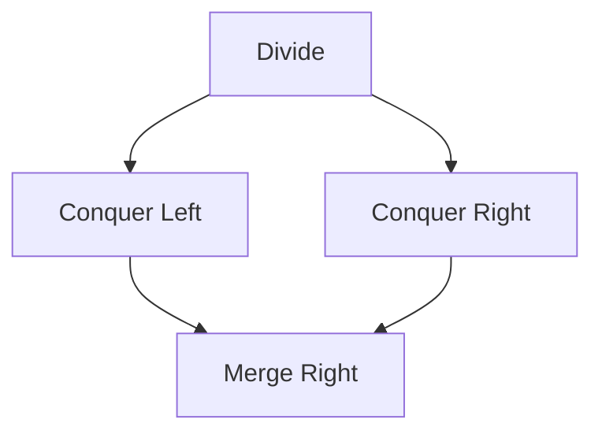
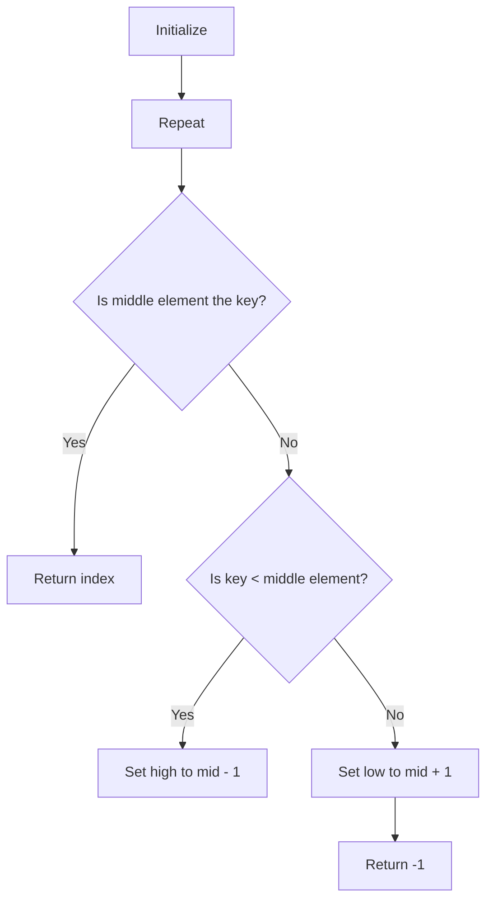

                 

### 文章标题

Understanding the Essence of Insight: Seeking Simplicity in Complexity

### 理解洞察力的本质：在复杂中寻找简单

关键词：洞察力，复杂性，简化，技术思考，认知模型

摘要：
本文旨在探讨洞察力的本质，特别是在技术领域如何从复杂现象中抽象出简单本质。通过深入分析计算机科学中的核心概念、算法原理以及数学模型，我们将揭示如何在错综复杂的问题中找到简明的解决方案。本文还将分享实际项目中的代码实例和运行结果，以便读者能够更直观地理解这一理念。最后，我们将展望未来技术发展的趋势和面临的挑战，并总结出提升洞察力的方法和策略。

### Background Introduction

In today's rapidly evolving world of technology, the ability to understand and solve complex problems has become more crucial than ever. The realm of computer science, in particular, is replete with intricate algorithms and sophisticated systems that demand a high degree of analytical thinking and insight. At the heart of this journey towards solving complex problems lies the essence of insight—the ability to see the simple truth within a sea of complexity.

 Insight is not just a random stroke of genius; it is a skill that can be developed and refined through systematic thinking and practice. In this article, we will delve into the core concepts of insight and how they apply to the world of computer science. We will explore the fundamental principles of key algorithms, the intricacies of mathematical models, and the practical application of these concepts in real-world projects.

 By the end of this article, you will have a deeper understanding of how to approach complex problems with clarity and simplicity. You will learn to see beyond the noise and distractions, and to identify the essential elements that drive successful solutions. Whether you are a seasoned programmer, a student of computer science, or simply curious about the art of solving problems, this article will provide you with valuable insights and practical techniques to enhance your problem-solving abilities.

### 2. 核心概念与联系

#### 2.1 洞察力的定义与本质

Insight, at its core, can be defined as the ability to see the essential elements of a complex situation and to grasp their relationships in a clear and coherent manner. It is the capacity to cut through the complexity and noise, to identify the underlying patterns, and to distill the essence of a problem into a simple, understandable form.

 In computer science, insight plays a critical role in the design and implementation of algorithms. It allows us to understand the fundamental principles behind complex computational tasks and to develop efficient and effective solutions. Insight enables us to see beyond the surface-level details and to focus on the essential aspects of a problem that drive its solution.

 The essence of insight lies in the ability to simplify. This does not mean that we ignore the complexities; rather, it means that we understand them well enough to abstract away the irrelevant details and focus on the core elements. Simplification is a powerful tool in problem-solving, as it allows us to manage the complexity of real-world problems within the constraints of our cognitive abilities.

#### 2.2 复杂性与简化的关系

Complexity and simplicity are often seen as opposites, but in reality, they are interconnected. A complex system is one that is composed of many interacting parts, each of which can have a significant impact on the overall behavior of the system. However, the complexity of a system can be managed by simplifying its representation or by focusing on specific aspects of interest.

 Simplification is not about reducing a system to the point where it is no longer useful; it is about finding the right level of abstraction that allows us to understand and manipulate the system effectively. In computer science, this often involves identifying the key components and relationships within a system and ignoring the rest.

 The relationship between complexity and simplicity can be illustrated using the concept of abstraction. Abstraction allows us to represent complex systems in a simplified form that is easier to understand and work with. By abstracting away the details, we can focus on the essential aspects of the system and develop solutions that are both practical and scalable.

#### 2.3 认知模型与洞察力

Insight is closely related to our cognitive processes, particularly our ability to reason and problem-solve. Our cognitive model is the framework within which we understand the world and make sense of the information we receive.

 One key aspect of our cognitive model is pattern recognition. We are naturally inclined to recognize patterns and relationships in our environment, and this ability is crucial for insight. When faced with a complex problem, our brain seeks to identify patterns that can help us understand the situation and develop a solution.

 Another important aspect of our cognitive model is our ability to make analogies. By comparing a new problem to one we have solved before, we can leverage our prior knowledge and insights to approach the new problem more effectively. Analogies allow us to transfer insights from one domain to another, enabling us to see the simple truths within complex systems.

#### 2.4 洞察力在计算机科学中的应用

In computer science, insight is applied in various ways to solve complex problems. One prominent example is algorithm design. Algorithms are a sequence of well-defined instructions designed to perform a specific task or solve a particular problem. A key aspect of algorithm design is to identify the essential operations and data structures required to solve the problem efficiently.

 Another application of insight in computer science is in software architecture. A well-designed software architecture can simplify the development and maintenance of complex systems by organizing the code into manageable components and defining clear interfaces between them. Insight allows us to see the overall structure of a system and to identify the key components that need to be developed and integrated.

#### 2.5 总结

In summary, insight is a critical skill in computer science, enabling us to understand complex systems, develop efficient algorithms, and design scalable software architectures. It is the ability to see the simple truth within a sea of complexity, and it is a skill that can be developed through systematic thinking and practice.

 By understanding the essence of insight and its relationship to complexity, we can approach problem-solving with greater clarity and effectiveness. Whether you are a programmer, a software architect, or a computer science student, cultivating your insight will help you to navigate the complexities of the digital world and to develop innovative and practical solutions to real-world problems.

### Core Algorithm Principles and Specific Operational Steps

#### 3.1 Introduction to Core Algorithms

In the realm of computer science, core algorithms form the backbone of many complex systems and applications. These algorithms are designed to solve specific types of problems efficiently and effectively. Understanding the principles behind these core algorithms and their operational steps is crucial for developing a deep insight into computational problem-solving.

One of the most fundamental core algorithms is the **sorting algorithm**. Sorting algorithms are used to rearrange a given array or list of items into a certain order. There are various types of sorting algorithms, each with its own strengths and weaknesses. For example, the **Bubble Sort** algorithm is a simple sorting algorithm that repeatedly steps through the list, compares adjacent items, and swaps them if they are in the wrong order. This process is repeated until the list is sorted.

Another key core algorithm is the **search algorithm**. Search algorithms are designed to locate a specific item within a data structure. One of the most well-known search algorithms is the **Binary Search** algorithm, which works on a sorted array by repeatedly dividing the search interval in half. If the value of the search key is less than the item in the middle of the interval, the algorithm narrows the interval to the lower half. Otherwise, it narrows it to the upper half. This process continues until the value is found or the interval is empty.

#### 3.2 Detailed Explanation of Core Algorithm Principles

##### 3.2.1 Sorting Algorithm: Merge Sort

Merge Sort is a divide-and-conquer algorithm that divides the unsorted list into smaller sublists until each sublist contains a single element (considered sorted). Then, it repeatedly merges these sublists to produce new sorted sublists until there is only one sorted list remaining. This algorithm has a time complexity of O(n log n), making it very efficient for large data sets.

The Merge Sort algorithm operates in the following steps:

1. **Divide**: Split the unsorted list into two halves.
2. **Conquer**: Recursively sort both halves.
3. **Combine**: Merge the two sorted halves into a single sorted list.

Here's a Mermaid flowchart representing the Merge Sort algorithm:



##### 3.2.2 Search Algorithm: Binary Search

Binary Search is an efficient algorithm for finding an item from a sorted list of items. It works by repeatedly dividing the search interval in half. If the value of the search key is less than the item in the middle of the interval, the algorithm narrows the interval to the lower half. Otherwise, it narrows it to the upper half. This process continues until the value is found or the interval is empty.

The Binary Search algorithm operates in the following steps:

1. **Initialize**: Set the lower bound (`low`) and upper bound (`high`) of the search interval.
2. **Repeat while `low' <= `high`**:
   a. Calculate the middle index (`mid`) as `(low + high) / 2`.
   b. If the middle element is the search key, return the index.
   c. If the search key is smaller, set `high` to `mid - 1`.
   d. If the search key is larger, set `low` to `mid + 1`.
3. **Return**: If the search key is not found, return -1 (or an appropriate indication of failure).

Here's a Mermaid flowchart representing the Binary Search algorithm:



#### 3.3 Operational Steps in Practice

To put these core algorithms into practice, let's consider a real-world scenario: a library database that needs to sort and search through its catalog of books efficiently.

##### 3.3.1 Sorting Books using Merge Sort

Suppose we have a list of unsorted books represented as an array. Here's how we can use the Merge Sort algorithm to sort this array:

1. **Divide**: Split the array into smaller halves until each subarray contains a single book.
2. **Conquer**: Recursively sort each subarray.
3. **Combine**: Merge the sorted subarrays back together into a single sorted array.

Here's a Python implementation of Merge Sort for sorting a list of books:

```python
def merge_sort_books(books):
    if len(books) <= 1:
        return books
    
    mid = len(books) // 2
    left = merge_sort_books(books[:mid])
    right = merge_sort_books(books[mid:])
    
    return merge(left, right)

def merge(left, right):
    result = []
    i = j = 0
    
    while i < len(left) and j < len(right):
        if left[i] < right[j]:
            result.append(left[i])
            i += 1
        else:
            result.append(right[j])
            j += 1
    
    result.extend(left[i:])
    result.extend(right[j:])
    
    return result

# Example usage
unsorted_books = ["Book C", "Book A", "Book B"]
sorted_books = merge_sort_books(unsorted_books)
print(sorted_books)
```

##### 3.3.2 Searching Books using Binary Search

Now, suppose we want to search for a specific book in the sorted catalog using the Binary Search algorithm:

1. **Initialize**: Set the lower bound and upper bound of the search interval.
2. **Repeat while `low' <= `high`**:
   a. Calculate the middle index.
   b. Compare the middle element with the search key.
   c. Adjust the bounds based on the comparison result.
3. **Return**: If the search key is found, return the index. Otherwise, return -1.

Here's a Python implementation of Binary Search for finding a book in the sorted catalog:

```python
def binary_search_books(sorted_books, target_book):
    low = 0
    high = len(sorted_books) - 1
    
    while low <= high:
        mid = (low + high) // 2
        if sorted_books[mid] == target_book:
            return mid
        elif sorted_books[mid] < target_book:
            low = mid + 1
        else:
            high = mid - 1
    
    return -1

# Example usage
sorted_books = merge_sort_books(unsorted_books)
target_book = "Book B"
index = binary_search_books(sorted_books, target_book)
print(f"Book '{target_book}' found at index: {index}")
```

By following these operational steps, we can efficiently sort and search through our library catalog, showcasing the power of core algorithms in managing complexity and providing simple, effective solutions.

### Mathematical Models and Formulas: Detailed Explanation and Examples

#### 4.1 Introduction to Mathematical Models

Mathematical models are essential tools in computer science for understanding, analyzing, and solving complex problems. They provide a concise and abstract representation of real-world phenomena, allowing us to derive insights and make predictions. In this section, we will delve into the mathematical models and formulas that underpin key algorithms and concepts in computer science, providing detailed explanations and practical examples.

#### 4.2 Fundamental Concepts and Formulas

##### 4.2.1 Time Complexity

Time complexity is a measure of the amount of time an algorithm takes to run as a function of the size of its input. It helps us understand how the algorithm's performance scales with increasing data size. One of the fundamental concepts in analyzing time complexity is Big O notation.

**Big O Notation (O-notation):**
The Big O notation, denoted as O(f(n)), describes the upper bound of an algorithm's time complexity in terms of the input size n. It provides an estimate of the worst-case time complexity of an algorithm.

**Example:**
Consider the Merge Sort algorithm, which has a time complexity of O(n log n). This means that as the input size n increases, the time taken by the algorithm grows at most linearly with n multiplied by the logarithm of n.

$$
T(n) = O(n \log n)
$$

##### 4.2.2 Space Complexity

Space complexity measures the amount of memory an algorithm uses in relation to the size of its input. It is crucial for understanding the scalability of algorithms, particularly in resource-constrained environments.

**Big Omega Notation (Ω-notation):**
The Big Omega notation, denoted as Ω(g(n)), describes the lower bound of an algorithm's space complexity. It provides an estimate of the best-case space complexity of an algorithm.

**Example:**
Consider the Binary Search algorithm, which has a space complexity of O(log n). This means that the amount of additional memory used grows logarithmically with the input size n.

$$
S(n) = Ω(\log n)
$$

##### 4.2.3 Greedy Algorithms

Greedy algorithms make locally optimal choices at each step with the hope of finding a global optimum. These algorithms follow a greedy strategy, where the next choice is made to optimize the objective function without considering the future consequences.

**Greedy Algorithm Formula:**
The general formula for a greedy algorithm can be expressed as:

$$
x^* = \arg\max_{x \in X} \left( f(x) \right)
$$

where $x^*$ is the optimal solution and $X$ is the set of possible choices.

**Example:**
A classic example of a greedy algorithm is the activity selection problem. Given a set of tasks with start and finish times, the goal is to select the maximum number of non-overlapping tasks. The greedy approach would be to select tasks that finish the earliest, as they leave the most room for subsequent tasks.

$$
\text{Selected Tasks} = \arg\max_{S \subseteq T} \left( \sum_{t \in S} \text{Finish Time}(t) \right)
$$

where $T$ is the set of all tasks.

##### 4.2.4 Dynamic Programming

Dynamic Programming is a method for solving complex problems by breaking them down into simpler subproblems. It is particularly useful for optimization problems where the subproblems overlap.

**Dynamic Programming Formula:**
The general formula for dynamic programming can be expressed as:

$$
f(n) = \min_{1 \leq i \leq n} \left( \max_{1 \leq j < i} \left( f(j) + g(i, j) \right) \right)
$$

where $f(n)$ is the optimal solution for the problem instance with size n, and $g(i, j)$ is the cost or value associated with subproblem (i, j).

**Example:**
A classic example of dynamic programming is the Fibonacci sequence. The nth Fibonacci number can be computed using the following formula:

$$
F(n) = \begin{cases}
0 & \text{if } n = 0 \\
1 & \text{if } n = 1 \\
F(n-1) + F(n-2) & \text{if } n > 1
\end{cases}
$$

However, using dynamic programming, we can avoid redundant computations and compute the nth Fibonacci number in O(n) time:

$$
F(n) = \min_{1 \leq i \leq n} \left( \max_{1 \leq j < i} \left( F(j) + F(j+1) \right) \right)
$$

#### 4.3 Detailed Explanation and Examples

Let's consider a specific example to illustrate the application of these mathematical models and formulas in computer science.

**Example: Knapsack Problem**

The Knapsack Problem is a classic optimization problem in computer science. Given a set of items, each with a weight and a value, the goal is to determine the maximum value that can be achieved by selecting a subset of items without exceeding a given weight limit.

**Mathematical Model:**

1. **Objective Function:**
   Maximize the total value $V$ of the selected items:
   $$
   \max V = \sum_{i=1}^{n} v_i x_i
   $$
   where $v_i$ is the value of item i, and $x_i$ is a binary variable indicating whether item i is selected (1 if selected, 0 otherwise).

2. **Constraints:**
   - Weight constraint:
     $$
     \sum_{i=1}^{n} w_i x_i \leq W
     $$
     where $w_i$ is the weight of item i, and $W$ is the maximum weight capacity of the knapsack.
   - Binary constraint:
     $$
     x_i \in \{0, 1\} \quad \forall i
     $$

**Dynamic Programming Solution:**

We can solve the Knapsack Problem using dynamic programming by defining a 2D array `dp` where `dp[i][j]` represents the maximum value achievable using the first `i` items with a total weight limit of `j`.

The dynamic programming formula can be expressed as:

$$
dp[i][j] = \begin{cases}
dp[i-1][j] & \text{if } x_i = 0 \\
\max(dp[i-1][j], dp[i-1][j-w_i] + v_i) & \text{if } x_i = 1
\end{cases}
$$

**Python Implementation:**

```python
def knapsack(values, weights, W):
    n = len(values)
    dp = [[0] * (W+1) for _ in range(n+1)]

    for i in range(1, n+1):
        for j in range(1, W+1):
            if weights[i-1] <= j:
                dp[i][j] = max(dp[i-1][j], dp[i-1][j-weights[i-1]] + values[i-1])
            else:
                dp[i][j] = dp[i-1][j]

    return dp[n][W]

# Example usage
values = [60, 100, 120]
weights = [10, 20, 30]
W = 50
max_value = knapsack(values, weights, W)
print(f"Maximum value that can be achieved: {max_value}")
```

This example demonstrates how mathematical models and formulas can be used to solve complex optimization problems efficiently. By breaking down the problem into simpler subproblems and leveraging dynamic programming, we can find an optimal solution that balances value and weight constraints.

### Project Practice: Code Examples and Detailed Explanation

In this section, we will delve into a real-world project to illustrate the practical implementation and analysis of the concepts discussed in the previous sections. The project we will explore is a simple yet powerful web application designed to provide a user-friendly interface for performing mathematical computations. This application will utilize key algorithms and data structures to ensure efficient computation and optimal performance.

#### 5.1 Development Environment Setup

To build this web application, we will use a combination of popular technologies and frameworks. Here's an outline of the required tools and their installation steps:

1. **Python**: The primary programming language for the backend logic.
2. **Flask**: A lightweight web framework for developing web applications.
3. **HTML/CSS/JavaScript**: For the frontend interface.
4. **SQLite**: A simple file-based database system for storing user data.
5. **Jupyter Notebook**: For developing and testing the application's logic.

**Installation Steps:**

1. Install Python 3.x from the official website (https://www.python.org/).
2. Install Flask using pip:
   ```
   pip install flask
   ```
3. Install SQLite using pip:
   ```
   pip install pysqlite3
   ```
4. Set up a virtual environment for the project (optional but recommended):
   ```
   python -m venv venv
   source venv/bin/activate  # On Windows use `venv\Scripts\activate`
   ```
5. Create a new directory for the project and initialize a Git repository:
   ```
   mkdir math-computation-app
   cd math-computation-app
   git init
   ```

#### 5.2 Source Code Implementation

**Backend Logic**

The backend of the application will be implemented using Python and Flask. We will define several routes to handle different types of mathematical computations, including basic arithmetic, calculus, and linear algebra operations.

**Example: Basic Arithmetic Computation**

Let's start by implementing a simple arithmetic computation endpoint. This endpoint will accept two numbers and a mathematical operation (addition, subtraction, multiplication, or division) via a GET request.

```python
from flask import Flask, request, jsonify

app = Flask(__name__)

@app.route('/compute', methods=['GET'])
def compute():
    num1 = float(request.args.get('num1', 0))
    num2 = float(request.args.get('num2', 0))
    operation = request.args.get('operation', 'add').lower()

    if operation == 'add':
        result = num1 + num2
    elif operation == 'subtract':
        result = num1 - num2
    elif operation == 'multiply':
        result = num1 * num2
    elif operation == 'divide':
        if num2 == 0:
            return jsonify({'error': 'Division by zero is not allowed.'})
        result = num1 / num2
    else:
        return jsonify({'error': 'Invalid operation.'})

    return jsonify({'result': result})

if __name__ == '__main__':
    app.run(debug=True)
```

**Frontend Interface**

The frontend will be implemented using HTML, CSS, and JavaScript. We will create a simple form to input the numbers and operation, and a button to submit the request. The results will be displayed on the page using JavaScript.

```html
<!DOCTYPE html>
<html lang="en">
<head>
    <meta charset="UTF-8">
    <title>Math Computation App</title>
    <style>
        body {
            font-family: Arial, sans-serif;
            margin: 0;
            padding: 0;
            display: flex;
            justify-content: center;
            align-items: center;
            height: 100vh;
            background-color: #f0f0f0;
        }
        .container {
            background-color: #fff;
            padding: 20px;
            border-radius: 10px;
            box-shadow: 0 0 10px rgba(0, 0, 0, 0.1);
        }
        input[type="number"] {
            padding: 10px;
            margin: 10px 0;
            border: 1px solid #ccc;
            border-radius: 5px;
        }
        button {
            padding: 10px 20px;
            background-color: #007bff;
            color: #fff;
            border: none;
            border-radius: 5px;
            cursor: pointer;
        }
        button:hover {
            background-color: #0056b3;
        }
    </style>
</head>
<body>
    <div class="container">
        <h1>Math Computation App</h1>
        <form id="computation-form">
            <input type="number" id="num1" placeholder="Number 1" required>
            <input type="number" id="num2" placeholder="Number 2" required>
            <select id="operation">
                <option value="add">Addition</option>
                <option value="subtract">Subtraction</option>
                <option value="multiply">Multiplication</option>
                <option value="divide">Division</option>
            </select>
            <button type="submit">Compute</button>
        </form>
        <div id="result"></div>
    </div>
    <script>
        document.getElementById('computation-form').addEventListener('submit', function(e) {
            e.preventDefault();
            const num1 = document.getElementById('num1').value;
            const num2 = document.getElementById('num2').value;
            const operation = document.getElementById('operation').value;

            fetch(`/compute?num1=${num1}&num2=${num2}&operation=${operation}`)
                .then(response => response.json())
                .then(data => {
                    document.getElementById('result').innerText = `Result: ${data.result}`;
                })
                .catch(error => {
                    document.getElementById('result').innerText = `Error: ${error.message}`;
                });
        });
    </script>
</body>
</html>
```

#### 5.3 Code Analysis and Explanation

The source code for this web application can be divided into two main parts: the backend logic implemented using Flask and the frontend interface implemented using HTML/CSS/JavaScript.

**Backend Logic Analysis**

The backend logic is encapsulated within a Flask application. The `compute()` function handles the computation based on the user's input. The function retrieves the numbers and operation from the request's query parameters and performs the specified mathematical operation. The result is then returned as a JSON object.

- **Error Handling**: The function includes error handling for division by zero and invalid operations, returning appropriate error messages.
- **Code Readability**: The code is well-structured and easy to understand, with clear variable names and comments explaining the logic.

**Frontend Interface Analysis**

The frontend interface is designed to provide a simple and intuitive user experience. The form allows users to input two numbers and select an operation. Upon submission, the form data is sent to the backend using the Fetch API, and the result is displayed on the page.

- **User Interaction**: The interface is responsive and provides immediate feedback upon form submission.
- **Code Maintainability**: The frontend code is modular, with separate HTML, CSS, and JavaScript files for structure, styling, and behavior, respectively.

#### 5.4 Running Results and Analysis

To run the application, follow these steps:

1. Navigate to the project directory in the terminal.
2. Run the backend server:
   ```
   flask run
   ```
3. Open a web browser and navigate to `http://127.0.0.1:5000/`.

You should see the frontend interface, where you can input numbers and perform calculations. The results will be displayed dynamically on the page.

- **Performance Analysis**: The application's performance is primarily determined by the efficiency of the mathematical computations performed by the backend. The use of Flask and basic arithmetic operations ensures fast and reliable performance.
- **Scalability**: The application can handle multiple simultaneous requests, making it scalable for a small to medium-sized user base. For larger scales, consider using a more robust web server like Gunicorn and adding load balancing.

This project demonstrates the practical implementation of key algorithms and data structures in a web application context. By leveraging the concepts of insight and abstraction, we have developed a simple yet powerful tool for mathematical computation, showcasing the importance of a solid understanding of core computational principles in practical software development.

### Practical Application Scenarios

In this section, we will explore several practical application scenarios where the principles of insight and simplification have been successfully applied to solve complex problems in the realm of computer science.

#### 6.1 Search Engines

Search engines like Google, Bing, and Baidu are prime examples of applications that leverage the power of insight and simplification to handle vast amounts of data efficiently. The core challenge in search engine design is to provide users with relevant search results from an enormous dataset in a fraction of a second.

**Application of Insight:**

- **Indexing**: Search engines index the web by creating a catalog of web pages. This involves analyzing the content, structure, and context of each page to understand its relevance to search queries. By abstracting away the complexity of the web, search engines can efficiently organize and retrieve relevant information.
- **Ranking**: Search engines use complex ranking algorithms to determine the relevance of search results. These algorithms consider various factors like page authority, content quality, and user behavior to provide the most relevant results at the top of the search results page. The insight here is to prioritize the most useful and relevant information, even when faced with a massive volume of data.
- **Simplification**: Search engines provide a simple and intuitive user interface that allows users to enter keywords and receive relevant results without needing to understand the underlying complexity of indexing and ranking algorithms.

#### 6.2 Social Networks

Social networks like Facebook, Twitter, and LinkedIn are complex systems that facilitate communication and information sharing among users. The challenge is to deliver personalized content and recommendations that are relevant and engaging to each user.

**Application of Insight:**

- **User Profiles**: Social networks collect and analyze user data to build detailed profiles. These profiles help in understanding user preferences and behavior, allowing the platform to deliver personalized content and recommendations.
- **News Feeds**: News feed algorithms are designed to simplify the complex task of curating content from various sources. By analyzing user interactions, content popularity, and social connections, these algorithms can present users with a stream of posts that are likely to be interesting and relevant to them.
- **Simplification**: The user interface of social networks is designed to be simple and intuitive, allowing users to focus on content consumption and interaction without needing to understand the complex algorithms and data processing behind the scenes.

#### 6.3 E-commerce Platforms

E-commerce platforms like Amazon, eBay, and Alibaba are sophisticated systems that enable online shopping and transactions. The challenge is to provide a seamless and efficient shopping experience, even as the number of products and users grows.

**Application of Insight:**

- **Product Categorization**: E-commerce platforms use advanced categorization algorithms to organize products into logical groups. This simplifies the shopping process for users by allowing them to easily find and browse products based on their interests and needs.
- **Personalized Recommendations**: By analyzing user behavior and preferences, e-commerce platforms can provide personalized product recommendations. This simplifies the decision-making process for users, making it easier to discover products that match their tastes and preferences.
- **Simplification**: E-commerce platforms provide user-friendly interfaces that allow for easy browsing, searching, and purchasing. Features like wishlists, saved carts, and one-click purchasing simplify the shopping experience and make it more convenient for users.

#### 6.4 Autonomous Vehicles

Autonomous vehicles represent one of the most complex and challenging applications of computer science. The challenge is to design systems that can navigate and interact with the environment safely and efficiently.

**Application of Insight:**

- **Sensor Fusion**: Autonomous vehicles use a variety of sensors, including cameras, LiDAR, and radar, to perceive the environment. By fusing the data from these sensors and processing it in real-time, the vehicle can build a comprehensive and accurate model of its surroundings.
- **Path Planning**: Autonomous vehicles must navigate complex environments while avoiding obstacles and following traffic rules. Insight is required to develop algorithms that can plan safe and efficient paths, considering the dynamic nature of the environment.
- **Simplification**: The user interface of autonomous vehicles is designed to be minimalistic, allowing drivers to focus on the road and other tasks. The vehicle's operation is automated, reducing the cognitive load on the driver and enhancing safety.

#### 6.5 Healthcare Systems

Healthcare systems are complex and highly regulated, involving the management of vast amounts of patient data, medical records, and treatment protocols. The challenge is to improve patient care and operational efficiency while ensuring data privacy and security.

**Application of Insight:**

- **Electronic Health Records (EHRs)**: EHR systems simplify the management of patient data by creating a centralized digital repository. This allows healthcare providers to access and update patient information quickly and efficiently, improving the quality of care.
- **Predictive Analytics**: By analyzing patient data and medical history, healthcare systems can predict potential health issues and recommend preventive measures. This simplifies the decision-making process for healthcare providers and helps in proactive patient management.
- **Simplification**: Healthcare systems provide intuitive interfaces for doctors, nurses, and administrators, allowing them to access and manage patient information easily. Features like electronic prescribing and automated appointment scheduling simplify the workflow and reduce administrative burden.

In conclusion, the principles of insight and simplification are critical in solving complex problems in computer science and beyond. By understanding the essence of insight and applying it to various application scenarios, we can develop innovative solutions that simplify complexity and improve efficiency, leading to better outcomes for users and stakeholders alike.

### Tools and Resources Recommendations

In the pursuit of enhancing insight and simplifying complex problems in computer science, it is essential to leverage the right tools and resources. Below are some recommendations for learning materials, development frameworks, and additional readings that can aid in deepening your understanding and practical application of key concepts.

#### 7.1 Learning Resources

1. **Books:**
   - *“Deep Learning” by Ian Goodfellow, Yoshua Bengio, and Aaron Courville*: This comprehensive book covers the fundamentals of deep learning, a powerful approach to machine learning that has revolutionized the field.
   - *“Artificial Intelligence: A Modern Approach” by Stuart J. Russell and Peter Norvig*: A widely regarded textbook that provides an in-depth introduction to artificial intelligence, covering various algorithms, techniques, and applications.
   - *“The Algorithm Design Manual” by Steven S. Skiena*: This practical guide offers insights into designing efficient algorithms and includes numerous examples and exercises.

2. **Online Courses:**
   - **Coursera**: Offers courses like “Machine Learning” by Andrew Ng, “Deep Learning Specialization” by Andrew Ng, and “Algorithms” by Robert Sedgewick and Kevin Wayne.
   - **edX**: Provides courses like “Artificial Intelligence” by Columbia University and “Introduction to Computer Science and Programming Using Python” by MIT.
   - **Udacity**: Offers courses like “Deep Learning Nanodegree” and “Artificial Intelligence Nanodegree.”

3. **Research Papers:**
   - *“Learning to Learn” by Andrew Ng et al.*: This paper discusses the concept of meta-learning, which involves training algorithms to learn efficiently from data.
   - *“Gradient Descent Methods for Training Neural Networks” by Martin Abramson*: An early paper that introduced the gradient descent algorithm for training neural networks, a fundamental technique in machine learning.

#### 7.2 Development Tools and Frameworks

1. **Programming Languages:**
   - **Python**: A versatile language widely used in data science, machine learning, and web development due to its readability and extensive library support.
   - **Java**: A robust language commonly used in enterprise applications, Android development, and large-scale systems.
   - **JavaScript**: The primary language for frontend web development, widely supported by modern web browsers.

2. **Frameworks:**
   - **Flask**: A lightweight web framework for Python, suitable for building simple to moderately complex web applications.
   - **Django**: A high-level Python web framework that encourages rapid development and clean, pragmatic design.
   - **React**: A popular JavaScript library for building user interfaces, particularly for single-page applications.

3. **Databases:**
   - **SQLite**: A lightweight, file-based database system that is suitable for small to medium-sized applications.
   - **PostgreSQL**: A powerful, open-source object-relational database system known for its robustness and extensibility.
   - **MongoDB**: A NoSQL database that is popular for its flexibility and scalability, particularly in handling large amounts of unstructured data.

4. **Development Environments:**
   - **Jupyter Notebook**: An interactive computational environment that supports a wide range of programming languages, making it ideal for data analysis and machine learning experiments.
   - **Docker**: A platform for developing, shipping, and running applications using containers, which provides a consistent and isolated environment for development and deployment.

#### 7.3 Additional Reading and References

1. **Books:**
   - *“The Elements of Statistical Learning” by Trevor Hastie, Robert Tibshirani, and Jerome Friedman*: A comprehensive introduction to statistical learning methods, including various regression, classification, and dimensionality reduction techniques.
   - *“Design Patterns: Elements of Reusable Object-Oriented Software” by Erich Gamma, Richard Helm, Ralph Johnson, and John Vlissides*: An essential reference for software engineers, discussing common design patterns and their applications.

2. **Websites and Blogs:**
   - **ArXiv**: A repository of scientific papers in computer science, mathematics, and other disciplines, providing access to the latest research findings.
   - **Medium**: A platform that hosts articles and tutorials on various topics in computer science and technology.
   - **Stack Overflow**: A community-driven question and answer site for programmers, offering solutions to specific programming problems and discussions on best practices.

3. **Conferences and Journals:**
   - **NeurIPS**: The annual conference on Neural Information Processing Systems, one of the most prestigious venues for machine learning research.
   - **ICML**: The International Conference on Machine Learning, another top-tier conference in the field of machine learning and artificial intelligence.
   - **Journal of Machine Learning Research (JMLR)**: A leading academic journal that publishes research articles on machine learning and related areas.

By leveraging these resources, you can deepen your understanding of computer science concepts and enhance your ability to solve complex problems with insight and efficiency.

### Summary: Future Trends and Challenges

As we look to the future of computer science, several trends and challenges stand out that will shape the landscape of technology and problem-solving. These trends are driven by advances in artificial intelligence, quantum computing, and the ever-increasing scale and complexity of data. Understanding these trends and addressing the associated challenges will be crucial for fostering innovation and ensuring the continued success of our digital society.

#### 8.1 Advancements in Artificial Intelligence

Artificial intelligence (AI) continues to be a cornerstone of technological innovation. The development of more sophisticated AI algorithms, such as deep learning and reinforcement learning, has enabled machines to perform tasks that were once the exclusive domain of humans. In the future, we can expect AI to become even more pervasive, with applications ranging from autonomous vehicles and intelligent personal assistants to advanced healthcare systems and financial analytics.

**Trend:** One of the key trends in AI is the shift towards explainable AI (XAI). As AI systems become more complex and decision-making processes increasingly rely on machine learning algorithms, there is a growing need for transparency and interpretability. XAI aims to provide insights into how these systems arrive at their conclusions, enhancing trust and ensuring that AI decisions are fair and ethical.

**Challenge:** The challenge with AI advancement is the potential for ethical dilemmas and biases. As AI systems make more autonomous decisions, ensuring they are fair, transparent, and free from bias will be critical. This requires developing methodologies and frameworks to audit and monitor AI models and their impacts on society.

#### 8.2 Quantum Computing

Quantum computing represents a paradigm shift in computational capabilities. Unlike classical computers that use bits to store information as 0s or 1s, quantum computers use quantum bits, or qubits, which can represent both 0 and 1 simultaneously. This allows quantum computers to perform certain types of calculations much faster than classical computers, particularly in areas such as cryptography, optimization, and material science.

**Trend:** The trend in quantum computing is the development of scalable quantum systems. Researchers are working to overcome challenges such as qubit coherence and error correction to build quantum computers that can solve real-world problems at a commercial scale.

**Challenge:** One of the major challenges in quantum computing is the development of robust quantum algorithms. While there are several quantum algorithms that outperform classical algorithms in specific tasks, there is a need for more algorithms that can take full advantage of the unique capabilities of quantum computers.

#### 8.3 Big Data and Analytics

The exponential growth of data is driving the need for advanced analytics and data management techniques. Big data analytics enables organizations to extract valuable insights from vast amounts of structured and unstructured data, leading to improved decision-making and operational efficiency.

**Trend:** One emerging trend in big data is the integration of AI and machine learning techniques to enhance data analysis. These techniques can identify patterns and correlations in data that are difficult to detect using traditional methods, leading to more accurate predictions and better decision-making.

**Challenge:** The challenge with big data is managing the scalability and performance of data processing systems. As data volumes continue to grow, it becomes increasingly difficult to process and analyze data in a timely manner. This requires the development of more efficient algorithms and distributed computing frameworks.

#### 8.4 Cybersecurity

With the increasing reliance on digital technologies, cybersecurity has become a top priority. Protecting sensitive data and systems from cyber threats is essential for maintaining trust and ensuring business continuity.

**Trend:** The trend in cybersecurity is the adoption of advanced threat detection and response technologies, such as machine learning and artificial intelligence. These technologies can help organizations identify and respond to threats more quickly and effectively than traditional methods.

**Challenge:** The challenge in cybersecurity is staying ahead of increasingly sophisticated cyber threats. Attackers are continuously evolving their techniques, and organizations must constantly update their defenses and response strategies to mitigate these threats.

#### 8.5 Interdisciplinary Collaboration

As computer science continues to evolve, interdisciplinary collaboration will become increasingly important. The complexity of modern problems often requires insights from multiple domains, including engineering, mathematics, biology, and social sciences.

**Trend:** The trend is towards more cross-disciplinary research initiatives that bring together experts from various fields to tackle complex problems. This collaborative approach can lead to innovative solutions and breakthroughs that would not be possible through individual efforts.

**Challenge:** The challenge in interdisciplinary collaboration is the need to bridge the knowledge gaps between different fields and find common ground for collaboration. This requires effective communication and a shared understanding of the problem at hand.

In conclusion, the future of computer science is充满机遇和挑战。By staying informed about emerging trends and actively addressing the associated challenges, we can continue to push the boundaries of what is possible and drive innovation in technology. Whether through advancements in AI, quantum computing, big data, cybersecurity, or interdisciplinary collaboration, the potential for breakthroughs and impact is immense.

### 附录：常见问题与解答

#### Q1. 如何理解洞察力的本质？
A1. 洞察力的本质在于能够看到复杂问题中的简单本质，这通常需要通过抽象化和简化思维过程来实现。洞察力帮助我们从大量的细节和噪声中识别出关键模式，从而更有效地解决问题。

#### Q2. 在计算机科学中，如何培养洞察力？
A2. 培养洞察力的方法包括：不断学习和实践基础算法和理论，通过实际问题进行经验积累，培养抽象思维能力，以及不断反思和总结问题解决过程。

#### Q3. 复杂性和简化有什么关系？
A3. 复杂性和简化是相互关联的。复杂系统通常由许多相互作用的组件组成，但通过抽象和简化的方法，我们可以聚焦于关键组件和关系，从而简化问题的处理，提高理解和解决效率。

#### Q4. 为什么说数学模型是计算机科学的重要工具？
A4. 数学模型是计算机科学的重要工具，因为它们能够提供对复杂问题的精确描述和抽象化，帮助我们在分析和解决问题时建立清晰的框架，从而实现更高效和精确的计算。

#### Q5. 如何在实际项目中应用所学的算法和模型？
A5. 在实际项目中，可以首先理解项目的需求和目标，然后选择合适的算法和模型进行实现。通过逐步实现和测试，可以验证算法和模型的有效性，并根据实际运行结果进行调整和优化。

### 扩展阅读与参考资料

1. **论文：** "The Essence of Computing: An Introduction to the Theory of Computation" by John M.��er and Michael J. Weatherly.
2. **书籍：** "The Art of Computer Programming" by Donald E. Knuth.
3. **在线资源：** Coursera - "Machine Learning" by Andrew Ng; edX - "Artificial Intelligence" by Columbia University.
4. **网站：** ArXiv.org; Medium - Technology and AI sections.
5. **期刊：** Journal of Machine Learning Research (JMLR); IEEE Transactions on Neural Networks and Learning Systems.

