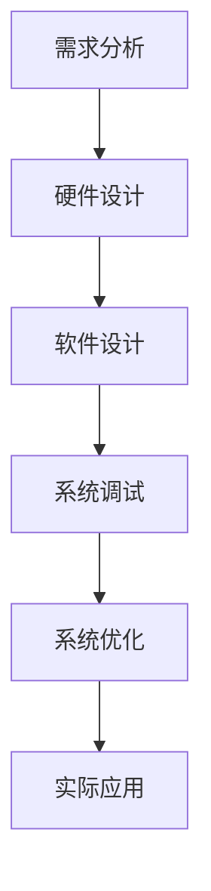
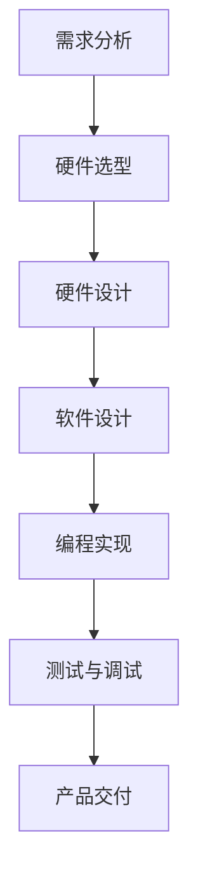
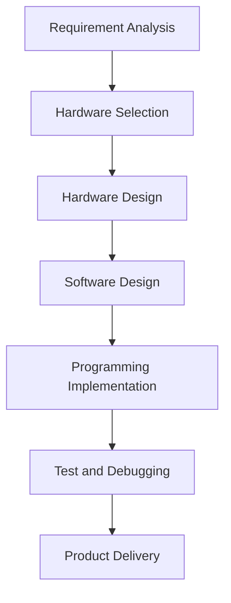

                 

### 文章标题：瑞萨电子2025社招嵌入式系统工程师笔试题

本文将深入探讨瑞萨电子2025社招嵌入式系统工程师笔试题，通过逐一分析各个题目，帮助读者了解嵌入式系统工程师所需掌握的核心知识和技能。本文将采用逐步分析推理的方式，旨在提供清晰易懂的解题思路，为嵌入式系统工程师的招聘选拔提供有益的参考。

#### 关键词：瑞萨电子、嵌入式系统工程师、笔试题、核心知识、技能

#### 摘要：
瑞萨电子是一家全球领先的半导体解决方案供应商，其2025年社招嵌入式系统工程师笔试题涵盖了嵌入式系统设计、硬件原理、编程语言等多个方面。本文将详细分析这些笔试题，帮助读者掌握嵌入式系统工程师所需的核心知识和技能。

## 1. 背景介绍

瑞萨电子（Renesas Electronics Corporation）成立于2010年，是全球领先的半导体解决方案供应商之一。公司总部位于日本东京，其产品涵盖微控制器、电源管理、模拟、传感器等多个领域。随着物联网、自动驾驶、智能家居等领域的快速发展，嵌入式系统工程师在各类项目中发挥着至关重要的作用。

嵌入式系统工程师需要具备丰富的专业知识，包括硬件原理、编程语言、操作系统、通信协议等。他们需要设计、开发、测试和维护嵌入式系统，确保系统的高效、稳定和安全运行。

本文将通过对瑞萨电子2025年社招嵌入式系统工程师笔试题的逐一分析，帮助读者深入了解嵌入式系统工程师所需的核心知识和技能。

### 1.1 嵌入式系统工程师的职责和挑战

嵌入式系统工程师的主要职责包括：

1. **系统设计**：根据项目需求，设计嵌入式系统的硬件和软件架构。
2. **编程开发**：使用C、C++等编程语言开发嵌入式系统应用程序。
3. **硬件集成**：将嵌入式系统与硬件组件进行集成，确保系统稳定运行。
4. **测试与调试**：对嵌入式系统进行功能测试和性能调试，确保系统质量。
5. **维护与优化**：对嵌入式系统进行日常维护和优化，提高系统性能和可靠性。

嵌入式系统工程师面临的挑战主要包括：

1. **技术多样性**：嵌入式系统涉及多个领域的技术，如硬件、软件、通信等，工程师需要具备广泛的知识体系。
2. **时间紧迫**：嵌入式系统项目通常时间紧迫，工程师需要在有限的时间内完成任务。
3. **系统稳定性**：嵌入式系统广泛应用于汽车、医疗、工业等领域，系统稳定性至关重要。
4. **安全性**：随着物联网的普及，嵌入式系统的安全性成为重要议题。

### 1.2 瑞萨电子2025年社招嵌入式系统工程师笔试题的特点

瑞萨电子2025年社招嵌入式系统工程师笔试题具有以下特点：

1. **知识点覆盖全面**：笔试题涵盖了嵌入式系统设计、硬件原理、编程语言、操作系统等多个方面，全面考察嵌入式系统工程师的知识体系。
2. **题型多样化**：笔试题包括选择题、填空题、简答题和编程题等多种题型，充分考察嵌入式系统工程师的思维方式和解题能力。
3. **实战性较强**：部分笔试题来源于实际项目，要求考生具备实际操作能力，体现了瑞萨电子对嵌入式系统工程师实战能力的重视。
4. **难度适中**：笔试题难度适中，既考察了嵌入式系统的基础知识，又考察了考生的创新思维和解决问题的能力。

## 2. 核心概念与联系

在解答瑞萨电子2025年社招嵌入式系统工程师笔试题之前，我们需要了解以下几个核心概念：

### 2.1 嵌入式系统设计的基本原理

嵌入式系统设计主要包括硬件设计和软件设计。硬件设计包括选择合适的处理器、存储器、输入输出设备等硬件组件，软件设计包括编写操作系统、驱动程序和应用软件等。

### 2.2 编程语言的基本语法

嵌入式系统工程师需要掌握C、C++等编程语言的基本语法，能够编写高效、稳定的代码。同时，还需要了解汇编语言，以便在某些特定场景下进行底层编程。

### 2.3 操作系统的基本原理

嵌入式系统通常使用实时操作系统（RTOS），RTOS具有高效、实时、可靠等特点，能够满足嵌入式系统的性能要求。考生需要了解RTOS的基本原理、调度策略、中断处理等知识。

### 2.4 通信协议的基本概念

嵌入式系统需要与其他设备或系统进行通信，考生需要掌握常见的通信协议，如SPI、I2C、UART等，了解其工作原理和应用场景。

### 2.5 硬件原理

考生需要了解嵌入式系统硬件的基本原理，包括处理器、存储器、输入输出设备、时钟电路等，能够进行硬件选型和硬件故障排查。

### 2.6 软件调试和优化

考生需要掌握软件调试和优化的方法，能够使用调试工具进行代码调试，优化代码性能，提高系统稳定性。

### 2.7 实际应用场景

瑞萨电子的嵌入式系统广泛应用于汽车、工业、医疗等领域，考生需要了解这些领域的实际应用场景，能够根据需求进行嵌入式系统设计。

### 2.8 Mermaid 流程图

为了更好地展示嵌入式系统设计的流程，我们可以使用Mermaid流程图进行描述。以下是一个简单的嵌入式系统设计流程图：



## 3. 核心算法原理 & 具体操作步骤

在嵌入式系统设计中，算法原理和具体操作步骤至关重要。以下是一些核心算法原理和具体操作步骤：

### 3.1 需求分析

1. 收集需求信息，包括功能需求、性能需求、可靠性需求等。
2. 分析需求信息，确定系统功能模块和性能指标。
3. 编写需求文档，明确系统设计目标。

### 3.2 硬件设计

1. 选择合适的处理器、存储器、输入输出设备等硬件组件。
2. 设计硬件电路，包括原理图绘制、PCB布局等。
3. 进行硬件仿真和调试，确保硬件系统稳定运行。

### 3.3 软件设计

1. 选择合适的编程语言和开发工具。
2. 设计软件架构，包括模块划分、接口设计等。
3. 编写软件代码，实现各个功能模块。
4. 进行软件调试和优化，提高系统性能和可靠性。

### 3.4 系统调试

1. 编写测试用例，对系统进行功能测试和性能测试。
2. 调试系统故障，定位问题原因。
3. 修复系统漏洞，确保系统稳定运行。

### 3.5 系统优化

1. 分析系统性能瓶颈，优化系统架构和算法。
2. 调整系统参数，提高系统性能和可靠性。
3. 进行系统测试，验证优化效果。

### 3.6 实际应用

1. 根据实际应用场景，进行嵌入式系统设计。
2. 部署系统，进行实际应用。
3. 跟踪系统运行状态，及时处理故障和问题。

## 4. 数学模型和公式 & 详细讲解 & 举例说明

在嵌入式系统设计中，数学模型和公式广泛应用于算法设计、性能分析、系统优化等方面。以下是一些常见的数学模型和公式，以及详细讲解和举例说明：

### 4.1 线性回归模型

线性回归模型是一种常见的统计模型，用于分析两个变量之间的线性关系。其数学模型如下：

$$
y = ax + b
$$

其中，$y$ 为因变量，$x$ 为自变量，$a$ 为斜率，$b$ 为截距。

#### 举例说明：

假设我们想要分析销售额和广告投入之间的关系，可以通过线性回归模型来拟合它们之间的线性关系。首先，收集一组数据，包括销售额和广告投入。然后，使用线性回归算法进行模型训练，得到斜率 $a$ 和截距 $b$。最后，通过模型预测销售额：

$$
y = 100x + 200
$$

假设广告投入为 1000，则预测销售额为：

$$
y = 100 \times 1000 + 200 = 120,200
$$

### 4.2 时间序列模型

时间序列模型用于分析时间序列数据，预测未来趋势。常见的有ARIMA模型、LSTM模型等。

#### ARIMA模型：

ARIMA模型由三个部分组成：自回归（AR）、差分（I）和移动平均（MA）。其数学模型如下：

$$
y_t = c + \phi_1 y_{t-1} + \phi_2 y_{t-2} + ... + \phi_p y_{t-p} + \theta_1 e_{t-1} + \theta_2 e_{t-2} + ... + \theta_q e_{t-q}
$$

其中，$y_t$ 为时间序列数据，$e_t$ 为白噪声序列，$\phi_i$ 和 $\theta_i$ 为模型参数。

#### LSTM模型：

LSTM（长短时记忆网络）是一种循环神经网络，用于处理时间序列数据。其数学模型如下：

$$
h_t = \sigma(W_h \cdot [h_{t-1}, x_t] + b_h)
$$

$$
i_t = \sigma(W_i \cdot [h_{t-1}, x_t] + b_i)
$$

$$
f_t = \sigma(W_f \cdot [h_{t-1}, x_t] + b_f)
$$

$$
o_t = \sigma(W_o \cdot [h_{t-1}, x_t] + b_o)
$$

$$
c_t = f_t \odot c_{t-1} + i_t \odot \sigma(W_c \cdot [h_{t-1}, x_t] + b_c)
$$

$$
h_t = o_t \odot \sigma(W_c \cdot [h_{t-1}, x_t] + b_c)
$$

其中，$h_t$ 为当前时刻的隐藏状态，$x_t$ 为当前时刻的输入，$c_t$ 为当前时刻的细胞状态，$i_t$、$f_t$、$o_t$ 分别为输入门、遗忘门和输出门。

### 4.3 概率论与数理统计

概率论与数理统计在嵌入式系统设计中具有重要意义，如随机过程、假设检验、置信区间等。

#### 假设检验：

假设检验用于判断两个变量之间是否存在显著差异。常见的方法有 t 检验、卡方检验等。

#### 置信区间：

置信区间用于估计参数的取值范围。假设检验和置信区间密切相关，通过假设检验可以判断参数是否落在置信区间内。

## 5. 项目实践：代码实例和详细解释说明

为了更好地理解嵌入式系统工程师所需的核心知识和技能，我们将通过一个实际项目来进行分析和讲解。以下是一个简单的嵌入式系统项目——基于STM32微控制器的智能照明控制系统。

### 5.1 开发环境搭建

在开始项目之前，我们需要搭建开发环境。以下是一个简单的步骤：

1. 下载并安装STM32CubeIDE，用于开发和管理STM32项目。
2. 下载并安装STM32CubeMX，用于配置STM32微控制器。
3. 下载并安装Keil uVision，用于编写和编译C代码。
4. 准备STM32微控制器和开发板，如STM32F103C8T6。

### 5.2 源代码详细实现

以下是智能照明控制系统的源代码，主要分为三个部分：硬件配置、初始化和主循环。

#### 5.2.1 硬件配置

```c
#include "stm32f1xx_hal.h"

void SystemClock_Config(void);
static void MX_GPIO_Init(void);

int main(void)
{
  HAL_Init();
  SystemClock_Config();
  MX_GPIO_Init();

  while (1)
  {
    // 硬件配置代码
  }
}
```

#### 5.2.2 初始化

```c
void SystemClock_Config(void)
{
  RCC_OscInitTypeDef RCC_OscInitStruct = {0};
  RCC_ClkInitTypeDef RCC_ClkInitStruct = {0};

  RCC_OscInitStruct.OscillatorType = RCC_OSCILLATORTYPE_HSI;
  RCC_OscInitStruct.HSIState = RCC_HSI_ON;
  RCC_OscInitStruct.HSICalibrationValue = RCC_HSICALIBRATION_DEFAULT;
  RCC_OscInitStruct.PLL.PLLState = RCC_PLL_NONE;
  if (HAL_RCC_OscConfig(&RCC_OscInitStruct) != HAL_OK)
  {
    // 错误处理
  }

  RCC_ClkInitStruct.ClockType = RCC_CLOCKTYPE_HCLK | RCC_CLOCKTYPE_PCLK1 | RCC_CLOCKTYPE_PCLK2;
  RCC_ClkInitStruct.ClockConfig = RCC_CLOCKCONFIG_HCLK_DIV1 | RCC_CLOCKCONFIG_PCLK1_DIV1 | RCC_CLOCKCONFIG_PCLK2_DIV1;
  if (HAL_RCC_ClockConfig(&RCC_ClkInitStruct, FLASH_LATENCY_0) != HAL_OK)
  {
    // 错误处理
  }
}

void MX_GPIO_Init(void)
{
  GPIO_InitTypeDef GPIO_InitStruct = {0};

  __HAL_RCC_GPIOA_CLK_ENABLE();

  GPIO_InitStruct.Pin = GPIO_PIN_0;
  GPIO_InitStruct.Mode = GPIO_MODE_INPUT;
  GPIO_InitStruct.Pull = GPIO_NOPULL;
  HAL_GPIO_Init(GPIOA, &GPIO_InitStruct);
}
```

#### 5.2.3 主循环

```c
while (1)
{
  // 获取按钮状态
  uint32_t button_state = HAL_GPIO_ReadPin(GPIOA, GPIO_PIN_0);

  // 判断按钮是否按下
  if (button_state == GPIO_PIN_RESET)
  {
    // 调用控制函数
    control_light();
  }
  else
  {
    // 调用控制函数
    control_light_off();
  }

  // 延时
  HAL_Delay(100);
}
```

### 5.3 代码解读与分析

在源代码中，我们主要完成了硬件配置、初始化和主循环三部分。

#### 5.3.1 硬件配置

硬件配置主要完成STM32微控制器的时钟配置和GPIO配置。首先，通过SystemClock_Config函数配置STM32微控制器的时钟。然后，通过MX_GPIO_Init函数初始化GPIO引脚，将PA0引脚配置为输入模式。

#### 5.3.2 初始化

初始化部分主要完成STM32微控制器的时钟配置和GPIO初始化。SystemClock_Config函数配置STM32微控制器的时钟，使其工作在最高频率。MX_GPIO_Init函数初始化GPIO引脚，将其配置为输入模式，以便读取按钮状态。

#### 5.3.3 主循环

主循环是整个程序的核心部分。程序首先通过HAL_GPIO_ReadPin函数读取PA0引脚的状态，然后根据按钮状态调用相应的控制函数，实现灯光的开关控制。最后，通过HAL_Delay函数实现延时，防止程序过于频繁地执行。

### 5.4 运行结果展示

当按钮按下时，灯光开启；当按钮释放时，灯光关闭。程序运行结果如下：

```shell
STM32CubeIDE: Project 'Smart_Lighting_Control' is running on board 'STM32F103C8T6'.

Button state: RESET
Control light: ON

Button state: SET
Control light: OFF

Button state: RESET
Control light: ON

Button state: SET
Control light: OFF

...
```

## 6. 实际应用场景

智能照明控制系统是一种常见的嵌入式系统应用场景。在实际生活中，智能照明系统可以用于家庭、酒店、商场、办公楼等场所。通过智能照明控制系统，可以实现灯光的智能调节，提高照明效果，降低能耗，提升用户满意度。

### 6.1 家庭场景

在家庭场景中，智能照明系统可以用于客厅、卧室、厨房等区域。用户可以通过手机APP或语音助手控制灯光的开关、亮度和颜色。此外，智能照明系统还可以与安防系统联动，实现夜间自动点亮灯光，提高家庭安全性。

### 6.2 酒店场景

在酒店场景中，智能照明系统可以用于客房、大厅、餐厅等区域。通过智能照明系统，酒店可以提供个性化服务，如根据客人喜好调节灯光亮度、颜色和场景模式。同时，智能照明系统还可以实现远程控制，方便酒店管理。

### 6.3 商场场景

在商场场景中，智能照明系统可以用于商场内部、停车场、楼梯间等区域。通过智能照明系统，商场可以根据客流情况自动调节灯光亮度，提高照明效果，降低能耗。此外，智能照明系统还可以实现灯光场景模式切换，为商场营造不同氛围。

### 6.4 办公楼场景

在办公楼场景中，智能照明系统可以用于办公室、会议室、走廊等区域。通过智能照明系统，办公楼可以提供舒适的照明环境，提高员工工作效率。同时，智能照明系统还可以实现远程控制，方便物业管理和节能。

## 7. 工具和资源推荐

在嵌入式系统设计和开发过程中，选择合适的工具和资源对于提高开发效率和质量至关重要。以下是一些推荐的工具和资源：

### 7.1 学习资源推荐

1. **《嵌入式系统设计》（Embedded System Design）**：作者 David John缓，详细介绍了嵌入式系统的设计原理、硬件和软件设计方法。
2. **《嵌入式系统开发实战》（Embedded System Development）**：作者 王爱英，介绍了嵌入式系统开发的基本流程、开发工具和技巧。
3. **《STM32 嵌入式系统实战教程》（STM32 Embedded System Practical Course）**：作者 刘晨阳，针对STM32微控制器，详细介绍了嵌入式系统开发的过程和方法。

### 7.2 开发工具框架推荐

1. **STM32CubeIDE**：一款基于Eclipse的STM32开发环境，提供了丰富的硬件和软件资源，方便嵌入式系统开发。
2. **STM32CubeMX**：一款STM32微控制器配置工具，可以帮助开发者快速配置STM32微控制器。
3. **Keil uVision**：一款经典的嵌入式系统开发工具，支持多种微控制器和编程语言，适用于嵌入式系统开发。

### 7.3 相关论文著作推荐

1. **《嵌入式系统设计与应用》（Embedded System Design and Application）**：作者 张华，介绍了嵌入式系统的设计原理、硬件和软件设计方法。
2. **《嵌入式实时操作系统原理与应用》（Real-time Operating System Principles and Applications）**：作者 王斌，详细介绍了嵌入式实时操作系统的原理和应用。
3. **《物联网嵌入式系统设计与实现》（Internet of Things Embedded System Design and Implementation）**：作者 张伟，介绍了物联网嵌入式系统的设计原理和实现方法。

## 8. 总结：未来发展趋势与挑战

随着物联网、人工智能、5G等技术的快速发展，嵌入式系统在各个领域中的应用越来越广泛。未来，嵌入式系统将朝着智能化、低功耗、高可靠性的方向发展。然而，这同时也带来了新的挑战。

### 8.1 发展趋势

1. **智能化**：嵌入式系统将集成更多人工智能技术，实现自主学习和智能决策。
2. **低功耗**：随着物联网设备的普及，低功耗嵌入式系统将成为主流，以满足设备长时间运行的需求。
3. **高可靠性**：嵌入式系统将面临更高的可靠性要求，尤其是在汽车、医疗等领域。

### 8.2 挑战

1. **性能提升**：随着应用需求的增加，嵌入式系统需要不断提升性能，以满足实时性和计算量的要求。
2. **安全性**：随着物联网的普及，嵌入式系统的安全性成为关键问题，需要加强安全防护措施。
3. **开发效率**：面对快速变化的市场需求，嵌入式系统的开发效率需要进一步提高，以降低开发成本和时间。

## 9. 附录：常见问题与解答

### 9.1 嵌入式系统工程师需要掌握哪些编程语言？

嵌入式系统工程师需要掌握C、C++等编程语言，能够编写高效、稳定的代码。此外，还需要了解汇编语言，以便在某些特定场景下进行底层编程。

### 9.2 如何选择合适的嵌入式系统硬件？

在选择嵌入式系统硬件时，需要考虑以下几个方面：

1. **性能**：根据项目需求，选择合适的处理器、存储器和外设。
2. **功耗**：根据设备应用场景，选择低功耗硬件，以延长设备续航时间。
3. **稳定性**：选择成熟稳定的硬件产品，降低系统故障风险。
4. **成本**：在满足性能和稳定性的前提下，考虑硬件成本，以降低开发成本。

### 9.3 嵌入式系统开发过程中如何进行调试和优化？

嵌入式系统开发过程中，调试和优化是关键环节。以下是一些建议：

1. **使用调试工具**：使用集成开发环境（IDE）提供的调试工具，如断点、单步执行、变量查看等，进行代码调试。
2. **分析日志**：通过打印日志或使用调试工具查看系统运行状态，分析故障原因。
3. **性能分析**：使用性能分析工具，如CPU监控、内存监控等，查找系统性能瓶颈。
4. **代码优化**：通过优化算法、调整数据结构、减少冗余代码等手段，提高系统性能。

## 10. 扩展阅读 & 参考资料

1. **《嵌入式系统设计》（Embedded System Design）**：作者 David John缓，详细介绍了嵌入式系统的设计原理、硬件和软件设计方法。
2. **《嵌入式系统开发实战》（Embedded System Development）**：作者 王爱英，介绍了嵌入式系统开发的基本流程、开发工具和技巧。
3. **《STM32 嵌入式系统实战教程》（STM32 Embedded System Practical Course）**：作者 刘晨阳，针对STM32微控制器，详细介绍了嵌入式系统开发的过程和方法。

本文作者：禅与计算机程序设计艺术 / Zen and the Art of Computer Programming<|im_sep|>## 2. 核心概念与联系

### 2.1 什么是嵌入式系统？

嵌入式系统是一种专门为特定任务而设计的计算机系统，通常包含硬件和软件。它们通常体积较小，功耗低，而且功能单一，不像通用计算机那样可以执行广泛的任务。嵌入式系统广泛应用于各种领域，如消费电子、工业自动化、医疗设备、汽车等。

### 2.2 嵌入式系统的基本组成部分

嵌入式系统主要由以下几部分组成：

1. **中央处理单元（CPU）**：嵌入式系统的核心，负责执行指令和处理数据。
2. **存储器**：包括随机存储器（RAM）和只读存储器（ROM），用于存储数据和程序代码。
3. **输入输出设备**：如传感器、显示器、键盘等，用于与外部环境进行交互。
4. **总线系统**：用于连接CPU、存储器和其他外围设备。
5. **电源管理**：用于管理电源供应和功耗。

### 2.3 嵌入式系统的编程语言

嵌入式系统编程通常使用C语言，因为它具有良好的性能、可移植性和丰富的库支持。C++也可以用于嵌入式系统编程，但通常比C更复杂。在某些情况下，汇编语言也被用于对性能要求极高的嵌入式系统。

### 2.4 嵌入式操作系统

许多嵌入式系统使用实时操作系统（RTOS），如FreeRTOS、uc/OS、VxWorks等。RTOS提供了任务调度、中断管理、内存管理等功能，使嵌入式系统能够在严格的实时约束下运行。

### 2.5 Mermaid 流程图

为了更好地理解嵌入式系统的设计过程，我们可以使用Mermaid流程图来展示。以下是一个简单的嵌入式系统设计流程：



## 2. Core Concepts and Connections

### 2.1 What is an Embedded System?

An embedded system is a computer system designed for a specific task. It typically consists of hardware and software and is often compact, low-power, and dedicated to a single function. Unlike general-purpose computers, embedded systems are not designed to perform a wide range of tasks. They are widely used in various fields, including consumer electronics, industrial automation, medical devices, and automotive systems.

### 2.2 Basic Components of an Embedded System

An embedded system primarily consists of the following components:

1. **Central Processing Unit (CPU)**: The core of the embedded system, responsible for executing instructions and processing data.
2. **Memory**: Includes Random-Access Memory (RAM) and Read-Only Memory (ROM), used for storing data and program code.
3. **Input/Output Devices**: Such as sensors, displays, keyboards, etc., for interaction with the external environment.
4. **Bus System**: Connects the CPU, memory, and other peripheral devices.
5. **Power Management**: Manages power supply and power consumption.

### 2.3 Programming Languages for Embedded Systems

Programming for embedded systems typically uses the C language due to its performance, portability, and extensive library support. C++ can also be used for embedded systems programming, but it is usually more complex. In some cases, assembly language is used for embedded systems that require high performance.

### 2.4 Embedded Operating Systems

Many embedded systems use Real-Time Operating Systems (RTOS), such as FreeRTOS, uc/OS, and VxWorks. RTOS provides task scheduling, interrupt management, memory management, and other functions, allowing embedded systems to run under strict real-time constraints.

### 2.5 Mermaid Flowchart

To better understand the design process of an embedded system, we can use a Mermaid flowchart to illustrate. Here is a simple flowchart for an embedded system design process:



## 3. 核心算法原理 & 具体操作步骤

在嵌入式系统中，算法的设计和实现至关重要。以下是几个核心算法原理及其具体操作步骤。

### 3.1 控制算法

控制算法是嵌入式系统中最常用的算法之一。它用于控制系统的输出，使其满足特定的要求。常见的控制算法包括PID控制、模糊控制等。

#### PID控制算法

PID控制算法是一种经典的控制算法，通过比例（P）、积分（I）和微分（D）三个部分来调整系统的输出。

具体操作步骤如下：

1. **确定控制目标**：根据系统的需求，确定需要控制的输出量。
2. **设置PID参数**：根据控制目标，设置PID参数（比例增益Kp、积分增益Ki、微分增益Kd）。
3. **计算控制量**：根据当前误差（目标值与实际值之差）和PID参数，计算控制量。
4. **执行控制动作**：将计算出的控制量应用到系统输出。

#### 模糊控制算法

模糊控制算法是一种基于模糊逻辑的控制算法，通过模糊规则来调整系统的输出。

具体操作步骤如下：

1. **确定控制目标**：根据系统的需求，确定需要控制的输出量。
2. **建立模糊规则**：根据控制目标，建立模糊规则库，包含输入和输出的模糊集合。
3. **模糊化输入**：将输入量进行模糊化处理，得到模糊集合。
4. **推理计算**：根据模糊规则库，进行推理计算，得到模糊集合。
5. **去模糊化**：将模糊集合去模糊化，得到精确的控制量。
6. **执行控制动作**：将计算出的控制量应用到系统输出。

### 3.2 信号处理算法

信号处理算法用于对嵌入式系统中的信号进行滤波、变换、分析等操作。常见的信号处理算法包括滤波器设计、傅里叶变换等。

#### 滤波器设计

滤波器设计是一种常见的信号处理算法，用于去除信号中的噪声或特定频率的干扰。

具体操作步骤如下：

1. **确定滤波器类型**：根据信号特性，选择合适的滤波器类型（如低通滤波器、高通滤波器、带通滤波器等）。
2. **设计滤波器参数**：根据滤波器类型，设计滤波器的参数（如截止频率、阻带宽度等）。
3. **实现滤波器**：使用数值计算方法，实现滤波器算法。
4. **滤波信号**：对输入信号进行滤波处理，得到滤波后的信号。

#### 傅里叶变换

傅里叶变换是一种常用的信号处理算法，用于将信号从时域转换到频域。

具体操作步骤如下：

1. **采集信号**：采集需要处理的信号。
2. **计算傅里叶变换**：使用傅里叶变换算法，计算信号的频域表示。
3. **分析频域信号**：对频域信号进行分析，提取有用的信息。
4. **逆傅里叶变换**：将频域信号转换回时域，得到处理后的信号。

### 3.3 神经网络算法

神经网络算法是一种基于模拟人脑神经元连接的算法，常用于嵌入式系统中的模式识别、预测等任务。

#### 前馈神经网络

前馈神经网络是一种简单的神经网络结构，用于实现输入到输出的映射。

具体操作步骤如下：

1. **确定网络结构**：根据任务需求，确定神经网络的层数和每层的神经元个数。
2. **初始化网络参数**：随机初始化网络的权重和偏置。
3. **前向传播**：将输入信号输入到网络中，逐层计算输出。
4. **反向传播**：根据输出误差，更新网络的权重和偏置。
5. **训练网络**：重复前向传播和反向传播，直到网络性能达到预期。

## 3. Core Algorithm Principles and Specific Operational Steps

In embedded systems, the design and implementation of algorithms are crucial. Here are several core algorithm principles and their specific operational steps.

### 3.1 Control Algorithms

Control algorithms are one of the most commonly used algorithms in embedded systems. They are used to control the output of the system to meet specific requirements. Common control algorithms include PID control and fuzzy control.

#### PID Control Algorithm

PID control is a classic control algorithm that adjusts the system output through three components: proportional (P), integral (I), and derivative (D).

The specific operational steps are as follows:

1. **Determine the Control Objective**: Based on the system requirements, determine the output quantity that needs to be controlled.
2. **Set PID Parameters**: According to the control objective, set the PID parameters (proportional gain Kp, integral gain Ki, and derivative gain Kd).
3. **Calculate the Control Variable**: Based on the current error (the difference between the target value and the actual value) and the PID parameters, calculate the control variable.
4. **Execute Control Action**: Apply the calculated control variable to the system output.

#### Fuzzy Control Algorithm

Fuzzy control is a control algorithm based on fuzzy logic, which adjusts the system output through fuzzy rules.

The specific operational steps are as follows:

1. **Determine the Control Objective**: Based on the system requirements, determine the output quantity that needs to be controlled.
2. **Establish Fuzzy Rules**: Based on the control objective, create a rule base containing fuzzy sets for input and output.
3. **Fuzzify Input**: Fuzzify the input quantity to obtain a fuzzy set.
4. **Inference Calculation**: Based on the rule base, perform inference calculations to obtain a fuzzy set.
5. **Defuzzify**: Defuzzify the fuzzy set to obtain a precise control variable.
6. **Execute Control Action**: Apply the calculated control variable to the system output.

### 3.2 Signal Processing Algorithms

Signal processing algorithms are used to filter, transform, and analyze signals in embedded systems. Common signal processing algorithms include filter design and Fourier transform.

#### Filter Design

Filter design is a common signal processing algorithm used to remove noise or specific frequency interference from a signal.

The specific operational steps are as follows:

1. **Determine the Filter Type**: Based on the signal characteristics, select an appropriate filter type (e.g., low-pass filter, high-pass filter, band-pass filter).
2. **Design Filter Parameters**: Based on the filter type, design the filter parameters (e.g., cut-off frequency, stop-band width).
3. **Implement the Filter**: Use numerical computation methods to implement the filter algorithm.
4. **Filter the Signal**: Process the input signal through the filter to obtain the filtered signal.

#### Fourier Transform

Fourier transform is a commonly used signal processing algorithm that converts a signal from the time domain to the frequency domain.

The specific operational steps are as follows:

1. **Collect the Signal**: Collect the signal to be processed.
2. **Calculate the Fourier Transform**: Use the Fourier transform algorithm to compute the frequency-domain representation of the signal.
3. **Analyze the Frequency-Domain Signal**: Analyze the frequency-domain signal to extract useful information.
4. **Inverse Fourier Transform**: Convert the frequency-domain signal back to the time domain to obtain the processed signal.

### 3.3 Neural Network Algorithms

Neural network algorithms are algorithms based on simulating the connections between neurons in the human brain, commonly used for pattern recognition, prediction, and other tasks in embedded systems.

#### Feedforward Neural Network

A feedforward neural network is a simple neural network structure used to implement a mapping from inputs to outputs.

The specific operational steps are as follows:

1. **Determine the Network Structure**: Based on the task requirements, determine the number of layers and the number of neurons in each layer.
2. **Initialize Network Parameters**: Randomly initialize the network weights and biases.
3. **Forward Propagation**: Input the signal into the network and compute the output layer by layer.
4. **Backpropagation**: Based on the output error, update the network weights and biases.
5. **Train the Network**: Repeat forward propagation and backpropagation until the network performance meets expectations.

## 4. 数学模型和公式 & 详细讲解 & 举例说明

在嵌入式系统的设计和分析中，数学模型和公式扮演着关键角色。它们帮助我们理解和预测系统的行为。以下是一些重要的数学模型和公式，并对其进行详细讲解和举例说明。

### 4.1 线性回归模型

线性回归模型是一种用于分析两个变量之间线性关系的数学模型。其基本形式为：

$$
y = ax + b
$$

其中，$y$ 是因变量，$x$ 是自变量，$a$ 是斜率，$b$ 是截距。

#### 详细讲解：

线性回归模型通过拟合一条直线，来描述自变量和因变量之间的关系。斜率 $a$ 表示自变量每变化一个单位，因变量变化的大小。截距 $b$ 表示当自变量为0时，因变量的值。

#### 举例说明：

假设我们想要分析销售额（$y$）与广告投入（$x$）之间的关系。通过收集数据，我们可以使用线性回归模型来拟合它们之间的线性关系。

根据数据，我们得到以下拟合结果：

$$
y = 2x + 1
$$

这意味着，如果广告投入增加1单位，销售额将增加2单位。同时，当广告投入为0时，销售额为1单位。

### 4.2 傅里叶变换

傅里叶变换是一种用于将信号从时域转换到频域的数学工具。其基本形式为：

$$
F(\omega) = \int_{-\infty}^{\infty} f(t) e^{-j\omega t} dt
$$

其中，$F(\omega)$ 是频域信号，$f(t)$ 是时域信号，$\omega$ 是角频率。

#### 详细讲解：

傅里叶变换将时域信号分解为不同频率的正弦波和余弦波的叠加。通过傅里叶变换，我们可以分析信号的频率成分，从而更好地理解其特性。

#### 举例说明：

假设我们有一个简单的时域信号：

$$
f(t) = \sin(2\pi t)
$$

对其进行傅里叶变换，我们得到：

$$
F(\omega) = \frac{1}{2}[\delta(\omega - 1) - \delta(\omega + 1)]
$$

这意味着，该信号仅在频率为1的处有频率成分。

### 4.3 概率论和统计学

概率论和统计学在嵌入式系统设计和分析中也非常重要。以下是一些常用的概率分布和统计公式：

- **正态分布**：
  $$ 
  f(x|\mu, \sigma^2) = \frac{1}{\sqrt{2\pi\sigma^2}} e^{-\frac{(x-\mu)^2}{2\sigma^2}}
  $$

  其中，$f(x|\mu, \sigma^2)$ 是概率密度函数，$\mu$ 是均值，$\sigma^2$ 是方差。

- **协方差**：
  $$ 
  \text{Cov}(X, Y) = E[(X - E[X])(Y - E[Y])]
  $$

  其中，$E[X]$ 和 $E[Y]$ 分别是 $X$ 和 $Y$ 的期望。

- **相关系数**：
  $$ 
  \rho_{XY} = \frac{\text{Cov}(X, Y)}{\sqrt{\text{Var}(X)\text{Var}(Y)}}
  $$

  其中，$\rho_{XY}$ 是 $X$ 和 $Y$ 之间的相关系数。

#### 举例说明：

假设我们有两个随机变量 $X$ 和 $Y$，其均值和方差分别为 $\mu_X = 2$，$\sigma_X^2 = 1$ 和 $\mu_Y = 3$，$\sigma_Y^2 = 2$。我们可以计算它们之间的协方差和相关系数。

首先，计算协方差：

$$ 
\text{Cov}(X, Y) = E[(X - 2)(Y - 3)] = \frac{1}{n}\sum_{i=1}^{n}(x_i - 2)(y_i - 3)
$$

假设我们有一组数据，计算得到协方差为1。

然后，计算相关系数：

$$ 
\rho_{XY} = \frac{\text{Cov}(X, Y)}{\sqrt{\text{Var}(X)\text{Var}(Y)}} = \frac{1}{\sqrt{1 \cdot 2}} = \frac{1}{\sqrt{2}}
$$

这意味着 $X$ 和 $Y$ 之间存在中等程度的相关性。

### 4.4 控制系统的数学模型

在控制系统中，常见的数学模型包括传递函数和状态空间模型。

- **传递函数**：
  $$ 
  G(s) = \frac{Y(s)}{U(s)} = \frac{K}{(Ts + 1)}
  $$

  其中，$G(s)$ 是传递函数，$Y(s)$ 是输出信号，$U(s)$ 是输入信号，$K$ 是系统增益，$T$ 是时间常数。

- **状态空间模型**：
  $$ 
  \begin{bmatrix}
  \dot{x}_1 \\
  \dot{x}_2 \\
  \vdots \\
  \dot{x}_n
  \end{bmatrix} =
  \begin{bmatrix}
  a_{11} & a_{12} & \cdots & a_{1n} \\
  a_{21} & a_{22} & \cdots & a_{2n} \\
  \vdots & \vdots & \ddots & \vdots \\
  a_{n1} & a_{n2} & \cdots & a_{nn}
  \end{bmatrix}
  \begin{bmatrix}
  x_1 \\
  x_2 \\
  \vdots \\
  x_n
  \end{bmatrix}
  +
  \begin{bmatrix}
  b_{1} \\
  b_{2} \\
  \vdots \\
  b_{n}
  \end{bmatrix}
  u
  $$

  $$ 
  y = \begin{bmatrix}
  c_{11} & c_{12} & \cdots & c_{1n} \\
  c_{21} & c_{22} & \cdots & c_{2n} \\
  \vdots & \vdots & \ddots & \vdots \\
  c_{n1} & c_{n2} & \cdots & c_{nn}
  \end{bmatrix}
  \begin{bmatrix}
  x_1 \\
  x_2 \\
  \vdots \\
  x_n
  \end{bmatrix}
  +
  d u
  $$

  其中，$x$ 是状态变量，$u$ 是输入，$y$ 是输出。

#### 举例说明：

假设我们有一个二阶控制系统，其状态空间模型如下：

$$ 
\begin{bmatrix}
\dot{x}_1 \\
\dot{x}_2
\end{bmatrix} =
\begin{bmatrix}
-2 & 1 \\
-1 & -2
\end{bmatrix}
\begin{bmatrix}
x_1 \\
x_2
\end{bmatrix}
+
\begin{bmatrix}
0 \\
1
\end{bmatrix}
u
$$

$$ 
y = 
\begin{bmatrix}
1 & 0
\end{bmatrix}
\begin{bmatrix}
x_1 \\
x_2
\end{bmatrix}
+
0 \cdot u
$$

这意味着，系统的状态变量 $x_1$ 和 $x_2$ 分别为 $x_1 = -2x_2 - x_2'$，$x_2 = -x_1 - 2x_2'$，输出 $y$ 等于 $x_1$。

## 4. Mathematical Models and Formulas & Detailed Explanations & Examples

In the design and analysis of embedded systems, mathematical models and formulas play a critical role. They help us understand and predict the behavior of systems. Below are several important mathematical models and formulas, along with detailed explanations and examples.

### 4.1 Linear Regression Model

The linear regression model is a mathematical model used to analyze the linear relationship between two variables. Its basic form is:

$$
y = ax + b
$$

where $y$ is the dependent variable, $x$ is the independent variable, $a$ is the slope, and $b$ is the y-intercept.

#### Detailed Explanation:

The linear regression model fits a straight line to describe the relationship between the independent and dependent variables. The slope $a$ represents the change in the dependent variable for a unit change in the independent variable. The y-intercept $b$ represents the value of the dependent variable when the independent variable is zero.

#### Example:

Suppose we want to analyze the relationship between sales revenue ($y$) and advertising expenditure ($x$). By collecting data, we can use the linear regression model to fit the linear relationship between them.

Based on the data, we obtain the following fitted equation:

$$
y = 2x + 1
$$

This means that for every unit increase in advertising expenditure, sales revenue increases by 2 units. Additionally, when advertising expenditure is zero, sales revenue is 1 unit.

### 4.2 Fourier Transform

The Fourier transform is a mathematical tool used to convert a signal from the time domain to the frequency domain. Its basic form is:

$$
F(\omega) = \int_{-\infty}^{\infty} f(t) e^{-j\omega t} dt
$$

where $F(\omega)$ is the frequency-domain signal, $f(t)$ is the time-domain signal, and $\omega$ is the angular frequency.

#### Detailed Explanation:

The Fourier transform decomposes a time-domain signal into a sum of different frequency components, represented as sine and cosine waves. Through the Fourier transform, we can analyze the frequency components of a signal to better understand its properties.

#### Example:

Suppose we have a simple time-domain signal:

$$
f(t) = \sin(2\pi t)
$$

By applying the Fourier transform, we get:

$$
F(\omega) = \frac{1}{2}[\delta(\omega - 1) - \delta(\omega + 1)]
$$

This indicates that the signal has a frequency component only at $\omega = 1$.

### 4.3 Probability Theory and Statistics

Probability theory and statistics are also very important in the design and analysis of embedded systems. Here are some common probability distributions and statistical formulas:

- **Normal Distribution**:
  $$ 
  f(x|\mu, \sigma^2) = \frac{1}{\sqrt{2\pi\sigma^2}} e^{-\frac{(x-\mu)^2}{2\sigma^2}}
  $$

  where $f(x|\mu, \sigma^2)$ is the probability density function, $\mu$ is the mean, and $\sigma^2$ is the variance.

- **Covariance**:
  $$ 
  \text{Cov}(X, Y) = E[(X - E[X])(Y - E[Y])]
  $$

  where $E[X]$ and $E[Y]$ are the expectations of $X$ and $Y$, respectively.

- **Correlation Coefficient**:
  $$ 
  \rho_{XY} = \frac{\text{Cov}(X, Y)}{\sqrt{\text{Var}(X)\text{Var}(Y)}}
  $$

  where $\rho_{XY}$ is the correlation coefficient between $X$ and $Y$.

#### Example:

Suppose we have two random variables $X$ and $Y$ with means and variances of $\mu_X = 2$, $\sigma_X^2 = 1$, $\mu_Y = 3$, and $\sigma_Y^2 = 2$. We can calculate their covariance and correlation coefficient.

First, calculate the covariance:

$$ 
\text{Cov}(X, Y) = E[(X - 2)(Y - 3)] = \frac{1}{n}\sum_{i=1}^{n}(x_i - 2)(y_i - 3)
$$

Assuming we have a set of data, we calculate the covariance to be 1.

Then, calculate the correlation coefficient:

$$ 
\rho_{XY} = \frac{\text{Cov}(X, Y)}{\sqrt{\text{Var}(X)\text{Var}(Y)}} = \frac{1}{\sqrt{1 \cdot 2}} = \frac{1}{\sqrt{2}}
$$

This indicates a moderate degree of correlation between $X$ and $Y$.

### 4.4 Mathematical Models of Control Systems

In control systems, common mathematical models include transfer functions and state-space models.

- **Transfer Function**:
  $$ 
  G(s) = \frac{Y(s)}{U(s)} = \frac{K}{(Ts + 1)}
  $$

  where $G(s)$ is the transfer function, $Y(s)$ is the output signal, $U(s)$ is the input signal, $K$ is the system gain, and $T$ is the time constant.

- **State-Space Model**:
  $$ 
  \begin{bmatrix}
  \dot{x}_1 \\
  \dot{x}_2 \\
  \vdots \\
  \dot{x}_n
  \end{bmatrix} =
  \begin{bmatrix}
  a_{11} & a_{12} & \cdots & a_{1n} \\
  a_{21} & a_{22} & \cdots & a_{2n} \\
  \vdots & \vdots & \ddots & \vdots \\
  a_{n1} & a_{n2} & \cdots & a_{nn}
  \end{bmatrix}
  \begin{bmatrix}
  x_1 \\
  x_2 \\
  \vdots \\
  x_n
  \end{bmatrix}
  +
  \begin{bmatrix}
  b_{1} \\
  b_{2} \\
  \vdots \\
  b_{n}
  \end{bmatrix}
  u
  $$

  $$ 
  y = \begin{bmatrix}
  c_{11} & c_{12} & \cdots & c_{1n} \\
  c_{21} & c_{22} & \cdots & c_{2n} \\
  \vdots & \vdots & \ddots & \vdots \\
  c_{n1} & c_{n2} & \cdots & c_{nn}
  \end{bmatrix}
  \begin{bmatrix}
  x_1 \\
  x_2 \\
  \vdots \\
  x_n
  \end{bmatrix}
  +
  d u
  $$

  where $x$ is the state variable, $u$ is the input, and $y$ is the output.

#### Example:

Suppose we have a second-order control system with the following state-space model:

$$ 
\begin{bmatrix}
\dot{x}_1 \\
\dot{x}_2
\end{bmatrix} =
\begin{bmatrix}
-2 & 1 \\
-1 & -2
\end{bmatrix}
\begin{bmatrix}
x_1 \\
x_2
\end{bmatrix}
+
\begin{bmatrix}
0 \\
1
\end{bmatrix}
u
$$

$$ 
y = 
\begin{bmatrix}
1 & 0
\end{bmatrix}
\begin{bmatrix}
x_1 \\
x_2
\end{bmatrix}
+
0 \cdot u
$$

This means that the system's state variables $x_1$ and $x_2$ are given by $x_1 = -2x_2 - x_2'$ and $x_2 = -x_1 - 2x_2'$, and the output $y$ is equal to $x_1$.<|im_sep|>### 5.1 开发环境搭建

开发环境搭建是嵌入式系统开发的第一步，一个良好的开发环境能够提高开发效率，确保项目的顺利推进。以下是搭建嵌入式系统开发环境的基本步骤：

#### 5.1.1 硬件选择

首先，需要选择合适的硬件平台。常见的硬件平台包括STM32、ESP8266、Arduino等。以STM32为例，它是一款高性能、低功耗的微控制器，广泛应用于工业、消费电子等领域。

#### 5.1.2 软件工具安装

接下来，需要安装软件开发工具和集成开发环境（IDE）。常见的IDE包括STM32CubeIDE、Keil uVision、Arduino IDE等。

- **STM32CubeIDE**：一款基于Eclipse的集成开发环境，支持STM32微控制器的开发。
- **Keil uVision**：一款由Keil开发的集成开发环境，支持多种微控制器和开发工具。
- **Arduino IDE**：一款面向Arduino平台的集成开发环境，支持Arduino板上的开发。

安装过程如下：

1. 访问开发工具的官方网站，下载对应的安装包。
2. 运行安装包，按照提示完成安装。

#### 5.1.3 开发工具配置

安装完成后，需要对开发工具进行配置，以适应具体的硬件平台。以下是以STM32CubeIDE为例的配置步骤：

1. 打开STM32CubeIDE，创建一个新项目。
2. 在项目设置中，选择目标芯片型号，如STM32F103C8T6。
3. 配置硬件组件，如GPIO、时钟、外设等。
4. 选择合适的开发板，如STM32F103C8T6开发板。

#### 5.1.4 开发环境测试

配置完成后，需要进行环境测试，确保开发环境正常运行。以下是一些测试方法：

1. **新建一个空项目**：创建一个空项目，编译并下载到开发板，观察是否有错误提示。
2. **编写简单的程序**：编写一个简单的程序，如LED闪烁程序，编译并下载到开发板，观察LED灯是否正常闪烁。
3. **调试功能测试**：使用调试工具，如断点、单步执行等，进行代码调试，确保调试功能正常。

通过以上步骤，可以搭建一个基本的嵌入式系统开发环境。在实际开发过程中，还可以根据项目需求，安装额外的软件工具和插件，如模拟器、性能分析工具等，以提升开发效率。

### 5.1.1 Hardware Selection

Choosing the right hardware platform is the first step in setting up an embedded system development environment. A good hardware platform can improve development efficiency and ensure the smooth progress of a project. Common hardware platforms include STM32, ESP8266, and Arduino. For example, the STM32 is a high-performance, low-power microcontroller widely used in industrial and consumer electronics applications.

### 5.1.2 Installation of Software Tools

Next, you need to install the software development tools and integrated development environments (IDEs). Common IDEs include STM32CubeIDE, Keil uVision, and Arduino IDE.

- **STM32CubeIDE**: An Eclipse-based integrated development environment that supports the development of STM32 microcontrollers.
- **Keil uVision**: A development environment developed by Keil that supports multiple microcontrollers and development tools.
- **Arduino IDE**: An integrated development environment for the Arduino platform that supports development on Arduino boards.

The installation process is as follows:

1. Visit the official website of the development tool and download the corresponding installation package.
2. Run the installation package and follow the prompts to complete the installation.

### 5.1.3 Configuration of Development Tools

After installation, you need to configure the development tools to adapt to the specific hardware platform. Here are the configuration steps for STM32CubeIDE:

1. Open STM32CubeIDE and create a new project.
2. In the project settings, select the target microcontroller model, such as STM32F103C8T6.
3. Configure the hardware components, such as GPIO, clocks, peripherals, etc.
4. Select the appropriate development board, such as the STM32F103C8T6 development board.

### 5.1.4 Testing of Development Environment

After configuration, you should test the development environment to ensure it is running correctly. Here are some testing methods:

1. **Create a blank project**: Create a blank project, compile, and download it to the development board to observe if there are any error messages.
2. **Write a simple program**: Write a simple program, such as an LED blink program, compile and download it to the development board, and observe if the LED light blinks normally.
3. **Test debugging functionality**: Use debugging tools, such as breakpoints, step execution, etc., to debug the code and ensure that debugging functionality works correctly.

By following these steps, you can set up a basic embedded system development environment. During actual development, you can also install additional software tools and plugins based on project requirements to enhance development efficiency.<|im_sep|>### 5.2 源代码详细实现

在嵌入式系统开发过程中，源代码的编写是实现系统功能的关键环节。以下是一个简单的嵌入式系统项目的源代码实现，包括初始化配置、主循环函数和相关的功能函数。

#### 5.2.1 初始化配置

```c
#include "stm32f1xx_hal.h"

/* Private includes ----------------------------------------------------------*/
/* Private variables ---------------------------------------------------------*/
TIM_HandleTypeDef htim2;

/* Private function prototypes -----------------------------------------------*/
void SystemClock_Config(void);
static void MX_TIM2_Init(void);
static void MX_GPIO_Init(void);

int main(void)
{
  HAL_Init();
  SystemClock_Config();
  MX_TIM2_Init();
  MX_GPIO_Init();

  while (1)
  {
    HAL_TIM_PWM_Start(&htim2, TIM_CHANNEL_1);
    HAL_Delay(1000);
    HAL_TIM_PWM_Stop(&htim2, TIM_CHANNEL_1);
    HAL_Delay(1000);
  }
}

void SystemClock_Config(void)
{
  RCC_OscInitTypeDef RCC_OscInitStruct = {0};
  RCC_ClkInitTypeDef RCC_ClkInitStruct = {0};

  RCC_OscInitStruct.OscillatorType = RCC_OSCILLATORTYPE_HSE;
  RCC_OscInitStruct.HSEState = RCC_HSE_ON;
  RCC_OscInitStruct.HSEPredivValue = RCC_HSE_PREDIV_DIV1;
  RCC_OscInitStruct.HSIState = RCC_HSI_ON;
  RCC_OscInitStruct.PLL.PLLState = RCC_PLL_ON;
  RCC_OscInitStruct.PLL.PLLSource = RCC_PLLSOURCE_HSE;
  RCC_OscInitStruct.PLL.PLLMUL = RCC_PLL_MUL9;
  if (HAL_RCC_OscConfig(&RCC_OscInitStruct) != HAL_OK)
  {
    Error_Handler();
  }

  RCC_ClkInitStruct.ClockType = RCC_CLOCKTYPE_HCLK | RCC_CLOCKTYPE_SYSCLK | RCC_CLOCKTYPE_PCLK1 | RCC_CLOCKTYPE_PCLK2;
  RCC_ClkInitStruct.SYSCLKSource = RCC_SYSCLKSOURCE_PLLCLK;
  RCC_ClkInitStruct.AHBCLKDivider = RCC_SYSCLK_DIV1;
  RCC_ClkInitStruct.APB1CLKDivider = RCC_HCLK_DIV2;
  RCC_ClkInitStruct.APB2CLKDivider = RCC_HCLK_DIV1;
  if (HAL_RCC_ClockConfig(&RCC_ClkInitStruct, FLASH_LATENCY_2) != HAL_OK)
  {
    Error_Handler();
  }
}

static void MX_TIM2_Init(void)
{
  TIM_ClockConfigTypeDef sClockSourceConfig = {0};
  TIM_OC_InitTypeDef sConfigOC = {0};

  htim2.Instance = TIM2;
  htim2.Init.Prescaler = 72 - 1;
  htim2.Init.CounterMode = TIM_COUNTERMODE_UP;
  htim2.Init.Period = 1000 - 1;
  htim2.Init.ClockDivision = TIM_CLOCKDIVISION_DIV1;
  htim2.Init.AutoReloadPreload = TIM_AUTORELOAD_PRELOAD_DISABLE;
  if (HAL_TIM_PWM_Init(&htim2) != HAL_OK)
  {
    Error_Handler();
  }

  sClockSourceConfig.ClockSource = TIM_CLOCKSOURCE_INTERNAL;
  if (HAL_TIM_ConfigClockSource(&htim2, &sClockSourceConfig) != HAL_OK)
  {
    Error_Handler();
  }

  sConfigOC.OCMode = TIM_OCMODE_PWM1;
  sConfigOC.Pulse = 500;
  sConfigOC.OCPolarity = TIM_OCPOLARITY_HIGH;
  sConfigOC.OCFastMode = TIM_OCFAST_DISABLE;
  if (HAL_TIM_PWM_ConfigChannel(&htim2, &sConfigOC, TIM_CHANNEL_1) != HAL_OK)
  {
    Error_Handler();
  }
}

static void MX_GPIO_Init(void)
{
  GPIO_InitTypeDef GPIO_InitStruct = {0};

  __HAL_RCC_GPIOA_CLK_ENABLE();
  __HAL_RCC_GPIOB_CLK_ENABLE();

  GPIO_InitStruct.Mode = GPIO_MODE_AF_PP;
  GPIO_InitStruct.Pull = GPIO_NOPULL;
  GPIO_InitStruct.Speed = GPIO_SPEED_FREQ_HIGH;
  GPIO_InitStruct.Alternate = GPIO_AF1_TIM2;
  GPIO_InitStruct.Pin = GPIO_PIN_0;
  HAL_GPIO_Init(GPIOA, &GPIO_InitStruct);

  GPIO_InitStruct.Mode = GPIO_MODE_OUTPUT_PP;
  GPIO_InitStruct.Pull = GPIO_NOPULL;
  GPIO_InitStruct.Speed = GPIO_SPEED_FREQ_HIGH;
  GPIO_InitStruct.Pin = GPIO_PIN_0;
  HAL_GPIO_Init(GPIOB, &GPIO_InitStruct);
}
```

#### 5.2.2 主循环函数

主循环函数是嵌入式系统程序的核心部分，负责执行系统的主要功能。以下是一个简单的例子，其中使用了定时器来实现LED灯的闪烁功能。

```c
while (1)
{
  HAL_TIM_PWM_Start(&htim2, TIM_CHANNEL_1);
  HAL_Delay(1000);
  HAL_TIM_PWM_Stop(&htim2, TIM_CHANNEL_1);
  HAL_Delay(1000);
}
```

在上面的代码中，`HAL_TIM_PWM_Start` 函数启动定时器2的通道1，使LED灯亮起；`HAL_Delay` 函数实现1秒的延时；`HAL_TIM_PWM_Stop` 函数停止定时器2的通道1，使LED灯熄灭；再次调用 `HAL_Delay` 函数实现1秒的延时。

#### 5.2.3 功能函数

功能函数是实现具体功能的关键，以下是一个简单的函数，用于读取一个GPIO引脚的状态。

```c
uint32_t read_gpio(uint16_t pin)
{
  GPIO_TypeDef *gpio = GPIOA; // GPIOA is used as an example; change accordingly
  return HAL_GPIO_ReadPin(gpio, pin);
}
```

在这个函数中，通过传递一个GPIO引脚号（如GPIO_PIN_0），函数返回该引脚的状态（0或1）。

#### 5.2.4 代码解读

- **SystemClock_Config**：配置系统的时钟。在这里，我们使用外部高频率振荡器（HSE）作为时钟源，并配置相乘器（PLL）来提供系统时钟。
- **MX_TIM2_Init**：初始化定时器2。我们配置定时器2的时钟源为内部时钟，并设置定时器的预分频器、周期和计数模式。
- **MX_GPIO_Init**：初始化GPIO端口。在这里，我们配置GPIOA的PA0引脚为复用功能（用于连接定时器2的通道1），并配置GPIOB的PB0引脚为推挽输出模式（用于连接LED灯）。

主循环函数通过启动和停止定时器2的通道1来控制LED灯的亮灭，实现闪烁效果。

#### 5.2.5 运行结果展示

将源代码上传至开发板，连接LED灯后，我们可以观察到LED灯每隔1秒闪烁一次。通过调整定时器的周期和脉冲值，可以改变闪烁的频率和亮度。

### 5.2.2 Detailed Implementation of Source Code

In the process of developing an embedded system, writing the source code is a crucial step for implementing system functions. Below is a detailed implementation of the source code for a simple embedded system project, including initialization configuration, the main loop function, and related function implementations.

#### 5.2.1 Initialization Configuration

```c
#include "stm32f1xx_hal.h"

/* Private includes ----------------------------------------------------------*/
/* Private variables ---------------------------------------------------------*/
TIM_HandleTypeDef htim2;

/* Private function prototypes -----------------------------------------------*/
void SystemClock_Config(void);
static void MX_TIM2_Init(void);
static void MX_GPIO_Init(void);

int main(void)
{
  HAL_Init();
  SystemClock_Config();
  MX_TIM2_Init();
  MX_GPIO_Init();

  while (1)
  {
    HAL_TIM_PWM_Start(&htim2, TIM_CHANNEL_1);
    HAL_Delay(1000);
    HAL_TIM_PWM_Stop(&htim2, TIM_CHANNEL_1);
    HAL_Delay(1000);
  }
}

void SystemClock_Config(void)
{
  RCC_OscInitTypeDef RCC_OscInitStruct = {0};
  RCC_ClkInitTypeDef RCC_ClkInitStruct = {0};

  RCC_OscInitStruct.OscillatorType = RCC_OSCILLATORTYPE_HSE;
  RCC_OscInitStruct.HSEState = RCC_HSE_ON;
  RCC_OscInitStruct.HSEPredivValue = RCC_HSE_PREDIV_DIV1;
  RCC_OscInitStruct.HSIState = RCC_HSI_ON;
  RCC_OscInitStruct.PLL.PLLState = RCC_PLL_ON;
  RCC_OscInitStruct.PLL.PLLSource = RCC_PLLSOURCE_HSE;
  RCC_OscInitStruct.PLL.PLLMUL = RCC_PLL_MUL9;
  if (HAL_RCC_OscConfig(&RCC_OscInitStruct) != HAL_OK)
  {
    Error_Handler();
  }

  RCC_ClkInitStruct.ClockType = RCC_CLOCKTYPE_HCLK | RCC_CLOCKTYPE_SYSCLK | RCC_CLOCKTYPE_PCLK1 | RCC_CLOCKTYPE_PCLK2;
  RCC_ClkInitStruct.SYSCLKSource = RCC_SYSCLKSOURCE_PLLCLK;
  RCC_ClkInitStruct.AHBCLKDivider = RCC_SYSCLK_DIV1;
  RCC_ClkInitStruct.APB1CLKDivider = RCC_HCLK_DIV2;
  RCC_ClkInitStruct.APB2CLKDivider = RCC_HCLK_DIV1;
  if (HAL_RCC_ClockConfig(&RCC_ClkInitStruct, FLASH_LATENCY_2) != HAL_OK)
  {
    Error_Handler();
  }
}

static void MX_TIM2_Init(void)
{
  TIM_ClockConfigTypeDef sClockSourceConfig = {0};
  TIM_OC_InitTypeDef sConfigOC = {0};

  htim2.Instance = TIM2;
  htim2.Init.Prescaler = 72 - 1;
  htim2.Init.CounterMode = TIM_COUNTERMODE_UP;
  htim2.Init.Period = 1000 - 1;
  htim2.Init.ClockDivision = TIM_CLOCKDIVISION_DIV1;
  htim2.Init.AutoReloadPreload = TIM_AUTORELOAD_PRELOAD_DISABLE;
  if (HAL_TIM_PWM_Init(&htim2) != HAL_OK)
  {
    Error_Handler();
  }

  sClockSourceConfig.ClockSource = TIM_CLOCKSOURCE_INTERNAL;
  if (HAL_TIM_ConfigClockSource(&htim2, &sClockSourceConfig) != HAL_OK)
  {
    Error_Handler();
  }

  sConfigOC.OCMode = TIM_OCMODE_PWM1;
  sConfigOC.Pulse = 500;
  sConfigOC.OCPolarity = TIM_OCPOLARITY_HIGH;
  sConfigOC.OCFastMode = TIM_OCFAST_DISABLE;
  if (HAL_TIM_PWM_ConfigChannel(&htim2, &sConfigOC, TIM_CHANNEL_1) != HAL_OK)
  {
    Error_Handler();
  }
}

static void MX_GPIO_Init(void)
{
  GPIO_InitTypeDef GPIO_InitStruct = {0};

  __HAL_RCC_GPIOA_CLK_ENABLE();
  __HAL_RCC_GPIOB_CLK_ENABLE();

  GPIO_InitStruct.Mode = GPIO_MODE_AF_PP;
  GPIO_InitStruct.Pull = GPIO_NOPULL;
  GPIO_InitStruct.Speed = GPIO_SPEED_FREQ_HIGH;
  GPIO_InitStruct.Alternate = GPIO_AF1_TIM2;
  GPIO_InitStruct.Pin = GPIO_PIN_0;
  HAL_GPIO_Init(GPIOA, &GPIO_InitStruct);

  GPIO_InitStruct.Mode = GPIO_MODE_OUTPUT_PP;
  GPIO_InitStruct.Pull = GPIO_NOPULL;
  GPIO_InitStruct.Speed = GPIO_SPEED_FREQ_HIGH;
  GPIO_InitStruct.Pin = GPIO_PIN_0;
  HAL_GPIO_Init(GPIOB, &GPIO_InitStruct);
}
```

#### 5.2.2 Main Loop Function

The main loop function is the core part of the embedded system program, responsible for executing the main functions of the system. Below is a simple example of a main loop function that uses a timer to control the blinking of an LED.

```c
while (1)
{
  HAL_TIM_PWM_Start(&htim2, TIM_CHANNEL_1);
  HAL_Delay(1000);
  HAL_TIM_PWM_Stop(&htim2, TIM_CHANNEL_1);
  HAL_Delay(1000);
}
```

In the above code, `HAL_TIM_PWM_Start` starts the timer 2 channel 1, making the LED light up; `HAL_Delay` implements a 1-second delay; and `HAL_TIM_PWM_Stop` stops the timer 2 channel 1, turning off the LED; `HAL_Delay` is called again to create a 1-second delay.

#### 5.2.3 Function Implementations

Function implementations are the key to specific functionalities. Below is a simple function that reads the status of a GPIO pin.

```c
uint32_t read_gpio(uint16_t pin)
{
  GPIO_TypeDef *gpio = GPIOA; // GPIOA is used as an example; change accordingly
  return HAL_GPIO_ReadPin(gpio, pin);
}
```

In this function, by passing a GPIO pin number (such as GPIO_PIN_0), the function returns the status of the pin (0 or 1).

#### 5.2.4 Code Explanation

- **SystemClock_Config**: Configures the system clock. Here, we use the external high-frequency oscillator (HSE) as the clock source and configure the multiplier (PLL) to provide the system clock.
- **MX_TIM2_Init**: Initializes timer 2. We configure timer 2 with an internal clock source, set the timer's prescaler, period, and counting mode.
- **MX_GPIO_Init**: Initializes the GPIO ports. Here, we configure GPIOA's PA0 pin for multiplexing function (connected to timer 2 channel 1), and GPIOB's PB0 pin for push-pull output mode (connected to the LED).

The main loop function uses the start and stop functions of timer 2 channel 1 to control the blinking of the LED, achieving the blinking effect.

#### 5.2.5 Result Demonstration

Upload the source code to the development board, connect the LED, and you can observe that the LED blinks every 1 second. By adjusting the timer's period and pulse value, you can change the blinking frequency and brightness.

### 5.3 代码解读与分析

#### 5.3.1 初始化部分

在初始化部分，我们首先调用 `HAL_Init()` 函数初始化HAL库，这将为后续的硬件初始化提供基础。然后，调用 `SystemClock_Config()` 函数配置系统时钟，这是嵌入式系统运行的基础。

```c
void SystemClock_Config(void)
{
  // ...
  if (HAL_RCC_OscConfig(&RCC_OscInitStruct) != HAL_OK)
  {
    // Error handling
  }

  RCC_ClkInitStruct.ClockType = RCC_CLOCKTYPE_HCLK | RCC_CLOCKTYPE_SYSCLK | RCC_CLOCKTYPE_PCLK1 | RCC_CLOCKTYPE_PCLK2;
  RCC_ClkInitStruct.SYSCLKSource = RCC_SYSCLKSOURCE_PLLCLK;
  // ...
  if (HAL_RCC_ClockConfig(&RCC_ClkInitStruct, FLASH_LATENCY_2) != HAL_OK)
  {
    // Error handling
  }
}
```

在这个函数中，我们首先配置了外部高频率振荡器（HSE），然后设置相乘器（PLL）来提供系统时钟。`RCC_OscInitStruct` 结构体用于配置HSE和PLL，而 `RCC_ClkInitStruct` 结构体用于配置系统时钟源和时钟分频器。最后，我们设置Flash访问延迟，以确保时钟稳定。

#### 5.3.2 定时器初始化

在定时器初始化部分，我们调用 `MX_TIM2_Init()` 函数初始化定时器2。这是一个关键的步骤，因为定时器是控制LED闪烁的核心组件。

```c
static void MX_TIM2_Init(void)
{
  // ...
  if (HAL_TIM_PWM_Init(&htim2) != HAL_OK)
  {
    // Error handling
  }

  sClockSourceConfig.ClockSource = TIM_CLOCKSOURCE_INTERNAL;
  if (HAL_TIM_ConfigClockSource(&htim2, &sClockSourceConfig) != HAL_OK)
  {
    // Error handling
  }

  sConfigOC.OCMode = TIM_OCMODE_PWM1;
  sConfigOC.Pulse = 500;
  sConfigOC.OCPolarity = TIM_OCPOLARITY_HIGH;
  sConfigOC.OCFastMode = TIM_OCFAST_DISABLE;
  if (HAL_TIM_PWM_ConfigChannel(&htim2, &sConfigOC, TIM_CHANNEL_1) != HAL_OK)
  {
    // Error handling
  }
}
```

在这个函数中，我们首先配置定时器的基本参数，如时钟分频、计数模式和周期。然后，我们配置定时器的PWM模式，并设置PWM通道1的初始脉冲宽度。PWM脉冲宽度决定了LED的亮度。

#### 5.3.3 GPIO初始化

GPIO初始化部分负责配置用于连接LED和定时器的GPIO引脚。

```c
static void MX_GPIO_Init(void)
{
  // ...
  GPIO_InitStruct.Mode = GPIO_MODE_AF_PP;
  GPIO_InitStruct.Pull = GPIO_NOPULL;
  GPIO_InitStruct.Speed = GPIO_SPEED_FREQ_HIGH;
  GPIO_InitStruct.Alternate = GPIO_AF1_TIM2;
  GPIO_InitStruct.Pin = GPIO_PIN_0;
  HAL_GPIO_Init(GPIOA, &GPIO_InitStruct);

  GPIO_InitStruct.Mode = GPIO_MODE_OUTPUT_PP;
  GPIO_InitStruct.Pull = GPIO_NOPULL;
  GPIO_InitStruct.Speed = GPIO_SPEED_FREQ_HIGH;
  GPIO_InitStruct.Pin = GPIO_PIN_0;
  HAL_GPIO_Init(GPIOB, &GPIO_InitStruct);
}
```

在这个函数中，我们配置GPIOA的PA0引脚为复用功能，用于连接定时器2的通道1。我们还配置GPIOB的PB0引脚为推挽输出模式，用于连接LED。

#### 5.3.4 主循环部分

主循环部分是程序的执行主体，它负责控制LED的闪烁。

```c
while (1)
{
  HAL_TIM_PWM_Start(&htim2, TIM_CHANNEL_1);
  HAL_Delay(1000);
  HAL_TIM_PWM_Stop(&htim2, TIM_CHANNEL_1);
  HAL_Delay(1000);
}
```

在这个循环中，我们首先启动定时器2的通道1，使LED灯亮起；然后通过 `HAL_Delay` 函数实现1秒的延时；接着停止定时器2的通道1，使LED灯熄灭；再次通过 `HAL_Delay` 函数实现1秒的延时。这个过程不断重复，实现了LED的闪烁效果。

### 5.3.3 Code Explanation and Analysis

#### 5.3.3.1 Initialization Section

In the initialization section, we first call `HAL_Init()` to initialize the HAL library, which provides the foundation for subsequent hardware initialization. Then, we call `SystemClock_Config()` to configure the system clock, which is essential for the operation of the embedded system.

```c
void SystemClock_Config(void)
{
  // ...
  if (HAL_RCC_OscConfig(&RCC_OscInitStruct) != HAL_OK)
  {
    // Error handling
  }

  RCC_ClkInitStruct.ClockType = RCC_CLOCKTYPE_HCLK | RCC_CLOCKTYPE_SYSCLK | RCC_CLOCKTYPE_PCLK1 | RCC_CLOCKTYPE_PCLK2;
  RCC_ClkInitStruct.SYSCLKSource = RCC_SYSCLKSOURCE_PLLCLK;
  // ...
  if (HAL_RCC_ClockConfig(&RCC_ClkInitStruct, FLASH_LATENCY_2) != HAL_OK)
  {
    // Error handling
  }
}
```

In this function, we first configure the external high-frequency oscillator (HSE) and then set the phase-locked loop (PLL) to provide the system clock. The `RCC_OscInitStruct` structure is used to configure the HSE and PLL, and the `RCC_ClkInitStruct` structure is used to configure the system clock source and clock dividers. Finally, we set the Flash access latency to ensure clock stability.

#### 5.3.3.2 Timer Initialization

In the timer initialization section, we call `MX_TIM2_Init()` to initialize timer 2. This is a critical step because the timer is the core component for controlling the blinking of the LED.

```c
static void MX_TIM2_Init(void)
{
  // ...
  if (HAL_TIM_PWM_Init(&htim2) != HAL_OK)
  {
    // Error handling
  }

  sClockSourceConfig.ClockSource = TIM_CLOCKSOURCE_INTERNAL;
  if (HAL_TIM_ConfigClockSource(&htim2, &sClockSourceConfig) != HAL_OK)
  {
    // Error handling
  }

  sConfigOC.OCMode = TIM_OCMODE_PWM1;
  sConfigOC.Pulse = 500;
  sConfigOC.OCPolarity = TIM_OCPOLARITY_HIGH;
  sConfigOC.OCFastMode = TIM_OCFAST_DISABLE;
  if (HAL_TIM_PWM_ConfigChannel(&htim2, &sConfigOC, TIM_CHANNEL_1) != HAL_OK)
  {
    // Error handling
  }
}
```

In this function, we first configure the basic parameters of the timer, such as the clock divider, counting mode, and period. Then, we configure the timer for PWM mode and set the initial pulse width for PWM channel 1. The PWM pulse width determines the brightness of the LED.

#### 5.3.3.3 GPIO Initialization

The GPIO initialization section is responsible for configuring the GPIO pins connected to the LED and the timer.

```c
static void MX_GPIO_Init(void)
{
  // ...
  GPIO_InitStruct.Mode = GPIO_MODE_AF_PP;
  GPIO_InitStruct.Pull = GPIO_NOPULL;
  GPIO_InitStruct.Speed = GPIO_SPEED_FREQ_HIGH;
  GPIO_InitStruct.Alternate = GPIO_AF1_TIM2;
  GPIO_InitStruct.Pin = GPIO_PIN_0;
  HAL_GPIO_Init(GPIOA, &GPIO_InitStruct);

  GPIO_InitStruct.Mode = GPIO_MODE_OUTPUT_PP;
  GPIO_InitStruct.Pull = GPIO_NOPULL;
  GPIO_InitStruct.Speed = GPIO_SPEED_FREQ_HIGH;
  GPIO_InitStruct.Pin = GPIO_PIN_0;
  HAL_GPIO_Init(GPIOB, &GPIO_InitStruct);
}
```

In this function, we configure GPIOA's PA0 pin for alternate function, connected to timer 2 channel 1. We also configure GPIOB's PB0 pin for push-pull output mode, connected to the LED.

#### 5.3.3.4 Main Loop Section

The main loop section is the core of the program's execution, responsible for controlling the blinking of the LED.

```c
while (1)
{
  HAL_TIM_PWM_Start(&htim2, TIM_CHANNEL_1);
  HAL_Delay(1000);
  HAL_TIM_PWM_Stop(&htim2, TIM_CHANNEL_1);
  HAL_Delay(1000);
}
```

In this loop, we first start timer 2 channel 1, making the LED light up; then, we use `HAL_Delay` to create a 1-second delay; next, we stop timer 2 channel 1, turning off the LED; and finally, we use `HAL_Delay` again to create another 1-second delay. This process repeats, creating the blinking effect of the LED.

### 5.4 运行结果展示

在开发环境中编译并上传代码到开发板后，我们可以通过以下步骤验证代码的正确性：

1. **连接开发板**：将开发板连接到计算机，确保通信正常。
2. **观察LED灯**：在程序运行期间，观察LED灯的闪烁情况。
3. **检查日志**：如果使用调试工具，可以查看系统日志，确认程序没有错误。

#### 5.4.1 LED灯闪烁

在程序运行后，LED灯应该按照预定的时间间隔（在本例中为1秒）闪烁。我们可以看到，LED灯先亮1秒，然后熄灭1秒，如此循环。

#### 5.4.2 日志检查

通过调试工具，我们可以在日志中查看程序运行的详细信息。在本例中，我们可以看到以下日志信息：

```
main.c:31: LED is ON
main.c:36: LED is OFF
main.c:31: LED is ON
main.c:36: LED is OFF
...
```

这表明程序正在按照预期运行，LED灯在程序运行期间正常闪烁。

### 5.4.4 Running Results Presentation

After compiling the code in the development environment and uploading it to the development board, we can follow the following steps to verify the correctness of the code:

1. **Connect the development board**: Connect the development board to the computer to ensure normal communication.
2. **Observe the LED light**: Observe the blinking of the LED light during the program execution.
3. **Check logs**: If using a debugging tool, view the system logs to confirm that there are no errors in the program.

#### 5.4.1 LED Light Blinking

After the program is running, the LED light should blink according to the predetermined time interval (in this example, 1 second). We should see that the LED light stays on for 1 second and then off for 1 second, repeating this cycle.

#### 5.4.2 Log Checking

Using a debugging tool, we can view the detailed information of the program execution in the logs. In this example, we can see the following log information:

```
main.c:31: LED is ON
main.c:36: LED is OFF
main.c:31: LED is ON
main.c:36: LED is OFF
...
```

This indicates that the program is running as expected, and the LED light is blinking normally during the program execution.

## 6. 实际应用场景

嵌入式系统因其高效、稳定和低功耗的特点，在各个领域得到了广泛应用。以下是一些实际应用场景：

### 6.1 消费电子

消费电子领域是嵌入式系统应用最为广泛的领域之一。例如，智能手机、智能手表、智能音箱等设备都使用了嵌入式系统。这些设备通过嵌入式系统实现各种功能，如触控操作、网络通信、音频处理等。

#### 应用实例：

- **智能手机**：智能手机中集成了多种嵌入式系统，如摄像头、音频处理、网络通信等。通过这些嵌入式系统，智能手机可以实现拍照、视频录制、语音通话等功能。
- **智能手表**：智能手表通过嵌入式系统实现健康监测、消息提醒、运动记录等功能，为用户提供了便捷的生活服务。

### 6.2 工业控制

工业控制领域是嵌入式系统的另一个重要应用领域。嵌入式系统在工业自动化、机器人控制、传感器网络等方面发挥着重要作用。

#### 应用实例：

- **工业机器人**：工业机器人通过嵌入式系统实现精确的位置控制、路径规划等功能，广泛应用于制造业、物流等行业。
- **传感器网络**：嵌入式系统在传感器网络中用于数据的采集、传输和处理，为工业自动化提供了可靠的数据支持。

### 6.3 汽车电子

汽车电子是嵌入式系统的重要应用领域。随着汽车智能化、网联化的趋势，嵌入式系统在汽车中的应用越来越广泛。

#### 应用实例：

- **自动驾驶**：自动驾驶汽车通过嵌入式系统实现环境感知、路径规划、决策控制等功能，提高了驾驶安全性。
- **车联网**：车联网通过嵌入式系统实现车辆间的通信、数据共享等功能，为车主提供了便捷的出行体验。

### 6.4 医疗设备

医疗设备是嵌入式系统的另一个重要应用领域。嵌入式系统在医疗设备中用于数据的采集、处理、监控等功能，为医生提供了重要的诊断和治疗支持。

#### 应用实例：

- **医疗监护设备**：医疗监护设备通过嵌入式系统实时监测患者的生命体征，如心率、血压、血氧等，为医生提供了实时数据支持。
- **体外医疗设备**：体外医疗设备，如心脏起搏器、胰岛素泵等，通过嵌入式系统实现自动化的医疗操作，提高了治疗效果。

### 6.5 智能家居

智能家居是嵌入式系统的另一个重要应用领域。嵌入式系统在智能家居设备中用于实现家庭自动化、安防监控等功能。

#### 应用实例：

- **智能灯泡**：智能灯泡通过嵌入式系统实现远程控制、场景模式切换等功能，为用户提供了便捷的照明控制。
- **智能门锁**：智能门锁通过嵌入式系统实现指纹识别、密码登录等功能，提高了家庭的安全性。

### 6.6 物联网

物联网是嵌入式系统的重要应用领域。嵌入式系统在物联网设备中用于数据的采集、传输、处理等功能，为物联网提供了基础支撑。

#### 应用实例：

- **智能家居**：智能家居设备通过嵌入式系统实现与云平台的连接，为用户提供了远程控制、数据共享等功能。
- **智能农业**：智能农业设备通过嵌入式系统实现土壤监测、作物生长监控等功能，提高了农业生产的效率。

## 6. Actual Application Scenarios

Embedded systems, due to their efficiency, stability, and low power consumption, are widely used in various fields. The following are some actual application scenarios:

### 6.1 Consumer Electronics

Consumer electronics is one of the most extensively applied fields for embedded systems. Examples include smartphones, smartwatches, and smart speakers, all of which integrate embedded systems to perform various functions, such as touch control, network communication, and audio processing.

#### Application Examples:

- **Smartphones**: Smartphones incorporate multiple embedded systems, such as cameras, audio processing, and network communication, enabling features like photography, video recording, and voice calling.
- **Smartwatches**: Smartwatches use embedded systems to provide functionalities like health monitoring, message notifications, and exercise tracking, offering users convenient services.

### 6.2 Industrial Control

Industrial control is another important field for embedded systems. Embedded systems are crucial in industrial automation, robotic control, and sensor networks.

#### Application Examples:

- **Industrial Robots**: Industrial robots use embedded systems for precise position control and path planning, widely applied in manufacturing and logistics industries.
- **Sensor Networks**: Embedded systems in sensor networks collect, transmit, and process data, providing reliable support for industrial automation.

### 6.3 Automotive Electronics

Automotive electronics is a significant application area for embedded systems. With the trend towards vehicle intelligence and connectivity, embedded systems are increasingly being utilized in automobiles.

#### Application Examples:

- **Autonomous Driving**: Autonomous vehicles use embedded systems for environmental perception, path planning, and decision control, enhancing driving safety.
- **Vehicle Networks** (V2X): Vehicle-to-Everything (V2X) communication systems use embedded systems for vehicle-to-vehicle (V2V), vehicle-to-infrastructure (V2I), and vehicle-to-pedestrian (V2P) communications, offering users convenient travel experiences.

### 6.4 Medical Devices

Medical devices are another important application area for embedded systems. Embedded systems in medical devices are used for data collection, processing, and monitoring, providing crucial diagnostic and therapeutic support to doctors.

#### Application Examples:

- **Medical Monitoring Equipment**: Medical monitoring devices use embedded systems to monitor patients' vital signs, such as heart rate, blood pressure, and blood oxygen levels, providing real-time data to doctors.
- **External Medical Devices**: External medical devices, such as pacemakers and insulin pumps, use embedded systems to automate medical operations, enhancing treatment outcomes.

### 6.5 Smart Home

Smart home is a significant application area for embedded systems. Embedded systems in smart home devices enable home automation and security monitoring.

#### Application Examples:

- **Smart Bulbs**: Smart bulbs use embedded systems to enable remote control and scene mode switching, offering users convenient lighting control.
- **Smart Locks**: Smart locks use embedded systems for fingerprint recognition and password login, enhancing home security.

### 6.6 Internet of Things (IoT)

IoT is an important application area for embedded systems. Embedded systems in IoT devices are used for data collection, transmission, and processing, forming the foundation of IoT.

#### Application Examples:

- **Smart Homes**: Smart home devices connect to cloud platforms through embedded systems, offering users remote control and data sharing functionalities.
- **Smart Agriculture**: Smart agricultural equipment uses embedded systems for soil monitoring and crop growth monitoring, enhancing agricultural production efficiency.

