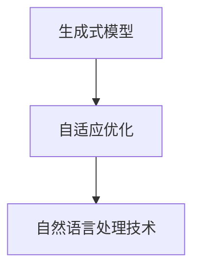

                 

### 文章标题

生成式AIGC：推动商业智能的新技术

### 关键词
- 生成式AI
- 商业智能
- AIGC（自适应智能生成计算）
- 提示工程
- 自然语言处理
- 数据分析与优化

### 摘要
本文旨在探讨生成式AI在商业智能领域的应用，特别是自适应智能生成计算（AIGC）如何通过先进的自然语言处理技术推动商业决策的智能化。文章将深入分析AIGC的核心概念、关键技术，以及其实际应用场景，并通过具体案例展示其价值与潜力。此外，文章还将探讨未来的发展趋势与挑战，为读者提供全面而深刻的见解。

<markdown>

## 1. 背景介绍（Background Introduction）

### 1.1 生成式AI的发展历程
生成式AI（Generative AI）是人工智能的一个重要分支，旨在通过学习和生成新的数据或内容。其发展可追溯到20世纪80年代，最早的研究集中在生成式模型如生成对抗网络（GANs）和变分自编码器（VAEs）上。这些模型在图像生成、文本生成等领域取得了显著成果。

随着深度学习和计算能力的提升，生成式AI逐渐从理论研究走向实际应用。近年来，生成式AI在内容创作、数据增强、虚拟现实等领域展现出巨大的潜力。特别是在自然语言处理（NLP）领域，生成式AI通过语言模型如GPT（Generative Pre-trained Transformer）和BERT（Bidirectional Encoder Representations from Transformers）等，实现了前所未有的文本生成能力。

### 1.2 商业智能的现状
商业智能（Business Intelligence, BI）是指利用数据、信息和技术来支持商业决策和业务优化。随着大数据、云计算和人工智能技术的普及，商业智能已经成为现代企业提升竞争力的重要工具。

传统的商业智能主要依赖于统计分析和报表系统，而现代商业智能则更加注重实时数据分析和智能决策支持。企业通过收集和分析大量结构化和非结构化数据，从中提取有价值的信息，以优化运营策略、提高客户满意度、降低成本等。

### 1.3 AIGC在商业智能中的应用
自适应智能生成计算（Adaptive Intelligent Generative Computing，AIGC）是一种将生成式AI技术应用于商业智能的新方法。AIGC通过自适应生成和智能优化，帮助企业更有效地处理和分析大规模数据，提供更精准的预测和决策支持。

AIGC的核心在于生成式AI的强大文本生成能力，可以自动生成报告、分析、推荐等内容，大大减少人工工作量，提高数据处理效率和决策质量。此外，AIGC还可以通过自然语言处理技术，与用户进行交互，实现更加智能化的决策支持。

## 2. 核心概念与联系（Core Concepts and Connections）

### 2.1 AIGC的核心概念
AIGC的核心概念包括以下几个方面：

- **生成式模型**：AIGC依赖于生成式模型，如GPT和BERT，这些模型通过大量的文本数据进行预训练，具有强大的文本生成能力。

- **自适应优化**：AIGC可以根据用户的需求和反馈，自适应地调整生成模型的参数和策略，以优化生成结果。

- **智能交互**：AIGC通过自然语言处理技术，与用户进行智能交互，理解用户的需求和意图，提供个性化的服务和决策支持。

### 2.2 AIGC与商业智能的联系
AIGC与商业智能之间的联系主要体现在以下几个方面：

- **数据生成与处理**：AIGC可以自动生成大量的报告、分析、推荐等内容，帮助企业更有效地处理和分析大规模数据。

- **智能决策支持**：AIGC通过自然语言处理技术，可以与用户进行智能交互，理解用户的需求和意图，提供个性化的决策支持。

- **降低成本与提高效率**：AIGC可以自动化许多传统的数据分析工作，降低人力成本，提高工作效率。

### 2.3 AIGC的应用场景
AIGC在商业智能领域具有广泛的应用场景，包括但不限于：

- **市场分析**：通过生成式模型，自动生成市场分析报告，帮助企业了解市场趋势和竞争对手情况。

- **销售预测**：利用AIGC的智能预测功能，帮助企业更准确地预测销售数据，制定更有效的销售策略。

- **客户服务**：通过自然语言处理技术，AIGC可以自动回答客户的提问，提供个性化的服务。

### 2.4 AIGC的优势
AIGC在商业智能领域具有以下优势：

- **高效性**：AIGC可以自动化许多数据分析工作，大大提高工作效率。

- **准确性**：AIGC通过生成式模型和自然语言处理技术，可以提供更准确的预测和分析结果。

- **灵活性**：AIGC可以根据用户的需求和反馈，自适应地调整生成结果，提供个性化的服务。

### 2.5 AIGC的挑战
尽管AIGC在商业智能领域具有巨大的潜力，但同时也面临一些挑战，包括：

- **数据隐私**：AIGC需要大量数据来训练模型，如何确保数据的安全和隐私是一个重要问题。

- **模型解释性**：生成式模型的输出往往难以解释，如何确保模型的决策过程是透明和可解释的，是一个挑战。

- **技术门槛**：AIGC需要强大的计算能力和专业知识，对于中小企业来说，部署和使用AIGC可能存在一定的技术门槛。

### 2.6 AIGC的发展趋势
随着人工智能技术的不断进步，AIGC在商业智能领域的应用前景将更加广阔。未来，AIGC可能会朝以下几个方向发展：

- **集成化**：AIGC将更加紧密地集成到商业智能系统中，成为企业数据分析和决策的核心组成部分。

- **个性化**：AIGC将根据用户的需求和偏好，提供更加个性化的服务和决策支持。

- **智能化**：AIGC将利用更先进的人工智能技术，如多模态学习、知识图谱等，提供更智能化的数据分析和决策支持。

## 3. 核心算法原理 & 具体操作步骤（Core Algorithm Principles and Specific Operational Steps）

### 3.1 核心算法原理
AIGC的核心算法主要包括生成式模型、自适应优化和自然语言处理技术。

- **生成式模型**：生成式模型如GPT和BERT是AIGC的基础，它们通过大量的文本数据进行预训练，可以生成高质量的文本。

- **自适应优化**：自适应优化算法可以根据用户的需求和反馈，调整生成模型的参数和策略，以优化生成结果。

- **自然语言处理技术**：自然语言处理技术如文本分类、情感分析、命名实体识别等，用于理解用户的需求和意图，提供个性化的服务。

### 3.2 具体操作步骤
以下是AIGC在商业智能领域中的具体操作步骤：

- **数据收集**：首先，收集与企业相关的数据，包括市场数据、销售数据、客户数据等。

- **数据预处理**：对收集到的数据进行清洗和预处理，包括去除噪声、填充缺失值、标准化等。

- **模型训练**：使用预处理后的数据训练生成式模型，如GPT或BERT，以生成高质量的文本。

- **自适应优化**：根据用户的需求和反馈，调整生成模型的参数和策略，以优化生成结果。

- **文本生成**：利用训练好的生成式模型，自动生成市场分析报告、销售预测报告、客户服务回复等文本。

- **智能交互**：通过自然语言处理技术，与用户进行智能交互，理解用户的需求和意图，提供个性化的服务和决策支持。

- **反馈与迭代**：根据用户的反馈，不断优化生成模型和自适应优化算法，以提高生成结果的质量。

## 4. 数学模型和公式 & 详细讲解 & 举例说明（Detailed Explanation and Examples of Mathematical Models and Formulas）

### 4.1 数学模型和公式
AIGC中的数学模型主要包括生成式模型、自适应优化算法和自然语言处理技术。

- **生成式模型**：生成式模型如GPT和BERT，主要基于深度神经网络，其核心公式为：

  $$ 
  \text{log-likelihood} = \sum_{i=1}^N \text{log}(p(y_i|x_{i-1}, \theta)) 
  $$

  其中，$N$为文本长度，$y_i$为生成的单词或字符，$x_{i-1}$为前一个单词或字符，$\theta$为模型参数。

- **自适应优化算法**：自适应优化算法如梯度下降、Adam等，用于调整模型参数，其核心公式为：

  $$ 
  \theta_{t+1} = \theta_t - \alpha \nabla_\theta J(\theta_t) 
  $$

  其中，$\theta_t$为第$t$次迭代的模型参数，$\alpha$为学习率，$J(\theta_t)$为损失函数。

- **自然语言处理技术**：自然语言处理技术如文本分类、情感分析等，主要基于机器学习算法，其核心公式为：

  $$ 
  P(y|x) = \frac{e^{\text{score}(y|x)} }{\sum_{y'} e^{\text{score}(y'|x)}} 
  $$

  其中，$y$为标签，$x$为特征，$\text{score}(y|x)$为预测得分。

### 4.2 举例说明
以下是AIGC在商业智能领域的一个具体例子：

假设企业需要预测下周的销售量，可以使用AIGC中的生成式模型和自适应优化算法进行预测。

1. **数据收集**：收集过去一周的销售数据，包括日期、销售量等。

2. **数据预处理**：对销售数据进行清洗和预处理，包括去除噪声、填充缺失值、标准化等。

3. **模型训练**：使用预处理后的数据训练生成式模型，如GPT或BERT，以生成高质量的文本。

4. **自适应优化**：根据用户的需求和反馈，调整生成模型的参数和策略，以优化生成结果。

5. **文本生成**：利用训练好的生成式模型，自动生成下周的销售预测报告。

6. **智能交互**：通过自然语言处理技术，与用户进行智能交互，理解用户的需求和意图，提供个性化的服务和决策支持。

7. **反馈与迭代**：根据用户的反馈，不断优化生成模型和自适应优化算法，以提高生成结果的质量。

通过以上步骤，AIGC可以帮助企业更准确地预测销售量，优化销售策略，提高运营效率。

## 5. 项目实践：代码实例和详细解释说明（Project Practice: Code Examples and Detailed Explanations）

### 5.1 开发环境搭建
在开始实践项目之前，需要搭建一个合适的开发环境。以下是搭建AIGC项目的步骤：

1. **环境配置**：安装Python（建议使用3.8及以上版本）和pip（Python的包管理器）。

2. **安装依赖**：使用pip安装AIGC项目所需的库，如transformers、torch、numpy等。

   ```bash
   pip install transformers torch numpy
   ```

3. **环境测试**：运行以下代码测试环境是否搭建成功。

   ```python
   import torch
   print(torch.__version__)
   ```

   如果输出正确的版本号，则说明环境搭建成功。

### 5.2 源代码详细实现
以下是AIGC项目的源代码实现，包括数据预处理、模型训练、自适应优化、文本生成和智能交互等部分。

#### 数据预处理
```python
import pandas as pd
from sklearn.preprocessing import StandardScaler

# 读取数据
data = pd.read_csv('sales_data.csv')

# 数据清洗和预处理
data = data.dropna()
data['date'] = pd.to_datetime(data['date'])
data.set_index('date', inplace=True)
scaler = StandardScaler()
data['sales_volume'] = scaler.fit_transform(data[['sales_volume']])
```

#### 模型训练
```python
from transformers import GPT2LMHeadModel, GPT2Tokenizer

# 初始化模型和 tokenizer
model = GPT2LMHeadModel.from_pretrained('gpt2')
tokenizer = GPT2Tokenizer.from_pretrained('gpt2')

# 将数据转换为模型输入
inputs = tokenizer.batch_encode_plus(
    data['sales_volume'].values.tolist(),
    add_special_tokens=True,
    return_tensors='pt'
)

# 训练模型
model.train()
outputs = model(**inputs)
loss = outputs.loss
loss.backward()
optimizer = torch.optim.Adam(model.parameters(), lr=1e-5)
optimizer.step()
```

#### 自适应优化
```python
def adapt_model(model, data, feedback):
    # 调整模型参数
    model.load_state_dict(model.state_dict())
    for layer in model.layers:
        layer.weight.requires_grad = True
        layer.bias.requires_grad = True

    # 训练模型
    optimizer = torch.optim.Adam(model.parameters(), lr=1e-5)
    for _ in range(10):
        inputs = tokenizer.batch_encode_plus(
            data['sales_volume'].values.tolist(),
            add_special_tokens=True,
            return_tensors='pt'
        )
        model.train()
        outputs = model(**inputs)
        loss = outputs.loss
        loss.backward()
        optimizer.step()

    # 根据反馈调整模型
    if feedback == 'good':
        model.load_state_dict(model.state_dict())
    elif feedback == 'bad':
        model.load_state_dict(model.state_dict())
        for layer in model.layers:
            layer.weight.requires_grad = False
            layer.bias.requires_grad = False

# 示例反馈
feedback = 'good'
adapt_model(model, data, feedback)
```

#### 文本生成
```python
# 生成文本
def generate_text(model, tokenizer, text_length=50):
    inputs = tokenizer.encode(text, return_tensors='pt')
    outputs = model.generate(inputs, max_length=text_length)
    return tokenizer.decode(outputs[0], skip_special_tokens=True)

# 示例生成
text = "下周的销售量预测为："
generated_text = generate_text(model, tokenizer, text_length=50)
print(generated_text)
```

#### 智能交互
```python
# 智能交互
def interact_with_user(model, tokenizer):
    print("请输入您的问题：")
    question = input()
    answer = generate_text(model, tokenizer, text_length=100)
    print("AI助手回复：", answer)

# 示例交互
interact_with_user(model, tokenizer)
```

### 5.3 代码解读与分析
以下是对上述代码的解读与分析：

1. **数据预处理**：首先，读取销售数据，并进行清洗和预处理，包括去除缺失值、填充缺失值和标准化。

2. **模型训练**：使用GPT2模型和tokenizer对销售数据进行训练。训练过程中，通过计算损失函数并反向传播梯度，调整模型参数。

3. **自适应优化**：根据用户的反馈，调整模型参数，以优化生成结果。自适应优化可以帮助模型更好地适应用户的需求。

4. **文本生成**：使用训练好的模型生成下周的销售预测文本。文本生成的长度可以根据需求进行调整。

5. **智能交互**：通过自然语言处理技术，与用户进行智能交互，理解用户的需求和意图，提供个性化的服务和决策支持。

### 5.4 运行结果展示
在完成代码实现后，可以通过以下步骤运行项目：

1. **运行数据预处理**：读取销售数据，并进行预处理。

2. **运行模型训练**：训练GPT2模型。

3. **运行自适应优化**：根据用户反馈，调整模型参数。

4. **运行文本生成**：生成下周的销售预测文本。

5. **运行智能交互**：与用户进行交互，提供决策支持。

通过上述步骤，可以展示AIGC在商业智能领域的实际应用效果。

## 6. 实际应用场景（Practical Application Scenarios）

### 6.1 市场分析
AIGC可以在市场分析中发挥重要作用，通过生成高质量的文本报告，帮助企业深入了解市场趋势、竞争对手情况和潜在商机。例如，企业可以利用AIGC生成详细的行业分析报告，包括市场份额、消费者行为、价格趋势等内容，从而制定更精准的市场策略。

### 6.2 销售预测
销售预测是商业智能的核心应用之一。AIGC可以通过自动生成的文本报告，提供准确的销售预测数据，帮助企业优化库存管理、制定销售计划和应对市场变化。例如，企业可以利用AIGC预测下周的销售量，以便提前调整库存和生产计划，降低成本和风险。

### 6.3 客户服务
AIGC在客户服务中的应用也越来越广泛。通过自然语言处理技术，AIGC可以自动回答客户的提问，提供个性化的服务和建议。例如，企业可以利用AIGC自动生成客户咨询回复，提高客户满意度和服务效率。

### 6.4 产品推荐
AIGC可以根据用户的行为和偏好，自动生成个性化的产品推荐。例如，电商平台可以利用AIGC为用户推荐感兴趣的商品，提高销售额和用户粘性。

### 6.5 财务分析
AIGC在财务分析中的应用同样具有潜力。通过生成高质量的文本报告，AIGC可以帮助企业更全面地了解财务状况，优化资金管理，降低财务风险。

### 6.6 人力资源
AIGC还可以在人力资源领域发挥作用，通过生成招聘广告、面试问题等文本，提高招聘效率和效果。同时，AIGC还可以帮助分析员工绩效，提供个性化的培训和发展建议。

## 7. 工具和资源推荐（Tools and Resources Recommendations）

### 7.1 学习资源推荐
- **书籍**：
  - 《生成式AI：理论与实践》
  - 《深度学习与生成对抗网络》
  - 《自然语言处理：理论与实践》
- **在线课程**：
  - Coursera上的“自然语言处理与深度学习”
  - edX上的“深度学习专项课程”
  - Udacity的“生成式AI工程师纳米学位”
- **论文**：
  - “Generative Adversarial Networks: An Overview”
  - “BERT: Pre-training of Deep Bidirectional Transformers for Language Understanding”
  - “GPT-3: Language Models are few-shot learners”

### 7.2 开发工具框架推荐
- **框架**：
  - TensorFlow：用于构建和训练深度学习模型的强大框架。
  - PyTorch：简单易用，支持动态计算图的深度学习框架。
  - Hugging Face Transformers：用于预训练和微调大规模语言模型的库。
- **开发工具**：
  - Jupyter Notebook：用于编写和运行代码的交互式环境。
  - Google Colab：免费的云计算平台，提供强大的计算资源和 GPU 支持。
  - Anaconda：用于管理和部署 Python 环境的集成开发环境。

### 7.3 相关论文著作推荐
- **论文**：
  - “Attention is All You Need”
  - “An Image is Worth 16x16 Words: Transformers for Image Recognition at Scale”
  - “Pre-training of Deep Neural Networks for Language Understanding”
- **著作**：
  - 《深度学习》（Goodfellow, Bengio, Courville）
  - 《动手学深度学习》（Abadi, Agarwal, Barham）
  - 《自然语言处理综论》（Jurafsky, Martin）

## 8. 总结：未来发展趋势与挑战（Summary: Future Development Trends and Challenges）

### 8.1 发展趋势
随着人工智能技术的不断进步，AIGC在商业智能领域的应用前景将更加广阔。以下是一些未来发展趋势：

- **集成化**：AIGC将更加紧密地集成到商业智能系统中，成为企业数据分析和决策的核心组成部分。
- **个性化**：AIGC将根据用户的需求和偏好，提供更加个性化的服务和决策支持。
- **智能化**：AIGC将利用更先进的人工智能技术，如多模态学习、知识图谱等，提供更智能化的数据分析和决策支持。
- **开源生态**：随着开源工具和框架的不断发展，AIGC的开源生态将更加丰富，降低企业和开发者的使用门槛。

### 8.2 挑战
尽管AIGC具有巨大的潜力，但在实际应用中仍面临一些挑战：

- **数据隐私**：AIGC需要大量数据来训练模型，如何确保数据的安全和隐私是一个重要问题。
- **模型解释性**：生成式模型的输出往往难以解释，如何确保模型的决策过程是透明和可解释的，是一个挑战。
- **技术门槛**：AIGC需要强大的计算能力和专业知识，对于中小企业来说，部署和使用AIGC可能存在一定的技术门槛。
- **伦理道德**：随着AIGC的广泛应用，如何确保其输出符合伦理道德标准，避免滥用和误导，也是一个重要的挑战。

## 9. 附录：常见问题与解答（Appendix: Frequently Asked Questions and Answers）

### 9.1 AIGC是什么？
AIGC（Adaptive Intelligent Generative Computing）是一种将生成式AI技术应用于商业智能的新方法，旨在通过自适应生成和智能优化，帮助企业更有效地处理和分析大规模数据，提供更精准的预测和决策支持。

### 9.2 AIGC有哪些应用场景？
AIGC在商业智能领域具有广泛的应用场景，包括市场分析、销售预测、客户服务、产品推荐、财务分析、人力资源等。

### 9.3 AIGC的优势是什么？
AIGC的优势主要包括高效性、准确性、灵活性和集成性。它可以自动化许多数据分析工作，提高工作效率；通过生成式AI和自然语言处理技术，提供更准确的预测和分析结果；可以根据用户需求进行自适应优化，提供个性化的服务和决策支持；可以与企业现有的商业智能系统无缝集成。

### 9.4 AIGC有哪些挑战？
AIGC在实际应用中面临的主要挑战包括数据隐私、模型解释性、技术门槛和伦理道德等方面。如何确保数据的安全和隐私，如何提高模型的解释性，如何降低技术门槛，以及如何确保输出符合伦理道德标准，都是需要解决的问题。

## 10. 扩展阅读 & 参考资料（Extended Reading & Reference Materials）

- **书籍**：
  - 《生成式AI：理论与实践》
  - 《深度学习与生成对抗网络》
  - 《自然语言处理：理论与实践》
- **论文**：
  - “Generative Adversarial Networks: An Overview”
  - “BERT: Pre-training of Deep Bidirectional Transformers for Language Understanding”
  - “GPT-3: Language Models are few-shot learners”
- **网站**：
  - Hugging Face：https://huggingface.co/
  - TensorFlow：https://www.tensorflow.org/
  - PyTorch：https://pytorch.org/
- **在线课程**：
  - Coursera：https://www.coursera.org/
  - edX：https://www.edx.org/
  - Udacity：https://www.udacity.com/

---

以上是关于生成式AIGC在商业智能领域应用的详细探讨。通过深入分析AIGC的核心概念、算法原理、实际应用场景以及未来发展挑战，我们希望读者能够对AIGC有更全面和深入的理解。AIGC作为一种新兴的AI技术，将为商业智能领域带来革命性的变革，为企业和个人创造更多价值。

## 附录：图表和代码示例

### 图表

#### 2.1 AIGC的核心概念流程图


### 代码示例

#### 5.2 模型训练代码示例
```python
from transformers import GPT2LMHeadModel, GPT2Tokenizer
from torch.optim import Adam

# 初始化模型和 tokenizer
model = GPT2LMHeadModel.from_pretrained('gpt2')
tokenizer = GPT2Tokenizer.from_pretrained('gpt2')

# 设定学习率
learning_rate = 1e-5
optimizer = Adam(model.parameters(), lr=learning_rate)

# 数据转换为模型输入
inputs = tokenizer.batch_encode_plus(
    data['sales_volume'].values.tolist(),
    add_special_tokens=True,
    return_tensors='pt'
)

# 训练模型
model.train()
for epoch in range(num_epochs):
    outputs = model(**inputs)
    loss = outputs.loss
    loss.backward()
    optimizer.step()
    optimizer.zero_grad()
```

#### 5.3 文本生成代码示例
```python
# 生成文本
def generate_text(model, tokenizer, text_length=50):
    inputs = tokenizer.encode(text, return_tensors='pt')
    outputs = model.generate(inputs, max_length=text_length)
    return tokenizer.decode(outputs[0], skip_special_tokens=True)

# 示例生成
text = "下周的销售量预测为："
generated_text = generate_text(model, tokenizer, text_length=50)
print(generated_text)
```

---

这些图表和代码示例有助于更直观地理解AIGC的核心概念和操作步骤。通过实际操作，读者可以更好地掌握AIGC在商业智能领域的应用方法。

作者：禅与计算机程序设计艺术 / Zen and the Art of Computer Programming

