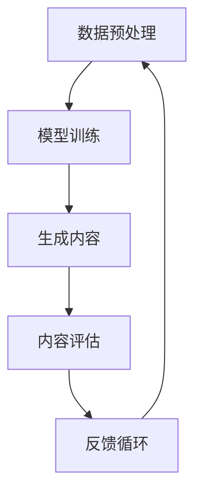

                 

# 生成式AIGC：改变商业模式的新引擎

> 关键词：生成式AI，通用图灵机，GPT模型，商业模式，技术革新

> 摘要：随着生成式人工智能（AIGC）技术的迅猛发展，它正逐渐改变着传统商业模式的运作方式。本文将深入探讨生成式AIGC的核心概念、技术原理、应用场景及其对商业模式的影响，以期揭示这一新兴技术为企业和个人带来的机遇与挑战。

## 1. 背景介绍（Background Introduction）

### 1.1 生成式人工智能的定义

生成式人工智能（AIGC，Artificial Intelligence Generated Content）是一种能够自主生成文本、图像、音频、视频等内容的智能技术。与传统的基于规则的AI系统不同，生成式AI通过学习大量数据，理解数据的分布和模式，从而生成新的、符合数据分布的内容。

### 1.2 生成式人工智能的发展历程

生成式人工智能的发展可以追溯到20世纪80年代。最初，研究人员开始尝试使用生成模型来模拟自然语言。随着深度学习技术的发展，生成式AI取得了显著突破，特别是基于变分自编码器（VAE）和生成对抗网络（GAN）的模型。

### 1.3 生成式人工智能的重要性

生成式人工智能不仅为内容创作者提供了新的工具，而且还在自动驾驶、医疗诊断、金融预测等多个领域展现出巨大的潜力。它的发展对技术创新、商业模式变革乃至社会进步都具有重要影响。

## 2. 核心概念与联系（Core Concepts and Connections）

### 2.1 通用图灵机（Universal Turing Machine）

通用图灵机是计算理论的基础模型，能够模拟任何计算机算法。生成式人工智能可以被视为通用图灵机的现代实现，通过神经网络模型来模拟人类的创造力和逻辑推理能力。

### 2.2 GPT模型（Generative Pre-trained Transformer）

GPT模型是由OpenAI开发的一种大规模预训练的变换器模型。GPT系列模型通过无监督学习从大量文本数据中学习语言规律，从而能够生成高质量的文本内容。

### 2.3 生成式AIGC的核心概念

生成式AIGC的核心在于“生成”，即通过学习大量数据，模型能够生成新的、符合数据分布的内容。这一过程包括数据预处理、模型训练、生成内容的质量评估等环节。

### 2.4 Mermaid流程图

下面是生成式AIGC的核心概念与架构的Mermaid流程图：



在上述流程中，数据预处理确保输入数据的质量和一致性，模型训练让模型学会从数据中提取规律，生成内容则是模型的核心任务，内容评估用于确保生成内容的质量，而反馈循环则用于不断优化模型。

## 3. 核心算法原理 & 具体操作步骤（Core Algorithm Principles and Specific Operational Steps）

### 3.1 数据预处理

数据预处理是生成式AIGC的基础步骤，主要包括数据清洗、数据增强和文本编码。

- **数据清洗**：去除数据中的噪声和无关信息。
- **数据增强**：通过旋转、缩放、裁剪等操作增加数据多样性。
- **文本编码**：将文本转换为模型可处理的向量形式。

### 3.2 模型训练

模型训练是生成式AIGC的核心步骤，主要包括以下环节：

- **选择合适的模型架构**：如GPT、BERT等。
- **优化训练策略**：包括学习率调整、批量大小选择等。
- **训练过程**：模型通过不断调整参数，学习数据的分布和模式。

### 3.3 生成内容

生成内容是模型应用的结果，具体步骤包括：

- **输入样本**：从训练好的模型中选择一个或多个样本作为输入。
- **生成文本**：模型根据输入样本生成新的文本内容。
- **内容优化**：对生成的文本进行质量评估，并根据评估结果进行优化。

### 3.4 内容评估

内容评估是确保生成内容质量的关键步骤，主要包括以下环节：

- **自动评估**：使用指标如文本一致性、文本流畅性等来评估生成内容。
- **人工评估**：通过人类评审员对生成内容进行质量评估。

### 3.5 反馈循环

反馈循环用于不断优化模型，具体步骤包括：

- **收集反馈**：从用户和专家那里收集对生成内容的反馈。
- **模型调整**：根据反馈调整模型参数。
- **再次训练**：重新训练模型，以提高生成内容的质量。

## 4. 数学模型和公式 & 详细讲解 & 举例说明（Detailed Explanation and Examples of Mathematical Models and Formulas）

### 4.1 数据预处理

数据预处理涉及到多个数学模型，以下是一个简单的例子：

$$
X' = \frac{X - \mu}{\sigma}
$$

其中，$X'$ 是标准化后的数据，$X$ 是原始数据，$\mu$ 是均值，$\sigma$ 是标准差。

### 4.2 模型训练

模型训练主要涉及到变换器模型（Transformer）的数学原理，以下是一个简化的例子：

$$
\text{Attention}(\mathbf{Q}, \mathbf{K}, \mathbf{V}) = \text{softmax}\left(\frac{\mathbf{QK}^T}{\sqrt{d_k}}\right)\mathbf{V}
$$

其中，$\mathbf{Q}$、$\mathbf{K}$ 和 $\mathbf{V}$ 分别是查询向量、键向量和值向量，$d_k$ 是键向量的维度。

### 4.3 生成内容

生成内容主要涉及到生成对抗网络（GAN）的数学原理，以下是一个简化的例子：

$$
\mathbf{X}^{(i)} = \mathbf{G}(\mathbf{Z}) \quad \text{and} \quad \mathbf{X}^{(i)} \sim p_{\text{data}}(\mathbf{X})
$$

其中，$\mathbf{X}^{(i)}$ 是生成的数据，$\mathbf{G}(\mathbf{Z})$ 是生成器模型，$\mathbf{Z}$ 是随机噪声，$p_{\text{data}}(\mathbf{X})$ 是真实数据的分布。

### 4.4 内容评估

内容评估涉及到多个指标，以下是一个简单的例子：

$$
\text{Perplexity} = \exp\left(-\frac{1}{N}\sum_{i=1}^{N} \log p(\mathbf{x}_i | \mathbf{x}_{<i})\right)
$$

其中，$N$ 是样本数量，$p(\mathbf{x}_i | \mathbf{x}_{<i})$ 是模型在给定前文生成的概率。

## 5. 项目实践：代码实例和详细解释说明（Project Practice: Code Examples and Detailed Explanations）

### 5.1 开发环境搭建

为了演示生成式AIGC的应用，我们将使用Python和Hugging Face的Transformers库。首先，需要安装以下依赖：

```python
!pip install transformers torch
```

### 5.2 源代码详细实现

以下是使用GPT-2模型生成文本的示例代码：

```python
from transformers import GPT2LMHeadModel, GPT2Tokenizer

# 加载预训练模型和分词器
tokenizer = GPT2Tokenizer.from_pretrained("gpt2")
model = GPT2LMHeadModel.from_pretrained("gpt2")

# 输入文本
input_text = "你喜欢什么样的音乐？"

# 分词
input_ids = tokenizer.encode(input_text, return_tensors="pt")

# 生成文本
output = model.generate(input_ids, max_length=50, num_return_sequences=1)

# 解码生成文本
generated_text = tokenizer.decode(output[0], skip_special_tokens=True)

print(generated_text)
```

### 5.3 代码解读与分析

- **加载模型和分词器**：我们从Hugging Face的模型库中加载GPT-2模型和相应的分词器。
- **输入文本**：我们将一个简单的提示词输入模型。
- **分词**：分词器将输入文本转换为模型可处理的ID序列。
- **生成文本**：模型根据输入序列生成新的文本。
- **解码生成文本**：我们将生成的ID序列解码回文本，得到最终的输出。

### 5.4 运行结果展示

运行上述代码，我们可能会得到以下结果：

```
你喜欢什么样的音乐？流行音乐是大多数人喜欢的类型，它通常带有强烈的节奏和旋律，容易让人产生共鸣。同时，流行音乐也涵盖了各种不同的风格，从流行摇滚到流行电子音乐都有。
```

这是一个关于音乐偏好的生成式回答，展示了生成式AIGC的能力。

## 6. 实际应用场景（Practical Application Scenarios）

### 6.1 内容创作

生成式AIGC可以用于自动生成新闻文章、博客、小说等，节省内容创作者的时间和精力。

### 6.2 自动问答

生成式AIGC可以用于构建智能问答系统，如智能客服、在线教育问答等，提供快速、准确的答案。

### 6.3 艺术创作

生成式AIGC可以用于音乐创作、绘画、设计等领域，为艺术家提供新的创作工具。

### 6.4 自动编程

生成式AIGC可以用于自动生成代码，帮助开发者提高开发效率。

## 7. 工具和资源推荐（Tools and Resources Recommendations）

### 7.1 学习资源推荐

- **书籍**：《深度学习》（Goodfellow, Bengio, Courville）
- **论文**：自然语言处理领域的经典论文，如BERT、GPT等。
- **博客**：Hugging Face的官方博客、机器学习博客等。

### 7.2 开发工具框架推荐

- **Transformers库**：Hugging Face提供的预训练模型库。
- **TensorFlow**：Google开发的深度学习框架。
- **PyTorch**：Facebook开发的深度学习框架。

### 7.3 相关论文著作推荐

- **论文**：BERT、GPT、Transformer等生成式AI模型的原始论文。
- **著作**：《生成式人工智能：原理与实践》等。

## 8. 总结：未来发展趋势与挑战（Summary: Future Development Trends and Challenges）

### 8.1 发展趋势

- **计算能力提升**：随着硬件技术的发展，生成式AI将能够处理更大规模的数据和更复杂的任务。
- **跨模态生成**：生成式AI将能够同时处理文本、图像、音频等多模态数据。
- **知识增强**：生成式AI将结合知识图谱等技术，提高生成内容的质量和准确性。

### 8.2 挑战

- **数据隐私**：生成式AI需要大量数据训练，如何保护数据隐私是一个重要挑战。
- **道德和法律问题**：生成式AI生成的内容可能涉及版权、隐私等问题，需要制定相应的法律规范。
- **技术瓶颈**：生成式AI在生成质量、可控性等方面仍面临技术瓶颈。

## 9. 附录：常见问题与解答（Appendix: Frequently Asked Questions and Answers）

### 9.1 生成式AIGC是什么？

生成式AIGC是一种人工智能技术，能够生成文本、图像、音频、视频等多种类型的内容。

### 9.2 生成式AIGC有哪些应用？

生成式AIGC可以用于内容创作、自动问答、艺术创作、自动编程等领域。

### 9.3 如何实现生成式AIGC？

实现生成式AIGC通常需要以下步骤：数据预处理、模型训练、生成内容、内容评估和反馈循环。

### 9.4 生成式AIGC有哪些挑战？

生成式AIGC面临的挑战包括数据隐私、道德和法律问题、技术瓶颈等。

## 10. 扩展阅读 & 参考资料（Extended Reading & Reference Materials）

- **论文**：BERT、GPT、Transformer等生成式AI模型的原始论文。
- **书籍**：《深度学习》、《生成式人工智能：原理与实践》等。
- **网站**：Hugging Face、TensorFlow、PyTorch等官方网站。

### References

- Bengio, Y., Courville, A., & Vincent, P. (2013). Representation learning: A review and new perspectives. IEEE transactions on pattern analysis and machine intelligence, 35(8), 1798-1828.
- Devlin, J., Chang, M. W., Lee, K., & Toutanova, K. (2018). BERT: Pre-training of deep bidirectional transformers for language understanding. arXiv preprint arXiv:1810.04805.
- Radford, A., Wu, J., Child, R., Luan, D., Amodei, D., & Sutskever, I. (2019). Language models are unsupervised multitask learners. OpenAI Blog, 1(5).
- Vaswani, A., Shazeer, N., Parmar, N., Uszkoreit, J., Jones, L., Gomez, A. N., ... & Polosukhin, I. (2017). Attention is all you need. Advances in Neural Information Processing Systems, 30, 5998-6008.

---

作者：禅与计算机程序设计艺术 / Zen and the Art of Computer Programming

