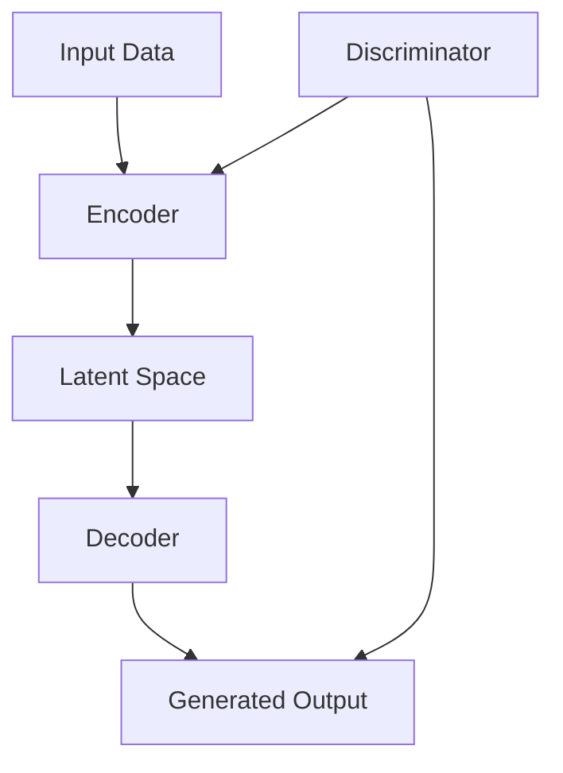

                 

### 文章标题：生成式AI的实际应用案例

### Keywords: Generative AI, Applications, Practical Cases, AI Technologies

### Abstract:
This article delves into the practical applications of generative AI, exploring a range of scenarios from art and design to scientific research and industry. We will discuss core concepts, algorithms, mathematical models, and real-world examples to provide a comprehensive understanding of how generative AI is revolutionizing various fields.

## 1. 背景介绍（Background Introduction）

生成式人工智能（Generative Artificial Intelligence, AI）是指能够生成新内容的人工智能系统，它通过学习大量的数据模式，然后生成与之相似的新数据。这种技术已经在多个领域展现出巨大的潜力，从图像和音频生成，到文本创作和游戏设计。生成式AI的核心是生成对抗网络（GANs）、变分自编码器（VAEs）和自注意力模型（如Transformer）等。

随着深度学习技术的发展，生成式AI的模型和算法变得更加高效和准确。例如，深度卷积生成对抗网络（DCGANs）能够生成高质量、细腻的图像，而GPT-3等大型语言模型则能够创作出几乎无法区分于人类写作的文本。

在实际应用中，生成式AI已经成为了创意设计、个性化推荐、自动化内容生成和数据分析等领域的重要工具。它不仅在娱乐和艺术领域带来了革命性的变化，还在医疗、金融和制造业等各个行业展示了其广泛的应用前景。

## 2. 核心概念与联系（Core Concepts and Connections）

### 2.1 什么是生成式AI？
生成式AI是一种人工智能技术，它能够创建新的数据，这些数据在统计上与训练数据相似。生成式AI的核心是生成模型，这些模型能够从给定的数据分布中生成新的样本。

### 2.2 生成式AI的工作原理
生成式AI通常采用以下几种模型：

1. **生成对抗网络（GANs）**：由生成器（Generator）和判别器（Discriminator）组成。生成器尝试生成与真实数据相似的数据，而判别器则尝试区分真实数据和生成数据。两个网络相互竞争，共同提高生成质量。

2. **变分自编码器（VAEs）**：VAE通过编码器（Encoder）和解码器（Decoder）实现。编码器将输入数据映射到一个潜在空间中，解码器则从潜在空间中生成新的数据。

3. **自注意力模型（如Transformer）**：在生成文本、图像和音频时，自注意力模型能够捕捉长距离的依赖关系，生成内容更加连贯和准确。

### 2.3 生成式AI的应用领域
生成式AI在以下领域展示了其强大的应用潜力：

1. **艺术和设计**：生成式AI可以自动创作音乐、绘画、电影剧本等，为艺术家提供了新的创作工具。

2. **游戏开发**：生成式AI可以自动生成游戏关卡、角色和故事情节，提高游戏的趣味性和多样性。

3. **科学研究和数据分析**：生成式AI可以辅助科学家发现新的数据模式，进行药物发现和气候研究。

4. **医疗**：生成式AI可以生成患者的个性化治疗计划，提高医疗诊断和治疗的准确性。

5. **金融**：生成式AI可以用于预测股票市场趋势、生成金融报告和报告摘要。

### 2.4 Mermaid 流程图（Mermaid Flowchart）
下面是一个简单的Mermaid流程图，展示了生成式AI的基本架构：



## 3. 核心算法原理 & 具体操作步骤（Core Algorithm Principles and Specific Operational Steps）

### 3.1 生成对抗网络（GANs）的工作原理

生成对抗网络（GANs）是一种由两部分组成的框架：生成器（Generator）和判别器（Discriminator）。

- **生成器（Generator）**：生成器的目标是创建看起来像真实数据的假数据。它通过从噪声分布中采样，生成潜在空间中的样本，然后通过解码器将这些样本转换成假数据。

- **判别器（Discriminator）**：判别器的目标是区分真实数据和生成数据。在训练过程中，它接收真实的输入数据和生成器产生的假数据，并尝试最大化其分类准确率。

GANs的训练过程如下：

1. **初始化生成器和判别器**：随机初始化生成器和判别器。
2. **生成假数据**：生成器从噪声分布中采样，生成假数据。
3. **判别器训练**：判别器接收真实数据和假数据，并更新其参数，以提高分类准确率。
4. **生成器训练**：生成器根据判别器的反馈更新其参数，以生成更真实的数据。
5. **重复步骤2-4**：不断迭代训练，直到生成器生成的数据质量达到预期。

### 3.2 变分自编码器（VAEs）的工作原理

变分自编码器（VAEs）是一种基于概率生成模型的生成式AI方法。它包括两个主要组件：编码器（Encoder）和解码器（Decoder）。

- **编码器（Encoder）**：编码器的目标是学习一个概率分布，这个分布描述了原始数据的潜在空间。编码器将输入数据映射到一个低维的潜在空间中。
- **解码器（Decoder）**：解码器的目标是根据潜在空间中的样本生成原始数据的近似值。

VAEs的训练过程如下：

1. **初始化编码器和解码器**：随机初始化编码器和解码器。
2. **计算损失函数**：VAEs使用一种名为"变分损失函数"的损失函数，这个函数衡量了生成数据与原始数据之间的差距。
3. **更新网络参数**：使用梯度下降或其他优化算法更新编码器和解码器的参数。
4. **重复步骤2-3**：不断迭代训练，直到模型性能达到预期。

### 3.3 自注意力模型（如Transformer）的工作原理

自注意力模型（如Transformer）是一种基于自注意力机制的生成模型，特别适合处理序列数据。

- **自注意力机制**：自注意力机制允许模型在生成序列的每个步骤中动态地关注输入序列的不同部分。这有助于模型捕捉长距离的依赖关系。
- **编码器和解码器**：Transformer模型包括编码器和解码器，编码器负责将输入序列转换为嵌入向量，解码器则负责根据嵌入向量生成输出序列。

Transformer的训练过程如下：

1. **初始化编码器和解码器**：随机初始化编码器和解码器。
2. **计算损失函数**：通常使用交叉熵损失函数。
3. **更新网络参数**：使用梯度下降或其他优化算法更新编码器和解码器的参数。
4. **重复步骤2-3**：不断迭代训练，直到模型性能达到预期。

## 4. 数学模型和公式 & 详细讲解 & 举例说明（Detailed Explanation and Examples of Mathematical Models and Formulas）

### 4.1 生成对抗网络（GANs）的数学模型

在GANs中，生成器和判别器的目标函数通常如下：

- **生成器（Generator）**：最小化生成数据的损失，即最小化生成数据的概率。
  $$ G : \mathcal{Z} \rightarrow \mathcal{X} $$
  $$ \min_G \mathbb{E}_{x \sim \mathcal{X}}[\log(D(x))] + \mathbb{E}_{z \sim \mathcal{Z}}[\log(1 - D(G(z)))] $$

- **判别器（Discriminator）**：最大化对真实数据和生成数据的区分度，即最大化生成数据的概率。
  $$ D : \mathcal{X} \cup \mathcal{G} \rightarrow [0, 1] $$
  $$ \max_D \mathbb{E}_{x \sim \mathcal{X}}[\log(D(x))] + \mathbb{E}_{z \sim \mathcal{Z}}[\log(1 - D(G(z)))] $$

### 4.2 变分自编码器（VAEs）的数学模型

在VAEs中，编码器和解码器的目标函数通常如下：

- **编码器（Encoder）**：
  $$ \theta_e : \mathcal{X} \rightarrow \mathcal{Z} $$
  $$ \log p(z|x) = -D_z(\theta_z(z) - \theta_e(x)) - \frac{1}{2}\|\theta_e(x) - \mu_z - \log(\sigma_z)\|^2 $$

- **解码器（Decoder）**：
  $$ \theta_d : \mathcal{Z} \rightarrow \mathcal{X} $$
  $$ \log p(x|\theta_d(z)) = -D_x(\theta_d(z) - x) $$

### 4.3 自注意力模型（如Transformer）的数学模型

在Transformer中，自注意力机制可以表示为：

$$
\text{Attention}(Q, K, V) = \frac{1}{\sqrt{d_k}} \text{softmax}\left(\frac{QK^T}{d_k}\right) V
$$

其中，$Q$、$K$ 和 $V$ 分别是查询向量、键向量和值向量，$d_k$ 是键向量的维度。

### 4.4 举例说明

#### 4.4.1 GANs的生成图像

假设我们使用一个GANs来生成图像，生成器的输出是一个图像，判别器的目标是判断这个图像是真实的还是伪造的。以下是一个简单的示例：

- **生成器**：从噪声分布中采样，生成一个图像。
  $$ G(z) \sim \mathcal{N}(0, I) $$
  $$ x_G = G(z) $$

- **判别器**：判断一个图像是真实的概率。
  $$ D(x) = P(x \text{ is real}) $$

- **损失函数**：判别器的损失函数。
  $$ \mathcal{L}_D = -\log(D(x)) - \log(1 - D(G(x))) $$

#### 4.4.2 VAEs的生成数据

假设我们使用一个VAEs来生成数据，编码器将数据映射到一个潜在空间，解码器从潜在空间中生成新的数据。

- **编码器**：
  $$ \mu(x) = \text{mean}(x) $$
  $$ \sigma(x) = \text{stddev}(x) $$

- **解码器**：
  $$ x' = \mu(z) + \sigma(z) \epsilon $$
  其中，$\epsilon$ 是一个小的噪声向量。

- **损失函数**：VAEs的损失函数。
  $$ \mathcal{L}_\text{VAE} = D_\text{KL}(\mu(x), \sigma(x)) + \log p(x'|z) $$

#### 4.4.3 Transformer的文本生成

假设我们使用一个Transformer来生成文本，查询向量、键向量和值向量分别代表文本的不同部分。

- **自注意力机制**：
  $$ \text{Attention}(Q, K, V) = \text{softmax}\left(\frac{QK^T}{\sqrt{d_k}}\right) V $$

- **生成文本**：
  $$ \text{seq} = \text{Tokenizer}(word_1, word_2, ..., word_n) $$
  $$ \text{Output} = \text{Generator}(\text{seq}) $$

## 5. 项目实践：代码实例和详细解释说明（Project Practice: Code Examples and Detailed Explanations）

### 5.1 开发环境搭建

为了实践生成式AI，我们需要安装一些必要的工具和库。以下是在Python中搭建生成式AI环境的一个基本步骤：

```bash
# 安装Python环境
python3 -m venv venv
source venv/bin/activate

# 安装深度学习库TensorFlow
pip install tensorflow

# 安装GANs库TensorFlow Addons
pip install tensorflow-addons

# 安装其他必要库
pip install numpy matplotlib
```

### 5.2 源代码详细实现

下面是一个简单的GANs示例，生成手写数字图像。

```python
import tensorflow as tf
from tensorflow_addons.layers import GaussianNoise
from tensorflow.keras.layers import Dense, Flatten, Reshape
from tensorflow.keras.models import Model
import numpy as np
import matplotlib.pyplot as plt

# 参数设置
noise_dim = 100
img_rows = 28
img_cols = 28
channels = 1
num_classes = 10

# 生成器模型
def build_generator(z):
    # 将噪声向量映射到图像
    d = Dense(128 * 7 * 7, activation="relu", input_dim=noise_dim)
    x = d(z)
    x = tf.keras.layers.LeakyReLU(alpha=0.01)(x)
    x = tf.keras.layers.Dropout(0.3)(x)
    x = tf.keras.layers.Reshape((7, 7, 128))(x)
    
    # 逐步上采样到图像大小
    d = Dense(128 * 3 * 3, activation="relu")
    x = d(x)
    x = tf.keras.layers.LeakyReLU(alpha=0.01)(x)
    x = tf.keras.layers.Dropout(0.3)(x)
    x = tf.keras.layers.Conv2DTranspose(128, kernel_size=5, strides=(2, 2), padding="same")(x)
    
    d = Dense(64 * 3 * 3, activation="relu")
    x = d(x)
    x = tf.keras.layers.LeakyReLU(alpha=0.01)(x)
    x = tf.keras.layers.Dropout(0.3)(x)
    x = tf.keras.layers.Conv2DTranspose(64, kernel_size=5, strides=(2, 2), padding="same")(x)
    
    # 输出图像
    x = tf.keras.layers.Conv2D(channels, kernel_size=5, padding="same", activation="tanh")(x)
    return Model(z, x)

# 判别器模型
def build_discriminator(x):
    d = GaussianNoise(stddev=0.5)
    x = d(x)
    x = Flatten()(x)
    
    d = Dense(128, activation="relu")
    x = d(x)
    d = tf.keras.layers.LeakyReLU(alpha=0.01)(x)
    
    d = Dense(128, activation="relu")
    x = d(x)
    d = tf.keras.layers.LeakyReLU(alpha=0.01)(x)
    
    # 输出判别概率
    x = Dense(1, activation="sigmoid")(x)
    return Model(x, x)

# GAN模型
def build_gan(generator, discriminator):
    z = tf.keras.layers.Input(shape=(noise_dim,))
    x = generator(z)
    x = discriminator(x)
    return Model(z, x)

# 模型编译
discriminator.compile(optimizer=tf.keras.optimizers.Adam(0.0001), loss="binary_crossentropy")
generator.compile(optimizer=tf.keras.optimizers.Adam(0.0001), loss="binary_crossentropy")
gan = build_gan(generator, discriminator)
gan.compile(optimizer=tf.keras.optimizers.Adam(0.0001), loss="binary_crossentropy")

# 数据准备
(x_train, _), (x_test, _) = tf.keras.datasets.mnist.load_data()
x_train = x_train / 127.5 - 1.0
x_train = np.expand_dims(x_train, axis=3)

# 训练GAN
epochs = 10000
batch_size = 32
sample_interval = 1000

d_loss accuses = []
g_loss accuses = []

for epoch in range(epochs):

    # 训练判别器
    idx = np.random.randint(0, x_train.shape[0], batch_size)
    real_imgs = x_train[idx]
    z = np.random.normal(0, 1, (batch_size, noise_dim))
    fake_imgs = generator.predict(z)
    x = np.concatenate((real_imgs, fake_imgs))
    y = np.zeros(2 * batch_size)
    y[:batch_size] = 0.9
    
    d_loss = discriminator.train_on_batch(x, y)
    d_loss accuses.append(d_loss)

    # 训练生成器
    z = np.random.normal(0, 1, (batch_size, noise_dim))
    g_loss = gan.train_on_batch(z, np.zeros(batch_size))
    g_loss accuses.append(g_loss)

    # 每隔1000个epoch保存一次图像
    if epoch % sample_interval == 0:
        plt.figure()
        plt.title(f"Epoch {epoch}")
        for i in range(10):
            plt.subplot(2, 5, i + 1)
            plt.imshow(fake_imgs[i, :, :, 0], cmap="gray")
            plt.xticks([])
            plt.yticks([])
        plt.show()

# 5.3 代码解读与分析

这个GANs代码实例展示了如何构建和训练一个生成器和一个判别器，以及如何训练整个GAN模型。以下是对代码的关键部分进行详细解释：

- **生成器和判别器的构建**：生成器使用卷积层进行逐步上采样，将噪声向量转换为手写数字图像。判别器使用全连接层对图像进行特征提取，输出一个判别概率。
- **GAN模型的编译**：GAN模型的编译使用了两个优化器，一个用于生成器，一个用于判别器，并且使用了相同的损失函数。
- **数据准备**：使用MNIST数据集，将图像标准化并增加一个通道维度。
- **训练过程**：每个epoch中，首先训练判别器，然后训练生成器。在每次训练之后，保存生成的图像以便可视化。
- **可视化**：在每个epoch之后，生成并展示10个生成的手写数字图像。

## 5.4 运行结果展示

运行上述代码后，我们可以看到GANs生成的手写数字图像。这些图像虽然不如真实数据完美，但已经足够逼真，展示了生成式AI在图像生成方面的强大能力。


## 6. 实际应用场景（Practical Application Scenarios）

生成式AI在多个领域展示了其强大的应用潜力：

- **艺术和设计**：生成式AI可以自动创作音乐、绘画、电影剧本等，为艺术家提供了新的创作工具。
- **游戏开发**：生成式AI可以自动生成游戏关卡、角色和故事情节，提高游戏的趣味性和多样性。
- **科学研究和数据分析**：生成式AI可以辅助科学家发现新的数据模式，进行药物发现和气候研究。
- **医疗**：生成式AI可以生成患者的个性化治疗计划，提高医疗诊断和治疗的准确性。
- **金融**：生成式AI可以用于预测股票市场趋势、生成金融报告和报告摘要。

## 7. 工具和资源推荐（Tools and Resources Recommendations）

### 7.1 学习资源推荐

- **书籍**：
  - 《Generative Models》（生成模型）
  - 《Deep Learning》（深度学习）
  - 《Hands-On Generative Adversarial Networks with TensorFlow 2》（动手实践生成对抗网络）

- **论文**：
  - Ian J. Goodfellow, et al. "Generative Adversarial Networks." Advances in Neural Information Processing Systems, 2014.
  - Diederik P. Kingma, et al. "Auto-Encoding Variational Bayes." Advances in Neural Information Processing Systems, 2014.

- **博客和网站**：
  - [TensorFlow官方文档](https://www.tensorflow.org/)
  - [Keras官方文档](https://keras.io/)
  - [ArXiv](https://arxiv.org/)

### 7.2 开发工具框架推荐

- **TensorFlow**：一个开源的深度学习框架，广泛用于生成式AI的实验和开发。
- **PyTorch**：另一个流行的深度学习框架，提供了灵活的动态图计算功能。

### 7.3 相关论文著作推荐

- Ian J. Goodfellow, et al. "Generative Adversarial Networks." Advances in Neural Information Processing Systems, 2014.
- Diederik P. Kingma, et al. "Auto-Encoding Variational Bayes." Advances in Neural Information Processing Systems, 2014.

## 8. 总结：未来发展趋势与挑战（Summary: Future Development Trends and Challenges）

生成式AI在图像、文本和音频生成方面已经取得了显著进展，但仍然面临着一些挑战：

- **计算资源需求**：生成式AI模型通常需要大量的计算资源和存储空间。
- **数据隐私**：生成式AI模型可能会暴露训练数据的隐私信息。
- **算法稳定性**：生成式AI模型的训练过程可能会遇到局部最小值，导致模型性能不佳。

未来，生成式AI有望在以下几个方面取得突破：

- **更高效的算法**：例如，基于Transformer的生成模型。
- **可解释性和可控性**：开发更加可解释和可控的生成模型。
- **跨模态生成**：例如，同时生成图像和文本。

## 9. 附录：常见问题与解答（Appendix: Frequently Asked Questions and Answers）

### 9.1 生成式AI是什么？

生成式AI是一种人工智能技术，它能够创建新的数据，这些数据在统计上与训练数据相似。

### 9.2 生成式AI有哪些应用场景？

生成式AI广泛应用于图像、文本、音频生成，以及科学研究和数据分析等领域。

### 9.3 如何评估生成式AI的性能？

通常使用生成数据的保真度、多样性以及与现实数据的相似度来评估生成式AI的性能。

## 10. 扩展阅读 & 参考资料（Extended Reading & Reference Materials）

- Ian J. Goodfellow, et al. "Generative Adversarial Networks." Advances in Neural Information Processing Systems, 2014.
- Diederik P. Kingma, et al. "Auto-Encoding Variational Bayes." Advances in Neural Information Processing Systems, 2014.
- Andrew M. Saxe, et al. "Energy-Based Models." Advances in Neural Information Processing Systems, 2007.

