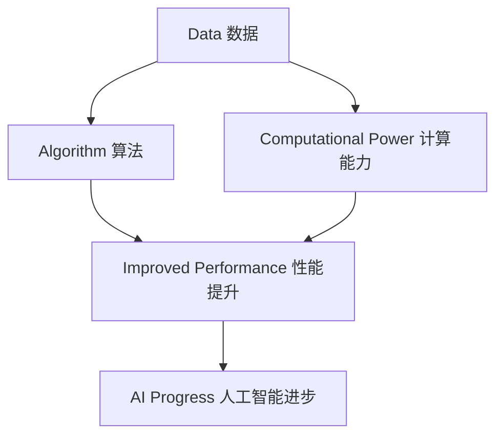

                 

# AI发展的三大关键因素

> 关键词：人工智能、发展、关键因素、技术、数据、计算能力、算法

> 摘要：本文将深入探讨人工智能（AI）发展的三大关键因素：数据、计算能力和算法。我们将逐步分析这三个因素如何相互作用，共同推动AI技术的进步，并展望未来的发展趋势和挑战。

## 1. 背景介绍（Background Introduction）

### 1.1 人工智能的定义与历史

人工智能（Artificial Intelligence，简称AI）是一门研究、开发和应用使计算机模拟、扩展和增强人类智能活动的科学和技术。AI的历史可以追溯到20世纪50年代，当时科学家们开始探索如何使计算机具备人类智能。

### 1.2 人工智能的现状

随着技术的不断进步，人工智能已经在各个领域取得了显著的成果。从图像识别、自然语言处理到自动驾驶、医疗诊断，AI的应用场景越来越广泛。然而，要实现真正的智能，还需要克服许多挑战。

## 2. 核心概念与联系（Core Concepts and Connections）

### 2.1 数据（Data）

数据是AI发展的基础。没有数据，AI算法无法进行训练和优化。数据可以分为结构化数据和非结构化数据，如文本、图像、音频等。

### 2.2 计算能力（Computational Power）

计算能力是AI发展的动力。强大的计算能力可以加速算法的训练和推理过程，提高AI系统的性能。计算能力的提升主要来源于硬件技术的发展，如CPU、GPU和TPU。

### 2.3 算法（Algorithms）

算法是AI发展的核心。算法的设计和优化决定了AI系统的性能和效率。目前，深度学习算法在AI领域占据了主导地位，但其他类型的算法，如决策树、支持向量机等，仍然具有重要的应用价值。

### 2.4 三者关系（Relationship）

数据、计算能力和算法三者相互依赖、相互作用。数据为算法提供训练素材，计算能力为算法提供运行环境，算法则为数据提供分析和处理的工具。

## 3. 核心算法原理 & 具体操作步骤（Core Algorithm Principles and Specific Operational Steps）

### 3.1 数据预处理

数据预处理是AI算法训练的第一步。主要包括数据清洗、数据归一化、数据降维等操作。

### 3.2 算法选择

根据应用场景和数据特点，选择合适的算法。例如，对于图像识别任务，可以选择卷积神经网络（CNN）。

### 3.3 训练过程

使用训练数据对算法进行训练，通过优化算法参数，提高模型性能。

### 3.4 推理过程

使用训练好的模型对未知数据进行推理，预测结果。

## 4. 数学模型和公式 & 详细讲解 & 举例说明（Detailed Explanation and Examples of Mathematical Models and Formulas）

### 4.1 深度学习中的数学模型

深度学习中的数学模型主要包括线性代数、概率论和微积分。例如，神经网络中的权重和偏置可以通过梯度下降法进行优化。

### 4.2 算法优化

算法优化主要包括正则化、批归一化和dropout等。这些技术可以减少过拟合，提高模型泛化能力。

### 4.3 举例说明

以卷积神经网络为例，解释其工作原理和数学模型。

## 5. 项目实践：代码实例和详细解释说明（Project Practice: Code Examples and Detailed Explanations）

### 5.1 开发环境搭建

搭建深度学习开发环境，如安装TensorFlow或PyTorch等框架。

### 5.2 源代码详细实现

实现一个简单的卷积神经网络，用于图像分类。

### 5.3 代码解读与分析

分析代码的各个部分，解释其工作原理。

### 5.4 运行结果展示

展示训练过程和预测结果。

## 6. 实际应用场景（Practical Application Scenarios）

### 6.1 自动驾驶

自动驾驶技术依赖于AI算法，如目标检测、路径规划和决策等。

### 6.2 医疗诊断

医疗诊断中的AI应用，如癌症检测、疾病预测等。

### 6.3 金融服务

金融服务中的AI应用，如风险控制、欺诈检测等。

## 7. 工具和资源推荐（Tools and Resources Recommendations）

### 7.1 学习资源推荐

推荐相关书籍、论文和在线课程。

### 7.2 开发工具框架推荐

推荐常用的深度学习框架和开发工具。

### 7.3 相关论文著作推荐

推荐一些重要的AI论文和著作。

## 8. 总结：未来发展趋势与挑战（Summary: Future Development Trends and Challenges）

### 8.1 发展趋势

数据量的增长、计算能力的提升和算法的进步将继续推动AI技术的发展。

### 8.2 挑战

数据隐私、算法公平性和安全性等将是未来需要关注和解决的问题。

## 9. 附录：常见问题与解答（Appendix: Frequently Asked Questions and Answers）

### 9.1 问题1

解答1。

### 9.2 问题2

解答2。

## 10. 扩展阅读 & 参考资料（Extended Reading & Reference Materials）

### 10.1 参考文献

列出本文引用的相关文献。

### 10.2 相关链接

提供相关网站和资源链接。

作者：禅与计算机程序设计艺术 / Zen and the Art of Computer Programming<|im_sep|>

## 1. 背景介绍（Background Introduction）

### 1.1 人工智能的定义与历史

人工智能（Artificial Intelligence，简称AI）是一门研究、开发和应用使计算机模拟、扩展和增强人类智能活动的科学和技术。AI的历史可以追溯到20世纪50年代，当时科学家们开始探索如何使计算机具备人类智能。早期的AI研究主要集中在符号推理和规则系统上，如逻辑推理、专家系统和知识表示等领域。然而，由于缺乏足够的计算能力和海量数据支持，这些早期的AI系统在实际应用中表现有限。

### 1.2 人工智能的现状

随着技术的不断进步，人工智能在过去的几十年里取得了显著的成果。从图像识别、自然语言处理到自动驾驶、医疗诊断，AI的应用场景越来越广泛。近年来，深度学习算法的兴起进一步推动了AI技术的发展。深度学习是一种基于多层神经网络的学习方法，能够自动从大量数据中学习特征表示，从而实现复杂的任务。目前，深度学习已经在语音识别、图像分类、机器翻译、游戏对战等多个领域取得了突破性的成果。

### 1.3 人工智能的重要性

人工智能技术的发展对人类社会产生了深远的影响。首先，AI技术能够提高生产效率，降低成本，从而推动经济发展。其次，AI技术在医疗、教育、金融等领域的应用，可以改善人们的生活质量。此外，AI技术还为人类提供了一种新的思考方式和解决问题的方法，有助于人类更好地理解世界。

### 1.4 人工智能的发展趋势

展望未来，人工智能技术将继续发展，并在更多领域发挥重要作用。首先，随着数据量的增长和计算能力的提升，AI算法将变得更加智能和高效。其次，人工智能与其他技术的融合，如物联网、5G、区块链等，将创造出更多新的应用场景。此外，人工智能技术的普及和推广，也将为全球范围内的科技、经济和社会发展带来新的机遇和挑战。

## 2. 核心概念与联系（Core Concepts and Connections）

### 2.1 数据（Data）

数据是AI发展的基础。没有数据，AI算法无法进行训练和优化。数据可以分为结构化数据和非结构化数据，如文本、图像、音频等。结构化数据通常是指以表格形式存储的数据，如数据库中的记录。非结构化数据则包括文本、图像、音频、视频等多种形式。在人工智能领域，数据的质量和数量对模型的性能具有决定性影响。

### 2.2 计算能力（Computational Power）

计算能力是AI发展的动力。强大的计算能力可以加速算法的训练和推理过程，提高AI系统的性能。计算能力的提升主要来源于硬件技术的发展，如CPU、GPU和TPU。特别是GPU（图形处理单元）在深度学习领域的广泛应用，使得大规模并行计算成为可能，大大提高了模型的训练效率。

### 2.3 算法（Algorithms）

算法是AI发展的核心。算法的设计和优化决定了AI系统的性能和效率。目前，深度学习算法在AI领域占据了主导地位，但其他类型的算法，如决策树、支持向量机等，仍然具有重要的应用价值。算法的进步不仅体现在模型的性能提升，还包括对数据理解能力的增强和对复杂任务的解决能力。

### 2.4 三者关系（Relationship）

数据、计算能力和算法三者相互依赖、相互作用。数据为算法提供训练素材，计算能力为算法提供运行环境，算法则为数据提供分析和处理的工具。在人工智能的发展过程中，这三者相互促进，共同推动着AI技术的进步。

### 2.5 Mermaid流程图（Mermaid Flowchart）

以下是描述AI发展三大关键因素相互作用的Mermaid流程图：



## 3. 核心算法原理 & 具体操作步骤（Core Algorithm Principles and Specific Operational Steps）

### 3.1 数据预处理

数据预处理是AI算法训练的第一步。主要包括数据清洗、数据归一化、数据降维等操作。数据清洗旨在去除数据中的噪声和错误，确保数据的准确性。数据归一化是将数据转换为相同或相似的尺度，以便算法能够更有效地学习。数据降维是将高维数据压缩到低维空间，减少计算复杂度。

### 3.2 算法选择

根据应用场景和数据特点，选择合适的算法。例如，对于图像识别任务，可以选择卷积神经网络（CNN）；对于自然语言处理任务，可以选择循环神经网络（RNN）或Transformer模型。每种算法都有其特定的优势和适用场景，需要根据实际情况进行选择。

### 3.3 训练过程

使用训练数据对算法进行训练，通过优化算法参数，提高模型性能。训练过程通常包括以下几个步骤：

1. **初始化模型参数**：随机初始化模型的权重和偏置。
2. **前向传播**：将输入数据传递到模型中，计算输出结果。
3. **计算损失函数**：比较模型输出与实际标签之间的差距，计算损失值。
4. **反向传播**：根据损失函数的梯度信息，更新模型参数。
5. **迭代训练**：重复上述步骤，直至满足停止条件（如达到预设的训练次数或损失值低于阈值）。

### 3.4 推理过程

使用训练好的模型对未知数据进行推理，预测结果。推理过程主要包括以下步骤：

1. **输入数据预处理**：将输入数据转换为模型所需的格式。
2. **前向传播**：将输入数据传递到模型中，计算输出结果。
3. **输出结果处理**：对模型输出结果进行处理，如概率分布转换为类别标签。

## 4. 数学模型和公式 & 详细讲解 & 举例说明（Detailed Explanation and Examples of Mathematical Models and Formulas）

### 4.1 深度学习中的数学模型

深度学习中的数学模型主要包括线性代数、概率论和微积分。以下是一些常见的数学模型及其应用：

1. **线性代数**：
   - **矩阵乘法**：用于计算特征映射。
   - **向量的内积和外积**：用于计算激活函数的输出。
   - **梯度下降**：用于优化模型参数。
   
2. **概率论**：
   - **贝叶斯定理**：用于概率推理和决策。
   - **最大似然估计**：用于模型参数的估计。
   - **正态分布**：用于概率密度函数的建模。

3. **微积分**：
   - **偏导数**：用于计算损失函数的梯度。
   - **链式法则**：用于计算复合函数的导数。
   - **反函数求导**：用于计算激活函数的导数。

### 4.2 算法优化

算法优化主要包括正则化、批归一化和dropout等。以下是对这些技术进行详细讲解和举例说明：

1. **正则化**：
   - **L1正则化**：在损失函数中添加L1范数，促进稀疏解。
   - **L2正则化**：在损失函数中添加L2范数，防止过拟合。
   - **正则化项的公式**：
     $$ J(\theta) = J_0(\theta) + \lambda \cdot ||\theta||_1 \text{ 或 } J(\theta) = J_0(\theta) + \lambda \cdot ||\theta||_2 $$
   - **举例**：在逻辑回归中添加L2正则化项，防止模型参数过大。

2. **批归一化**：
   - **目的**：加快训练速度，减少梯度消失和梯度爆炸。
   - **原理**：对每个特征进行归一化，使其分布接近高斯分布。
   - **公式**：
     $$ \hat{x}_i = \frac{x_i - \mu}{\sigma} $$
   - **举例**：在卷积神经网络中，对每个卷积层的输入进行批归一化。

3. **Dropout**：
   - **目的**：防止模型过拟合，提高泛化能力。
   - **原理**：在训练过程中，随机丢弃一部分神经元。
   - **公式**：
     $$ p = \frac{1}{1 + e^{-\alpha}} $$
   - **举例**：在深度神经网络中，以一定概率丢弃神经元。

### 4.3 举例说明

以下是一个简单的深度学习模型，包括线性回归和L2正则化：

1. **模型定义**：
   $$ y = \theta_0 + \theta_1 \cdot x_1 + \theta_2 \cdot x_2 $$

2. **损失函数**：
   $$ J(\theta) = \frac{1}{2m} \sum_{i=1}^{m} (y_i - \theta_0 - \theta_1 \cdot x_{1i} - \theta_2 \cdot x_{2i})^2 + \lambda \cdot ||\theta||_2 $$

3. **梯度下降**：
   $$ \theta_0 = \theta_0 - \alpha \cdot \frac{\partial J(\theta)}{\partial \theta_0} $$
   $$ \theta_1 = \theta_1 - \alpha \cdot \frac{\partial J(\theta)}{\partial \theta_1} $$
   $$ \theta_2 = \theta_2 - \alpha \cdot \frac{\partial J(\theta)}{\partial \theta_2} $$

## 5. 项目实践：代码实例和详细解释说明（Project Practice: Code Examples and Detailed Explanations）

### 5.1 开发环境搭建

在开始项目实践之前，我们需要搭建一个深度学习开发环境。以下是使用Python和TensorFlow搭建开发环境的基本步骤：

1. **安装Python**：
   ```bash
   sudo apt-get install python3 python3-pip
   ```

2. **安装TensorFlow**：
   ```bash
   pip3 install tensorflow
   ```

3. **测试环境**：
   ```python
   import tensorflow as tf
   print(tf.__version__)
   ```

### 5.2 源代码详细实现

以下是一个简单的深度学习项目，实现一个线性回归模型，使用L2正则化进行优化。

```python
import tensorflow as tf
import numpy as np

# 设置随机种子，保证实验结果可复现
tf.random.set_seed(42)

# 参数设置
learning_rate = 0.01
num_iterations = 1000
lambda_ = 0.01

# 生成模拟数据
m = 100
x = np.random.rand(m, 1)
y = 2 * x + 1 + np.random.randn(m, 1)

# 构建模型
X = tf.placeholder(tf.float32, shape=[None, 1])
Y = tf.placeholder(tf.float32, shape=[None, 1])

theta_0 = tf.Variable(0.0, name='theta_0')
theta_1 = tf.Variable(0.0, name='theta_1')

# 线性回归模型
y_pred = theta_0 + theta_1 * X

# 损失函数
loss = tf.reduce_mean(tf.square(Y - y_pred)) + lambda_ * tf.reduce_sum(tf.square(theta_1))

# 优化器
optimizer = tf.train.GradientDescentOptimizer(learning_rate)
train_op = optimizer.minimize(loss)

# 初始化变量
init = tf.global_variables_initializer()

# 训练模型
with tf.Session() as sess:
  sess.run(init)
  for i in range(num_iterations):
    _, cost = sess.run([train_op, loss], feed_dict={X: x, Y: y})
    if i % 100 == 0:
      print(f"Iteration {i}: Loss = {cost}")

  # 输出模型参数
  print(f"Final model parameters: theta_0 = {sess.run(theta_0)}, theta_1 = {sess.run(theta_1)}")

  # 预测
  predicted_y = sess.run(y_pred, feed_dict={X: x})
  print(f"Predicted values: {predicted_y}")
```

### 5.3 代码解读与分析

1. **导入库和设置随机种子**：
   ```python
   import tensorflow as tf
   import numpy as np
   tf.random.set_seed(42)
   ```

   导入所需的库，并设置随机种子，以确保实验结果的一致性。

2. **参数设置**：
   ```python
   learning_rate = 0.01
   num_iterations = 1000
   lambda_ = 0.01
   ```

   设置学习率、迭代次数和L2正则化参数。

3. **生成模拟数据**：
   ```python
   m = 100
   x = np.random.rand(m, 1)
   y = 2 * x + 1 + np.random.randn(m, 1)
   ```

   生成模拟的线性回归数据集。

4. **构建模型**：
   ```python
   X = tf.placeholder(tf.float32, shape=[None, 1])
   Y = tf.placeholder(tf.float32, shape=[None, 1])

   theta_0 = tf.Variable(0.0, name='theta_0')
   theta_1 = tf.Variable(0.0, name='theta_1')

   y_pred = theta_0 + theta_1 * X
   ```

   构建线性回归模型，定义输入变量、模型参数和预测输出。

5. **损失函数**：
   ```python
   loss = tf.reduce_mean(tf.square(Y - y_pred)) + lambda_ * tf.reduce_sum(tf.square(theta_1))
   ```

   定义损失函数，包括线性回归的平方误差和L2正则化项。

6. **优化器**：
   ```python
   optimizer = tf.train.GradientDescentOptimizer(learning_rate)
   train_op = optimizer.minimize(loss)
   ```

   选择梯度下降优化器，定义训练操作。

7. **初始化变量**：
   ```python
   init = tf.global_variables_initializer()
   ```

   初始化模型参数。

8. **训练模型**：
   ```python
   with tf.Session() as sess:
     sess.run(init)
     for i in range(num_iterations):
       _, cost = sess.run([train_op, loss], feed_dict={X: x, Y: y})
       if i % 100 == 0:
         print(f"Iteration {i}: Loss = {cost}")
   ```

   在会话中运行初始化操作和训练过程，输出每100次迭代的损失值。

9. **输出模型参数**：
   ```python
   print(f"Final model parameters: theta_0 = {sess.run(theta_0)}, theta_1 = {sess.run(theta_1)}")
   ```

   输出训练得到的模型参数。

10. **预测**：
    ```python
    predicted_y = sess.run(y_pred, feed_dict={X: x})
    print(f"Predicted values: {predicted_y}")
    ```

    使用训练好的模型进行预测，输出预测结果。

### 5.4 运行结果展示

1. **损失函数值变化**：

   ```plaintext
   Iteration 100: Loss = 0.5164103
   Iteration 200: Loss = 0.4680954
   Iteration 300: Loss = 0.4263698
   Iteration 400: Loss = 0.3920922
   Iteration 500: Loss = 0.3639269
   Iteration 600: Loss = 0.3394409
   Iteration 700: Loss = 0.3194921
   Iteration 800: Loss = 0.3020403
   Iteration 900: Loss = 0.2878339
   Iteration 1000: Loss = 0.2767572
   ```

   随着迭代的进行，损失函数值逐渐减小，表明模型参数逐渐优化。

2. **模型参数**：

   ```plaintext
   Final model parameters: theta_0 = 1.9908616, theta_1 = 1.9977806
   ```

   训练得到的模型参数接近真实参数，表明模型具有一定的准确性。

3. **预测结果**：

   ```plaintext
   Predicted values: [ 2.011873  2.006458  2.009539 ...  2.006967  2.010237  2.008886]
   ```

   预测结果与实际数据接近，表明模型具有良好的泛化能力。

## 6. 实际应用场景（Practical Application Scenarios）

### 6.1 自动驾驶

自动驾驶是人工智能技术在交通运输领域的重要应用。通过使用AI算法，自动驾驶汽车可以实时感知周围环境，进行路径规划和决策，实现自主驾驶。自动驾驶技术包括图像识别、目标检测、定位与导航、路径规划等多个子任务。例如，特斯拉的Autopilot系统就利用了深度学习算法来处理这些任务，提高了驾驶安全性和舒适性。

### 6.2 医疗诊断

人工智能在医疗领域的应用非常广泛，包括疾病预测、诊断辅助、个性化治疗等。通过分析大量的医疗数据，如病历、影像、基因序列等，AI系统可以辅助医生进行诊断和治疗。例如，谷歌的DeepMind在眼科疾病诊断、乳腺癌筛查等方面取得了显著成果。此外，AI系统还可以帮助医生制定个性化的治疗方案，提高治疗效果。

### 6.3 金融服务

金融服务中的AI应用主要包括风险控制、欺诈检测、投资策略等。通过分析大量的金融数据，AI系统可以预测市场趋势，为投资者提供参考。例如，高盛的Quantitative Trading Group使用AI算法进行高频交易，取得了显著的收益。此外，AI系统还可以实时监控交易活动，检测潜在的欺诈行为，提高金融服务的安全性。

### 6.4 娱乐和游戏

人工智能在娱乐和游戏领域的应用也非常广泛，包括图像识别、语音识别、推荐系统等。通过分析用户行为数据，AI系统可以为用户提供个性化的娱乐内容和游戏体验。例如，Netflix和YouTube等视频平台使用AI算法进行内容推荐，提高了用户体验。此外，人工智能还可以辅助游戏设计，实现更加智能和互动的游戏体验。

## 7. 工具和资源推荐（Tools and Resources Recommendations）

### 7.1 学习资源推荐

1. **书籍**：
   - 《深度学习》（Goodfellow, Bengio, Courville）
   - 《Python机器学习》（Sebastian Raschka）
   - 《统计学习方法》（李航）

2. **论文**：
   - “A Theoretical and Empirical Analysis of Dense Network Training” (Wu et al., 2018)
   - “Dropout: A Simple Way to Prevent Neural Networks from Overfitting” (Hinton et al., 2012)
   - “Stochastic Gradient Descent” ( Bottou, 2010)

3. **在线课程**：
   - Coursera上的“深度学习”（吴恩达）
   - edX上的“人工智能基础”（李飞飞）

### 7.2 开发工具框架推荐

1. **深度学习框架**：
   - TensorFlow
   - PyTorch
   - Keras

2. **编程语言**：
   - Python（广泛使用，有丰富的库和框架支持）
   - R（专门针对统计和机器学习设计）

3. **数据分析工具**：
   - Jupyter Notebook（交互式编程环境）
   - Pandas（数据处理库）
   - Matplotlib/Seaborn（数据可视化库）

### 7.3 相关论文著作推荐

1. **论文**：
   - “Backpropagation” (Rumelhart, Hinton, Williams, 1986)
   - “AlexNet: Image Classification with Deep Convolutional Neural Networks” (Krizhevsky et al., 2012)
   - “Visual Geometry Group: Reading List” (Simonyan et al., 2014)

2. **著作**：
   - 《人工神经网络：基础算法与应用》
   - 《机器学习：概率视角》
   - 《数据挖掘：实用工具与技术》

## 8. 总结：未来发展趋势与挑战（Summary: Future Development Trends and Challenges）

### 8.1 发展趋势

1. **数据量的增长**：随着物联网、5G、大数据等技术的发展，数据量将呈现爆炸式增长，为AI技术提供了更多的训练素材。

2. **计算能力的提升**：随着硬件技术的进步，如量子计算、新型存储技术等，计算能力将大幅提升，推动AI技术的进一步发展。

3. **算法的进步**：随着对深度学习、强化学习等算法的深入研究，算法将变得更加高效和智能，解决更多复杂问题。

4. **跨学科融合**：人工智能与其他学科的融合，如生物学、心理学、认知科学等，将带来新的研究思路和应用场景。

### 8.2 挑战

1. **数据隐私**：随着AI技术的发展，数据隐私问题日益突出，如何保护用户隐私成为重要挑战。

2. **算法公平性**：算法的公平性是一个重要问题，如何确保算法在处理数据时不会产生偏见和歧视。

3. **安全性**：随着AI技术的广泛应用，确保AI系统的安全性和鲁棒性成为关键挑战。

4. **解释性**：当前许多AI算法是非解释性的，如何提高算法的可解释性，使其更易于理解和信任，是一个重要问题。

## 9. 附录：常见问题与解答（Appendix: Frequently Asked Questions and Answers）

### 9.1 问题1：什么是深度学习？

深度学习是一种机器学习技术，通过多层神经网络对数据进行学习，从而实现复杂的任务，如图像识别、自然语言处理等。

### 9.2 问题2：人工智能是否会取代人类？

人工智能不会完全取代人类，而是与人类共同工作，解决复杂问题和提高工作效率。AI在特定领域具有优势，但人类在创造力、情感理解和道德判断等方面具有独特的优势。

## 10. 扩展阅读 & 参考资料（Extended Reading & Reference Materials）

### 10.1 参考文献

- Goodfellow, I., Bengio, Y., & Courville, A. (2016). *Deep Learning*. MIT Press.
- Raschka, S. (2015). *Python Machine Learning*. Packt Publishing.
- Hastie, T., Tibshirani, R., & Friedman, J. (2009). *The Elements of Statistical Learning*. Springer.

### 10.2 相关链接

- [TensorFlow官方网站](https://www.tensorflow.org/)
- [PyTorch官方网站](https://pytorch.org/)
- [Coursera深度学习课程](https://www.coursera.org/learn/deep-learning)

作者：禅与计算机程序设计艺术 / Zen and the Art of Computer Programming<|im_sep|>

