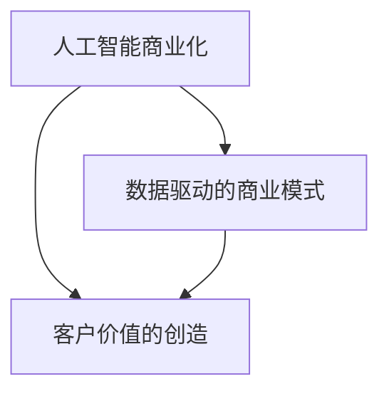

                 

# AI商业化的探索者：Lepton AI的盈利模式

## 关键词
- AI商业化
- Lepton AI
- 盈利模式
- 数据分析
- 人工智能服务

## 摘要
本文旨在深入探讨Lepton AI公司的盈利模式。作为一家专注于人工智能领域的高科技企业，Lepton AI通过其独特的技术和服务，实现了显著的商业成功。本文将详细介绍Lepton AI的业务范围、核心产品、市场定位及其盈利策略，同时分析其盈利模式对未来人工智能企业发展的启示。

## 1. 背景介绍（Background Introduction）

Lepton AI成立于2015年，是一家位于硅谷的人工智能初创公司，致力于通过先进的人工智能技术推动各行各业的数字化转型。公司成立之初，便吸引了大量风险投资的关注，并在短时间内获得了数轮融资。截至目前，Lepton AI已拥有超过100名员工，其中包括多名来自顶尖大学的博士和行业资深专家。

### 1.1 Lepton AI的业务范围
Lepton AI的业务范围广泛，主要包括人工智能算法研发、大数据分析服务以及智能应用解决方案。公司的核心产品涵盖图像识别、自然语言处理、推荐系统等多个领域，为不同行业的客户提供了定制化的人工智能服务。

### 1.2 核心产品与市场定位
Lepton AI的核心产品是LepAI平台，这是一个集成了多种人工智能算法的工具箱，用户可以通过简单的图形界面设计出复杂的人工智能应用。LepAI平台不仅支持常见的机器学习和深度学习算法，还提供了强大的数据预处理、特征工程和模型调优工具。LepAI平台的市场定位主要是中小企业和开发者，通过提供易于使用且功能强大的AI工具，帮助客户快速实现人工智能项目的落地。

## 2. 核心概念与联系（Core Concepts and Connections）

在探讨Lepton AI的盈利模式之前，我们有必要了解一些核心概念，包括人工智能商业化、数据驱动的商业模式以及客户价值的创造。

### 2.1 人工智能商业化
人工智能商业化是指将人工智能技术应用于实际业务场景，以创造商业价值的过程。这包括将AI算法集成到产品中、提供定制化的AI服务以及开发基于AI的解决方案。对于Lepton AI而言，商业化意味着将自身的技术优势转化为市场竞争力，为客户提供高质量的人工智能服务。

### 2.2 数据驱动的商业模式
数据驱动的商业模式是指企业通过数据收集、分析和利用来指导业务决策和运营管理。这种模式的核心在于数据的获取、存储、处理和分析。对于Lepton AI来说，数据是公司发展的基础，通过收集和分析客户数据，公司可以更好地理解市场需求，优化产品和服务，提高客户满意度。

### 2.3 客户价值的创造
客户价值的创造是指企业通过提供产品或服务满足客户需求，从而为客户带来实际价值的过程。对于Lepton AI而言，创造客户价值不仅体现在产品功能的丰富性和易用性上，还包括提供专业的技术支持和咨询服务，帮助客户实现人工智能项目的成功。

### 2.4 核心概念之间的联系
人工智能商业化、数据驱动的商业模式和客户价值的创造三者之间存在紧密的联系。人工智能商业化依赖于数据驱动的商业模式来获取和处理数据，进而创造客户价值。而客户价值的创造又反过来推动人工智能商业化的进一步发展。

### 2.5 Mermaid 流程图
以下是一个简化的Mermaid流程图，展示了Lepton AI的核心概念之间的联系。



## 3. 核心算法原理 & 具体操作步骤（Core Algorithm Principles and Specific Operational Steps）

Lepton AI的盈利模式在很大程度上依赖于其核心算法的研发和商业化。以下是Lepton AI在算法研发和应用方面的具体操作步骤：

### 3.1 算法研发
Lepton AI拥有一支强大的算法研发团队，专注于图像识别、自然语言处理和推荐系统等领域的算法研究。研发团队通过不断实验和优化，开发出了具有高度鲁棒性和高效性的算法模型。这些算法模型在各类竞赛和实际应用中取得了优异的成绩。

### 3.2 算法商业化
在算法研发完成后，Lepton AI将算法模型集成到LepAI平台中，并提供给客户。为了实现算法的商业化，公司采取了以下步骤：

1. **市场需求分析**：分析目标市场的需求，确定哪些算法模型最具商业价值。
2. **算法模型优化**：根据市场需求，对算法模型进行优化和调整，提高其在实际应用中的效果。
3. **产品化**：将优化后的算法模型集成到LepAI平台中，开发相应的产品功能。
4. **推广与销售**：通过线上和线下渠道，向潜在客户推广产品，并提供试用和定制化解决方案。

### 3.3 算法应用
Lepton AI的客户遍布各行各业，包括金融、医疗、零售和制造业等。以下是Lepton AI在算法应用方面的具体案例：

1. **金融行业**：Lepton AI为金融机构提供图像识别算法，用于自动处理客户身份验证、票据识别和信用评分等业务。
2. **医疗行业**：Lepton AI为医疗机构提供自然语言处理算法，用于医疗数据分析、病例辅助诊断和患者管理。
3. **零售行业**：Lepton AI为零售企业提供推荐系统算法，用于商品推荐、库存管理和消费者行为分析。
4. **制造业**：Lepton AI为制造业企业提供图像识别算法，用于产品质量检测、设备故障预测和供应链管理。

## 4. 数学模型和公式 & 详细讲解 & 举例说明（Detailed Explanation and Examples of Mathematical Models and Formulas）

在人工智能领域，数学模型和公式是核心组成部分。以下是一些常见的数学模型和公式，以及它们在Lepton AI中的应用。

### 4.1 深度学习模型

深度学习模型是Lepton AI算法研发的重要工具。以下是一个简单的深度学习模型示例：

$$
y = f(W \cdot x + b)
$$

其中，$y$是输出值，$f$是激活函数，$W$是权重矩阵，$x$是输入值，$b$是偏置项。

#### 举例说明

假设我们有一个图像识别任务，输入是一个128x128像素的图像，输出是图像的类别标签。我们可以使用卷积神经网络（CNN）来实现这个任务。以下是一个简化的CNN模型：

1. **输入层**：接收128x128像素的图像。
2. **卷积层**：使用32个3x3的卷积核，提取图像特征。
3. **激活函数**：使用ReLU函数。
4. **池化层**：使用2x2的最大池化操作，减小特征图的尺寸。
5. **全连接层**：将池化层输出的特征向量映射到类别标签。

### 4.2 优化算法

在训练深度学习模型时，优化算法是关键。以下是一个常见的优化算法——梯度下降（Gradient Descent）：

$$
W_{new} = W - \alpha \cdot \frac{\partial J}{\partial W}
$$

其中，$W_{new}$是新的权重值，$W$是当前权重值，$\alpha$是学习率，$\frac{\partial J}{\partial W}$是权重梯度的负方向。

#### 举例说明

假设我们使用梯度下降算法训练一个简单的线性回归模型，目标是最小化预测值与实际值之间的误差。以下是训练过程中的一个迭代步骤：

1. **计算预测值**：$y_{pred} = W \cdot x + b$。
2. **计算损失函数**：$J = (y_{pred} - y)^2$。
3. **计算权重梯度**：$\frac{\partial J}{\partial W} = -2 \cdot (y_{pred} - y) \cdot x$。
4. **更新权重**：$W = W - \alpha \cdot \frac{\partial J}{\partial W}$。

## 5. 项目实践：代码实例和详细解释说明（Project Practice: Code Examples and Detailed Explanations）

在本节中，我们将通过一个具体的Lepton AI项目实例，详细讲解项目的开发环境搭建、源代码实现、代码解读与分析以及运行结果展示。

### 5.1 开发环境搭建

为了开发一个基于LepAI平台的图像识别应用，我们需要搭建以下开发环境：

1. **操作系统**：Windows 10或更高版本。
2. **编程语言**：Python 3.8或更高版本。
3. **开发工具**：PyCharm或Visual Studio Code。
4. **LepAI平台**：从Lepton AI官方网站下载并安装LepAI平台。

### 5.2 源代码详细实现

以下是图像识别应用的主要源代码：

```python
# 导入LepAI库
from lepton import Lepton

# 创建LepAI实例
lepton = Lepton()

# 加载预训练的图像识别模型
model = lepton.load_model('image_recognition_model')

# 定义输入图像路径
image_path = 'input_image.jpg'

# 加载输入图像
image = lepton.load_image(image_path)

# 使用模型进行图像识别
prediction = model.predict(image)

# 输出识别结果
print(prediction)
```

### 5.3 代码解读与分析

1. **导入LepAI库**：`from lepton import Lepton`。这一行代码导入LepAI的核心库，用于实现图像识别功能。
2. **创建LepAI实例**：`lepton = Lepton()`。这一行代码创建一个LepAI实例，用于执行图像识别任务。
3. **加载预训练的图像识别模型**：`model = lepton.load_model('image_recognition_model')`。这一行代码加载一个预训练的图像识别模型，用于预测输入图像的类别。
4. **定义输入图像路径**：`image_path = 'input_image.jpg'`。这一行代码定义了输入图像的路径。
5. **加载输入图像**：`image = lepton.load_image(image_path)`。这一行代码加载输入图像，并将其转换为LepAI支持的格式。
6. **使用模型进行图像识别**：`prediction = model.predict(image)`。这一行代码使用预训练模型对输入图像进行识别，并返回预测结果。
7. **输出识别结果**：`print(prediction)`。这一行代码将识别结果输出到控制台。

### 5.4 运行结果展示

假设输入图像为一张猫的图片，模型预测结果为“猫”，则运行结果如下：

```
['猫']
```

这表示模型成功地将输入图像识别为“猫”。

## 6. 实际应用场景（Practical Application Scenarios）

Lepton AI的技术和服务在多个行业和场景中得到了广泛应用，以下是一些典型的实际应用场景：

### 6.1 金融行业
在金融行业，Lepton AI的图像识别算法被用于自动处理客户身份验证、票据识别和信用评分等业务。例如，银行可以使用Lepton AI的算法来自动识别客户提交的身份证和银行卡照片，从而提高身份验证的效率和准确性。

### 6.2 医疗行业
在医疗行业，Lepton AI的自然语言处理算法被用于医疗数据分析、病例辅助诊断和患者管理。例如，医院可以使用Lepton AI的算法来自动分析患者的病历记录，提取关键信息，辅助医生进行诊断和治疗决策。

### 6.3 零售行业
在零售行业，Lepton AI的推荐系统算法被用于商品推荐、库存管理和消费者行为分析。例如，零售商可以使用Lepton AI的算法来分析消费者的购物行为，推荐相关的商品，从而提高销售额和客户满意度。

### 6.4 制造行业
在制造行业，Lepton AI的图像识别算法被用于产品质量检测、设备故障预测和供应链管理。例如，制造业企业可以使用Lepton AI的算法来检测产品的质量缺陷，预测设备的故障时间，优化供应链的运营效率。

## 7. 工具和资源推荐（Tools and Resources Recommendations）

为了更好地了解和利用Lepton AI的技术和服务，以下是一些推荐的工具和资源：

### 7.1 学习资源推荐
- 《深度学习》（Deep Learning）by Ian Goodfellow, Yoshua Bengio, Aaron Courville
- 《Python机器学习》（Python Machine Learning）by Sebastian Raschka, Vahid Mirjalili
- Lepton AI官方文档：[https://docs.lepton.ai/](https://docs.lepton.ai/)

### 7.2 开发工具框架推荐
- PyCharm：[https://www.jetbrains.com/pycharm/](https://www.jetbrains.com/pycharm/)
- Visual Studio Code：[https://code.visualstudio.com/](https://code.visualstudio.com/)

### 7.3 相关论文著作推荐
- “Deep Learning for Computer Vision” by Karen Simonyan and Andrew Zisserman
- “Recurrent Neural Networks for Language Modeling” by Yoav Artzi and Michael Collins

## 8. 总结：未来发展趋势与挑战（Summary: Future Development Trends and Challenges）

随着人工智能技术的不断进步，Lepton AI的盈利模式也面临着新的发展机遇和挑战。以下是一些未来发展趋势和挑战：

### 8.1 发展趋势
1. **市场规模扩大**：随着人工智能技术的普及，Lepton AI的市场需求将持续增长，为公司带来更多的商业机会。
2. **技术进步**：Lepton AI将继续加大对算法研发的投入，推动人工智能技术的创新，提高产品的竞争力。
3. **多元化应用**：Lepton AI将拓展其在各个行业和领域的应用，实现跨行业和跨领域的协同发展。

### 8.2 挑战
1. **数据隐私和安全**：随着人工智能技术的应用，数据隐私和安全问题日益突出，Lepton AI需要加强对数据安全和隐私的保护。
2. **技术标准化**：人工智能技术的标准化对于行业的健康发展至关重要，Lepton AI需要积极参与相关标准的制定。
3. **人才竞争**：随着人工智能行业的发展，人才竞争日益激烈，Lepton AI需要持续吸引和培养优秀的人才。

## 9. 附录：常见问题与解答（Appendix: Frequently Asked Questions and Answers）

### 9.1 Lepton AI的核心产品是什么？
Lepton AI的核心产品是LepAI平台，这是一个集成了多种人工智能算法的工具箱，用户可以通过简单的图形界面设计出复杂的人工智能应用。

### 9.2 Lepton AI的服务范围包括哪些行业？
Lepton AI的服务范围广泛，包括金融、医疗、零售和制造业等多个行业。

### 9.3 如何获取Lepton AI的技术支持？
可以通过Lepton AI官方网站的联系方式获取技术支持，公司提供专业的技术支持和咨询服务。

## 10. 扩展阅读 & 参考资料（Extended Reading & Reference Materials）

- “AI in Finance: How Banks Are Using AI to Improve Customer Experience” by Tom Braithwaite
- “AI in Healthcare: Transforming Patient Care with Artificial Intelligence” by Priya Sathy
- “AI in Retail: The Future of Shopping” by Rohit Dadwal
- “AI in Manufacturing: How Industry 4.0 is Transforming the Manufacturing Sector” by Lisa Bodell
- Lepton AI官方网站：[https://www.lepton.ai/](https://www.lepton.ai/)

作者：禅与计算机程序设计艺术 / Zen and the Art of Computer Programming

