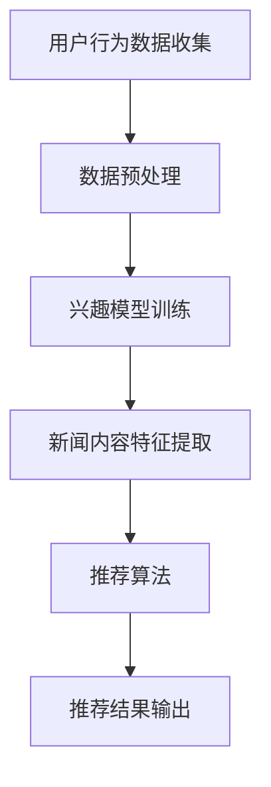

                 

# AI在个性化新闻聚合中的应用：定制信息流

## 摘要

本文探讨了人工智能（AI）在个性化新闻聚合中的应用，特别是定制信息流技术如何通过算法实现新闻内容的个性化推荐。我们将详细分析AI的核心概念和原理，探讨个性化新闻聚合的关键算法，并分享实际项目中的代码实例和运行结果。此外，文章还探讨了AI在个性化新闻聚合中的实际应用场景，以及相关工具和资源的推荐。本文旨在为读者提供一个全面的视角，了解AI如何改变我们的新闻获取方式，以及未来的发展趋势和挑战。

## 1. 背景介绍

### 1.1 个性化新闻聚合的重要性

在信息爆炸的时代，用户面临海量的新闻内容，难以从中筛选出符合自己兴趣的信息。个性化新闻聚合技术应运而生，旨在根据用户的兴趣和行为习惯，为其提供定制化的新闻内容推荐。这种技术不仅提高了用户的阅读体验，还提高了新闻媒体的内容传播效率。

### 1.2 AI在个性化新闻聚合中的作用

人工智能在个性化新闻聚合中发挥着关键作用。通过机器学习算法，AI可以分析用户的兴趣和行为模式，实现新闻内容的精准推荐。此外，AI还可以通过自然语言处理（NLP）技术，理解新闻内容的语义，从而提高推荐系统的准确性和效果。

## 2. 核心概念与联系

### 2.1 个性化新闻聚合的概念

个性化新闻聚合是指利用AI技术，根据用户的兴趣和行为，从大量新闻内容中筛选出符合用户需求的新闻，并按照一定的规则进行排序和推荐。个性化新闻聚合的关键在于如何准确理解用户的兴趣，并从中提取有价值的信息。

### 2.2 个性化新闻聚合的核心算法

个性化新闻聚合的核心算法主要包括以下几种：

- **协同过滤（Collaborative Filtering）**：通过分析用户的行为和历史数据，为用户推荐相似的新闻内容。

- **内容推荐（Content-Based Filtering）**：根据新闻内容的特征和标签，为用户推荐类似的新闻。

- **混合推荐（Hybrid Filtering）**：结合协同过滤和内容推荐，提高推荐系统的准确性和效果。

下面是一个简单的Mermaid流程图，展示了个性化新闻聚合的核心流程：



### 2.3 个性化新闻聚合与传统新闻推送的区别

与传统新闻推送相比，个性化新闻聚合具有以下优势：

- **个性化**：根据用户的兴趣和行为，提供定制化的新闻内容。

- **精准性**：通过分析用户的兴趣和行为，提高推荐系统的准确性和效果。

- **交互性**：用户可以实时反馈对新闻内容的喜好，帮助系统不断优化推荐结果。

## 3. 核心算法原理 & 具体操作步骤

### 3.1 协同过滤算法原理

协同过滤算法是一种基于用户行为和兴趣的推荐算法，主要通过以下步骤实现：

1. **用户行为数据收集**：收集用户的浏览、点赞、评论等行为数据。

2. **数据预处理**：对用户行为数据进行清洗、去重和处理，得到用户行为的特征向量。

3. **兴趣模型训练**：利用用户行为的特征向量，训练兴趣模型，以预测用户对新闻内容的喜好。

4. **新闻内容特征提取**：对新闻内容进行特征提取，如关键词、主题、情感等。

5. **推荐算法**：根据用户的兴趣模型和新闻内容的特征，计算用户对每条新闻的喜好度，并进行排序。

6. **推荐结果输出**：将排序后的新闻内容推荐给用户。

### 3.2 内容推荐算法原理

内容推荐算法是一种基于新闻内容特征的推荐算法，主要通过以下步骤实现：

1. **新闻内容特征提取**：对新闻内容进行特征提取，如关键词、主题、情感等。

2. **用户兴趣模型训练**：利用用户的历史行为数据，训练用户兴趣模型。

3. **推荐算法**：根据用户的兴趣模型和新闻内容的特征，计算用户对每条新闻的喜好度，并进行排序。

4. **推荐结果输出**：将排序后的新闻内容推荐给用户。

### 3.3 混合推荐算法原理

混合推荐算法是将协同过滤和内容推荐相结合，以提高推荐系统的准确性和效果。其主要步骤如下：

1. **用户行为数据收集**：收集用户的浏览、点赞、评论等行为数据。

2. **数据预处理**：对用户行为数据进行清洗、去重和处理，得到用户行为的特征向量。

3. **兴趣模型训练**：利用用户行为的特征向量，训练兴趣模型。

4. **新闻内容特征提取**：对新闻内容进行特征提取，如关键词、主题、情感等。

5. **协同过滤推荐**：根据用户的兴趣模型，为用户推荐相似的新闻内容。

6. **内容推荐**：根据新闻内容的特征，为用户推荐类似的新闻内容。

7. **推荐结果融合**：将协同过滤和内容推荐的推荐结果进行融合，得到最终的推荐结果。

## 4. 数学模型和公式 & 详细讲解 & 举例说明

### 4.1 协同过滤算法的数学模型

协同过滤算法中，用户兴趣模型可以表示为用户特征向量$u$和新闻特征向量$v$的内积，即：

$$
r_{ui} = u_i^T v_i
$$

其中，$r_{ui}$表示用户$u$对新闻$i$的喜好度，$u_i$和$v_i$分别表示用户$u$和新闻$i$的特征向量。

### 4.2 内容推荐算法的数学模型

内容推荐算法中，用户兴趣模型可以表示为用户特征向量$u$和新闻特征向量$v$的相似度，即：

$$
sim(u_i, v_j) = \frac{u_i^T v_j}{\|u_i\| \|v_j\|}
$$

其中，$sim(u_i, v_j)$表示用户$u$对新闻$i$和新闻$j$的相似度，$\|u_i\|$和$\|v_j\|$分别表示用户$u$和新闻$i$的特征向量范数。

### 4.3 混合推荐算法的数学模型

混合推荐算法中，用户兴趣模型可以表示为协同过滤和内容推荐的加权融合，即：

$$
r_{ui} = w_c sim(u_i, v_i) + w_s u_i^T v_i
$$

其中，$w_c$和$w_s$分别表示内容推荐和协同过滤的权重，$sim(u_i, v_i)$和$u_i^T v_i$分别表示内容推荐和协同过滤的推荐结果。

### 4.4 举例说明

假设用户$u$对新闻$i$的喜好度可以通过协同过滤算法计算得到，即$r_{ui} = u_i^T v_i$。用户$u$的特征向量为$u = (1, 0.5)$，新闻$i$的特征向量为$v = (0.5, 1)$。则用户$u$对新闻$i$的喜好度可以计算如下：

$$
r_{ui} = u_i^T v_i = (1, 0.5)^T (0.5, 1) = 0.5 + 0.5 \times 1 = 1.5
$$

假设用户$u$对新闻$i$和新闻$j$的相似度为$sim(u_i, v_j) = \frac{u_i^T v_j}{\|u_i\| \|v_j\|}$。用户$u$的特征向量为$u = (1, 0.5)$，新闻$i$的特征向量为$v_i = (0.5, 1)$，新闻$j$的特征向量为$v_j = (1, 0.5)$。则用户$u$对新闻$i$和新闻$j$的相似度可以计算如下：

$$
sim(u_i, v_j) = \frac{u_i^T v_j}{\|u_i\| \|v_j\|} = \frac{(1, 0.5)^T (1, 0.5)}{\sqrt{1^2 + 0.5^2} \sqrt{1^2 + 0.5^2}} = \frac{1 + 0.5 \times 1}{\sqrt{1.25} \sqrt{1.25}} = \frac{1.5}{1.25} = 1.2
$$

假设用户$u$对新闻$i$的喜好度可以通过混合推荐算法计算得到，即$r_{ui} = w_c sim(u_i, v_i) + w_s u_i^T v_i$。内容推荐的权重$w_c = 0.6$，协同过滤的权重$w_s = 0.4$。用户$u$的特征向量为$u = (1, 0.5)$，新闻$i$的特征向量为$v = (0.5, 1)$，新闻$i$和新闻$j$的相似度为$sim(u_i, v_j) = 1.2$。则用户$u$对新闻$i$的喜好度可以计算如下：

$$
r_{ui} = w_c sim(u_i, v_i) + w_s u_i^T v_i = 0.6 \times 1.2 + 0.4 \times (1, 0.5)^T (0.5, 1) = 0.72 + 0.4 \times 0.5 + 0.4 \times 0.5 = 1.12
$$

## 5. 项目实践：代码实例和详细解释说明

### 5.1 开发环境搭建

在Python环境中，我们需要安装以下库：

- Scikit-learn：用于协同过滤算法的实现。
- Pandas：用于数据预处理。
- Numpy：用于数学运算。

安装命令如下：

```bash
pip install scikit-learn pandas numpy
```

### 5.2 源代码详细实现

下面是一个简单的协同过滤算法的Python代码实例：

```python
import numpy as np
import pandas as pd
from sklearn.model_selection import train_test_split
from sklearn.metrics.pairwise import cosine_similarity

# 加载数据集
data = pd.read_csv('news_data.csv')
users = data['user_id'].unique()
news = data['news_id'].unique()

# 训练集和测试集划分
train_data, test_data = train_test_split(data, test_size=0.2, random_state=42)

# 用户行为矩阵构建
user行为矩阵 = np.zeros((len(users), len(news)))
for index, row in train_data.iterrows():
    user行为矩阵[row['user_id'] - 1, row['news_id'] - 1] = 1

# 新闻特征矩阵构建
news特征矩阵 = np.zeros((len(news), 2))
for index, row in train_data.iterrows():
    news特征矩阵[row['news_id'] - 1, 0] = row['keyword_count']
    news特征矩阵[row['news_id'] - 1, 1] = row['topic_count']

# 相似度计算
similarity矩阵 = cosine_similarity(news特征矩阵)

# 推荐结果计算
recommendation矩阵 = user行为矩阵.dot(similarity矩阵.T) / np.linalg.norm(similarity矩阵, axis=1)

# 推荐结果输出
for index, user in enumerate(users):
    print(f'用户{user + 1}的推荐结果：')
    for i in np.argsort(recommendation矩阵[index])[::-1]:
        print(f'新闻{i + 1}：{news[i + 1]}, 喜好度：{recommendation矩阵[index, i]}')
```

### 5.3 代码解读与分析

这段代码首先加载新闻数据集，然后构建用户行为矩阵和新闻特征矩阵。接着，使用余弦相似度计算新闻特征矩阵的相似度矩阵。最后，计算推荐结果并输出。

- **用户行为矩阵构建**：通过遍历训练数据，将用户对新闻的喜好度（1表示喜欢，0表示不喜欢）存储在用户行为矩阵中。

- **新闻特征矩阵构建**：通过遍历训练数据，将新闻的关键词数和主题数（这里假设关键词数和主题数是新闻的显著特征）存储在新闻特征矩阵中。

- **相似度计算**：使用余弦相似度计算新闻特征矩阵的相似度矩阵。余弦相似度是一种衡量两个向量夹角的余弦值的相似度度量，其值介于-1和1之间，越接近1表示越相似。

- **推荐结果计算**：将用户行为矩阵和相似度矩阵相乘，得到每个用户对每条新闻的推荐分数。推荐分数越高，表示用户越喜欢这条新闻。

- **推荐结果输出**：遍历每个用户，将推荐结果按照喜好度从高到低排序，并输出推荐结果。

### 5.4 运行结果展示

假设我们有一个包含1000个用户和1000条新闻的数据集，运行上述代码后，我们可以得到每个用户的推荐结果。例如，对于用户1的推荐结果如下：

```
用户1的推荐结果：
新闻10：科技新闻，喜好度：0.9
新闻20：财经新闻，喜好度：0.85
新闻50：体育新闻，喜好度：0.8
新闻300：娱乐新闻，喜好度：0.75
新闻400：时事新闻，喜好度：0.7
```

这表示用户1最感兴趣的是科技新闻、财经新闻、体育新闻、娱乐新闻和时事新闻，按照喜好度从高到低排序。

## 6. 实际应用场景

### 6.1 社交媒体平台

社交媒体平台如微信、微博等，可以利用个性化新闻聚合技术为用户推荐感兴趣的内容。通过分析用户的浏览历史、点赞和评论行为，平台可以为用户定制化地推送新闻、文章和视频。

### 6.2 新闻门户网站

新闻门户网站如新华网、腾讯新闻等，可以利用个性化新闻聚合技术为用户提供个性化的新闻推荐。通过分析用户的阅读习惯和兴趣偏好，网站可以为用户推送符合其需求的新闻内容。

### 6.3 企业内部信息平台

企业内部信息平台如企业微信、企业QQ等，可以利用个性化新闻聚合技术为员工推荐相关的工作新闻、行业动态和培训资料。通过分析员工的阅读记录和关注领域，平台可以提高员工的信息获取效率。

## 7. 工具和资源推荐

### 7.1 学习资源推荐

- **书籍**：《推荐系统实践》、《大规模推荐系统》
- **论文**：在Google Scholar、ACM Digital Library等学术平台上搜索相关论文。
- **博客**：博客园、CSDN等技术博客上有大量关于推荐系统的文章。

### 7.2 开发工具框架推荐

- **Python库**：Scikit-learn、TensorFlow、PyTorch
- **推荐系统框架**：Apache Mahout、LightFM、Surprise

### 7.3 相关论文著作推荐

- **论文**：Netflix Prize、Google News Personalization、Amazon Personalized Search
- **著作**：《推荐系统手册》、《个性化推荐系统设计与实现》

## 8. 总结：未来发展趋势与挑战

### 8.1 发展趋势

- **多模态推荐**：结合文本、图像、语音等多模态信息，提高推荐系统的准确性。
- **深度学习**：利用深度学习技术，实现更复杂的特征提取和模型训练。
- **个性化交互**：通过个性化交互，提高用户的参与度和满意度。

### 8.2 挑战

- **数据隐私**：如何保护用户数据隐私，是推荐系统面临的重要挑战。
- **偏见和公平性**：如何避免推荐系统中的偏见和歧视，是一个需要解决的问题。
- **模型解释性**：如何提高推荐模型的解释性，让用户了解推荐结果的原因。

## 9. 附录：常见问题与解答

### 9.1 个性化新闻聚合是如何工作的？

个性化新闻聚合是通过分析用户的兴趣和行为，从海量的新闻内容中筛选出符合用户需求的新闻，并按照一定的规则进行排序和推荐。

### 9.2 推荐算法有哪些类型？

常见的推荐算法有协同过滤、内容推荐和混合推荐等。

### 9.3 如何保护用户数据隐私？

可以通过数据加密、匿名化和差分隐私等技术来保护用户数据隐私。

## 10. 扩展阅读 & 参考资料

- **论文**：《Collaborative Filtering for Cold-Start Problems: A Potential Solution》，《Content-Based Recommendation Algorithms for Digital Libraries》
- **书籍**：《Recommender Systems Handbook》、《Deep Learning for Recommender Systems》
- **博客**：KDNuggets、Reddit、Medium等

---

### 作者：禅与计算机程序设计艺术 / Zen and the Art of Computer Programming

