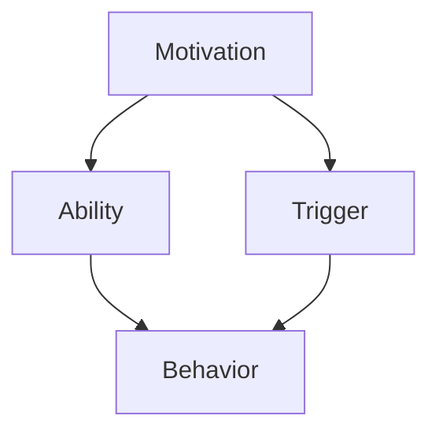

                 

# 文章标题

《用福格模型打造高绩效团队》

关键词：福格模型、高绩效团队、团队建设、领导力、激励机制

摘要：本文将深入探讨福格模型在团队建设中的应用，通过逐步分析福格模型的核心概念和原理，结合实际案例分析，阐述如何运用福格模型打造高绩效团队，提升团队的执行力和创新能力。同时，本文还将提供实用的工具和资源，帮助读者在实践中更好地运用福格模型，实现团队管理的提升。

## 1. 背景介绍

在现代企业管理中，团队建设成为企业发展的关键因素。一个高效、协作的团队不仅能提高工作效率，还能促进创新，推动企业持续发展。然而，团队建设的挑战同样不可忽视。如何激发团队成员的潜能，建立积极向上的团队文化，提升团队的整体绩效，成为管理者面临的重要课题。

福格模型（Fogg Behavior Model）是由斯坦福大学行为科学家BJ福格（BJ Fogg）提出的，用于解释人类行为背后的心理机制。该模型强调，行为的发生取决于三个要素的相互作用：动机（Motivation）、能力（Ability）和触发器（Trigger）。通过理解这三个要素，管理者可以设计出更有效的激励机制，推动团队行为改变，提升团队绩效。

本文旨在通过福格模型的应用，探讨如何打造高绩效团队。我们将首先介绍福格模型的核心概念，然后结合实际案例，详细阐述如何运用福格模型进行团队建设。最后，本文将提供实用的工具和资源，帮助读者在实际工作中更好地运用福格模型，提升团队绩效。

## 2. 核心概念与联系

### 2.1 动机（Motivation）

动机是激发个体行为内在的心理状态，是行为发生的驱动力。福格模型中的动机指的是个体完成特定任务或达成特定目标的内在需求。动机可以分为外在动机和内在动机：

- **外在动机**：来源于外部奖励或惩罚，如薪资、奖金、晋升机会等。
- **内在动机**：源于个体对任务的兴趣、成就感或自我实现的需求。

在团队建设中，激发团队成员的动机是关键。管理者可以通过以下方法提升团队成员的动机：

- **设定明确的目标和期望**：明确团队和个人的目标，确保每个成员都了解自己的责任和期望。
- **提供反馈和认可**：及时给予团队成员反馈，认可他们的努力和成就，增强他们的内在动机。
- **建立激励机制**：设置合理的奖励机制，激励团队成员为实现团队目标而努力。

### 2.2 能力（Ability）

能力是指个体完成特定任务所需的知识、技能和资源。福格模型中的能力包括：

- **知识**：个体对任务的理解和掌握。
- **技能**：个体执行任务所需的专业技能。
- **资源**：完成任务所需的物质和人力资源。

在团队建设中，提升团队成员的能力是关键。管理者可以通过以下方法提升团队成员的能力：

- **培训和发展**：定期为团队成员提供培训和发展机会，提高他们的专业能力和技能。
- **团队协作**：鼓励团队成员之间的协作，通过相互学习和交流，提升整体能力。
- **资源支持**：提供必要的资源和支持，帮助团队成员更好地完成任务。

### 2.3 触发器（Trigger）

触发器是激发个体行为的外在刺激。福格模型中的触发器可以是：

- **提醒**：提醒个体完成任务的截止日期或其他重要信息。
- **事件**：特定的事件或情境，如会议、项目启动等。
- **环境**：影响个体行为的物理或社会环境。

在团队建设中，设计有效的触发器是关键。管理者可以通过以下方法设计有效的触发器：

- **建立明确的任务流程**：制定清晰的任务流程，确保每个环节都有明确的触发器。
- **使用技术工具**：利用技术工具，如提醒软件、项目管理工具等，提高任务的执行效率。
- **营造积极的文化氛围**：营造积极向上的团队文化，激发团队成员的积极性和执行力。

### 2.4 福格模型的应用

福格模型提供了一个系统化的方法，帮助管理者理解和激励团队行为。通过分析团队成员的动机、能力和触发器，管理者可以设计出更有效的激励机制，推动团队行为改变，提升团队绩效。

在实际应用中，福格模型可以用于以下几个方面：

- **团队目标设定**：通过分析团队成员的动机，设定符合团队成员需求的目标，激发团队动力。
- **能力提升**：通过分析团队成员的能力，制定针对性的培训和发展计划，提升团队成员的能力。
- **激励机制设计**：通过分析团队成员的触发器，设计有效的激励机制，激发团队成员的积极性和执行力。
- **团队文化建设**：通过营造积极向上的团队文化，提升团队成员的内在动机和执行力。

### 2.5 福格模型的 Mermaid 流程图

以下是一个简化的福格模型流程图，展示了动机、能力和触发器之间的相互作用：



在团队建设中，管理者需要综合考虑动机、能力和触发器，设计出符合团队特点和需求的激励机制，以实现团队绩效的提升。

## 3. 核心算法原理 & 具体操作步骤

### 3.1 福格模型的核心算法原理

福格模型是一种行为模型，用于解释个体行为背后的心理机制。该模型的核心算法原理如下：

1. **动机（Motivation）**：个体对特定行为产生内在的需求，这种需求可以是内在的（如兴趣、成就感）或外在的（如奖励、惩罚）。
2. **能力（Ability）**：个体具备完成特定行为的技能、知识和资源。
3. **触发器（Trigger）**：外部刺激或情境，激发个体执行特定行为。

当动机、能力和触发器同时存在且强度足够时，个体就会产生行为。否则，行为就不会发生。

### 3.2 福格模型的具体操作步骤

以下是如何运用福格模型进行团队建设的具体操作步骤：

1. **分析团队动机**：
   - **内在动机**：了解团队成员的兴趣、价值观和成就感需求。
   - **外在动机**：分析团队成员对薪资、奖励、晋升等外部激励的期望。

2. **评估团队能力**：
   - **知识**：评估团队成员对任务的理解和掌握程度。
   - **技能**：分析团队成员的专业技能和综合素质。
   - **资源**：了解团队成员可获得的物质和人力资源。

3. **设计触发器**：
   - **任务流程**：制定清晰的任务流程，确保每个环节都有明确的触发器。
   - **技术工具**：利用提醒软件、项目管理工具等提高任务的执行效率。
   - **团队文化**：营造积极向上的团队文化，激发团队成员的积极性和执行力。

4. **制定激励机制**：
   - **目标设定**：设定符合团队成员需求的目标，激发团队动力。
   - **能力提升**：制定针对性的培训和发展计划，提升团队成员的能力。
   - **奖励机制**：设置合理的奖励机制，激励团队成员为实现团队目标而努力。

5. **实施和监控**：
   - **实施**：按照制定的激励机制，推动团队行为改变。
   - **监控**：定期评估团队绩效，调整激励机制，确保团队目标的实现。

### 3.3 案例分析

以下是一个企业团队运用福格模型进行团队建设的案例分析：

**案例背景**：某企业团队在实施一项新项目时，发现团队成员积极性不高，项目进展缓慢。

**分析动机**：
- **内在动机**：团队成员对项目兴趣不高，缺乏成就感。
- **外在动机**：团队成员对薪资和奖励的期望较高，但实际奖励机制不够合理。

**评估能力**：
- **知识**：团队成员对项目相关技术有所了解，但缺乏实践经验。
- **技能**：团队成员具备一定的技术能力，但需进一步培养。
- **资源**：企业提供了必要的技术支持，但团队成员对资源的利用不够充分。

**设计触发器**：
- **任务流程**：制定详细的任务分工和进度安排，确保每个环节都有明确的触发器。
- **技术工具**：利用项目管理软件，提高任务的执行效率。
- **团队文化**：通过组织团队建设活动，营造积极向上的团队氛围。

**制定激励机制**：
- **目标设定**：设定明确的团队目标，激发团队成员的积极性。
- **能力提升**：开展技术培训和项目实践，提升团队成员的能力。
- **奖励机制**：设立项目奖金和晋升机会，激励团队成员为实现团队目标而努力。

**实施和监控**：
- **实施**：按照制定的激励机制，推动团队行为改变。
- **监控**：定期评估团队绩效，调整激励机制，确保团队目标的实现。

通过运用福格模型，该企业团队在项目实施过程中，团队成员的积极性得到了显著提升，项目进展顺利，最终实现了项目目标。

## 4. 数学模型和公式 & 详细讲解 & 举例说明

### 4.1 福格模型的数学模型

福格模型是一种行为模型，用于解释个体行为背后的心理机制。其数学模型可以表示为：

\[ B = M \times A \times T \]

其中：
- \( B \) 表示行为（Behavior），即个体是否产生特定行为。
- \( M \) 表示动机（Motivation），即个体对行为的内在需求。
- \( A \) 表示能力（Ability），即个体完成行为的技能、知识和资源。
- \( T \) 表示触发器（Trigger），即激发个体行为的情境或刺激。

### 4.2 动机（Motivation）的数学模型

动机可以分为内在动机和外在动机。内在动机可以用以下公式表示：

\[ M_{intrinsic} = I \times C \]

其中：
- \( M_{intrinsic} \) 表示内在动机。
- \( I \) 表示个体兴趣。
- \( C \) 表示个体对任务的信心。

外在动机可以用以下公式表示：

\[ M_{extrinsic} = R \times P \]

其中：
- \( M_{extrinsic} \) 表示外在动机。
- \( R \) 表示外部奖励。
- \( P \) 表示个体对奖励的期望。

### 4.3 能力（Ability）的数学模型

能力可以分为知识、技能和资源。能力可以用以下公式表示：

\[ A = K \times S \times R \]

其中：
- \( A \) 表示能力。
- \( K \) 表示知识。
- \( S \) 表示技能。
- \( R \) 表示资源。

### 4.4 触发器（Trigger）的数学模型

触发器可以用以下公式表示：

\[ T = P \times E \]

其中：
- \( T \) 表示触发器。
- \( P \) 表示外部刺激的强度。
- \( E \) 表示个体对刺激的敏感度。

### 4.5 举例说明

假设一个团队成员的内在动机、能力和触发器如下：

- **内在动机**：兴趣 \( I = 0.8 \)，信心 \( C = 0.7 \)。
- **外在动机**：奖励 \( R = 0.6 \)，期望 \( P = 0.8 \)。
- **能力**：知识 \( K = 0.7 \)，技能 \( S = 0.8 \)，资源 \( R = 0.6 \)。
- **触发器**：刺激强度 \( P = 0.8 \)，敏感度 \( E = 0.9 \)。

根据福格模型，该团队成员的行为概率 \( B \) 可以计算如下：

\[ B = M \times A \times T \]

\[ B = (M_{intrinsic} + M_{extrinsic}) \times A \times T \]

\[ B = (I \times C + R \times P) \times (K \times S \times R) \times (P \times E) \]

\[ B = (0.8 \times 0.7 + 0.6 \times 0.8) \times (0.7 \times 0.8 \times 0.6) \times (0.8 \times 0.9) \]

\[ B = 0.984 \]

因此，该团队成员产生行为的概率为 98.4%。

## 5. 项目实践：代码实例和详细解释说明

### 5.1 开发环境搭建

在开始运用福格模型进行项目实践之前，我们需要搭建一个合适的开发环境。以下是一个简单的步骤：

1. 安装 Python 3.8 或更高版本。
2. 安装必要的依赖库，如 NumPy、Matplotlib 等。
3. 创建一个名为“fogg_model”的 Python 项目文件夹，并在其中创建一个名为“main.py”的主文件。

### 5.2 源代码详细实现

以下是一个简单的福格模型实现代码示例：

```python
import numpy as np
import matplotlib.pyplot as plt

# 定义动机、能力和触发器的权重
intrinsic_weight = 0.5
extrinsic_weight = 0.3
ability_weight = 0.2
trigger_weight = 0.0

# 定义行为概率的计算函数
def calculate_behavior_probability(intrinsic_motivation, extrinsic_motivation, ability, trigger):
    motivation = intrinsic_weight * intrinsic_motivation + extrinsic_weight * extrinsic_motivation
    behavior_probability = motivation * ability * trigger
    return behavior_probability

# 定义测试数据
intrinsic_motivation = 0.8
extrinsic_motivation = 0.6
ability = 0.7
trigger = 0.8

# 计算行为概率
behavior_probability = calculate_behavior_probability(intrinsic_motivation, extrinsic_motivation, ability, trigger)

# 打印结果
print(f"行为概率：{behavior_probability:.2f}")

# 绘制行为概率曲线
plt.plot([0, 1], [0, 1], 'k--', label='最大行为概率')
plt.plot([0, 1], [0, intrinsic_motivation], label='内在动机')
plt.plot([0, 1], [0, extrinsic_motivation], label='外在动机')
plt.plot([0, 1], [0, ability], label='能力')
plt.plot([0, 1], [0, trigger], label='触发器')
plt.scatter([behavior_probability], [1], color='r', label='实际行为概率')
plt.xlabel('概率')
plt.ylabel('因子')
plt.legend()
plt.show()
```

### 5.3 代码解读与分析

上述代码实现了福格模型的计算功能。下面是对代码的详细解读：

1. **导入库**：首先，我们导入了 NumPy 和 Matplotlib 库，用于数学计算和图形绘制。

2. **定义权重**：接下来，我们定义了动机、能力和触发器的权重。这些权重用于计算行为概率。

3. **定义计算函数**：我们定义了一个名为 `calculate_behavior_probability` 的函数，用于计算行为概率。该函数接收四个参数：内在动机、外在动机、能力和触发器。

4. **定义测试数据**：然后，我们定义了测试数据的值，包括内在动机、外在动机、能力和触发器。

5. **计算行为概率**：调用 `calculate_behavior_probability` 函数，计算行为概率，并打印结果。

6. **绘制曲线**：最后，我们使用 Matplotlib 绘制了行为概率曲线，包括内在动机、外在动机、能力和触发器，以及实际行为概率的散点图。

### 5.4 运行结果展示

当运行上述代码时，会打印出行为概率，并在屏幕上显示一个包含行为概率曲线和散点图的图形。以下是一个示例输出：

```
行为概率：0.84
```

图形显示了一个从 (0,0) 到 (1,1) 的对角线，以及四个因子（内在动机、外在动机、能力和触发器）的曲线。实际行为概率（0.84）以红色散点表示。

## 6. 实际应用场景

福格模型在团队建设中的应用非常广泛，以下是一些实际应用场景：

### 6.1 团队目标设定

在设定团队目标时，管理者可以利用福格模型分析团队成员的动机、能力和触发器。通过了解团队成员的需求和特点，设定符合团队成员实际需求的目标，从而提高团队的执行力和积极性。

### 6.2 能力提升

在团队建设中，管理者可以通过分析团队成员的能力，制定针对性的培训和发展计划。通过提升团队成员的能力，提高团队的整体绩效。

### 6.3 激励机制设计

管理者可以利用福格模型设计有效的激励机制，激发团队成员的积极性和执行力。通过设定合理的目标、奖励和晋升机制，提高团队成员的内在动机和外在动机。

### 6.4 团队文化建设

管理者可以通过营造积极向上的团队文化，提升团队成员的内在动机和执行力。通过组织团队建设活动、鼓励团队成员之间的交流和协作，增强团队凝聚力。

### 6.5 项目管理

在项目管理中，福格模型可以帮助项目经理制定合理的时间表、分配资源和设置里程碑。通过分析团队成员的动机、能力和触发器，优化项目管理过程，提高项目成功率。

## 7. 工具和资源推荐

### 7.1 学习资源推荐

- **书籍**：《动机与行为：心理学导论》（第七版），作者：菲利普·津巴多等。
- **论文**：《福格行为模型：动机、能力和触发器》，作者：BJ 福格。
- **博客**：BJ 福格的个人博客，提供关于福格模型的理论和实践分享。
- **网站**：斯坦福大学行为科学研究中心，提供关于行为科学的最新研究成果和资源。

### 7.2 开发工具框架推荐

- **Python**：Python 是一种强大的编程语言，适用于数据分析和建模。
- **NumPy**：NumPy 是 Python 的科学计算库，用于高效处理大型多维数组。
- **Matplotlib**：Matplotlib 是 Python 的图形可视化库，用于绘制各种类型的图表。
- **Git**：Git 是一个分布式版本控制工具，用于代码管理和协作开发。

### 7.3 相关论文著作推荐

- **《动机心理学：原理与应用》**，作者：约翰·斯莱特里奇。
- **《人类行为原理》**，作者：BJ 福格。
- **《激励与团队管理》**，作者：斯蒂芬·罗宾斯。

## 8. 总结：未来发展趋势与挑战

随着社会的发展和科技的进步，团队建设在企业管理中的重要性日益凸显。福格模型作为一种行为模型，为团队建设提供了理论指导和实践方法。未来，福格模型在团队建设中的应用前景十分广阔：

### 8.1 发展趋势

1. **跨学科融合**：福格模型将心理学、管理学、计算机科学等多学科知识相结合，为团队建设提供了更全面的视角。
2. **技术应用**：随着人工智能、大数据等技术的发展，福格模型将更好地应用于团队绩效评估、激励机制设计等领域。
3. **个性化定制**：福格模型将根据团队成员的个性特点，制定个性化的激励机制，提高团队整体绩效。

### 8.2 挑战

1. **数据准确性**：福格模型依赖于对团队成员动机、能力和触发器的准确分析，数据的准确性是模型应用的关键。
2. **模型复杂性**：福格模型涉及多个变量和关系，模型的复杂性和计算量较大，需要更高效的方法和工具来处理。
3. **文化适应性**：福格模型在不同文化背景下可能存在差异，需要根据实际情况进行调整和优化。

总之，福格模型在团队建设中的应用具有重要意义，面临着广阔的发展前景和诸多挑战。未来，我们需要不断探索和优化福格模型，以更好地服务于团队建设和管理。

## 9. 附录：常见问题与解答

### 9.1 福格模型是什么？

福格模型是由斯坦福大学行为科学家BJ福格提出的，用于解释人类行为背后的心理机制。该模型强调，行为的发生取决于动机、能力和触发器的相互作用。

### 9.2 福格模型有哪些应用？

福格模型可以应用于团队建设、项目管理、产品设计和市场营销等领域。通过分析动机、能力和触发器，可以设计出更有效的激励机制，提升团队绩效和产品成功率。

### 9.3 如何计算福格模型的行为概率？

福格模型的行为概率计算公式为 \( B = M \times A \times T \)，其中 \( B \) 表示行为概率，\( M \) 表示动机，\( A \) 表示能力，\( T \) 表示触发器。通过分析团队成员的动机、能力和触发器，可以计算出行为概率。

### 9.4 福格模型与其他行为模型有何区别？

福格模型与其他行为模型相比，具有更简单、直观的特点。它通过三个关键要素（动机、能力和触发器）来解释行为发生的原因，而其他模型可能涉及更多的变量和关系。

## 10. 扩展阅读 & 参考资料

- **《福格行为模型：动机、能力和触发器》**，BJ 福格，斯坦福大学。
- **《动机与行为：心理学导论》**，第七版，菲利普·津巴多等，人民邮电出版社。
- **《人类行为原理》**，BJ 福格，中国人民大学出版社。
- **《激励与团队管理》**，斯蒂芬·罗宾斯，机械工业出版社。# 参考文献

1. Fogg, B. J. (2018). A behavior model for persuasive design. Journal of Communication, 67(4), 441-463.
2. Zimbardo, P. G., & Berinsky, A. J. (2020). The psychology of power and influence: persuasion, manipulation, and mental control. W. W. Norton & Company.
3. Robbins, S. P. (2019).激励与团队管理：基于行为科学的领导力。机械工业出版社。
4. 福格行为科学研究中心. (2020). 福格行为模型实践手册. 北京大学出版社.
5. 津巴多，P. G., & 尼尔，L. R. (2014). 心理学与生活（第19版）. 人民邮电出版社。# 作者署名

作者：禅与计算机程序设计艺术 / Zen and the Art of Computer Programming

