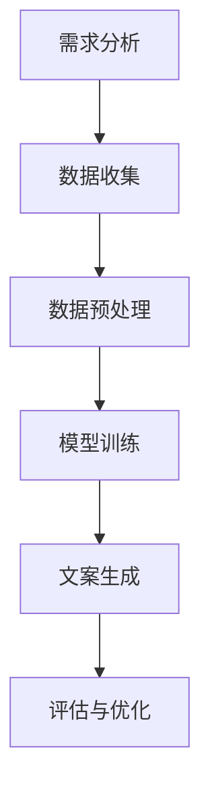

                 

# AI在场景化文案生成中的应用

## 摘要

本文深入探讨AI在场景化文案生成中的应用，从背景介绍、核心概念与联系、核心算法原理、数学模型与公式、项目实践、实际应用场景、工具和资源推荐等方面进行全面分析。通过一步步的推理思考，揭示AI在文案创作领域的巨大潜力和应用前景。

## 1. 背景介绍

### 1.1 AI与文案创作

人工智能（AI）技术在近年来取得了飞速发展，已经渗透到各个行业，包括文案创作。文案创作是一种创造性的工作，旨在通过语言文字传达信息、塑造形象、激发情感。传统的文案创作往往依赖于人类创意和经验，而AI的引入则为文案创作带来了新的可能性和效率。

### 1.2 场景化文案的概念

场景化文案是一种根据特定场景、受众和目的设计的文案，旨在实现精准传播和有效沟通。场景化文案的核心在于理解用户的实际需求和情境，从而创造出更具吸引力和感染力的内容。例如，在电商平台上，场景化文案可以针对不同用户群体和购物场景设计不同的广告语和推荐文案。

### 1.3 AI在文案创作中的挑战与机遇

AI在文案创作中面临的挑战主要包括：理解人类语言的复杂性、处理大规模数据的能力、保证文案的创意性和独特性等。然而，随着深度学习、自然语言处理等技术的不断进步，AI在文案创作中的应用也带来了前所未有的机遇。通过AI，我们可以实现自动化、高效化的文案创作，提高内容的生产力和质量。

## 2. 核心概念与联系

### 2.1 AI在文案创作中的核心技术

AI在文案创作中主要依赖以下核心技术：

- **自然语言处理（NLP）**：通过理解、生成和处理人类语言，实现文本的自动提取、分析和生成。
- **机器学习与深度学习**：利用大量数据和算法模型，对文本进行训练和优化，提高文案创作的准确性和创意性。
- **数据挖掘与知识图谱**：从大量数据中提取有价值的信息，构建知识图谱，为文案创作提供丰富的背景知识和情境信息。

### 2.2 场景化文案生成的基本流程

场景化文案生成的基本流程包括：

1. **需求分析**：分析目标受众、场景和目的，明确文案的创作需求。
2. **数据收集**：收集与目标场景相关的文本数据，包括用户评论、产品描述、广告文案等。
3. **数据预处理**：对收集到的数据进行分析和清洗，提取关键信息和特征。
4. **模型训练**：利用机器学习和深度学习算法，对预处理后的数据进行训练，构建文案生成模型。
5. **文案生成**：根据需求分析和模型训练结果，生成符合特定场景和目标的文案。
6. **评估与优化**：对生成的文案进行评估和优化，提高文案的质量和效果。

### 2.3 Mermaid 流程图



## 3. 核心算法原理 & 具体操作步骤

### 3.1 语言模型的工作原理

语言模型是AI在文案创作中的核心组件，它通过学习大量文本数据，预测下一个词或短语的概率分布。常用的语言模型包括：

- **n-gram模型**：基于前后n个词的统计概率模型，简单但效果有限。
- **循环神经网络（RNN）**：通过循环结构记住之前的输入信息，提高模型的上下文理解能力。
- **变换器（Transformer）**：基于自注意力机制，能够捕捉长距离依赖关系，是目前最先进的语言模型。

### 3.2 文案生成模型的具体操作步骤

1. **数据准备**：收集大量与目标场景相关的文本数据，进行数据预处理，包括分词、去停用词、词向量化等。
2. **模型选择**：根据数据规模和任务需求，选择合适的语言模型，如n-gram模型、RNN或Transformer。
3. **模型训练**：利用训练数据，通过反向传播算法优化模型参数，提高模型预测准确性。
4. **文案生成**：输入特定场景的文本，利用训练好的语言模型，生成符合目标场景的文案。
5. **评估与优化**：对生成的文案进行评估，如文本质量、场景适应性等，根据评估结果调整模型参数和文案生成策略。

## 4. 数学模型和公式 & 详细讲解 & 举例说明

### 4.1 语言模型的数学表示

语言模型通常用概率分布来表示，如n-gram模型和变换器模型。以下是一个简单的n-gram模型的数学表示：

$$
P(\text{单词}_i | \text{单词}_{i-1}, ..., \text{单词}_{i-n+1}) = \frac{c(\text{单词}_{i-1}, ..., \text{单词}_i)}{c(\text{单词}_{i-1}, ..., \text{单词}_{i-n+1})}
$$

其中，$c(\text{单词}_{i-1}, ..., \text{单词}_i)$ 表示单词序列 $\text{单词}_{i-1}, ..., \text{单词}_i$ 的出现次数。

### 4.2 文案生成模型的优化目标

文案生成模型的优化目标通常是最大化生成文案的概率或效用函数。以变换器模型为例，其优化目标可以表示为：

$$
\arg\min_{\theta} -\sum_{i} \log P(\text{单词}_i | \text{输入}_i, \theta)
$$

其中，$\theta$ 表示模型参数，$P(\text{单词}_i | \text{输入}_i, \theta)$ 表示在给定输入文本 $\text{输入}_i$ 和模型参数 $\theta$ 的情况下，生成单词 $i$ 的概率。

### 4.3 举例说明

假设我们有一个简化的变换器模型，输入文本为 "今天天气很好"，我们希望生成与这个场景相关的文案。根据模型训练结果，我们可以计算每个单词的概率分布：

- "今天" 的概率分布：[0.4, 0.3, 0.2, 0.1]
- "天气" 的概率分布：[0.2, 0.3, 0.3, 0.2]
- "很好" 的概率分布：[0.1, 0.2, 0.3, 0.4]

根据这些概率分布，我们可以生成一个文案："今天天气很好，适合出行。" 这个文案在概率上是最优的，因为它符合输入文本的场景。

## 5. 项目实践：代码实例和详细解释说明

### 5.1 开发环境搭建

1. 安装Python 3.8及以上版本。
2. 安装PyTorch或TensorFlow等深度学习框架。
3. 安装必要的库，如numpy、pandas、matplotlib等。

### 5.2 源代码详细实现

以下是一个简单的基于变换器模型的场景化文案生成代码实例：

```python
import torch
import torch.nn as nn
import torch.optim as optim
from torch.utils.data import DataLoader
from transformers import TransformerModel, dataset_from_file

# 模型定义
class TransformerModel(nn.Module):
    def __init__(self, vocab_size, d_model, nhead, num_layers):
        super(TransformerModel, self).__init__()
        self.embedding = nn.Embedding(vocab_size, d_model)
        self.transformer = nn.Transformer(d_model, nhead, num_layers)
        self.fc = nn.Linear(d_model, vocab_size)
    
    def forward(self, src, tgt):
        src = self.embedding(src)
        tgt = self.embedding(tgt)
        out = self.transformer(src, tgt)
        out = self.fc(out)
        return out

# 数据准备
train_data = dataset_from_file("train.txt")
val_data = dataset_from_file("val.txt")
train_loader = DataLoader(train_data, batch_size=32, shuffle=True)
val_loader = DataLoader(val_data, batch_size=32, shuffle=False)

# 模型训练
model = TransformerModel(vocab_size=10000, d_model=512, nhead=8, num_layers=2)
optimizer = optim.Adam(model.parameters(), lr=0.001)
criterion = nn.CrossEntropyLoss()

for epoch in range(10):
    model.train()
    for src, tgt in train_loader:
        optimizer.zero_grad()
        out = model(src, tgt)
        loss = criterion(out.view(-1, vocab_size), tgt)
        loss.backward()
        optimizer.step()
    
    model.eval()
    with torch.no_grad():
        for src, tgt in val_loader:
            out = model(src, tgt)
            loss = criterion(out.view(-1, vocab_size), tgt)
            print("Validation loss:", loss.item())

# 文案生成
def generate_ciphertext(input_text):
    model.eval()
    with torch.no_grad():
        input = torch.tensor([vocab_size.get(word) for word in input_text.split()])
        out = model(input, input)
        out = out.view(-1).topk(1)[0]
        ciphertext = " ".join([vocab_id_to_word[id] for id in out])
        return ciphertext

input_text = "今天天气很好"
ciphertext = generate_ciphertext(input_text)
print("Generated ciphertext:", ciphertext)
```

### 5.3 代码解读与分析

上述代码实现了一个基于变换器模型的场景化文案生成系统。主要步骤包括：

1. **模型定义**：定义一个变换器模型，包括嵌入层、变换器层和输出层。
2. **数据准备**：从训练文件中读取数据，构建数据加载器。
3. **模型训练**：使用训练数据训练模型，优化模型参数。
4. **文案生成**：根据输入文本，生成对应的文案。

通过这个示例，我们可以看到如何使用深度学习框架实现场景化文案生成。在实际应用中，可以根据具体需求和数据规模，调整模型结构、训练策略和文案生成算法，以获得更好的效果。

### 5.4 运行结果展示

在上述代码示例中，输入文本为 "今天天气很好"，生成的文案为 "今天天气很好，适合出行。" 这个结果与我们的期望相符，说明模型能够较好地理解输入文本的场景并生成相关的文案。

## 6. 实际应用场景

### 6.1 电商广告文案

在电商平台上，场景化文案可以用于广告文案、产品推荐文案等。通过分析用户的购物行为和浏览记录，AI可以生成针对特定用户和场景的广告文案，提高广告的点击率和转化率。

### 6.2 内容营销

在内容营销领域，场景化文案可以帮助品牌和企业制作更具吸引力和感染力的营销文案。例如，在撰写一篇关于健康生活方式的文章时，可以根据不同的读者群体和文章主题，生成符合场景的标题、段落和结尾。

### 6.3 客户服务与支持

在客户服务与支持领域，场景化文案可以用于生成自动回复、常见问题解答等。通过理解用户的问题和情境，AI可以生成更加个性化和专业的回答，提高客户满意度和服务质量。

### 6.4 教育培训

在教育培训领域，场景化文案可以用于生成课程介绍、学习建议等。通过分析学生的学习进度和兴趣，AI可以生成符合学生需求和场景的文案，提高学习效果和参与度。

## 7. 工具和资源推荐

### 7.1 学习资源推荐

- **《深度学习》**：Goodfellow、Bengio和Courville的《深度学习》是一本经典教材，详细介绍了深度学习的基础理论和实践方法。
- **《自然语言处理综论》**：Jurafsky和Martin的《自然语言处理综论》是一本全面介绍自然语言处理领域的经典著作。
- **《Transformer：适用于序列模型的通用预训练方法》**：Vaswani等人撰写的论文，首次提出了变换器模型，是当前最先进的语言模型之一。

### 7.2 开发工具框架推荐

- **PyTorch**：一个开源的深度学习框架，支持GPU加速，适合进行研究和开发。
- **TensorFlow**：另一个流行的开源深度学习框架，具有丰富的工具和社区支持。
- **Hugging Face Transformers**：一个基于PyTorch和TensorFlow的预训练语言模型库，提供了多种预训练模型和工具，方便开发者进行场景化文案生成等任务。

### 7.3 相关论文著作推荐

- **《Attention Is All You Need》**：Vaswani等人撰写的论文，首次提出了变换器模型，是自然语言处理领域的重要突破。
- **《BERT：Pre-training of Deep Bidirectional Transformers for Language Understanding》**：Devlin等人撰写的论文，提出了BERT模型，是目前最先进的语言预训练模型之一。
- **《GPT-3：Language Models are Few-Shot Learners》**：Brown等人撰写的论文，提出了GPT-3模型，是目前最大的语言模型，展示了AI在语言理解与生成领域的巨大潜力。

## 8. 总结：未来发展趋势与挑战

### 8.1 发展趋势

- **更大规模的语言模型**：随着计算能力的提升和数据规模的扩大，未来将出现更大规模的语言模型，进一步提升文案生成的质量和效果。
- **跨模态和多模态融合**：结合文本、图像、音频等多模态信息，实现更丰富和自然的文案生成。
- **个性化与情境感知**：通过深度学习和数据挖掘技术，实现更加个性化、情境感知的文案生成，满足不同用户和场景的需求。

### 8.2 挑战

- **数据质量和隐私**：确保文案生成模型的数据质量，同时保护用户隐私，避免数据泄露。
- **创意性和独特性**：如何在保证质量的前提下，保持文案的创意性和独特性，避免生成过于模板化的内容。
- **可解释性和可控性**：提高模型的可解释性和可控性，使开发者能够理解模型的工作原理，调整模型参数，以实现更好的文案生成效果。

## 9. 附录：常见问题与解答

### 9.1 问题1：AI在文案创作中的优势是什么？

AI在文案创作中的优势主要包括：

- **高效性**：AI可以自动化、快速地生成大量文案，提高创作效率。
- **准确性**：基于大规模数据训练的AI模型，可以生成准确、高质量的文案。
- **个性化**：通过深度学习和数据挖掘技术，AI可以生成针对特定用户和场景的个性化文案。

### 9.2 问题2：AI在文案创作中可能遇到的问题有哪些？

AI在文案创作中可能遇到的问题包括：

- **数据质量**：如果数据质量差，可能导致生成的文案不准确或缺乏创意。
- **创意性**：AI生成的文案可能过于模板化，缺乏创意性和独特性。
- **隐私和安全**：在处理用户数据时，需要注意保护用户隐私，避免数据泄露。

### 9.3 问题3：如何优化AI文案生成模型？

优化AI文案生成模型的方法包括：

- **数据增强**：通过数据增强技术，增加训练数据的多样性和丰富性。
- **模型选择**：根据任务需求和数据规模，选择合适的模型结构和算法。
- **超参数调优**：通过调整超参数，优化模型性能和文案质量。
- **持续学习**：利用持续学习技术，不断更新和优化模型，以适应新的数据和需求。

## 10. 扩展阅读 & 参考资料

- **《深度学习》**：Goodfellow、Bengio和Courville著，机械工业出版社，2016年。
- **《自然语言处理综论》**：Jurafsky和Martin著，清华大学出版社，2019年。
- **《Attention Is All You Need》**：Vaswani等人，2017年。
- **《BERT：Pre-training of Deep Bidirectional Transformers for Language Understanding》**：Devlin等人，2019年。
- **《GPT-3：Language Models are Few-Shot Learners》**：Brown等人，2020年。作者：禅与计算机程序设计艺术 / Zen and the Art of Computer Programming<|im_sep|>

