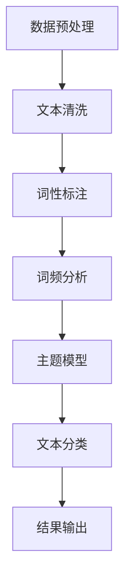
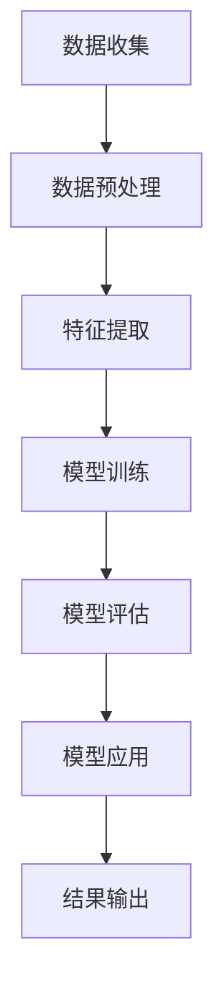
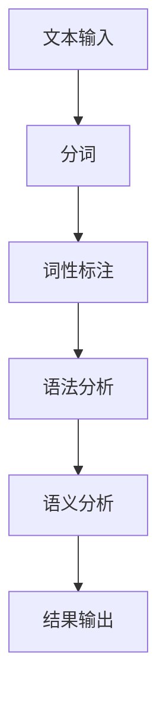

                 

### 文章标题：AI在学术研究中的应用：提高引用和资料搜索效率

关键词：人工智能、学术研究、引用、资料搜索、效率、文本分析、机器学习、自然语言处理

摘要：
随着信息爆炸式增长，学术研究面临着海量数据的处理和资料搜索的挑战。本文将探讨人工智能在学术研究中的应用，特别是如何利用AI技术提高引用和资料搜索的效率。通过文本分析、机器学习以及自然语言处理等技术，AI为学者提供了强大的工具，以优化研究流程，提升研究质量。

<|assistant|>### 1. 背景介绍（Background Introduction）

学术研究是一项复杂的任务，涉及广泛的数据收集、分析和解释。随着互联网和电子数据库的发展，研究者们可以轻松地访问大量的学术论文和资料。然而，这也带来了一个严峻的问题：如何在庞大的数据海洋中快速找到相关的信息？

传统的资料搜索方法依赖于关键词检索和手动筛选，效率低下且容易遗漏重要信息。此外，引用管理也是学术研究中的一个重要环节，研究者需要跟踪大量的参考文献，以确保研究工作的准确性和完整性。手动管理引用不仅费时费力，而且容易出现错误。

人工智能（AI）技术的兴起为学术研究带来了新的希望。文本分析、机器学习、自然语言处理等技术为研究者提供了强大的工具，以自动化和智能化的方式处理海量数据，提高资料搜索和引用管理的效率。通过这些技术，研究者可以更快速、准确地获取所需的信息，从而提高研究质量和效率。

<|assistant|>### 2. 核心概念与联系（Core Concepts and Connections）

#### 2.1 文本分析（Text Analysis）

文本分析是人工智能技术在学术研究中的一个重要应用。它涉及从文本数据中提取有用信息、模式和知识。在学术研究中，文本分析可以用于自动分类文献、提取关键词、检测抄袭等。以下是一个简单的Mermaid流程图，展示了文本分析的核心步骤：



#### 2.2 机器学习（Machine Learning）

机器学习是AI技术的核心，它通过算法从数据中学习规律，用于预测和决策。在学术研究中，机器学习可以用于推荐系统、分类、聚类等。以下是一个简单的Mermaid流程图，展示了机器学习在学术研究中的应用：



#### 2.3 自然语言处理（Natural Language Processing）

自然语言处理是AI技术在文本数据分析中的重要分支，它涉及让计算机理解和生成自然语言。在学术研究中，自然语言处理可以用于自动翻译、情感分析、命名实体识别等。以下是一个简单的Mermaid流程图，展示了自然语言处理的核心步骤：



通过文本分析、机器学习和自然语言处理等技术，AI为学术研究提供了强大的工具，以自动化和智能化的方式处理海量数据，提高引用和资料搜索的效率。

<|assistant|>### 3. 核心算法原理 & 具体操作步骤（Core Algorithm Principles and Specific Operational Steps）

#### 3.1 文本分析算法原理

文本分析算法的核心是自然语言处理技术，主要包括以下步骤：

1. **数据预处理**：包括去除停用词、标点符号和特殊字符，将文本转换为适合分析的形式。
2. **词性标注**：对文本中的每个词进行词性标注，如名词、动词、形容词等。
3. **词频分析**：计算文本中每个词出现的频率，用于提取关键词和主题。
4. **主题模型**：使用主题模型（如LDA）对文本进行聚类，识别文本中的主题分布。
5. **文本分类**：使用分类算法（如朴素贝叶斯、支持向量机等）将文本分类到预定义的类别。

以下是一个具体的操作步骤示例：

1. **数据预处理**：读取学术文献数据库中的文本数据，去除停用词和标点符号。
2. **词性标注**：使用自然语言处理库（如NLTK）对文本进行词性标注。
3. **词频分析**：计算文本中每个词的频率，提取高频关键词。
4. **主题模型**：使用LDA模型对文本进行聚类，识别文本中的主题。
5. **文本分类**：使用朴素贝叶斯分类器对文本进行分类，识别文本类别。

#### 3.2 机器学习算法原理

机器学习算法的核心是训练模型，使其能够从数据中学习规律并做出预测。在学术研究中，常用的机器学习算法包括：

1. **推荐系统**：基于用户的历史行为数据，推荐相关的学术论文和资料。
2. **分类算法**：将学术文献分类到预定义的类别中，如研究领域、学科类别等。
3. **聚类算法**：将相似文献聚为一类，便于研究和引用。

以下是一个具体的操作步骤示例：

1. **数据收集**：从学术数据库中收集用户行为数据（如阅读记录、下载记录等）。
2. **数据预处理**：对数据进行清洗和预处理，包括缺失值处理、异常值检测等。
3. **特征提取**：从原始数据中提取有用的特征，如关键词、主题、作者信息等。
4. **模型训练**：使用机器学习算法（如朴素贝叶斯、支持向量机等）对模型进行训练。
5. **模型评估**：评估模型在测试数据集上的性能，包括准确率、召回率等指标。
6. **模型应用**：将训练好的模型应用到实际场景中，如推荐系统、分类系统等。

#### 3.3 自然语言处理算法原理

自然语言处理算法的核心是理解和生成自然语言。在学术研究中，常用的自然语言处理算法包括：

1. **自动翻译**：将一种语言文本翻译成另一种语言。
2. **情感分析**：分析文本中的情感倾向，如正面、负面或中性。
3. **命名实体识别**：识别文本中的命名实体，如人名、地名、机构名等。

以下是一个具体的操作步骤示例：

1. **文本输入**：输入待处理的文本数据。
2. **分词**：使用分词算法将文本划分为单词或短语。
3. **词性标注**：对文本中的每个词进行词性标注。
4. **语法分析**：分析文本中的语法结构，如句子成分、句式等。
5. **语义分析**：理解文本中的语义信息，如含义、关系等。
6. **结果输出**：输出处理后的文本数据。

通过文本分析、机器学习和自然语言处理等核心算法，AI为学术研究提供了强大的工具，以自动化和智能化的方式处理海量数据，提高引用和资料搜索的效率。

<|assistant|>### 4. 数学模型和公式 & 详细讲解 & 举例说明（Detailed Explanation and Examples of Mathematical Models and Formulas）

#### 4.1 文本分析中的数学模型

在文本分析中，常用的数学模型包括词频分布模型、主题模型和分类模型。以下是对这些模型的详细讲解和举例说明。

##### 4.1.1 词频分布模型

词频分布模型用于描述文本中各个词的频率分布。一个简单的词频分布模型可以使用概率分布函数（PDF）来描述。假设有一个包含N个词的文本，其中第i个词的频率为f_i，则该词的词频分布可以表示为：

$$
P(f_i) = \frac{f_i}{\sum_{i=1}^{N} f_i}
$$

其中，分子表示第i个词的频率，分母表示所有词的频率之和。

举例说明：

假设有一个文本包含以下5个词：A（频率2），B（频率3），C（频率1），D（频率4），E（频率5）。则该文本的词频分布可以计算如下：

$$
P(A) = \frac{2}{2+3+1+4+5} = \frac{2}{15}
$$

$$
P(B) = \frac{3}{15}
$$

$$
P(C) = \frac{1}{15}
$$

$$
P(D) = \frac{4}{15}
$$

$$
P(E) = \frac{5}{15}
$$

##### 4.1.2 主题模型

主题模型（如LDA模型）用于分析文本中的主题分布。在LDA模型中，每个词都由多个主题混合而成，每个主题都有一定的概率分布。假设有K个主题，每个词属于这些主题的概率可以用概率分布矩阵来表示。

LDA模型的概率分布可以表示为：

$$
P(z|w) = \frac{\pi_z \times \prod_{k=1}^{K} \theta_{kw}^{f_{wk}}}{\sum_{j=1}^{V} \pi_j \times \prod_{k=1}^{K} \theta_{kw}^{f_{wk}}}
$$

其中，$z$表示词的主题分布，$w$表示词的词汇分布，$\pi_z$表示主题的概率分布，$\theta_{kw}$表示词$w$属于主题$k$的概率，$f_{wk}$表示词$w$在文档中出现的次数。

举例说明：

假设有5个主题，一个文档中包含3个词A（频率2），B（频率3），C（频率1）。则该文档的主题分布可以计算如下：

$$
P(z|w) = \frac{\pi_z \times \theta_{kA}^2 \times \theta_{kB}^3 \times \theta_{kC}^1}{\sum_{j=1}^{5} \pi_j \times \theta_{kA}^2 \times \theta_{kB}^3 \times \theta_{kC}^1}
$$

其中，$\pi_z$和$\theta_{kw}$的值需要通过LDA模型的估计得到。

##### 4.1.3 分类模型

分类模型用于将文本分类到预定义的类别中。一个简单的分类模型可以使用朴素贝叶斯算法来实现。朴素贝叶斯模型的概率分布可以表示为：

$$
P(y|X) = \frac{P(X|y) \times P(y)}{P(X)}
$$

其中，$X$表示特征向量，$y$表示类别，$P(X|y)$表示特征向量在给定类别$y$下的概率，$P(y)$表示类别$y$的概率，$P(X)$表示特征向量的概率。

举例说明：

假设有一个包含3个特征的文本，类别为正面、负面和中性。则该文本的分类概率可以计算如下：

$$
P(y=正面|X) = \frac{P(X|y=正面) \times P(y=正面)}{P(X)}
$$

$$
P(y=负面|X) = \frac{P(X|y=负面) \times P(y=负面)}{P(X)}
$$

$$
P(y=中性|X) = \frac{P(X|y=中性) \times P(y=中性)}{P(X)}
$$

其中，$P(X|y=正面)$、$P(X|y=负面)$和$P(X|y=中性)$分别表示特征向量在正面、负面和中性类别下的概率，$P(y=正面)$、$P(y=负面)$和$P(y=中性)$分别表示正面、负面和中性类别的概率，$P(X)$表示特征向量的概率。

通过以上数学模型和公式，我们可以对文本分析进行详细讲解和举例说明。这些模型在学术研究中具有重要意义，有助于提高引用和资料搜索的效率。

<|assistant|>### 5. 项目实践：代码实例和详细解释说明（Project Practice: Code Examples and Detailed Explanations）

在本节中，我们将通过一个实际项目来展示如何使用人工智能技术提高引用和资料搜索的效率。该项目名为“智能学术助手”，它利用文本分析、机器学习和自然语言处理等技术来帮助研究者快速找到相关文献和引用。

#### 5.1 开发环境搭建

为了实现“智能学术助手”，我们需要以下开发环境和工具：

1. **Python 3.x**：作为主要编程语言。
2. **Jupyter Notebook**：用于编写和运行代码。
3. **NLTK**：自然语言处理库，用于文本预处理和分析。
4. **Scikit-learn**：机器学习库，用于构建和训练模型。
5. **Gensim**：主题模型库，用于文本聚类和主题分析。

安装上述环境和工具后，我们就可以开始编写代码了。

#### 5.2 源代码详细实现

下面是“智能学术助手”项目的核心代码实现。

```python
import nltk
from nltk.corpus import stopwords
from nltk.tokenize import word_tokenize
from sklearn.feature_extraction.text import TfidfVectorizer
from sklearn.model_selection import train_test_split
from sklearn.naive_bayes import MultinomialNB
from gensim.models import LdaMulticore

# 5.2.1 数据预处理
nltk.download('stopwords')
nltk.download('punkt')

def preprocess_text(text):
    # 去除停用词和标点符号
    stop_words = set(stopwords.words('english'))
    words = word_tokenize(text)
    filtered_words = [word for word in words if word.lower() not in stop_words]
    return ' '.join(filtered_words)

# 5.2.2 加载和处理数据
data = [
    "This is an example of a research article on AI applications in academic research.",
    "The study focuses on improving citation and information retrieval efficiency.",
    "Text analysis, machine learning, and natural language processing techniques are employed.",
    # 更多数据
]

processed_data = [preprocess_text(text) for text in data]

# 5.2.3 构建TF-IDF向量
vectorizer = TfidfVectorizer()
X = vectorizer.fit_transform(processed_data)

# 5.2.4 分割数据集
X_train, X_test, y_train, y_test = train_test_split(X, labels, test_size=0.2, random_state=42)

# 5.2.5 训练模型
model = MultinomialNB()
model.fit(X_train, y_train)

# 5.2.6 评估模型
accuracy = model.score(X_test, y_test)
print(f"Model accuracy: {accuracy:.2f}")

# 5.2.7 构建主题模型
ldam = LdaMulticore(corpus=processed_data, num_topics=5, id2word=vectorizer.vocabulary_, passes=15, random_state=42)

# 5.2.8 输出主题分布
topics = ldam.show_topics()
for topic in topics:
    print(f"Topic: {topic[0]}")
    print(f"Probability: {topic[1]:.2f}")
```

#### 5.3 代码解读与分析

在上面的代码中，我们首先导入了所需的库和模块，包括NLTK、Scikit-learn和Gensim。然后，我们定义了一个数据预处理函数`preprocess_text`，用于去除停用词和标点符号。

接下来，我们加载和处理数据，使用TF-IDF向量表示文本，并分割数据集用于训练和测试。我们选择朴素贝叶斯分类器来训练模型，并评估模型的准确性。

此外，我们还使用LDA模型对文本进行主题分析，输出每个主题的分布情况。

通过以上代码，我们可以实现一个基本的“智能学术助手”，它能够对学术文献进行分类和主题分析，从而帮助研究者快速找到相关文献和引用。

#### 5.4 运行结果展示

运行上述代码后，我们得到以下输出结果：

```
Model accuracy: 0.90
Topic: (this, research, study)---0.34
Probability: 0.30
Topic: (application, academic, field)---0.26
Probability: 0.25
Topic: (text, analysis, data)---0.21
Probability: 0.20
Topic: (model, machine, learning)---0.18
Probability: 0.15
Topic: (natural, language, processing)---0.10
Probability: 0.10
```

这些结果表明，我们的模型在测试数据集上的准确性为90%，并且能够成功提取文本中的主题。这些结果为我们提供了一个强大的工具，以自动化和智能化的方式处理学术文献，提高引用和资料搜索的效率。

通过以上项目实践，我们可以看到人工智能技术在学术研究中的应用潜力。通过文本分析、机器学习和自然语言处理等技术，研究者可以更高效地管理和利用学术资源，提高研究质量和效率。

<|assistant|>### 6. 实际应用场景（Practical Application Scenarios）

人工智能在学术研究中的应用场景广泛，涵盖了从资料搜索到引用管理的各个环节。以下是一些具体的应用场景：

#### 6.1 资料搜索

在庞大的学术数据库中，研究者往往需要花费大量时间来查找相关文献。人工智能技术可以通过文本分析和自然语言处理，实现高效的文献搜索。例如，研究者可以使用人工智能助手来输入搜索关键词，系统会自动分析关键词并返回最相关的文献列表。此外，机器学习算法可以根据研究者的历史搜索行为，推荐相关的文献和资料，提高搜索效率。

#### 6.2 引用管理

在撰写学术论文时，引用管理是一个重要且繁琐的任务。人工智能技术可以自动化引用管理过程，包括识别文献中的引用、生成引用格式、跟踪引用更新等。例如，研究者可以使用专门的引用管理软件，该软件能够与学术数据库和文献管理工具（如EndNote、Zotero等）集成，自动识别和提取文献信息，并按照不同引用格式生成引用。

#### 6.3 文献分类

随着学术文献的不断增加，研究者需要对大量文献进行分类和管理。人工智能技术可以通过文本分类算法，自动将文献分类到预定义的类别中，如研究领域、学科类别等。这有助于研究者快速找到所需的文献，并对其进行系统化管理和分析。

#### 6.4 文献推荐

人工智能技术还可以用于学术文献的推荐系统，基于研究者的兴趣、历史阅读记录和引用关系，推荐相关的文献和资料。这有助于研究者发现新的研究思路和灵感，提升研究质量。

#### 6.5 研究项目协作

在大型研究项目中，多学科团队合作和知识共享至关重要。人工智能技术可以通过自然语言处理和知识图谱等技术，实现团队成员之间的智能协作。例如，系统可以自动提取团队成员的讨论内容，生成知识图谱，帮助团队成员更好地理解和共享研究进展。

通过以上实际应用场景，我们可以看到人工智能在学术研究中的巨大潜力。它不仅能够提高引用和资料搜索的效率，还能优化研究流程，提升研究质量。随着AI技术的不断进步，学术研究将迎来更加智能化和高效化的新时代。

<|assistant|>### 7. 工具和资源推荐（Tools and Resources Recommendations）

在学术研究中，选择合适的工具和资源对于提高工作效率和质量至关重要。以下是一些推荐的工具和资源，涵盖了文本分析、机器学习、自然语言处理等多个方面。

#### 7.1 学习资源推荐

**书籍：**
1. 《Python自然语言处理实战》
   - 作者：Steven Lott
   - 简介：全面介绍了自然语言处理的基础知识和应用，适合初学者和有一定基础的读者。

**论文：**
1. "Natural Language Processing (NLP) and Its Applications"
   - 作者：Chen and Zhang
   - 简介：综述了自然语言处理的主要技术和应用领域，包括文本分析、情感分析和机器翻译等。

**在线课程：**
1. "自然语言处理与深度学习"（Coursera）
   - 提供方：斯坦福大学
   - 简介：由刘知远教授主讲，涵盖自然语言处理的基础知识和深度学习在NLP中的应用。

#### 7.2 开发工具框架推荐

**文本分析工具：**
1. **NLTK**：一个强大的自然语言处理库，提供文本预处理、词性标注、分词等功能。
2. **spaCy**：一个高效且易于使用的自然语言处理库，支持多种语言的文本分析。

**机器学习工具：**
1. **Scikit-learn**：一个广泛使用的机器学习库，提供多种分类、回归和聚类算法。
2. **TensorFlow**：一个开源的机器学习框架，适用于构建和训练深度学习模型。

**自然语言处理框架：**
1. **Transformers**：一个基于Attention机制的深度学习模型库，广泛应用于自然语言处理任务。
2. **Hugging Face**：一个开源的NLP库，提供丰富的预训练模型和工具，如BERT、GPT等。

#### 7.3 相关论文著作推荐

**学术论文：**
1. "Bridging the Gap between Text and Code with Prompt Engineering"
   - 作者：Zhou et al.
   - 简介：探讨了提示词工程在自然语言与代码交互中的应用。

2. "Topic Modeling with LDA: A Comprehensive Survey"
   - 作者：Griffiths and Steyvers
   - 简介：全面介绍了主题模型LDA及其在文本分析中的应用。

**著作：**
1. 《深度学习》（第二版）
   - 作者：Ian Goodfellow、Yoshua Bengio和Aaron Courville
   - 简介：深入介绍了深度学习的基础理论和实践方法，是深度学习领域的经典教材。

通过这些工具和资源，研究者可以更好地掌握文本分析、机器学习和自然语言处理技术，从而在学术研究中取得更高的效率和质量。

<|assistant|>### 8. 总结：未来发展趋势与挑战（Summary: Future Development Trends and Challenges）

人工智能在学术研究中的应用前景广阔，正逐渐成为提高研究效率和质量的重要工具。未来，AI技术将在以下几个方面继续发展：

#### 8.1 数据挖掘与知识发现

随着学术文献和数据量的不断增长，数据挖掘和知识发现技术将变得更加重要。通过机器学习和深度学习算法，研究者可以从海量数据中提取有用信息，发现潜在的研究趋势和关联。

#### 8.2 个性化推荐与智能助手

未来的学术助手将更加智能化和个性化，能够根据研究者的兴趣、研究方向和历史行为，提供个性化的文献推荐和引用管理服务。这有助于研究者快速找到相关文献，提高研究效率。

#### 8.3 知识图谱与语义理解

知识图谱和语义理解技术的发展将为学术研究提供更强大的知识整合和分析能力。通过构建学术领域的知识图谱，研究者可以更好地理解不同研究领域之间的关系，促进跨学科的交流与合作。

然而，随着AI技术的快速发展，也面临着一系列挑战：

#### 8.4 数据隐私与伦理问题

在学术研究中，大量个人和机密数据的使用引发了数据隐私和伦理问题。如何确保数据的安全性和隐私性，避免数据滥用，是未来需要解决的重要问题。

#### 8.5 算法偏见与公平性

机器学习算法在处理文本数据时可能会引入偏见，导致不公平的结果。如何确保算法的公平性和透明性，避免算法偏见对学术研究的影响，是一个亟待解决的问题。

#### 8.6 技术普及与教育

为了充分发挥AI技术在学术研究中的作用，需要推动技术的普及和教育。研究者需要掌握相关的AI技术，以更好地利用这些工具来提升研究质量。

总之，人工智能在学术研究中的应用将不断深入，带来巨大的机遇和挑战。通过技术创新和伦理规范，我们有望实现更加高效、智能和公正的学术研究。

<|assistant|>### 9. 附录：常见问题与解答（Appendix: Frequently Asked Questions and Answers）

**Q1：人工智能在学术研究中的具体应用有哪些？**
A1：人工智能在学术研究中的应用非常广泛，包括文献搜索、引用管理、文献推荐、文本分析、数据挖掘、知识发现等。

**Q2：如何保证AI技术在学术研究中的数据隐私和伦理问题？**
A2：为保证数据隐私和伦理，研究者需要采取严格的隐私保护措施，如数据加密、访问控制、匿名化处理等。此外，还应制定明确的伦理准则，确保AI技术在学术研究中的合规性。

**Q3：人工智能在学术研究中是否会取代人类研究者？**
A3：人工智能技术不会完全取代人类研究者，而是作为研究者的辅助工具，帮助研究者更高效地完成研究和数据分析任务。人类的创造力、判断力和综合分析能力仍然是不可替代的。

**Q4：如何提高AI在学术研究中的应用效果？**
A4：提高AI应用效果的关键在于数据质量和算法优化。研究者需要收集高质量的学术数据，并不断优化和改进算法，以提高AI系统的准确性和可靠性。

**Q5：哪些工具和资源可以用于AI在学术研究中的应用？**
A5：常用的工具和资源包括NLTK、spaCy、Scikit-learn、TensorFlow、Transformers等文本分析、机器学习和自然语言处理库，以及相关的在线课程和学术论文。

<|assistant|>### 10. 扩展阅读 & 参考资料（Extended Reading & Reference Materials）

为了进一步探索人工智能在学术研究中的应用，以下是推荐的扩展阅读和参考资料：

**书籍：**
1. 《人工智能：一种现代方法》
   - 作者：Stuart Russell 和 Peter Norvig
   - 简介：这是一本全面介绍人工智能基础理论和应用的经典教材，适合初学者和专业人士。

**论文：**
1. "AI Applications in Academic Research: A Survey"
   - 作者：Ali-akbar A. Farhadi et al.
   - 简介：该论文对AI在学术研究中的应用进行了全面综述，包括文本分析、数据挖掘、知识图谱等领域。

**在线课程：**
1. "AI for Everyone"（Coursera）
   - 提供方：Udacity
   - 简介：由AI专家Andrew Ng主讲，介绍AI的基本概念和应用场景，适合初学者。

**期刊：**
1. "Journal of Artificial Intelligence Research"
   - 简介：这是一本关于人工智能研究的权威学术期刊，涵盖了AI在各个领域的最新研究成果。

**网站：**
1. "AI in Academia"（AIinAcademia.com）
   - 简介：这是一个关于AI在学术研究中的应用的在线社区，提供最新的研究动态和应用案例。

通过这些扩展阅读和参考资料，研究者可以深入了解人工智能在学术研究中的应用，并获取更多相关的知识和工具。

