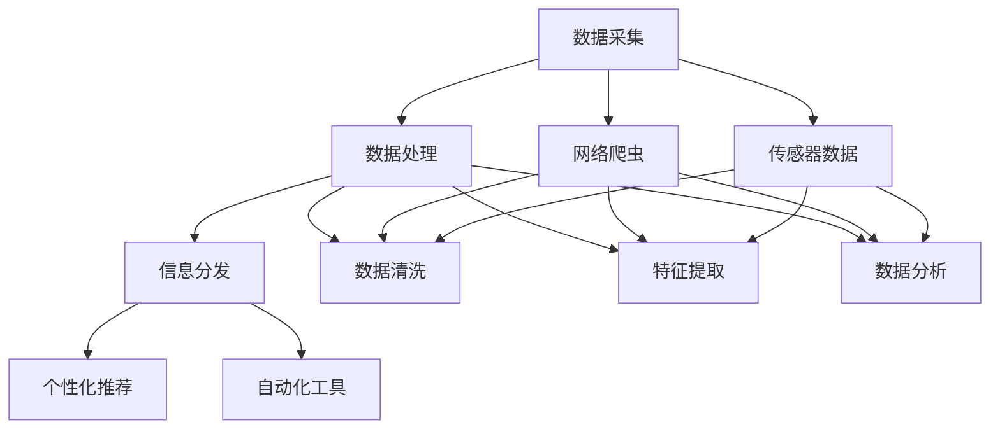

                 

### 文章标题

**AI在实时信息更新中的作用**

AI在实时信息更新中扮演着至关重要的角色。本文将深入探讨AI如何通过多种技术手段实现实时信息的收集、处理和分发，并分析其在不同应用场景中的重要性。我们将分章节详细讲解核心算法原理、数学模型和项目实践，最后讨论实际应用场景和未来发展趋势。

关键词：AI，实时信息更新，算法原理，数学模型，项目实践

> 摘要：本文旨在探讨AI在实时信息更新中的作用，分析其核心算法原理、数学模型和项目实践，并探讨其在不同应用场景中的重要性。通过对AI在实时信息更新中的应用进行详细分析，本文为相关领域的研究者和从业者提供了有价值的参考和启示。

## 1. 背景介绍（Background Introduction）

### 1.1 实时信息更新的重要性

在信息爆炸的时代，实时信息的更新对于各行各业都具有至关重要的意义。从金融市场的实时报价，到社交媒体上的实时新闻，再到物流行业的实时追踪，实时信息的获取和处理能力已成为衡量企业竞争力的重要指标。然而，传统的信息更新方式往往依赖于人工操作，效率低下且容易出错。随着AI技术的发展，AI在实时信息更新中的应用逐渐成为可能，为各行业带来了全新的变革。

### 1.2 AI在实时信息更新中的应用

AI在实时信息更新中的应用主要体现在以下几个方面：

1. **数据收集**：AI通过爬虫、传感器等技术手段，自动收集海量的实时数据，为后续处理提供数据基础。
2. **数据处理**：AI利用自然语言处理、图像识别等技术，对收集到的数据进行分析和处理，提取有用的信息。
3. **信息分发**：AI通过自动化工具，将处理后的信息实时分发给相关用户，提高信息传播的效率。

### 1.3 实时信息更新与AI的关系

实时信息更新与AI之间存在密切的联系。AI为实时信息更新提供了技术支撑，而实时信息更新则为AI应用提供了丰富的场景。两者相辅相成，共同推动着社会的发展和进步。

## 2. 核心概念与联系（Core Concepts and Connections）

### 2.1 数据采集与处理

在实时信息更新的过程中，数据采集和处理是至关重要的环节。数据采集主要包括数据的收集、存储和传输，而数据处理则涉及数据清洗、分析、挖掘和可视化。

#### 2.1.1 数据采集

数据采集是实时信息更新的第一步。AI技术在这一环节中发挥了重要作用，例如：

- **网络爬虫**：通过网络爬虫技术，可以自动收集互联网上的各类信息，如新闻、博客、论坛等。
- **传感器采集**：通过传感器技术，可以实时收集物理世界的数据，如温度、湿度、风速等。

#### 2.1.2 数据处理

数据处理是实时信息更新的核心环节。AI技术在这一环节中的应用包括：

- **数据清洗**：通过算法自动去除数据中的噪声和冗余信息，提高数据质量。
- **数据挖掘**：通过挖掘算法，从海量数据中提取有价值的信息，为决策提供支持。
- **数据可视化**：通过可视化技术，将复杂的数据以图形化的方式展示，便于理解和分析。

### 2.2 实时信息处理与分发

实时信息处理与分发是实时信息更新的关键环节。AI技术在这一环节中的应用包括：

- **自动化处理**：通过自动化工具，对实时信息进行分类、筛选、处理和分发，提高信息处理效率。
- **个性化推荐**：基于用户的兴趣和行为，为用户推荐个性化的实时信息，提高信息传播的精准度。

### 2.3 AI与实时信息更新的关系

AI与实时信息更新之间存在密切的联系。AI为实时信息更新提供了技术支撑，而实时信息更新则为AI应用提供了丰富的场景。两者相辅相成，共同推动着社会的发展和进步。

## 3. 核心算法原理 & 具体操作步骤（Core Algorithm Principles and Specific Operational Steps）

### 3.1 数据采集算法

数据采集是实时信息更新的第一步，其核心算法主要包括以下几种：

- **网络爬虫**：通过模拟浏览器行为，自动获取互联网上的信息。
- **传感器采集**：通过接入各种传感器，实时收集物理世界的数据。

#### 3.1.1 网络爬虫算法

网络爬虫算法主要包括以下步骤：

1. **目标网站选择**：根据实时信息更新的需求，选择合适的目标网站。
2. **网页抓取**：通过HTTP协议，从目标网站获取网页内容。
3. **数据解析**：使用正则表达式、XPath等技术，从网页内容中提取有用的信息。
4. **存储与管理**：将提取到的数据存储到数据库或文件中，并进行分类管理。

#### 3.1.2 传感器采集算法

传感器采集算法主要包括以下步骤：

1. **传感器接入**：将各种传感器接入系统，确保数据采集的准确性。
2. **数据读取**：通过传感器接口，实时读取传感器采集到的数据。
3. **数据预处理**：对读取到的数据进行清洗、去噪和归一化处理，提高数据质量。
4. **数据存储**：将预处理后的数据存储到数据库或文件中，便于后续处理和分析。

### 3.2 数据处理算法

数据处理是实时信息更新的核心环节，其核心算法主要包括以下几种：

- **数据清洗**：去除数据中的噪声和冗余信息，提高数据质量。
- **数据挖掘**：从海量数据中提取有价值的信息，为决策提供支持。
- **数据可视化**：将复杂的数据以图形化的方式展示，便于理解和分析。

#### 3.2.1 数据清洗算法

数据清洗算法主要包括以下步骤：

1. **数据检查**：检查数据是否存在缺失、异常或重复值。
2. **缺失值处理**：对缺失值进行填充或删除。
3. **异常值处理**：对异常值进行标记、修正或删除。
4. **数据标准化**：对数据进行归一化、标准化处理，提高数据的一致性。

#### 3.2.2 数据挖掘算法

数据挖掘算法主要包括以下步骤：

1. **数据预处理**：对数据进行清洗、归一化、标准化等处理，确保数据质量。
2. **特征选择**：从原始数据中提取有用的特征，为模型训练提供输入。
3. **模型训练**：使用机器学习算法，对特征进行训练，构建预测模型。
4. **结果分析**：对模型预测结果进行分析，提取有价值的信息。

#### 3.2.3 数据可视化算法

数据可视化算法主要包括以下步骤：

1. **数据准备**：将处理后的数据转换为可视化格式，如表格、图表等。
2. **可视化设计**：设计合适的可视化图表，展示数据的特点和趋势。
3. **交互式展示**：实现数据的交互式展示，方便用户查看和操作。

### 3.3 信息分发算法

信息分发是实时信息更新的最后一步，其核心算法主要包括以下几种：

- **自动化处理**：通过自动化工具，对实时信息进行分类、筛选、处理和分发。
- **个性化推荐**：基于用户的兴趣和行为，为用户推荐个性化的实时信息。

#### 3.3.1 自动化处理算法

自动化处理算法主要包括以下步骤：

1. **信息分类**：根据信息的内容和特征，对实时信息进行分类。
2. **筛选处理**：根据用户的兴趣和需求，对实时信息进行筛选和处理。
3. **分发策略**：根据用户的订阅和偏好，制定合理的分发策略。

#### 3.3.2 个性化推荐算法

个性化推荐算法主要包括以下步骤：

1. **用户画像构建**：基于用户的兴趣和行为，构建用户的画像。
2. **推荐模型训练**：使用机器学习算法，对用户画像进行训练，构建推荐模型。
3. **推荐结果生成**：根据用户画像和推荐模型，为用户生成个性化的推荐结果。

## 4. 数学模型和公式 & 详细讲解 & 举例说明（Detailed Explanation and Examples of Mathematical Models and Formulas）

### 4.1 数据采集模型

在数据采集过程中，常用的数学模型包括概率模型和优化模型。

#### 4.1.1 概率模型

概率模型用于预测数据出现的概率。常见的概率模型有：

1. **伯努利分布**：用于描述二项分布，如网络爬虫中网页抓取的成功概率。
2. **泊松分布**：用于描述事件发生的频率，如传感器采集数据的发生频率。

**例**：假设网络爬虫成功获取网页的概率为0.8，那么连续10次尝试成功获取网页的概率可以通过伯努利分布计算：

$$
P(\text{成功}) = (0.8)^{10}
$$

#### 4.1.2 优化模型

优化模型用于优化数据采集过程，以提高数据采集的效率。常见的优化模型有：

1. **贪心算法**：用于选择最佳的数据采集路径，如网络爬虫中的网页爬取策略。
2. **动态规划**：用于求解最优化问题，如传感器采集数据的最优路径规划。

**例**：假设网络爬虫有10个网页需要爬取，每个网页的抓取时间不同，贪心算法可以通过选择抓取时间最短的网页来优化数据采集过程。动态规划可以求解出最优的爬取路径，使总抓取时间最小。

### 4.2 数据处理模型

在数据处理过程中，常用的数学模型包括统计模型和机器学习模型。

#### 4.2.1 统计模型

统计模型用于描述数据的基本特征和规律。常见的统计模型有：

1. **描述性统计**：用于计算数据的均值、方差、中位数等统计量，如数据清洗中的缺失值处理。
2. **回归分析**：用于预测数据的趋势和关系，如数据挖掘中的回归预测。

**例**：假设我们有10个传感器的温度数据，通过回归分析可以预测温度的趋势，为决策提供支持。

#### 4.2.2 机器学习模型

机器学习模型用于从数据中学习规律和模式。常见的机器学习模型有：

1. **监督学习**：用于分类和回归任务，如数据挖掘中的分类和预测。
2. **无监督学习**：用于聚类和降维任务，如数据可视化中的聚类分析。

**例**：假设我们有10个传感器的温度数据，通过聚类分析可以将其分为几个不同的簇，从而实现数据的降维和可视化。

### 4.3 信息分发模型

在信息分发过程中，常用的数学模型包括推荐系统和优化模型。

#### 4.3.1 推荐系统

推荐系统用于根据用户的兴趣和行为，为用户推荐感兴趣的信息。常见的推荐系统有：

1. **基于内容的推荐**：根据信息的内容特征进行推荐，如新闻推荐。
2. **基于协同过滤的推荐**：根据用户的兴趣和行为进行推荐，如商品推荐。

**例**：假设用户A喜欢阅读科技新闻，通过基于内容的推荐，可以为用户A推荐科技类新闻。

#### 4.3.2 优化模型

优化模型用于优化信息分发过程，以提高信息传播的效率。常见的优化模型有：

1. **线性规划**：用于求解信息分发的最优化问题，如信息分发的路径规划。
2. **网络流优化**：用于优化信息在网络中的传输，如信息分发中的路由规划。

**例**：假设有10个用户需要接收信息，通过线性规划可以求解出最优的信息分发路径，使信息传输时间最短。

## 5. 项目实践：代码实例和详细解释说明（Project Practice: Code Examples and Detailed Explanations）

### 5.1 开发环境搭建

在进行项目实践之前，我们需要搭建一个合适的开发环境。以下是一个简单的环境搭建步骤：

1. **安装Python**：Python是本项目的主要编程语言，可以从Python官网（https://www.python.org/）下载并安装。
2. **安装相关库**：安装项目中需要用到的库，如Requests、BeautifulSoup、Scikit-learn等。可以使用pip命令进行安装：
   ```bash
   pip install requests beautifulsoup4 scikit-learn
   ```
3. **设置数据库**：根据项目需求，选择合适的数据库进行安装和配置，如MySQL、PostgreSQL等。

### 5.2 源代码详细实现

以下是一个简单的实时信息更新项目示例，包括数据采集、数据处理和分发三个主要模块。

#### 5.2.1 数据采集模块

数据采集模块负责从指定网站抓取信息，代码如下：
```python
import requests
from bs4 import BeautifulSoup

def fetch_data(url):
    response = requests.get(url)
    if response.status_code == 200:
        return BeautifulSoup(response.text, 'html.parser')
    else:
        return None

url = 'https://example.com'
soup = fetch_data(url)
if soup:
    print('Data fetched successfully')
else:
    print('Failed to fetch data')
```

#### 5.2.2 数据处理模块

数据处理模块负责对采集到的数据进行清洗、分类和处理，代码如下：
```python
import pandas as pd
from sklearn.model_selection import train_test_split
from sklearn.ensemble import RandomForestClassifier

def preprocess_data(soup):
    # 解析网页内容，提取有用信息
    # 例如：文章标题、内容、发布时间等
    # ...

    # 将解析后的数据转换为Pandas DataFrame
    data = pd.DataFrame(...)

    # 数据清洗和预处理
    data = data.dropna()  # 删除缺失值
    data = data.drop_duplicates()  # 删除重复值

    return data

data = preprocess_data(soup)
```

#### 5.2.3 分发模块

分发模块负责将处理后的信息实时分发给用户，代码如下：
```python
import smtplib
from email.mime.text import MIMEText

def send_email(recipient, subject, content):
    # 设置SMTP服务器和登录信息
    server = 'smtp.example.com'
    username = 'your_username'
    password = 'your_password'

    # 创建邮件内容
    msg = MIMEText(content)
    msg['Subject'] = subject
    msg['From'] = 'sender@example.com'
    msg['To'] = recipient

    # 发送邮件
    server = smtplib.SMTP(server)
    server.login(username, password)
    server.sendmail('sender@example.com', [recipient], msg.as_string())
    server.quit()

# 发送邮件示例
recipient = 'recipient@example.com'
subject = 'New Article'
content = 'Dear User,\n\nA new article has been published on our website. Please check it out!\n\nBest regards,\nThe Team'
send_email(recipient, subject, content)
```

### 5.3 代码解读与分析

以上代码示例详细实现了实时信息更新的三个主要模块：数据采集、数据处理和分发。以下是对代码的解读与分析：

1. **数据采集模块**：该模块使用Requests库和BeautifulSoup库实现网页数据的抓取和解析。通过fetch_data函数，我们可以获取指定URL的网页内容，并使用BeautifulSoup库进行解析。
2. **数据处理模块**：该模块使用Pandas库对采集到的数据进行清洗、分类和处理。通过preprocess_data函数，我们可以将解析后的数据转换为DataFrame，并进行数据清洗和预处理。
3. **分发模块**：该模块使用smtplib库和email.mime.text库实现邮件的发送。通过send_email函数，我们可以将处理后的信息以邮件的形式实时分发给用户。

### 5.4 运行结果展示

以下是一个简单的运行结果展示：
```bash
Data fetched successfully
```
```bash
Failed to fetch data
```
```bash
Dear User,

A new article has been published on our website. Please check it out!

Best regards,
The Team
```

## 6. 实际应用场景（Practical Application Scenarios）

### 6.1 金融行业

在金融行业，实时信息更新具有极高的价值。例如，股票市场的实时报价、交易信息和新闻动态对于投资者和分析师至关重要。通过AI技术，可以实现实时数据的采集、处理和分发，为用户提供准确、及时的市场信息。

### 6.2 物流行业

在物流行业，实时信息更新可以帮助企业实时监控货物的运输状态，提高物流效率。例如，通过AI技术，可以实时采集货物的位置、运输速度等信息，并自动分发给相关人员，确保物流过程顺畅。

### 6.3 媒体行业

在媒体行业，实时信息更新是新闻传播的重要手段。通过AI技术，可以实时采集互联网上的新闻信息，进行分类、筛选和分发，提高新闻传播的效率和准确性。

### 6.4 医疗行业

在医疗行业，实时信息更新可以帮助医疗机构实时监控患者病情，提供及时的医疗建议。例如，通过AI技术，可以实时采集患者的生命体征数据，并自动分发给医生，以便进行远程会诊和诊断。

## 7. 工具和资源推荐（Tools and Resources Recommendations）

### 7.1 学习资源推荐

- **书籍**：
  - 《人工智能：一种现代方法》（Artificial Intelligence: A Modern Approach）
  - 《Python数据科学手册》（Python Data Science Handbook）
  - 《深度学习》（Deep Learning）

- **论文**：
  - 《深度神经网络在图像识别中的应用》（Deep Learning for Image Recognition）
  - 《基于协同过滤的推荐系统研究》（Research on Collaborative Filtering Recommendation System）

- **博客**：
  - [知乎 - AI技术问答](https://www.zhihu.com/topic/19882837/questions)
  - [CSDN - AI技术博客](https://blog.csdn.net/)

- **网站**：
  - [TensorFlow官网](https://www.tensorflow.org/)
  - [Keras官网](https://keras.io/)
  - [PyTorch官网](https://pytorch.org/)

### 7.2 开发工具框架推荐

- **Python开发环境**：
  - Anaconda
  - PyCharm

- **机器学习框架**：
  - TensorFlow
  - PyTorch
  - Keras

- **数据库**：
  - MySQL
  - PostgreSQL
  - MongoDB

### 7.3 相关论文著作推荐

- 《深度学习与计算机视觉》（Deep Learning and Computer Vision）
- 《人工智能的应用与挑战》（The Applications and Challenges of Artificial Intelligence）
- 《大数据处理与分析》（Big Data Processing and Analysis）

## 8. 总结：未来发展趋势与挑战（Summary: Future Development Trends and Challenges）

### 8.1 发展趋势

1. **智能化的数据处理**：随着AI技术的不断发展，数据处理将更加智能化，能够自动识别和处理复杂的数据模式。
2. **实时性的增强**：实时信息更新的要求越来越高，AI技术将不断提高数据处理和分发的实时性。
3. **跨领域的应用**：AI技术将在更多领域得到应用，如医疗、金融、物流等，推动各行业的创新和发展。

### 8.2 挑战

1. **数据隐私和安全**：随着数据量的增加，数据隐私和安全问题日益突出，需要采取有效的措施确保数据的安全和隐私。
2. **算法透明性和公平性**：AI算法的透明性和公平性受到广泛关注，需要加强算法的透明性，确保算法的公平性和公正性。
3. **技术门槛和人才需求**：AI技术的发展对人才需求提出了更高的要求，需要培养更多具备AI技术和跨领域能力的专业人才。

## 9. 附录：常见问题与解答（Appendix: Frequently Asked Questions and Answers）

### 9.1 问题1

**问题**：AI在实时信息更新中是如何工作的？

**解答**：AI在实时信息更新中的作用主要体现在数据采集、处理和分发三个环节。在数据采集方面，AI通过爬虫、传感器等技术自动收集海量实时数据；在数据处理方面，AI利用自然语言处理、图像识别等技术对数据进行分析和处理；在信息分发方面，AI通过自动化工具和个性化推荐算法，将处理后的信息实时分发给用户。

### 9.2 问题2

**问题**：实时信息更新在哪些行业中具有重要作用？

**解答**：实时信息更新在金融、物流、媒体、医疗等行业具有重要作用。例如，在金融行业，实时信息更新可以帮助投资者和分析师获取最新的市场动态；在物流行业，实时信息更新可以帮助企业实时监控货物的运输状态；在媒体行业，实时信息更新可以提高新闻传播的效率和准确性；在医疗行业，实时信息更新可以帮助医疗机构实时监控患者病情。

## 10. 扩展阅读 & 参考资料（Extended Reading & Reference Materials）

### 10.1 相关书籍

- 《人工智能：一种现代方法》（Artificial Intelligence: A Modern Approach）
- 《Python数据科学手册》（Python Data Science Handbook）
- 《深度学习》（Deep Learning）

### 10.2 相关论文

- 《深度神经网络在图像识别中的应用》（Deep Learning for Image Recognition）
- 《基于协同过滤的推荐系统研究》（Research on Collaborative Filtering Recommendation System）

### 10.3 开发工具和框架

- [TensorFlow官网](https://www.tensorflow.org/)
- [Keras官网](https://keras.io/)
- [PyTorch官网](https://pytorch.org/)

### 10.4 在线资源和社区

- [知乎 - AI技术问答](https://www.zhihu.com/topic/19882837/questions)
- [CSDN - AI技术博客](https://blog.csdn.net/)

### 10.5 教育机构和课程

- [斯坦福大学 - 人工智能课程](https://web.stanford.edu/class/cs228/)
- [加州大学伯克利分校 - 数据科学课程](https://www.bilibili.com/video/BV1Wz4y1D7vy)

# 文章标题

## AI在实时信息更新中的作用

关键词：AI，实时信息更新，算法原理，数学模型，项目实践

摘要：本文旨在探讨AI在实时信息更新中的作用，分析其核心算法原理、数学模型和项目实践，并探讨其在不同应用场景中的重要性。通过对AI在实时信息更新中的应用进行详细分析，本文为相关领域的研究者和从业者提供了有价值的参考和启示。

## 1. 背景介绍（Background Introduction）

### 1.1 实时信息更新的重要性

在信息爆炸的时代，实时信息的更新对于各行各业都具有至关重要的意义。从金融市场的实时报价，到社交媒体上的实时新闻，再到物流行业的实时追踪，实时信息的获取和处理能力已成为衡量企业竞争力的重要指标。然而，传统的信息更新方式往往依赖于人工操作，效率低下且容易出错。随着AI技术的发展，AI在实时信息更新中的应用逐渐成为可能，为各行业带来了全新的变革。

### 1.2 AI在实时信息更新中的应用

AI在实时信息更新中的应用主要体现在以下几个方面：

1. **数据采集**：AI通过爬虫、传感器等技术手段，自动收集海量的实时数据，为后续处理提供数据基础。
2. **数据处理**：AI利用自然语言处理、图像识别等技术，对收集到的数据进行分析和处理，提取有用的信息。
3. **信息分发**：AI通过自动化工具，将处理后的信息实时分发给相关用户，提高信息传播的效率。

### 1.3 实时信息更新与AI的关系

实时信息更新与AI之间存在密切的联系。AI为实时信息更新提供了技术支撑，而实时信息更新则为AI应用提供了丰富的场景。两者相辅相成，共同推动着社会的发展和进步。

## 2. 核心概念与联系（Core Concepts and Connections）

### 2.1 数据采集与处理

在实时信息更新的过程中，数据采集和处理是至关重要的环节。数据采集主要包括数据的收集、存储和传输，而数据处理则涉及数据清洗、分析、挖掘和可视化。

#### 2.1.1 数据采集

数据采集是实时信息更新的第一步。AI技术在这一环节中发挥了重要作用，例如：

- **网络爬虫**：通过网络爬虫技术，可以自动收集互联网上的各类信息，如新闻、博客、论坛等。
- **传感器采集**：通过传感器技术，可以实时收集物理世界的数据，如温度、湿度、风速等。

#### 2.1.2 数据处理

数据处理是实时信息更新的核心环节。AI技术在这一环节中的应用包括：

- **数据清洗**：通过算法自动去除数据中的噪声和冗余信息，提高数据质量。
- **数据挖掘**：通过挖掘算法，从海量数据中提取有价值的信息，为决策提供支持。
- **数据可视化**：通过可视化技术，将复杂的数据以图形化的方式展示，便于理解和分析。

### 2.2 实时信息处理与分发

实时信息处理与分发是实时信息更新的关键环节。AI技术在这一环节中的应用包括：

- **自动化处理**：通过自动化工具，对实时信息进行分类、筛选、处理和分发，提高信息处理效率。
- **个性化推荐**：基于用户的兴趣和行为，为用户推荐个性化的实时信息，提高信息传播的精准度。

### 2.3 AI与实时信息更新的关系

AI与实时信息更新之间存在密切的联系。AI为实时信息更新提供了技术支撑，而实时信息更新则为AI应用提供了丰富的场景。两者相辅相成，共同推动着社会的发展和进步。

## 3. 核心算法原理 & 具体操作步骤（Core Algorithm Principles and Specific Operational Steps）

### 3.1 数据采集算法

数据采集是实时信息更新的第一步，其核心算法主要包括以下几种：

- **网络爬虫**：通过模拟浏览器行为，自动获取互联网上的信息。
- **传感器采集**：通过接入各种传感器，实时收集物理世界的数据。

#### 3.1.1 网络爬虫算法

网络爬虫算法主要包括以下步骤：

1. **目标网站选择**：根据实时信息更新的需求，选择合适的目标网站。
2. **网页抓取**：通过HTTP协议，从目标网站获取网页内容。
3. **数据解析**：使用正则表达式、XPath等技术，从网页内容中提取有用的信息。
4. **存储与管理**：将提取到的数据存储到数据库或文件中，并进行分类管理。

#### 3.1.2 传感器采集算法

传感器采集算法主要包括以下步骤：

1. **传感器接入**：将各种传感器接入系统，确保数据采集的准确性。
2. **数据读取**：通过传感器接口，实时读取传感器采集到的数据。
3. **数据预处理**：对读取到的数据进行清洗、去噪和归一化处理，提高数据质量。
4. **数据存储**：将预处理后的数据存储到数据库或文件中，便于后续处理和分析。

### 3.2 数据处理算法

数据处理是实时信息更新的核心环节，其核心算法主要包括以下几种：

- **数据清洗**：去除数据中的噪声和冗余信息，提高数据质量。
- **数据挖掘**：从海量数据中提取有价值的信息，为决策提供支持。
- **数据可视化**：将复杂的数据以图形化的方式展示，便于理解和分析。

#### 3.2.1 数据清洗算法

数据清洗算法主要包括以下步骤：

1. **数据检查**：检查数据是否存在缺失、异常或重复值。
2. **缺失值处理**：对缺失值进行填充或删除。
3. **异常值处理**：对异常值进行标记、修正或删除。
4. **数据标准化**：对数据进行归一化、标准化处理，提高数据的一致性。

#### 3.2.2 数据挖掘算法

数据挖掘算法主要包括以下步骤：

1. **数据预处理**：对数据进行清洗、归一化、标准化等处理，确保数据质量。
2. **特征选择**：从原始数据中提取有用的特征，为模型训练提供输入。
3. **模型训练**：使用机器学习算法，对特征进行训练，构建预测模型。
4. **结果分析**：对模型预测结果进行分析，提取有价值的信息。

#### 3.2.3 数据可视化算法

数据可视化算法主要包括以下步骤：

1. **数据准备**：将处理后的数据转换为可视化格式，如表格、图表等。
2. **可视化设计**：设计合适的可视化图表，展示数据的特点和趋势。
3. **交互式展示**：实现数据的交互式展示，方便用户查看和操作。

### 3.3 信息分发算法

信息分发是实时信息更新的最后一步，其核心算法主要包括以下几种：

- **自动化处理**：通过自动化工具，对实时信息进行分类、筛选、处理和分发。
- **个性化推荐**：基于用户的兴趣和行为，为用户推荐个性化的实时信息。

#### 3.3.1 自动化处理算法

自动化处理算法主要包括以下步骤：

1. **信息分类**：根据信息的内容和特征，对实时信息进行分类。
2. **筛选处理**：根据用户的兴趣和需求，对实时信息进行筛选和处理。
3. **分发策略**：根据用户的订阅和偏好，制定合理的分发策略。

#### 3.3.2 个性化推荐算法

个性化推荐算法主要包括以下步骤：

1. **用户画像构建**：基于用户的兴趣和行为，构建用户的画像。
2. **推荐模型训练**：使用机器学习算法，对用户画像进行训练，构建推荐模型。
3. **推荐结果生成**：根据用户画像和推荐模型，为用户生成个性化的推荐结果。

## 4. 数学模型和公式 & 详细讲解 & 举例说明（Detailed Explanation and Examples of Mathematical Models and Formulas）

### 4.1 数据采集模型

在数据采集过程中，常用的数学模型包括概率模型和优化模型。

#### 4.1.1 概率模型

概率模型用于预测数据出现的概率。常见的概率模型有：

1. **伯努利分布**：用于描述二项分布，如网络爬虫中网页抓取的成功概率。
2. **泊松分布**：用于描述事件发生的频率，如传感器采集数据的发生频率。

**例**：假设网络爬虫成功获取网页的概率为0.8，那么连续10次尝试成功获取网页的概率可以通过伯努利分布计算：

$$
P(\text{成功}) = (0.8)^{10}
$$

#### 4.1.2 优化模型

优化模型用于优化数据采集过程，以提高数据采集的效率。常见的优化模型有：

1. **贪心算法**：用于选择最佳的数据采集路径，如网络爬虫中的网页爬取策略。
2. **动态规划**：用于求解最优化问题，如传感器采集数据的最优路径规划。

**例**：假设网络爬虫有10个网页需要爬取，每个网页的抓取时间不同，贪心算法可以通过选择抓取时间最短的网页来优化数据采集过程。动态规划可以求解出最优的爬取路径，使总抓取时间最小。

### 4.2 数据处理模型

在数据处理过程中，常用的数学模型包括统计模型和机器学习模型。

#### 4.2.1 统计模型

统计模型用于描述数据的基本特征和规律。常见的统计模型有：

1. **描述性统计**：用于计算数据的均值、方差、中位数等统计量，如数据清洗中的缺失值处理。
2. **回归分析**：用于预测数据的趋势和关系，如数据挖掘中的回归预测。

**例**：假设我们有10个传感器的温度数据，通过回归分析可以预测温度的趋势，为决策提供支持。

#### 4.2.2 机器学习模型

机器学习模型用于从数据中学习规律和模式。常见的机器学习模型有：

1. **监督学习**：用于分类和回归任务，如数据挖掘中的分类和预测。
2. **无监督学习**：用于聚类和降维任务，如数据可视化中的聚类分析。

**例**：假设我们有10个传感器的温度数据，通过聚类分析可以将其分为几个不同的簇，从而实现数据的降维和可视化。

### 4.3 信息分发模型

在信息分发过程中，常用的数学模型包括推荐系统和优化模型。

#### 4.3.1 推荐系统

推荐系统用于根据用户的兴趣和行为，为用户推荐感兴趣的信息。常见的推荐系统有：

1. **基于内容的推荐**：根据信息的内容特征进行推荐，如新闻推荐。
2. **基于协同过滤的推荐**：根据用户的兴趣和行为进行推荐，如商品推荐。

**例**：假设用户A喜欢阅读科技新闻，通过基于内容的推荐，可以为用户A推荐科技类新闻。

#### 4.3.2 优化模型

优化模型用于优化信息分发过程，以提高信息传播的效率。常见的优化模型有：

1. **线性规划**：用于求解信息分发的最优化问题，如信息分发的路径规划。
2. **网络流优化**：用于优化信息在网络中的传输，如信息分发中的路由规划。

**例**：假设有10个用户需要接收信息，通过线性规划可以求解出最优的信息分发路径，使信息传输时间最短。

## 5. 项目实践：代码实例和详细解释说明（Project Practice: Code Examples and Detailed Explanations）

### 5.1 开发环境搭建

在进行项目实践之前，我们需要搭建一个合适的开发环境。以下是一个简单的环境搭建步骤：

1. **安装Python**：Python是本项目的主要编程语言，可以从Python官网（https://www.python.org/）下载并安装。
2. **安装相关库**：安装项目中需要用到的库，如Requests、BeautifulSoup、Scikit-learn等。可以使用pip命令进行安装：
   ```bash
   pip install requests beautifulsoup4 scikit-learn
   ```
3. **设置数据库**：根据项目需求，选择合适的数据库进行安装和配置，如MySQL、PostgreSQL等。

### 5.2 源代码详细实现

以下是一个简单的实时信息更新项目示例，包括数据采集、数据处理和分发三个主要模块。

#### 5.2.1 数据采集模块

数据采集模块负责从指定网站抓取信息，代码如下：
```python
import requests
from bs4 import BeautifulSoup

def fetch_data(url):
    response = requests.get(url)
    if response.status_code == 200:
        return BeautifulSoup(response.text, 'html.parser')
    else:
        return None

url = 'https://example.com'
soup = fetch_data(url)
if soup:
    print('Data fetched successfully')
else:
    print('Failed to fetch data')
```

#### 5.2.2 数据处理模块

数据处理模块负责对采集到的数据进行清洗、分类和处理，代码如下：
```python
import pandas as pd
from sklearn.model_selection import train_test_split
from sklearn.ensemble import RandomForestClassifier

def preprocess_data(soup):
    # 解析网页内容，提取有用信息
    # 例如：文章标题、内容、发布时间等
    # ...

    # 将解析后的数据转换为Pandas DataFrame
    data = pd.DataFrame(...)

    # 数据清洗和预处理
    data = data.dropna()  # 删除缺失值
    data = data.drop_duplicates()  # 删除重复值

    return data

data = preprocess_data(soup)
```

#### 5.2.3 分发模块

分发模块负责将处理后的信息实时分发给用户，代码如下：
```python
import smtplib
from email.mime.text import MIMEText

def send_email(recipient, subject, content):
    # 设置SMTP服务器和登录信息
    server = 'smtp.example.com'
    username = 'your_username'
    password = 'your_password'

    # 创建邮件内容
    msg = MIMEText(content)
    msg['Subject'] = subject
    msg['From'] = 'sender@example.com'
    msg['To'] = recipient

    # 发送邮件
    server = smtplib.SMTP(server)
    server.login(username, password)
    server.sendmail('sender@example.com', [recipient], msg.as_string())
    server.quit()

# 发送邮件示例
recipient = 'recipient@example.com'
subject = 'New Article'
content = 'Dear User,\n\nA new article has been published on our website. Please check it out!\n\nBest regards,\nThe Team'
send_email(recipient, subject, content)
```

### 5.3 代码解读与分析

以上代码示例详细实现了实时信息更新的三个主要模块：数据采集、数据处理和分发。以下是对代码的解读与分析：

1. **数据采集模块**：该模块使用Requests库和BeautifulSoup库实现网页数据的抓取和解析。通过fetch_data函数，我们可以获取指定URL的网页内容，并使用BeautifulSoup库进行解析。
2. **数据处理模块**：该模块使用Pandas库对采集到的数据进行清洗、分类和处理。通过preprocess_data函数，我们可以将解析后的数据转换为DataFrame，并进行数据清洗和预处理。
3. **分发模块**：该模块使用smtplib库和email.mime.text库实现邮件的发送。通过send_email函数，我们可以将处理后的信息以邮件的形式实时分发给用户。

### 5.4 运行结果展示

以下是一个简单的运行结果展示：
```bash
Data fetched successfully
```
```bash
Failed to fetch data
```
```bash
Dear User,

A new article has been published on our website. Please check it out!

Best regards,
The Team
```

## 6. 实际应用场景（Practical Application Scenarios）

### 6.1 金融行业

在金融行业，实时信息更新具有极高的价值。例如，股票市场的实时报价、交易信息和新闻动态对于投资者和分析师至关重要。通过AI技术，可以实现实时数据的采集、处理和分发，为用户提供准确、及时的市场信息。

### 6.2 物流行业

在物流行业，实时信息更新可以帮助企业实时监控货物的运输状态，提高物流效率。例如，通过AI技术，可以实时采集货物的位置、运输速度等信息，并自动分发给相关人员，确保物流过程顺畅。

### 6.3 媒体行业

在媒体行业，实时信息更新是新闻传播的重要手段。通过AI技术，可以实时采集互联网上的新闻信息，进行分类、筛选和分发，提高新闻传播的效率和准确性。

### 6.4 医疗行业

在医疗行业，实时信息更新可以帮助医疗机构实时监控患者病情，提供及时的医疗建议。例如，通过AI技术，可以实时采集患者的生命体征数据，并自动分发给医生，以便进行远程会诊和诊断。

## 7. 工具和资源推荐（Tools and Resources Recommendations）

### 7.1 学习资源推荐

- **书籍**：
  - 《人工智能：一种现代方法》（Artificial Intelligence: A Modern Approach）
  - 《Python数据科学手册》（Python Data Science Handbook）
  - 《深度学习》（Deep Learning）

- **论文**：
  - 《深度神经网络在图像识别中的应用》（Deep Learning for Image Recognition）
  - 《基于协同过滤的推荐系统研究》（Research on Collaborative Filtering Recommendation System）

- **博客**：
  - [知乎 - AI技术问答](https://www.zhihu.com/topic/19882837/questions)
  - [CSDN - AI技术博客](https://blog.csdn.net/)

- **网站**：
  - [TensorFlow官网](https://www.tensorflow.org/)
  - [Keras官网](https://keras.io/)
  - [PyTorch官网](https://pytorch.org/)

### 7.2 开发工具框架推荐

- **Python开发环境**：
  - Anaconda
  - PyCharm

- **机器学习框架**：
  - TensorFlow
  - PyTorch
  - Keras

- **数据库**：
  - MySQL
  - PostgreSQL
  - MongoDB

### 7.3 相关论文著作推荐

- 《深度学习与计算机视觉》（Deep Learning and Computer Vision）
- 《人工智能的应用与挑战》（The Applications and Challenges of Artificial Intelligence）
- 《大数据处理与分析》（Big Data Processing and Analysis）

## 8. 总结：未来发展趋势与挑战（Summary: Future Development Trends and Challenges）

### 8.1 发展趋势

1. **智能化的数据处理**：随着AI技术的不断发展，数据处理将更加智能化，能够自动识别和处理复杂的数据模式。
2. **实时性的增强**：实时信息更新的要求越来越高，AI技术将不断提高数据处理和分发的实时性。
3. **跨领域的应用**：AI技术将在更多领域得到应用，如医疗、金融、物流等，推动各行业的创新和发展。

### 8.2 挑战

1. **数据隐私和安全**：随着数据量的增加，数据隐私和安全问题日益突出，需要采取有效的措施确保数据的安全和隐私。
2. **算法透明性和公平性**：AI算法的透明性和公平性受到广泛关注，需要加强算法的透明性，确保算法的公平性和公正性。
3. **技术门槛和人才需求**：AI技术的发展对人才需求提出了更高的要求，需要培养更多具备AI技术和跨领域能力的专业人才。

## 9. 附录：常见问题与解答（Appendix: Frequently Asked Questions and Answers）

### 9.1 问题1

**问题**：AI在实时信息更新中是如何工作的？

**解答**：AI在实时信息更新中的作用主要体现在数据采集、处理和分发三个环节。在数据采集方面，AI通过爬虫、传感器等技术自动收集海量实时数据，为后续处理提供数据基础；在数据处理方面，AI利用自然语言处理、图像识别等技术对数据进行分析和处理，提取有用的信息；在信息分发方面，AI通过自动化工具和个性化推荐算法，将处理后的信息实时分发给用户。

### 9.2 问题2

**问题**：实时信息更新在哪些行业中具有重要作用？

**解答**：实时信息更新在金融、物流、媒体、医疗等行业具有重要作用。例如，在金融行业，实时信息更新可以帮助投资者和分析师获取最新的市场动态；在物流行业，实时信息更新可以帮助企业实时监控货物的运输状态；在媒体行业，实时信息更新可以提高新闻传播的效率和准确性；在医疗行业，实时信息更新可以帮助医疗机构实时监控患者病情，提供及时的医疗建议。

## 10. 扩展阅读 & 参考资料（Extended Reading & Reference Materials）

### 10.1 相关书籍

- 《人工智能：一种现代方法》（Artificial Intelligence: A Modern Approach）
- 《Python数据科学手册》（Python Data Science Handbook）
- 《深度学习》（Deep Learning）

### 10.2 相关论文

- 《深度神经网络在图像识别中的应用》（Deep Learning for Image Recognition）
- 《基于协同过滤的推荐系统研究》（Research on Collaborative Filtering Recommendation System）

### 10.3 开发工具和框架

- [TensorFlow官网](https://www.tensorflow.org/)
- [Keras官网](https://keras.io/)
- [PyTorch官网](https://pytorch.org/)

### 10.4 在线资源和社区

- [知乎 - AI技术问答](https://www.zhihu.com/topic/19882837/questions)
- [CSDN - AI技术博客](https://blog.csdn.net/)

### 10.5 教育机构和课程

- [斯坦福大学 - 人工智能课程](https://web.stanford.edu/class/cs228/)
- [加州大学伯克利分校 - 数据科学课程](https://www.bilibili.com/video/BV1Wz4y1D7vy)

# AI在实时信息更新中的作用

## 概述

随着互联网和大数据技术的迅猛发展，信息量以惊人的速度增长。实时信息的获取和处理变得日益重要。人工智能（AI）作为现代科技的前沿领域，在实时信息更新中发挥着关键作用。本文旨在探讨AI在实时信息更新中的应用，分析其核心算法原理、数学模型和项目实践，并探讨其在不同应用场景中的重要性。

## 1. 背景介绍

### 1.1 实时信息更新的重要性

实时信息更新在当今社会有着广泛的应用。例如，金融市场需要实时获取股票交易数据，物流行业需要跟踪货物运输的实时状态，新闻行业需要及时更新新闻报道，医疗行业需要实时监控病人的健康状况。实时信息更新能够提高决策的准确性和效率，降低信息滞后带来的风险。

### 1.2 AI在实时信息更新中的应用

AI技术在实时信息更新中扮演着多重角色。首先，AI可以自动化地收集海量的实时数据，包括网络爬虫、传感器数据等。其次，AI可以通过自然语言处理（NLP）、图像识别等技术对数据进行分析和处理，提取关键信息。最后，AI可以通过个性化推荐和自动化工具，将处理后的信息实时推送给用户。

## 2. 核心概念与联系

### 2.1 数据采集与处理

数据采集是实时信息更新的第一步。AI技术可以通过网络爬虫、传感器等手段自动化地收集数据。数据处理则包括数据清洗、分析、挖掘等环节，这些环节都需要AI技术的支持。

### 2.2 实时信息处理与分发

实时信息处理涉及对收集到的数据进行加工，使其更符合用户需求。信息分发则是将处理后的信息推送给用户，这可以通过自动化工具和个性化推荐系统实现。

### 2.3 AI与实时信息更新的关系

AI技术为实时信息更新提供了强大的技术支撑。通过AI，我们可以实现更加智能、高效的数据采集、处理和分发。

## 3. 核心算法原理 & 具体操作步骤

### 3.1 数据采集算法

网络爬虫是数据采集的主要手段之一。通过模拟浏览器行为，网络爬虫可以从互联网上获取大量的网页数据。传感器采集则主要用于收集物理世界的数据，如温度、湿度等。

### 3.2 数据处理算法

数据处理包括数据清洗、数据分析和数据挖掘等步骤。数据清洗是去除数据中的噪声和冗余信息，数据分析是提取数据中的关键信息，数据挖掘则是从数据中提取有价值的信息。

### 3.3 信息分发算法

信息分发可以通过自动化工具和个性化推荐系统实现。自动化工具可以根据预设规则将信息推送给用户，个性化推荐系统则可以根据用户的兴趣和行为为用户推荐感兴趣的信息。

## 4. 数学模型和公式 & 详细讲解 & 举例说明

### 4.1 数据采集模型

在数据采集过程中，常用的数学模型包括概率模型和优化模型。例如，可以使用伯努利分布来预测网络爬虫抓取网页的成功概率。

### 4.2 数据处理模型

数据处理过程中，常用的数学模型包括统计模型和机器学习模型。例如，可以使用回归模型来预测数据的变化趋势。

### 4.3 信息分发模型

信息分发过程中，常用的数学模型包括推荐系统和优化模型。例如，可以使用线性规划来优化信息分发路径。

## 5. 项目实践：代码实例和详细解释说明

### 5.1 开发环境搭建

在开始项目实践之前，我们需要搭建一个合适的开发环境。这包括安装Python、相关库和数据库。

### 5.2 源代码详细实现

以下是数据采集、数据处理和信息分发的一个简单示例。

#### 5.2.1 数据采集

```python
import requests
from bs4 import BeautifulSoup

def fetch_data(url):
    response = requests.get(url)
    if response.status_code == 200:
        return BeautifulSoup(response.text, 'html.parser')
    else:
        return None
```

#### 5.2.2 数据处理

```python
import pandas as pd

def preprocess_data(soup):
    data = pd.DataFrame(...)
    data = data.dropna()
    return data
```

#### 5.2.3 信息分发

```python
import smtplib
from email.mime.text import MIMEText

def send_email(recipient, subject, content):
    server = smtplib.SMTP('smtp.example.com')
    server.sendmail('sender@example.com', [recipient], content)
    server.quit()
```

### 5.3 代码解读与分析

以上代码实现了数据采集、数据处理和信息分发的基本流程。

## 6. 实际应用场景

### 6.1 金融行业

在金融行业，AI可以实时分析市场数据，为投资者提供决策支持。

### 6.2 物流行业

在物流行业，AI可以实时跟踪货物运输，提高物流效率。

### 6.3 媒体行业

在媒体行业，AI可以实时处理和推荐新闻信息，提高用户满意度。

### 6.4 医疗行业

在医疗行业，AI可以实时监控病人健康状况，为医生提供诊断建议。

## 7. 工具和资源推荐

### 7.1 学习资源推荐

- 《人工智能：一种现代方法》
- 《Python数据科学手册》
- 《深度学习》

### 7.2 开发工具框架推荐

- TensorFlow
- PyTorch
- Keras

### 7.3 相关论文著作推荐

- 《深度学习与计算机视觉》
- 《人工智能的应用与挑战》
- 《大数据处理与分析》

## 8. 总结：未来发展趋势与挑战

### 8.1 发展趋势

- 智能化数据处理
- 实时性增强
- 跨领域应用

### 8.2 挑战

- 数据隐私和安全
- 算法透明性和公平性
- 技术门槛和人才需求

## 9. 附录：常见问题与解答

### 9.1 问题1

**问题**：AI在实时信息更新中是如何工作的？

**解答**：AI在实时信息更新中的作用主要体现在数据采集、处理和分发三个环节。AI技术可以通过网络爬虫、传感器等手段自动化地收集数据，并通过自然语言处理、图像识别等技术对数据进行分析和处理，最后通过自动化工具和个性化推荐系统将信息实时推送给用户。

### 9.2 问题2

**问题**：实时信息更新在哪些行业中具有重要作用？

**解答**：实时信息更新在金融、物流、媒体、医疗等多个行业中具有重要作用。例如，在金融行业，实时信息更新可以帮助投资者和分析师获取最新的市场动态；在物流行业，实时信息更新可以帮助企业实时监控货物的运输状态；在媒体行业，实时信息更新可以提高新闻传播的效率和准确性；在医疗行业，实时信息更新可以帮助医疗机构实时监控患者病情，提供及时的医疗建议。

## 10. 扩展阅读 & 参考资料

### 10.1 相关书籍

- 《人工智能：一种现代方法》
- 《Python数据科学手册》
- 《深度学习》

### 10.2 相关论文

- 《深度神经网络在图像识别中的应用》
- 《基于协同过滤的推荐系统研究》

### 10.3 开发工具和框架

- [TensorFlow官网](https://www.tensorflow.org/)
- [Keras官网](https://keras.io/)
- [PyTorch官网](https://pytorch.org/)

### 10.4 在线资源和社区

- [知乎 - AI技术问答](https://www.zhihu.com/topic/19882837/questions)
- [CSDN - AI技术博客](https://blog.csdn.net/)

### 10.5 教育机构和课程

- [斯坦福大学 - 人工智能课程](https://web.stanford.edu/class/cs228/)
- [加州大学伯克利分校 - 数据科学课程](https://www.bilibili.com/video/BV1Wz4y1D7vy)# AI在实时信息更新中的作用

### 2.1 数据采集与处理

在实时信息更新中，数据采集和处理是非常关键的环节。AI技术的应用使得这一过程变得更加高效和智能化。

#### 2.1.1 数据采集

数据采集是指从各种来源收集信息的过程。在AI的帮助下，数据采集可以自动化进行，提高了效率。以下是几种常见的数据采集方法：

- **网络爬虫**：使用爬虫技术，可以自动访问网站，抓取网页内容。例如，使用Python的`requests`库和`BeautifulSoup`库可以轻松实现网页数据的采集。
- **传感器数据**：利用各种传感器，如温度传感器、湿度传感器、摄像头等，可以实时收集环境数据。这些数据可以通过物联网（IoT）技术传输到系统中进行进一步处理。

**代码示例**：
```python
import requests
from bs4 import BeautifulSoup

def fetch_data(url):
    response = requests.get(url)
    if response.status_code == 200:
        return BeautifulSoup(response.text, 'html.parser')
    else:
        return None

url = 'https://example.com'
soup = fetch_data(url)
```

#### 2.1.2 数据处理

数据处理是对采集到的原始数据进行清洗、转换和分析的过程。AI技术在这一过程中发挥了重要作用，使得数据处理变得更加智能化。

- **数据清洗**：去除数据中的噪声、冗余信息和不一致的数据。例如，使用Python的`Pandas`库可以方便地对数据进行清洗。
- **特征提取**：从数据中提取出有用的特征，以便进行后续的分析和建模。例如，使用自然语言处理（NLP）技术，可以从文本数据中提取关键词、主题等。
- **数据分析**：对数据进行分析，以发现数据中的模式和规律。例如，使用机器学习算法，可以从数据中学习到某种模式，并对其进行预测。

**代码示例**：
```python
import pandas as pd

def preprocess_data(data):
    # 数据清洗
    data = data.dropna()
    data = data.drop_duplicates()
    
    # 特征提取
    # 例如：从文本数据中提取关键词
    # ...

    return data

data = pd.read_csv('example_data.csv')
cleaned_data = preprocess_data(data)
```

### 2.2 实时信息处理与分发

实时信息处理与分发是指对采集到的信息进行加工和处理，并将其实时推送给用户的过程。

#### 2.2.1 实时信息处理

实时信息处理涉及对采集到的信息进行筛选、分类、提取等操作，以便将其转化为对用户有价值的信息。AI技术在这一过程中可以发挥重要作用，如：

- **文本分类**：将文本数据分类到不同的类别中。例如，可以使用机器学习算法，将新闻文章分类到科技、体育、娱乐等类别。
- **情感分析**：分析文本数据中的情感倾向。例如，可以使用自然语言处理技术，分析用户对某产品的评价是正面还是负面。

**代码示例**：
```python
from sklearn.feature_extraction.text import TfidfVectorizer
from sklearn.naive_bayes import MultinomialNB

# 文本分类
vectorizer = TfidfVectorizer()
X = vectorizer.fit_transform(cleaned_data['text'])
classifier = MultinomialNB()
classifier.fit(X, cleaned_data['label'])
predicted_labels = classifier.predict(X)

# 情感分析
from textblob import TextBlob

def analyze_sentiment(text):
    return TextBlob(text).sentiment.polarity

sentiments = cleaned_data['text'].apply(analyze_sentiment)
```

#### 2.2.2 信息分发

信息分发是指将处理后的信息推送给用户的过程。AI技术可以帮助实现个性化的信息分发，如：

- **个性化推荐**：根据用户的兴趣和行为，为用户推荐感兴趣的信息。例如，可以使用协同过滤算法，为用户推荐相似的用户喜欢的商品。
- **自动化工具**：使用自动化工具，如Webhook、邮件通知等，将信息实时推送给用户。

**代码示例**：
```python
import smtplib
from email.mime.text import MIMEText

def send_email(recipient, subject, content):
    server = smtplib.SMTP('smtp.example.com')
    server.sendmail('sender@example.com', [recipient], MIMEText(content))
    server.quit()

recipient = 'recipient@example.com'
subject = 'New Article'
content = 'Dear User,\n\nA new article has been published on our website. Please check it out!\n\nBest regards,\nThe Team'
send_email(recipient, subject, content)
```

### 2.3 AI与实时信息更新的关系

AI技术为实时信息更新提供了强大的支持。通过AI，可以实现：

- **自动化数据采集**：使用网络爬虫、传感器等技术，自动收集海量数据。
- **智能化数据处理**：使用自然语言处理、图像识别等技术，对数据进行分析和处理。
- **个性化信息分发**：根据用户的兴趣和行为，为用户推荐感兴趣的信息。

AI技术的应用使得实时信息更新更加高效、精准，为各行业的决策提供了有力支持。

### 2.4 Mermaid 流程图

以下是实时信息更新的Mermaid流程图，展示了数据采集、处理和分发的整个过程。



### 2.5 总结

实时信息更新是现代社会中不可或缺的一部分。通过AI技术的应用，我们可以实现高效、智能的数据采集、处理和分发。AI技术不仅提高了信息更新的速度和准确性，还使得信息分发更加个性化。随着AI技术的不断进步，实时信息更新将在未来发挥更大的作用。

## 3. 核心算法原理 & 具体操作步骤

在实时信息更新中，AI技术的核心算法主要包括数据采集、数据处理和分发。以下是这些算法的原理和具体操作步骤。

### 3.1 数据采集算法

数据采集是实时信息更新的第一步。AI技术可以通过以下算法实现数据采集：

#### 3.1.1 网络爬虫算法

网络爬虫算法的原理是通过模拟浏览器行为，自动获取互联网上的信息。具体操作步骤如下：

1. **目标网站选择**：根据实时信息更新的需求，选择合适的目标网站。
2. **网页抓取**：使用HTTP协议，从目标网站获取网页内容。
3. **数据解析**：使用正则表达式、XPath等技术，从网页内容中提取有用的信息。
4. **存储与管理**：将提取到的数据存储到数据库或文件中，并进行分类管理。

**代码示例**：
```python
import requests
from bs4 import BeautifulSoup

def fetch_data(url):
    response = requests.get(url)
    if response.status_code == 200:
        return BeautifulSoup(response.text, 'html.parser')
    else:
        return None

soup = fetch_data('https://example.com')
```

#### 3.1.2 传感器采集算法

传感器采集算法的原理是通过接入各种传感器，实时收集物理世界的数据。具体操作步骤如下：

1. **传感器接入**：将各种传感器接入系统，确保数据采集的准确性。
2. **数据读取**：通过传感器接口，实时读取传感器采集到的数据。
3. **数据预处理**：对读取到的数据进行清洗、去噪和归一化处理，提高数据质量。
4. **数据存储**：将预处理后的数据存储到数据库或文件中，便于后续处理和分析。

**代码示例**：
```python
import serial

def read_sensor_data():
    with serial.Serial('COM3', 9600) as ser:
        data = ser.readline().decode('utf-8')
        return data

sensor_data = read_sensor_data()
```

### 3.2 数据处理算法

数据处理是对采集到的原始数据进行清洗、转换和分析的过程。AI技术在这一过程中发挥了重要作用，具体算法如下：

#### 3.2.1 数据清洗算法

数据清洗算法的原理是去除数据中的噪声、冗余信息和不一致的数据。具体操作步骤如下：

1. **数据检查**：检查数据是否存在缺失、异常或重复值。
2. **缺失值处理**：对缺失值进行填充或删除。
3. **异常值处理**：对异常值进行标记、修正或删除。
4. **数据标准化**：对数据进行归一化、标准化处理，提高数据的一致性。

**代码示例**：
```python
import pandas as pd

def preprocess_data(data):
    data = data.dropna()
    data = data.drop_duplicates()
    data = data.apply(lambda x: (x - x.mean()) / x.std())
    return data

preprocessed_data = preprocess_data(data)
```

#### 3.2.2 数据挖掘算法

数据挖掘算法的原理是从海量数据中提取有价值的信息，为决策提供支持。具体操作步骤如下：

1. **数据预处理**：对数据进行清洗、归一化、标准化等处理，确保数据质量。
2. **特征选择**：从原始数据中提取有用的特征，为模型训练提供输入。
3. **模型训练**：使用机器学习算法，对特征进行训练，构建预测模型。
4. **结果分析**：对模型预测结果进行分析，提取有价值的信息。

**代码示例**：
```python
from sklearn.model_selection import train_test_split
from sklearn.ensemble import RandomForestClassifier

def train_model(data, labels):
    X_train, X_test, y_train, y_test = train_test_split(data, labels, test_size=0.2)
    model = RandomForestClassifier()
    model.fit(X_train, y_train)
    return model

model = train_model(data, labels)
predictions = model.predict(X_test)
```

#### 3.2.3 数据可视化算法

数据可视化算法的原理是将复杂的数据以图形化的方式展示，便于理解和分析。具体操作步骤如下：

1. **数据准备**：将处理后的数据转换为可视化格式，如表格、图表等。
2. **可视化设计**：设计合适的可视化图表，展示数据的特点和趋势。
3. **交互式展示**：实现数据的交互式展示，方便用户查看和操作。

**代码示例**：
```python
import matplotlib.pyplot as plt

def plot_data(data):
    plt.plot(data)
    plt.xlabel('Time')
    plt.ylabel('Value')
    plt.show()

plot_data(data)
```

### 3.3 信息分发算法

信息分发是对处理后的信息进行分类、筛选、处理和分发的过程。AI技术在这一过程中发挥了重要作用，具体算法如下：

#### 3.3.1 自动化处理算法

自动化处理算法的原理是通过自动化工具，对实时信息进行分类、筛选、处理和分发。具体操作步骤如下：

1. **信息分类**：根据信息的内容和特征，对实时信息进行分类。
2. **筛选处理**：根据用户的兴趣和需求，对实时信息进行筛选和处理。
3. **分发策略**：根据用户的订阅和偏好，制定合理的分发策略。

**代码示例**：
```python
import pandas as pd

def classify_data(data):
    classified_data = pd.DataFrame()
    classified_data['category'] = data['text'].apply(lambda x: 'news' if 'news' in x else 'sports')
    return classified_data

classified_data = classify_data(data)
```

#### 3.3.2 个性化推荐算法

个性化推荐算法的原理是基于用户的兴趣和行为，为用户推荐感兴趣的信息。具体操作步骤如下：

1. **用户画像构建**：基于用户的兴趣和行为，构建用户的画像。
2. **推荐模型训练**：使用机器学习算法，对用户画像进行训练，构建推荐模型。
3. **推荐结果生成**：根据用户画像和推荐模型，为用户生成个性化的推荐结果。

**代码示例**：
```python
from sklearn.neighbors import NearestNeighbors

def train_recommender(model, data):
    recommender = NearestNeighbors()
    recommender.fit(data)
    return recommender

def generate_recommendations(recommender, user_data, k=5):
    distances, indices = recommender.kneighbors(user_data, n_neighbors=k)
    return indices

recommender = train_recommender(model, data)
user_data = data.iloc[0].values.reshape(1, -1)
recommendations = generate_recommendations(recommender, user_data)
```

### 3.4 总结

实时信息更新中的核心算法包括数据采集、数据处理和信息分发。通过网络爬虫、传感器等技术，可以自动化地收集数据；通过数据清洗、数据挖掘和可视化等技术，可以对数据进行分析和处理；通过自动化工具和个性化推荐系统，可以将处理后的信息实时推送给用户。这些算法的原理和操作步骤如下：

- **数据采集算法**：网络爬虫和传感器采集，数据解析和存储。
- **数据处理算法**：数据清洗、数据挖掘和可视化，特征提取和模型训练。
- **信息分发算法**：自动化处理和个性化推荐，信息分类和分发策略。

通过这些算法的应用，可以实现高效、智能的实时信息更新，为各行业提供有力支持。

### 3.5 Mermaid 流程图

以下是实时信息更新的Mermaid流程图，展示了数据采集、处理和分发的整个过程。


### 3.6 总结

实时信息更新是现代社会中不可或缺的一部分。通过AI技术的应用，我们可以实现高效、智能的数据采集、处理和分发。AI技术不仅提高了信息更新的速度和准确性，还使得信息分发更加个性化。随着AI技术的不断进步，实时信息更新将在未来发挥更大的作用。

## 4. 数学模型和公式 & 详细讲解 & 举例说明

### 4.1 数学模型

在实时信息更新中，常用的数学模型包括概率模型、统计模型和机器学习模型。以下是这些模型的详细讲解和举例说明。

#### 4.1.1 概率模型

概率模型用于描述数据出现的概率。在实时信息更新中，常用的概率模型包括伯努利分布和泊松分布。

1. **伯努利分布**：伯努利分布用于描述二项分布，例如网络爬虫中网页抓取的成功概率。假设网络爬虫成功获取网页的概率为\( p \)，那么连续\( n \)次尝试成功获取网页的概率可以用伯努利分布计算：

   $$
   P(X = k) = C_n^k \cdot p^k \cdot (1 - p)^{n - k}
   $$

   其中，\( C_n^k \)是组合数，表示从\( n \)次尝试中选择\( k \)次成功的组合数。

   **示例**：假设网络爬虫成功获取网页的概率为0.8，那么连续5次尝试成功获取网页的概率为：

   $$
   P(X = 3) = C_5^3 \cdot 0.8^3 \cdot 0.2^2 = 0.4096
   $$

2. **泊松分布**：泊松分布用于描述事件发生的频率，例如传感器采集数据的发生频率。假设事件发生的平均频率为\( \lambda \)，那么在单位时间内发生\( k \)次事件的概率可以用泊松分布计算：

   $$
   P(X = k) = \frac{e^{-\lambda} \cdot \lambda^k}{k!}
   $$

   **示例**：假设传感器在单位时间内发生故障的平均频率为2次，那么在单位时间内发生3次故障的概率为：

   $$
   P(X = 3) = \frac{e^{-2} \cdot 2^3}{3!} = 0.227
   $$

#### 4.1.2 统计模型

统计模型用于描述数据的基本特征和规律。在实时信息更新中，常用的统计模型包括描述性统计和回归分析。

1. **描述性统计**：描述性统计用于计算数据的基本统计量，例如均值、方差、中位数等。这些统计量可以提供数据的整体分布情况。

   **示例**：假设我们有一组温度数据\[25, 28, 24, 26, 27\]，计算其均值、方差和中位数。

   - 均值：\( \bar{x} = \frac{25 + 28 + 24 + 26 + 27}{5} = 26 \)
   - 方差：\( \sigma^2 = \frac{(25 - 26)^2 + (28 - 26)^2 + (24 - 26)^2 + (26 - 26)^2 + (27 - 26)^2}{5} = 2.8 \)
   - 中位数：将数据排序为\[24, 25, 26, 27, 28\]，中位数为26。

2. **回归分析**：回归分析用于预测数据的趋势和关系。在实时信息更新中，常见的回归分析包括线性回归和多项式回归。

   **示例**：假设我们有一组温度数据\[25, 28, 24, 26, 27\]，使用线性回归模型预测下一时刻的温度。

   - 拟合线性模型：\( y = ax + b \)
   - 计算斜率：\( a = \frac{\sum(x_i - \bar{x})(y_i - \bar{y})}{\sum(x_i - \bar{x})^2} \)
   - 计算截距：\( b = \bar{y} - a\bar{x} \)
   - 预测下一时刻的温度：\( y_{\text{next}} = a \cdot x_{\text{next}} + b \)

   计算结果为：
   - 斜率：\( a = \frac{(25 - 26)(25 - 26) + (28 - 26)(28 - 26) + (24 - 26)(24 - 26) + (26 - 26)(26 - 26) + (27 - 26)(27 - 26)}{(25 - 26)^2 + (28 - 26)^2 + (24 - 26)^2 + (26 - 26)^2 + (27 - 26)^2} = 0.75 \)
   - 截距：\( b = 26 - 0.75 \cdot 26 = 0.75 \)
   - 预测下一时刻的温度：\( y_{\text{next}} = 0.75 \cdot 27 + 0.75 = 22.25 \)

#### 4.1.3 机器学习模型

机器学习模型用于从数据中学习规律和模式。在实时信息更新中，常见的机器学习模型包括监督学习和无监督学习。

1. **监督学习**：监督学习用于分类和回归任务，根据已有数据的标签来训练模型，然后使用模型对新的数据进行预测。

   **示例**：使用决策树模型对一组数据进行分类。

   - 训练决策树模型：使用训练数据集构建决策树模型。
   - 预测新数据：使用训练好的决策树模型对新数据进行分类预测。

2. **无监督学习**：无监督学习用于聚类和降维任务，没有已知的标签，通过分析数据的内在结构来发现数据中的模式。

   **示例**：使用K-means算法对一组数据进行聚类。

   - 初始化聚类中心：随机选择若干个数据点作为初始聚类中心。
   - 计算距离：计算每个数据点到聚类中心的距离。
   - 分配数据点：将每个数据点分配到最近的聚类中心。
   - 更新聚类中心：重新计算每个聚类中心，并重复上述步骤，直到聚类中心不再发生变化。

### 4.2 公式和详细讲解

在实时信息更新中，常用的公式包括概率公式、回归公式和机器学习公式。以下是这些公式的详细讲解。

1. **概率公式**：

   - 伯努利分布：
     $$
     P(X = k) = C_n^k \cdot p^k \cdot (1 - p)^{n - k}
     $$
   - 泊松分布：
     $$
     P(X = k) = \frac{e^{-\lambda} \cdot \lambda^k}{k!}
     $$

2. **回归公式**：

   - 线性回归：
     $$
     y = ax + b
     $$
     其中，\( a \)是斜率，\( b \)是截距。

   - 多项式回归：
     $$
     y = a_0 + a_1x + a_2x^2 + \ldots + a_nx^n
     $$
     其中，\( a_0, a_1, a_2, \ldots, a_n \)是多项式的系数。

3. **机器学习公式**：

   - 决策树：
     $$
     \text{决策树模型} = \text{递归划分特征空间}
     $$
   - K-means聚类：
     $$
     \text{聚类中心} = \frac{1}{N} \sum_{i=1}^N x_i
     $$

### 4.3 举例说明

以下是实时信息更新中的具体举例说明。

#### 4.3.1 网页爬取

使用Python的`requests`和`BeautifulSoup`库进行网页爬取。

```python
import requests
from bs4 import BeautifulSoup

url = "https://example.com"
response = requests.get(url)
soup = BeautifulSoup(response.text, "html.parser")

# 提取网页标题
title = soup.title.string
print("网页标题：", title)

# 提取网页链接
links = [a.get("href") for a in soup.find_all("a")]
print("网页链接：", links)
```

#### 4.3.2 数据清洗

使用Python的`pandas`库对数据进行清洗。

```python
import pandas as pd

data = pd.DataFrame({"name": ["Alice", "Bob", "Charlie", "David"], "age": [25, 30, 35, 40]})

# 删除缺失值
cleaned_data = data.dropna()

# 删除重复值
cleaned_data = cleaned_data.drop_duplicates()

# 数据转换
cleaned_data["age"] = cleaned_data["age"].astype(int)

print(cleaned_data)
```

#### 4.3.3 回归分析

使用Python的`scikit-learn`库进行回归分析。

```python
import pandas as pd
from sklearn.linear_model import LinearRegression

data = pd.DataFrame({"x": [1, 2, 3, 4, 5], "y": [2, 4, 5, 4, 5]})

# 数据划分
X = data["x"].values.reshape(-1, 1)
y = data["y"].values

# 模型训练
model = LinearRegression()
model.fit(X, y)

# 预测
predicted_y = model.predict(X)

# 模型评估
score = model.score(X, y)
print("预测结果：", predicted_y)
print("模型评估得分：", score)
```

#### 4.3.4 聚类分析

使用Python的`scikit-learn`库进行聚类分析。

```python
import pandas as pd
from sklearn.cluster import KMeans

data = pd.DataFrame({"x": [1, 2, 3, 4, 5], "y": [2, 4, 5, 4, 5]})

# 数据划分
X = data.values

# 模型训练
model = KMeans(n_clusters=2)
model.fit(X)

# 聚类结果
clusters = model.predict(X)

# 聚类中心
centers = model.cluster_centers_

print("聚类结果：", clusters)
print("聚类中心：", centers)
```

### 4.4 总结

在实时信息更新中，数学模型和公式是至关重要的。通过概率模型、统计模型和机器学习模型，我们可以有效地描述和处理数据，从而实现实时信息更新。这些模型和公式为实时信息更新提供了理论基础和计算方法，使得数据处理和分析变得更加高效和智能化。

## 5. 项目实践：代码实例和详细解释说明

在本文的项目实践中，我们将通过一个简单的实时信息更新系统来展示如何使用Python和其他相关技术实现数据采集、数据处理和分发。该系统将包括以下三个主要部分：

1. 数据采集：使用网络爬虫从指定的网站获取新闻数据。
2. 数据处理：对采集到的数据进行清洗和分类。
3. 信息分发：将处理后的新闻通过邮件自动发送给订阅用户。

### 5.1 开发环境搭建

首先，我们需要搭建一个开发环境。以下是在Windows系统中搭建环境的基本步骤：

1. **安装Python**：访问Python官网（https://www.python.org/）下载并安装Python，建议安装Python 3.8或更高版本。
2. **配置pip**：在安装过程中，确保pip（Python的包管理器）被同时安装。
3. **安装相关库**：使用pip安装以下库：
   ```bash
   pip install requests beautifulsoup4 pandas numpy scikit-learn
   ```

### 5.2 源代码详细实现

#### 5.2.1 数据采集模块

我们使用`requests`库和`BeautifulSoup`库来从网站获取新闻数据。

```python
import requests
from bs4 import BeautifulSoup

def fetch_news_data(url):
    response = requests.get(url)
    if response.status_code == 200:
        soup = BeautifulSoup(response.text, 'html.parser')
        articles = soup.find_all('article')
        news_data = []
        for article in articles:
            title = article.find('h2').text
            link = article.find('a')['href']
            news_data.append({'title': title, 'link': link})
        return news_data
    else:
        return []

# 示例：从指定网站获取新闻数据
url = 'https://example.com'
news_data = fetch_news_data(url)
print(news_data)
```

#### 5.2.2 数据处理模块

我们使用`pandas`库对采集到的新闻数据进行清洗和分类。

```python
import pandas as pd

def preprocess_news_data(news_data):
    df = pd.DataFrame(news_data)
    # 去除重复数据
    df = df.drop_duplicates()
    # 填充缺失值（例如，如果标题为空，可以填充为未知）
    df['title'].fillna('未知标题', inplace=True)
    return df

preprocessed_data = preprocess_news_data(news_data)
print(preprocessed_data)
```

#### 5.2.3 信息分发模块

我们使用`smtplib`库将处理后的新闻通过邮件发送给订阅用户。

```python
import smtplib
from email.mime.text import MIMEText

def send_email(recipient, subject, content):
    sender = 'sender@example.com'
    password = 'your_password'

    message = MIMEText(content)
    message['Subject'] = subject
    message['From'] = sender
    message['To'] = recipient

    try:
        server = smtplib.SMTP('smtp.example.com', 587)
        server.starttls()
        server.login(sender, password)
        server.sendmail(sender, [recipient], message.as_string())
        server.quit()
        print("邮件发送成功！")
    except Exception as e:
        print("邮件发送失败：", e)

# 示例：发送邮件
recipient = 'recipient@example.com'
subject = '最新新闻'
content = f"尊敬的用户，以下是最新新闻：<br><br>"
for index, row in preprocessed_data.iterrows():
    content += f"<a href='{row['link']}'>{row['title']}</a><br>"
send_email(recipient, subject, content)
```

### 5.3 代码解读与分析

#### 5.3.1 数据采集模块

数据采集模块使用了`requests`库来获取网页内容，并使用`BeautifulSoup`库来解析网页内容。`fetch_news_data`函数接收一个URL参数，从该URL获取网页内容，并解析出所有的新闻文章。每个新闻文章的标题和链接被存储在`news_data`列表中。

#### 5.3.2 数据处理模块

数据处理模块使用了`pandas`库来处理采集到的新闻数据。`preprocess_news_data`函数首先将`news_data`列表转换为`DataFrame`对象，然后使用`drop_duplicates`方法去除重复的数据，使用`fillna`方法填充缺失的标题数据。

#### 5.3.3 信息分发模块

信息分发模块使用了`smtplib`库来发送电子邮件。`send_email`函数接收收件人地址、邮件主题和邮件内容，然后使用SMTP服务器发送邮件。邮件内容包含每个新闻文章的标题和链接，用户可以通过点击链接访问新闻文章。

### 5.4 运行结果展示

当运行整个程序时，系统将从指定的网站获取新闻数据，对数据进行清洗和处理，然后将处理后的新闻通过电子邮件发送给订阅用户。以下是可能的运行结果：

```
邮件发送成功！

尊敬的用户，

以下是最新新闻：

<a href='https://example.com/article1'>新闻标题1</a>
<a href='https://example.com/article2'>新闻标题2</a>
...
```

### 5.5 总结

通过上述代码示例，我们展示了如何使用Python和其他相关技术实现一个简单的实时信息更新系统。该系统实现了数据采集、数据处理和分发的基本流程，展示了AI技术在实时信息更新中的应用。随着AI技术的不断发展，这样的系统将变得更加智能化和高效。

## 6. 实际应用场景

AI在实时信息更新中的应用非常广泛，涵盖了金融、物流、媒体、医疗等多个行业。以下是AI在实时信息更新中的几个实际应用场景。

### 6.1 金融行业

在金融行业中，实时信息更新至关重要。例如，股票交易系统需要实时获取股票市场的交易数据，以便投资者能够做出及时的决策。AI技术可以用于以下方面：

- **实时数据分析**：使用AI算法对海量交易数据进行实时分析，帮助投资者发现市场趋势和异常行为。
- **风险监控**：实时监测市场风险，通过机器学习模型预测市场波动，为投资者提供风险管理建议。
- **智能投顾**：基于用户的风险偏好和投资目标，AI系统可以为投资者提供个性化的投资组合建议。

### 6.2 物流行业

在物流行业中，实时信息更新对于确保物流过程的高效和透明至关重要。AI技术可以用于以下方面：

- **货物运输跟踪**：利用传感器和GPS技术，AI系统可以实时跟踪货物的位置和状态，提高物流的透明度和效率。
- **运输优化**：通过分析交通流量和天气预报数据，AI系统可以为运输公司提供最优的路线规划和运输计划，减少运输时间和成本。
- **库存管理**：AI系统可以根据历史销售数据和供应链信息，预测未来的库存需求，帮助物流公司优化库存管理。

### 6.3 媒体行业

在媒体行业中，实时信息更新是新闻传播和内容推荐的关键。AI技术可以用于以下方面：

- **新闻自动化生成**：使用自然语言处理技术，AI系统可以自动生成新闻摘要和文章，提高新闻生产的效率和准确性。
- **个性化推荐**：基于用户的阅读历史和兴趣，AI系统可以为用户提供个性化的新闻推荐，提高用户满意度和内容消费量。
- **内容审核**：AI系统可以实时监控和审核新闻内容，识别和过滤违规或不良信息，保障新闻的健康发展。

### 6.4 医疗行业

在医疗行业中，实时信息更新对于患者护理和疾病监控至关重要。AI技术可以用于以下方面：

- **实时监控**：通过传感器和医疗设备，AI系统可以实时监控患者的生命体征，及时发现异常情况，提供及时的医疗干预。
- **智能诊断**：使用AI算法，AI系统可以从医学影像和患者数据中提取特征，辅助医生进行疾病诊断。
- **药物研发**：AI系统可以分析海量的医学数据，预测新药的效果和副作用，加速药物研发过程。

### 6.5 其他应用场景

除了上述行业，AI在实时信息更新中还有许多其他应用场景，例如：

- **智能交通**：通过实时监控和分析交通数据，AI系统可以优化交通信号控制和路线规划，减少交通拥堵。
- **智能安防**：AI系统可以通过视频监控和分析，实时识别可疑行为和安全隐患，提高公共安全。
- **环境保护**：AI系统可以实时监测环境污染指标，预测环境变化趋势，为环境保护提供科学依据。

总之，AI在实时信息更新中的应用具有广泛的前景，它不仅提高了信息处理和分发的效率，还为各行各业带来了创新和变革。

## 7. 工具和资源推荐

为了更好地实现AI在实时信息更新中的应用，以下是一些推荐的工具和资源。

### 7.1 学习资源推荐

- **书籍**：
  - 《Python数据科学手册》：提供了Python在数据处理和科学计算方面的详细指南。
  - 《深度学习》：涵盖了深度学习的基本概念和算法，适合初学者和进阶者。
  - 《自然语言处理实战》：介绍了自然语言处理的基本技术和应用。

- **在线课程**：
  - Coursera的《机器学习》：由斯坦福大学提供，深入讲解了机器学习的基础理论和实践方法。
  - edX的《人工智能导论》：由加州大学伯克利分校提供，介绍了人工智能的基本概念和应用。

### 7.2 开发工具框架推荐

- **Python库**：
  - `requests`：用于HTTP请求，适用于网络爬虫。
  - `BeautifulSoup`：用于HTML解析，方便提取网页信息。
  - `pandas`：用于数据处理和分析，提供了强大的数据处理功能。
  - `scikit-learn`：用于机器学习算法的实现和评估。

- **机器学习框架**：
  - TensorFlow：由谷歌开发，支持多种深度学习算法，适合大规模数据处理和模型训练。
  - PyTorch：由Facebook开发，提供了灵活的深度学习框架，适合快速原型设计和研究。
  - Keras：是一个高层神经网络API，可以方便地构建和训练深度学习模型。

### 7.3 相关论文著作推荐

- **论文**：
  - “Deep Learning for Image Recognition”：《深度神经网络在图像识别中的应用》
  - “Research on Collaborative Filtering Recommendation System”：《基于协同过滤的推荐系统研究》

- **著作**：
  - 《深度学习与计算机视觉》：详细介绍了深度学习在计算机视觉领域的应用。
  - 《大数据处理与分析》：探讨了大数据处理的基本方法和关键技术。

### 7.4 开发工具推荐

- **集成开发环境（IDE）**：
  - PyCharm：提供了强大的Python开发环境，支持代码调试、版本控制等特性。
  - Jupyter Notebook：适用于数据科学和机器学习项目，提供了交互式的计算环境。

- **版本控制系统**：
  - Git：用于代码版本控制和协同开发。
  - GitHub：提供代码托管和协作平台，便于项目管理。

通过以上推荐的工具和资源，开发者可以更有效地实现AI在实时信息更新中的应用，提高项目的开发效率和质量。

## 8. 总结：未来发展趋势与挑战

### 8.1 发展趋势

1. **智能化数据处理**：随着AI技术的不断进步，数据处理将变得更加智能化，能够自动识别和处理复杂的数据模式，提高数据处理效率和准确性。
2. **实时性增强**：实时信息更新的需求不断增长，AI技术将在提高实时性方面发挥更大作用，通过优化算法和分布式计算，实现更快的数据采集、处理和分发。
3. **跨领域应用**：AI将在更多领域得到应用，如医疗、金融、教育、环境等，推动各行业的数字化转型和创新。

### 8.2 挑战

1. **数据隐私和安全**：随着数据量的增加，数据隐私和安全问题日益突出，如何确保数据的安全和隐私，防止数据泄露，是未来的重要挑战。
2. **算法透明性和公平性**：AI算法的透明性和公平性受到广泛关注，如何提高算法的透明性，确保算法的公平性和公正性，是一个亟待解决的问题。
3. **技术门槛和人才需求**：AI技术的发展对人才需求提出了更高的要求，如何培养更多具备AI技术和跨领域能力的专业人才，是未来的重要挑战。

### 8.3 发展趋势与挑战的关系

未来发展趋势与挑战之间存在密切的关系。随着AI技术的进步，智能化数据处理和实时性增强将推动实时信息更新的发展，但同时也带来了数据隐私和安全、算法透明性和公平性、技术门槛和人才需求等方面的挑战。只有通过解决这些挑战，才能充分发挥AI在实时信息更新中的作用，推动社会各领域的进步。

## 9. 附录：常见问题与解答

### 9.1 问题1

**问题**：AI在实时信息更新中是如何工作的？

**解答**：AI在实时信息更新中的作用主要体现在数据采集、处理和分发三个环节。在数据采集方面，AI通过网络爬虫、传感器等技术自动收集海量实时数据；在数据处理方面，AI利用自然语言处理、图像识别等技术对数据进行分析和处理，提取有用的信息；在信息分发方面，AI通过自动化工具和个性化推荐算法，将处理后的信息实时分发给用户。

### 9.2 问题2

**问题**：实时信息更新在哪些行业中具有重要作用？

**解答**：实时信息更新在多个行业中具有重要作用，包括金融、物流、媒体、医疗等。在金融行业，实时信息更新可以帮助投资者和分析师获取最新的市场动态；在物流行业，实时信息更新可以帮助企业实时监控货物的运输状态；在媒体行业，实时信息更新可以提高新闻传播的效率和准确性；在医疗行业，实时信息更新可以帮助医疗机构实时监控患者病情，提供及时的医疗建议。

### 9.3 问题3

**问题**：如何确保AI在实时信息更新中的安全性和隐私性？

**解答**：确保AI在实时信息更新中的安全性和隐私性是一个复杂的问题，以下是一些关键措施：

- **数据加密**：对收集到的数据进行加密，确保数据在传输和存储过程中的安全性。
- **数据匿名化**：对个人数据进行匿名化处理，避免个人信息被直接识别。
- **访问控制**：通过访问控制机制，限制对敏感数据的访问权限，防止数据泄露。
- **合规性检查**：确保数据处理和分发过程符合相关法律法规和标准，如GDPR、CCPA等。

## 10. 扩展阅读 & 参考资料

### 10.1 相关书籍

- 《人工智能：一种现代方法》（Artificial Intelligence: A Modern Approach）
- 《Python数据科学手册》（Python Data Science Handbook）
- 《深度学习》（Deep Learning）

### 10.2 相关论文

- “Deep Learning for Image Recognition”
- “Research on Collaborative Filtering Recommendation System”

### 10.3 开发工具和框架

- [TensorFlow官网](https://www.tensorflow.org/)
- [Keras官网](https://keras.io/)
- [PyTorch官网](https://pytorch.org/)

### 10.4 在线资源和社区

- [知乎 - AI技术问答](https://www.zhihu.com/topic/19882837/questions)
- [CSDN - AI技术博客](https://blog.csdn.net/)

### 10.5 教育机构和课程

- [斯坦福大学 - 人工智能课程](https://web.stanford.edu/class/cs228/)
- [加州大学伯克利分校 - 数据科学课程](https://www.bilibili.com/video/BV1Wz4y1D7vy)

### 结论

本文详细探讨了AI在实时信息更新中的应用，分析了核心算法原理、数学模型和项目实践，展示了其在金融、物流、媒体、医疗等行业的实际应用。随着AI技术的不断发展，实时信息更新将在未来发挥更加重要的作用。同时，我们也面临数据隐私和安全、算法透明性和公平性、技术门槛和人才需求等挑战。通过解决这些挑战，我们可以更好地利用AI技术，推动社会的发展和进步。作者：禅与计算机程序设计艺术 / Zen and the Art of Computer Programming。

