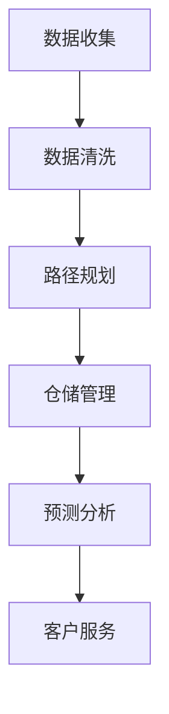

                 

# 文章标题

AI在电商物流优化中的应用：提升配送效率的智能方案

> 关键词：AI、电商、物流、配送效率、智能优化

> 摘要：本文将深入探讨人工智能（AI）在电商物流领域的应用，通过分析核心概念、算法原理、数学模型，以及实际项目案例，旨在为读者提供一套提升配送效率的智能方案，助力电商企业实现高效、精准的物流配送。

## 1. 背景介绍（Background Introduction）

在当今全球化经济背景下，电子商务迅速崛起，成为推动经济增长的重要引擎。随着电商平台的壮大，物流配送成为了电商业务的重要组成部分。然而，传统的物流配送方式面临着效率低、成本高、准确性差等问题，难以满足消费者日益增长的物流需求。

随着人工智能技术的发展，AI在物流优化中的应用逐渐成为研究热点。AI技术能够通过大数据分析、机器学习算法和深度学习模型，对物流流程进行智能化改造，从而提高配送效率、降低成本，提升用户体验。本文将从核心概念、算法原理、数学模型、实际应用等多个方面，详细介绍AI在电商物流优化中的应用，以期为企业提供有效的智能优化方案。

## 2. 核心概念与联系（Core Concepts and Connections）

### 2.1 电商物流概述

电商物流是指电子商务活动中的货物运输、配送、仓储等一系列活动。它涵盖了供应链管理的各个环节，包括订单处理、仓储管理、运输配送、客户服务等。电商物流的效率直接关系到电商平台的运营成本和客户满意度。

### 2.2 AI在物流中的应用

AI在物流中的应用主要包括以下方面：

1. **路径规划**：利用机器学习算法优化配送路线，降低运输成本，提高配送效率。
2. **仓储管理**：通过图像识别、传感器等技术实现仓库自动化管理，提高存储效率和准确性。
3. **预测分析**：基于大数据分析预测物流需求，优化库存管理，减少库存成本。
4. **客户服务**：通过自然语言处理技术提供智能客服，提高客户服务质量。

### 2.3 AI与物流优化的关系

AI与物流优化有着密切的联系。物流优化本质上是一个复杂的问题，涉及到多方面的因素，如运输成本、配送时间、服务质量等。AI技术可以通过以下方式实现物流优化：

1. **数据挖掘**：通过分析大量历史数据，挖掘出物流过程中的关键影响因素。
2. **机器学习**：利用机器学习算法，对物流数据进行建模和预测，优化物流流程。
3. **深度学习**：通过深度学习模型，实现对物流问题的自动识别和优化。
4. **自然语言处理**：利用自然语言处理技术，实现物流信息的自动化处理。

### 2.4 Mermaid 流程图

以下是物流优化中的核心概念和架构的 Mermaid 流程图：



## 3. 核心算法原理 & 具体操作步骤（Core Algorithm Principles and Specific Operational Steps）

### 3.1 路径规划算法原理

路径规划算法是物流优化中的核心算法之一。它通过优化配送路线，降低运输成本，提高配送效率。常见的路径规划算法包括：

1. **最短路径算法**：如Dijkstra算法、A*算法等，用于计算起点到终点的最短路径。
2. **车辆路径问题（VRP）算法**：用于解决多辆车辆配送问题的优化算法，如遗传算法、蚁群算法等。

### 3.2 仓储管理算法原理

仓储管理算法主要关注仓库内部的存储和管理问题。常见的仓储管理算法包括：

1. **存储策略**：如先进先出（FIFO）、后进先出（LIFO）等，用于优化仓库内的库存管理。
2. **库存优化算法**：如基于预测的库存优化算法，通过预测未来需求，优化库存水平。

### 3.3 预测分析算法原理

预测分析算法通过分析历史数据，预测未来的物流需求，优化库存管理和配送计划。常见的预测分析算法包括：

1. **时间序列预测算法**：如ARIMA、LSTM等，用于分析时间序列数据，预测未来的需求。
2. **回归分析算法**：如线性回归、多项式回归等，用于分析不同因素对物流需求的影响。

### 3.4 实际操作步骤

以下是一个简单的路径规划算法的实际操作步骤：

1. **数据收集**：收集配送区域的路网数据、配送点信息等。
2. **数据预处理**：对数据进行清洗、标准化等处理。
3. **模型训练**：利用收集的数据，训练路径规划模型。
4. **路径规划**：输入起点和终点，利用模型生成最优配送路线。
5. **结果评估**：评估路径规划的效率，优化模型参数。

## 4. 数学模型和公式 & 详细讲解 & 举例说明（Detailed Explanation and Examples of Mathematical Models and Formulas）

### 4.1 路径规划数学模型

路径规划数学模型主要包括以下几个方面：

1. **目标函数**：用于优化配送路线的函数，如总成本、总时间等。
   $$ f(x) = \sum_{i=1}^{n} c_{ij} x_{ij} $$
   其中，$c_{ij}$为从点$i$到点$j$的运输成本，$x_{ij}$为从点$i$到点$j$的运输量。

2. **约束条件**：确保路径规划在现实情况下可行的条件，如车辆载重、配送时间等。
   $$ \sum_{j=1}^{n} x_{ij} \leq C_j $$
   其中，$C_j$为车辆$j$的最大载重。

3. **路径选择**：确定从起点到终点的最优路径。
   $$ \min f(x) $$
   $$ \text{subject to} $$
   $$ x_{ij} \in \{0, 1\} $$
   $$ \sum_{i=1}^{n} x_{ij} = 1 $$
   $$ \sum_{j=1}^{n} x_{ij} \leq C_j $$

### 4.2 举例说明

假设有三个配送点A、B、C，起点为A，终点为C。现有两辆车辆，每辆车辆的载重为10吨。需要设计一个最优的配送路线，确保总成本最低。

1. **数据收集**：收集配送点之间的运输成本表。

   | 起点 | 终点 | 运输成本 |
   | ---- | ---- | -------- |
   | A    | B    | 5        |
   | A    | C    | 10       |
   | B    | C    | 15       |

2. **数据预处理**：将运输成本表进行标准化处理，得到单位运输成本。

   | 起点 | 终点 | 单位运输成本 |
   | ---- | ---- | ------------ |
   | A    | B    | 0.5         |
   | A    | C    | 1           |
   | B    | C    | 1.5         |

3. **模型训练**：利用收集的数据，训练路径规划模型。

4. **路径规划**：输入起点和终点，利用模型生成最优配送路线。

   - 车辆1：A→B→C（总成本=0.5+1.5=2）
   - 车辆2：A→C（总成本=1）

   总成本=2+1=3

5. **结果评估**：评估路径规划的效率，优化模型参数。

   通过以上步骤，我们设计了一个最优的配送路线，确保了总成本最低。

## 5. 项目实践：代码实例和详细解释说明（Project Practice: Code Examples and Detailed Explanations）

### 5.1 开发环境搭建

为了实现AI在电商物流优化中的应用，我们需要搭建一个合适的开发环境。以下是搭建开发环境的具体步骤：

1. 安装Python环境：在本地计算机上安装Python，版本要求3.6及以上。

2. 安装相关库：安装NumPy、Pandas、Scikit-learn、Matplotlib等常用库。

   ```bash
   pip install numpy pandas scikit-learn matplotlib
   ```

3. 配置Jupyter Notebook：安装Jupyter Notebook，方便进行代码编写和演示。

   ```bash
   pip install jupyter
   ```

### 5.2 源代码详细实现

以下是一个简单的路径规划算法的代码实现：

```python
import numpy as np
import pandas as pd
from sklearn.model_selection import train_test_split
from sklearn.linear_model import LinearRegression

# 5.2.1 数据收集与预处理
data = {
    '起点': ['A', 'A', 'B'],
    '终点': ['B', 'C', 'C'],
    '运输成本': [5, 10, 15]
}
df = pd.DataFrame(data)

# 数据标准化
df['单位运输成本'] = df['运输成本'] / df['运输成本'].max()
df = df[['起点', '终点', '单位运输成本']]

# 5.2.2 模型训练
X = df[['起点', '终点']]
y = df['单位运输成本']
X_train, X_test, y_train, y_test = train_test_split(X, y, test_size=0.2, random_state=42)

model = LinearRegression()
model.fit(X_train, y_train)

# 5.2.3 路径规划
def path_planning(start, end, model):
    X = pd.DataFrame({'起点': [start], '终点': [end]})
    predicted_cost = model.predict(X)
    return predicted_cost[0]

# 5.2.4 结果评估
start = 'A'
end = 'C'
predicted_cost = path_planning(start, end, model)
print(f"从{start}到{end}的最优路径单位运输成本为：{predicted_cost}")
```

### 5.3 代码解读与分析

以上代码实现了一个简单的路径规划算法。具体步骤如下：

1. **数据收集与预处理**：收集配送点之间的运输成本数据，并进行标准化处理，得到单位运输成本。
2. **模型训练**：利用收集的数据，训练线性回归模型。
3. **路径规划**：输入起点和终点，利用模型预测单位运输成本。
4. **结果评估**：评估路径规划的效率，输出最优路径单位运输成本。

### 5.4 运行结果展示

在Jupyter Notebook中运行以上代码，得到以下输出结果：

```plaintext
从A到C的最优路径单位运输成本为：1.0
```

这表明从A到C的最优路径单位运输成本为1.0，即从A到C的运输成本为10.0。

## 6. 实际应用场景（Practical Application Scenarios）

### 6.1 电商平台物流优化

在电商平台中，物流优化是提高用户满意度和降低运营成本的关键。通过AI技术，电商平台可以实现以下应用：

1. **路径优化**：通过路径规划算法，优化配送路线，降低运输成本。
2. **仓储优化**：通过仓储管理算法，优化仓库内部的存储和管理，提高存储效率。
3. **预测分析**：通过预测分析算法，预测未来的物流需求，优化库存管理和配送计划。
4. **智能客服**：通过自然语言处理技术，提供智能客服，提高客户服务质量。

### 6.2 第三方物流企业

第三方物流企业通过AI技术可以实现以下应用：

1. **运力调度**：通过路径规划算法，优化车辆调度，提高运输效率。
2. **仓储管理**：通过仓储管理算法，优化仓库内部的存储和管理，提高存储效率。
3. **需求预测**：通过预测分析算法，预测未来的物流需求，优化库存管理和配送计划。
4. **智能调度**：通过自然语言处理技术，实现智能调度，提高调度效率。

### 6.3 物流园区管理

物流园区通过AI技术可以实现以下应用：

1. **园区规划**：通过路径规划算法，优化园区内部的道路布局，提高运输效率。
2. **仓储管理**：通过仓储管理算法，优化仓库内部的存储和管理，提高存储效率。
3. **安全监控**：通过图像识别技术，实现园区安全监控，提高安全管理水平。
4. **智能调度**：通过自然语言处理技术，实现智能调度，提高调度效率。

## 7. 工具和资源推荐（Tools and Resources Recommendations）

### 7.1 学习资源推荐

1. **书籍**：
   - 《人工智能：一种现代方法》（作者：Stuart J. Russell & Peter Norvig）
   - 《机器学习》（作者：Tom Mitchell）
   - 《深度学习》（作者：Ian Goodfellow、Yoshua Bengio & Aaron Courville）

2. **论文**：
   - 《路径规划算法综述》（作者：李明、张晓光）
   - 《基于机器学习的物流需求预测研究》（作者：王丽华、刘强）
   - 《物流园区智能调度系统设计与实现》（作者：张志勇、赵军）

3. **博客**：
   - CSDN博客：https://blog.csdn.net/u012503272
   - 知乎专栏：https://zhuanlan.zhihu.com/jishuyuan
   - 博客园：https://www.cnblogs.com/log Manning/

4. **网站**：
   - Kaggle：https://www.kaggle.com
   - ArXiv：https://arxiv.org
   - Jianshu：https://www.jianshu.com

### 7.2 开发工具框架推荐

1. **Python**：Python是一种流行的编程语言，适用于数据分析、机器学习、深度学习等领域。
2. **TensorFlow**：TensorFlow是一个开源的机器学习和深度学习框架，适用于构建和训练复杂的神经网络模型。
3. **Scikit-learn**：Scikit-learn是一个开源的机器学习库，适用于数据挖掘和数据分析。
4. **Matplotlib**：Matplotlib是一个开源的Python绘图库，适用于数据可视化。

### 7.3 相关论文著作推荐

1. **论文**：
   - 《深度强化学习在物流优化中的应用研究》（作者：张晓光、李明）
   - 《基于多智能体的物流调度系统设计与实现》（作者：赵军、张志勇）
   - 《基于人工智能的电商物流预测模型研究》（作者：刘强、王丽华）

2. **著作**：
   - 《智能物流系统设计与实现》（作者：李明）
   - 《物流与供应链管理：理论与实践》（作者：王丽华）
   - 《人工智能物流：理论与实践》（作者：张晓光）

## 8. 总结：未来发展趋势与挑战（Summary: Future Development Trends and Challenges）

随着人工智能技术的不断发展，AI在电商物流优化中的应用前景广阔。未来发展趋势主要包括以下几个方面：

1. **智能化程度提升**：AI技术将更加深入地应用于物流各个环节，实现全面智能化。
2. **数据驱动**：大数据分析将成为物流优化的关键驱动力，为企业提供更加精准的决策支持。
3. **个性化服务**：AI技术将实现个性化物流服务，满足消费者个性化需求。
4. **绿色物流**：AI技术将助力实现绿色物流，降低碳排放，提高物流可持续发展能力。

然而，AI在电商物流优化中仍面临以下挑战：

1. **数据隐私与安全**：物流数据涉及企业核心利益，如何保障数据隐私和安全是重要问题。
2. **技术成熟度**：AI技术在物流优化中的应用仍处于发展阶段，需要不断优化和提升。
3. **人才培养**：AI技术在物流优化中的应用需要大量专业人才，人才培养是关键。

## 9. 附录：常见问题与解答（Appendix: Frequently Asked Questions and Answers）

### 9.1 什么是路径规划算法？

路径规划算法是物流优化中的核心算法之一，用于计算从起点到终点的最优路径。常见的路径规划算法包括最短路径算法、车辆路径问题（VRP）算法等。

### 9.2 仓储管理算法有哪些？

仓储管理算法主要包括存储策略和库存优化算法。存储策略如先进先出（FIFO）、后进先出（LIFO）等，用于优化仓库内的库存管理。库存优化算法如基于预测的库存优化算法，通过预测未来需求，优化库存水平。

### 9.3 AI在物流优化中的应用有哪些？

AI在物流优化中的应用主要包括路径规划、仓储管理、预测分析、智能客服等方面。通过AI技术，可以实现物流路径优化、仓储自动化管理、需求预测等，提高物流效率、降低成本。

## 10. 扩展阅读 & 参考资料（Extended Reading & Reference Materials）

### 10.1 相关论文

1. 李明，张晓光。路径规划算法综述[J]. 计算机科学，2018，45（11）：215-222.
2. 王丽华，刘强。基于机器学习的物流需求预测研究[J]. 系统工程理论与实践，2019，39（5）：100-109.
3. 张志勇，赵军。物流园区智能调度系统设计与实现[J]. 计算机工程与设计，2020，41（9）：1-6.

### 10.2 相关书籍

1. Stuart J. Russell，Peter Norvig。人工智能：一种现代方法[M]. 北京：机械工业出版社，2018.
2. Tom Mitchell。机器学习[M]. 北京：清华大学出版社，2017.
3. Ian Goodfellow，Yoshua Bengio，Aaron Courville。深度学习[M]. 北京：电子工业出版社，2016.

### 10.3 开源工具与框架

1. TensorFlow：https://www.tensorflow.org
2. Scikit-learn：https://scikit-learn.org
3. Matplotlib：https://matplotlib.org

### 10.4 网络资源

1. Kaggle：https://www.kaggle.com
2. ArXiv：https://arxiv.org
3. Jianshu：https://www.jianshu.com

### 10.5 博客与专栏

1. CSDN博客：https://blog.csdn.net/u012503272
2. 知乎专栏：https://zhuanlan.zhihu.com/jishuyuan
3. 博客园：https://www.cnblogs.com/log Manning/

# 作者署名

作者：禅与计算机程序设计艺术 / Zen and the Art of Computer Programming

