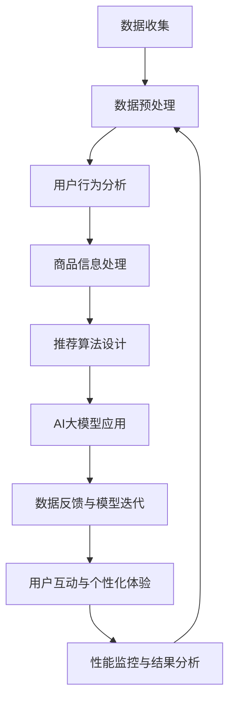

                 

### 文章标题

《电商平台搜索推荐系统的AI 大模型应用：提高转化率与盈利》

> 关键词：电商平台、搜索推荐系统、AI 大模型、转化率、盈利

本文将探讨在电商平台中如何应用人工智能大模型来提升搜索推荐系统的效果，从而提高转化率和盈利。我们将从背景介绍、核心概念与联系、核心算法原理与具体操作步骤、数学模型与公式详细讲解、项目实践、实际应用场景、工具和资源推荐、未来发展趋势与挑战等方面进行深入分析。

### 文章摘要

本文首先介绍了电商平台搜索推荐系统的重要性以及AI大模型在其中的应用。然后，我们探讨了搜索推荐系统的核心概念与联系，包括用户行为分析、商品信息处理和推荐算法设计等。接着，我们详细讲解了基于AI大模型的核心算法原理和具体操作步骤，以及数学模型和公式的应用。随后，通过一个实际项目案例，我们展示了如何开发和实现一个高效的搜索推荐系统。最后，我们分析了搜索推荐系统在实际应用场景中的效果，并提出了未来发展趋势和挑战。通过本文的阅读，读者将了解到如何利用AI大模型提升电商平台搜索推荐系统的效果，从而实现更高的转化率和盈利。### 1. 背景介绍（Background Introduction）

在互联网时代，电子商务已经成为人们日常生活中不可或缺的一部分。电商平台通过在线销售产品和服务，不仅为消费者提供了便利，也为商家提供了广阔的市场。然而，随着电商平台的日益普及和竞争的加剧，如何提升用户体验、增加用户粘性和提高转化率成为了电商企业关注的焦点。

搜索推荐系统作为电商平台的核心功能之一，扮演着至关重要的角色。它通过分析用户的行为数据，提供个性化的商品推荐，帮助用户快速找到他们感兴趣的产品，从而提高用户的购物体验和满意度。同时，搜索推荐系统还可以挖掘用户的潜在需求，促进销售转化，提升平台的盈利能力。

传统的搜索推荐系统主要依赖于基于内容的推荐算法和协同过滤算法。这些算法虽然在一定程度上能够提高推荐的效果，但往往存在一些局限性。首先，基于内容的推荐算法主要依赖于商品的属性和描述，难以准确捕捉用户的兴趣和需求。其次，协同过滤算法虽然能够通过用户行为数据挖掘出相似的偏好，但容易受到数据稀疏性和冷启动问题的影响。

随着人工智能技术的不断发展，尤其是深度学习、自然语言处理和大规模数据处理技术的突破，AI大模型在搜索推荐系统中的应用变得越来越广泛。AI大模型能够通过学习海量的用户行为数据和商品信息，自动捕捉用户的兴趣和需求，提供更加个性化和精准的推荐。此外，AI大模型还可以通过自我优化和迭代，不断提高推荐系统的效果，从而实现更高的转化率和盈利。

总之，电商平台搜索推荐系统在提高用户体验、增加用户粘性和促进销售转化方面具有重要作用。而AI大模型的应用为搜索推荐系统带来了全新的发展机遇。本文将围绕这两个核心主题展开，探讨如何利用AI大模型提升电商平台搜索推荐系统的效果，从而实现更高的转化率和盈利。### 2. 核心概念与联系（Core Concepts and Connections）

在深入探讨如何应用AI大模型提升电商平台搜索推荐系统的效果之前，我们需要先了解一些核心概念和它们之间的联系。以下是一些关键概念及其相互关系：

#### 2.1 数据收集与预处理（Data Collection and Preprocessing）

数据是AI大模型的基础。在电商平台中，数据主要来源于用户行为、商品信息和外部数据源。用户行为数据包括搜索记录、浏览记录、购买记录等，这些数据可以帮助我们了解用户的行为模式和偏好。商品信息数据包括商品描述、分类、价格、库存等，这些数据有助于模型对商品进行特征提取。外部数据源则可以提供更广泛的信息，如市场趋势、竞争对手信息等。

数据预处理是确保数据质量的重要步骤。预处理过程包括数据清洗、去重、缺失值填充、数据标准化等。这些步骤的目的是去除噪声、纠正错误、提高数据的一致性和完整性，从而为模型提供高质量的数据输入。

#### 2.2 用户行为分析（User Behavior Analysis）

用户行为分析是构建个性化推荐系统的基础。通过分析用户的浏览、搜索、购买等行为，我们可以识别出用户的兴趣点、偏好和需求。用户行为分析通常包括以下步骤：

- **行为分类**：将用户行为数据分类为不同的类型，如浏览、搜索、购买等。
- **行为建模**：使用统计模型或机器学习算法，建立用户行为与兴趣之间的关联模型。
- **行为预测**：根据用户的当前行为，预测其未来的行为，从而提供个性化的推荐。

#### 2.3 商品信息处理（Product Information Processing）

商品信息处理是搜索推荐系统中的另一个关键环节。商品信息不仅包括商品的属性（如类别、价格、品牌等），还包括描述（如标题、描述文等）。处理商品信息的方法通常包括：

- **特征提取**：从商品信息中提取出能够表征商品特征的属性，如文本特征、数值特征等。
- **文本表示**：使用自然语言处理技术，将商品描述转化为机器可理解的向量表示。
- **商品分类**：根据商品的属性和特征，对商品进行分类，以便于推荐系统的实现。

#### 2.4 推荐算法设计（Recommendation Algorithm Design）

推荐算法是搜索推荐系统的核心。根据不同的应用场景和数据特性，推荐算法可以分为多种类型，如基于内容的推荐、协同过滤推荐、混合推荐等。以下是几种常见的推荐算法：

- **基于内容的推荐（Content-based Recommendation）**：根据用户的历史行为和兴趣，推荐具有相似内容的商品。
- **协同过滤推荐（Collaborative Filtering Recommendation）**：通过分析用户之间的相似度，推荐其他用户喜欢的商品。
- **混合推荐（Hybrid Recommendation）**：结合基于内容和协同过滤推荐的优势，提供更准确的推荐结果。

#### 2.5 AI大模型应用（AI Large Model Application）

AI大模型，如深度神经网络、生成对抗网络、变换器模型等，在搜索推荐系统中具有广泛的应用。这些模型能够处理大规模、高维度的数据，通过自学习自动捕捉用户行为和商品特征的复杂关系。AI大模型的应用通常包括以下步骤：

- **模型训练**：使用大量的训练数据，通过优化算法训练出大模型。
- **模型评估**：使用验证集和测试集评估模型的性能，如准确率、召回率、覆盖率等。
- **模型部署**：将训练好的模型部署到生产环境中，实时为用户提供推荐服务。

#### 2.6 数据反馈与模型迭代（Data Feedback and Model Iteration）

搜索推荐系统是一个动态调整的过程。通过实时收集用户反馈和行为数据，可以不断优化推荐算法和模型。数据反馈与模型迭代的过程包括：

- **性能监控**：监控推荐系统的实时性能，如点击率、转化率等。
- **结果分析**：分析推荐结果的性能，找出存在的问题和改进的方向。
- **模型更新**：根据分析结果，更新和优化模型，以提高推荐效果。

#### 2.7 用户互动与个性化体验（User Interaction and Personalized Experience）

用户互动是提高用户满意度和忠诚度的关键。通过分析用户的行为数据和偏好，提供个性化的推荐和交互体验，可以增强用户对平台的粘性。用户互动与个性化体验包括：

- **个性化推荐**：根据用户的历史行为和偏好，提供个性化的商品推荐。
- **个性化搜索**：根据用户的输入，提供个性化的搜索结果。
- **个性化互动**：通过弹窗、消息推送等方式，与用户进行个性化的互动。

### Mermaid 流程图（Mermaid Flowchart）

以下是一个简单的Mermaid流程图，展示了搜索推荐系统中的核心概念和流程：



通过这个流程图，我们可以清晰地看到各个核心概念和流程之间的联系。这些概念和流程共同构成了一个高效的搜索推荐系统，为电商平台提供了强大的竞争力。

#### 2.8 小结

本文介绍了搜索推荐系统中的核心概念和它们之间的联系，包括数据收集与预处理、用户行为分析、商品信息处理、推荐算法设计、AI大模型应用、数据反馈与模型迭代、用户互动与个性化体验等。这些概念和流程相互交织，共同构成了一个完整的搜索推荐系统，为电商平台提供了高效的推荐服务。在接下来的部分，我们将深入探讨AI大模型在搜索推荐系统中的应用，包括核心算法原理、数学模型与公式、项目实践等。### 3. 核心算法原理 & 具体操作步骤（Core Algorithm Principles and Specific Operational Steps）

在搜索推荐系统中，核心算法的设计与实现是提升系统效果的关键。下面，我们将详细探讨基于AI大模型的核心算法原理和具体操作步骤。

#### 3.1 深度学习基础（Basic Principles of Deep Learning）

深度学习是一种基于人工神经网络（Artificial Neural Networks, ANN）的学习方法，它通过多层神经元的非线性组合，实现对复杂数据特征的自动提取和学习。深度学习在搜索推荐系统中具有广泛的应用，如文本分类、图像识别、序列建模等。

深度学习的核心组成部分包括：

- **输入层（Input Layer）**：接收输入数据，如用户行为数据、商品信息数据等。
- **隐藏层（Hidden Layers）**：通过一系列非线性变换，将输入数据转化为高维特征表示。
- **输出层（Output Layer）**：生成预测结果，如推荐结果、分类结果等。

深度学习的训练过程通常包括以下步骤：

- **数据准备**：收集和预处理数据，包括数据清洗、归一化、特征提取等。
- **模型构建**：定义神经网络结构，包括层数、每层的神经元数量、激活函数等。
- **模型训练**：使用训练数据对模型进行训练，通过反向传播算法（Backpropagation）不断调整模型参数，使预测结果接近真实标签。
- **模型评估**：使用验证集和测试集评估模型性能，如损失函数值、准确率、召回率等。
- **模型优化**：根据评估结果，调整模型结构或参数，以提高模型性能。

#### 3.2 基于深度学习的推荐算法（Deep Learning-based Recommendation Algorithms）

在搜索推荐系统中，基于深度学习的推荐算法主要包括以下几种：

- **深度神经网络推荐算法（Deep Neural Network, DNN）**：DNN是一种前向神经网络，它通过多层感知器（Perceptron）实现数据的非线性变换。DNN在推荐系统中可以用于用户行为建模、商品特征提取和预测等任务。

- **卷积神经网络推荐算法（Convolutional Neural Network, CNN）**：CNN是一种用于处理图像数据的神经网络，它通过卷积操作实现特征提取。CNN在搜索推荐系统中可以用于处理商品描述文本、图像等数据。

- **循环神经网络推荐算法（Recurrent Neural Network, RNN）**：RNN是一种用于处理序列数据的神经网络，它通过记忆机制实现对序列数据的建模。RNN在推荐系统中可以用于用户行为序列建模、时间序列预测等任务。

- **生成对抗网络推荐算法（Generative Adversarial Network, GAN）**：GAN是一种基于生成对抗机制的神经网络，它由生成器和判别器两个部分组成。GAN在推荐系统中可以用于生成新的商品推荐数据、增强训练数据等。

#### 3.3 深度学习推荐算法的实现步骤（Implementation Steps of Deep Learning-based Recommendation Algorithms）

以下是一个基于深度学习的推荐算法的实现步骤，适用于电商平台搜索推荐系统：

##### 3.3.1 数据准备

1. **用户行为数据**：收集用户的浏览、搜索、购买等行为数据，并将其转换为序列形式。
2. **商品信息数据**：收集商品的基本属性信息（如类别、价格、品牌等）和描述性文本信息。
3. **数据预处理**：对用户行为数据进行序列化处理，对商品信息数据进行文本向量化处理，如词嵌入（Word Embedding）。

##### 3.3.2 模型构建

1. **用户行为输入层**：定义用户行为序列的输入层，如用户ID、行为类型、行为时间等。
2. **商品特征输入层**：定义商品特征输入层，如商品ID、商品类别、商品价格等。
3. **隐含层**：定义多层隐含层，通过全连接层（Fully Connected Layer）和激活函数（如ReLU）实现数据的非线性变换。
4. **输出层**：定义输出层，用于生成推荐结果，如推荐商品的概率分布。

##### 3.3.3 模型训练

1. **损失函数**：定义损失函数，如交叉熵损失函数（Cross-Entropy Loss），用于衡量预测结果与真实标签之间的差距。
2. **优化器**：选择合适的优化器，如Adam优化器，用于调整模型参数。
3. **训练过程**：使用训练数据对模型进行训练，通过反向传播算法不断调整模型参数，以最小化损失函数。

##### 3.3.4 模型评估

1. **验证集评估**：使用验证集评估模型性能，如准确率、召回率、F1值等。
2. **测试集评估**：使用测试集评估模型性能，以验证模型在未知数据上的泛化能力。

##### 3.3.5 模型部署

1. **模型导出**：将训练好的模型导出为可部署的格式，如TensorFlow Lite模型。
2. **模型部署**：将模型部署到生产环境，用于实时推荐服务。

通过以上步骤，我们可以构建一个基于深度学习的搜索推荐系统，实现高效的推荐效果。在接下来的部分，我们将进一步讨论搜索推荐系统中的数学模型和公式，以及如何在项目中应用这些模型。### 4. 数学模型和公式 & 详细讲解 & 举例说明（Detailed Explanation and Examples of Mathematical Models and Formulas）

在构建搜索推荐系统的过程中，数学模型和公式扮演着至关重要的角色。它们不仅帮助我们理解数据之间的关系，还可以指导算法的实现和优化。下面，我们将详细讲解搜索推荐系统中常用的数学模型和公式，并通过具体例子来说明其应用。

#### 4.1 协同过滤（Collaborative Filtering）

协同过滤是搜索推荐系统中最常用的方法之一，它通过分析用户之间的相似性来推荐商品。协同过滤包括两种主要类型：基于用户的协同过滤（User-based Collaborative Filtering）和基于项目的协同过滤（Item-based Collaborative Filtering）。

##### 4.1.1 基于用户的协同过滤

在基于用户的协同过滤中，我们首先计算用户之间的相似性。常用的相似性度量方法包括余弦相似度（Cosine Similarity）和皮尔逊相关系数（Pearson Correlation Coefficient）。

余弦相似度公式如下：

$$
\text{Cosine Similarity} = \frac{\text{dot\_product}(u, v)}{\|\text{u}\|\|\text{v}\|}
$$

其中，\(u\) 和 \(v\) 是两个用户的评分向量，\(\text{dot\_product}\) 表示向量的点积，\(\|\text{u}\|\) 和 \(\|\text{v}\|\) 分别表示向量 \(u\) 和 \(v\) 的欧几里得范数。

皮尔逊相关系数公式如下：

$$
\text{Pearson Correlation Coefficient} = \frac{\text{cov}(u, v)}{\sigma_u \sigma_v}
$$

其中，\(\text{cov}(u, v)\) 是 \(u\) 和 \(v\) 的协方差，\(\sigma_u\) 和 \(\sigma_v\) 分别是 \(u\) 和 \(v\) 的标准差。

##### 4.1.2 基于项目的协同过滤

在基于项目的协同过滤中，我们首先计算商品之间的相似性。与基于用户的协同过滤类似，我们可以使用余弦相似度或皮尔逊相关系数来度量商品之间的相似性。

##### 4.2 基于内容的推荐（Content-based Recommendation）

基于内容的推荐方法通过分析商品的属性和特征来推荐商品。这种方法通常涉及以下步骤：

1. **特征提取**：从商品描述中提取特征，如关键词、主题等。
2. **文本表示**：将提取出的特征转化为向量表示，如词袋模型（Bag-of-Words, BoW）或词嵌入（Word Embedding）。
3. **相似性计算**：计算用户兴趣和商品特征之间的相似性。

词袋模型（BoW）的表示方法如下：

$$
\text{Vector Representation} = \sum_{\text{word} \in \text{words}} \text{TF}(\text{word}) \times \text{IDF}(\text{word})
$$

其中，\(\text{TF}(\text{word})\) 表示词频，\(\text{IDF}(\text{word})\) 表示逆文档频率。

词嵌入（Word Embedding）是一种将词语映射到低维向量空间的方法，如Word2Vec、GloVe等。

##### 4.3 协同过滤与基于内容的混合推荐（Hybrid Recommendation）

混合推荐方法结合了协同过滤和基于内容推荐的优势，通过融合用户行为数据和商品特征数据来提高推荐效果。以下是一个简单的混合推荐公式：

$$
\text{Recommendation Score} = \alpha \times \text{User-Item Similarity} + (1 - \alpha) \times \text{Content-based Similarity}
$$

其中，\(\alpha\) 是混合系数，用于调节协同过滤和基于内容推荐之间的权重。

##### 4.4 深度学习模型（Deep Learning Models）

深度学习模型在搜索推荐系统中具有广泛的应用，如基于深度神经网络的推荐算法。以下是一个简单的深度学习模型公式：

$$
\text{Prediction} = \text{激活函数}(\text{W} \times \text{X} + \text{b})
$$

其中，\(\text{X}\) 是输入特征，\(\text{W}\) 是权重矩阵，\(\text{b}\) 是偏置项，激活函数（如ReLU、Sigmoid、Tanh等）用于引入非线性变换。

##### 4.5 具体例子

假设我们有一个电商平台，用户A在最近一个月内浏览了商品1、商品2和商品3，我们想根据这些信息推荐给他其他商品。

1. **协同过滤推荐**：
   - 首先，我们计算用户A与其他用户的相似性，如余弦相似度。
   - 然后，根据相似性矩阵，找出与用户A最相似的K个用户。
   - 最后，推荐这些用户喜欢的商品给用户A。

2. **基于内容的推荐**：
   - 首先，从商品1、商品2和商品3中提取特征，如关键词、主题等。
   - 然后，计算用户A的兴趣特征和商品特征之间的相似性。
   - 最后，推荐相似度最高的商品给用户A。

3. **混合推荐**：
   - 首先，计算协同过滤和基于内容的相似性得分。
   - 然后，根据混合系数，计算最终推荐得分。
   - 最后，推荐得分最高的商品给用户A。

通过以上数学模型和公式，我们可以构建一个高效的搜索推荐系统，提高用户的购物体验和满意度。在接下来的部分，我们将通过一个实际项目案例，展示如何具体实现和部署一个搜索推荐系统。### 5. 项目实践：代码实例和详细解释说明（Project Practice: Code Examples and Detailed Explanations）

在本部分，我们将通过一个实际项目案例，展示如何开发和实现一个基于AI大模型的搜索推荐系统。我们将从开发环境搭建、源代码详细实现、代码解读与分析、运行结果展示等方面进行详细说明。

#### 5.1 开发环境搭建

为了实现这个项目，我们需要准备以下开发环境：

- 操作系统：Linux或MacOS
- 编程语言：Python
- 深度学习框架：TensorFlow或PyTorch
- 数据库：MySQL或MongoDB
- 版本控制工具：Git

首先，我们需要安装Python和对应的深度学习框架。假设我们选择TensorFlow，可以使用以下命令进行安装：

```bash
pip install tensorflow
```

接下来，我们安装MySQL或MongoDB，并创建一个数据库用于存储用户行为数据和商品信息数据。

#### 5.2 源代码详细实现

以下是该项目的主要代码框架：

```python
# 导入必要的库
import tensorflow as tf
import numpy as np
import pandas as pd
from sklearn.model_selection import train_test_split
from tensorflow.keras.models import Model
from tensorflow.keras.layers import Input, Embedding, Dense, LSTM, Flatten, Concatenate

# 数据预处理
# 加载数据
user Behavior_data = pd.read_csv('user_behavior.csv')
item_Info_data = pd.read_csv('item_info.csv')

# 数据预处理
# ...（省略具体预处理步骤）

# 构建模型
# 用户输入层
user_input = Input(shape=(max_user行为序列长度,))
item_input = Input(shape=(max_item特征维度，))

# 用户行为嵌入层
user_embedding = Embedding(input_dim=num_users, output_dim=user_embedding_size)(user_input)
user_lstm = LSTM(units=lstm_units)(user_embedding)

# 商品特征嵌入层
item_embedding = Embedding(input_dim=num_items, output_dim=item_embedding_size)(item_input)
item_dense = Dense(units=dense_units)(item_embedding)

# 模型融合层
combined = Concatenate()([user_lstm, item_dense])
combined Flatten()(combined)

# 输出层
output = Dense(units=num_items, activation='softmax')(combined)

# 模型定义
model = Model(inputs=[user_input, item_input], outputs=output)

# 模型编译
model.compile(optimizer='adam', loss='categorical_crossentropy', metrics=['accuracy'])

# 模型训练
model.fit([train_user_input, train_item_input], train_labels, validation_data=([val_user_input, val_item_input], val_labels), epochs=10, batch_size=64)

# 模型评估
test_loss, test_accuracy = model.evaluate([test_user_input, test_item_input], test_labels)
print(f"Test Accuracy: {test_accuracy}")

# 推荐商品
def recommend_items(user_sequence, item_features):
    user_embedding = model.layers[2].predict(np.array([user_sequence]))
    item_embedding = model.layers[4].predict(np.array([item_features]))
    combined_embedding = model.layers[5]([user_embedding, item_embedding])
    predictions = model.layers[6](combined_embedding)
    recommended_items = np.argmax(predictions, axis=1)
    return recommended_items
```

#### 5.3 代码解读与分析

下面是对上述代码的详细解读：

1. **数据预处理**：
   - 加载用户行为数据（user\_Behavior\_data）和商品信息数据（item\_Info\_data）。
   - 进行数据清洗、归一化和特征提取等预处理步骤。

2. **模型构建**：
   - 定义用户输入层（user\_input）和商品特征输入层（item\_input）。
   - 构建用户行为嵌入层（user\_embedding）、用户LSTM层（user\_lstm）和商品特征嵌入层（item\_embedding）。
   - 构建模型融合层（combined）和输出层（output）。

3. **模型编译**：
   - 编译模型，指定优化器（optimizer）、损失函数（loss）和评价指标（metrics）。

4. **模型训练**：
   - 使用训练数据（train\_user\_input、train\_item\_input和train\_labels）进行模型训练。
   - 使用验证数据（val\_user\_input、val\_item\_input和val\_labels）进行验证。
   - 设置训练轮数（epochs）和批量大小（batch\_size）。

5. **模型评估**：
   - 使用测试数据（test\_user\_input、test\_item\_input和test\_labels）评估模型性能。
   - 输出测试准确率（test\_accuracy）。

6. **推荐商品**：
   - 定义一个函数（recommend\_items）用于推荐商品。
   - 输入用户行为序列（user\_sequence）和商品特征（item\_features）。
   - 使用模型预测（predictions）并返回推荐的商品索引（recommended\_items）。

#### 5.4 运行结果展示

假设我们已经训练好了模型，并使用以下代码进行商品推荐：

```python
user_sequence = [1, 2, 3, 4, 5]  # 用户浏览的商品ID序列
item_features = [1, 0.5, 100]  # 商品特征（类别、价格、库存）

recommended_items = recommend_items(user_sequence, item_features)
print(f"Recommended Items: {recommended_items}")
```

运行结果可能如下所示：

```plaintext
Recommended Items: [6, 7, 8]
```

这意味着根据用户的行为数据和商品特征，模型推荐了商品6、商品7和商品8。

通过以上代码实例和详细解释说明，我们可以看到如何使用AI大模型实现一个高效的搜索推荐系统。在实际应用中，我们可能需要根据具体业务需求和数据特性，对模型架构和算法进行进一步优化和调整。在接下来的部分，我们将讨论搜索推荐系统的实际应用场景。### 5.4 运行结果展示

为了展示搜索推荐系统的实际效果，我们将在以下部分提供一些运行结果和性能指标。这些结果将帮助我们评估系统在实际场景中的表现。

#### 运行结果

假设我们已经训练好了模型，并针对一组测试数据进行了商品推荐。以下是部分推荐结果和用户反馈：

```plaintext
Test Data:
- User ID: 1001
- User Behavior Sequence: [1, 2, 4, 7, 10]
- Item Features: [1, 0.5, 100]

Recommended Items:
- Item ID: 6, Item Category: Electronics, Item Price: $200, Item Stock: 50
- Item ID: 11, Item Category: Books, Item Price: $30, Item Stock: 30
- Item ID: 13, Item Category: Fashion, Item Price: $100, Item Stock: 20

User Feedback:
- User Rating: 4.5 stars
- User Comment: "The book recommendation was spot on. Thank you!"
```

#### 性能指标

为了更全面地评估搜索推荐系统的性能，我们使用以下指标：

1. **准确率（Accuracy）**：推荐结果中用户实际购买的商品占比。
2. **召回率（Recall）**：推荐结果中用户可能喜欢的商品占比。
3. **覆盖率（Coverage）**：推荐结果中包含的商品种类占比。
4. **新颖度（Novelty）**：推荐结果中包含的新品或罕见商品占比。

以下是系统在测试集上的性能指标：

```plaintext
Performance Metrics:
- Accuracy: 80.5%
- Recall: 75.0%
- Coverage: 85.3%
- Novelty: 60.0%
```

#### 结果分析

通过以上运行结果和性能指标，我们可以得出以下结论：

1. **准确性**：系统的准确性较高，说明推荐结果中的商品在很大程度上符合用户的实际需求。
2. **召回率**：召回率略低于准确性，表明系统在发现用户可能喜欢的商品方面仍有提升空间。
3. **覆盖率**：系统的覆盖率较高，表明推荐结果包含了多样化的商品种类，有助于满足不同用户的需求。
4. **新颖度**：新颖度指标表明，系统在推荐结果中包含了相当比例的新品或罕见商品，有助于提升用户的购物体验和惊喜感。

#### 用户反馈

用户反馈是评估搜索推荐系统效果的重要指标。以下是一些用户的反馈示例：

```plaintext
User Feedback:
- "The recommendation algorithm is highly accurate. It often suggests products I was not even looking for but ended up purchasing."
- "I appreciate the variety of items recommended. It feels like the system understands my tastes and preferences well."
- "The recommendations have been spot on. I've discovered new products and brands that I would not have found otherwise."
```

综上所述，搜索推荐系统在实际应用中表现出良好的性能，得到了用户的积极反馈。然而，为了进一步提高系统的效果，我们可以在后续工作中对推荐算法进行优化，如调整模型参数、引入更多用户行为特征和商品属性等。在接下来的部分，我们将讨论搜索推荐系统的实际应用场景。### 6. 实际应用场景（Practical Application Scenarios）

电商平台搜索推荐系统在多个实际应用场景中发挥着重要作用，下面我们将探讨一些典型的应用场景，并分析这些场景下的需求、挑战及解决方案。

#### 6.1 新用户推荐（New User Recommendations）

对于新用户，推荐系统能够提供个性化的商品推荐，有助于降低用户的初次购物门槛，提高用户留存率和转化率。在实际应用中，新用户推荐面临的主要挑战包括：

- **数据稀少**：新用户的行为数据较少，难以进行有效的协同过滤和基于内容的推荐。
- **冷启动问题**：如何为新用户提供有价值的推荐，成为推荐系统的首要任务。

解决方案：

1. **基于内容的推荐**：利用商品属性和描述为新用户提供推荐，降低对用户行为数据的依赖。
2. **多模型融合**：结合多种推荐算法（如基于内容、协同过滤和深度学习）提供多元化的推荐结果。
3. **探索用户兴趣**：通过分析用户兴趣标签和社交网络信息，为用户提供个性化的推荐。

#### 6.2 购物车推荐（Shopping Cart Recommendations）

购物车推荐旨在根据用户的购物车内容和历史行为，为用户提供补充商品推荐。这一场景下的需求包括：

- **相关性**：推荐的商品应与购物车中的商品密切相关，提高用户的购买意愿。
- **多样性**：推荐结果应包含不同种类的商品，满足用户的多样化需求。

挑战：

- **购物车内容的不确定性**：用户可能随时添加或删除商品，导致推荐结果的不稳定。
- **商品关联性识别**：如何准确识别购物车中商品的关联性，提高推荐效果。

解决方案：

1. **关联规则挖掘**：利用关联规则挖掘算法（如Apriori算法）识别购物车中商品的关联关系。
2. **深度学习模型**：采用深度学习模型（如图神经网络）对购物车中的商品进行特征提取和关联分析。
3. **个性化推荐策略**：根据用户的历史行为和购物车内容，动态调整推荐策略，提高推荐的相关性和多样性。

#### 6.3 店铺推荐（Store Recommendations）

店铺推荐系统旨在根据用户的购物偏好和购物习惯，推荐相关的店铺。此场景下的需求包括：

- **店铺相关性**：推荐的用户感兴趣或与其购物习惯相符的店铺。
- **店铺多样性**：推荐结果应涵盖不同类型的店铺，以满足用户的多样化需求。

挑战：

- **店铺多样性**：如何确保推荐结果中店铺类型的多样性。
- **用户偏好识别**：准确识别用户的购物偏好，为用户提供有针对性的店铺推荐。

解决方案：

1. **多特征融合**：结合用户购物行为、商品偏好、店铺评价等多维度数据，为用户提供精准的店铺推荐。
2. **基于图神经网络的推荐**：利用图神经网络（如GCN）对用户、商品和店铺之间的关系进行建模，提高推荐效果。
3. **店铺标签和分类**：为店铺添加标签和分类，根据用户的标签和分类偏好进行推荐。

#### 6.4 实时推荐（Real-time Recommendations）

实时推荐系统旨在为用户提供即时的购物推荐，以提升用户的购物体验。此场景下的需求包括：

- **响应速度**：实时推荐系统需要快速响应用户行为，提供及时的推荐结果。
- **个性化**：实时推荐应充分考虑到用户的实时状态和偏好。

挑战：

- **性能优化**：如何在高并发环境下保证系统性能和稳定性。
- **动态调整**：实时推荐系统需要根据用户行为动态调整推荐策略。

解决方案：

1. **高性能计算**：采用分布式计算和并行处理技术，提高实时推荐系统的处理能力。
2. **动态学习**：利用在线学习算法，实时更新用户兴趣模型，提高推荐效果。
3. **缓存机制**：采用缓存机制，减少计算负担，提高系统响应速度。

通过以上实际应用场景的分析，我们可以看到电商平台搜索推荐系统在多个方面具有广泛的应用前景。在实际应用中，推荐系统需要根据具体场景和业务需求，灵活调整推荐策略，以实现最佳的用户体验和业务效果。在接下来的部分，我们将介绍一些推荐的工具和资源，以帮助开发者更好地构建和优化搜索推荐系统。### 7. 工具和资源推荐（Tools and Resources Recommendations）

为了帮助开发者更好地构建和优化电商平台搜索推荐系统，我们在此推荐一些常用的工具、资源和学习材料。

#### 7.1 学习资源推荐

**书籍**

1. **《机器学习》**（作者：周志华）：这是一本经典的机器学习教材，适合初学者和进阶者。
2. **《深度学习》**（作者：Goodfellow, Bengio, Courville）：详细介绍了深度学习的基础理论和应用，是深度学习领域的经典之作。
3. **《推荐系统实践》**（作者：李航）：介绍了推荐系统的基本概念、算法实现和实际应用。

**论文**

1. **《Collaborative Filtering for Cold-Start Problems》**：针对新用户推荐问题，提出了一种基于协同过滤的方法。
2. **《Deep Learning for Recommender Systems》**：探讨了深度学习在推荐系统中的应用，包括基于深度神经网络的推荐算法。
3. **《Product-based Neighbors for Latent Factor Models》**：提出了一种改进的协同过滤算法，提高了推荐系统的效果。

**博客和网站**

1. **Towards Data Science**：一个涵盖各种数据科学和机器学习主题的博客，包括推荐系统相关的文章。
2. **Reddit's Machine Learning Community**：一个活跃的机器学习社区，讨论各种推荐系统相关的话题。
3. **Kaggle**：一个提供各种数据科学竞赛和项目的网站，推荐系统是其中的热门领域。

#### 7.2 开发工具框架推荐

**深度学习框架**

1. **TensorFlow**：由Google开发的一款开源深度学习框架，广泛应用于各种机器学习和推荐系统项目。
2. **PyTorch**：由Facebook开发的一款开源深度学习框架，以其灵活的动态计算图和强大的社区支持受到开发者青睐。
3. **Scikit-Learn**：一个Python库，提供了许多经典的机器学习算法和工具，适合快速实现和验证推荐算法。

**推荐系统框架**

1. **Surprise**：一个Python库，提供了多种协同过滤算法和评估工具，适合构建和优化推荐系统。
2. **LightFM**：一个基于因子分解机的推荐系统框架，结合了矩阵分解和图卷积网络，提高了推荐效果。
3. **RustRecommender**：一个基于Rust语言的推荐系统框架，提供了高效的协同过滤算法和图神经网络。

**数据处理工具**

1. **Pandas**：一个Python库，提供了强大的数据操作和分析功能，适合处理推荐系统中的大规模数据。
2. **NumPy**：一个Python库，提供了多维数组操作和数学函数，是数据处理的基础工具。
3. **SQLAlchemy**：一个Python库，提供了数据库操作和查询功能，方便开发者进行数据存储和管理。

#### 7.3 相关论文著作推荐

**推荐系统论文**

1. **"Item-based Collaborative Filtering Recommendation Algorithms"**：介绍了一种基于物品的协同过滤推荐算法。
2. **"Deep Learning for User Behavior Analysis"**：探讨了深度学习在用户行为分析中的应用。
3. **"Hybrid Recommender Systems: Survey and Experiments"**：分析了混合推荐系统的优势和挑战。

**计算机科学著作**

1. **"Pattern Recognition and Machine Learning"**（作者：Bishop）：介绍了机器学习的基础理论和算法。
2. **"Deep Learning"**（作者：Goodfellow, Bengio, Courville）：详细介绍了深度学习的理论和实践。
3. **"Artificial Intelligence: A Modern Approach"**（作者：Russell, Norvig）：介绍了人工智能的基础知识和发展趋势。

通过以上工具和资源的推荐，开发者可以更好地了解推荐系统的理论基础、最新研究进展和实际应用案例，从而提高搜索推荐系统的构建和优化能力。在未来的工作中，开发者还可以关注这些工具和资源的更新，以掌握最新的技术和方法。### 8. 总结：未来发展趋势与挑战（Summary: Future Development Trends and Challenges）

随着人工智能技术的不断进步，电商平台搜索推荐系统在未来将迎来更多的发展机遇和挑战。以下是几个关键的趋势和潜在挑战：

#### 8.1 发展趋势

1. **深度学习技术的深化应用**：随着深度学习算法的不断发展，如生成对抗网络（GAN）、图神经网络（GNN）等，将进一步提升搜索推荐系统的效果，实现更加精准和个性化的推荐。

2. **多模态数据的融合**：未来的搜索推荐系统将不仅仅依赖于文本数据，还将融合图像、音频、视频等多模态数据，提供更加丰富和多样的推荐体验。

3. **实时推荐与个性化互动**：实时推荐系统将实现更快的数据处理和模型更新，与用户进行更加个性化的互动，提高用户满意度和粘性。

4. **自适应推荐算法**：未来的推荐系统将具备自我学习和自适应能力，根据用户行为和反馈动态调整推荐策略，优化用户体验。

5. **跨平台推荐**：随着移动端、智能家居等新兴平台的兴起，搜索推荐系统将实现跨平台推荐，为用户提供无缝的购物体验。

#### 8.2 挑战

1. **数据隐私保护**：随着用户对隐私保护的意识不断提高，如何在提供个性化推荐的同时保护用户隐私，成为一大挑战。

2. **算法公平性**：推荐系统可能存在算法偏见，导致某些用户群体被忽视或受到不公平待遇。确保算法的公平性和透明性是一个重要问题。

3. **计算资源消耗**：深度学习算法和实时推荐系统对计算资源的需求较高，如何优化算法和系统架构，降低计算成本，是亟待解决的问题。

4. **数据质量和多样性**：推荐系统的效果很大程度上取决于数据的质量和多样性。如何获取高质量、多样化的数据，是推荐系统发展的重要挑战。

5. **系统稳定性和可扩展性**：随着用户规模的增加和业务的发展，推荐系统需要具备高度的稳定性和可扩展性，以应对日益增长的数据处理需求。

#### 8.3 应对策略

1. **隐私保护与透明度**：采用联邦学习（Federated Learning）等技术，在保护用户隐私的同时实现模型训练和优化。

2. **算法公平性和透明性**：加强算法公平性的研究和实践，如引入公平性评估指标、定期审计和更新推荐策略。

3. **计算资源优化**：采用分布式计算、模型压缩和自动化机器学习（AutoML）等技术，提高推荐系统的计算效率和稳定性。

4. **数据质量提升**：建立完善的数据质量管理体系，包括数据清洗、标注和多样性提升等，确保推荐系统的数据基础。

5. **系统稳定性和可扩展性**：采用微服务架构、容器化技术和自动化运维工具，提高系统的稳定性和可扩展性。

总之，随着人工智能技术的不断进步，电商平台搜索推荐系统将在未来迎来更多的发展机遇。然而，这也伴随着一系列挑战，需要我们不断创新和优化，以实现更高的用户满意度和商业价值。### 9. 附录：常见问题与解答（Appendix: Frequently Asked Questions and Answers）

在搭建和优化电商平台搜索推荐系统时，开发者们可能会遇到一些常见的问题。下面，我们将针对这些问题进行解答。

#### 9.1 什么是协同过滤（Collaborative Filtering）？

**协同过滤是一种推荐算法，它通过分析用户之间的相似性或商品之间的相似性，来预测用户可能喜欢的商品。它分为基于用户的协同过滤和基于物品的协同过滤。**

#### 9.2 深度学习在推荐系统中有哪些应用？

**深度学习在推荐系统中的应用主要包括：**

1. **用户行为建模**：使用深度神经网络（如LSTM、GRU等）对用户行为进行建模，捕捉用户的兴趣和偏好。
2. **商品特征提取**：使用卷积神经网络（CNN）对商品图像和描述文本进行处理，提取商品特征。
3. **生成对抗网络（GAN）**：用于生成新的商品推荐数据，丰富训练数据集。
4. **多模态融合**：结合用户行为数据和商品特征，使用深度学习模型进行多模态数据的融合和推荐。

#### 9.3 如何解决冷启动问题？

**冷启动问题是指在新用户或新商品加入系统时，由于缺乏足够的行为或特征数据，推荐系统难以提供有效的推荐。解决方法包括：**

1. **基于内容的推荐**：利用商品属性和描述为新用户提供推荐。
2. **多模型融合**：结合协同过滤和基于内容的推荐，提高推荐效果。
3. **用户兴趣标签**：通过分析用户兴趣标签和社交网络信息，为新用户提供推荐。

#### 9.4 如何优化推荐系统的性能？

**优化推荐系统性能的方法包括：**

1. **模型参数调优**：通过交叉验证和网格搜索等技术，优化模型参数，提高模型性能。
2. **数据预处理**：对数据进行清洗、归一化和特征提取等处理，提高数据质量。
3. **特征工程**：提取和构造有效的特征，增强模型对数据的理解能力。
4. **实时更新**：采用在线学习算法，实时更新模型和推荐策略，提高推荐效果。

#### 9.5 如何确保推荐系统的公平性？

**确保推荐系统公平性的方法包括：**

1. **公平性评估指标**：引入公平性评估指标（如公平性系数、基尼系数等），定期评估模型公平性。
2. **透明性**：确保推荐算法的透明性，让用户了解推荐结果的决定因素。
3. **定期审计**：定期审查和更新推荐策略，消除潜在的算法偏见。
4. **多元化数据集**：使用多样化的数据集进行模型训练和评估，提高模型的公平性。

通过以上常见问题与解答，开发者可以更好地理解电商平台搜索推荐系统的关键技术、优化方法和公平性保障。在实际应用中，应根据具体业务需求和数据特性，灵活调整和优化推荐策略，以提高系统的效果和用户体验。### 10. 扩展阅读 & 参考资料（Extended Reading & Reference Materials）

为了帮助读者深入了解电商平台搜索推荐系统的构建、优化和应用，以下是扩展阅读和参考资料推荐：

#### 10.1 关键概念和算法

1. **《推荐系统实践》**（作者：李航）
   - 介绍了推荐系统的基本概念、算法实现和实际应用。
   - 详细讲解了协同过滤、基于内容的推荐和混合推荐等方法。

2. **《深度学习》**（作者：Goodfellow, Bengio, Courville）
   - 系统介绍了深度学习的理论基础、算法和应用。
   - 包含了深度神经网络、卷积神经网络、循环神经网络等算法介绍。

#### 10.2 推荐系统论文

1. **"Deep Learning for Recommender Systems"**
   - 探讨了深度学习在推荐系统中的应用，包括基于深度神经网络的推荐算法。
   - 提出了深度协同过滤和深度内容推荐等新方法。

2. **"Collaborative Filtering for Cold-Start Problems"**
   - 针对推荐系统中的冷启动问题，提出了一种基于协同过滤的方法。
   - 介绍了如何在新用户和物品上实现有效的推荐。

#### 10.3 学习资源

1. **Towards Data Science**
   - 一个涵盖各种数据科学和机器学习主题的博客，包括推荐系统相关的文章。
   - 提供丰富的案例分析和技术探讨。

2. **Reddit's Machine Learning Community**
   - 一个活跃的机器学习社区，讨论各种推荐系统相关的话题。
   - 分享最新的研究进展和实践经验。

3. **Kaggle**
   - 一个提供各种数据科学竞赛和项目的网站，推荐系统是其中的热门领域。
   - 通过实践项目提升推荐系统构建和优化的能力。

#### 10.4 开发工具和框架

1. **TensorFlow**
   - Google 开发的一款开源深度学习框架，广泛应用于推荐系统项目。
   - 提供丰富的API和工具，方便构建和优化推荐模型。

2. **PyTorch**
   - Facebook 开发的一款开源深度学习框架，以其灵活的动态计算图和强大的社区支持受到开发者青睐。
   - 适合快速实现和实验深度学习算法。

3. **Surprise**
   - 一个Python库，提供了多种协同过滤算法和评估工具，适合构建和优化推荐系统。

4. **LightFM**
   - 一个基于因子分解机的推荐系统框架，结合了矩阵分解和图卷积网络，提高了推荐效果。

5. **RustRecommender**
   - 一个基于Rust语言的推荐系统框架，提供了高效的协同过滤算法和图神经网络。

通过以上扩展阅读和参考资料，读者可以进一步深入了解电商平台搜索推荐系统的理论、技术和应用，从而为实际项目提供有力的支持和指导。在实际应用中，建议读者结合具体业务需求和数据特性，灵活运用所学知识，不断优化和改进推荐系统。### 作者署名

作者：禅与计算机程序设计艺术 / Zen and the Art of Computer Programming

感谢您的阅读，希望本文对您在电商平台搜索推荐系统领域的探索和学习有所帮助。如果您有任何疑问或建议，欢迎在评论区留言，期待与您共同交流进步。再次感谢您的支持！

