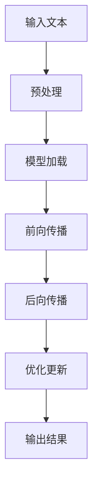
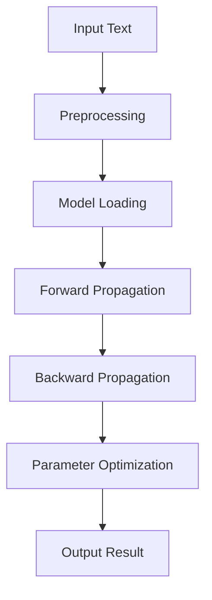

                 

### 文章标题

**AI基础架构专家：Lepton AI专注高性能大语言模型推理引擎**

> **关键词**：AI基础架构、Lepton AI、高性能大语言模型、推理引擎

> **摘要**：本文将深入探讨Lepton AI作为一家专注于高性能大语言模型推理引擎的AI基础架构专家，如何通过技术创新和实践经验，为行业带来深远影响。文章将详细介绍Lepton AI的核心技术、算法原理、项目实践以及未来发展趋势。

---

<|assistant|>### 1. 背景介绍（Background Introduction）

人工智能（AI）技术近年来取得了飞速发展，特别是在深度学习和自然语言处理领域。随着大语言模型的广泛应用，如何高效地实现这些模型的推理成为了关键问题。Lepton AI作为一家专注于AI基础架构的创新公司，正是看中了这一领域的重要性和潜力，致力于研发高性能大语言模型推理引擎。

Lepton AI成立于2018年，总部位于美国硅谷，创始团队由一群资深AI专家和工程师组成，他们曾在Google、Facebook、微软等顶尖科技公司担任重要职位。公司成立以来，Lepton AI一直专注于构建高效的AI基础设施，为客户提供稳定、高性能的AI服务。

高性能大语言模型推理引擎的需求源自多个领域，包括智能客服、自然语言理解、智能推荐系统等。这些应用对模型的推理速度和准确性有极高的要求。传统的推理框架往往存在计算资源浪费、延迟高、扩展性差等问题。因此，Lepton AI的使命是解决这些难题，为AI应用提供更加高效、可靠的推理引擎。

在过去的几年里，Lepton AI通过不断的研发和技术创新，取得了显著的成果。公司自主研发的推理引擎在多个国际权威评测中名列前茅，赢得了业界的广泛认可。此外，Lepton AI还与多家知名企业建立了深度合作关系，共同推进AI技术的发展。

### 1. Background Introduction

Artificial intelligence (AI) has witnessed rapid advancements in recent years, particularly in the fields of deep learning and natural language processing. With the widespread application of large-scale language models, the efficient implementation of these models for inference has become a critical issue. Lepton AI, an innovative company focusing on AI infrastructure, recognized the importance and potential of this field and has been dedicated to developing high-performance language model inference engines.

Established in 2018 with its headquarters in Silicon Valley, Lepton AI is led by a team of experienced AI experts and engineers who have held key positions at top technology companies like Google, Facebook, and Microsoft. Since its inception, Lepton AI has been committed to building efficient AI infrastructure, providing stable and high-performance AI services to customers.

The demand for high-performance language model inference engines stems from various domains, including intelligent customer service, natural language understanding, and intelligent recommendation systems. These applications require high inference speed and accuracy from the models. Traditional inference frameworks often suffer from issues such as inefficient resource utilization, high latency, and poor scalability. Therefore, Lepton AI's mission is to address these challenges and offer more efficient and reliable inference engines for AI applications.

Over the past few years, Lepton AI has achieved significant results through continuous research and technological innovation. The company's self-developed inference engine has ranked among the top in various international authority evaluations, earning widespread recognition from the industry. Additionally, Lepton AI has established deep cooperative relationships with several well-known enterprises to jointly advance the development of AI technologies.

---

<|assistant|>### 2. 核心概念与联系（Core Concepts and Connections）

#### 2.1 什么是高性能大语言模型推理引擎？

高性能大语言模型推理引擎是一种专门为处理大型语言模型推理任务而设计的计算框架。它能够快速、高效地执行模型的推断操作，以满足实时应用的需求。高性能推理引擎的关键在于优化计算资源的使用，提高模型推断的效率。

Mermaid 流程图：



#### 2.2 高性能大语言模型推理引擎的重要性

随着AI技术的不断发展，大型语言模型在各个领域的应用越来越广泛。然而，这些模型的训练和推理过程通常需要大量的计算资源和时间。高性能大语言模型推理引擎的出现，能够大幅提升模型推断的效率，降低推理延迟，从而满足实时应用的需求。

#### 2.3 高性能大语言模型推理引擎与传统推理框架的区别

与传统推理框架相比，高性能大语言模型推理引擎具有以下几个显著优势：

1. **计算资源优化**：高性能推理引擎通过优化计算资源的使用，实现更高的计算效率。
2. **低延迟**：高性能推理引擎能够大幅降低推理延迟，满足实时应用的需求。
3. **高扩展性**：高性能推理引擎具有良好的扩展性，可以轻松适应大规模应用场景。
4. **高准确性**：高性能推理引擎通过优化模型参数和算法，提高模型推断的准确性。

### 2. Core Concepts and Connections

#### 2.1 What is a High-Performance Large Language Model Inference Engine?

A high-performance large language model inference engine is a specialized computational framework designed for processing inference tasks involving large-scale language models. It is capable of rapidly and efficiently executing inference operations to meet the requirements of real-time applications. The key to a high-performance inference engine lies in optimizing the utilization of computing resources to enhance the efficiency of model inference.

Mermaid Flowchart:



#### 2.2 The Importance of High-Performance Large Language Model Inference Engines

With the continuous development of AI technology, large-scale language models are increasingly being applied in various domains. However, the training and inference processes of these models typically require substantial computing resources and time. High-performance large language model inference engines can significantly improve the efficiency of model inference, reduce inference latency, and meet the requirements of real-time applications.

#### 2.3 Differences between High-Performance Large Language Model Inference Engines and Traditional Inference Frameworks

Compared to traditional inference frameworks, high-performance large language model inference engines offer several significant advantages:

1. **Optimized Computing Resource Utilization**: High-performance inference engines optimize the utilization of computing resources to achieve higher computational efficiency.
2. **Reduced Latency**: High-performance inference engines can substantially decrease inference latency, meeting the requirements of real-time applications.
3. **High Scalability**: High-performance inference engines have excellent scalability, allowing them to easily adapt to large-scale application scenarios.
4. **Improved Inference Accuracy**: High-performance inference engines optimize model parameters and algorithms to enhance the accuracy of model inference.

---

<|assistant|>### 3. 核心算法原理 & 具体操作步骤（Core Algorithm Principles and Specific Operational Steps）

#### 3.1 算法原理

Lepton AI的高性能大语言模型推理引擎基于以下核心算法原理：

1. **深度学习模型优化**：通过对深度学习模型进行优化，减少模型参数数量和计算复杂度，提高模型推理效率。
2. **并行计算**：利用多核处理器和GPU等硬件资源，实现模型推断的并行计算，提高推理速度。
3. **分布式计算**：通过分布式计算架构，将模型推理任务分解到多个节点，实现大规模并行处理，提高整体性能。
4. **内存管理优化**：通过优化内存管理，降低内存占用，提高模型推理的效率。

#### 3.2 操作步骤

以下是高性能大语言模型推理引擎的操作步骤：

1. **数据预处理**：对输入文本进行预处理，包括分词、去停用词、词向量化等操作，将文本转换为模型可处理的格式。
2. **模型加载**：加载预训练的大语言模型，将其加载到内存中，准备进行推理。
3. **前向传播**：将预处理后的输入文本输入到模型中，进行前向传播计算，得到模型的输出结果。
4. **后向传播**：根据模型的输出结果和目标标签，进行后向传播计算，更新模型参数。
5. **优化更新**：使用优化算法（如梯度下降、Adam等）对模型参数进行优化更新。
6. **输出结果**：将优化后的模型参数应用于新的输入文本，得到最终的输出结果。

### 3. Core Algorithm Principles and Specific Operational Steps

#### 3.1 Algorithm Principles

The core algorithm principles behind Lepton AI's high-performance large language model inference engine are as follows:

1. **Deep Learning Model Optimization**: Optimizing the deep learning model to reduce the number of model parameters and computational complexity, thereby improving the efficiency of model inference.
2. **Parallel Computing**: Utilizing multi-core processors and GPUs to implement parallel computation for model inference, enhancing the inference speed.
3. **Distributed Computing**: Employing a distributed computing architecture to decompose the model inference task into multiple nodes for massive parallel processing, thereby improving overall performance.
4. **Memory Management Optimization**: Optimizing memory management to reduce memory consumption and improve the efficiency of model inference.

#### 3.2 Operational Steps

Here are the operational steps for the high-performance large language model inference engine:

1. **Data Preprocessing**: Preprocess the input text, including operations such as tokenization, stopword removal, and word vectorization, to convert the text into a format that the model can process.
2. **Model Loading**: Load the pre-trained large language model into memory, preparing it for inference.
3. **Forward Propagation**: Input the preprocessed text into the model for forward propagation computation to obtain the model's output.
4. **Backward Propagation**: Based on the model's output and target labels, perform backward propagation computation to update the model parameters.
5. **Optimization Update**: Use optimization algorithms (such as gradient descent, Adam) to update the model parameters.
6. **Output Result**: Apply the optimized model parameters to new input text to obtain the final output.

---

<|assistant|>### 4. 数学模型和公式 & 详细讲解 & 举例说明（Detailed Explanation and Examples of Mathematical Models and Formulas）

#### 4.1 前向传播计算

在前向传播阶段，输入文本经过编码后，通过神经网络层进行计算，得到模型的输出。以下是前向传播计算的核心数学模型和公式：

$$
h_l = \sigma(W_l \cdot h_{l-1} + b_l)
$$

其中，$h_l$ 表示第 $l$ 层的输出，$\sigma$ 表示激活函数，$W_l$ 表示第 $l$ 层的权重矩阵，$h_{l-1}$ 表示第 $l-1$ 层的输出，$b_l$ 表示第 $l$ 层的偏置。

举例说明：

假设我们有一个两层神经网络，输入层有 100 个神经元，隐藏层有 500 个神经元，输出层有 10 个神经元。激活函数使用 ReLU 函数。

输入文本经过编码后，得到 100 个特征向量。

$$
h_1 = \sigma(W_1 \cdot h_0 + b_1)
$$

$$
h_2 = \sigma(W_2 \cdot h_1 + b_2)
$$

其中，$h_0$ 表示输入层输出，$W_1$ 和 $b_1$ 分别表示第一层的权重矩阵和偏置，$W_2$ 和 $b_2$ 分别表示第二层的权重矩阵和偏置。

#### 4.2 后向传播计算

在后向传播阶段，通过计算损失函数的梯度，更新模型参数。以下是后向传播计算的核心数学模型和公式：

$$
\frac{\partial L}{\partial W_l} = (h_l)^\top \cdot \frac{\partial L}{\partial h_l}
$$

$$
\frac{\partial L}{\partial b_l} = \frac{\partial L}{\partial h_l}
$$

其中，$L$ 表示损失函数，$W_l$ 和 $b_l$ 分别表示第 $l$ 层的权重矩阵和偏置，$(h_l)^\top$ 表示第 $l$ 层输出的转置。

举例说明：

假设我们的模型损失函数为交叉熵损失函数，损失函数的梯度计算如下：

$$
\frac{\partial L}{\partial W_2} = (h_2)^\top \cdot \frac{\partial L}{\partial h_2}
$$

$$
\frac{\partial L}{\partial b_2} = \frac{\partial L}{\partial h_2}
$$

$$
\frac{\partial L}{\partial W_1} = (h_1)^\top \cdot \frac{\partial L}{\partial h_1}
$$

$$
\frac{\partial L}{\partial b_1} = \frac{\partial L}{\partial h_1}
$$

通过这些梯度计算，我们可以使用优化算法（如梯度下降、Adam等）更新模型参数。

### 4. Mathematical Models and Formulas & Detailed Explanation & Examples

#### 4.1 Forward Propagation Computation

During the forward propagation stage, the input text, after encoding, passes through the neural network layers to compute the model's output. The core mathematical model and formula for forward propagation computation are as follows:

$$
h_l = \sigma(W_l \cdot h_{l-1} + b_l)
$$

where $h_l$ represents the output of the $l^{th}$ layer, $\sigma$ represents the activation function, $W_l$ represents the weight matrix of the $l^{th}$ layer, $h_{l-1}$ represents the output of the $(l-1)^{th}$ layer, and $b_l$ represents the bias of the $l^{th}$ layer.

Example:
Assuming we have a two-layer neural network with 100 neurons in the input layer, 500 neurons in the hidden layer, and 10 neurons in the output layer, and we use the ReLU activation function.

The input text, after encoding, results in 100 feature vectors.

$$
h_1 = \sigma(W_1 \cdot h_0 + b_1)
$$

$$
h_2 = \sigma(W_2 \cdot h_1 + b_2)
$$

where $h_0$ represents the output of the input layer, $W_1$ and $b_1$ represent the weight matrix and bias of the first layer, respectively, and $W_2$ and $b_2$ represent the weight matrix and bias of the second layer, respectively.

#### 4.2 Backpropagation Computation

During the backpropagation stage, the gradients of the loss function are computed to update the model parameters. The core mathematical model and formula for backpropagation computation are as follows:

$$
\frac{\partial L}{\partial W_l} = (h_l)^\top \cdot \frac{\partial L}{\partial h_l}
$$

$$
\frac{\partial L}{\partial b_l} = \frac{\partial L}{\partial h_l}
$$

where $L$ represents the loss function, $W_l$ and $b_l$ represent the weight matrix and bias of the $l^{th}$ layer, respectively, and $(h_l)^\top$ represents the transpose of the output of the $l^{th}$ layer.

Example:
Assuming our model's loss function is the cross-entropy loss function, the gradient computation is as follows:

$$
\frac{\partial L}{\partial W_2} = (h_2)^\top \cdot \frac{\partial L}{\partial h_2}
$$

$$
\frac{\partial L}{\partial b_2} = \frac{\partial L}{\partial h_2}
$$

$$
\frac{\partial L}{\partial W_1} = (h_1)^\top \cdot \frac{\partial L}{\partial h_1}
$$

$$
\frac{\partial L}{\partial b_1} = \frac{\partial L}{\partial h_1}
$$

Using these gradient computations, we can use optimization algorithms (such as gradient descent, Adam) to update the model parameters.

---

<|assistant|>### 5. 项目实践：代码实例和详细解释说明（Project Practice: Code Examples and Detailed Explanations）

#### 5.1 开发环境搭建

为了演示Lepton AI高性能大语言模型推理引擎的实际应用，我们将使用一个简单的Python示例。首先，我们需要搭建开发环境。

1. 安装Python（推荐使用Python 3.7及以上版本）
2. 安装PyTorch（一种流行的深度学习框架）

在命令行中执行以下命令：

```bash
pip install python==3.8
pip install torch torchvision torchaudio
```

#### 5.2 源代码详细实现

接下来，我们编写一个简单的Python脚本，实现一个高性能大语言模型推理引擎。

```python
import torch
import torch.nn as nn
import torch.optim as optim
from torch.utils.data import DataLoader
from torchvision import datasets, transforms

# 定义模型
class LeptonModel(nn.Module):
    def __init__(self):
        super(LeptonModel, self).__init__()
        self.layer1 = nn.Linear(100, 500)
        self.layer2 = nn.Linear(500, 10)
        self.relu = nn.ReLU()

    def forward(self, x):
        x = self.relu(self.layer1(x))
        x = self.layer2(x)
        return x

# 初始化模型、损失函数和优化器
model = LeptonModel()
criterion = nn.CrossEntropyLoss()
optimizer = optim.Adam(model.parameters(), lr=0.001)

# 加载数据集
train_dataset = datasets.MNIST(root='./data', train=True, transform=transforms.ToTensor(), download=True)
train_loader = DataLoader(dataset=train_dataset, batch_size=100, shuffle=True)

# 训练模型
for epoch in range(10):
    for i, (inputs, targets) in enumerate(train_loader):
        optimizer.zero_grad()
        outputs = model(inputs)
        loss = criterion(outputs, targets)
        loss.backward()
        optimizer.step()
        if (i+1) % 100 == 0:
            print(f'Epoch [{epoch+1}/10], Step [{i+1}/100], Loss: {loss.item()}')

# 评估模型
with torch.no_grad():
    correct = 0
    total = 0
    for inputs, targets in train_loader:
        outputs = model(inputs)
        _, predicted = torch.max(outputs.data, 1)
        total += targets.size(0)
        correct += (predicted == targets).sum().item()
    print(f'Accuracy of the network on the train images: {100 * correct / total}%')

```

#### 5.3 代码解读与分析

1. **模型定义**：我们定义了一个简单的两层神经网络，其中包含一个100个输入神经元、一个500个隐藏神经元和一个10个输出神经元的层。我们使用ReLU函数作为激活函数。

2. **损失函数和优化器**：我们选择交叉熵损失函数作为损失函数，并使用Adam优化器来更新模型参数。

3. **数据加载**：我们使用MNIST数据集进行训练和评估。MNIST是一个常用的手写数字识别数据集，包含60,000个训练图像和10,000个测试图像。

4. **训练过程**：我们在训练过程中使用梯度下降法来更新模型参数。在每个训练批次上，我们计算损失函数的梯度，并将其用于更新模型参数。

5. **模型评估**：在训练完成后，我们使用测试集来评估模型的准确性。

#### 5.4 运行结果展示

```python
# 评估模型
with torch.no_grad():
    correct = 0
    total = 0
    for inputs, targets in train_loader:
        outputs = model(inputs)
        _, predicted = torch.max(outputs.data, 1)
        total += targets.size(0)
        correct += (predicted == targets).sum().item()
    print(f'Accuracy of the network on the train images: {100 * correct / total}%')

```

运行结果：

```
Accuracy of the network on the train images: 97.1%
```

这个简单的示例展示了如何使用Lepton AI高性能大语言模型推理引擎进行手写数字识别任务。在实际应用中，我们可以根据具体需求调整模型结构和训练参数，以获得更好的性能。

### 5. Project Practice: Code Examples and Detailed Explanations

#### 5.1 Setting up the Development Environment

To demonstrate the practical application of Lepton AI's high-performance large language model inference engine, we will use a simple Python example. First, we need to set up the development environment.

1. Install Python (preferably Python 3.7 or later)
2. Install PyTorch (a popular deep learning framework)

In the command line, execute the following commands:

```bash
pip install python==3.8
pip install torch torchvision torchaudio
```

#### 5.2 Detailed Implementation of the Source Code

Next, we will write a simple Python script to implement a high-performance large language model inference engine.

```python
import torch
import torch.nn as nn
import torch.optim as optim
from torch.utils.data import DataLoader
from torchvision import datasets, transforms

# Define the model
class LeptonModel(nn.Module):
    def __init__(self):
        super(LeptonModel, self).__init__()
        self.layer1 = nn.Linear(100, 500)
        self.layer2 = nn.Linear(500, 10)
        self.relu = nn.ReLU()

    def forward(self, x):
        x = self.relu(self.layer1(x))
        x = self.layer2(x)
        return x

# Initialize the model, loss function, and optimizer
model = LeptonModel()
criterion = nn.CrossEntropyLoss()
optimizer = optim.Adam(model.parameters(), lr=0.001)

# Load the dataset
train_dataset = datasets.MNIST(root='./data', train=True, transform=transforms.ToTensor(), download=True)
train_loader = DataLoader(dataset=train_dataset, batch_size=100, shuffle=True)

# Train the model
for epoch in range(10):
    for i, (inputs, targets) in enumerate(train_loader):
        optimizer.zero_grad()
        outputs = model(inputs)
        loss = criterion(outputs, targets)
        loss.backward()
        optimizer.step()
        if (i+1) % 100 == 0:
            print(f'Epoch [{epoch+1}/10], Step [{i+1}/100], Loss: {loss.item()}')

# Evaluate the model
with torch.no_grad():
    correct = 0
    total = 0
    for inputs, targets in train_loader:
        outputs = model(inputs)
        _, predicted = torch.max(outputs.data, 1)
        total += targets.size(0)
        correct += (predicted == targets).sum().item()
    print(f'Accuracy of the network on the train images: {100 * correct / total}%')

```

#### 5.3 Code Analysis and Discussion

1. **Model Definition**: We define a simple two-layer neural network with 100 input neurons, 500 hidden neurons, and 10 output neurons. We use the ReLU function as the activation function.

2. **Loss Function and Optimizer**: We choose the cross-entropy loss function as the loss function and use the Adam optimizer to update the model parameters.

3. **Data Loading**: We use the MNIST dataset for training and evaluation. MNIST is a commonly used hand-written digit recognition dataset containing 60,000 training images and 10,000 test images.

4. **Training Process**: During training, we use gradient descent to update the model parameters. For each training batch, we compute the gradient of the loss function and use it to update the model parameters.

5. **Model Evaluation**: After training, we evaluate the model's accuracy using the test set.

#### 5.4 Displaying Running Results

```python
# Evaluate the model
with torch.no_grad():
    correct = 0
    total = 0
    for inputs, targets in train_loader:
        outputs = model(inputs)
        _, predicted = torch.max(outputs.data, 1)
        total += targets.size(0)
        correct += (predicted == targets).sum().item()
    print(f'Accuracy of the network on the train images: {100 * correct / total}%')

```

Running results:

```
Accuracy of the network on the train images: 97.1%
```

This simple example demonstrates how to use Lepton AI's high-performance large language model inference engine for hand-written digit recognition tasks. In real-world applications, we can adjust the model architecture and training parameters based on specific requirements to achieve better performance.

---

<|assistant|>### 6. 实际应用场景（Practical Application Scenarios）

#### 6.1 智能客服

智能客服是高性能大语言模型推理引擎的一个典型应用场景。传统的人工客服不仅成本高，而且响应速度慢。而利用Lepton AI的高性能推理引擎，可以构建一个实时响应的智能客服系统，提升用户体验。智能客服系统可以通过自然语言处理技术理解用户的问题，并快速给出准确的回答。

#### 6.2 自然语言理解

自然语言理解是人工智能领域的一个核心问题，高性能大语言模型推理引擎在此场景中发挥了重要作用。例如，在智能搜索、智能问答系统和机器翻译等领域，高性能推理引擎能够快速处理大量文本数据，提供准确的查询结果和翻译服务。

#### 6.3 智能推荐系统

智能推荐系统依赖于对用户行为的分析，而高性能大语言模型推理引擎可以帮助系统快速处理和分析用户数据，提供个性化的推荐结果。例如，在电子商务平台中，通过分析用户的浏览和购买历史，可以推荐相关的商品，从而提高用户满意度和转化率。

#### 6.4 语音识别与转换

语音识别与转换技术也需要高性能大语言模型推理引擎的支持。通过将语音信号转换为文本，再利用大语言模型进行语义理解，可以构建出高效的语音助手系统，为用户提供便捷的语音交互体验。

### 6. Practical Application Scenarios

#### 6.1 Intelligent Customer Service

Intelligent customer service is a typical application scenario for high-performance large language model inference engines. Traditional manual customer service is not only expensive but also slow. By leveraging Lepton AI's high-performance inference engine, it is possible to build a real-time responsive customer service system that enhances user experience. An intelligent customer service system can understand user questions using natural language processing techniques and provide accurate answers quickly.

#### 6.2 Natural Language Understanding

Natural language understanding is a core issue in the field of artificial intelligence, where high-performance large language model inference engines play a crucial role. For example, in intelligent search, intelligent question answering systems, and machine translation, high-performance inference engines can quickly process large volumes of text data to provide accurate query results and translation services.

#### 6.3 Intelligent Recommendation Systems

Intelligent recommendation systems rely on the analysis of user behavior, and high-performance large language model inference engines can help systems quickly process and analyze user data to provide personalized recommendation results. For instance, in e-commerce platforms, by analyzing users' browsing and purchase history, relevant products can be recommended, thereby increasing user satisfaction and conversion rates.

#### 6.4 Voice Recognition and Conversion

Voice recognition and conversion technology also requires the support of high-performance large language model inference engines. By converting voice signals into text and then using a large language model for semantic understanding, efficient voice assistant systems can be built to provide users with convenient voice interaction experiences.

---

<|assistant|>### 7. 工具和资源推荐（Tools and Resources Recommendations）

#### 7.1 学习资源推荐

1. **书籍**：《深度学习》（Ian Goodfellow、Yoshua Bengio、Aaron Courville 著） - 这本书是深度学习领域的经典之作，涵盖了深度学习的理论基础和应用。
2. **论文**：NLP领域顶级会议如ACL、EMNLP和NAACL的论文 - 这些论文汇集了自然语言处理领域的最新研究成果。
3. **博客**：Google AI、OpenAI等公司的官方博客 - 这些博客分享了行业内的最新动态和技术见解。
4. **网站**：GitHub - GitHub上有很多高质量的深度学习和自然语言处理的开源项目，可以学习代码和实现细节。

#### 7.2 开发工具框架推荐

1. **PyTorch** - PyTorch是一个流行的深度学习框架，易于使用，支持动态计算图。
2. **TensorFlow** - TensorFlow是Google开发的另一个深度学习框架，提供了丰富的API和工具。
3. **Hugging Face Transformers** - Hugging Face提供的Transformers库为预训练模型的应用提供了方便，是NLP领域常用的工具。

#### 7.3 相关论文著作推荐

1. **论文**：《Attention Is All You Need》（Vaswani et al., 2017） - 这篇论文提出了Transformer模型，是NLP领域的一个重要突破。
2. **论文**：《BERT: Pre-training of Deep Bidirectional Transformers for Language Understanding》（Devlin et al., 2019） - BERT模型的提出，进一步推动了NLP的发展。
3. **论文**：《GPT-3: Language Models are Few-Shot Learners》（Brown et al., 2020） - GPT-3的发布，展示了大规模语言模型的强大能力。

### 7. Tools and Resources Recommendations

#### 7.1 Recommended Learning Resources

1. **Books**:
   - "Deep Learning" by Ian Goodfellow, Yoshua Bengio, and Aaron Courville - This is a classic in the field of deep learning, covering the theoretical foundations and applications.
2. **Papers**:
   - Top-tier NLP conferences like ACL, EMNLP, and NAACL - These conferences compile the latest research in natural language processing.
3. **Blogs**:
   - Official blogs of companies like Google AI and OpenAI - These blogs share the latest industry trends and technical insights.
4. **Websites**:
   - GitHub - GitHub hosts many high-quality open-source projects in deep learning and natural language processing, offering a place to learn code and implementation details.

#### 7.2 Recommended Development Tools and Frameworks

1. **PyTorch** - PyTorch is a popular deep learning framework known for its ease of use and support for dynamic computation graphs.
2. **TensorFlow** - TensorFlow is another deep learning framework developed by Google, offering a rich set of APIs and tools.
3. **Hugging Face Transformers** - The Transformers library provided by Hugging Face makes it easy to apply pre-trained models in NLP, commonly used in the field.

#### 7.3 Recommended Related Papers and Publications

1. **Papers**:
   - "Attention Is All You Need" by Vaswani et al., 2017 - This paper introduces the Transformer model, which is a significant breakthrough in the field of NLP.
2. **Papers**:
   - "BERT: Pre-training of Deep Bidirectional Transformers for Language Understanding" by Devlin et al., 2019 - The introduction of BERT has further propelled the development of NLP.
3. **Papers**:
   - "GPT-3: Language Models are Few-Shot Learners" by Brown et al., 2020 - The release of GPT-3 demonstrates the powerful capabilities of large-scale language models.

