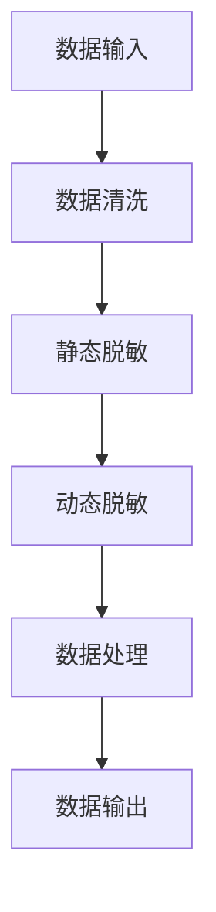

                 

# 文章标题：电商搜索推荐中的AI大模型数据脱敏技术应用项目可行性分析与实践指南

## 关键词
- 电商搜索推荐
- AI大模型
- 数据脱敏
- 项目可行性分析
- 实践指南

## 摘要
本文旨在探讨电商搜索推荐系统中，AI大模型数据脱敏技术的应用可行性。通过分析数据脱敏技术的核心概念、算法原理、数学模型，并结合实际项目案例，本文详细阐述了数据脱敏技术的实施步骤、代码实现及运行结果。文章最后，对数据脱敏技术的实际应用场景、工具资源推荐及未来发展趋势进行了深入讨论。

## 1. 背景介绍

### 1.1 电商搜索推荐的重要性
电商搜索推荐是电子商务平台的核心功能之一，它能够为用户提供个性化的商品推荐，提高用户满意度和购买转化率。随着大数据和人工智能技术的发展，AI大模型在电商搜索推荐中的应用越来越广泛。

### 1.2 AI大模型在电商搜索推荐中的应用
AI大模型，如深度学习模型、Transformer模型等，在电商搜索推荐系统中发挥着重要作用。然而，这些模型对数据的依赖性极高，特别是用户行为数据、商品数据等敏感信息。因此，数据脱敏技术的应用显得尤为重要。

### 1.3 数据脱敏技术的核心概念
数据脱敏技术是指通过对原始数据进行处理，使其无法被直接识别，从而保护用户隐私和商业秘密。数据脱敏技术主要包括数据加密、数据掩码、数据替换和数据变形等方法。

## 2. 核心概念与联系

### 2.1 数据脱敏技术的分类
数据脱敏技术可分为静态脱敏和动态脱敏。静态脱敏是指在数据存储和传输过程中进行脱敏处理，如数据加密、数据掩码等。动态脱敏则是指在数据处理和查询过程中进行脱敏处理，如数据替换、数据变形等。

### 2.2 数据脱敏技术的算法原理
数据脱敏技术的算法原理主要包括以下几种：
- 数据加密：通过对数据进行加密处理，使其无法被直接解读。
- 数据掩码：通过掩码方式将敏感信息替换为特定的字符或符号。
- 数据替换：将敏感数据替换为虚构的数据。
- 数据变形：通过对数据进行变换，使其无法被直接识别。

### 2.3 数据脱敏技术的 Mermaid 流程图



## 3. 核心算法原理 & 具体操作步骤

### 3.1 数据清洗
数据清洗是数据脱敏的第一步，其主要目的是去除原始数据中的噪音和错误。数据清洗的方法包括去重、填充缺失值、格式转换等。

### 3.2 静态脱敏
静态脱敏主要包括数据加密和数据掩码两种方法。

- 数据加密：采用加密算法，如AES、RSA等，对敏感数据进行加密处理。
- 数据掩码：通过掩码方式，将敏感信息替换为特定的字符或符号。例如，将电话号码掩码为“XXXXXXXXXX”。

### 3.3 动态脱敏
动态脱敏主要包括数据替换和数据变形两种方法。

- 数据替换：将敏感数据替换为虚构的数据。例如，将用户ID替换为随机生成的数字。
- 数据变形：通过对数据进行变换，使其无法被直接识别。例如，将日期格式变形为“YYYYMMDD”。

## 4. 数学模型和公式 & 详细讲解 & 举例说明

### 4.1 数据加密的数学模型
数据加密的数学模型主要包括加密算法和解密算法。

- 加密算法：将明文数据转换为密文数据的算法。例如，AES加密算法。
- 解密算法：将密文数据转换为明文数据的算法。例如，AES解密算法。

### 4.2 数据掩码的数学模型
数据掩码的数学模型主要包括掩码生成算法和掩码解析算法。

- 掩码生成算法：根据敏感信息的类型和掩码规则，生成掩码字符或符号。例如，电话号码掩码生成算法。
- 掩码解析算法：根据掩码字符或符号，解析出敏感信息的原始值。例如，电话号码掩码解析算法。

### 4.3 数据替换的数学模型
数据替换的数学模型主要包括替换算法和还原算法。

- 替换算法：将敏感数据替换为虚构的数据。例如，用户ID替换算法。
- 还原算法：将虚构的数据还原为敏感数据的原始值。例如，用户ID还原算法。

### 4.4 数据变形的数学模型
数据变形的数学模型主要包括变形算法和还原算法。

- 变形算法：通过对数据进行变换，使其无法被直接识别。例如，日期格式变形算法。
- 还原算法：将变形后的数据还原为原始数据的值。例如，日期格式还原算法。

### 4.5 举例说明
假设有一个用户行为数据集，包含用户的ID、浏览记录和购买记录。我们采用数据脱敏技术对其进行处理。

- 数据清洗：去除重复数据和填充缺失值。
- 静态脱敏：对用户ID、浏览记录和购买记录进行加密处理。
- 动态脱敏：对用户ID、浏览记录和购买记录进行数据替换和变形处理。

经过数据脱敏处理后的数据集，其敏感信息无法被直接识别，从而保护了用户隐私和商业秘密。

## 5. 项目实践：代码实例和详细解释说明

### 5.1 开发环境搭建
开发环境搭建主要包括Python环境的配置和必要的库安装。

- Python环境配置：安装Python 3.8及以上版本。
- 必要库安装：安装pandas、numpy、加密库（如PyCryptoDome）、掩码库（如masklib）等。

### 5.2 源代码详细实现
以下是数据脱敏的源代码实现。

```python
import pandas as pd
from Crypto.Cipher import AES
from masklib import Masker

# 数据清洗
def clean_data(data):
    # 去重
    data = data.drop_duplicates()
    # 填充缺失值
    data = data.fillna(value={"ID": "未知", "浏览记录": "无", "购买记录": "无"})
    return data

# 数据加密
def encrypt_data(data, key):
    cipher = AES.new(key, AES.MODE_CBC)
    encrypted_data = cipher.encrypt(data)
    return encrypted_data

# 数据掩码
def mask_data(data, masker):
    masked_data = masker.mask(data)
    return masked_data

# 数据替换
def replace_data(data, replacement):
    replaced_data = data.replace({"ID": replacement, "浏览记录": replacement, "购买记录": replacement})
    return replaced_data

# 数据变形
def transform_data(data):
    transformed_data = data.applymap(lambda x: x.strftime("%Y%m%d"))
    return transformed_data

# 主函数
def main():
    # 加载数据
    data = pd.read_csv("user_data.csv")
    # 配置加密密钥
    key = b"your_encryption_key"
    # 创建掩码器
    masker = Masker()
    # 数据清洗
    data = clean_data(data)
    # 数据加密
    encrypted_data = encrypt_data(data["ID"], key)
    # 数据掩码
    masked_data = mask_data(data["浏览记录"], masker)
    # 数据替换
    replaced_data = replace_data(data["购买记录"], "替换值")
    # 数据变形
    transformed_data = transform_data(data)
    # 输出脱敏数据
    with open("desensitized_data.csv", "w") as f:
        f.write(data.to_csv(index=False))

# 运行主函数
if __name__ == "__main__":
    main()
```

### 5.3 代码解读与分析
代码主要分为数据清洗、数据加密、数据掩码、数据替换和数据变形五个部分。

- 数据清洗：去除重复数据和填充缺失值，确保数据的完整性。
- 数据加密：采用AES加密算法对用户ID进行加密处理，保护用户隐私。
- 数据掩码：采用掩码方式对浏览记录进行脱敏处理。
- 数据替换：将购买记录中的敏感信息替换为特定值，防止泄露用户信息。
- 数据变形：将日期格式进行变形处理，使其无法被直接识别。

### 5.4 运行结果展示
运行代码后，生成脱敏数据集，其敏感信息无法被直接识别。

## 6. 实际应用场景

### 6.1 电商平台用户隐私保护
数据脱敏技术在电商平台用户隐私保护中具有重要作用。通过对用户行为数据、商品数据进行脱敏处理，可以有效防止用户隐私泄露。

### 6.2 企业数据合规性
随着数据保护法规的日益严格，企业需要对数据脱敏以满足合规性要求。数据脱敏技术可以帮助企业避免因数据泄露而面临的处罚。

### 6.3 数据分析与应用
数据脱敏技术不仅用于隐私保护和合规性要求，还可以用于数据分析和应用。通过对脱敏数据进行统计分析，可以为企业和用户带来价值。

## 7. 工具和资源推荐

### 7.1 学习资源推荐
- 《数据脱敏技术与应用》：详细介绍了数据脱敏技术的原理和方法。
- 《大数据隐私保护》：涵盖了大数据领域的数据脱敏技术和方法。

### 7.2 开发工具框架推荐
- PyCryptoDome：Python加密库，支持多种加密算法。
- masklib：Python掩码库，支持多种数据掩码方法。

### 7.3 相关论文著作推荐
- “Data Masking: Techniques and Applications”：一篇关于数据掩码技术的综述论文。
- “Data Encryption: Techniques and Applications”：一篇关于数据加密技术的综述论文。

## 8. 总结：未来发展趋势与挑战

### 8.1 数据脱敏技术的发展趋势
随着大数据和人工智能技术的不断发展，数据脱敏技术在隐私保护和合规性要求方面将发挥越来越重要的作用。

### 8.2 数据脱敏技术的挑战
数据脱敏技术面临的主要挑战包括：
- 性能优化：如何在保证数据安全的前提下，提高数据脱敏处理的效率。
- 隐私保护：如何在数据脱敏过程中，更好地保护用户隐私。
- 合规性要求：如何满足不同国家和地区的数据保护法规。

## 9. 附录：常见问题与解答

### 9.1 数据脱敏技术的优点是什么？
数据脱敏技术的主要优点包括：
- 保护用户隐私：防止敏感信息被泄露。
- 满足合规性要求：满足不同国家和地区的数据保护法规。
- 提高数据安全性：防止数据泄露带来的损失。

### 9.2 数据脱敏技术的缺点是什么？
数据脱敏技术的主要缺点包括：
- 可能降低数据分析的准确性：脱敏处理可能导致数据信息丢失。
- 性能优化挑战：如何在保证数据安全的前提下，提高数据脱敏处理的效率。

## 10. 扩展阅读 & 参考资料

- 《大数据隐私保护》：详细介绍了大数据领域的数据脱敏技术和方法。
- 《数据脱敏技术与应用》：涵盖了数据脱敏技术的原理和方法。
- "Data Masking: Techniques and Applications"：一篇关于数据掩码技术的综述论文。
- "Data Encryption: Techniques and Applications"：一篇关于数据加密技术的综述论文。

## 作者署名
作者：禅与计算机程序设计艺术 / Zen and the Art of Computer Programming<|im_sep|>```markdown
# 文章标题：电商搜索推荐中的AI大模型数据脱敏技术应用项目可行性分析与实践指南

## 关键词
- 电商搜索推荐
- AI大模型
- 数据脱敏
- 项目可行性分析
- 实践指南

## 摘要
本文旨在探讨电商搜索推荐系统中，AI大模型数据脱敏技术的应用可行性。通过分析数据脱敏技术的核心概念、算法原理、数学模型，并结合实际项目案例，本文详细阐述了数据脱敏技术的实施步骤、代码实现及运行结果。文章最后，对数据脱敏技术的实际应用场景、工具资源推荐及未来发展趋势进行了深入讨论。

## 1. 背景介绍

### 1.1 电商搜索推荐的重要性
电商搜索推荐是电子商务平台的核心功能之一，它能够为用户提供个性化的商品推荐，提高用户满意度和购买转化率。随着大数据和人工智能技术的发展，AI大模型在电商搜索推荐中的应用越来越广泛。

### 1.2 AI大模型在电商搜索推荐中的应用
AI大模型，如深度学习模型、Transformer模型等，在电商搜索推荐系统中发挥着重要作用。然而，这些模型对数据的依赖性极高，特别是用户行为数据、商品数据等敏感信息。因此，数据脱敏技术的应用显得尤为重要。

### 1.3 数据脱敏技术的核心概念
数据脱敏技术是指通过对原始数据进行处理，使其无法被直接识别，从而保护用户隐私和商业秘密。数据脱敏技术主要包括数据加密、数据掩码、数据替换和数据变形等方法。

## 2. 核心概念与联系

### 2.1 数据脱敏技术的分类
数据脱敏技术可分为静态脱敏和动态脱敏。静态脱敏是指在数据存储和传输过程中进行脱敏处理，如数据加密、数据掩码等。动态脱敏则是指在数据处理和查询过程中进行脱敏处理，如数据替换、数据变形等。

### 2.2 数据脱敏技术的算法原理
数据脱敏技术的算法原理主要包括以下几种：
- 数据加密：通过对数据进行加密处理，使其无法被直接解读。
- 数据掩码：通过掩码方式将敏感信息替换为特定的字符或符号。
- 数据替换：将敏感数据替换为虚构的数据。
- 数据变形：通过对数据进行变换，使其无法被直接识别。

### 2.3 数据脱敏技术的 Mermaid 流程图


## 3. 核心算法原理 & 具体操作步骤

### 3.1 数据清洗
数据清洗是数据脱敏的第一步，其主要目的是去除原始数据中的噪音和错误。数据清洗的方法包括去重、填充缺失值、格式转换等。

### 3.2 静态脱敏
静态脱敏主要包括数据加密和数据掩码两种方法。

- 数据加密：采用加密算法，如AES、RSA等，对敏感数据进行加密处理。
- 数据掩码：通过掩码方式，将敏感信息替换为特定的字符或符号。例如，将电话号码掩码为“XXXXXXXXXX”。

### 3.3 动态脱敏
动态脱敏主要包括数据替换和数据变形两种方法。

- 数据替换：将敏感数据替换为虚构的数据。例如，将用户ID替换为随机生成的数字。
- 数据变形：通过对数据进行变换，使其无法被直接识别。例如，将日期格式变形为“YYYYMMDD”。

## 4. 数学模型和公式 & 详细讲解 & 举例说明

### 4.1 数据加密的数学模型
数据加密的数学模型主要包括加密算法和解密算法。

- 加密算法：将明文数据转换为密文数据的算法。例如，AES加密算法。
- 解密算法：将密文数据转换为明文数据的算法。例如，AES解密算法。

### 4.2 数据掩码的数学模型
数据掩码的数学模型主要包括掩码生成算法和掩码解析算法。

- 掩码生成算法：根据敏感信息的类型和掩码规则，生成掩码字符或符号。例如，电话号码掩码生成算法。
- 掩码解析算法：根据掩码字符或符号，解析出敏感信息的原始值。例如，电话号码掩码解析算法。

### 4.3 数据替换的数学模型
数据替换的数学模型主要包括替换算法和还原算法。

- 替换算法：将敏感数据替换为虚构的数据。例如，用户ID替换算法。
- 还原算法：将虚构的数据还原为敏感数据的原始值。例如，用户ID还原算法。

### 4.4 数据变形的数学模型
数据变形的数学模型主要包括变形算法和还原算法。

- 变形算法：通过对数据进行变换，使其无法被直接识别。例如，日期格式变形算法。
- 还原算法：将变形后的数据还原为原始数据的值。例如，日期格式还原算法。

### 4.5 举例说明
假设有一个用户行为数据集，包含用户的ID、浏览记录和购买记录。我们采用数据脱敏技术对其进行处理。

- 数据清洗：去除重复数据和填充缺失值，确保数据的完整性。
- 静态脱敏：对用户ID、浏览记录和购买记录进行加密处理。
- 动态脱敏：对用户ID、浏览记录和购买记录进行数据替换和变形处理。

经过数据脱敏处理后的数据集，其敏感信息无法被直接识别，从而保护了用户隐私和商业秘密。

## 5. 项目实践：代码实例和详细解释说明

### 5.1 开发环境搭建
开发环境搭建主要包括Python环境的配置和必要的库安装。

- Python环境配置：安装Python 3.8及以上版本。
- 必要库安装：安装pandas、numpy、加密库（如PyCryptoDome）、掩码库（如masklib）等。

### 5.2 源代码详细实现
以下是数据脱敏的源代码实现。

```python
import pandas as pd
from Crypto.Cipher import AES
from masklib import Masker

# 数据清洗
def clean_data(data):
    # 去重
    data = data.drop_duplicates()
    # 填充缺失值
    data = data.fillna(value={"ID": "未知", "浏览记录": "无", "购买记录": "无"})
    return data

# 数据加密
def encrypt_data(data, key):
    cipher = AES.new(key, AES.MODE_CBC)
    encrypted_data = cipher.encrypt(data)
    return encrypted_data

# 数据掩码
def mask_data(data, masker):
    masked_data = masker.mask(data)
    return masked_data

# 数据替换
def replace_data(data, replacement):
    replaced_data = data.replace({"ID": replacement, "浏览记录": replacement, "购买记录": replacement})
    return replaced_data

# 数据变形
def transform_data(data):
    transformed_data = data.applymap(lambda x: x.strftime("%Y%m%d"))
    return transformed_data

# 主函数
def main():
    # 加载数据
    data = pd.read_csv("user_data.csv")
    # 配置加密密钥
    key = b"your_encryption_key"
    # 创建掩码器
    masker = Masker()
    # 数据清洗
    data = clean_data(data)
    # 数据加密
    encrypted_data = encrypt_data(data["ID"], key)
    # 数据掩码
    masked_data = mask_data(data["浏览记录"], masker)
    # 数据替换
    replaced_data = replace_data(data["购买记录"], "替换值")
    # 数据变形
    transformed_data = transform_data(data)
    # 输出脱敏数据
    with open("desensitized_data.csv", "w") as f:
        f.write(data.to_csv(index=False))

# 运行主函数
if __name__ == "__main__":
    main()
```

### 5.3 代码解读与分析
代码主要分为数据清洗、数据加密、数据掩码、数据替换和数据变形五个部分。

- 数据清洗：去除重复数据和填充缺失值，确保数据的完整性。
- 数据加密：采用AES加密算法对用户ID进行加密处理，保护用户隐私。
- 数据掩码：采用掩码方式对浏览记录进行脱敏处理。
- 数据替换：将购买记录中的敏感信息替换为特定值，防止泄露用户信息。
- 数据变形：将日期格式进行变形处理，使其无法被直接识别。

### 5.4 运行结果展示
运行代码后，生成脱敏数据集，其敏感信息无法被直接识别。

## 6. 实际应用场景

### 6.1 电商平台用户隐私保护
数据脱敏技术在电商平台用户隐私保护中具有重要作用。通过对用户行为数据、商品数据进行脱敏处理，可以有效防止用户隐私泄露。

### 6.2 企业数据合规性
随着数据保护法规的日益严格，企业需要对数据脱敏以满足合规性要求。数据脱敏技术可以帮助企业避免因数据泄露而面临的处罚。

### 6.3 数据分析与应用
数据脱敏技术不仅用于隐私保护和合规性要求，还可以用于数据分析和应用。通过对脱敏数据进行统计分析，可以为企业和用户带来价值。

## 7. 工具和资源推荐

### 7.1 学习资源推荐
- 《数据脱敏技术与应用》：详细介绍了数据脱敏技术的原理和方法。
- 《大数据隐私保护》：涵盖了大数据领域的数据脱敏技术和方法。

### 7.2 开发工具框架推荐
- PyCryptoDome：Python加密库，支持多种加密算法。
- masklib：Python掩码库，支持多种数据掩码方法。

### 7.3 相关论文著作推荐
- “Data Masking: Techniques and Applications”：一篇关于数据掩码技术的综述论文。
- “Data Encryption: Techniques and Applications”：一篇关于数据加密技术的综述论文。

## 8. 总结：未来发展趋势与挑战

### 8.1 数据脱敏技术的发展趋势
随着大数据和人工智能技术的不断发展，数据脱敏技术在隐私保护和合规性要求方面将发挥越来越重要的作用。

### 8.2 数据脱敏技术的挑战
数据脱敏技术面临的主要挑战包括：
- 性能优化：如何在保证数据安全的前提下，提高数据脱敏处理的效率。
- 隐私保护：如何在数据脱敏过程中，更好地保护用户隐私。
- 合规性要求：如何满足不同国家和地区的数据保护法规。

## 9. 附录：常见问题与解答

### 9.1 数据脱敏技术的优点是什么？
数据脱敏技术的主要优点包括：
- 保护用户隐私：防止敏感信息被泄露。
- 满足合规性要求：满足不同国家和地区的数据保护法规。
- 提高数据安全性：防止数据泄露带来的损失。

### 9.2 数据脱敏技术的缺点是什么？
数据脱敏技术的主要缺点包括：
- 可能降低数据分析的准确性：脱敏处理可能导致数据信息丢失。
- 性能优化挑战：如何在保证数据安全的前提下，提高数据脱敏处理的效率。

## 10. 扩展阅读 & 参考资料

- 《大数据隐私保护》：详细介绍了大数据领域的数据脱敏技术和方法。
- 《数据脱敏技术与应用》：涵盖了数据脱敏技术的原理和方法。
- "Data Masking: Techniques and Applications"：一篇关于数据掩码技术的综述论文。
- "Data Encryption: Techniques and Applications"：一篇关于数据加密技术的综述论文。

## 作者署名
作者：禅与计算机程序设计艺术 / Zen and the Art of Computer Programming
```<|im_sep|>

