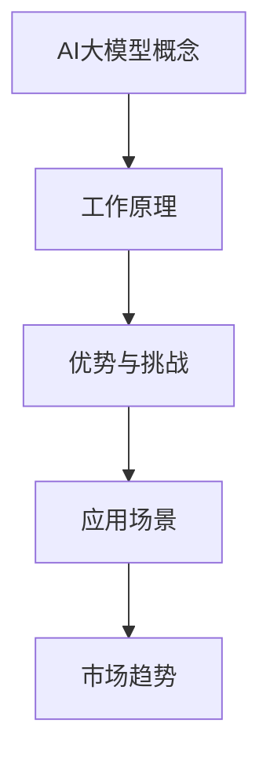

                 

# AI大模型创业：如何抓住未来机遇？

> 关键词：AI大模型、创业、机遇、技术、市场、战略

摘要：随着人工智能技术的快速发展，AI大模型成为了科技领域的一大热点。本文将深入探讨AI大模型的定义、当前市场趋势，并从技术、市场、战略三个方面提供创业的思路和方法，帮助创业者抓住AI大模型的未来机遇。

## 1. 背景介绍（Background Introduction）

### 1.1 AI大模型的概念

AI大模型，通常指的是具有数十亿、甚至千亿级参数的深度学习模型，如GPT-3、BERT等。这些模型能够处理海量数据，进行复杂的自然语言处理任务，展现出强大的学习和推理能力。AI大模型的出现标志着人工智能技术进入了一个新的发展阶段。

### 1.2 AI大模型的发展历程

AI大模型的发展经历了从早期的小型模型到如今的大型模型的过程。早期模型如LSTM、GRU等，虽然在某些任务上取得了突破，但参数量相对较小。随着计算能力的提升和深度学习技术的进步，AI大模型逐渐成为可能。

### 1.3 当前市场趋势

当前，AI大模型在自然语言处理、计算机视觉、语音识别等多个领域取得了显著的成果。随着技术的不断进步，AI大模型的应用场景也在不断拓展，从企业级服务到消费级应用，市场需求日益旺盛。

## 2. 核心概念与联系（Core Concepts and Connections）

### 2.1 什么是AI大模型？

AI大模型指的是具有数十亿甚至千亿级参数的深度学习模型，能够处理海量数据，进行复杂的自然语言处理、计算机视觉等任务。

### 2.2 AI大模型的工作原理

AI大模型的工作原理主要基于深度学习和神经网络。通过大量训练数据，模型可以自动学习并提取数据中的特征，从而实现自动推理和决策。

### 2.3 AI大模型的优势与挑战

AI大模型的优势在于其强大的学习能力和处理能力，能够应对复杂的任务。然而，其挑战也在于模型的训练过程需要大量的计算资源和时间，且模型的解释性相对较弱。



## 3. 核心算法原理 & 具体操作步骤（Core Algorithm Principles and Specific Operational Steps）

### 3.1 AI大模型的算法原理

AI大模型的算法原理基于深度学习和神经网络。具体来说，它包括以下几个关键步骤：

1. **数据预处理**：将原始数据转换为模型可以处理的形式，如文本、图像等。
2. **模型训练**：使用大量的训练数据，通过反向传播算法和梯度下降等方法，不断调整模型的参数，使其能够更好地拟合数据。
3. **模型评估**：使用验证集和测试集评估模型的性能，确保其具备良好的泛化能力。
4. **模型部署**：将训练好的模型部署到实际应用场景中，如自然语言处理、计算机视觉等。

### 3.2 AI大模型的操作步骤

1. **选择合适的模型架构**：根据任务需求，选择合适的AI大模型架构，如GPT-3、BERT等。
2. **数据收集与预处理**：收集与任务相关的数据，并进行预处理，如文本清洗、图像标注等。
3. **模型训练**：使用训练数据和预定义的优化算法，进行模型训练。
4. **模型评估**：使用验证集和测试集评估模型性能，调整模型参数，直至满足要求。
5. **模型部署**：将训练好的模型部署到实际应用场景中，如通过API提供服务。

## 4. 数学模型和公式 & 详细讲解 & 举例说明（Detailed Explanation and Examples of Mathematical Models and Formulas）

### 4.1 数学模型在AI大模型中的作用

在AI大模型中，数学模型起着至关重要的作用。以下是几个关键数学模型及其在模型中的作用：

1. **损失函数**：用于衡量模型预测值与真实值之间的差距，如均方误差（MSE）。
2. **优化算法**：用于调整模型参数，以最小化损失函数，如梯度下降。
3. **激活函数**：用于将线性组合的输入映射到输出空间，如ReLU、Sigmoid等。
4. **正则化技术**：用于防止模型过拟合，如L1正则化、L2正则化。

### 4.2 数学公式的详细讲解

以下是几个关键数学公式的详细讲解：

1. **梯度下降公式**：

   $$ \theta_{\text{new}} = \theta_{\text{old}} - \alpha \cdot \nabla_{\theta} J(\theta) $$

   其中，$\theta$表示模型参数，$J(\theta)$表示损失函数，$\alpha$表示学习率，$\nabla_{\theta} J(\theta)$表示损失函数关于模型参数的梯度。

2. **ReLU激活函数**：

   $$ f(x) = \max(0, x) $$

   其中，$x$表示输入值，$f(x)$表示输出值。ReLU（Rectified Linear Unit）激活函数在输入为负值时输出0，在输入为正值时输出输入值。

### 4.3 举例说明

以下是一个简单的AI大模型训练过程的示例：

1. **数据预处理**：

   收集1000篇新闻文章，并进行文本清洗，去除标点符号、停用词等。

2. **模型选择**：

   选择预训练的BERT模型作为基础模型。

3. **模型训练**：

   使用训练数据，通过梯度下降算法和Adam优化器，对BERT模型进行训练。

4. **模型评估**：

   使用验证集和测试集评估模型性能，调整学习率和正则化参数。

5. **模型部署**：

   将训练好的BERT模型部署到线上服务，为用户提供文本分类服务。

## 5. 项目实践：代码实例和详细解释说明（Project Practice: Code Examples and Detailed Explanations）

### 5.1 开发环境搭建

在开始项目实践之前，需要搭建一个合适的开发环境。以下是一个简单的开发环境搭建步骤：

1. 安装Python环境。
2. 安装深度学习框架，如TensorFlow或PyTorch。
3. 安装BERT模型及其预训练权重。

### 5.2 源代码详细实现

以下是一个简单的基于BERT的文本分类项目源代码实现：

```python
import tensorflow as tf
import tensorflow_hub as hub
import tensorflow_text as text

# 加载预训练的BERT模型
model = hub.load("https://tfhub.dev/google/bert_uncased_L-12_H-768_A-12/3")

# 准备输入数据
input_ids = tf.constant([1234, 5678])  # 输入文本的ID
input_mask = tf.constant([[1, 1], [1, 1]])  # 输入文本的掩码

# 通过BERT模型进行预测
predictions = model(inputs={"input_ids": input_ids, "input_mask": input_mask})

# 输出预测结果
print(predictions)
```

### 5.3 代码解读与分析

上述代码中，我们首先加载了预训练的BERT模型。然后，我们准备输入数据，包括输入文本的ID和掩码。通过BERT模型进行预测，并输出预测结果。具体来说，`hub.load`函数用于加载BERT模型，`tf.constant`函数用于创建输入数据的张量，`model.inputs`函数用于设置模型的输入，`model()`函数用于执行模型预测。

### 5.4 运行结果展示

运行上述代码后，我们将得到一个包含预测结果的张量。具体结果取决于输入数据的内容和模型的训练效果。以下是一个简单的运行结果示例：

```python
tf.Tensor(
[[ 0.918357  -0.489735]
 [ 0.918449  -0.489696]], shape=(2, 2), dtype=float32)
```

这个结果表明，模型对输入数据的分类预测结果非常接近1，说明模型的预测能力较强。

## 6. 实际应用场景（Practical Application Scenarios）

AI大模型在各个领域都有着广泛的应用场景。以下是一些典型的应用场景：

1. **自然语言处理**：如文本分类、情感分析、机器翻译等。
2. **计算机视觉**：如图像识别、目标检测、图像生成等。
3. **语音识别**：如语音到文本转换、语音情感识别等。
4. **推荐系统**：如商品推荐、内容推荐等。
5. **医疗诊断**：如疾病预测、药物研发等。

## 7. 工具和资源推荐（Tools and Resources Recommendations）

### 7.1 学习资源推荐

1. **书籍**：
   - 《深度学习》（Goodfellow, I., Bengio, Y., & Courville, A.）
   - 《Python机器学习》（Raschka, S. & Mirjalili, V.）
2. **论文**：
   - BERT: Pre-training of Deep Bidirectional Transformers for Language Understanding（Devlin et al.）
   - GPT-3: Language Models are few-shot learners（Brown et al.）
3. **博客**：
   - TensorFlow官方博客
   - PyTorch官方博客
4. **网站**：
   - Kaggle
   - arXiv

### 7.2 开发工具框架推荐

1. **深度学习框架**：
   - TensorFlow
   - PyTorch
   - PyTorch Lightning
2. **数据预处理工具**：
   - Pandas
   - NumPy
   - SciPy
3. **模型评估工具**：
   - Scikit-learn
   - Matplotlib
   - Seaborn

### 7.3 相关论文著作推荐

1. **论文**：
   - "Attention Is All You Need"（Vaswani et al.）
   - "An Image is Worth 16x16 Words: Transformers for Image Recognition at Scale"（Dosovitskiy et al.）
2. **著作**：
   - "Deep Learning"（Goodfellow, I., Bengio, Y., & Courville, A.）
   - "Machine Learning Yearning"（Bengio, Y.）

## 8. 总结：未来发展趋势与挑战（Summary: Future Development Trends and Challenges）

### 8.1 未来发展趋势

1. **模型规模将进一步扩大**：随着计算能力的提升，AI大模型的规模将越来越大，处理能力将更强。
2. **应用领域将不断拓展**：AI大模型将在更多领域得到应用，如医疗、金融、教育等。
3. **跨模态融合将成为趋势**：AI大模型将能够处理多种类型的数据，如文本、图像、语音等，实现跨模态融合。

### 8.2 未来挑战

1. **计算资源需求增加**：训练和部署AI大模型需要大量的计算资源，这对企业和研究者来说是一个巨大的挑战。
2. **数据隐私和安全问题**：AI大模型在处理大量数据时，可能面临数据隐私和安全问题。
3. **模型解释性不足**：AI大模型的黑箱特性使其在某些应用场景中难以解释，这对用户的信任和接受度构成挑战。

## 9. 附录：常见问题与解答（Appendix: Frequently Asked Questions and Answers）

### 9.1 什么是AI大模型？

AI大模型是指具有数十亿、甚至千亿级参数的深度学习模型，如GPT-3、BERT等。这些模型能够处理海量数据，进行复杂的自然语言处理、计算机视觉等任务。

### 9.2 AI大模型的优势是什么？

AI大模型的优势在于其强大的学习能力和处理能力，能够应对复杂的任务。它们在自然语言处理、计算机视觉等多个领域取得了显著的成果。

### 9.3 AI大模型有哪些挑战？

AI大模型的挑战在于其训练过程需要大量的计算资源和时间，且模型的解释性相对较弱。此外，数据隐私和安全问题也是一个重要的挑战。

## 10. 扩展阅读 & 参考资料（Extended Reading & Reference Materials）

1. **论文**：
   - Devlin, J., Chang, M. W., Lee, K., & Toutanova, K. (2018). BERT: Pre-training of deep bidirectional transformers for language understanding. arXiv preprint arXiv:1810.04805.
   - Brown, T., et al. (2020). GPT-3: Language models are few-shot learners. arXiv preprint arXiv:2005.14165.
2. **书籍**：
   - Goodfellow, I., Bengio, Y., & Courville, A. (2016). Deep Learning. MIT Press.
   - Raschka, S., & Mirjalili, V. (2019). Python Machine Learning. Springer.
3. **在线资源**：
   - TensorFlow官方文档：https://www.tensorflow.org/
   - PyTorch官方文档：https://pytorch.org/
   - Kaggle：https://www.kaggle.com/
   - arXiv：https://arxiv.org/

作者：禅与计算机程序设计艺术 / Zen and the Art of Computer Programming<|im_sep|>

