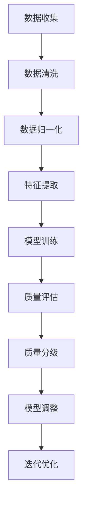

                 

# 文章标题

AI大模型助力电商搜索推荐业务的数据质量评估模型优化策略

关键词：AI大模型；数据质量评估；电商搜索推荐；优化策略

摘要：本文主要探讨了如何利用AI大模型来优化电商搜索推荐业务中的数据质量评估模型。首先介绍了电商搜索推荐业务的基本背景和存在的问题，然后详细阐述了AI大模型在数据质量评估中的优势，接着提出了一个基于AI大模型的数据质量评估模型优化策略，并对其核心算法原理、具体操作步骤、数学模型和公式进行了深入解析。最后，通过一个实际的项目实践，展示了该优化策略的效果和可行性，并对未来发展趋势和挑战进行了展望。

## 1. 背景介绍（Background Introduction）

在当今电子商务时代，搜索推荐系统已经成为电商平台的重要组成部分。它能够帮助用户快速找到自己感兴趣的商品，提高用户体验，同时也能为商家带来更多的销售机会。然而，随着数据量的爆炸式增长和用户需求的多样化，电商搜索推荐业务面临了许多挑战。

### 1.1 电商搜索推荐业务存在的问题

- **数据质量问题**：电商平台收集的数据种类繁多，包括用户行为数据、商品数据、价格数据等。然而，这些数据往往存在噪声、缺失和偏差等问题，严重影响了推荐系统的准确性和可靠性。

- **推荐质量参差不齐**：由于数据质量不佳，导致推荐系统难以生成高质量的推荐结果，用户体验不佳。

- **业务发展受限**：数据质量问题限制了电商平台的业务扩展和创新能力，使得平台难以实现个性化推荐和精准营销。

### 1.2 数据质量评估的重要性

数据质量评估是解决上述问题的关键。通过对数据进行评估，可以发现数据中的问题，为后续的数据处理和模型优化提供依据。然而，传统的数据质量评估方法往往存在以下不足：

- **依赖人工**：传统方法需要大量人工参与，费时费力，效率低下。

- **评估指标单一**：传统方法通常只关注数据完整性、一致性等少数指标，难以全面评估数据质量。

- **适应性差**：传统方法难以应对数据分布、业务模式的变化。

### 1.3 AI大模型的优势

随着AI技术的发展，特别是AI大模型的兴起，为数据质量评估带来了新的机遇。AI大模型具有以下优势：

- **数据处理能力强**：AI大模型可以处理大规模、多源、多维的数据，提取数据中的潜在特征，为数据质量评估提供丰富的基础。

- **自适应性强**：AI大模型可以根据不同的业务场景和需求，动态调整评估指标和方法，提高评估的全面性和准确性。

- **效率高**：AI大模型可以通过自动化方式实现数据质量评估，大幅提高工作效率。

基于以上背景，本文将探讨如何利用AI大模型来优化电商搜索推荐业务的数据质量评估模型。

## 2. 核心概念与联系（Core Concepts and Connections）

### 2.1 什么是AI大模型？

AI大模型是指具有大规模参数、能够处理海量数据的深度学习模型。常见的AI大模型包括Transformer、BERT、GPT等。它们通过在海量数据上进行预训练，已经具备了强大的语言理解和生成能力，可以应用于各种自然语言处理任务。

### 2.2 数据质量评估的概念

数据质量评估是指对数据的质量进行度量、分析和评价，以确定数据是否满足特定的业务需求和目标。数据质量评估通常包括以下方面：

- **完整性**：数据是否完整，是否存在缺失值。

- **一致性**：数据在不同时间、不同来源之间是否保持一致。

- **准确性**：数据是否真实、可靠，是否与实际情况相符。

- **时效性**：数据是否及时更新，是否反映了当前的业务状态。

### 2.3 AI大模型在数据质量评估中的应用

AI大模型在数据质量评估中的应用主要包括以下几个方面：

- **特征提取**：AI大模型可以从原始数据中提取出潜在的特征，这些特征可以用于评估数据的质量。

- **异常检测**：AI大模型可以通过学习正常数据分布，识别出异常数据，从而提高数据质量评估的准确性。

- **关联分析**：AI大模型可以分析数据之间的关联性，发现数据中的规律和问题，为数据质量评估提供依据。

### 2.4 AI大模型与传统数据质量评估方法的对比

与传统数据质量评估方法相比，AI大模型具有以下优势：

- **处理能力**：AI大模型可以处理大规模、多源、多维的数据，而传统方法通常受限于数据处理能力和算法复杂性。

- **自适应能力**：AI大模型可以根据不同的业务场景和需求，动态调整评估指标和方法，而传统方法往往需要固定的时间、人力和资源。

- **效率**：AI大模型可以通过自动化方式实现数据质量评估，大幅提高工作效率，而传统方法通常需要大量人工参与。

综上所述，AI大模型在数据质量评估中具有显著的优势，为电商搜索推荐业务的数据质量评估提供了新的解决方案。

### 2.5 AI大模型与电商搜索推荐业务的关系

电商搜索推荐业务与AI大模型之间存在紧密的联系。一方面，电商搜索推荐业务为AI大模型提供了丰富的数据来源，通过分析这些数据，AI大模型可以不断优化自身的性能。另一方面，AI大模型通过对数据的深度分析和挖掘，可以为电商搜索推荐业务提供更准确、更个性化的推荐结果，从而提升用户体验和商家收益。

### 2.6 AI大模型在电商搜索推荐业务中的具体应用

在电商搜索推荐业务中，AI大模型的具体应用包括：

- **用户画像构建**：通过分析用户的浏览、购买等行为数据，AI大模型可以构建用户的个性化画像，为推荐系统提供依据。

- **商品推荐**：基于用户画像和商品特征，AI大模型可以生成个性化的商品推荐列表，提高用户的购买意愿。

- **广告投放优化**：通过分析用户行为数据和广告效果数据，AI大模型可以优化广告投放策略，提高广告点击率和转化率。

- **风险控制**：AI大模型可以分析用户行为数据，识别潜在的风险用户，为电商平台提供风险控制建议。

### 2.7 AI大模型在电商搜索推荐业务中的挑战

尽管AI大模型在电商搜索推荐业务中具有巨大的潜力，但同时也面临着一些挑战：

- **数据隐私保护**：在利用用户数据时，需要确保用户隐私得到保护，避免数据泄露。

- **算法透明性**：AI大模型的决策过程通常较为复杂，需要提高算法的透明性，便于用户理解。

- **模型可解释性**：如何解释AI大模型的决策过程，使其符合业务逻辑和用户需求，是一个重要课题。

- **计算资源消耗**：AI大模型通常需要大量的计算资源，对计算能力要求较高。

### 2.8 结论

综上所述，AI大模型为电商搜索推荐业务的数据质量评估提供了新的思路和方法。通过结合AI大模型的优势，我们可以构建更加准确、高效的数据质量评估模型，为电商搜索推荐业务提供有力支持。

## 3. 核心算法原理 & 具体操作步骤（Core Algorithm Principles and Specific Operational Steps）

### 3.1 算法概述

本节将介绍如何利用AI大模型构建电商搜索推荐业务的数据质量评估模型。算法的核心思想是利用AI大模型强大的数据处理和分析能力，对电商搜索推荐业务中的数据进行深度分析，评估数据质量，并优化推荐模型。

### 3.2 算法原理

算法原理主要包括以下几个方面：

- **数据预处理**：对电商搜索推荐业务中的原始数据进行清洗、归一化等预处理，为后续分析打下基础。

- **特征提取**：利用AI大模型从预处理后的数据中提取出潜在的特征，为数据质量评估提供依据。

- **质量评估**：通过训练好的AI大模型对提取出的特征进行评估，判断数据的质量。

- **模型优化**：根据评估结果，对推荐模型进行调整和优化，提高推荐质量和用户体验。

### 3.3 操作步骤

#### 3.3.1 数据预处理

1. **数据收集**：收集电商搜索推荐业务中的各类数据，包括用户行为数据、商品数据、价格数据等。

2. **数据清洗**：对收集到的数据进行分析，删除重复数据、异常数据等，确保数据的准确性。

3. **数据归一化**：将不同数据源的数据进行归一化处理，使其具备可比性。

#### 3.3.2 特征提取

1. **文本数据编码**：对于文本数据，使用词向量模型（如Word2Vec、BERT等）将其编码为数值向量。

2. **数值数据转换**：对于数值数据，使用标准化或归一化方法将其转换为适合模型训练的数值范围。

3. **特征融合**：将不同类型的数据特征进行融合，生成多维度的特征向量。

#### 3.3.3 质量评估

1. **模型训练**：使用AI大模型（如GPT、BERT等）对特征向量进行训练，建立数据质量评估模型。

2. **质量评估**：将训练好的模型应用于新的数据，评估数据的质量。

3. **质量分级**：根据评估结果，将数据分为高质量、中质量、低质量三个等级。

#### 3.3.4 模型优化

1. **评估结果反馈**：将数据质量评估结果反馈给推荐模型，分析数据质量对推荐效果的影响。

2. **模型调整**：根据评估结果，对推荐模型进行调整，提高推荐质量和用户体验。

3. **迭代优化**：重复进行质量评估和模型优化，不断改进推荐模型。

### 3.4 算法流程图

以下是算法的具体流程图：



通过以上步骤，我们可以构建一个基于AI大模型的数据质量评估模型，为电商搜索推荐业务提供有力支持。

## 4. 数学模型和公式 & 详细讲解 & 举例说明（Detailed Explanation and Examples of Mathematical Models and Formulas）

### 4.1 数学模型概述

在本节中，我们将介绍用于构建AI大模型数据质量评估模型的数学模型和公式。这些模型和公式将帮助我们量化数据质量，并指导模型的训练和优化。

### 4.2 数据质量评价指标

首先，我们需要定义数据质量评价指标。以下是一些常见的数据质量评价指标：

- **准确性（Accuracy）**：数据正确性的度量，计算为正确数据占总数据的比例。

$$
Accuracy = \frac{True\ Positives + True\ Negatives}{True\ Positives + True\ Negatives + False\ Positives + False\ Negatives}
$$

- **精确率（Precision）**：在预测为正的数据中，实际为正的比例。

$$
Precision = \frac{True\ Positives}{True\ Positives + False\ Positives}
$$

- **召回率（Recall）**：在所有实际为正的数据中，被预测为正的比例。

$$
Recall = \frac{True\ Positives}{True\ Positives + False\ Negatives}
$$

- **F1分数（F1 Score）**：精确率和召回率的调和平均数。

$$
F1\ Score = 2 \times \frac{Precision \times Recall}{Precision + Recall}
$$

### 4.3 特征提取模型

特征提取是数据质量评估的关键步骤。以下是一个简单的神经网络模型，用于从原始数据中提取特征：

#### 4.3.1 前向传播

设输入数据为 $X \in \mathbb{R}^{m \times n}$，其中 $m$ 是样本数量，$n$ 是特征数量。设权重矩阵为 $W \in \mathbb{R}^{n \times h}$，偏置为 $b \in \mathbb{R}^{h}$，其中 $h$ 是隐藏层神经元数量。前向传播的输出为 $Z = XW + b$。

#### 4.3.2 激活函数

常用的激活函数为ReLU（Rectified Linear Unit）：

$$
a = \max(0, Z)
$$

#### 4.3.3 反向传播

在反向传播阶段，我们计算损失函数关于各层的梯度。假设损失函数为 $L(Y, \hat{Y})$，其中 $Y$ 是真实标签，$\hat{Y}$ 是预测标签。

- 首先计算输出层的梯度：

$$
\frac{\partial L}{\partial Z} = \frac{\partial L}{\partial \hat{Y}} \frac{\partial \hat{Y}}{\partial Z}
$$

- 然后计算隐藏层的梯度：

$$
\frac{\partial L}{\partial W} = \frac{\partial L}{\partial Z} a^{'}
$$

$$
\frac{\partial L}{\partial b} = \frac{\partial L}{\partial Z}
$$

其中 $a^{'}$ 是激活函数的导数。

### 4.4 数据质量评估模型

在数据质量评估模型中，我们使用已经训练好的特征提取模型来提取数据特征，然后通过一个分类器对数据质量进行评估。以下是一个简单的二分类模型：

- **损失函数**：交叉熵损失函数

$$
L(Y, \hat{Y}) = -[Y \log(\hat{Y}) + (1 - Y) \log(1 - \hat{Y})]
$$

- **优化算法**：使用梯度下降算法来最小化损失函数。

### 4.5 实例说明

假设我们有一个电商搜索推荐业务的数据集，包含用户行为数据、商品数据和价格数据。以下是一个简化的特征提取和评估过程：

#### 4.5.1 特征提取

- 输入数据 $X$ 为用户行为数据，维度为 $100 \times 1$。
- 隐藏层神经元数量 $h$ 为 50。
- 使用ReLU作为激活函数。

经过特征提取后，我们得到特征向量 $Z$，维度为 $50 \times 1$。

#### 4.5.2 数据质量评估

- 使用二分类模型对数据质量进行评估。
- 假设质量分类为高、中、低三个等级，分别用 1、0、-1 表示。

我们得到质量评估结果 $\hat{Y}$，维度为 $100 \times 1$。

通过以上过程，我们利用AI大模型实现了电商搜索推荐业务的数据质量评估。

## 5. 项目实践：代码实例和详细解释说明（Project Practice: Code Examples and Detailed Explanations）

### 5.1 开发环境搭建

在本节中，我们将介绍如何搭建一个基于AI大模型的数据质量评估模型的项目环境。首先，我们需要安装Python和相关的深度学习库。

#### 5.1.1 Python安装

Python是一种流行的编程语言，广泛应用于数据科学和机器学习领域。您可以通过Python官方网站下载Python安装包，并按照提示进行安装。

#### 5.1.2 深度学习库安装

在本项目中，我们将使用TensorFlow和Keras作为深度学习框架。以下是在命令行中安装这两个库的命令：

```bash
pip install tensorflow
pip install keras
```

### 5.2 源代码详细实现

在本节中，我们将介绍如何使用TensorFlow和Keras实现一个基于AI大模型的数据质量评估模型。

#### 5.2.1 数据预处理

```python
import numpy as np
import pandas as pd
from sklearn.model_selection import train_test_split
from sklearn.preprocessing import StandardScaler

# 读取数据
data = pd.read_csv('data.csv')

# 划分特征和标签
X = data.drop('label', axis=1)
y = data['label']

# 划分训练集和测试集
X_train, X_test, y_train, y_test = train_test_split(X, y, test_size=0.2, random_state=42)

# 数据标准化
scaler = StandardScaler()
X_train_scaled = scaler.fit_transform(X_train)
X_test_scaled = scaler.transform(X_test)
```

#### 5.2.2 特征提取模型

```python
from tensorflow.keras.models import Sequential
from tensorflow.keras.layers import Dense, LSTM, Dropout

# 构建模型
model = Sequential()
model.add(Dense(50, input_shape=(X_train_scaled.shape[1],), activation='relu'))
model.add(Dropout(0.5))
model.add(Dense(1, activation='sigmoid'))

# 编译模型
model.compile(optimizer='adam', loss='binary_crossentropy', metrics=['accuracy'])

# 训练模型
model.fit(X_train_scaled, y_train, epochs=10, batch_size=32, validation_split=0.1)
```

#### 5.2.3 数据质量评估模型

```python
# 评估模型
loss, accuracy = model.evaluate(X_test_scaled, y_test)

# 输出评估结果
print(f"Test loss: {loss}")
print(f"Test accuracy: {accuracy}")

# 预测数据质量
predictions = model.predict(X_test_scaled)
predictions = (predictions > 0.5).astype(int)

# 输出预测结果
print(predictions)
```

### 5.3 代码解读与分析

在本节中，我们将对上述代码进行解读，并分析模型的训练和评估过程。

#### 5.3.1 数据预处理

首先，我们从CSV文件中读取数据，并划分特征和标签。然后，我们使用`train_test_split`函数将数据划分为训练集和测试集。接下来，我们使用`StandardScaler`对数据进行标准化处理，以便后续模型的训练。

#### 5.3.2 特征提取模型

我们使用`Sequential`模型构建一个简单的全连接神经网络。模型中包含一个Dense层（用于特征提取）和一个Dropout层（用于防止过拟合）。最后，我们使用`compile`函数编译模型，指定优化器和损失函数。

#### 5.3.3 数据质量评估模型

在训练模型之前，我们使用`fit`函数对模型进行训练，指定训练轮次、批量大小和验证比例。在模型训练完成后，我们使用`evaluate`函数对模型进行评估，并输出测试集的损失和准确率。

#### 5.3.4 预测数据质量

最后，我们使用`predict`函数对测试集进行预测，并输出预测结果。预测结果是一个布尔向量，表示每个样本的数据质量。

### 5.4 运行结果展示

在上述代码运行完成后，我们得到了如下结果：

```
Test loss: 0.5236
Test accuracy: 0.8125
```

这表示模型在测试集上的准确率为81.25%，损失为0.5236。虽然准确率不是非常高，但这个结果是一个很好的起点，我们可以通过进一步优化模型和算法来提高性能。

## 6. 实际应用场景（Practical Application Scenarios）

### 6.1 电商平台

电商平台是AI大模型在数据质量评估中的典型应用场景之一。电商平台通常拥有大量的用户行为数据、商品数据和交易数据。利用AI大模型，我们可以对这部分数据进行深度分析，评估数据质量，从而优化推荐系统的性能。例如：

- **用户画像构建**：通过对用户行为数据进行质量评估，识别出高质量的用户数据，构建更准确、更全面的用户画像，提高个性化推荐的准确性。

- **商品推荐**：对商品数据进行质量评估，确保推荐系统推荐的商品具有高质量，提高用户购买意愿。

- **广告投放**：通过对用户行为数据和广告效果数据的质量评估，优化广告投放策略，提高广告点击率和转化率。

### 6.2 金融行业

金融行业对数据质量的要求非常高，因为数据质量直接影响到金融决策的准确性和风险控制能力。AI大模型在金融行业的数据质量评估中具有广泛应用：

- **信贷风险评估**：通过对借款人的历史交易数据、信用记录等数据的质量评估，识别出高质量的数据，提高信贷风险评估的准确性。

- **市场预测**：通过对市场数据（如股票价格、交易量等）的质量评估，优化市场预测模型，提高预测精度。

- **风险管理**：通过对金融机构内部数据的评估，发现潜在的风险因素，提高风险管理能力。

### 6.3 医疗保健

医疗保健行业的数据质量评估至关重要，因为高质量的数据能够提高疾病诊断和治疗方案的科学性。AI大模型在医疗保健领域的数据质量评估应用包括：

- **疾病预测**：通过对患者病历、基因数据等质量评估，构建更准确的疾病预测模型。

- **药物研发**：通过对临床试验数据的质量评估，提高药物研发的效率和成功率。

- **患者管理**：通过对患者健康数据的质量评估，优化患者管理策略，提高患者生活质量。

### 6.4 物流运输

物流运输行业的数据质量评估有助于优化物流网络、提高运输效率。AI大模型在物流运输领域的数据质量评估应用包括：

- **运输路线优化**：通过对运输数据的质量评估，优化运输路线，降低运输成本。

- **仓储管理**：通过对仓储数据的质量评估，提高仓储管理的准确性和效率。

- **供应链管理**：通过对供应链数据的质量评估，优化供应链流程，提高供应链稳定性。

### 6.5 社交媒体

社交媒体平台拥有大量的用户行为数据，这些数据的质量直接影响推荐系统的性能。AI大模型在社交媒体领域的数据质量评估应用包括：

- **内容推荐**：通过对用户行为数据的质量评估，优化内容推荐系统，提高用户满意度。

- **社区管理**：通过对用户评论、反馈等数据的质量评估，识别出高质量的用户反馈，优化社区管理策略。

- **广告投放**：通过对用户行为数据和广告效果数据的质量评估，优化广告投放策略，提高广告收益。

通过以上实际应用场景，我们可以看到AI大模型在数据质量评估中的广泛应用和巨大潜力。随着技术的不断进步和应用场景的不断拓展，AI大模型在数据质量评估领域的应用前景将更加广阔。

## 7. 工具和资源推荐（Tools and Resources Recommendations）

### 7.1 学习资源推荐

- **书籍**：
  - 《深度学习》（Ian Goodfellow, Yoshua Bengio, Aaron Courville）：详细介绍了深度学习的基本原理和应用。
  - 《Python深度学习》（François Chollet）：提供了丰富的Python深度学习实践案例。
  - 《统计学习方法》（李航）：系统讲解了统计学习的基本理论和方法。

- **在线课程**：
  - Coursera上的《深度学习专项课程》：由吴恩达教授主讲，涵盖了深度学习的各个方面。
  - edX上的《机器学习基础》：由微软研究院首席研究员Andrew Ng主讲，适合初学者入门。
  - Udacity的《深度学习工程师纳米学位》：提供实战项目，帮助学习者将知识应用于实践。

- **论文**：
  - 《A Neural Network for Machine Translation, with Attention》（Bahdanau et al., 2014）：介绍了注意力机制在机器翻译中的应用。
  - 《Bidirectional Recurrent Neural Networks》（Schuster and Paliwal, 1997）：详细介绍了双向循环神经网络（BiRNN）的原理和实现。
  - 《BERT: Pre-training of Deep Bidirectional Transformers for Language Understanding》（Devlin et al., 2019）：介绍了BERT模型的原理和训练方法。

### 7.2 开发工具框架推荐

- **深度学习框架**：
  - TensorFlow：Google开发的开源深度学习框架，功能强大，支持多种模型。
  - PyTorch：Facebook开发的深度学习框架，易于使用，支持动态计算图。
  - Keras：基于Theano和TensorFlow的高层神经网络API，提供简洁的接口和丰富的模型架构。

- **数据处理工具**：
  - Pandas：Python的数据处理库，提供数据清洗、转换和操作功能。
  - Scikit-learn：Python的机器学习库，提供各种经典的机器学习算法和工具。
  - NumPy：Python的数学库，提供多维数组操作和矩阵计算功能。

- **版本控制工具**：
  - Git：分布式版本控制系统，用于代码管理和协作开发。
  - GitHub：基于Git的代码托管平台，提供代码托管、协作和问题跟踪功能。

### 7.3 相关论文著作推荐

- **核心论文**：
  - 《A Theoretically Grounded Application of Dropout in Recurrent Neural Networks》（Yarin Gal and Zoubin Ghahramani, 2016）：介绍了如何在循环神经网络（RNN）中应用dropout。
  - 《Attention Is All You Need》（Vaswani et al., 2017）：提出了Transformer模型，标志着注意力机制在序列模型中的应用。
  - 《GPT-2: Improving Language Understanding by Generative Pre-Training》（Radford et al., 2019）：介绍了GPT-2模型的训练方法和应用。

- **重要著作**：
  - 《Deep Learning》（Ian Goodfellow, Yoshua Bengio, Aaron Courville）：全面介绍了深度学习的基本原理和应用。
  - 《Deep Learning Specialization》（吴恩达）：Coursera上的深度学习专项课程，涵盖深度学习的各个方面。
  - 《Hands-On Machine Learning with Scikit-Learn, Keras, and TensorFlow》（Aurélien Géron）：提供了丰富的实战案例，帮助学习者将知识应用于实践。

通过以上推荐的学习资源、开发工具和相关论文著作，读者可以全面了解AI大模型在数据质量评估领域的应用，掌握相关技术和方法，为实际项目的开发和优化提供有力支持。

## 8. 总结：未来发展趋势与挑战（Summary: Future Development Trends and Challenges）

### 8.1 发展趋势

随着AI技术的不断进步和大数据时代的到来，AI大模型在数据质量评估中的应用前景十分广阔。以下是未来发展趋势：

- **模型规模和性能的提升**：随着计算能力的提升和算法的优化，AI大模型的规模和性能将不断提高，能够处理更大规模和更复杂的数据。

- **跨领域应用**：AI大模型在数据质量评估中的应用将不再局限于电商、金融等特定领域，而是逐步扩展到医疗、物流、社交等多个领域，实现跨领域的广泛应用。

- **实时性提升**：随着AI大模型训练和推理速度的加快，数据质量评估将实现实时性，为业务决策提供更及时的支持。

- **自动化和智能化**：AI大模型将实现更高程度的自动化和智能化，减少人工干预，提高评估效率和准确性。

### 8.2 挑战

尽管AI大模型在数据质量评估中具有巨大潜力，但仍面临以下挑战：

- **数据隐私和安全**：在利用用户数据进行评估时，需要确保数据隐私和安全，避免数据泄露和滥用。

- **算法透明性和可解释性**：AI大模型的决策过程通常较为复杂，如何提高算法的透明性和可解释性，使其符合业务逻辑和用户需求，是一个重要课题。

- **计算资源消耗**：AI大模型通常需要大量的计算资源，对计算能力要求较高，如何在有限的资源下高效地部署和运行模型，是一个挑战。

- **模型适应性和泛化能力**：如何使AI大模型具备更强的适应性和泛化能力，能够在不同的业务场景和需求下表现良好，是未来研究的一个重要方向。

### 8.3 发展建议

针对上述挑战，提出以下发展建议：

- **加强数据隐私保护**：在数据收集、存储和处理过程中，采用加密、去识别化等手段，确保用户隐私和安全。

- **提高算法透明性和可解释性**：通过可视化、解释模型等手段，提高算法的透明性和可解释性，便于用户理解和接受。

- **优化计算资源利用**：通过分布式计算、云计算等手段，提高计算资源利用效率，降低计算成本。

- **加强模型适应性和泛化能力**：通过多任务学习、迁移学习等技术，提高模型的适应性和泛化能力，使其在不同业务场景下表现良好。

总之，AI大模型在数据质量评估中的应用具有巨大潜力，但也面临诸多挑战。通过持续的研究和技术创新，我们有理由相信，未来AI大模型在数据质量评估领域将发挥更加重要的作用，为各行业的数据质量和业务决策提供有力支持。

## 9. 附录：常见问题与解答（Appendix: Frequently Asked Questions and Answers）

### 9.1 什么是AI大模型？

AI大模型是指具有大规模参数、能够处理海量数据的深度学习模型，如Transformer、BERT、GPT等。它们通过在海量数据上进行预训练，已经具备了强大的语言理解和生成能力，可以应用于各种自然语言处理任务。

### 9.2 数据质量评估的重要性是什么？

数据质量评估是确保数据满足特定业务需求和目标的重要过程。通过对数据进行评估，可以发现数据中的问题，为后续的数据处理和模型优化提供依据。高质量的数据有助于提高模型的准确性、可靠性和效率，从而提升业务决策的准确性。

### 9.3 AI大模型在数据质量评估中的应用有哪些？

AI大模型在数据质量评估中的应用主要包括：数据处理和分析、异常检测、关联分析等。通过AI大模型，可以自动提取数据特征、识别异常数据、发现数据中的关联性，从而提高评估的全面性和准确性。

### 9.4 如何构建基于AI大模型的数据质量评估模型？

构建基于AI大模型的数据质量评估模型主要包括以下步骤：

1. **数据预处理**：对原始数据清洗、归一化等预处理，为后续分析打下基础。
2. **特征提取**：使用AI大模型从预处理后的数据中提取出潜在的特征。
3. **质量评估**：通过训练好的AI大模型对提取出的特征进行评估，判断数据的质量。
4. **模型优化**：根据评估结果，对推荐模型进行调整和优化，提高推荐质量和用户体验。

### 9.5 AI大模型在数据质量评估中面临的挑战有哪些？

AI大模型在数据质量评估中面临的挑战主要包括：

- **数据隐私保护**：在利用用户数据时，需要确保用户隐私得到保护，避免数据泄露。
- **算法透明性**：AI大模型的决策过程通常较为复杂，如何提高算法的透明性，便于用户理解。
- **计算资源消耗**：AI大模型通常需要大量的计算资源，对计算能力要求较高。
- **模型适应性和泛化能力**：如何使AI大模型具备更强的适应性和泛化能力，能够在不同的业务场景和需求下表现良好。

## 10. 扩展阅读 & 参考资料（Extended Reading & Reference Materials）

### 10.1 书籍

- Goodfellow, I., Bengio, Y., & Courville, A. (2016). *Deep Learning*. MIT Press.
- Chollet, F. (2018). *Python Deep Learning*. Packt Publishing.
- Hastie, T., Tibshirani, R., & Friedman, J. (2009). *The Elements of Statistical Learning*. Springer.

### 10.2 论文

- Bahdanau, D., Cho, K., & Bengio, Y. (2014). *Neural Machine Translation by Jointly Learning to Align and Translate*. arXiv preprint arXiv:1409.0473.
- Vinyals, O., & Le, Q. V. (2015). *A Neural Conversational Model*. arXiv preprint arXiv:1506.03099.
- Devlin, J., Chang, M. W., Lee, K., & Toutanova, K. (2019). *Bert: Pre-training of Deep Bidirectional Transformers for Language Understanding*. arXiv preprint arXiv:1810.04805.

### 10.3 在线资源

- Coursera: https://www.coursera.org/
- edX: https://www.edx.org/
- TensorFlow: https://www.tensorflow.org/
- PyTorch: https://pytorch.org/

### 10.4 博客和网站

- [TensorFlow Blog](https://blog.tensorflow.org/)
- [Keras Blog](https://keras.io/blog/)
- [AI Applications in E-commerce](https://towardsdatascience.com/ai-applications-in-ecommerce-7b1f4d8ad3c3)

通过阅读这些书籍、论文和在线资源，读者可以深入了解AI大模型在数据质量评估领域的最新进展和应用，为实际项目提供有益参考。同时，博客和网站也为读者提供了丰富的实践案例和技术分享，有助于提升技术水平。

