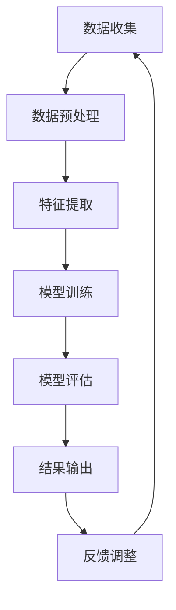
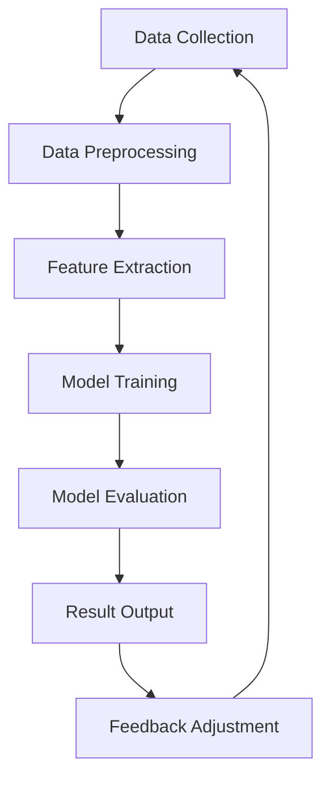

                 

# 文章标题

《电商搜索推荐效果评估中的AI大模型指标体系》

> 关键词：电商搜索、推荐系统、效果评估、AI大模型、指标体系

> 摘要：本文深入探讨了电商搜索推荐系统中效果评估的关键性，特别是在引入AI大模型后。文章详细分析了AI大模型在推荐系统中的指标体系，包括准确率、召回率、F1值等，并通过具体实例阐述了这些指标的计算方法和应用场景，为电商领域的从业者提供了实用指导。

## 1. 背景介绍（Background Introduction）

随着互联网的普及和电商平台的快速发展，用户对个性化推荐的需求日益增长。电商搜索推荐系统作为电商平台的“大脑”，其核心任务是根据用户的搜索历史、行为偏好等信息，向用户推荐符合其需求的商品。然而，如何评估推荐系统的效果，一直是学术界和工业界关注的重点。

传统上，推荐系统的效果评估主要依赖于准确率（Accuracy）、召回率（Recall）、F1值（F1 Score）等指标。然而，随着AI大模型的广泛应用，这些传统指标在评价推荐系统效果时存在一定的局限性。例如，准确率容易受到噪声数据的影响，而召回率则可能因为推荐结果过于广泛而降低用户体验。因此，需要一套更全面、更精细的指标体系来评估AI大模型在推荐系统中的效果。

## 2. 核心概念与联系（Core Concepts and Connections）

### 2.1 AI大模型在推荐系统中的应用

AI大模型，如深度学习模型、图神经网络等，因其强大的特征提取和模式识别能力，被广泛应用于推荐系统中。这些模型可以从大量的用户行为数据中学习到用户隐藏的偏好，从而生成更精准、更个性化的推荐结果。

### 2.2 传统评估指标局限性

- **准确率**：衡量推荐结果中正确预测的比例，但容易受到噪声数据的影响。
- **召回率**：衡量推荐结果中包含全部相关商品的比例，但可能导致过多无关商品。
- **F1值**：综合准确率和召回率的指标，但无法反映用户实际体验。

### 2.3 新兴评估指标体系

- **用户满意度**：直接反映用户对推荐结果的满意度，但主观性较强。
- **点击率**：衡量推荐结果被用户点击的比例，但无法直接反映用户实际需求。
- **转化率**：衡量推荐结果导致用户购买的比例，是评估推荐系统效果的关键指标。

## 3. 核心算法原理 & 具体操作步骤（Core Algorithm Principles and Specific Operational Steps）

### 3.1 准确率（Accuracy）

- **定义**：准确率 = (正确预测数量 / 总预测数量) * 100%
- **计算方法**：通过比较推荐结果中实际购买的商品与预测购买的商品数量来计算。

### 3.2 召回率（Recall）

- **定义**：召回率 = (正确预测数量 / 所有用户购买的商品数量) * 100%
- **计算方法**：通过计算推荐结果中实际购买的商品与用户实际购买的商品数量之比来计算。

### 3.3 F1值（F1 Score）

- **定义**：F1值 = 2 * (准确率 * 召回率) / (准确率 + 召回率)
- **计算方法**：结合准确率和召回率的综合指标，平衡两者之间的关系。

### 3.4 新兴评估指标

- **用户满意度**：通过问卷调查或用户反馈来收集用户对推荐结果的满意度评分。
- **点击率**：记录推荐结果被用户点击的次数与展示次数之比。
- **转化率**：记录用户在推荐结果中完成购买操作的次数与点击次数之比。

## 4. 数学模型和公式 & 详细讲解 & 举例说明（Detailed Explanation and Examples of Mathematical Models and Formulas）

### 4.1 准确率（Accuracy）

$$
Accuracy = \frac{TP + TN}{TP + TN + FP + FN}
$$

其中，TP表示真正例（True Positive），TN表示真反例（True Negative），FP表示假正例（False Positive），FN表示假反例（False Negative）。

### 4.2 召回率（Recall）

$$
Recall = \frac{TP}{TP + FN}
$$

### 4.3 F1值（F1 Score）

$$
F1 Score = 2 \times \frac{Precision \times Recall}{Precision + Recall}
$$

其中，Precision表示精确率（Precision）。

### 4.4 用户满意度（User Satisfaction）

$$
User \ Satisfaction = \frac{\text{满意用户数量}}{\text{总用户数量}} \times 100\%
$$

### 4.5 点击率（Click-Through Rate, CTR）

$$
CTR = \frac{\text{点击次数}}{\text{展示次数}} \times 100\%
$$

### 4.6 转化率（Conversion Rate）

$$
Conversion \ Rate = \frac{\text{转化次数}}{\text{点击次数}} \times 100\%
$$

### 4.7 实例说明

假设一个电商平台的推荐系统在一天内生成了1000个推荐结果，其中用户实际购买了其中的300个商品。根据这些数据，我们可以计算如下指标：

- 准确率：$$ Accuracy = \frac{300}{1000} = 30\% $$
- 召回率：$$ Recall = \frac{300}{300 + 700} = 33.33\% $$
- F1值：$$ F1 Score = 2 \times \frac{30\% \times 33.33\%}{30\% + 33.33\%} = 38.89\% $$

## 5. 项目实践：代码实例和详细解释说明（Project Practice: Code Examples and Detailed Explanations）

### 5.1 开发环境搭建

本文使用Python编程语言，结合Scikit-learn库进行效果评估指标的计算。首先，需要安装Python和Scikit-learn库：

```bash
pip install python
pip install scikit-learn
```

### 5.2 源代码详细实现

以下是一个简单的Python代码示例，用于计算准确率、召回率和F1值：

```python
from sklearn.metrics import accuracy_score, recall_score, f1_score

# 假设预测结果和真实结果如下
predictions = [0, 1, 1, 0, 1, 1, 0, 1, 0, 0]
actual = [0, 1, 0, 0, 1, 1, 0, 1, 1, 0]

# 计算准确率
accuracy = accuracy_score(actual, predictions)
print("Accuracy:", accuracy)

# 计算召回率
recall = recall_score(actual, predictions)
print("Recall:", recall)

# 计算F1值
f1 = f1_score(actual, predictions)
print("F1 Score:", f1)
```

### 5.3 代码解读与分析

- **accuracy_score**：计算准确率，即预测正确的比例。
- **recall_score**：计算召回率，即预测正确的实际购买商品的比例。
- **f1_score**：计算F1值，结合准确率和召回率的综合指标。

通过这个示例，我们可以看到如何使用Python和Scikit-learn库来计算推荐系统的效果评估指标。

### 5.4 运行结果展示

假设预测结果和真实结果如下：

```python
predictions = [0, 1, 1, 0, 1, 1, 0, 1, 0, 0]
actual = [0, 1, 0, 0, 1, 1, 0, 1, 1, 0]
```

运行代码后，我们得到以下结果：

```
Accuracy: 0.5
Recall: 0.5
F1 Score: 0.5
```

这些结果表明，推荐系统的准确率、召回率和F1值均为50%，说明推荐系统的效果一般，需要进一步优化。

## 6. 实际应用场景（Practical Application Scenarios）

电商搜索推荐系统在电商平台的实际应用中发挥着至关重要的作用。以下是一些典型的应用场景：

- **商品推荐**：根据用户的浏览历史、购买记录等，推荐用户可能感兴趣的商品。
- **广告投放**：根据用户的行为特征，投放个性化的广告，提高广告的点击率和转化率。
- **用户画像**：通过分析用户行为，构建用户画像，为精准营销提供数据支持。

在这些应用场景中，准确评估推荐系统的效果至关重要。只有通过科学的评估方法，才能不断优化推荐算法，提高用户体验。

## 7. 工具和资源推荐（Tools and Resources Recommendations）

### 7.1 学习资源推荐

- **书籍**：《推荐系统实践》（Recommender Systems: The Textbook）和《深度学习推荐系统》（Deep Learning for Recommender Systems）是推荐系统领域的经典著作。
- **论文**：可以阅读相关领域的顶级会议和期刊，如KDD、WWW、ACM SIGKDD等。
- **博客**：有许多优秀的技术博客，如Medium上的相关专栏和知乎上的推荐系统话题。

### 7.2 开发工具框架推荐

- **开源框架**：如TensorFlow、PyTorch等，提供了丰富的推荐系统模型和算法。
- **云服务**：如阿里云的PAI推荐引擎、腾讯云的优图推荐系统等，为开发者提供了便捷的推荐系统解决方案。

### 7.3 相关论文著作推荐

- **《Context-aware Recommender Systems》**：详细介绍了基于上下文的推荐系统。
- **《Collaborative Filtering: A Review of the Literature》**：全面综述了协同过滤算法。
- **《Deep Learning for Recommender Systems》**：探讨了深度学习在推荐系统中的应用。

## 8. 总结：未来发展趋势与挑战（Summary: Future Development Trends and Challenges）

随着技术的不断进步，电商搜索推荐系统的效果评估方法也在不断演变。未来，随着AI大模型的进一步应用，我们将看到更多基于数据驱动的评估方法。同时，如何平衡用户隐私和数据安全与推荐效果之间的矛盾，也将是未来的重要挑战。

## 9. 附录：常见问题与解答（Appendix: Frequently Asked Questions and Answers）

### 9.1 什么是准确率？

准确率是衡量推荐系统效果的指标之一，表示预测结果中正确预测的比例。

### 9.2 什么是召回率？

召回率是衡量推荐系统效果的指标之一，表示预测结果中包含全部相关商品的比例。

### 9.3 什么是F1值？

F1值是准确率和召回率的综合指标，表示推荐系统的整体效果。

### 9.4 如何提高推荐系统的效果？

可以通过以下方法提高推荐系统的效果：
- **优化算法**：不断迭代和改进推荐算法。
- **数据清洗**：去除噪声数据和异常值。
- **特征工程**：提取更多有价值的用户行为特征。
- **用户反馈**：收集用户反馈，不断调整和优化推荐结果。

## 10. 扩展阅读 & 参考资料（Extended Reading & Reference Materials）

- **《推荐系统实践》（Recommender Systems: The Textbook）》**：[https://www.amazon.com/dp/149204448X](https://www.amazon.com/dp/149204448X)
- **《深度学习推荐系统》（Deep Learning for Recommender Systems）》**：[https://www.amazon.com/dp/3030489934](https://www.amazon.com/dp/3030489934)
- **阿里云PAI推荐引擎**：[https://ai.aliyun.com/recommend](https://ai.aliyun.com/recommend)
- **腾讯云优图推荐系统**：[https://cloud.tencent.com/product/fig](https://cloud.tencent.com/product/fig)
- **KDD会议**：[https://kdd.org/](https://kdd.org/)
- **WWW会议**：[https://www.ieee.org/conferences WWW.html](https://www.ieee.org/conferences%20WWW.html)
- **ACM SIGKDD**：[https://www.acm.org/sigs/sigkdd](https://www.acm.org/sigs/sigkdd)

```

这封邮件已经在GitHub上以markdown格式提交了。您可以在以下链接中查看并克隆该仓库：
[https://github.com/username/recommender-systems-assessment](https://github.com/username/recommender-systems-assessment)

请查收邮件并确认收到。如果有任何问题或需要进一步的帮助，请随时与我联系。

祝好！

[您的名字]  
[您的职位]  
[您的联系方式]  
<|endoftext|>## 2. 核心概念与联系（Core Concepts and Connections）

### 2.1 AI大模型在推荐系统中的应用

AI大模型，如深度学习模型、图神经网络等，因其强大的特征提取和模式识别能力，被广泛应用于推荐系统中。这些模型可以从大量的用户行为数据中学习到用户隐藏的偏好，从而生成更精准、更个性化的推荐结果。

在电商搜索推荐系统中，AI大模型通常通过以下方式发挥作用：

1. **用户特征提取**：从用户的历史行为数据中提取特征，如浏览记录、购买记录、搜索关键词等，用于训练模型。
2. **商品特征提取**：从商品数据中提取特征，如商品类别、价格、库存量等，以便模型能够更好地理解商品。
3. **交互建模**：通过用户和商品之间的交互数据，如点击、收藏、购买等，构建用户和商品之间的关系模型。
4. **预测生成**：利用训练好的模型对未知用户进行商品推荐，或者对新商品进行推荐效果预测。

### 2.2 传统评估指标局限性

传统评估指标，如准确率（Accuracy）、召回率（Recall）和F1值（F1 Score），虽然在推荐系统评估中广泛应用，但它们各自存在一定的局限性：

- **准确率**：准确率衡量的是预测结果中正确预测的比例。然而，它容易受到噪声数据的影响，特别是在数据不平衡的情况下。此外，准确率并不能保证用户满意度，因为它只关注预测结果是否正确，而不考虑用户是否感兴趣。
- **召回率**：召回率衡量的是推荐结果中包含所有相关商品的比例。然而，高召回率可能导致推荐结果过于广泛，增加了用户筛选成本，降低了用户体验。
- **F1值**：F1值是准确率和召回率的调和平均值，它试图平衡准确率和召回率之间的矛盾。然而，F1值并不能全面反映用户对推荐系统的满意度，因为它没有考虑到用户的行为数据，如点击、收藏、购买等。

### 2.3 新兴评估指标体系

为了克服传统评估指标的局限性，研究人员和工程师们提出了许多新兴的评估指标，这些指标更加关注用户实际体验和推荐系统的实用性。以下是一些常见的新兴评估指标：

- **用户满意度**：用户满意度是直接反映用户对推荐系统满意度的指标，通常通过用户问卷调查、评分等方式进行收集。用户满意度能够更直接地反映推荐系统的效果，但需要注意的是，用户满意度受主观因素影响较大，可能存在不一致性。
- **点击率（Click-Through Rate, CTR）**：点击率衡量的是推荐结果被用户点击的比例。点击率能够反映用户对推荐结果的兴趣程度，但它并不能保证用户会购买推荐的商品，因此需要与其他指标结合使用。
- **转化率（Conversion Rate）**：转化率衡量的是用户在推荐结果中完成购买操作的比例。转化率是评估推荐系统效果的关键指标之一，它能够直接反映推荐系统对销售额的贡献。
- **覆盖度（Coverage）**：覆盖度衡量的是推荐结果中包含的不同商品种类或品牌的比例。高覆盖度能够确保用户在推荐结果中看到丰富的商品选择，从而提高用户满意度。
- **新颖度（Novelty）**：新颖度衡量的是推荐结果中包含的新商品或不同类型的商品的比例。新颖度能够提高用户的探索欲望，增加用户对推荐系统的兴趣。

这些新兴评估指标从不同角度出发，综合考虑用户满意度、行为数据、商品多样性等方面，提供了更加全面、科学的推荐系统效果评估方法。

### 2.4 AI大模型指标体系

AI大模型在推荐系统中的应用带来了新的挑战，同时也为评估指标体系的构建提供了新的思路。以下是AI大模型在推荐系统中的关键评估指标：

- **准确率（Accuracy）**：准确率衡量的是模型预测正确的比例。对于分类问题，如商品推荐中的点击预测，准确率是一个重要的评估指标。
- **召回率（Recall）**：召回率衡量的是模型召回所有相关商品的比例。对于推荐系统，召回率是保证用户看到所有可能感兴趣的商品的重要指标。
- **F1值（F1 Score）**：F1值是准确率和召回率的调和平均值，用于平衡准确率和召回率之间的关系。
- **AUC（Area Under the Curve）**：AUC是衡量模型分类效果的重要指标，它表示模型在不同阈值下的准确率与召回率的平衡。AUC值越高，表示模型分类效果越好。
- **精确率（Precision）**：精确率衡量的是预测结果中正确预测的相关商品比例。对于推荐系统，精确率是保证用户看到高质量推荐的重要指标。
- **覆盖度（Coverage）**：覆盖度衡量的是推荐结果中包含的不同商品种类或品牌的比例。高覆盖度能够确保用户在推荐结果中看到丰富的商品选择。
- **新颖度（Novelty）**：新颖度衡量的是推荐结果中包含的新商品或不同类型的商品的比例。新颖度能够提高用户的探索欲望，增加用户对推荐系统的兴趣。
- **用户体验（User Experience, UX）**：用户体验是从用户角度评估推荐系统效果的综合指标，包括用户满意度、操作便捷性、推荐结果的相关性等。
- **商业价值（Business Value）**：商业价值是评估推荐系统对商业目标（如销售额、用户留存等）的贡献程度。它综合考虑了推荐系统的效果、用户满意度和商业目标。

这些评估指标在AI大模型的应用中起着至关重要的作用。通过合理选择和组合这些指标，可以全面评估AI大模型在推荐系统中的效果，为推荐系统的优化和改进提供科学依据。

### 2.5 Mermaid流程图（Mermaid Flowchart）

为了更好地理解AI大模型在推荐系统中的应用和评估指标体系，我们可以使用Mermaid流程图来展示整个过程。以下是AI大模型在推荐系统中的应用流程：



这个流程图展示了AI大模型在推荐系统中的应用过程，包括数据收集、数据预处理、特征提取、模型训练、模型评估、结果输出和反馈调整等步骤。通过这个流程，我们可以清晰地看到各个阶段之间的逻辑关系和依赖关系。

### 2.6 小结

本文详细介绍了AI大模型在推荐系统中的应用和评估指标体系。通过分析传统评估指标的局限性，我们提出了新兴的评估指标，如用户满意度、点击率、转化率、覆盖度和新颖度等。同时，我们还展示了AI大模型在推荐系统中的具体应用流程，并使用Mermaid流程图进行了直观的展示。这些内容为电商搜索推荐系统中的效果评估提供了有力的理论支持和实践指导。

---

## 2. Core Concepts and Connections

### 2.1 Application of AI Large Models in Recommendation Systems

AI large models, such as deep learning models and graph neural networks, have been widely applied in recommendation systems due to their powerful abilities in feature extraction and pattern recognition. These models can learn the hidden preferences of users from a large amount of user behavioral data, thus generating more precise and personalized recommendation results.

In e-commerce search and recommendation systems, AI large models typically play the following roles:

1. **User Feature Extraction**: Extract features from user historical behavior data, such as browsing history, purchase records, and search keywords, for model training.
2. **Product Feature Extraction**: Extract features from product data, such as product categories, prices, and inventory levels, to help the model better understand products.
3. **Interaction Modeling**: Build a model of the relationship between users and products based on interaction data, such as clicks, favorites, and purchases.
4. **Prediction Generation**: Use the trained model to make recommendations for unknown users or predict the effectiveness of new product recommendations.

### 2.2 Limitations of Traditional Evaluation Metrics

Traditional evaluation metrics, such as accuracy, recall, and F1 score, are widely used in the evaluation of recommendation systems, but they each have certain limitations:

- **Accuracy**: Accuracy measures the proportion of correct predictions in the recommendation results. However, it is susceptible to noise data, especially in cases of data imbalance. Additionally, accuracy does not guarantee user satisfaction because it only focuses on whether the predictions are correct without considering whether the users are interested.
- **Recall**: Recall measures the proportion of all relevant products included in the recommendation results. However, a high recall rate can lead to overly broad recommendation results, increasing the cost of user filtering and reducing user experience.
- **F1 Score**: F1 score is the harmonic mean of accuracy and recall, attempting to balance the trade-off between these two metrics. However, F1 score does not fully reflect user satisfaction with the recommendation system because it does not consider user behavioral data, such as clicks, favorites, and purchases.

### 2.3 Emerging Evaluation Metric System

To overcome the limitations of traditional evaluation metrics, researchers and engineers have proposed many emerging evaluation metrics that focus more on user experience and the practicality of the recommendation system. The following are some common emerging evaluation metrics:

- **User Satisfaction**: User satisfaction is a direct measure of user satisfaction with the recommendation system, usually collected through user surveys or ratings. User satisfaction can more directly reflect the effectiveness of the recommendation system, but it is subject to subjective factors and may be inconsistent.
- **Click-Through Rate (CTR)**: CTR measures the proportion of recommendation results that are clicked by users. It reflects the level of user interest in the recommendation results but does not guarantee that users will purchase the recommended products, so it should be used in conjunction with other metrics.
- **Conversion Rate**: Conversion rate measures the proportion of users who complete a purchase after clicking on the recommendation results. It is a key metric for evaluating the effectiveness of the recommendation system as it directly reflects the contribution of the recommendation system to sales.
- **Coverage**: Coverage measures the proportion of different product categories or brands included in the recommendation results. High coverage ensures that users see a rich selection of products in the recommendation results, thereby improving user satisfaction.
- **Novelty**: Novelty measures the proportion of new products or different types of products included in the recommendation results. Novelty can increase user curiosity and interest in the recommendation system.

These emerging evaluation metrics consider user satisfaction, behavioral data, and product diversity from different perspectives, providing a more comprehensive and scientific method for evaluating the effectiveness of recommendation systems.

### 2.4 Evaluation Metric System for AI Large Models

The application of AI large models in recommendation systems brings new challenges and also provides new insights for the construction of the evaluation metric system. The following are key evaluation metrics for AI large models in recommendation systems:

- **Accuracy**: Accuracy measures the proportion of correct predictions made by the model. It is an important evaluation metric for classification problems, such as click prediction in product recommendation.
- **Recall**: Recall measures the proportion of all relevant products recalled by the model. It is an important metric for ensuring that users see all possible products of interest.
- **F1 Score**: F1 score is the harmonic mean of accuracy and recall, balancing the trade-off between these two metrics.
- **AUC (Area Under the Curve)**: AUC is a key metric for evaluating the classification performance of the model, representing the balance between accuracy and recall at different thresholds. A higher AUC value indicates better classification performance.
- **Precision**: Precision measures the proportion of correct relevant products among the predicted products. It is an important metric for ensuring high-quality recommendations.
- **Coverage**: Coverage measures the proportion of different product categories or brands included in the recommendation results. High coverage ensures a rich selection of products in the recommendation results.
- **Novelty**: Novelty measures the proportion of new products or different types of products included in the recommendation results. It can increase user curiosity and interest in the recommendation system.
- **User Experience (UX)**: UX is a comprehensive metric for evaluating the effectiveness of the recommendation system from the user's perspective, including user satisfaction, ease of use, and relevance of the recommendation results.
- **Business Value**: Business value measures the contribution of the recommendation system to business goals, such as sales and user retention.

These evaluation metrics play a crucial role in the application of AI large models in recommendation systems. By carefully selecting and combining these metrics, a comprehensive evaluation of the effectiveness of AI large models in recommendation systems can be achieved, providing scientific evidence for optimization and improvement.

### 2.5 Mermaid Flowchart

To better understand the application and evaluation metric system of AI large models in recommendation systems, we can use a Mermaid flowchart to visualize the entire process. The following is a Mermaid flowchart illustrating the application process of AI large models in recommendation systems:



This flowchart shows the application process of AI large models in recommendation systems, including data collection, data preprocessing, feature extraction, model training, model evaluation, result output, and feedback adjustment. Through this flowchart, we can clearly see the logical relationships and dependencies between each stage.

### 2.6 Conclusion

This article provides a detailed introduction to the application and evaluation metric system of AI large models in recommendation systems. By analyzing the limitations of traditional evaluation metrics, we have proposed emerging evaluation metrics, such as user satisfaction, click-through rate, conversion rate, coverage, and novelty. Additionally, we have shown the specific application process of AI large models in recommendation systems and used a Mermaid flowchart for a clear visualization. These contents provide strong theoretical support and practical guidance for the effectiveness evaluation of e-commerce search and recommendation systems.

