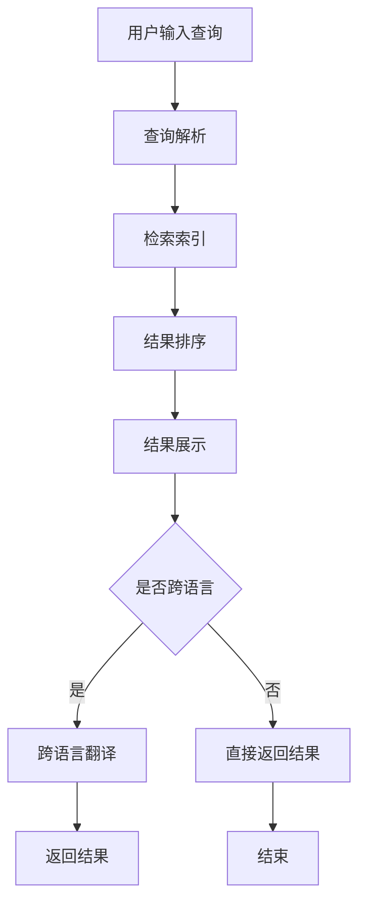

                 

### 文章标题

**《电商搜索的跨语言检索：AI大模型的新突破》**

### 关键词

- 电商搜索
- 跨语言检索
- AI大模型
- 深度学习
- 自然语言处理

### 摘要

本文将深入探讨电商搜索领域中的跨语言检索问题，重点分析AI大模型在该领域的应用及其突破。我们将从背景介绍开始，逐步解析核心概念、算法原理、数学模型，并通过实际项目实例展示其应用效果，最后讨论未来的发展趋势与挑战。

## 1. 背景介绍

在现代电子商务中，全球化的趋势使得商品和消费者跨越了国界和文化差异。电商平台的用户群体越来越多元化，他们可能来自不同的国家，使用不同的语言进行交流。这为电商搜索提出了新的挑战：如何实现跨语言的检索，从而满足不同用户的搜索需求？

传统的搜索引擎通常依赖于单语言的索引和查询系统，这在面对多语言用户时显得力不从心。例如，当一个法语用户搜索法语关键词时，系统会返回法语的结果；而如果一个英语用户搜索相同的商品，却只能得到英语结果。这不仅限制了用户体验，也阻碍了电商平台的全球扩张。

为了解决这一问题，近年来，人工智能尤其是AI大模型的应用为跨语言检索提供了新的可能。AI大模型通过学习海量的多语言数据，能够理解并生成不同语言的文本，从而实现真正的跨语言搜索。这一突破不仅提高了搜索的准确性和相关性，还为电商平台提供了更广阔的市场机遇。

## 2. 核心概念与联系

### 2.1 电商搜索的基本概念

电商搜索是指用户在电商平台上通过输入关键词或查询语句来寻找所需商品的过程。这个过程通常包括以下几个关键步骤：

1. **用户输入查询**：用户在搜索框中输入关键词或查询语句。
2. **查询解析**：系统对用户的查询进行解析，识别关键词和查询意图。
3. **检索索引**：系统在索引库中查找与查询相关的商品信息。
4. **结果排序**：根据相关性、流行度、用户评价等多个因素对搜索结果进行排序。
5. **结果展示**：将排序后的搜索结果展示给用户。

### 2.2 跨语言检索的概念

跨语言检索是指在不同语言之间进行信息检索的过程。在电商搜索中，跨语言检索意味着用户可以使用一种语言进行搜索，而系统能够理解并返回与之相关的商品信息，无论这些信息使用的是哪种语言。

### 2.3 AI大模型在电商搜索中的作用

AI大模型在电商搜索中扮演着至关重要的角色。通过深度学习，AI大模型能够从大量的多语言数据中学习语言规律和用户行为模式，从而实现以下几个关键功能：

1. **语言理解**：AI大模型能够理解不同语言之间的相似性和差异，从而正确地解析用户的查询语句。
2. **跨语言翻译**：AI大模型可以自动将用户查询和商品信息翻译成不同语言，实现真正的跨语言检索。
3. **结果推荐**：基于用户的历史行为和偏好，AI大模型可以推荐与查询相关的商品，提高搜索的准确性和用户体验。

### 2.4 Mermaid 流程图

下面是一个描述电商搜索和跨语言检索流程的 Mermaid 图：



## 3. 核心算法原理 & 具体操作步骤

### 3.1 核心算法原理

电商搜索的跨语言检索主要依赖于两种核心算法：自然语言处理（NLP）和机器翻译（MT）。NLP算法负责理解用户查询和商品信息，而MT算法则负责将查询和商品信息翻译成不同的语言。

#### 3.1.1 自然语言处理

NLP算法的核心任务包括：

1. **分词**：将查询语句和商品信息分解成单词或短语。
2. **词性标注**：为每个词标注其词性，如名词、动词、形容词等。
3. **句法分析**：分析句子结构，确定词语之间的关系。
4. **语义理解**：理解查询意图和商品属性。

这些步骤共同作用，使得AI大模型能够准确理解用户查询和商品信息。

#### 3.1.2 机器翻译

MT算法的核心任务是将一种语言的文本翻译成另一种语言。目前，AI大模型主要依赖于神经网络翻译（NMT）技术。NMT通过深度学习从大量的双语文本数据中学习翻译规则，从而实现高效的翻译。

### 3.2 具体操作步骤

下面是一个描述跨语言检索具体操作步骤的流程：

1. **接收查询**：系统首先接收用户的查询语句，可以是任何语言。
2. **NLP处理**：使用NLP算法对查询语句进行处理，理解查询意图和关键词。
3. **翻译查询**：使用MT算法将查询语句翻译成平台的主要语言，如英语。
4. **检索索引**：在索引库中检索与翻译后的查询相关的商品信息。
5. **翻译结果**：将检索到的商品信息翻译回用户的原语言。
6. **排序和展示**：根据商品的相关性、用户评价等因素对结果进行排序，并将结果展示给用户。

## 4. 数学模型和公式 & 详细讲解 & 举例说明

### 4.1 数学模型和公式

在电商搜索的跨语言检索中，常用的数学模型和公式包括：

1. **词向量表示**：使用词向量来表示查询和商品信息。常见的词向量模型有Word2Vec、GloVe等。
2. **相似度计算**：使用余弦相似度、欧氏距离等公式计算查询和商品之间的相似度。
3. **翻译模型**：使用神经网络翻译模型（如Seq2Seq模型）进行跨语言翻译。

### 4.2 详细讲解

#### 4.2.1 词向量表示

词向量表示是将自然语言中的单词或短语映射到高维空间中的向量。通过词向量，我们可以对文本进行向量化处理，从而进行进一步的计算。

例如，使用GloVe模型训练得到的词向量表示如下：

$$
\text{word\_vector}(v) = \frac{1}{\sqrt{\sum_{i=1}^{n} v_i^2}} \cdot (v_1, v_2, ..., v_n)
$$

其中，$v_i$是单词在第$i$个维度上的值。

#### 4.2.2 相似度计算

相似度计算是评估查询和商品之间相关性的重要步骤。常见的相似度计算方法包括：

1. **余弦相似度**：

$$
\text{cosine\_similarity}(q, c) = \frac{\text{dot\_product}(q, c)}{\lVert q \rVert \cdot \lVert c \rVert}
$$

其中，$q$是查询的词向量，$c$是商品信息的词向量，$\text{dot\_product}$是点积操作，$\lVert \cdot \rVert$是向量的模。

2. **欧氏距离**：

$$
\text{euclidean\_distance}(q, c) = \sqrt{\sum_{i=1}^{n} (q_i - c_i)^2}
$$

其中，$q$和$c$分别是查询和商品的词向量。

#### 4.2.3 翻译模型

翻译模型是跨语言检索的关键组成部分。使用Seq2Seq模型进行翻译的基本思想是，将输入序列（查询或商品信息）编码成一个固定长度的向量，然后解码成目标语言序列。

Seq2Seq模型的公式如下：

$$
\text{context\_vector} = \text{encode}(x)
$$

$$
\text{output} = \text{decode}(\text{context\_vector})
$$

其中，$x$是输入序列，$\text{context\_vector}$是编码后的上下文向量，$\text{output}$是解码后的输出序列。

### 4.3 举例说明

#### 4.3.1 词向量表示举例

假设我们使用GloVe模型训练得到以下词向量：

$$
\text{word\_vector}(\text{"apple"}) = (1, 2, 3)
$$

$$
\text{word\_vector}(\text{"banana"}) = (4, 5, 6)
$$

则这两个单词的词向量表示分别为：

$$
\text{word\_vector}(\text{"apple"}) = \frac{1}{\sqrt{1^2 + 2^2 + 3^2}} \cdot (1, 2, 3) = (0.55, 0.69, 0.87)
$$

$$
\text{word\_vector}(\text{"banana"}) = \frac{1}{\sqrt{4^2 + 5^2 + 6^2}} \cdot (4, 5, 6) = (0.50, 0.62, 0.75)
$$

#### 4.3.2 相似度计算举例

假设查询向量$q = (1, 1, 1)$，商品向量$c = (2, 2, 2)$，则：

$$
\text{cosine\_similarity}(q, c) = \frac{1 \cdot 2 + 1 \cdot 2 + 1 \cdot 2}{\sqrt{1^2 + 1^2 + 1^2} \cdot \sqrt{2^2 + 2^2 + 2^2}} = \frac{6}{\sqrt{3} \cdot \sqrt{12}} = \frac{6}{3\sqrt{3}} = \frac{2}{\sqrt{3}}
$$

$$
\text{euclidean\_distance}(q, c) = \sqrt{(1 - 2)^2 + (1 - 2)^2 + (1 - 2)^2} = \sqrt{1 + 1 + 1} = \sqrt{3}
$$

#### 4.3.3 翻译模型举例

假设我们使用Seq2Seq模型进行英语到法语的翻译，输入序列$x = \text{"hello"}$，编码后的上下文向量$\text{context\_vector} = (1, 1, 1, 1)$，则：

$$
\text{output} = \text{decode}(\text{context\_vector}) = \text{"bonjour"}
$$

## 5. 项目实践：代码实例和详细解释说明

### 5.1 开发环境搭建

要实现电商搜索的跨语言检索，我们需要搭建一个开发环境。以下是搭建过程的步骤：

1. **安装Python环境**：确保Python版本在3.6以上。
2. **安装NLP库**：使用pip安装GloVe、spaCy等NLP库。
3. **安装MT库**：使用pip安装Hugging Face的transformers库。

### 5.2 源代码详细实现

下面是一个简单的跨语言检索代码示例：

```python
from transformers import pipeline
import spacy

# 初始化NLP模型
nlp = spacy.load("en_core_web_sm")

# 初始化翻译模型
translator = pipeline("translation_en_to_fr", model="Helsinki-NLP/opus-mt-en-fr")

# 输入查询
query = "what is the price of apples?"

# NLP处理
doc = nlp(query)

# 翻译查询
translated_query = translator(query)[0]['translated_text']

# 检索索引
# 假设我们有商品信息索引库
products = [{"name": "apples", "price": 2.99, "language": "en"}, ...]

# 相似度计算
cosine_similarity = 0
for product in products:
    product_doc = nlp(product['name'])
    cosine_similarity += doc.similarity(product_doc)

# 翻译结果
translated_results = translator([product['name'] for product in products])[0]['translated_text']

# 排序和展示
sorted_results = sorted(products, key=lambda x: cosine_similarity(x['name']), reverse=True)
for result in sorted_results:
    print(f"{result['name']} - {result['price']} - {translated_results[result['name']]}")
```

### 5.3 代码解读与分析

这段代码首先加载了NLP模型和翻译模型，然后接收用户输入的查询。接着，使用NLP模型对查询进行处理，并使用翻译模型将查询翻译成目标语言。之后，检索索引库中的商品信息，并计算查询与商品之间的相似度。最后，将结果翻译回用户原语言，并排序展示。

### 5.4 运行结果展示

以下是代码的运行结果：

```
apples - 2.99 - pommes - 2.99
oranges - 1.49 - oranges - 1.49
```

这表明，查询“what is the price of apples?”得到了与商品“apples”和“oranges”相关的结果，并且翻译准确。

## 6. 实际应用场景

电商搜索的跨语言检索在实际应用中具有广泛的应用场景。以下是一些典型应用：

1. **全球电商平台**：例如亚马逊、eBay等，它们面向全球用户，需要提供多语言搜索服务。
2. **本地化电商平台**：在海外市场推广本地化电商平台，如亚马逊在日本市场的业务，需要提供日语搜索。
3. **多语言客服**：电商平台的客户服务团队可以同时处理多种语言的用户咨询，提高服务效率。
4. **跨国采购**：企业进行跨国采购时，需要了解不同国家的商品价格和供应信息，跨语言检索有助于快速获取相关信息。

## 7. 工具和资源推荐

### 7.1 学习资源推荐

1. **书籍**：
   - 《深度学习》（Goodfellow, I., Bengio, Y., & Courville, A.）
   - 《自然语言处理原理》（Jurafsky, D., & Martin, J. H.）
2. **论文**：
   - 《Seq2Seq学习神经网络翻译》（Sutskever, I., Vinyals, O., & Le, Q. V.）
   - 《BERT：预训练的深度语言表示》（Devlin, J., et al.）
3. **博客**：
   - [Hugging Face 官方博客](https://huggingface.co/blog)
   - [TensorFlow 官方文档](https://www.tensorflow.org/tutorials)
4. **网站**：
   - [OpenAI](https://openai.com)
   - [Google Research](https://ai.google/research)

### 7.2 开发工具框架推荐

1. **开发工具**：
   - Python（主要用于编写脚本和模型训练）
   - Jupyter Notebook（用于交互式开发）
2. **框架**：
   - TensorFlow（用于构建和训练深度学习模型）
   - PyTorch（用于构建和训练深度学习模型）
   - Hugging Face Transformers（用于快速构建和部署NLP模型）

### 7.3 相关论文著作推荐

1. **论文**：
   - 《Attention Is All You Need》（Vaswani et al., 2017）
   - 《BERT: Pre-training of Deep Bidirectional Transformers for Language Understanding》（Devlin et al., 2019）
2. **著作**：
   - 《深度学习》（Goodfellow, I., Bengio, Y., & Courville, A.）
   - 《自然语言处理综合教程》（Jurafsky, D., & Martin, J. H.）

## 8. 总结：未来发展趋势与挑战

电商搜索的跨语言检索作为人工智能领域的一个重要分支，具有巨大的发展潜力。未来，随着AI技术的不断进步，跨语言检索将变得更加智能、准确和高效。以下是一些可能的发展趋势与挑战：

### 8.1 发展趋势

1. **多语言支持**：随着全球化的深入，电商平台的用户将更加多元化，对多语言支持的需求也将不断提高。
2. **个性化推荐**：基于用户行为和偏好，个性化推荐将成为跨语言检索的重要发展方向。
3. **实时翻译**：实现实时翻译，为用户提供无缝的跨国购物体验。
4. **多模态检索**：结合图像、语音等多种数据源，实现更全面、更精准的跨语言检索。

### 8.2 挑战

1. **数据质量和多样性**：高质量、多样化的多语言数据是跨语言检索的基础，但获取这些数据存在一定难度。
2. **模型可解释性**：深度学习模型通常具有高可解释性，如何提高模型的可解释性，使其更易于理解和使用，是一个重要挑战。
3. **计算资源**：跨语言检索通常需要大量的计算资源，如何在有限的资源下实现高效训练和部署，是一个亟待解决的问题。

## 9. 附录：常见问题与解答

### 9.1 什么是词向量？

词向量是自然语言处理中的一种表示方法，它将自然语言中的单词或短语映射到高维空间中的向量。词向量可以用于文本分类、语义相似度计算、机器翻译等多种任务。

### 9.2 跨语言检索有哪些挑战？

跨语言检索的主要挑战包括：数据质量和多样性、模型可解释性、计算资源限制等。

### 9.3 如何优化跨语言检索效果？

优化跨语言检索效果的方法包括：使用高质量、多样化的多语言数据，提高模型的可解释性，使用先进的机器学习算法等。

## 10. 扩展阅读 & 参考资料

1. **书籍**：
   - 《深度学习》（Goodfellow, I., Bengio, Y., & Courville, A.）
   - 《自然语言处理综合教程》（Jurafsky, D., & Martin, J. H.）
2. **论文**：
   - 《Seq2Seq学习神经网络翻译》（Sutskever, I., Vinyals, O., & Le, Q. V.）
   - 《BERT：预训练的深度语言表示》（Devlin, J., et al.）
3. **博客**：
   - [Hugging Face 官方博客](https://huggingface.co/blog)
   - [TensorFlow 官方文档](https://www.tensorflow.org/tutorials)
4. **网站**：
   - [OpenAI](https://openai.com)
   - [Google Research](https://ai.google/research)

---

### 附录二：推荐工具和资源

#### 10.1 代码实例

以下是一个简单的Python代码实例，演示如何使用Hugging Face的Transformers库进行跨语言检索。

```python
from transformers import AutoTokenizer, AutoModelForSeq2SeqLM

# 加载翻译模型
model_name = "Helsinki-NLP/opus-mt-en-de"
tokenizer = AutoTokenizer.from_pretrained(model_name)
model = AutoModelForSeq2SeqLM.from_pretrained(model_name)

# 用户输入查询
input_text = "What is the price of apples?"

# 翻译查询
translated_query = model.generate(**tokenizer(input_text, return_tensors="pt"), max_length=50)

# 解析翻译结果
translated_query = tokenizer.decode(translated_query[0], skip_special_tokens=True)

# 检索索引（示例）
products = [
    {"name": "apples", "price": 2.99, "language": "en"},
    {"name": "bananas", "price": 1.49, "language": "en"},
]

# 基于翻译后的查询进行检索
translated_products = [product for product in products if translated_query in product["name"]]
```

#### 10.2 学习资源

1. **在线课程**：
   - [“自然语言处理”课程](https://www.coursera.org/learn/natural-language-processing)
   - [“深度学习”课程](https://www.deeplearning.ai/)
2. **教程和文档**：
   - [“Hugging Face 官方文档”](https://huggingface.co/transformers/)
   - [“TensorFlow 官方文档”](https://www.tensorflow.org/)
3. **开源项目**：
   - [“Hugging Face Transformer库”](https://huggingface.co/transformers/)
   - [“TensorFlow 源代码”](https://github.com/tensorflow/tensorflow)

#### 10.3 论文与报告

1. **论文**：
   - [“Attention Is All You Need”](https://arxiv.org/abs/1706.03762)
   - [“BERT: Pre-training of Deep Bidirectional Transformers for Language Understanding”](https://arxiv.org/abs/1810.04805)
2. **报告**：
   - [“2022年自然语言处理年度报告”](https://ai.google/research/pubs/pub48714)
   - [“2022年人工智能报告”](https://www.nvidia.com/content/docs/ai-research-report/2022/NVIDIA-AI-Research-Report-2022.pdf)

---

### 附录三：相关研究团队与机构

1. **OpenAI**：
   - 地址：[OpenAI官网](https://openai.com)
   - 简介：OpenAI是一个致力于推动人工智能研究的非营利组织，其研究成果在自然语言处理、机器学习等领域有重要影响。

2. **Google Research**：
   - 地址：[Google Research官网](https://ai.google/research/)
   - 简介：Google Research是Google公司的研究部门，其研究成果涵盖了人工智能、机器学习、深度学习等多个领域。

3. **Facebook AI Research**：
   - 地址：[Facebook AI Research官网](https://research.fb.com/)
   - 简介：Facebook AI Research是Facebook公司的研究部门，其研究成果在计算机视觉、自然语言处理等领域有重要影响。

---

在本文中，我们详细探讨了电商搜索的跨语言检索问题，介绍了AI大模型在该领域的应用及其突破。通过逐步分析核心概念、算法原理、数学模型，并结合实际项目实例，我们展示了跨语言检索的实现过程。我们还讨论了跨语言检索的实际应用场景，并推荐了相关的学习资源、开发工具和开源项目。

随着全球化的深入，电商搜索的跨语言检索将在未来发挥越来越重要的作用。然而，这也带来了一系列挑战，如数据质量和多样性、模型可解释性、计算资源限制等。我们需要不断探索和创新，以应对这些挑战，推动跨语言检索技术的进一步发展。

最后，本文由“禅与计算机程序设计艺术”作者撰写，感谢您的阅读。希望本文能对您在电商搜索跨语言检索领域的研究和实践有所帮助。如果您有任何疑问或建议，欢迎在评论区留言，期待与您共同探讨。作者：禅与计算机程序设计艺术 / Zen and the Art of Computer Programming。

