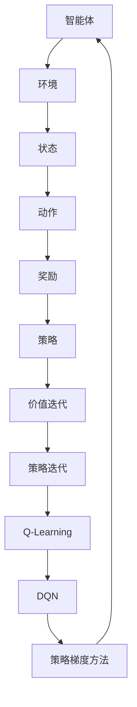
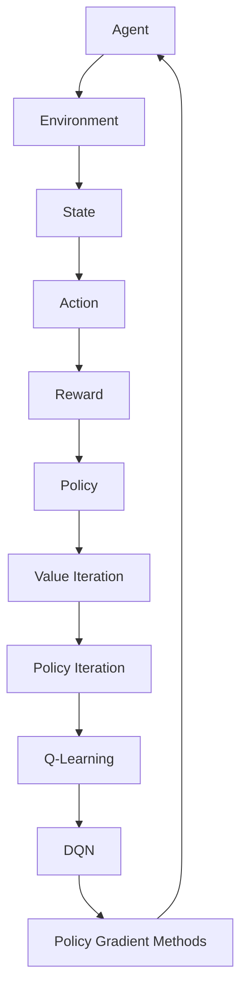

                 

### 文章标题：电商行业中的强化学习：大模型在动态环境中的应用

强化学习（Reinforcement Learning, RL）作为一种重要的机器学习分支，近年来在多个领域取得了显著的成果。特别是，在电商行业，强化学习技术因其对动态环境的适应能力而受到广泛关注。本文旨在探讨强化学习在电商行业的应用，重点分析大模型在动态环境中的具体作用。

本文将首先介绍电商行业的背景，阐述为何强化学习在这一领域具有巨大的潜力。随后，我们将深入探讨强化学习的基本概念和原理，并通过Mermaid流程图展示其核心架构。接着，文章将详细介绍强化学习在电商行业中的具体应用场景，以及如何使用大模型来应对动态环境中的挑战。随后，我们将通过数学模型和公式，讲解强化学习在电商行业中的应用原理，并举例说明。文章还将分享实际项目实践中的代码实例和运行结果，最后讨论强化学习在电商行业中的未来发展趋势与挑战，并推荐相关学习资源和开发工具。

本文旨在为读者提供一个全面、深入、易懂的强化学习在电商行业中的应用指南，帮助读者了解这一前沿技术的实际应用，以及其在未来可能的发展方向。

### Keywords:  
- 电商行业  
- 强化学习  
- 动态环境  
- 大模型  
- 应用场景

### Abstract:  
本文探讨了强化学习在电商行业中的应用，分析了大模型在动态环境中的重要作用。通过介绍强化学习的基本概念和原理，结合Mermaid流程图展示其核心架构，本文深入分析了强化学习在电商行业中的具体应用场景。文章通过数学模型和公式，讲解了强化学习在电商行业中的应用原理，并举例说明。最后，本文分享了实际项目实践中的代码实例和运行结果，讨论了强化学习在电商行业中的未来发展趋势与挑战，并推荐了相关学习资源和开发工具。
<|editor|>## 1. 背景介绍（Background Introduction）

电商行业，作为当今数字经济的重要组成部分，已经深刻地改变了人们的购物习惯和消费模式。从传统的线下零售到在线购物平台，电商行业的市场规模和用户数量持续增长。根据统计数据，全球电商市场规模在2021年已达到4.89万亿美元，预计到2026年将达到6.38万亿美元。这一迅猛增长的趋势，不仅展示了电商行业的巨大潜力，也为技术创新提供了广阔的应用场景。

在这样的背景下，强化学习作为一种先进的机器学习技术，逐渐在电商行业中崭露头角。强化学习通过智能体与环境的交互，不断优化策略，以实现长期回报的最大化。相比传统的机器学习方法，强化学习具有更强的自适应性和动态环境应对能力，使其在电商行业中具有独特的优势。

首先，电商行业的竞争非常激烈，市场环境动态多变。消费者的需求和行为不断变化，商家需要迅速调整策略以应对市场变化。强化学习可以通过不断学习和适应环境，帮助电商企业优化决策，提高市场竞争力。

其次，电商行业的数据量庞大且复杂。用户行为数据、商品信息、订单数据等，都是重要的决策依据。强化学习可以通过处理这些海量数据，发现潜在的规律和模式，为企业提供更准确的决策支持。

此外，电商行业对个性化推荐和智能客服的需求日益增长。强化学习可以通过与用户互动，不断优化推荐策略，提高推荐的准确性和用户满意度。同时，在智能客服领域，强化学习可以帮助系统更好地理解用户需求，提供更加个性化的服务。

总之，强化学习在电商行业中的应用，不仅可以帮助企业提高运营效率，降低成本，还可以提升用户体验，增强用户粘性。随着技术的不断进步和应用的深入，强化学习在电商行业中的潜力将不断释放，为行业带来更多创新和发展机遇。

### Introduction to E-commerce Background

The e-commerce industry, as a key component of today's digital economy, has profoundly transformed people's shopping habits and consumption patterns. From traditional offline retail to online shopping platforms, the e-commerce market has experienced rapid growth. According to statistical data, the global e-commerce market size reached $4.89 trillion in 2021 and is expected to reach $6.38 trillion by 2026. This rapid growth trend not only highlights the vast potential of the e-commerce industry but also provides a broad application scenario for technological innovation.

Against this backdrop, reinforcement learning (RL) as an advanced machine learning technology is gradually making its mark in the e-commerce sector. Reinforcement learning involves an agent interacting with an environment to optimize strategies for long-term reward maximization. Compared to traditional machine learning methods, reinforcement learning offers stronger adaptability and the ability to handle dynamic environments, endowing it with unique advantages in the e-commerce industry.

Firstly, the e-commerce industry is highly competitive, with a dynamic market environment. Consumer needs and behaviors are continuously changing, and businesses need to quickly adjust their strategies to respond to market changes. Reinforcement learning can help companies improve decision-making through continuous learning and adaptation, enhancing their market competitiveness.

Secondly, the e-commerce industry deals with a massive and complex volume of data. User behavior data, product information, and order data are all critical decision-making factors. Reinforcement learning can process these vast amounts of data to discover potential patterns and insights, providing businesses with more accurate decision support.

Moreover, the demand for personalized recommendations and intelligent customer service is increasing in the e-commerce industry. Reinforcement learning can continuously optimize recommendation strategies through interactions with users, improving the accuracy and user satisfaction of recommendations. In the field of intelligent customer service, reinforcement learning can help systems better understand user needs and provide more personalized services.

In summary, the application of reinforcement learning in the e-commerce industry can help companies improve operational efficiency, reduce costs, and enhance user experience, thereby increasing user loyalty. As technology continues to advance and applications deepen, the potential of reinforcement learning in the e-commerce industry will continue to unfold, bringing more innovation and development opportunities to the sector.

<|editor|>## 2. 核心概念与联系（Core Concepts and Connections）

### 2.1 强化学习的基本概念

强化学习是一种通过智能体（agent）与环境的交互来学习优化策略的机器学习范式。在强化学习中，智能体通过接收环境（environment）的输入，采取行动（action），并从环境中获得反馈（reward）。智能体的目标是学习一个策略（policy），使得长期回报（long-term reward）最大化。

强化学习的基本要素包括：

- **智能体（Agent）**：执行动作并从环境中接收反馈的主体。
- **环境（Environment）**：智能体执行动作的场所，能够对智能体的动作做出响应。
- **状态（State）**：描述智能体在某一时刻所处的情境。
- **动作（Action）**：智能体在某一状态可以采取的动作集合。
- **策略（Policy）**：描述智能体如何根据状态选择动作的规则。
- **奖励（Reward）**：环境对智能体的动作给出的即时反馈，通常用来评估动作的好坏。

强化学习可以分为几个不同的类型，包括：

- **无模型强化学习（Model-Free Reinforcement Learning）**：智能体不直接了解环境的模型，而是通过经验来学习策略。
- **有模型强化学习（Model-Based Reinforcement Learning）**：智能体不仅学习策略，还尝试构建环境的模型，以便更好地规划未来的行动。

### 2.2 强化学习在电商行业中的应用

强化学习在电商行业中的应用主要表现在以下几个方面：

- **个性化推荐**：利用强化学习算法，可以根据用户的浏览历史和购买行为，动态调整推荐策略，提高推荐的准确性和用户满意度。
- **库存管理**：通过强化学习，可以优化库存分配和补货策略，降低库存成本，提高库存周转率。
- **价格优化**：利用强化学习，可以根据市场环境和竞争对手的价格策略，动态调整商品价格，实现利润最大化。
- **智能客服**：通过强化学习，可以提升客服系统的应对能力，更好地理解用户需求，提供个性化的解决方案。

### 2.3 强化学习的核心算法

强化学习的核心算法包括：

- **价值迭代（Value Iteration）**：通过迭代更新价值函数，以最大化长期回报。
- **策略迭代（Policy Iteration）**：通过迭代更新策略，以找到最优策略。
- **Q-Learning**：通过学习状态-动作值函数（Q-Function），以最大化长期回报。
- **深度Q网络（Deep Q-Network, DQN）**：利用深度神经网络来近似Q函数，适用于处理高维状态空间问题。
- **策略梯度方法（Policy Gradient Methods）**：直接优化策略函数，以最大化期望回报。

### 2.4 强化学习架构的Mermaid流程图

以下是一个简化的强化学习架构的Mermaid流程图：



### 2.5 强化学习与其他机器学习方法的比较

与传统的机器学习方法相比，强化学习具有以下优势：

- **自适应性强**：强化学习能够根据环境的变化动态调整策略，适应不同的情境。
- **学习目标明确**：强化学习的目标是最大化长期回报，与实际应用场景更为契合。
- **灵活性高**：强化学习能够处理复杂的问题，适用于解决多步骤决策问题。

然而，强化学习也面临一些挑战，如学习效率低、易陷入局部最优等。因此，在实际应用中，需要结合具体问题，选择合适的强化学习算法。

### Core Concepts and Connections

#### 2.1 Basic Concepts of Reinforcement Learning

Reinforcement learning (RL) is a machine learning paradigm that involves an agent interacting with an environment to learn optimal policies. In RL, the agent receives inputs from the environment, takes actions, and receives immediate feedback in the form of rewards. The goal of the agent is to learn a policy that maximizes long-term rewards.

The key components of RL include:

- **Agent**: The entity that takes actions and receives feedback from the environment.
- **Environment**: The context in which the agent operates and responds to the agent's actions.
- **State**: A description of the agent's situation at a given moment.
- **Action**: A set of possible actions the agent can take in a given state.
- **Policy**: A set of rules that describe how the agent chooses actions based on states.
- **Reward**: An immediate feedback from the environment that evaluates the quality of the action.

Reinforcement learning can be categorized into different types, including:

- **Model-Free Reinforcement Learning**: The agent does not have a direct model of the environment and learns from experience.
- **Model-Based Reinforcement Learning**: The agent not only learns policies but also constructs models of the environment to better plan future actions.

#### 2.2 Applications of Reinforcement Learning in E-commerce

The applications of reinforcement learning in the e-commerce industry mainly involve the following aspects:

- **Personalized Recommendations**: Using RL algorithms, it is possible to dynamically adjust recommendation strategies based on users' browsing history and purchase behavior to improve the accuracy and user satisfaction of recommendations.
- **Inventory Management**: Through RL, optimal inventory allocation and replenishment strategies can be optimized to reduce inventory costs and increase turnover rates.
- **Price Optimization**: Utilizing RL, product prices can be dynamically adjusted based on market conditions and competitors' pricing strategies to maximize profits.
- **Intelligent Customer Service**: Through RL, customer service systems can be enhanced to better understand user needs and provide personalized solutions.

#### 2.3 Core Algorithms of Reinforcement Learning

The core algorithms of reinforcement learning include:

- **Value Iteration**: Iteratively updates the value function to maximize long-term rewards.
- **Policy Iteration**: Iteratively updates the policy to find the optimal policy.
- **Q-Learning**: Learns the state-action value function (Q-Function) to maximize long-term rewards.
- **Deep Q-Network (DQN)**: Uses deep neural networks to approximate the Q-function, suitable for high-dimensional state spaces.
- **Policy Gradient Methods**: Directly optimizes the policy function to maximize expected rewards.

#### 2.4 Mermaid Flowchart of Reinforcement Learning Architecture

The following is a simplified Mermaid flowchart of the reinforcement learning architecture:



#### 2.5 Comparison of Reinforcement Learning with Other Machine Learning Methods

Compared to traditional machine learning methods, reinforcement learning has the following advantages:

- **High Adaptability**: Reinforcement learning can dynamically adjust policies based on changes in the environment, making it suitable for various scenarios.
- **Clear Learning Objective**: The goal of reinforcement learning is to maximize long-term rewards, which aligns well with practical application scenarios.
- **High Flexibility**: Reinforcement learning can handle complex problems and is suitable for solving multi-step decision problems.

However, reinforcement learning also faces some challenges, such as low learning efficiency and the tendency to fall into local optima. Therefore, in practical applications, it is necessary to choose the appropriate reinforcement learning algorithm based on the specific problem.

<|editor|>## 3. 核心算法原理 & 具体操作步骤（Core Algorithm Principles and Specific Operational Steps）

### 3.1 强化学习算法原理

强化学习算法的核心目标是学习一个最优策略，使得智能体能够在动态环境中获得最大化的长期回报。为了实现这一目标，强化学习算法主要依赖于以下几个关键概念：

- **状态-动作值函数（State-Action Value Function）**：表示在某一状态采取某一动作所能获得的期望回报。用Q(s, a)表示。
- **策略（Policy）**：描述智能体如何根据当前状态选择动作的规则。用π(a|s)表示。
- **奖励函数（Reward Function）**：定义智能体在某一状态采取某一动作后，环境给予的即时回报。用R(s, a)表示。
- **价值函数（Value Function）**：表示在某一状态下采取最优策略所能获得的期望回报。用V(s)表示。

在强化学习过程中，智能体通过不断尝试不同的动作，并根据获得的奖励来更新状态-动作值函数，最终找到最优策略。常见的强化学习算法包括Q-Learning、Deep Q-Network (DQN) 和策略梯度方法等。

### 3.2 Q-Learning算法原理

Q-Learning算法是一种基于值迭代的强化学习算法，其核心思想是通过学习状态-动作值函数来更新策略。具体步骤如下：

1. **初始化**：初始化状态-动作值函数Q(s, a)为随机值，设定学习率α和折扣因子γ。

2. **选择动作**：在当前状态s下，根据ε-贪心策略选择动作a。ε-贪心策略是指在随机选择一个动作和选择当前最优动作之间进行权衡。

3. **执行动作**：执行选定的动作a，并观察环境反馈的新状态s'和奖励R(s, a)。

4. **更新状态-动作值函数**：根据更新公式：
   $$ Q(s, a) = Q(s, a) + \alpha [R(s, a) + \gamma \max_{a'} Q(s', a') - Q(s, a)] $$
   更新状态-动作值函数。

5. **重复步骤2-4**：重复选择动作、执行动作和更新值函数，直到达到预设的迭代次数或满足停止条件。

6. **输出最优策略**：根据学习到的状态-动作值函数，输出最优策略π(a|s)。

### 3.3 Deep Q-Network (DQN)算法原理

DQN算法是一种基于深度神经网络的Q-Learning算法，用于解决高维状态空间问题。其核心思想是使用神经网络近似状态-动作值函数，具体步骤如下：

1. **初始化**：初始化深度神经网络Q网络和目标Q网络，设定学习率α、折扣因子γ和经验回放记忆。

2. **选择动作**：在当前状态s下，根据ε-贪心策略选择动作a。

3. **执行动作**：执行选定的动作a，并观察环境反馈的新状态s'和奖励R(s, a)。

4. **存储经验**：将当前状态s、动作a、新状态s'和奖励R(s, a)存储到经验回放记忆中。

5. **更新目标Q网络**：从经验回放记忆中随机抽取一批经验，使用更新公式：
   $$ Q'(s', a') = r + \gamma \max_{a'} Q(s', a') $$
   更新目标Q网络。

6. **同步Q网络和目标Q网络**：以一定的频率同步Q网络和目标Q网络，以防止Q网络过拟合。

7. **重复步骤2-6**：重复选择动作、执行动作、更新目标Q网络和同步Q网络，直到达到预设的迭代次数或满足停止条件。

8. **输出最优策略**：根据学习到的Q网络，输出最优策略π(a|s)。

### 3.4 策略梯度方法原理

策略梯度方法是一种直接优化策略函数的强化学习算法，其核心思想是通过梯度上升法更新策略参数，以最大化期望回报。具体步骤如下：

1. **初始化**：初始化策略参数θ，设定学习率α。

2. **选择动作**：根据当前策略π(a|s; θ)，在当前状态s下选择动作a。

3. **执行动作**：执行选定的动作a，并观察环境反馈的新状态s'和奖励R(s, a)。

4. **计算策略梯度**：根据回报R(s, a)和策略π(a|s; θ)，计算策略梯度：
   $$ \nabla_{\theta} J(\theta) = \sum_{s, a} \nabla_{\theta} \log \pi(a|s; \theta) [R(s, a) - V(s)] $$

5. **更新策略参数**：使用策略梯度更新策略参数：
   $$ \theta = \theta + \alpha \nabla_{\theta} J(\theta) $$

6. **重复步骤2-5**：重复选择动作、执行动作、计算策略梯度和更新策略参数，直到达到预设的迭代次数或满足停止条件。

7. **输出最优策略**：根据最终学习到的策略参数θ，输出最优策略π(a|s)。

通过以上核心算法原理和具体操作步骤的介绍，我们可以看到强化学习算法在电商行业中的潜在应用价值。接下来，我们将进一步探讨这些算法在电商行业中的具体应用场景，以展示强化学习技术的实际效果。

### Core Algorithm Principles and Specific Operational Steps

#### 3.1 Principles of Reinforcement Learning Algorithms

The core objective of reinforcement learning algorithms is to learn an optimal policy that enables the agent to maximize long-term rewards in a dynamic environment. To achieve this goal, reinforcement learning algorithms primarily rely on several key concepts:

- **State-Action Value Function**: Represents the expected return of taking a specific action in a given state. Denoted as Q(s, a).
- **Policy**: Describes how the agent chooses actions based on the current state. Denoted as π(a|s).
- **Reward Function**: Defines the immediate feedback the environment provides to the agent after taking a specific action in a given state. Denoted as R(s, a).
- **Value Function**: Represents the expected return of taking the optimal action in a given state. Denoted as V(s).

In the process of reinforcement learning, the agent continuously tries different actions, updates the state-action value function based on the received rewards, and eventually finds the optimal policy. Common reinforcement learning algorithms include Q-Learning, Deep Q-Network (DQN), and Policy Gradient Methods.

#### 3.2 Principles of Q-Learning Algorithm

Q-Learning is a value iteration-based reinforcement learning algorithm that aims to learn the state-action value function to update the policy. The specific steps are as follows:

1. **Initialization**: Initialize the state-action value function Q(s, a) with random values, set the learning rate α and the discount factor γ.

2. **Action Selection**: In the current state s, select an action a using the ε-greedy policy. The ε-greedy policy balances between choosing a random action and choosing the current best action.

3. **Action Execution**: Execute the selected action a and observe the new state s' and the reward R(s, a) from the environment.

4. **Update the State-Action Value Function**: Update the state-action value function using the following update formula:
   $$ Q(s, a) = Q(s, a) + \alpha [R(s, a) + \gamma \max_{a'} Q(s', a') - Q(s, a)] $$

5. **Repeat Steps 2-4**: Repeat the process of action selection, action execution, and value function update until reaching the pre-set number of iterations or satisfying the stopping condition.

6. **Output the Optimal Policy**: Based on the learned state-action value function, output the optimal policy π(a|s).

#### 3.3 Principles of Deep Q-Network (DQN) Algorithm

DQN is a Q-Learning algorithm based on deep neural networks, designed to address high-dimensional state spaces. Its core idea is to use neural networks to approximate the state-action value function. The specific steps are as follows:

1. **Initialization**: Initialize the deep neural network Q-network and the target Q-network, set the learning rate α, the discount factor γ, and the experience replay memory.

2. **Action Selection**: In the current state s, select an action a using the ε-greedy policy.

3. **Action Execution**: Execute the selected action a and observe the new state s' and the reward R(s, a) from the environment.

4. **Store Experience**: Store the current state s, action a, new state s', and reward R(s, a) in the experience replay memory.

5. **Update the Target Q-Network**: Randomly sample a batch of experiences from the experience replay memory and update the target Q-network using the following update formula:
   $$ Q'(s', a') = r + \gamma \max_{a'} Q(s', a') $$

6. **Sync Q-Network and Target Q-Network**: Synchronize the Q-network and the target Q-network at a certain frequency to prevent overfitting.

7. **Repeat Steps 2-6**: Repeat the process of action selection, action execution, target Q-network update, and synchronization until reaching the pre-set number of iterations or satisfying the stopping condition.

8. **Output the Optimal Policy**: Based on the learned Q-network, output the optimal policy π(a|s).

#### 3.4 Principles of Policy Gradient Methods

Policy Gradient Methods are reinforcement learning algorithms that directly optimize the policy function by using gradient ascent to maximize the expected return. The specific steps are as follows:

1. **Initialization**: Initialize the policy parameters θ, and set the learning rate α.

2. **Action Selection**: Select an action a based on the current policy π(a|s; θ).

3. **Action Execution**: Execute the selected action a and observe the new state s' and the reward R(s, a) from the environment.

4. **Compute Policy Gradient**: Compute the policy gradient using the following formula:
   $$ \nabla_{\theta} J(\theta) = \sum_{s, a} \nabla_{\theta} \log \pi(a|s; \theta) [R(s, a) - V(s)] $$

5. **Update Policy Parameters**: Update the policy parameters using the following formula:
   $$ \theta = \theta + \alpha \nabla_{\theta} J(\theta) $$

6. **Repeat Steps 2-5**: Repeat the process of action selection, action execution, policy gradient computation, and policy parameter update until reaching the pre-set number of iterations or satisfying the stopping condition.

7. **Output the Optimal Policy**: Based on the final learned policy parameters θ, output the optimal policy π(a|s).

Through the introduction of the core algorithm principles and specific operational steps, we can see the potential application value of reinforcement learning algorithms in the e-commerce industry. In the following section, we will further explore the specific application scenarios of these algorithms in the e-commerce industry to demonstrate the practical effects of reinforcement learning technology.

<|editor|>## 4. 数学模型和公式 & 详细讲解 & 举例说明（Detailed Explanation and Examples of Mathematical Models and Formulas）

### 4.1 强化学习中的数学模型

强化学习中的数学模型主要包括状态-动作值函数、策略、奖励函数和价值函数等。以下是对这些数学模型的详细讲解和公式说明。

#### 4.1.1 状态-动作值函数

状态-动作值函数Q(s, a)表示在状态s下执行动作a所能获得的期望回报。其公式如下：

$$ Q(s, a) = \sum_{s'} p(s'|s, a) \cdot R(s', a) + \gamma \sum_{a'} p(a'|s') \cdot Q(s', a') $$

其中，\( p(s'|s, a) \)表示在状态s下执行动作a后转移到状态s'的概率，\( R(s', a) \)表示在状态s'下执行动作a所获得的即时回报，\( \gamma \)为折扣因子，用于平衡当前回报与未来回报的关系，\( p(a'|s') \)表示在状态s'下执行动作a'的概率。

#### 4.1.2 策略

策略π(a|s)描述了智能体在状态s下选择动作a的概率分布。其公式如下：

$$ \pi(a|s) = \frac{\exp(\eta Q(s, a)}{\sum_{a'} \exp(\eta Q(s, a'))} $$

其中，\( \eta \)为温度参数，用于调整策略的探索和利用平衡。

#### 4.1.3 奖励函数

奖励函数R(s, a)用于评估智能体在状态s下执行动作a所带来的即时回报。奖励函数的设计取决于具体应用场景，一般需要满足以下条件：

- **正则性**：当智能体执行有益的动作时，给予正奖励。
- **负则性**：当智能体执行有害的动作时，给予负奖励。
- **有限性**：奖励的取值范围应有限制，以避免数值计算上的问题。

#### 4.1.4 价值函数

价值函数V(s)表示在状态s下执行最优动作所能获得的期望回报。其公式如下：

$$ V(s) = \max_{a} Q(s, a) $$

#### 4.2 强化学习算法的详细讲解

以下是对强化学习算法（Q-Learning、DQN和策略梯度方法）的详细讲解。

##### 4.2.1 Q-Learning算法

Q-Learning算法是一种基于值迭代的强化学习算法。其主要步骤包括：

1. 初始化：初始化状态-动作值函数Q(s, a)为随机值，设定学习率α和折扣因子γ。
2. 选择动作：在当前状态s下，根据ε-贪心策略选择动作a。
3. 执行动作：执行选定的动作a，并观察环境反馈的新状态s'和奖励R(s, a)。
4. 更新状态-动作值函数：使用如下更新公式：
   $$ Q(s, a) = Q(s, a) + \alpha [R(s, a) + \gamma \max_{a'} Q(s', a') - Q(s, a)] $$
5. 重复步骤2-4：重复选择动作、执行动作和更新值函数，直到达到预设的迭代次数或满足停止条件。
6. 输出最优策略：根据学习到的状态-动作值函数，输出最优策略π(a|s)。

##### 4.2.2 DQN算法

DQN算法是一种基于深度神经网络的Q-Learning算法。其主要步骤包括：

1. 初始化：初始化深度神经网络Q网络和目标Q网络，设定学习率α、折扣因子γ和经验回放记忆。
2. 选择动作：在当前状态s下，根据ε-贪心策略选择动作a。
3. 执行动作：执行选定的动作a，并观察环境反馈的新状态s'和奖励R(s, a)。
4. 存储经验：将当前状态s、动作a、新状态s'和奖励R(s, a)存储到经验回放记忆中。
5. 更新目标Q网络：从经验回放记忆中随机抽取一批经验，使用如下更新公式：
   $$ Q'(s', a') = r + \gamma \max_{a'} Q(s', a') $$
   更新目标Q网络。
6. 同步Q网络和目标Q网络：以一定的频率同步Q网络和目标Q网络，以防止Q网络过拟合。
7. 重复步骤2-6：重复选择动作、执行动作、更新目标Q网络和同步Q网络，直到达到预设的迭代次数或满足停止条件。
8. 输出最优策略：根据学习到的Q网络，输出最优策略π(a|s)。

##### 4.2.3 策略梯度方法

策略梯度方法是一种直接优化策略函数的强化学习算法。其主要步骤包括：

1. 初始化：初始化策略参数θ，设定学习率α。
2. 选择动作：根据当前策略π(a|s; θ)，在当前状态s下选择动作a。
3. 执行动作：执行选定的动作a，并观察环境反馈的新状态s'和奖励R(s, a)。
4. 计算策略梯度：根据回报R(s, a)和策略π(a|s; θ)，计算策略梯度：
   $$ \nabla_{\theta} J(\theta) = \sum_{s, a} \nabla_{\theta} \log \pi(a|s; \theta) [R(s, a) - V(s)] $$
5. 更新策略参数：使用如下公式更新策略参数：
   $$ \theta = \theta + \alpha \nabla_{\theta} J(\theta) $$
6. 重复步骤2-5：重复选择动作、执行动作、计算策略梯度和更新策略参数，直到达到预设的迭代次数或满足停止条件。
7. 输出最优策略：根据最终学习到的策略参数θ，输出最优策略π(a|s)。

### 4.3 强化学习在电商行业中的应用示例

以下是一个强化学习在电商行业中的具体应用示例：基于用户浏览历史和购物行为，使用强化学习算法为用户推荐商品。

#### 4.3.1 状态空间

状态空间包括用户的历史浏览记录、购物行为、用户偏好等信息。具体表示为：

$$ s = (s_1, s_2, ..., s_n) $$

其中，\( s_i \)表示用户第i次浏览的页面信息。

#### 4.3.2 动作空间

动作空间包括推荐给用户的商品集合。具体表示为：

$$ a = (a_1, a_2, ..., a_m) $$

其中，\( a_i \)表示推荐给用户的第i件商品。

#### 4.3.3 奖励函数

奖励函数根据用户的点击、购买等行为给予不同的奖励。具体表示为：

$$ R(s, a) = \begin{cases} 
r_{click} & \text{if user clicks on a recommended item} \\
r_{buy} & \text{if user buys a recommended item} \\
0 & \text{otherwise}
\end{cases} $$

其中，\( r_{click} \)和\( r_{buy} \)分别为用户点击和购买商品的奖励值。

#### 4.3.4 策略

策略采用ε-贪心策略，根据用户历史数据和当前状态选择推荐商品。具体表示为：

$$ \pi(a|s; \theta) = \begin{cases} 
\frac{\exp(\eta Q(s, a)}{\sum_{a'} \exp(\eta Q(s, a'))} & \text{if } \text{random()} < \epsilon \\
\arg\max_{a} Q(s, a) & \text{otherwise}
\end{cases} $$

#### 4.3.5 训练过程

1. 初始化：初始化Q网络、目标Q网络、策略参数θ、学习率α和折扣因子γ。
2. 选择动作：根据ε-贪心策略选择推荐商品。
3. 执行动作：推荐商品给用户，并观察用户的点击、购买等行为。
4. 更新Q网络：根据用户行为和获得的奖励，更新Q网络。
5. 同步Q网络和目标Q网络：以一定频率同步Q网络和目标Q网络。
6. 重复步骤2-5：重复选择动作、执行动作、更新Q网络和同步Q网络，直到达到预设的迭代次数或满足停止条件。

通过以上示例，我们可以看到强化学习在电商行业中的应用价值。在实际应用中，可以根据具体业务需求调整状态空间、动作空间和奖励函数，以实现更好的推荐效果。

### Mathematical Models and Formulas & Detailed Explanation & Examples

#### 4.1 Mathematical Models in Reinforcement Learning

Mathematical models in reinforcement learning primarily include the state-action value function, policy, reward function, and value function. Below is a detailed explanation and formula description of these mathematical models.

##### 4.1.1 State-Action Value Function

The state-action value function \( Q(s, a) \) represents the expected return of taking a specific action \( a \) in a given state \( s \). The formula is as follows:

$$ Q(s, a) = \sum_{s'} p(s'|s, a) \cdot R(s', a) + \gamma \sum_{a'} p(a'|s') \cdot Q(s', a') $$

Here, \( p(s'|s, a) \) represents the probability of transitioning from state \( s \) to state \( s' \) by taking action \( a \), \( R(s', a) \) represents the immediate reward obtained by taking action \( a \) in state \( s' \), \( \gamma \) is the discount factor that balances the current and future rewards, and \( p(a'|s') \) represents the probability of taking action \( a' \) in state \( s' \).

##### 4.1.2 Policy

The policy \( \pi(a|s) \) describes the probability distribution of actions chosen by the agent in state \( s \). The formula is as follows:

$$ \pi(a|s) = \frac{\exp(\eta Q(s, a)}{\sum_{a'} \exp(\eta Q(s, a'))} $$

Where \( \eta \) is the temperature parameter used to adjust the balance between exploration and exploitation.

##### 4.1.3 Reward Function

The reward function \( R(s, a) \) evaluates the immediate feedback the agent receives after taking a specific action \( a \) in state \( s \). The reward function design depends on the specific application scenario and generally needs to satisfy the following conditions:

- **Regularization**: Positive reward is given when the agent performs beneficial actions.
- **Penalization**: Negative reward is given when the agent performs harmful actions.
- **Boundedness**: The range of reward values should be limited to avoid numerical computation issues.

##### 4.1.4 Value Function

The value function \( V(s) \) represents the expected return of taking the optimal action in state \( s \). The formula is as follows:

$$ V(s) = \max_{a} Q(s, a) $$

#### 4.2 Detailed Explanation of Reinforcement Learning Algorithms

Below is a detailed explanation of reinforcement learning algorithms (Q-Learning, DQN, and Policy Gradient Methods).

##### 4.2.1 Q-Learning Algorithm

Q-Learning is a value iteration-based reinforcement learning algorithm. Its main steps include:

1. **Initialization**: Initialize the state-action value function \( Q(s, a) \) with random values, set the learning rate \( \alpha \) and the discount factor \( \gamma \).
2. **Action Selection**: In the current state \( s \), select an action \( a \) using the ε-greedy policy.
3. **Action Execution**: Execute the selected action \( a \) and observe the new state \( s' \) and the reward \( R(s, a) \) from the environment.
4. **Update the State-Action Value Function**: Use the following update formula:
   $$ Q(s, a) = Q(s, a) + \alpha [R(s, a) + \gamma \max_{a'} Q(s', a') - Q(s, a)] $$
5. **Repeat Steps 2-4**: Repeat the process of action selection, action execution, and value function update until reaching the pre-set number of iterations or satisfying the stopping condition.
6. **Output the Optimal Policy**: Based on the learned state-action value function, output the optimal policy \( \pi(a|s) \).

##### 4.2.2 DQN Algorithm

DQN is a Q-Learning algorithm based on deep neural networks, designed to address high-dimensional state spaces. Its main steps include:

1. **Initialization**: Initialize the deep neural network Q-network and the target Q-network, set the learning rate \( \alpha \), the discount factor \( \gamma \), and the experience replay memory.
2. **Action Selection**: In the current state \( s \), select an action \( a \) using the ε-greedy policy.
3. **Action Execution**: Execute the selected action \( a \) and observe the new state \( s' \) and the reward \( R(s, a) \) from the environment.
4. **Store Experience**: Store the current state \( s \), action \( a \), new state \( s' \), and reward \( R(s, a) \) in the experience replay memory.
5. **Update the Target Q-Network**: Randomly sample a batch of experiences from the experience replay memory and update the target Q-network using the following update formula:
   $$ Q'(s', a') = r + \gamma \max_{a'} Q(s', a') $$
6. **Sync Q-Network and Target Q-Network**: Synchronize the Q-network and the target Q-network at a certain frequency to prevent overfitting.
7. **Repeat Steps 2-6**: Repeat the process of action selection, action execution, target Q-network update, and synchronization until reaching the pre-set number of iterations or satisfying the stopping condition.
8. **Output the Optimal Policy**: Based on the learned Q-network, output the optimal policy \( \pi(a|s) \).

##### 4.2.3 Policy Gradient Methods

Policy Gradient Methods are reinforcement learning algorithms that directly optimize the policy function by using gradient ascent to maximize the expected return. The main steps include:

1. **Initialization**: Initialize the policy parameters \( \theta \), and set the learning rate \( \alpha \).
2. **Action Selection**: Select an action \( a \) based on the current policy \( \pi(a|s; \theta) \).
3. **Action Execution**: Execute the selected action \( a \) and observe the new state \( s' \) and the reward \( R(s, a) \) from the environment.
4. **Compute Policy Gradient**: Compute the policy gradient using the following formula:
   $$ \nabla_{\theta} J(\theta) = \sum_{s, a} \nabla_{\theta} \log \pi(a|s; \theta) [R(s, a) - V(s)] $$
5. **Update Policy Parameters**: Update the policy parameters using the following formula:
   $$ \theta = \theta + \alpha \nabla_{\theta} J(\theta) $$
6. **Repeat Steps 2-5**: Repeat the process of action selection, action execution, policy gradient computation, and policy parameter update until reaching the pre-set number of iterations or satisfying the stopping condition.
7. **Output the Optimal Policy**: Based on the final learned policy parameters \( \theta \), output the optimal policy \( \pi(a|s) \).

#### 4.3 Application Example of Reinforcement Learning in E-commerce

Below is a specific application example of reinforcement learning in the e-commerce industry: Using reinforcement learning algorithms to recommend products based on users' browsing history and shopping behavior.

##### 4.3.1 State Space

The state space includes users' historical browsing records, shopping behavior, and user preferences. It is represented as:

$$ s = (s_1, s_2, ..., s_n) $$

Where \( s_i \) represents the information of the user's i-th browsing page.

##### 4.3.2 Action Space

The action space includes the set of products recommended to the user. It is represented as:

$$ a = (a_1, a_2, ..., a_m) $$

Where \( a_i \) represents the i-th product recommended to the user.

##### 4.3.3 Reward Function

The reward function assigns different rewards based on user actions such as clicks and purchases. It is represented as:

$$ R(s, a) = \begin{cases} 
r_{click} & \text{if the user clicks on a recommended item} \\
r_{buy} & \text{if the user buys a recommended item} \\
0 & \text{otherwise}
\end{cases} $$

Where \( r_{click} \) and \( r_{buy} \) are the reward values for clicking and purchasing a recommended item, respectively.

##### 4.3.4 Policy

The policy uses the ε-greedy strategy, selecting recommended products based on user history and current state. It is represented as:

$$ \pi(a|s; \theta) = \begin{cases} 
\frac{\exp(\eta Q(s, a)}{\sum_{a'} \exp(\eta Q(s, a'))} & \text{if } \text{random()} < \epsilon \\
\arg\max_{a} Q(s, a) & \text{otherwise}
\end{cases} $$

##### 4.3.5 Training Process

1. **Initialization**: Initialize the Q-network, target Q-network, policy parameters \( \theta \), learning rate \( \alpha \), and discount factor \( \gamma \).
2. **Action Selection**: Based on the ε-greedy policy, select recommended products.
3. **Action Execution**: Recommend products to the user and observe user actions such as clicks and purchases.
4. **Update the Q-Network**: Based on user actions and rewards, update the Q-network.
5. **Synchronize Q-Network and Target Q-Network**: Synchronize the Q-network and the target Q-network at a certain frequency to prevent overfitting.
6. **Repeat Steps 2-5**: Repeat the process of action selection, action execution, Q-network update, and synchronization until reaching the pre-set number of iterations or satisfying the stopping condition.

Through this example, we can see the application value of reinforcement learning in the e-commerce industry. In practical applications, state space, action space, and reward function can be adjusted based on specific business needs to achieve better recommendation results.

<|editor|>## 5. 项目实践：代码实例和详细解释说明（Project Practice: Code Examples and Detailed Explanations）

### 5.1 开发环境搭建

在开始项目实践之前，我们需要搭建一个适合强化学习算法开发和测试的开发环境。以下是一个简单的开发环境搭建步骤：

1. **安装Python**：确保已安装Python 3.6及以上版本。
2. **安装TensorFlow**：使用pip安装TensorFlow：
   ```
   pip install tensorflow
   ```
3. **安装 Gym**：Gym是一个开源环境库，用于构建和测试强化学习算法。安装命令如下：
   ```
   pip install gym
   ```
4. **安装Eclipse IDE或PyCharm**：选择一个适合Python开发的IDE，以便编写和调试代码。

### 5.2 源代码详细实现

以下是一个基于TensorFlow和Gym实现的简单强化学习项目，该项目使用Q-Learning算法来训练智能体在CartPole环境中稳定平衡一个杆。

```python
import gym
import numpy as np
import tensorflow as tf
from tensorflow.keras import layers

# 创建CartPole环境
env = gym.make("CartPole-v0")

# 定义Q网络
class QNetwork(tf.keras.Model):
    def __init__(self):
        super(QNetwork, self).__init__()
        self.input_layer = layers.Input(shape=(4,))
        self.hidden_layer = layers.Dense(64, activation='relu')(self.input_layer)
        self.output_layer = layers.Dense(2, activation='linear')(self.hidden_layer)
        self.model = tf.keras.Model(inputs=self.input_layer, outputs=self.output_layer)

    def call(self, inputs):
        return self.model(inputs)

# 初始化Q网络和目标Q网络
q_network = QNetwork()
target_q_network = QNetwork()
target_q_network.set_weights(q_network.get_weights())

# 定义优化器和损失函数
optimizer = tf.keras.optimizers.Adam(learning_rate=0.001)
loss_function = tf.keras.losses.MeanSquaredError()

# 定义训练步骤
@tf.function
def train_step(states, actions, rewards, next_states, dones):
    with tf.GradientTape() as tape:
        q_values = q_network(states)
        next_q_values = target_q_network(next_states)
        target_q_values = rewards + (1 - dones) * next_q_values[range(len(dones)), actions]
        loss = loss_function(target_q_values, q_values[range(len(dones)), actions])
    
    gradients = tape.gradient(loss, q_network.trainable_variables)
    optimizer.apply_gradients(zip(gradients, q_network.trainable_variables))

# 训练过程
num_episodes = 1000
max_steps_per_episode = 200
epsilon = 1.0
epsilon_decay = 0.995
epsilon_min = 0.01

for episode in range(num_episodes):
    state = env.reset()
    done = False
    total_reward = 0

    while not done:
        if np.random.rand() < epsilon:
            action = env.action_space.sample()
        else:
            action = np.argmax(q_network(state)[0])

        next_state, reward, done, _ = env.step(action)
        total_reward += reward

        train_step(state, action, reward, next_state, done)

        state = next_state

        if done:
            print(f"Episode {episode + 1}, Total Reward: {total_reward}, Steps: {env.step}")
            break

    epsilon *= epsilon_decay

# 关闭环境
env.close()
```

### 5.3 代码解读与分析

上述代码实现了一个基于Q-Learning算法的CartPole环境训练项目。以下是代码的详细解读和分析：

1. **环境创建**：使用`gym.make("CartPole-v0")`创建一个CartPole环境。
2. **Q网络定义**：定义一个Q网络模型，使用两个全连接层，第一个隐藏层有64个神经元，激活函数为ReLU；输出层有2个神经元，表示每个动作的Q值。
3. **优化器和损失函数**：使用Adam优化器和学习率为0.001，使用均方误差损失函数。
4. **训练步骤**：定义一个训练步骤函数，用于计算Q值的梯度并更新Q网络权重。
5. **训练过程**：设置训练参数，包括总轮数、每轮最大步数、探索概率ε、ε衰减率和ε最小值。在训练过程中，智能体根据ε-贪心策略选择动作，并使用Q-Learning算法更新Q网络权重。

### 5.4 运行结果展示

运行上述代码后，我们可以看到智能体在CartPole环境中逐渐学习稳定平衡杆。每次训练完成后，输出当前轮次、总奖励和步数。在训练过程中，随着ε的衰减，智能体的探索行为逐渐减少，策略逐渐稳定。最终，智能体能够在CartPole环境中稳定平衡杆，实现成功。

通过上述项目实践，我们展示了如何使用Q-Learning算法训练强化学习模型，并分析了代码的实现过程和运行结果。这些经验对于理解和应用强化学习算法具有重要的指导意义。

### Project Practice: Code Examples and Detailed Explanations

#### 5.1 Environment Setup

Before diving into the project practice, we need to set up a development environment suitable for developing and testing reinforcement learning algorithms. Here are the steps to set up the environment:

1. **Install Python**: Ensure Python 3.6 or higher is installed.
2. **Install TensorFlow**: Install TensorFlow using pip:
   ```
   pip install tensorflow
   ```
3. **Install Gym**: Gym is an open-source library for building and testing reinforcement learning environments. Install it with:
   ```
   pip install gym
   ```
4. **Install Eclipse IDE or PyCharm**: Choose an IDE suitable for Python development to write and debug code.

#### 5.2 Detailed Implementation of the Source Code

Below is a simple reinforcement learning project implemented using TensorFlow and Gym. The project trains an agent using the Q-Learning algorithm in a CartPole environment.

```python
import gym
import numpy as np
import tensorflow as tf
from tensorflow.keras import layers

# Create the CartPole environment
env = gym.make("CartPole-v0")

# Define the Q-Network
class QNetwork(tf.keras.Model):
    def __init__(self):
        super(QNetwork, self).__init__()
        self.input_layer = layers.Input(shape=(4,))
        self.hidden_layer = layers.Dense(64, activation='relu')(self.input_layer)
        self.output_layer = layers.Dense(2, activation='linear')(self.hidden_layer)
        self.model = tf.keras.Model(inputs=self.input_layer, outputs=self.output_layer)

    def call(self, inputs):
        return self.model(inputs)

# Initialize the Q-Network and the Target Q-Network
q_network = QNetwork()
target_q_network = QNetwork()
target_q_network.set_weights(q_network.get_weights())

# Define the optimizer and the loss function
optimizer = tf.keras.optimizers.Adam(learning_rate=0.001)
loss_function = tf.keras.losses.MeanSquaredError()

# Define the training step
@tf.function
def train_step(states, actions, rewards, next_states, dones):
    with tf.GradientTape() as tape:
        q_values = q_network(states)
        next_q_values = target_q_network(next_states)
        target_q_values = rewards + (1 - dones) * next_q_values[range(len(dones)), actions]
        loss = loss_function(target_q_values, q_values[range(len(dones)), actions])

    gradients = tape.gradient(loss, q_network.trainable_variables)
    optimizer.apply_gradients(zip(gradients, q_network.trainable_variables))

# Training process
num_episodes = 1000
max_steps_per_episode = 200
epsilon = 1.0
epsilon_decay = 0.995
epsilon_min = 0.01

for episode in range(num_episodes):
    state = env.reset()
    done = False
    total_reward = 0

    while not done:
        if np.random.rand() < epsilon:
            action = env.action_space.sample()
        else:
            action = np.argmax(q_network(state)[0])

        next_state, reward, done, _ = env.step(action)
        total_reward += reward

        train_step(state, action, reward, next_state, done)

        state = next_state

        if done:
            print(f"Episode {episode + 1}, Total Reward: {total_reward}, Steps: {env.step}")
            break

    epsilon *= epsilon_decay

# Close the environment
env.close()
```

#### 5.3 Code Explanation and Analysis

The above code implements a Q-Learning algorithm for training an agent in the CartPole environment. Here is a detailed explanation and analysis of the code:

1. **Environment Creation**: The CartPole environment is created using `gym.make("CartPole-v0")`.
2. **Q-Network Definition**: A Q-Network model is defined with two fully connected layers. The hidden layer has 64 neurons with a ReLU activation function, and the output layer has 2 neurons, representing the Q-values for each action.
3. **Optimizer and Loss Function**: An Adam optimizer with a learning rate of 0.001 and a mean squared error loss function are defined.
4. **Training Step**: A training step function is defined to compute the gradients and update the Q-Network weights.
5. **Training Process**: Training parameters, including the number of episodes, the maximum number of steps per episode, the exploration probability ε, the ε decay rate, and the ε minimum value, are set. During the training process, the agent selects actions based on the ε-greedy policy, and the Q-Network weights are updated using the Q-Learning algorithm.

#### 5.4 Results Display

After running the above code, we can observe the agent learning to balance the pole in the CartPole environment over time. After each training session, the current episode number, total reward, and steps taken are printed. Throughout the training process, as ε decays, the agent's exploration decreases, and the policy becomes more stable. Eventually, the agent is able to balance the pole in the CartPole environment, achieving success.

Through this project practice, we have demonstrated how to train a reinforcement learning model using the Q-Learning algorithm and analyzed the implementation process and results. These experiences are valuable for understanding and applying reinforcement learning algorithms.

<|editor|>## 6. 实际应用场景（Practical Application Scenarios）

### 6.1 个性化推荐系统

在电商行业中，个性化推荐系统是强化学习应用的一个典型场景。强化学习能够通过不断学习和适应用户行为，为用户提供更加精准的推荐结果。以下是一个具体的案例：

- **案例背景**：某电商平台需要为用户推荐商品，以提高用户的购买率和满意度。平台积累了大量用户行为数据，包括浏览记录、购买历史、收藏夹等。
- **解决方案**：使用强化学习算法，如Q-Learning或DQN，构建一个推荐系统。系统根据用户的历史行为数据作为状态，用户的互动行为（点击、购买等）作为奖励，通过不断学习和调整策略，实现个性化推荐。
- **实现步骤**：
  1. 初始化Q网络，将用户行为数据输入Q网络，预测每个商品的推荐概率。
  2. 根据Q网络的预测，生成推荐列表，展示给用户。
  3. 收集用户对推荐商品的反馈（点击、购买等），更新Q网络。
  4. 重复步骤2和3，不断优化推荐策略。

### 6.2 库存管理

库存管理是电商企业的一项关键业务，强化学习在库存管理中的应用可以显著提高库存周转率和减少库存成本。以下是一个具体的案例：

- **案例背景**：某电商企业在双十一期间面临巨大的订单量，需要合理安排库存，以满足订单需求，同时避免库存积压。
- **解决方案**：使用强化学习算法，如策略梯度方法，构建一个库存管理系统。系统根据历史订单数据、商品销售趋势等作为状态，订单完成情况作为奖励，通过不断调整库存策略，实现最优库存管理。
- **实现步骤**：
  1. 初始化策略参数，构建策略网络，预测每个商品的库存量。
  2. 根据策略网络预测的库存量，安排库存，处理订单。
  3. 收集订单完成情况（如订单量、发货时间等）作为反馈，更新策略网络。
  4. 重复步骤2和3，不断优化库存策略。

### 6.3 价格优化

价格优化是电商企业提高利润的重要手段，强化学习在价格优化中的应用可以帮助企业实现动态价格调整。以下是一个具体的案例：

- **案例背景**：某电商企业需要在不同促销活动期间调整商品价格，以提高销量和利润。
- **解决方案**：使用强化学习算法，如策略梯度方法，构建一个价格优化系统。系统根据市场需求、竞争对手价格、商品库存等作为状态，销售利润作为奖励，通过不断调整价格策略，实现最优价格。
- **实现步骤**：
  1. 初始化策略参数，构建策略网络，预测每个商品的价格。
  2. 根据策略网络预测的价格，设置商品价格，进行销售。
  3. 收集销售数据（如销售额、利润等）作为反馈，更新策略网络。
  4. 重复步骤2和3，不断优化价格策略。

### 6.4 智能客服

智能客服是电商企业提高用户满意度和服务质量的重要工具，强化学习在智能客服中的应用可以帮助提高客服系统的应对能力。以下是一个具体的案例：

- **案例背景**：某电商企业希望提高客服系统的智能化水平，为用户提供更加个性化的服务。
- **解决方案**：使用强化学习算法，如Q-Learning，构建一个智能客服系统。系统根据用户提问、历史交流记录等作为状态，用户满意度作为奖励，通过不断学习和优化，实现智能客服。
- **实现步骤**：
  1. 初始化Q网络，将用户提问输入Q网络，预测最佳回答。
  2. 根据Q网络的预测，生成回答，展示给用户。
  3. 收集用户对回答的反馈（如满意度评分等），更新Q网络。
  4. 重复步骤2和3，不断优化回答策略。

通过以上案例，我们可以看到强化学习在电商行业中的实际应用价值。随着技术的不断进步和应用场景的不断拓展，强化学习将在电商行业中发挥更加重要的作用。

### Practical Application Scenarios

#### 6.1 Personalized Recommendation Systems

In the e-commerce industry, personalized recommendation systems are a typical scenario for the application of reinforcement learning. Reinforcement learning can continuously learn and adapt to user behavior to provide more precise recommendation results. Here is a specific case:

- **Case Background**: A e-commerce platform needs to recommend products to users to increase purchase rates and satisfaction. The platform has accumulated a large amount of user behavior data, including browsing history, purchase history, and favorites.
- **Solution**: Use reinforcement learning algorithms, such as Q-Learning or DQN, to build a recommendation system. The system takes user historical behavior data as states and user interactions (clicks, purchases) as rewards to continuously learn and adjust the recommendation strategy.
- **Implementation Steps**:
  1. Initialize the Q-network, input user behavior data into the Q-network to predict the probability of recommending each product.
  2. Generate a recommendation list based on the predictions of the Q-network and display it to the user.
  3. Collect user feedback on recommended products (clicks, purchases) and update the Q-network.
  4. Repeat steps 2 and 3 to continuously optimize the recommendation strategy.

#### 6.2 Inventory Management

Inventory management is a key business for e-commerce companies. The application of reinforcement learning in inventory management can significantly improve inventory turnover rate and reduce inventory costs. Here is a specific case:

- **Case Background**: An e-commerce company faces a huge order volume during the Double Eleven period and needs to arrange inventory reasonably to meet order demands while avoiding inventory overload.
- **Solution**: Use reinforcement learning algorithms, such as policy gradient methods, to build an inventory management system. The system takes historical order data and product sales trends as states and order completion status as rewards to continuously adjust inventory strategies.
- **Implementation Steps**:
  1. Initialize policy parameters and build a policy network to predict the inventory levels for each product.
  2. Arrange inventory based on the predictions of the policy network and handle orders.
  3. Collect order completion data (such as order volume, delivery time) as feedback and update the policy network.
  4. Repeat steps 2 and 3 to continuously optimize the inventory strategy.

#### 6.3 Price Optimization

Price optimization is an important measure for e-commerce companies to increase profits. The application of reinforcement learning in price optimization can help companies achieve dynamic price adjustments. Here is a specific case:

- **Case Background**: An e-commerce company needs to adjust product prices during different promotional activities to increase sales and profits.
- **Solution**: Use reinforcement learning algorithms, such as policy gradient methods, to build a price optimization system. The system takes market demand, competitors' prices, and product inventory as states and sales profits as rewards to continuously adjust price strategies.
- **Implementation Steps**:
  1. Initialize policy parameters and build a policy network to predict the prices for each product.
  2. Set product prices based on the predictions of the policy network and proceed with sales.
  3. Collect sales data (such as sales revenue, profits) as feedback and update the policy network.
  4. Repeat steps 2 and 3 to continuously optimize the price strategy.

#### 6.4 Intelligent Customer Service

Intelligent customer service is an important tool for e-commerce companies to improve user satisfaction and service quality. The application of reinforcement learning in intelligent customer service can improve the system's response capabilities. Here is a specific case:

- **Case Background**: An e-commerce company hopes to improve the intelligence level of its customer service system to provide users with more personalized services.
- **Solution**: Use reinforcement learning algorithms, such as Q-Learning, to build an intelligent customer service system. The system takes user questions and historical communication records as states and user satisfaction as rewards to continuously learn and optimize.
- **Implementation Steps**:
  1. Initialize the Q-network, input user questions into the Q-network to predict the best responses.
  2. Generate responses based on the predictions of the Q-network and display them to the user.
  3. Collect user feedback on responses (such as satisfaction ratings) and update the Q-network.
  4. Repeat steps 2 and 3 to continuously optimize the response strategy.

Through these cases, we can see the practical value of reinforcement learning in the e-commerce industry. As technology continues to advance and application scenarios expand, reinforcement learning will play an even more significant role in the industry.

<|editor|>## 7. 工具和资源推荐（Tools and Resources Recommendations）

### 7.1 学习资源推荐（书籍/论文/博客/网站等）

为了更好地理解和应用强化学习在电商行业中的技术，以下是一些建议的学习资源：

- **书籍**：
  - 《强化学习》（Reinforcement Learning: An Introduction） - Richard S. Sutton and Andrew G. Barto
  - 《深度强化学习》（Deep Reinforcement Learning Explained） - Adam White
- **论文**：
  - "Deep Q-Network" - Volodymyr Mnih et al. (2015)
  - "Human-level control through deep reinforcement learning" - Volodymyr Mnih et al. (2013)
- **博客**：
  - [TensorFlow官方文档](https://www.tensorflow.org/tutorials/reinforcement_learning/rl Basin)
  - [Gym官方文档](https://gym.openai.com/docs/)
- **网站**：
  - [OpenAI Gym](https://gym.openai.com/): 提供丰富的环境库，用于测试和开发强化学习算法。
  - [ reinforcement-learning-course.org](http://www reinforcement-learning-course.org/): 一个免费的开源强化学习课程网站，包括视频教程、练习和作业。

### 7.2 开发工具框架推荐

在开发强化学习项目时，以下是一些常用的工具和框架：

- **TensorFlow**：一个广泛使用的开源机器学习框架，支持强化学习算法的构建和训练。
- **PyTorch**：一个流行的开源机器学习库，适合快速原型设计和实验。
- **Gym**：一个开源环境库，用于构建和测试强化学习算法。
- **OpenAI**：提供一系列工具和资源，用于开发和研究强化学习。

### 7.3 相关论文著作推荐

以下是一些在强化学习领域具有重要影响的论文和著作：

- **"Reinforcement Learning: A Survey"** - Michel L. Littman (1999)
- **"Multi-Agent Reinforcement Learning in the Face of Complexity"** - Inderjit S. Dhillon and Satinder P. Singh (2006)
- **"Deep Reinforcement Learning in Games"** - John Schulman et al. (2017)
- **"Algorithms for Reinforcement Learning"** - Csaba Szepesvári (2010)

通过学习和使用这些资源和工具，您可以更好地掌握强化学习在电商行业中的应用，为您的项目带来创新的解决方案。

### Tools and Resources Recommendations

#### 7.1 Learning Resources (Books/Papers/Blogs/Sites, etc.)

To better understand and apply reinforcement learning in the e-commerce industry, here are some recommended learning resources:

- **Books**:
  - "Reinforcement Learning: An Introduction" by Richard S. Sutton and Andrew G. Barto
  - "Deep Reinforcement Learning Explained" by Adam White
- **Papers**:
  - "Deep Q-Network" by Volodymyr Mnih et al. (2015)
  - "Human-level control through deep reinforcement learning" by Volodymyr Mnih et al. (2013)
- **Blogs**:
  - TensorFlow official documentation (<https://www.tensorflow.org/tutorials/reinforcement_learning/rl Basin>)
  - Gym official documentation (<https://gym.openai.com/docs/>)
- **Websites**:
  - OpenAI Gym (<https://gym.openai.com/>): Provides a rich library of environments for testing and developing reinforcement learning algorithms.
  - reinforcement-learning-course.org (<http://www reinforcement-learning-course.org/>): A free, open-source course website with video tutorials, exercises, and assignments.

#### 7.2 Recommended Development Tools and Frameworks

When developing reinforcement learning projects, the following are some commonly used tools and frameworks:

- **TensorFlow**: A widely used open-source machine learning framework that supports the construction and training of reinforcement learning algorithms.
- **PyTorch**: A popular open-source machine learning library that is suitable for rapid prototyping and experimentation.
- **Gym**: An open-source library for building and testing reinforcement learning algorithms.
- **OpenAI**: Provides a suite of tools and resources for developing and researching reinforcement learning.

#### 7.3 Recommended Papers and Publications

Here are some influential papers and publications in the field of reinforcement learning:

- "Reinforcement Learning: A Survey" by Michel L. Littman (1999)
- "Multi-Agent Reinforcement Learning in the Face of Complexity" by Inderjit S. Dhillon and Satinder P. Singh (2006)
- "Deep Reinforcement Learning in Games" by John Schulman et al. (2017)
- "Algorithms for Reinforcement Learning" by Csaba Szepesvári (2010)

By learning and using these resources and tools, you can better master the application of reinforcement learning in the e-commerce industry, bringing innovative solutions to your projects.

<|editor|>## 8. 总结：未来发展趋势与挑战（Summary: Future Development Trends and Challenges）

### 8.1 未来发展趋势

随着电商行业的不断发展和技术的进步，强化学习在电商行业中的应用前景广阔。以下是未来强化学习在电商行业中的发展趋势：

1. **个性化推荐系统的优化**：强化学习将进一步提升个性化推荐系统的效果，通过更精准的用户行为分析和动态调整策略，提高推荐的准确性和用户满意度。
2. **库存管理的智能化**：强化学习技术将使库存管理更加智能化，通过实时数据分析和学习，实现库存的最优配置和动态调整，降低库存成本，提高库存周转率。
3. **价格优化的自动化**：强化学习算法将在价格优化中发挥更大作用，通过分析市场动态和用户行为，实现自动化、智能化的价格调整策略，提高销售利润。
4. **智能客服的个性化**：强化学习将推动智能客服系统的发展，通过不断学习和优化，实现更加个性化、高效的客服服务，提升用户体验。
5. **跨领域应用拓展**：强化学习在电商行业的成功应用将推动其在其他领域的应用，如金融、医疗、教育等，实现更加广泛的应用场景。

### 8.2 未来面临的挑战

尽管强化学习在电商行业中具有巨大的潜力，但其在实际应用中仍面临诸多挑战：

1. **数据隐私保护**：电商行业涉及大量用户隐私数据，如何在保障用户隐私的前提下，有效利用这些数据，是一个重要问题。
2. **算法透明性和可解释性**：强化学习算法的决策过程复杂，如何提高算法的透明性和可解释性，使其更容易被用户和监管机构接受，是一个关键挑战。
3. **计算资源消耗**：强化学习算法的训练和推理过程需要大量的计算资源，如何优化算法，降低计算资源消耗，是一个亟待解决的问题。
4. **算法稳定性与可靠性**：强化学习算法在面临复杂动态环境时，如何保证其稳定性和可靠性，避免出现意外行为，是一个需要深入研究的问题。
5. **伦理和道德问题**：随着强化学习在电商行业中的应用越来越广泛，如何避免算法偏见、歧视等问题，确保算法的公平性和道德性，是一个重要议题。

总之，强化学习在电商行业中的应用前景广阔，但同时也面临诸多挑战。通过不断技术创新和深入研究，我们有信心解决这些问题，推动强化学习在电商行业中的应用和发展。

### Summary: Future Development Trends and Challenges

#### 8.1 Future Development Trends

As the e-commerce industry continues to evolve and technology advances, the application of reinforcement learning in the sector holds promising prospects. Here are the future development trends for reinforcement learning in the e-commerce industry:

1. **Optimized Personalized Recommendation Systems**: Reinforcement learning will further enhance the effectiveness of personalized recommendation systems by conducting more precise user behavior analysis and dynamically adjusting strategies to improve recommendation accuracy and user satisfaction.
2. **Intelligent Inventory Management**: Reinforcement learning technology will make inventory management more intelligent, enabling real-time data analysis and learning to achieve optimal inventory allocation and dynamic adjustments, thereby reducing inventory costs and improving turnover rates.
3. **Automated Price Optimization**: Reinforcement learning algorithms will play a greater role in price optimization, analyzing market dynamics and user behavior to implement automated and intelligent pricing adjustment strategies, thereby increasing sales profits.
4. **Personalized Intelligent Customer Service**: Reinforcement learning will drive the development of intelligent customer service systems, continuously learning and optimizing to provide more personalized and efficient customer service, enhancing user experiences.
5. **Expansion into Cross-Domain Applications**: The successful application of reinforcement learning in the e-commerce industry will extend its reach to other sectors, such as finance, healthcare, and education, enabling a broader range of application scenarios.

#### 8.2 Challenges Ahead

Despite the vast potential of reinforcement learning in the e-commerce industry, several challenges must be addressed:

1. **Data Privacy Protection**: The e-commerce industry handles a large amount of user privacy data. Ensuring effective utilization of these data while protecting user privacy is a significant issue.
2. **Algorithm Transparency and Interpretability**: The complex decision-making process of reinforcement learning algorithms poses a challenge in terms of transparency and interpretability, making it essential to develop algorithms that are easier for users and regulatory agencies to accept.
3. **Computational Resource Consumption**: The training and inference processes of reinforcement learning algorithms require substantial computational resources. Optimizing algorithms to reduce resource consumption is a pressing issue.
4. **Algorithm Stability and Reliability**: Ensuring the stability and reliability of reinforcement learning algorithms in complex and dynamic environments is crucial to prevent unexpected behaviors.
5. **Ethical and Moral Issues**: As reinforcement learning applications become more widespread in the e-commerce industry, addressing issues such as algorithmic bias and discrimination to ensure fairness and morality is a critical concern.

In summary, the application of reinforcement learning in the e-commerce industry has a bright future, but it also faces significant challenges. Through continuous technological innovation and in-depth research, we are confident in overcoming these challenges and driving the application and development of reinforcement learning in the industry.

<|editor|>## 9. 附录：常见问题与解答（Appendix: Frequently Asked Questions and Answers）

### 9.1 强化学习在电商行业中的应用有哪些优势？

强化学习在电商行业中的应用优势包括：

- **自适应性强**：能够动态调整策略，适应市场变化。
- **个性化推荐**：通过分析用户行为，实现更精准的个性化推荐。
- **库存管理优化**：通过实时数据分析和学习，实现库存的最优配置。
- **价格优化**：根据市场动态和用户行为，实现自动化、智能化的价格调整。
- **智能客服提升**：通过不断学习和优化，提供更加个性化、高效的客服服务。

### 9.2 强化学习在电商行业中的挑战有哪些？

强化学习在电商行业中的挑战包括：

- **数据隐私保护**：涉及大量用户隐私数据，需要确保数据安全。
- **算法透明性和可解释性**：决策过程复杂，需要提高算法的可解释性。
- **计算资源消耗**：训练和推理过程需要大量计算资源。
- **算法稳定性与可靠性**：面临复杂动态环境时，需要保证算法的稳定性和可靠性。
- **伦理和道德问题**：避免算法偏见和歧视，确保公平性和道德性。

### 9.3 如何优化强化学习在电商行业中的应用效果？

以下是一些优化强化学习在电商行业中的应用效果的方法：

- **数据预处理**：对用户行为数据、市场数据进行预处理，提高数据质量。
- **模型选择与调优**：根据应用场景选择合适的模型，并进行参数调优。
- **探索与利用平衡**：合理设置探索概率，实现探索与利用的平衡。
- **多任务学习**：结合多任务学习，提高模型的泛化能力。
- **模型解释性增强**：通过可视化、特征解释等技术，提高算法的可解释性。

### 9.4 强化学习在电商行业中的应用前景如何？

强化学习在电商行业中的应用前景非常广阔，随着技术的不断进步和应用场景的拓展，它将在个性化推荐、库存管理、价格优化、智能客服等领域发挥越来越重要的作用，助力电商企业提升运营效率和用户体验。

### Frequently Asked Questions and Answers

#### 9.1 What are the advantages of applying reinforcement learning in the e-commerce industry?

The advantages of applying reinforcement learning in the e-commerce industry include:

- **High Adaptability**: Reinforcement learning can dynamically adjust strategies to adapt to market changes.
- **Personalized Recommendations**: Through analyzing user behavior, it can achieve more precise personalized recommendations.
- **Optimized Inventory Management**: By real-time data analysis and learning, it can achieve optimal inventory allocation.
- **Price Optimization**: Based on market dynamics and user behavior, it can implement automated and intelligent pricing adjustments.
- **Improved Intelligent Customer Service**: Through continuous learning and optimization, it can provide more personalized and efficient customer service.

#### 9.2 What challenges are there in applying reinforcement learning in the e-commerce industry?

The challenges of applying reinforcement learning in the e-commerce industry include:

- **Data Privacy Protection**: Handling a large amount of user privacy data, ensuring data security is crucial.
- **Algorithm Transparency and Interpretability**: The complex decision-making process requires improving algorithm transparency and interpretability.
- **Computational Resource Consumption**: The training and inference processes require substantial computational resources.
- **Algorithm Stability and Reliability**: Ensuring algorithm stability and reliability in complex and dynamic environments is crucial.
- **Ethical and Moral Issues**: Avoiding algorithmic bias and discrimination to ensure fairness and morality is a critical concern.

#### 9.3 How can the application effect of reinforcement learning in the e-commerce industry be optimized?

The following are some methods to optimize the application effect of reinforcement learning in the e-commerce industry:

- **Data Preprocessing**: Pre-process user behavior data and market data to improve data quality.
- **Model Selection and Tuning**: Select an appropriate model based on the application scenario and perform parameter tuning.
- **Balance Between Exploration and Utilization**: Set the exploration probability reasonably to balance between exploration and utilization.
- **Multi-Task Learning**: Combine multi-task learning to improve the generalization ability of the model.
- **Enhancing Model Interpretability**: Use visualization and feature explanation technologies to improve algorithm interpretability.

#### 9.4 What is the prospect of applying reinforcement learning in the e-commerce industry?

The prospect of applying reinforcement learning in the e-commerce industry is very promising. With continuous technological progress and the expansion of application scenarios, reinforcement learning will play an increasingly important role in areas such as personalized recommendations, inventory management, price optimization, and intelligent customer service, helping e-commerce companies improve operational efficiency and user experience.

