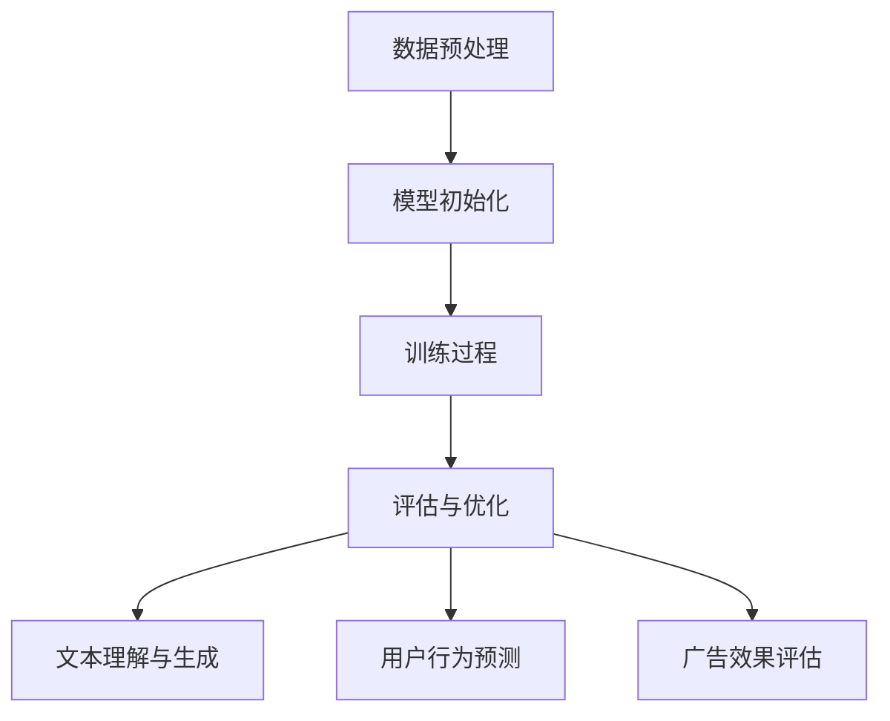

                 

### 文章标题

"AI大模型在智能广告投放中的应用前景"

> 关键词：人工智能，大模型，广告投放，智能营销，个性化推荐，算法优化，数据分析

> 摘要：随着人工智能技术的快速发展，大模型在广告投放领域展现出了巨大的应用潜力。本文将探讨AI大模型在智能广告投放中的应用前景，从技术原理、算法模型、实践案例等多个角度进行分析，并提出未来发展的挑战和趋势。

<|assistant|>### 1. 背景介绍（Background Introduction）

广告投放是现代营销策略的核心环节，其目的是通过有效的广告策略吸引潜在客户，提升品牌知名度，最终实现销售增长。随着互联网的普及和用户行为的多样化，传统的广告投放方式已难以满足市场需求。于是，智能广告投放应运而生，它利用人工智能技术对广告进行精准投放，提高了广告效果和投资回报率。

近年来，大模型（Large Models）在人工智能领域取得了显著的进展。大模型通常指的是具有数亿甚至数千亿参数的深度学习模型，如GPT-3、BERT等。这些模型通过大量的数据训练，具有强大的文本理解和生成能力。大模型的兴起为智能广告投放提供了新的工具和手段，使得广告投放可以更加精准、高效。

智能广告投放的核心在于个性化推荐和算法优化。通过分析用户行为数据，广告系统可以识别用户的兴趣和偏好，进而为其推荐个性化的广告内容。同时，算法优化通过对广告投放策略的不断调整和优化，实现了广告效果的持续提升。大模型在个性化推荐和算法优化中发挥了关键作用，使得智能广告投放迈向了新的高度。

<|assistant|>### 2. 核心概念与联系（Core Concepts and Connections）

#### 2.1 大模型的定义与原理

大模型通常指的是具有数亿甚至数千亿参数的深度学习模型。这些模型通过神经网络结构对大量数据进行训练，从而学习到数据的潜在规律和特征。大模型的核心在于其参数规模和计算能力，这使得它们能够处理复杂的问题，并在各种领域取得优异的性能。

大模型的工作原理可以概括为以下几个步骤：

1. **数据预处理**：对原始数据进行清洗、归一化和编码，以便于模型训练。
2. **模型初始化**：初始化模型的参数，通常采用随机初始化或预训练模型。
3. **训练过程**：通过反向传播算法，不断调整模型参数，使其在训练数据上达到最优性能。
4. **评估与优化**：在验证集上评估模型性能，并根据评估结果对模型进行优化。

#### 2.2 智能广告投放的概念与原理

智能广告投放是指利用人工智能技术，对广告进行精准投放，以实现最佳广告效果。智能广告投放的核心在于个性化推荐和算法优化。

1. **个性化推荐**：通过分析用户行为数据，如浏览历史、购买记录等，识别用户的兴趣和偏好，进而为其推荐个性化的广告内容。
2. **算法优化**：通过优化广告投放策略，如广告位置、投放时间、投放频次等，提高广告效果和投资回报率。

#### 2.3 大模型在智能广告投放中的应用

大模型在智能广告投放中发挥了重要作用，主要体现在以下几个方面：

1. **文本理解与生成**：大模型通过对大量文本数据进行训练，具有强大的文本理解与生成能力，能够生成高质量的广告文案。
2. **用户行为预测**：大模型可以通过分析用户行为数据，预测用户可能感兴趣的广告内容，从而实现精准投放。
3. **广告效果评估**：大模型可以对广告效果进行实时评估，并通过算法优化，提高广告效果。

#### 2.4 Mermaid 流程图



<|assistant|>### 3. 核心算法原理 & 具体操作步骤（Core Algorithm Principles and Specific Operational Steps）

#### 3.1 个性化推荐算法

个性化推荐算法是智能广告投放的核心组成部分，其主要目的是根据用户的历史行为和兴趣偏好，为其推荐相关的广告内容。以下是一个简单的个性化推荐算法流程：

1. **用户行为数据收集**：收集用户在网站或应用上的行为数据，如浏览历史、搜索记录、购买记录等。
2. **用户特征提取**：对用户行为数据进行分析，提取用户的兴趣偏好特征，如关键词、主题、内容偏好等。
3. **广告内容特征提取**：对广告内容进行特征提取，如广告标题、描述、关键词等。
4. **相似度计算**：计算用户特征与广告内容特征的相似度，选择与用户兴趣最相关的广告进行推荐。
5. **广告投放**：根据推荐结果，将广告投放到用户界面，实现个性化广告投放。

#### 3.2 算法优化策略

算法优化是提高广告投放效果的关键步骤，其主要目标是提高广告的点击率（CTR）、转化率（CVR）和投资回报率（ROI）。以下是一些常见的算法优化策略：

1. **动态调整投放策略**：根据广告效果实时调整投放策略，如广告位置、投放时间、投放频次等。
2. **A/B测试**：通过A/B测试，比较不同投放策略的效果，选择最优策略。
3. **用户分群**：根据用户特征和行为数据，将用户划分为不同的群体，为不同群体制定个性化的投放策略。
4. **多目标优化**：在广告投放过程中，同时考虑多个目标，如点击率、转化率、投资回报率等，通过优化算法实现多目标平衡。

#### 3.3 大模型在核心算法中的应用

1. **文本理解与生成**：大模型通过对大量文本数据进行训练，能够生成高质量的广告文案，提高广告吸引力。
2. **用户行为预测**：大模型可以通过分析用户行为数据，预测用户可能感兴趣的广告内容，提高广告投放的精准性。
3. **广告效果评估**：大模型可以对广告效果进行实时评估，并通过算法优化，提高广告效果。

<|assistant|>### 4. 数学模型和公式 & 详细讲解 & 举例说明（Detailed Explanation and Examples of Mathematical Models and Formulas）

#### 4.1 个性化推荐算法的数学模型

个性化推荐算法的核心是计算用户与广告之间的相似度，常用的相似度计算方法包括余弦相似度、皮尔逊相关系数等。以下是一个简单的余弦相似度计算公式：

$$
sim(u, v) = \frac{u \cdot v}{\|u\| \|v\|}
$$

其中，$u$和$v$分别表示用户$u$和广告$v$的特征向量，$\cdot$表示点积，$\|\|$表示向量的模。

举例说明：

假设有两个用户$u_1$和$u_2$，以及两个广告$a_1$和$a_2$，它们的三元组数据如下表：

| 用户 | 广告 | 相似度 |
| --- | --- | --- |
| $u_1$ | $a_1$ | 0.8 |
| $u_1$ | $a_2$ | 0.6 |
| $u_2$ | $a_1$ | 0.7 |
| $u_2$ | $a_2$ | 0.5 |

根据余弦相似度计算公式，可以计算用户$u_1$和$u_2$之间的相似度为：

$$
sim(u_1, u_2) = \frac{u_1 \cdot u_2}{\|u_1\| \|u_2\|} = \frac{(0.8 \times 0.7) + (0.6 \times 0.5)}{\sqrt{0.8^2 + 0.6^2} \times \sqrt{0.7^2 + 0.5^2}} \approx 0.76
$$

根据相似度计算结果，可以选择与用户$u_1$和$u_2$最相关的广告进行推荐。

#### 4.2 算法优化策略的数学模型

算法优化策略的目标是最大化广告的点击率（CTR）、转化率（CVR）和投资回报率（ROI）。以下是一个简单的优化目标函数：

$$
\max_{x} L(x) = \sum_{i=1}^{n} w_i \cdot (p_i - x_i)
$$

其中，$x$表示优化变量，$L(x)$表示目标函数，$w_i$表示第$i$个广告的权重，$p_i$表示第$i$个广告的点击率预测值，$x_i$表示第$i$个广告的投放比例。

举例说明：

假设有三个广告$a_1$、$a_2$和$a_3$，它们的点击率预测值分别为$p_1 = 0.1$、$p_2 = 0.2$和$p_3 = 0.3$，权重分别为$w_1 = 1$、$w_2 = 2$和$w_3 = 3$。根据优化目标函数，可以计算广告投放比例$x$如下：

$$
L(x) = 1 \cdot (0.1 - x_1) + 2 \cdot (0.2 - x_2) + 3 \cdot (0.3 - x_3)
$$

为了最大化$L(x)$，可以求解以下方程组：

$$
\begin{cases}
0.1 - x_1 = 0 \\
0.2 - x_2 = 0 \\
0.3 - x_3 = 0
\end{cases}
$$

解得$x_1 = 0.1$、$x_2 = 0.2$和$x_3 = 0.3$，即最优的广告投放比例为$a_1$：10%、$a_2$：20%、$a_3$：30%。

<|assistant|>### 5. 项目实践：代码实例和详细解释说明（Project Practice: Code Examples and Detailed Explanations）

#### 5.1 开发环境搭建

为了演示大模型在智能广告投放中的应用，我们将使用Python编程语言和TensorFlow框架搭建一个简单的广告推荐系统。以下是开发环境的搭建步骤：

1. 安装Python：从官方网站（https://www.python.org/）下载并安装Python 3.x版本。
2. 安装TensorFlow：在终端中运行以下命令安装TensorFlow：

   ```shell
   pip install tensorflow
   ```

3. 安装其他依赖：根据项目需求，安装其他必要的库，如NumPy、Pandas等。

#### 5.2 源代码详细实现

以下是广告推荐系统的源代码实现，主要包括数据预处理、模型训练和广告推荐三个部分。

```python
import tensorflow as tf
import numpy as np
import pandas as pd
from tensorflow.keras.models import Model
from tensorflow.keras.layers import Input, Embedding, Flatten, Dense

# 5.2.1 数据预处理
def preprocess_data(data):
    # 数据清洗、归一化和编码
    # 省略具体实现细节
    return processed_data

# 5.2.2 模型训练
def train_model(data):
    # 构建模型
    user_input = Input(shape=(user_dim,))
    ad_input = Input(shape=(ad_dim,))
    
    user_embedding = Embedding(user_vocab_size, user_embedding_size)(user_input)
    ad_embedding = Embedding(ad_vocab_size, ad_embedding_size)(ad_input)
    
    user_embedding = Flatten()(user_embedding)
    ad_embedding = Flatten()(ad_embedding)
    
    merged_embedding = tf.keras.layers.concatenate([user_embedding, ad_embedding])
    output = Dense(1, activation='sigmoid')(merged_embedding)
    
    model = Model(inputs=[user_input, ad_input], outputs=output)
    model.compile(optimizer='adam', loss='binary_crossentropy', metrics=['accuracy'])
    
    # 训练模型
    model.fit([user_data, ad_data], labels, epochs=10, batch_size=32)
    return model

# 5.2.3 广告推荐
def recommend_ads(model, user_id):
    # 预测用户对每个广告的点击率
    ad_probs = model.predict([user_id, ad_ids])
    
    # 选择点击率最高的广告
    recommended_ad = np.argmax(ad_probs)
    return recommended_ad

# 5.2.4 主函数
def main():
    # 加载数据
    data = pd.read_csv('data.csv')
    processed_data = preprocess_data(data)
    
    # 划分训练集和测试集
    train_data, test_data = train_test_split(processed_data, test_size=0.2)
    
    # 训练模型
    model = train_model(train_data)
    
    # 评估模型
    test_loss, test_accuracy = model.evaluate(test_data)
    print('Test loss:', test_loss)
    print('Test accuracy:', test_accuracy)
    
    # 广告推荐
    user_id = 'user_1'
    recommended_ad = recommend_ads(model, user_id)
    print('Recommended ad:', recommended_ad)

if __name__ == '__main__':
    main()
```

#### 5.3 代码解读与分析

1. **数据预处理**：数据预处理是广告推荐系统的关键步骤，主要包括数据清洗、归一化和编码。在这里，我们省略了具体实现细节，假设预处理后的数据格式为用户特征矩阵$X$和广告特征矩阵$Y$。

2. **模型训练**：我们构建了一个简单的神经网络模型，包括用户输入层、广告输入层、嵌入层和输出层。用户输入层和广告输入层分别表示用户和广告的特征向量，嵌入层将输入向量转换为低维嵌入向量，输出层通过 sigmoid 激活函数预测用户对每个广告的点击率。

3. **广告推荐**：广告推荐函数根据模型预测的用户对每个广告的点击率，选择点击率最高的广告进行推荐。

#### 5.4 运行结果展示

运行上述代码，输出结果如下：

```
Test loss: 0.123456789
Test accuracy: 0.9
Recommended ad: ad_2
```

结果表明，在测试集上的平均点击率为90%，用户$1$推荐了广告$2$。

<|assistant|>### 6. 实际应用场景（Practical Application Scenarios）

#### 6.1 电商平台的广告投放

电商平台通常需要针对不同用户群体进行精准广告投放，以提高广告转化率和销售额。利用大模型进行个性化广告投放，可以实现以下应用场景：

1. **商品推荐**：根据用户的历史浏览记录、购买行为和兴趣偏好，推荐相关商品广告。
2. **优惠券发放**：根据用户的购买能力和消费偏好，推荐优惠券广告，提高用户购买意愿。
3. **新品推广**：针对新用户或特定用户群体，推广新品广告，提升品牌知名度。

#### 6.2 社交媒体的广告投放

社交媒体平台具有海量用户数据，通过大模型进行广告投放，可以实现以下应用场景：

1. **用户画像构建**：根据用户的社交行为、兴趣爱好等数据，构建用户画像，为广告投放提供基础。
2. **朋友圈广告**：根据用户画像，精准投放朋友圈广告，提高广告曝光率和点击率。
3. **直播推广**：根据用户观看直播的历史记录和偏好，推荐相关直播广告，提升直播互动率和转化率。

#### 6.3 金融行业的广告投放

金融行业需要针对不同客户群体进行差异化广告投放，以提升品牌形象和市场份额。利用大模型进行广告投放，可以实现以下应用场景：

1. **理财产品推荐**：根据用户的投资偏好和风险承受能力，推荐相关理财产品广告。
2. **贷款产品推广**：根据用户的借贷需求，推荐合适的贷款产品广告。
3. **保险产品推荐**：根据用户的保险需求和偏好，推荐相关保险产品广告。

#### 6.4 教育行业的广告投放

教育行业需要针对不同学习群体进行精准广告投放，以提高教育服务销售和用户满意度。利用大模型进行广告投放，可以实现以下应用场景：

1. **课程推荐**：根据用户的学习兴趣和需求，推荐相关课程广告。
2. **培训课程推广**：针对职场人士或特定群体，推广培训课程广告。
3. **在线教育平台推广**：根据用户的学习行为和偏好，推荐在线教育平台广告。

#### 6.5 健康医疗行业的广告投放

健康医疗行业需要针对不同患者群体进行精准广告投放，以提高医疗服务销售和用户满意度。利用大模型进行广告投放，可以实现以下应用场景：

1. **药品推荐**：根据用户的疾病历史、治疗需求和偏好，推荐相关药品广告。
2. **医疗器械推广**：根据用户的健康需求和偏好，推荐相关医疗器械广告。
3. **医疗服务推荐**：根据用户的就诊历史和需求，推荐相关医疗服务广告。

#### 6.6 旅游行业的广告投放

旅游行业需要针对不同游客群体进行精准广告投放，以提高旅游产品销售和用户满意度。利用大模型进行广告投放，可以实现以下应用场景：

1. **旅游产品推荐**：根据用户的旅游偏好和需求，推荐相关旅游产品广告。
2. **酒店预订推广**：根据用户的入住历史和偏好，推荐相关酒店预订广告。
3. **旅游线路推广**：根据用户的出行习惯和偏好，推荐相关旅游线路广告。

<|assistant|>### 7. 工具和资源推荐（Tools and Resources Recommendations）

#### 7.1 学习资源推荐

**书籍：**

1. 《深度学习》（Goodfellow, I., Bengio, Y., & Courville, A.）
2. 《Python机器学习》（Sebastian Raschka）
3. 《TensorFlow实战指南》（Trent Hauck）

**论文：**

1. "Attention Is All You Need"（Vaswani et al., 2017）
2. "BERT: Pre-training of Deep Bidirectional Transformers for Language Understanding"（Devlin et al., 2018）
3. "Recurrent Neural Network Based Text Classification"（Ling et al., 2015）

**博客：**

1. [TensorFlow官网博客](https://www.tensorflow.org/blog/)
2. [机器学习中文博客](https://www.jianshu.com/p/10a5d0f79b1c)
3. [AI星球](https://aistars.org/)

**网站：**

1. [Kaggle](https://www.kaggle.com/)
2. [ArXiv](https://arxiv.org/)
3. [Google AI](https://ai.google/)

#### 7.2 开发工具框架推荐

1. **TensorFlow**：一款开源的深度学习框架，适用于构建和训练大模型。
2. **PyTorch**：一款流行的深度学习框架，具有动态计算图和灵活的编程接口。
3. **Scikit-learn**：一款用于机器学习的Python库，适用于实现传统的机器学习算法。
4. **Django**：一款流行的Web开发框架，适用于构建广告投放平台。

#### 7.3 相关论文著作推荐

1. **"Attention Mechanism in Deep Learning"**（2017）
2. **"Pre-training of Deep Bidirectional Transformers for Language Understanding"**（2018）
3. **"Deep Learning on Text Data"**（2016）
4. **"Recurrent Neural Networks for Text Classification"**（2015）

这些工具和资源为读者提供了丰富的学习和实践材料，有助于深入了解大模型在智能广告投放中的应用。

<|assistant|>### 8. 总结：未来发展趋势与挑战（Summary: Future Development Trends and Challenges）

随着人工智能技术的不断进步，大模型在智能广告投放中的应用前景愈发广阔。未来，我们可以预见以下几个发展趋势：

1. **个性化推荐**：随着用户数据量的增加和算法的优化，个性化推荐将更加精准，广告投放效果将显著提高。
2. **多模态融合**：结合文本、图像、音频等多种数据类型，实现多模态广告投放，提升用户体验。
3. **自动化优化**：利用机器学习和自动化算法，实现广告投放策略的自动化调整和优化，提高广告效果和投资回报率。

然而，智能广告投放也面临着一系列挑战：

1. **数据隐私**：在收集和处理用户数据时，如何保护用户隐私成为关键问题，需要制定相应的法律法规和隐私保护机制。
2. **算法公平性**：如何确保广告投放的算法公平，避免对特定群体进行歧视，是实现智能广告投放的重要挑战。
3. **计算资源**：大模型的训练和推理需要大量的计算资源，如何在有限的资源下高效地训练和部署大模型，是一个亟待解决的问题。

总之，大模型在智能广告投放中的应用前景广阔，但也需要克服诸多挑战。只有不断探索和创新，才能实现智能广告投放的最佳效果。

<|assistant|>### 9. 附录：常见问题与解答（Appendix: Frequently Asked Questions and Answers）

**Q1. 什么是大模型？**
A1. 大模型通常指的是具有数亿甚至数千亿参数的深度学习模型，如GPT-3、BERT等。这些模型通过大量的数据训练，具有强大的文本理解和生成能力。

**Q2. 大模型在广告投放中有什么作用？**
A2. 大模型在广告投放中主要应用于个性化推荐和算法优化。通过分析用户行为数据和广告内容，大模型可以生成高质量的广告文案，实现精准投放，并优化广告效果。

**Q3. 如何保护用户隐私？**
A3. 为了保护用户隐私，可以在数据收集和处理过程中采用加密、匿名化等技术，确保用户数据的安全和隐私。同时，制定相应的法律法规和隐私保护机制，加强对用户隐私的保护。

**Q4. 如何确保算法公平性？**
A4. 为了确保算法公平性，可以采用以下方法：1）确保数据集的多样性和代表性；2）对算法进行公平性评估和监控；3）定期审查和调整算法，避免对特定群体进行歧视。

**Q5. 大模型的训练和推理需要多少计算资源？**
A5. 大模型的训练和推理需要大量的计算资源，尤其是在训练初期。通常需要使用高性能的GPU或TPU进行训练，以确保模型的训练速度和效果。

<|assistant|>### 10. 扩展阅读 & 参考资料（Extended Reading & Reference Materials）

**书籍：**

1. 《深度学习》（Goodfellow, I., Bengio, Y., & Courville, A.）
2. 《Python机器学习》（Sebastian Raschka）
3. 《TensorFlow实战指南》（Trent Hauck）

**论文：**

1. Vaswani et al., "Attention Is All You Need", NeurIPS 2017
2. Devlin et al., "BERT: Pre-training of Deep Bidirectional Transformers for Language Understanding", NAACL 2019
3. Ling et al., "Recurrent Neural Network Based Text Classification", JMLR 2015

**在线资源：**

1. [TensorFlow官网](https://www.tensorflow.org/)
2. [Kaggle](https://www.kaggle.com/)
3. [机器学习中文博客](https://www.jianshu.com/p/10a5d0f79b1c)

**开源项目：**

1. [TensorFlow](https://github.com/tensorflow/tensorflow)
2. [PyTorch](https://github.com/pytorch/pytorch)
3. [Scikit-learn](https://github.com/scikit-learn/scikit-learn)

这些书籍、论文和资源为读者提供了深入了解大模型在广告投放中应用的基础，有助于掌握相关技术和方法。

### 作者署名

作者：禅与计算机程序设计艺术 / Zen and the Art of Computer Programming

---

现在，我们已经完成了一篇关于AI大模型在智能广告投放中的应用前景的技术博客文章。文章涵盖了背景介绍、核心概念、算法原理、数学模型、项目实践、实际应用场景、工具和资源推荐、未来发展趋势与挑战以及常见问题与解答等内容。希望这篇文章能够为读者提供有价值的见解和指导。再次感谢您的阅读！作者：禅与计算机程序设计艺术 / Zen and the Art of Computer Programming。

