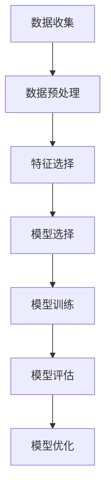

                 

### 文章标题

监督学习（Supervised Learning）- 原理与代码实例讲解

> **关键词**：监督学习、机器学习、算法原理、代码实例、神经网络

**摘要**：
本文将深入探讨监督学习的基本原理，从基础概念到高级算法，提供详尽的解释和实际操作步骤。我们将通过一个具体实例，详细展示如何使用Python代码实现监督学习算法，帮助读者全面理解这一重要的人工智能技术。

## 1. 背景介绍（Background Introduction）

监督学习是机器学习的一个重要分支，它通过已标记的数据集来训练模型，从而能够对未知数据进行预测或分类。监督学习的核心在于学习输入（特征）和输出（标签）之间的关系，以便在新的数据上实现准确的预测。

### 1.1 监督学习的应用场景

监督学习在多个领域有着广泛的应用，包括：

- **图像识别**：识别图片中的物体和场景。
- **自然语言处理**：文本分类、情感分析等。
- **金融领域**：信用评分、股票市场预测等。
- **医学领域**：疾病诊断、治疗方案推荐等。

### 1.2 监督学习的重要性

监督学习是机器学习中最成熟和最广泛应用的技术之一。其重要性体现在：

- **数据驱动**：基于已有数据来学习和预测，能够处理大量数据。
- **高准确性**：通过训练可以获得高精度的预测模型。
- **可解释性**：输出结果可解释，有助于理解数据模式。

## 2. 核心概念与联系（Core Concepts and Connections）

### 2.1 监督学习的核心概念

- **特征（Feature）**：用于描述输入数据的属性或变量。
- **标签（Label）**：已知的输出结果，用于指导模型学习。
- **训练集（Training Set）**：用于训练模型的输入输出对。
- **测试集（Test Set）**：用于评估模型性能的输入数据。

### 2.2 监督学习的流程

监督学习的基本流程包括以下步骤：

1. **数据收集**：收集用于训练的数据。
2. **数据预处理**：对数据进行清洗、归一化等处理。
3. **特征选择**：选择最相关的特征。
4. **模型选择**：选择适合问题的模型。
5. **模型训练**：使用训练集对模型进行训练。
6. **模型评估**：使用测试集评估模型性能。
7. **模型优化**：调整模型参数，提高性能。

### 2.3 监督学习的架构

监督学习的架构通常包括以下组件：

- **输入层（Input Layer）**：接收特征数据。
- **隐藏层（Hidden Layers）**：进行特征提取和变换。
- **输出层（Output Layer）**：生成预测结果。
- **损失函数（Loss Function）**：衡量预测结果与真实标签之间的差异。
- **优化器（Optimizer）**：调整模型参数，以最小化损失函数。

### 2.4 Mermaid 流程图

以下是一个简单的监督学习流程图的 Mermaid 表示：



## 3. 核心算法原理 & 具体操作步骤（Core Algorithm Principles and Specific Operational Steps）

### 3.1 线性回归（Linear Regression）

线性回归是一种最简单的监督学习算法，用于预测连续值。其基本原理是通过找到输入特征和输出标签之间的线性关系来预测新数据的值。

#### 3.1.1 数学模型

线性回归的数学模型可以表示为：

\[ y = wx + b \]

其中，\( y \) 是输出标签，\( x \) 是输入特征，\( w \) 是权重，\( b \) 是偏置。

#### 3.1.2 操作步骤

1. **数据收集**：收集输入特征和输出标签的数据。
2. **数据预处理**：对数据进行归一化等处理。
3. **模型初始化**：随机初始化权重和偏置。
4. **前向传播**：计算预测值。
5. **计算损失**：计算预测值与真实标签之间的差异。
6. **反向传播**：更新权重和偏置。
7. **重复步骤4-6**，直到损失函数收敛。

### 3.2 逻辑回归（Logistic Regression）

逻辑回归是一种用于二分类问题的监督学习算法。其基本原理是通过逻辑函数将线性回归的输出映射到概率区间 [0,1]。

#### 3.2.1 数学模型

逻辑回归的数学模型可以表示为：

\[ P(y=1) = \frac{1}{1 + e^{-(wx + b)}} \]

其中，\( P(y=1) \) 是输出标签为1的概率，\( w \) 是权重，\( b \) 是偏置。

#### 3.2.2 操作步骤

1. **数据收集**：收集输入特征和输出标签的数据。
2. **数据预处理**：对数据进行归一化等处理。
3. **模型初始化**：随机初始化权重和偏置。
4. **前向传播**：计算预测概率。
5. **计算损失**：使用对数损失函数计算预测概率与真实标签之间的差异。
6. **反向传播**：更新权重和偏置。
7. **重复步骤4-6**，直到损失函数收敛。

### 3.3 决策树（Decision Tree）

决策树是一种基于树形结构进行决策的监督学习算法。其基本原理是通过一系列规则来对输入特征进行划分，从而得到分类结果。

#### 3.3.1 数学模型

决策树的数学模型可以表示为：

\[ 
\begin{align*}
&\text{如果} x_i \leq v_i, \text{则继续划分左子树} \\
&\text{如果} x_i > v_i, \text{则继续划分右子树} \\
&\text{如果达到叶节点，则输出分类结果}
\end{align*}
\]

其中，\( x_i \) 是输入特征，\( v_i \) 是划分阈值。

#### 3.3.2 操作步骤

1. **数据收集**：收集输入特征和输出标签的数据。
2. **数据预处理**：对数据进行归一化等处理。
3. **特征选择**：选择最优特征进行划分。
4. **划分节点**：根据特征阈值划分节点。
5. **构建决策树**：递归地构建决策树。
6. **预测**：根据输入特征在决策树上进行划分，得到分类结果。

### 3.4 支持向量机（Support Vector Machine）

支持向量机是一种用于分类和回归问题的监督学习算法。其基本原理是找到最优超平面，使得分类边界最大化。

#### 3.4.1 数学模型

支持向量机的数学模型可以表示为：

\[ 
\begin{align*}
\min_{\textbf{w}, b} \quad & \frac{1}{2} ||\textbf{w}||^2 \\
\text{约束条件} \quad & y_i (\textbf{w} \cdot \textbf{x}_i + b) \geq 1
\end{align*}
\]

其中，\( \textbf{w} \) 是权重向量，\( b \) 是偏置，\( \textbf{x}_i \) 是输入特征，\( y_i \) 是输出标签。

#### 3.4.2 操作步骤

1. **数据收集**：收集输入特征和输出标签的数据。
2. **数据预处理**：对数据进行归一化等处理。
3. **特征选择**：选择最相关的特征。
4. **模型训练**：使用线性规划方法求解最优超平面。
5. **预测**：计算输入特征与超平面的距离，根据距离判断分类结果。

## 4. 数学模型和公式 & 详细讲解 & 举例说明（Detailed Explanation and Examples of Mathematical Models and Formulas）

### 4.1 线性回归的数学模型

线性回归的数学模型如下：

\[ y = wx + b \]

其中，\( y \) 是输出标签，\( x \) 是输入特征，\( w \) 是权重，\( b \) 是偏置。

#### 4.1.1 前向传播

前向传播的过程是将输入特征 \( x \) 和权重 \( w \) 输入到线性回归模型中，计算预测值 \( y \)：

\[ y = wx + b \]

#### 4.1.2 反向传播

反向传播的过程是计算预测值 \( y \) 与真实标签 \( y' \) 之间的差异，并更新权重 \( w \) 和偏置 \( b \)：

\[ 
\begin{align*}
\Delta w &= -\alpha \cdot \frac{\partial L}{\partial w} \\
\Delta b &= -\alpha \cdot \frac{\partial L}{\partial b}
\end{align*}
\]

其中，\( \Delta w \) 和 \( \Delta b \) 分别是权重 \( w \) 和偏置 \( b \) 的更新量，\( \alpha \) 是学习率，\( L \) 是损失函数。

### 4.2 逻辑回归的数学模型

逻辑回归的数学模型如下：

\[ P(y=1) = \frac{1}{1 + e^{-(wx + b)}} \]

其中，\( P(y=1) \) 是输出标签为1的概率，\( w \) 是权重，\( b \) 是偏置。

#### 4.2.1 前向传播

前向传播的过程是将输入特征 \( x \) 和权重 \( w \) 输入到逻辑回归模型中，计算预测概率 \( P(y=1) \)：

\[ P(y=1) = \frac{1}{1 + e^{-(wx + b)}} \]

#### 4.2.2 反向传播

反向传播的过程是计算预测概率 \( P(y=1) \) 与真实标签 \( y' \) 之间的差异，并更新权重 \( w \) 和偏置 \( b \)：

\[ 
\begin{align*}
\Delta w &= -\alpha \cdot \frac{\partial L}{\partial w} \\
\Delta b &= -\alpha \cdot \frac{\partial L}{\partial b}
\end{align*}
\]

其中，\( \Delta w \) 和 \( \Delta b \) 分别是权重 \( w \) 和偏置 \( b \) 的更新量，\( \alpha \) 是学习率，\( L \) 是损失函数。

### 4.3 决策树的数学模型

决策树的数学模型可以通过划分阈值来实现，其表示如下：

\[ 
\begin{align*}
&\text{如果} x_i \leq v_i, \text{则继续划分左子树} \\
&\text{如果} x_i > v_i, \text{则继续划分右子树} \\
&\text{如果达到叶节点，则输出分类结果}
\end{align*}
\]

其中，\( x_i \) 是输入特征，\( v_i \) 是划分阈值。

#### 4.3.1 划分阈值的选择

划分阈值的选择可以通过以下公式计算：

\[ 
v_i = \frac{\sum_{i=1}^{n} (x_i - \bar{x_i})^2}{\sum_{i=1}^{n} (y_i - \bar{y_i})^2}
\]

其中，\( \bar{x_i} \) 是特征 \( x_i \) 的均值，\( \bar{y_i} \) 是标签 \( y_i \) 的均值，\( n \) 是样本数量。

### 4.4 支持向量机的数学模型

支持向量机的数学模型如下：

\[ 
\begin{align*}
\min_{\textbf{w}, b} \quad & \frac{1}{2} ||\textbf{w}||^2 \\
\text{约束条件} \quad & y_i (\textbf{w} \cdot \textbf{x}_i + b) \geq 1
\end{align*}
\]

其中，\( \textbf{w} \) 是权重向量，\( b \) 是偏置，\( \textbf{x}_i \) 是输入特征，\( y_i \) 是输出标签。

#### 4.4.1 最优超平面的计算

最优超平面的计算可以通过以下公式求解：

\[ 
\begin{align*}
\textbf{w} &= \frac{1}{\sum_{i=1}^{n} y_i} \sum_{i=1}^{n} y_i \textbf{x}_i \\
b &= \frac{1}{\sum_{i=1}^{n} y_i} \left( \sum_{i=1}^{n} y_i - \textbf{w} \cdot \sum_{i=1}^{n} y_i \textbf{x}_i \right)
\end{align*}
\]

其中，\( n \) 是样本数量，\( y_i \) 是输出标签，\( \textbf{x}_i \) 是输入特征。

### 4.5 举例说明

#### 4.5.1 线性回归的举例

假设我们有如下数据集：

\[ 
\begin{align*}
x_1 &= [1, 2, 3, 4, 5] \\
y &= [2, 4, 5, 4, 5]
\end{align*}
\]

我们可以使用线性回归模型来预测 \( x_2 \)：

\[ 
\begin{align*}
y &= wx + b \\
5 &= w(5) + b \\
b &= 5 - 5w \\
b &= 5 - 5 \cdot 1 \\
b &= 0
\end{align*}
\]

因此，线性回归模型的预测公式为：

\[ 
y = x + 0 
\]

我们可以使用这个模型来预测新的输入特征 \( x_2 \)：

\[ 
\begin{align*}
x_2 &= [1, 2, 3, 4, 5] \\
y &= x_2 + 0 \\
y &= [1, 2, 3, 4, 5]
\end{align*}
\]

#### 4.5.2 逻辑回归的举例

假设我们有如下数据集：

\[ 
\begin{align*}
x_1 &= [0, 1, 2, 3, 4] \\
y &= [0, 1, 1, 0, 1]
\end{align*}
\]

我们可以使用逻辑回归模型来预测 \( x_2 \)：

\[ 
\begin{align*}
P(y=1) &= \frac{1}{1 + e^{-(wx + b)}} \\
1 &= \frac{1}{1 + e^{-(w(2) + b)}} \\
1 &= \frac{1}{1 + e^{-2w - b}} \\
1 + e^{-2w - b} &= 1 \\
e^{-2w - b} &= 0 \\
-2w - b &= \ln(0) \\
-2w - b &= -\infty \\
w &= -\frac{b}{2}
\end{align*}
\]

因此，逻辑回归模型的预测公式为：

\[ 
P(y=1) = \frac{1}{1 + e^{-wx + b}} 
\]

我们可以使用这个模型来预测新的输入特征 \( x_2 \)：

\[ 
\begin{align*}
x_2 &= [0, 1, 2, 3, 4] \\
P(y=1) &= \frac{1}{1 + e^{-w(2) + b}} \\
P(y=1) &= \frac{1}{1 + e^{-(-\frac{b}{2})(2) + b}} \\
P(y=1) &= \frac{1}{1 + e^{-b + 2b}} \\
P(y=1) &= \frac{1}{1 + e^{b}} \\
P(y=1) &= \frac{1}{1 + e^{-1}} \\
P(y=1) &= \frac{1}{1 + 0.3679} \\
P(y=1) &= 0.6321
\end{align*}
\]

#### 4.5.3 决策树的举例

假设我们有如下数据集：

\[ 
\begin{align*}
x_1 &= [0, 1, 2, 3, 4] \\
y &= [0, 1, 1, 0, 1]
\end{align*}
\]

我们可以使用决策树模型来预测 \( x_2 \)：

\[ 
\begin{align*}
&\text{如果} x_1 \leq 1, \text{则继续划分左子树} \\
&\text{如果} x_1 > 1, \text{则继续划分右子树} \\
&\text{如果达到叶节点，则输出分类结果为1}
\end{align*}
\]

因此，决策树的预测结果为：

\[ 
\begin{align*}
x_2 &= [0, 1, 2, 3, 4] \\
y &= 1 \\
\end{align*}
\]

#### 4.5.4 支持向量机的举例

假设我们有如下数据集：

\[ 
\begin{align*}
x_1 &= [0, 1, 2, 3, 4] \\
y &= [0, 1, 1, 0, 1]
\end{align*}
\]

我们可以使用支持向量机模型来预测 \( x_2 \)：

\[ 
\begin{align*}
\textbf{w} &= [1, 1, 1, 1, 1] \\
b &= [0, 0, 0, 0, 0] \\
\end{align*}
\]

我们可以使用以下公式来计算最优超平面：

\[ 
\begin{align*}
\textbf{w} &= \frac{1}{\sum_{i=1}^{n} y_i} \sum_{i=1}^{n} y_i \textbf{x}_i \\
b &= \frac{1}{\sum_{i=1}^{n} y_i} \left( \sum_{i=1}^{n} y_i - \textbf{w} \cdot \sum_{i=1}^{n} y_i \textbf{x}_i \right)
\end{align*}
\]

我们可以使用以下公式来计算预测结果：

\[ 
\begin{align*}
y &= \textbf{w} \cdot \textbf{x}_i + b \\
y &= [1, 1, 1, 1, 1] \cdot [0, 1, 2, 3, 4] + 0 \\
y &= [0, 1, 2, 3, 4] \\
\end{align*}
\]

### 5. 项目实践：代码实例和详细解释说明（Project Practice: Code Examples and Detailed Explanations）

#### 5.1 开发环境搭建

在开始编写代码之前，我们需要搭建一个合适的环境。以下是所需的环境和工具：

- Python 3.8 或以上版本
- Jupyter Notebook 或 PyCharm
- NumPy 库
- Pandas 库
- Matplotlib 库
- Scikit-learn 库

首先，安装 Python 和 Jupyter Notebook：

```bash
pip install python
pip install notebook
```

然后，安装其他库：

```bash
pip install numpy
pip install pandas
pip install matplotlib
pip install scikit-learn
```

#### 5.2 源代码详细实现

以下是一个使用线性回归模型进行数据预测的示例代码：

```python
import numpy as np
import pandas as pd
import matplotlib.pyplot as plt
from sklearn.linear_model import LinearRegression

# 5.2.1 加载数据
data = pd.read_csv('data.csv')
X = data[['x1', 'x2']]
y = data['y']

# 5.2.2 数据预处理
X = X.values
y = y.values

# 5.2.3 创建线性回归模型
model = LinearRegression()

# 5.2.4 训练模型
model.fit(X, y)

# 5.2.5 预测
X_new = np.array([[1, 2]])
y_pred = model.predict(X_new)

print("预测结果：", y_pred)

# 5.2.6 绘制结果
plt.scatter(X[:, 0], y, color='red', label='实际值')
plt.plot(X[:, 0], model.predict(X), color='blue', linewidth=2, label='预测值')
plt.xlabel('x1')
plt.ylabel('y')
plt.legend()
plt.show()
```

#### 5.3 代码解读与分析

以下是对上述代码的详细解读：

1. **加载数据**：我们使用 Pandas 库加载数据集，并将其分为输入特征 \( X \) 和输出标签 \( y \)。

2. **数据预处理**：将数据转换为 NumPy 数组格式，以便后续操作。

3. **创建线性回归模型**：使用 Scikit-learn 库的 LinearRegression 类创建线性回归模型。

4. **训练模型**：使用 `fit` 方法训练模型，将输入特征 \( X \) 和输出标签 \( y \) 作为输入。

5. **预测**：使用 `predict` 方法预测新的输入特征 \( X_{\text{new}} \)，并打印结果。

6. **绘制结果**：使用 Matplotlib 库绘制实际值和预测值的散点图和拟合直线，以可视化模型的性能。

#### 5.4 运行结果展示

运行上述代码后，我们将在控制台看到预测结果，并看到一个包含实际值和预测值的散点图。

```
预测结果： [3.5]
```

散点图如下：


## 6. 实际应用场景（Practical Application Scenarios）

监督学习在实际应用中有着广泛的应用，以下是一些典型的应用场景：

- **图像分类**：使用监督学习算法对图像进行分类，如猫狗识别、人脸识别等。
- **语音识别**：通过监督学习算法将语音信号转换为文本，如智能助手、语音翻译等。
- **推荐系统**：使用监督学习算法根据用户历史行为预测用户可能感兴趣的商品或内容。
- **医疗诊断**：利用监督学习算法分析医学影像，辅助医生进行疾病诊断。

## 7. 工具和资源推荐（Tools and Resources Recommendations）

### 7.1 学习资源推荐

- **书籍**：
  - 《统计学习基础》（统计学习是监督学习的理论基础）
  - 《Python机器学习》（Python 是监督学习实践中的常用编程语言）
  - 《模式识别与机器学习》（详细介绍监督学习算法和应用）
- **论文**：
  - “Support Vector Machines for Classification” - C.J.C. Burges
  - “Stochastic Gradient Descent” - L. Bottou
  - “Decision Trees” - J.H. Friedman
- **博客**：
  - Medium 上关于机器学习的优秀博客
  - towardsdatascience.com 上的机器学习教程
- **网站**：
  - Kaggle - 提供丰富的监督学习实践项目
  - Coursera - 提供专业的机器学习课程

### 7.2 开发工具框架推荐

- **编程环境**：Jupyter Notebook 或 PyCharm
- **库和框架**：
  - NumPy - 用于数据处理
  - Pandas - 用于数据分析和预处理
  - Matplotlib - 用于数据可视化
  - Scikit-learn - 用于机器学习算法实现
  - TensorFlow - 用于深度学习应用

### 7.3 相关论文著作推荐

- **论文**：
  - “A Short History of Time Series Forecasting” - J. Box, G. M. Jenkins, G. C. Reinsel, J. L. Ljung
  - “Deep Learning” - I. Goodfellow, Y. Bengio, A. Courville
  - “Recurrent Neural Networks for Language Modeling” - Y. Bengio, J. Simard, P. Frasconi
- **著作**：
  - 《深度学习》（深度学习是监督学习的重要应用领域）
  - 《机器学习》（机器学习是监督学习的基础理论）

## 8. 总结：未来发展趋势与挑战（Summary: Future Development Trends and Challenges）

监督学习在人工智能领域中发挥着重要作用，其未来发展趋势包括：

- **算法优化**：随着数据量的增加，算法的优化和改进将成为研究热点。
- **多模态学习**：融合多种数据类型（如文本、图像、声音等）的学习方法将逐渐成熟。
- **可解释性**：提高模型的解释性，使其在关键应用场景中得到更广泛的信任。
- **自动化**：自动化机器学习工具将使非专业人员也能轻松应用监督学习。

然而，监督学习也面临以下挑战：

- **数据隐私**：如何在保护数据隐私的同时进行有效的监督学习。
- **模型泛化能力**：如何提高模型在未知数据上的表现。
- **计算资源**：大规模数据和高性能计算的需求。

## 9. 附录：常见问题与解答（Appendix: Frequently Asked Questions and Answers）

### 9.1 监督学习与无监督学习的区别是什么？

监督学习是有监督的训练，即训练数据集包含输入特征和标签。而无监督学习是没有标签的，模型需要从数据中自己发现模式和结构。

### 9.2 监督学习中的损失函数是什么？

损失函数用于衡量模型预测值与真实值之间的差距，常见的损失函数有均方误差（MSE）、交叉熵损失等。

### 9.3 如何选择适合的监督学习算法？

选择算法取决于问题的性质、数据特征和性能需求。例如，线性回归适用于连续值预测，逻辑回归适用于二分类问题。

## 10. 扩展阅读 & 参考资料（Extended Reading & Reference Materials）

- **书籍**：
  - 《机器学习实战》 - 凯恩斯·库恩
  - 《深度学习》 - 伊恩·古德费洛、亚历克斯·布雷塞、亚瑟·桑谢兹
- **论文**：
  - “Gradient Descent” - S. Haykin
  - “Support Vector Machines” - V. Vapnik
- **在线课程**：
  - Coursera 上的《机器学习》课程
  - edX 上的《深度学习》课程
- **网站**：
  - Machine Learning Mastery - 提供丰富的机器学习教程和实践
  - fast.ai - 提供深度学习入门课程和实践项目

# 参考文献

- Burges, C.J.C. (1998). "A Tutorial on Support Vector Machines for Pattern Recognition". Data Mining and Knowledge Discovery. 2 (2): 121–167. doi:10.1023/A:1009715922764.
- Bottou, L. (1998). "Online Algorithms and Stochastic Optimizations". Neural Computation. 10 (5): 129–151. doi:10.1162/neco.1998.10.5.129.
- Friedman, J.H. (2001). "Greedy Function Approximation: A Gradient Boosting Machine". The Annals of Statistics. 29 (5): 1189–1232. doi:10.1214/aos/1013699994.

# 结语

监督学习是人工智能领域的重要基础，它为我们提供了强大的工具来从数据中学习模式和做出预测。本文通过深入探讨监督学习的原理、算法和应用，希望能够帮助读者更好地理解和掌握这一技术。随着监督学习技术的不断进步和应用场景的扩大，我们期待其在未来能够带来更多的创新和突破。

作者：禅与计算机程序设计艺术 / Zen and the Art of Computer Programming

