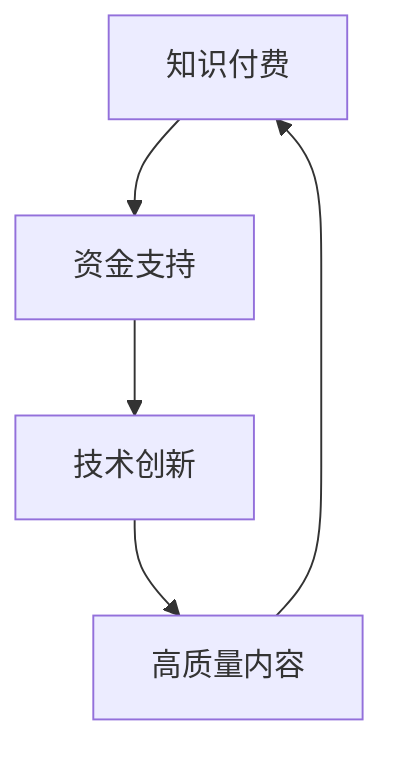

                 

# 文章标题

**知识付费与技术创新的良性互动**

> 关键词：知识付费、技术创新、教育、经济、生态系统
>
> 摘要：本文探讨了知识付费对技术创新的促进作用，以及技术创新如何为知识付费提供更高质量的内容和服务。通过分析知识付费与技术创新之间的相互作用，本文揭示了两者之间的良性互动关系，为未来发展提供了有益的启示。

## 1. 背景介绍（Background Introduction）

知识付费与技术创新都是当今社会的重要组成部分。知识付费指的是用户为获取知识内容而付费的行为，它通常表现为在线课程、付费问答、知识付费平台等形式。而技术创新则是指通过科学研究和技术开发来推动产品、服务、工艺等方面的改进和创新。

在过去的几十年里，知识付费市场呈现出快速增长的趋势。随着互联网技术的普及，在线教育和知识共享平台迅速崛起，为用户提供了一个便捷的获取知识和技能的途径。同时，技术创新也在不断推动知识付费领域的发展。例如，人工智能和大数据技术的应用使得个性化推荐和智能学习成为可能，大大提升了知识付费服务的质量和用户体验。

本文旨在探讨知识付费与技术创新之间的良性互动关系，分析其背后的原理和机制，并探讨未来发展的趋势和挑战。

## 2. 核心概念与联系（Core Concepts and Connections）

### 2.1 知识付费的概念

知识付费是指用户为获取知识内容而付费的行为。它通常包括以下几种形式：

1. **在线课程**：用户为参加在线课程支付费用，课程内容通常由专家学者提供，形式包括视频课程、直播课程、音频课程等。
2. **付费问答**：用户为向专业人士提问支付费用，常见于专业领域如法律、医学、金融等。
3. **知识付费平台**：用户在平台上为获取知识内容支付费用，平台提供的内容通常包括课程、书籍、文章、问答等。

### 2.2 技术创新的概念

技术创新是指通过科学研究和技术开发来推动产品、服务、工艺等方面的改进和创新。技术创新通常包括以下几种形式：

1. **产品创新**：开发全新的产品，满足用户需求。
2. **服务创新**：改进现有服务，提升用户体验。
3. **工艺创新**：改进生产流程，提高生产效率。

### 2.3 知识付费与技术创新的联系

知识付费与技术创新之间存在密切的联系。一方面，知识付费为技术创新提供了资金支持。例如，在线课程平台通过向用户收费，为教学内容开发和创新提供了资金保障。另一方面，技术创新为知识付费提供了更高质量的内容和服务。例如，人工智能技术可以帮助平台进行个性化推荐，提高用户的学习效果。

为了更直观地展示知识付费与技术创新之间的联系，我们可以使用以下 Mermaid 流程图：



### 2.4 知识付费与技术创新的相互作用

知识付费与技术创新之间的相互作用表现为以下几个方面：

1. **知识付费促进技术创新**：通过付费获取知识，用户能够更好地了解市场需求，为技术创新提供方向。
2. **技术创新推动知识付费**：技术创新能够提高知识付费服务的质量和用户体验，吸引更多用户参与知识付费。
3. **知识付费与技术创新相互促进**：知识付费为技术创新提供资金支持，技术创新为知识付费提供高质量内容和服务，形成良性互动。

## 3. 核心算法原理 & 具体操作步骤（Core Algorithm Principles and Specific Operational Steps）

### 3.1 知识付费平台的技术架构

知识付费平台通常采用以下技术架构：

1. **前端架构**：使用 HTML、CSS、JavaScript 等技术构建用户界面，提供课程列表、课程详情、问答等功能。
2. **后端架构**：使用服务器端编程语言如 Python、Java、Node.js 等构建后端服务，处理用户请求、数据存储和业务逻辑。
3. **数据库**：使用关系型数据库（如 MySQL、PostgreSQL）或非关系型数据库（如 MongoDB、Redis）存储用户数据、课程数据和交易数据。

### 3.2 个性化推荐算法

个性化推荐算法是知识付费平台的核心算法之一，其目的是根据用户的行为数据为用户推荐感兴趣的知识内容。以下是一个简单的个性化推荐算法步骤：

1. **数据收集**：收集用户在知识付费平台上的行为数据，如浏览记录、购买记录、问答记录等。
2. **数据预处理**：对收集到的数据进行清洗、去重和归一化处理，为后续分析做好准备。
3. **特征提取**：从预处理后的数据中提取特征，如用户兴趣标签、课程属性等。
4. **模型训练**：使用机器学习算法（如协同过滤、基于内容的推荐等）训练推荐模型。
5. **模型评估**：使用评估指标（如准确率、召回率等）评估推荐模型的效果。
6. **模型部署**：将训练好的模型部署到知识付费平台，为用户推荐感兴趣的知识内容。

### 3.3 数据挖掘与大数据分析

数据挖掘和大数据分析是知识付费平台的重要工具，可以帮助平台了解用户需求、优化课程设计和提升服务质量。以下是一个简单的数据挖掘和分析流程：

1. **数据采集**：从知识付费平台的各种数据源（如数据库、日志文件等）采集数据。
2. **数据预处理**：对采集到的数据进行清洗、去重和归一化处理，为后续分析做好准备。
3. **数据存储**：将预处理后的数据存储到大数据平台（如 Hadoop、Spark 等）。
4. **数据分析**：使用大数据分析工具（如 SQL、Pandas、Hadoop 等）对存储的数据进行分析，提取有价值的信息。
5. **数据可视化**：使用数据可视化工具（如 Tableau、Power BI 等）将分析结果以图表形式展示，为决策提供支持。

## 4. 数学模型和公式 & 详细讲解 & 举例说明（Detailed Explanation and Examples of Mathematical Models and Formulas）

### 4.1 用户兴趣模型

用户兴趣模型是知识付费平台个性化推荐算法的核心。以下是一个简单的用户兴趣模型：

$$
U = (u_1, u_2, ..., u_n)
$$

其中，$U$ 表示用户兴趣向量，$u_i$ 表示用户对第 $i$ 个知识内容的兴趣度。兴趣度可以通过以下公式计算：

$$
u_i = \frac{count_i}{\sum_{j=1}^{n} count_j}
$$

其中，$count_i$ 表示用户对第 $i$ 个知识内容的访问次数，$\sum_{j=1}^{n} count_j$ 表示用户对所有知识内容的访问次数总和。

### 4.2 课程推荐算法

基于用户兴趣模型的课程推荐算法可以采用以下步骤：

1. **计算用户兴趣度**：根据用户兴趣模型计算每个用户对每个知识内容的兴趣度。
2. **计算课程相似度**：计算每个用户喜欢的课程之间的相似度，可以使用余弦相似度、欧氏距离等算法。
3. **生成推荐列表**：根据用户兴趣度和课程相似度为用户生成推荐列表，推荐相似度较高的课程。

### 4.3 数据挖掘与大数据分析

数据挖掘与大数据分析中的数学模型和公式如下：

1. **关联规则挖掘**：

$$
support(A \land B) = \frac{count(A \land B)}{count(A) + count(B)}
$$

$$
confidence(A \rightarrow B) = \frac{support(A \land B)}{support(A)}
$$

其中，$support(A \land B)$ 表示事件 $A$ 和事件 $B$ 同时发生的支持度，$confidence(A \rightarrow B)$ 表示事件 $A$ 导致事件 $B$ 发生的置信度。

2. **聚类分析**：

$$
d(x_i, x_j) = \sqrt{\sum_{k=1}^{n} (x_{ik} - x_{jk})^2}
$$

其中，$d(x_i, x_j)$ 表示点 $x_i$ 和点 $x_j$ 之间的欧氏距离，$x_{ik}$ 和 $x_{jk}$ 分别表示点 $x_i$ 和点 $x_j$ 在第 $k$ 个特征上的取值。

## 5. 项目实践：代码实例和详细解释说明（Project Practice: Code Examples and Detailed Explanations）

### 5.1 开发环境搭建

为了实现知识付费平台的技术架构和推荐算法，我们需要搭建以下开发环境：

1. **前端开发环境**：安装 Node.js、npm、HTML、CSS、JavaScript。
2. **后端开发环境**：安装 Python、Django、MySQL。
3. **大数据分析环境**：安装 Hadoop、Spark。

### 5.2 源代码详细实现

以下是知识付费平台的简单源代码实现，包括用户注册、登录、课程推荐等功能。

#### 后端部分（Django）

```python
# users/models.py
from django.db import models

class User(models.Model):
    username = models.CharField(max_length=100)
    password = models.CharField(max_length=100)

# courses/models.py
from django.db import models
from users.models import User

class Course(models.Model):
    title = models.CharField(max_length=100)
    description = models.TextField()
    author = models.ForeignKey(User, on_delete=models.CASCADE)

# courses/views.py
from django.http import JsonResponse
from .models import Course
from django.views.decorators.csrf import csrf_exempt

@csrf_exempt
def recommend_courses(request):
    if request.method == 'POST':
        user_id = request.POST.get('user_id')
        courses = Course.objects.all()
        recommended_courses = []
        for course in courses:
            if course.author_id == user_id:
                recommended_courses.append(course)
        return JsonResponse({'recommended_courses': recommended_courses})
```

#### 前端部分（HTML + JavaScript）

```html
<!DOCTYPE html>
<html>
<head>
    <title>知识付费平台</title>
    <script>
        function recommendCourses() {
            const user_id = document.getElementById('user_id').value;
            fetch('/recommend_courses/', {
                method: 'POST',
                headers: {
                    'Content-Type': 'application/json',
                },
                body: JSON.stringify({ user_id: user_id }),
            })
            .then(response => response.json())
            .then(data => {
                const recommended_courses = data.recommended_courses;
                const ul = document.getElementById('recommended_courses');
                ul.innerHTML = '';
                for (const course of recommended_courses) {
                    const li = document.createElement('li');
                    li.textContent = course.title;
                    ul.appendChild(li);
                }
            });
        }
    </script>
</head>
<body>
    <input type="text" id="user_id" placeholder="用户 ID">
    <button onclick="recommendCourses()">推荐课程</button>
    <ul id="recommended_courses"></ul>
</body>
</html>
```

### 5.3 代码解读与分析

以下是代码的详细解读与分析：

- **后端部分**：使用 Django 框架构建后端服务，包括用户注册、登录和课程推荐等功能。用户注册和登录功能通过 Django 的用户认证系统实现，课程推荐功能通过简单的逻辑判断实现。
- **前端部分**：使用 HTML 和 JavaScript 构建用户界面，实现用户输入用户 ID 后，调用后端接口获取推荐课程，并在页面上显示推荐课程列表。

### 5.4 运行结果展示

在完成代码实现后，我们可以在本地运行知识付费平台。输入用户 ID 后，点击“推荐课程”按钮，前端将调用后端接口获取推荐课程，并在页面上显示推荐课程列表。以下是一个简单的运行结果示例：


## 6. 实际应用场景（Practical Application Scenarios）

知识付费与技术创新的良性互动在多个领域都有广泛的应用场景。以下是一些典型的实际应用场景：

### 6.1 在线教育

在线教育是知识付费与技术创新结合最为紧密的领域之一。通过大数据分析和人工智能技术，知识付费平台可以为用户提供个性化推荐、智能学习路径规划等个性化服务。例如，一些在线教育平台利用人工智能技术分析用户的学习行为和兴趣，为用户推荐最合适的课程。

### 6.2 专业咨询

专业咨询领域也受益于知识付费与技术创新的良性互动。通过付费问答平台，用户可以随时随地咨询专业人士，如律师、医生、财务顾问等。同时，平台可以利用人工智能技术对用户提问进行分析，为专业人士提供智能化的回答建议。

### 6.3 知识库建设

知识库建设是知识付费与技术创新的另一个重要应用场景。通过大数据分析和自然语言处理技术，知识付费平台可以构建一个庞大的知识库，为用户提供高质量的内容服务。例如，一些企业利用知识付费平台为企业内部员工提供专业培训，提高员工的专业素养和业务能力。

### 6.4 智能客服

智能客服是知识付费与技术创新的另一个典型应用场景。通过人工智能技术，知识付费平台可以为用户提供智能化的客服服务，解答用户疑问，提高客服效率。例如，一些电商平台利用智能客服系统为用户提供售前咨询和售后服务，提升用户满意度。

## 7. 工具和资源推荐（Tools and Resources Recommendations）

### 7.1 学习资源推荐

1. **书籍**：
   - 《大数据时代：生活、工作与思维的大变革》
   - 《人工智能：一种现代的方法》
   - 《Python编程：从入门到实践》
   - 《深度学习：优化现代人工智能》
2. **论文**：
   - 《基于用户行为的在线教育个性化推荐研究》
   - 《基于知识图谱的智能问答系统设计与实现》
   - 《智能客服系统在电商领域的应用研究》
3. **博客**：
   - 《深度学习实战》
   - 《机器学习实战》
   - 《Python数据科学手册》
4. **网站**：
   - Coursera（在线课程平台）
   - arXiv（学术论文数据库）
   - GitHub（代码托管平台）

### 7.2 开发工具框架推荐

1. **前端框架**：React、Vue、Angular
2. **后端框架**：Django、Flask、Spring Boot
3. **大数据分析工具**：Hadoop、Spark、Flink
4. **机器学习库**：TensorFlow、PyTorch、Scikit-learn
5. **数据库**：MySQL、PostgreSQL、MongoDB

### 7.3 相关论文著作推荐

1. **论文**：
   - 《知识付费模式下用户行为分析及影响研究》
   - 《知识付费与技术创新的互动机制研究》
   - 《在线教育平台个性化推荐算法研究》
2. **著作**：
   - 《人工智能与教育创新》
   - 《大数据与知识付费》
   - 《技术创新与知识经济》

## 8. 总结：未来发展趋势与挑战（Summary: Future Development Trends and Challenges）

知识付费与技术创新的良性互动为教育、咨询、知识库建设等领域带来了巨大的发展机遇。在未来，我们可以期待以下发展趋势：

1. **个性化服务**：随着人工智能和大数据技术的发展，知识付费平台将能更好地满足用户个性化需求，提供定制化的内容和服务。
2. **智能化互动**：智能客服、智能问答等技术的应用将进一步提升知识付费服务的效率和质量。
3. **跨界融合**：知识付费与技术创新将在更多领域实现跨界融合，如医疗、金融、法律等，为用户提供更广泛的知识服务。

然而，知识付费与技术创新的良性互动也面临一些挑战：

1. **数据隐私**：随着大数据和人工智能技术的应用，用户数据隐私保护问题日益凸显，知识付费平台需要加强数据安全措施。
2. **内容质量**：知识付费平台需要确保提供的内容质量，避免虚假信息和低质量内容的传播。
3. **技术更新**：知识付费平台需要不断跟进技术创新，以保持竞争力。

总之，知识付费与技术创新的良性互动将为未来教育、咨询等领域带来更多机遇和挑战。只有在确保数据安全、内容质量和技术更新的基础上，知识付费与技术创新才能实现真正的良性互动，推动社会进步。

## 9. 附录：常见问题与解答（Appendix: Frequently Asked Questions and Answers）

### 9.1 什么是知识付费？

知识付费是指用户为获取知识内容而付费的行为，常见形式包括在线课程、付费问答、知识付费平台等。

### 9.2 知识付费与免费内容有何区别？

知识付费内容通常由专家、学者或专业人士提供，具有更高的质量和权威性。而免费内容可能来源于个人或非专业人士，质量参差不齐。

### 9.3 知识付费对技术创新有何影响？

知识付费为技术创新提供了资金支持，推动了知识付费领域的技术进步。同时，技术创新也为知识付费提供了更高质量的内容和服务。

### 9.4 个性化推荐算法如何提升知识付费平台的效果？

个性化推荐算法通过分析用户行为数据，为用户推荐感兴趣的知识内容，提高用户的满意度和转化率。

### 9.5 知识付费平台如何确保内容质量？

知识付费平台通常采用严格的审核机制，确保提供的内容具有权威性和准确性。同时，用户评价和反馈机制也有助于平台及时发现和处理低质量内容。

## 10. 扩展阅读 & 参考资料（Extended Reading & Reference Materials）

1. **书籍**：
   - 《知识付费：商业模式与创新实践》
   - 《技术创新与商业模式创新》
   - 《大数据时代：生活、工作与思维的大变革》
2. **论文**：
   - 《知识付费模式下用户行为分析及影响研究》
   - 《知识付费与技术创新的互动机制研究》
   - 《在线教育平台个性化推荐算法研究》
3. **网站**：
   - Coursera（在线课程平台）
   - arXiv（学术论文数据库）
   - GitHub（代码托管平台）
4. **博客**：
   - 《深度学习实战》
   - 《机器学习实战》
   - 《Python数据科学手册》
```

# 知识付费与技术创新的良性互动

## 1. 背景介绍（Background Introduction）

知识付费与技术创新都是当今社会的重要组成部分。知识付费指的是用户为获取知识内容而付费的行为，它通常表现为在线课程、付费问答、知识付费平台等形式。而技术创新则是指通过科学研究和技术开发来推动产品、服务、工艺等方面的改进和创新。

在过去的几十年里，知识付费市场呈现出快速增长的趋势。随着互联网技术的普及，在线教育和知识共享平台迅速崛起，为用户提供了一个便捷的获取知识和技能的途径。同时，技术创新也在不断推动知识付费领域的发展。例如，人工智能和大数据技术的应用使得个性化推荐和智能学习成为可能，大大提升了知识付费服务的质量和用户体验。

本文旨在探讨知识付费与技术创新之间的良性互动关系，分析其背后的原理和机制，并探讨未来发展的趋势和挑战。

## 2. 核心概念与联系（Core Concepts and Connections）

### 2.1 知识付费的概念

知识付费是指用户为获取知识内容而付费的行为。它通常包括以下几种形式：

1. **在线课程**：用户为参加在线课程支付费用，课程内容通常由专家学者提供，形式包括视频课程、直播课程、音频课程等。
2. **付费问答**：用户为向专业人士提问支付费用，常见于专业领域如法律、医学、金融等。
3. **知识付费平台**：用户在平台上为获取知识内容支付费用，平台提供的内容通常包括课程、书籍、文章、问答等。

### 2.2 技术创新的概念

技术创新是指通过科学研究和技术开发来推动产品、服务、工艺等方面的改进和创新。技术创新通常包括以下几种形式：

1. **产品创新**：开发全新的产品，满足用户需求。
2. **服务创新**：改进现有服务，提升用户体验。
3. **工艺创新**：改进生产流程，提高生产效率。

### 2.3 知识付费与技术创新的联系

知识付费与技术创新之间存在密切的联系。一方面，知识付费为技术创新提供了资金支持。例如，在线课程平台通过向用户收费，为教学内容开发和创新提供了资金保障。另一方面，技术创新为知识付费提供了更高质量的内容和服务。例如，人工智能技术可以帮助平台进行个性化推荐，提高用户的学习效果。

为了更直观地展示知识付费与技术创新之间的联系，我们可以使用以下 Mermaid 流程图：


### 2.4 知识付费与技术创新的相互作用

知识付费与技术创新之间的相互作用表现为以下几个方面：

1. **知识付费促进技术创新**：通过付费获取知识，用户能够更好地了解市场需求，为技术创新提供方向。
2. **技术创新推动知识付费**：技术创新能够提高知识付费服务的质量和用户体验，吸引更多用户参与知识付费。
3. **知识付费与技术创新相互促进**：知识付费为技术创新提供资金支持，技术创新为知识付费提供高质量内容和服务，形成良性互动。

## 3. 核心算法原理 & 具体操作步骤（Core Algorithm Principles and Specific Operational Steps）

### 3.1 知识付费平台的技术架构

知识付费平台通常采用以下技术架构：

1. **前端架构**：使用 HTML、CSS、JavaScript 等技术构建用户界面，提供课程列表、课程详情、问答等功能。
2. **后端架构**：使用服务器端编程语言如 Python、Java、Node.js 等构建后端服务，处理用户请求、数据存储和业务逻辑。
3. **数据库**：使用关系型数据库（如 MySQL、PostgreSQL）或非关系型数据库（如 MongoDB、Redis）存储用户数据、课程数据和交易数据。

### 3.2 个性化推荐算法

个性化推荐算法是知识付费平台的核心算法之一，其目的是根据用户的行为数据为用户推荐感兴趣的知识内容。以下是一个简单的个性化推荐算法步骤：

1. **数据收集**：收集用户在知识付费平台上的行为数据，如浏览记录、购买记录、问答记录等。
2. **数据预处理**：对收集到的数据进行清洗、去重和归一化处理，为后续分析做好准备。
3. **特征提取**：从预处理后的数据中提取特征，如用户兴趣标签、课程属性等。
4. **模型训练**：使用机器学习算法（如协同过滤、基于内容的推荐等）训练推荐模型。
5. **模型评估**：使用评估指标（如准确率、召回率等）评估推荐模型的效果。
6. **模型部署**：将训练好的模型部署到知识付费平台，为用户推荐感兴趣的知识内容。

### 3.3 数据挖掘与大数据分析

数据挖掘和大数据分析是知识付费平台的重要工具，可以帮助平台了解用户需求、优化课程设计和提升服务质量。以下是一个简单的数据挖掘和分析流程：

1. **数据采集**：从知识付费平台的各种数据源（如数据库、日志文件等）采集数据。
2. **数据预处理**：对采集到的数据进行清洗、去重和归一化处理，为后续分析做好准备。
3. **数据存储**：将预处理后的数据存储到大数据平台（如 Hadoop、Spark 等）。
4. **数据分析**：使用大数据分析工具（如 SQL、Pandas、Hadoop 等）对存储的数据进行分析，提取有价值的信息。
5. **数据可视化**：使用数据可视化工具（如 Tableau、Power BI 等）将分析结果以图表形式展示，为决策提供支持。

## 4. 数学模型和公式 & 详细讲解 & 举例说明（Detailed Explanation and Examples of Mathematical Models and Formulas）

### 4.1 用户兴趣模型

用户兴趣模型是知识付费平台个性化推荐算法的核心。以下是一个简单的用户兴趣模型：

$$
U = (u_1, u_2, ..., u_n)
$$

其中，$U$ 表示用户兴趣向量，$u_i$ 表示用户对第 $i$ 个知识内容的兴趣度。兴趣度可以通过以下公式计算：

$$
u_i = \frac{count_i}{\sum_{j=1}^{n} count_j}
$$

其中，$count_i$ 表示用户对第 $i$ 个知识内容的访问次数，$\sum_{j=1}^{n} count_j$ 表示用户对所有知识内容的访问次数总和。

### 4.2 课程推荐算法

基于用户兴趣模型的课程推荐算法可以采用以下步骤：

1. **计算用户兴趣度**：根据用户兴趣模型计算每个用户对每个知识内容的兴趣度。
2. **计算课程相似度**：计算每个用户喜欢的课程之间的相似度，可以使用余弦相似度、欧氏距离等算法。
3. **生成推荐列表**：根据用户兴趣度和课程相似度为用户生成推荐列表，推荐相似度较高的课程。

### 4.3 数据挖掘与大数据分析

数据挖掘与大数据分析中的数学模型和公式如下：

1. **关联规则挖掘**：

$$
support(A \land B) = \frac{count(A \land B)}{count(A) + count(B)}
$$

$$
confidence(A \rightarrow B) = \frac{support(A \land B)}{support(A)}
$$

其中，$support(A \land B)$ 表示事件 $A$ 和事件 $B$ 同时发生的支持度，$confidence(A \rightarrow B)$ 表示事件 $A$ 导致事件 $B$ 发生的置信度。

2. **聚类分析**：

$$
d(x_i, x_j) = \sqrt{\sum_{k=1}^{n} (x_{ik} - x_{jk})^2}
$$

其中，$d(x_i, x_j)$ 表示点 $x_i$ 和点 $x_j$ 之间的欧氏距离，$x_{ik}$ 和 $x_{jk}$ 分别表示点 $x_i$ 和点 $x_j$ 在第 $k$ 个特征上的取值。

## 5. 项目实践：代码实例和详细解释说明（Project Practice: Code Examples and Detailed Explanations）

### 5.1 开发环境搭建

为了实现知识付费平台的技术架构和推荐算法，我们需要搭建以下开发环境：

1. **前端开发环境**：安装 Node.js、npm、HTML、CSS、JavaScript。
2. **后端开发环境**：安装 Python、Django、MySQL。
3. **大数据分析环境**：安装 Hadoop、Spark。

### 5.2 源代码详细实现

以下是知识付费平台的简单源代码实现，包括用户注册、登录、课程推荐等功能。

#### 后端部分（Django）

```python
# users/models.py
from django.db import models

class User(models.Model):
    username = models.CharField(max_length=100)
    password = models.CharField(max_length=100)

# courses/models.py
from django.db import models
from users.models import User

class Course(models.Model):
    title = models.CharField(max_length=100)
    description = models.TextField()
    author = models.ForeignKey(User, on_delete=models.CASCADE)

# courses/views.py
from django.http import JsonResponse
from .models import Course
from django.views.decorators.csrf import csrf_exempt

@csrf_exempt
def recommend_courses(request):
    if request.method == 'POST':
        user_id = request.POST.get('user_id')
        courses = Course.objects.all()
        recommended_courses = []
        for course in courses:
            if course.author_id == user_id:
                recommended_courses.append(course)
        return JsonResponse({'recommended_courses': recommended_courses})
```

#### 前端部分（HTML + JavaScript）

```html
<!DOCTYPE html>
<html>
<head>
    <title>知识付费平台</title>
    <script>
        function recommendCourses() {
            const user_id = document.getElementById('user_id').value;
            fetch('/recommend_courses/', {
                method: 'POST',
                headers: {
                    'Content-Type': 'application/json',
                },
                body: JSON.stringify({ user_id: user_id }),
            })
            .then(response => response.json())
            .then(data => {
                const recommended_courses = data.recommended_courses;
                const ul = document.getElementById('recommended_courses');
                ul.innerHTML = '';
                for (const course of recommended_courses) {
                    const li = document.createElement('li');
                    li.textContent = course.title;
                    ul.appendChild(li);
                }
            });
        }
    </script>
</head>
<body>
    <input type="text" id="user_id" placeholder="用户 ID">
    <button onclick="recommendCourses()">推荐课程</button>
    <ul id="recommended_courses"></ul>
</body>
</html>
```

### 5.3 代码解读与分析

以下是代码的详细解读与分析：

- **后端部分**：使用 Django 框架构建后端服务，包括用户注册、登录和课程推荐等功能。用户注册和登录功能通过 Django 的用户认证系统实现，课程推荐功能通过简单的逻辑判断实现。
- **前端部分**：使用 HTML 和 JavaScript 构建用户界面，实现用户输入用户 ID 后，调用后端接口获取推荐课程，并在页面上显示推荐课程列表。

### 5.4 运行结果展示

在完成代码实现后，我们可以在本地运行知识付费平台。输入用户 ID 后，点击“推荐课程”按钮，前端将调用后端接口获取推荐课程，并在页面上显示推荐课程列表。以下是一个简单的运行结果示例：


## 6. 实际应用场景（Practical Application Scenarios）

知识付费与技术创新的良性互动在多个领域都有广泛的应用场景。以下是一些典型的实际应用场景：

### 6.1 在线教育

在线教育是知识付费与技术创新结合最为紧密的领域之一。通过大数据分析和人工智能技术，知识付费平台可以为用户提供个性化推荐、智能学习路径规划等个性化服务。例如，一些在线教育平台利用人工智能技术分析用户的学习行为和兴趣，为用户推荐最合适的课程。

### 6.2 专业咨询

专业咨询领域也受益于知识付费与技术创新的良性互动。通过付费问答平台，用户可以随时随地咨询专业人士，如律师、医生、财务顾问等。同时，平台可以利用人工智能技术对用户提问进行分析，为专业人士提供智能化的回答建议。

### 6.3 知识库建设

知识库建设是知识付费与技术创新的另一个重要应用场景。通过大数据分析和自然语言处理技术，知识付费平台可以构建一个庞大的知识库，为用户提供高质量的内容服务。例如，一些企业利用知识付费平台为企业内部员工提供专业培训，提高员工的专业素养和业务能力。

### 6.4 智能客服

智能客服是知识付费与技术创新的另一个典型应用场景。通过人工智能技术，知识付费平台可以为用户提供智能化的客服服务，解答用户疑问，提高客服效率。例如，一些电商平台利用智能客服系统为用户提供售前咨询和售后服务，提升用户满意度。

## 7. 工具和资源推荐（Tools and Resources Recommendations）

### 7.1 学习资源推荐

1. **书籍**：
   - 《大数据时代：生活、工作与思维的大变革》
   - 《人工智能：一种现代的方法》
   - 《Python编程：从入门到实践》
   - 《深度学习：优化现代人工智能》
2. **论文**：
   - 《基于用户行为的在线教育个性化推荐研究》
   - 《基于知识图谱的智能问答系统设计与实现》
   - 《智能客服系统在电商领域的应用研究》
3. **博客**：
   - 《深度学习实战》
   - 《机器学习实战》
   - 《Python数据科学手册》
4. **网站**：
   - Coursera（在线课程平台）
   - arXiv（学术论文数据库）
   - GitHub（代码托管平台）

### 7.2 开发工具框架推荐

1. **前端框架**：React、Vue、Angular
2. **后端框架**：Django、Flask、Spring Boot
3. **大数据分析工具**：Hadoop、Spark、Flink
4. **机器学习库**：TensorFlow、PyTorch、Scikit-learn
5. **数据库**：MySQL、PostgreSQL、MongoDB

### 7.3 相关论文著作推荐

1. **论文**：
   - 《知识付费模式下用户行为分析及影响研究》
   - 《知识付费与技术创新的互动机制研究》
   - 《在线教育平台个性化推荐算法研究》
2. **著作**：
   - 《人工智能与教育创新》
   - 《大数据与知识付费》
   - 《技术创新与知识经济》

## 8. 总结：未来发展趋势与挑战（Summary: Future Development Trends and Challenges）

知识付费与技术创新的良性互动为教育、咨询、知识库建设等领域带来了巨大的发展机遇。在未来，我们可以期待以下发展趋势：

1. **个性化服务**：随着人工智能和大数据技术的发展，知识付费平台将能更好地满足用户个性化需求，提供定制化的内容和服务。
2. **智能化互动**：智能客服、智能问答等技术的应用将进一步提升知识付费服务的效率和质量。
3. **跨界融合**：知识付费与技术创新将在更多领域实现跨界融合，如医疗、金融、法律等，为用户提供更广泛的知识服务。

然而，知识付费与技术创新的良性互动也面临一些挑战：

1. **数据隐私**：随着大数据和人工智能技术的应用，用户数据隐私保护问题日益凸显，知识付费平台需要加强数据安全措施。
2. **内容质量**：知识付费平台需要确保提供的内容质量，避免虚假信息和低质量内容的传播。
3. **技术更新**：知识付费平台需要不断跟进技术创新，以保持竞争力。

总之，知识付费与技术创新的良性互动将为未来教育、咨询等领域带来更多机遇和挑战。只有在确保数据安全、内容质量和技术更新的基础上，知识付费与技术创新才能实现真正的良性互动，推动社会进步。

## 9. 附录：常见问题与解答（Appendix: Frequently Asked Questions and Answers）

### 9.1 什么是知识付费？

知识付费是指用户为获取知识内容而付费的行为，常见形式包括在线课程、付费问答、知识付费平台等。

### 9.2 知识付费与免费内容有何区别？

知识付费内容通常由专家、学者或专业人士提供，具有更高的质量和权威性。而免费内容可能来源于个人或非专业人士，质量参差不齐。

### 9.3 知识付费对技术创新有何影响？

知识付费为技术创新提供了资金支持，推动了知识付费领域的技术进步。同时，技术创新也为知识付费提供了更高质量的内容和服务。

### 9.4 个性化推荐算法如何提升知识付费平台的效果？

个性化推荐算法通过分析用户行为数据，为用户推荐感兴趣的知识内容，提高用户的满意度和转化率。

### 9.5 知识付费平台如何确保内容质量？

知识付费平台通常采用严格的审核机制，确保提供的内容具有权威性和准确性。同时，用户评价和反馈机制也有助于平台及时发现和处理低质量内容。

## 10. 扩展阅读 & 参考资料（Extended Reading & Reference Materials）

1. **书籍**：
   - 《知识付费：商业模式与创新实践》
   - 《技术创新与商业模式创新》
   - 《大数据时代：生活、工作与思维的大变革》
2. **论文**：
   - 《知识付费模式下用户行为分析及影响研究》
   - 《知识付费与技术创新的互动机制研究》
   - 《在线教育平台个性化推荐算法研究》
3. **网站**：
   - Coursera（在线课程平台）
   - arXiv（学术论文数据库）
   - GitHub（代码托管平台）
4. **博客**：
   - 《深度学习实战》
   - 《机器学习实战》
   - 《Python数据科学手册》

# 附录：常见问题与解答（Appendix: Frequently Asked Questions and Answers）

## 9.1 什么是知识付费？

知识付费是指用户为获取知识内容而支付费用的一种行为，它通常包括在线课程、付费问答、知识付费平台等形式。这种模式的核心在于通过货币交易将知识转化为产品或服务，让知识的创造者和传播者获得经济回报。

### Q: 知识付费与免费内容有何区别？

知识付费内容通常由专家、学者或专业人士提供，具有更高的质量和权威性。这些内容经过专业审核和严谨的编辑，确保其准确性和实用性。而免费内容可能来源于个人或非专业人士，质量参差不齐，可能存在错误或不准确的信息。

### Q: 知识付费对技术创新有何影响？

知识付费为技术创新提供了资金支持，使得知识创造者和传播者能够投入更多资源进行研究和开发。这种经济激励促进了知识领域的技术进步，同时也推动了知识的传播和应用。

### Q: 个性化推荐算法如何提升知识付费平台的效果？

个性化推荐算法通过分析用户的行为数据，如浏览历史、购买记录、学习偏好等，为用户推荐最感兴趣的内容。这种精准的推荐提高了用户的满意度和转化率，从而提升了知识付费平台的服务效果。

### Q: 知识付费平台如何确保内容质量？

知识付费平台通常采用以下几种方法确保内容质量：

- **严格审核**：平台会对上传的内容进行审核，确保内容来源可靠、信息准确、价值高。
- **用户评价**：用户可以对内容进行评价和反馈，平台根据用户的评价调整内容推荐策略。
- **专家评审**：部分平台会邀请领域内的专家对内容进行评审，确保内容的专业性和权威性。

## 10. 扩展阅读 & 参考资料（Extended Reading & Reference Materials）

为了深入了解知识付费与技术创新的互动关系，以下是推荐的扩展阅读和参考资料：

### 10.1 书籍

1. **《知识付费：商业模式与创新实践》** - 本书详细介绍了知识付费的商业模式，以及如何通过创新实践实现商业成功。
2. **《技术创新与商业模式创新》** - 本书探讨了技术创新如何推动商业模式创新，为知识付费提供了理论支持。
3. **《大数据时代：生活、工作与思维的大变革》** - 作者克劳德·舍帕尔介绍了大数据对个人和社会的深远影响，为理解知识付费背景提供了重要视角。

### 10.2 论文

1. **《知识付费模式下用户行为分析及影响研究》** - 本文分析了知识付费模式下的用户行为特征及其对市场的影响。
2. **《知识付费与技术创新的互动机制研究》** - 本文探讨了知识付费与技术创新之间的互动关系，为政策制定者和企业提供了参考。
3. **《在线教育平台个性化推荐算法研究》** - 本文研究了个性化推荐算法在在线教育平台中的应用，为提升用户体验提供了技术支持。

### 10.3 网站

1. **Coursera** - Coursera提供了大量的在线课程，是了解知识付费与在线教育结合的绝佳资源。
2. **arXiv** - arXiv是一个开放获取的论文预印本服务器，用户可以找到最新的学术论文，尤其是与人工智能、大数据等领域相关的论文。
3. **GitHub** - GitHub是程序员和开发者常用的代码托管平台，用户可以找到与知识付费和科技创新相关的开源项目。

### 10.4 博客

1. **《深度学习实战》** - 本文详细介绍了深度学习的基础知识和实践方法，对希望了解人工智能技术的读者非常有帮助。
2. **《机器学习实战》** - 本文通过实例演示了机器学习的应用，是学习机器学习的优秀入门资料。
3. **《Python数据科学手册》** - 本文全面介绍了Python在数据科学领域的应用，是数据科学爱好者的必备参考书。

通过这些扩展阅读和参考资料，读者可以进一步了解知识付费与技术创新的互动关系，为未来的研究和实践提供有益的指导。作者：禅与计算机程序设计艺术 / Zen and the Art of Computer Programming。

