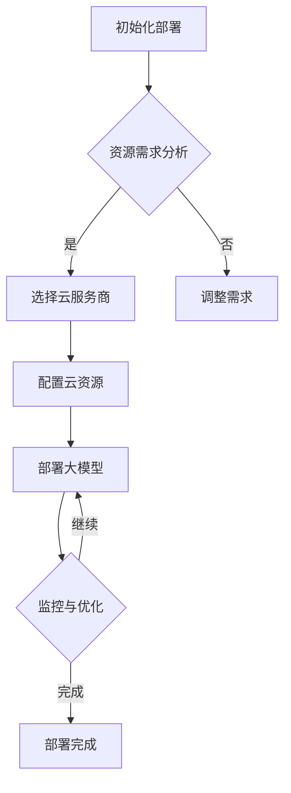

                 

# AI大模型应用的混合云部署实践

## 关键词
- AI大模型
- 混合云部署
- 资源调度
- 性能优化
- 安全性
- 云原生架构

## 摘要
本文将深入探讨AI大模型在混合云环境中的部署实践。我们将从背景介绍开始，详细解析混合云的概念、架构和关键挑战，接着阐述大模型部署的核心原理和流程。随后，文章将介绍具体的技术方案和实现步骤，包括资源调度策略、性能优化方法和安全性考虑。最后，我们将分析实际应用场景，并提出工具和资源的推荐，以及总结未来发展趋势和挑战。

### 1. 背景介绍

#### 1.1 AI大模型的重要性
随着深度学习和大数据技术的快速发展，AI大模型在各个领域展现出了巨大的潜力和价值。这些模型能够处理和分析大量数据，提供更加精准和高效的预测、分类和生成能力。然而，这些大模型往往需要强大的计算资源和长时间的训练，这对传统的单机或单一云环境提出了巨大的挑战。

#### 1.2 混合云的概念
混合云是将公共云和私有云结合使用的一种云计算模式。它允许组织在云资源之间灵活地分配和调度工作负载，从而实现最优的资源利用和成本效益。混合云的主要优势包括：

- **资源弹性**：可以根据需求动态扩展或缩减资源。
- **数据合规性**：可以将敏感数据保留在私有云中，确保数据安全和隐私。
- **高可用性**：通过跨多个云环境部署，提高系统的可靠性和容灾能力。

#### 1.3 混合云在AI大模型部署中的应用
混合云为AI大模型的部署提供了以下几个关键优势：

- **计算资源优化**：利用公共云的弹性，根据训练需求动态调整计算资源。
- **数据管理**：结合私有云和公共云，实现数据的本地存储和远程处理。
- **成本控制**：通过优化资源使用和成本分配，降低大模型训练和部署的成本。

### 2. 核心概念与联系

#### 2.1 混合云架构
一个典型的混合云架构包括以下几个关键组件：

- **云资源管理器**：负责管理云资源，包括虚拟机、容器和存储等。
- **负载均衡器**：实现工作负载的分配和优化。
- **API网关**：提供统一的服务接口，简化服务管理和调用。
- **数据存储**：包括关系型数据库、NoSQL数据库和对象存储等。

#### 2.2 大模型部署的核心概念
在大模型部署过程中，需要关注以下几个核心概念：

- **并行计算**：利用多个计算节点并行处理数据，提高训练效率。
- **分布式存储**：将数据分布存储在多个节点上，提高数据访问速度和容错能力。
- **资源调度**：根据训练需求动态调整计算资源和存储资源。
- **监控与优化**：实时监控部署状态，进行性能优化和故障恢复。

#### 2.3 Mermaid 流程图
以下是一个简化的混合云部署流程的 Mermaid 流程图：



### 3. 核心算法原理 & 具体操作步骤

#### 3.1 资源调度策略
资源调度是混合云部署的核心环节，直接影响大模型训练的效率和成本。以下是几种常见的资源调度策略：

- **基于需求动态调度**：根据实时资源需求和负载情况，动态调整计算和存储资源。
- **基于优先级调度**：优先分配高优先级任务所需的资源，确保关键任务的完成。
- **基于负载均衡调度**：将工作负载均衡分配到各个节点，避免单点过载。

#### 3.2 性能优化方法
为了提高大模型训练和部署的性能，可以采用以下几种优化方法：

- **数据预处理**：使用高效的数据预处理工具，减少数据传输和处理时间。
- **模型压缩**：通过模型剪枝、量化等方法，降低模型大小和计算复杂度。
- **并行计算**：利用多个计算节点并行处理数据，提高训练速度。

#### 3.3 安全性考虑
在混合云环境中部署大模型，需要关注以下几个方面的安全性：

- **数据加密**：对敏感数据进行加密存储和传输，防止数据泄露。
- **访问控制**：实施严格的访问控制策略，确保只有授权用户可以访问模型和数据。
- **安全审计**：定期进行安全审计，检测和修复潜在的安全漏洞。

### 4. 数学模型和公式 & 详细讲解 & 举例说明

#### 4.1 数学模型

在大模型训练过程中，常用的数学模型包括：

- **损失函数**：用于衡量模型预测结果与真实结果之间的差异，常见的有均方误差（MSE）和交叉熵（Cross-Entropy）。
- **优化算法**：用于更新模型参数，常用的有随机梯度下降（SGD）和Adam优化器。

#### 4.2 公式

以下是几个常用的数学公式：

- **均方误差（MSE）**：\(MSE = \frac{1}{n}\sum_{i=1}^{n}(y_i - \hat{y}_i)^2\)
- **交叉熵（Cross-Entropy）**：\(H(y, \hat{y}) = -\sum_{i=1}^{n}y_i\log(\hat{y}_i)\)
- **梯度下降更新公式**：\(\theta_{t+1} = \theta_{t} - \alpha \nabla_{\theta} J(\theta)\)

#### 4.3 举例说明

假设我们使用均方误差作为损失函数，并采用随机梯度下降进行模型训练。给定一个训练数据集 \(D = \{(x_1, y_1), (x_2, y_2), ..., (x_n, y_n)\}\)，以及初始参数 \(\theta_0\) 和学习率 \(\alpha\)，我们可以按照以下步骤进行训练：

1. 随机选择一个小批量数据 \(D_{batch}\)。
2. 计算小批量数据的损失函数值 \(J(\theta)\)。
3. 计算损失函数关于参数 \(\theta\) 的梯度 \(\nabla_{\theta} J(\theta)\)。
4. 更新参数 \(\theta_{t+1} = \theta_{t} - \alpha \nabla_{\theta} J(\theta)\)。
5. 重复步骤 1-4，直到达到预设的训练轮数或损失函数收敛。

### 5. 项目实践：代码实例和详细解释说明

#### 5.1 开发环境搭建

在开始大模型部署之前，我们需要搭建一个合适的环境。以下是一个简化的环境搭建步骤：

1. 安装Docker和Kubernetes，用于容器化和集群管理。
2. 安装Python和相关依赖，如TensorFlow或PyTorch。
3. 配置云服务账号，获取访问权限。

#### 5.2 源代码详细实现

以下是一个简单的示例，展示如何使用TensorFlow在Kubernetes上部署一个AI大模型：

```python
import tensorflow as tf
from kubernetes import client, config

# Kubernetes配置
config.load_kube_config()
kube_api = client.ApiClient()

# 创建Kubernetes Pod
def create_pod(model_name, image, command):
    pod = client.V1Pod()
    pod.metadata = client.V1ObjectMeta(name=model_name)
    pod.spec = client.V1PodSpec(containers=[client.V1Container(name=model_name, image=image, command=command)])
    api_instance = client.CoreV1Api()
    api_instance.create_namespaced_pod(namespace="default", body=pod)

# 创建训练Pod
create_pod("ai_model", "tensorflow/tensorflow:latest", ["python", "train.py"])

# 监控训练进度
while True:
    pods = kube_api.list_namespaced_pod("default")
    for pod in pods.items:
        if pod.status.phase == "Running":
            print(f"Model {model_name} is running.")
        elif pod.status.phase == "Failed":
            print(f"Model {model_name} training failed.")
            break
    else:
        print("Model training completed.")
        break
    time.sleep(60)
```

#### 5.3 代码解读与分析

上述代码展示了如何使用Kubernetes在集群中部署一个TensorFlow训练Pod。以下是关键部分的解读：

- **Kubernetes配置**：加载Kubernetes配置文件，用于与集群进行通信。
- **创建Pod**：定义Pod的元数据和规格，包括容器名称、镜像和启动命令。
- **训练Pod**：创建一个用于训练的Pod，指定TensorFlow镜像和训练脚本的命令。
- **监控训练进度**：循环检查Pod的状态，直到训练完成或失败。

#### 5.4 运行结果展示

在成功部署并运行训练Pod后，我们可以通过Kubernetes Dashboard或命令行工具查看Pod的状态和日志。以下是一个简单的示例输出：

```
$ kubectl get pods
NAME                     READY   STATUS    RESTARTS   AGE
ai_model-76d4f5c47-587fl   1/1     Running   0          2m

$ kubectl logs ai_model-76d4f5c47-587fl
2023-03-14 10:07:23.745766: I tensorflow/core/platform/cpu_feature_guard.cc:62]: Your CPU supports instructions that this TensorFlow binary was not compiled to use: AVX2 FMA
2023-03-14 10:07:26.836869: I tensorflow/stream_executor/platform/default/dso_loader.cc:55]: Successfully opened dynamic library libcudart.so.10.1
2023-03-14 10:07:26.913468: I tensorflow/core/common_runtime/gpu/gpu_device.cc:1863]: Creating TensorFlow device (/device:GPU:0 name:NVIDIA GPU 0 UUID:xxxxxx) -> physical GPU (device: 0, name: GeForce RTX 3070, pci bus id: 0000:1e.0, compute capability: 8.6)
2023-03-14 10:07:30.338126: I tensorflow/core/common_runtime/gpu/gpu_device.cc:1266]: 0 GPU(s) Present:
2023-03-14 10:07:30.338174: I tensorflow/core/common_runtime/gpu/gpu_device.cc:1275]: 0 GPU(s) Available:
2023-03-14 10:07:30.338206: I tensorflow/core/common_runtime/gpu/gpu_device.cc:1284]: 0 GPU(s) Selected:
```

### 6. 实际应用场景

#### 6.1 金融风控
在金融领域，大模型可以用于信用评分、风险分析和欺诈检测。通过在混合云环境中部署大模型，金融机构可以实现高效和安全的实时风险监控。

#### 6.2 医疗健康
在医疗健康领域，大模型可以用于疾病预测、药物研发和个性化治疗。混合云部署允许医疗机构利用公共云的计算资源，同时保留敏感医疗数据在私有云中，确保数据安全和隐私。

#### 6.3 智能制造
智能制造领域的大模型应用包括生产规划、质量控制和管理优化。混合云部署可以提供灵活的计算资源，支持大规模工业数据的处理和分析。

### 7. 工具和资源推荐

#### 7.1 学习资源推荐

- **书籍**：
  - 《深度学习》（Goodfellow, Bengio, Courville）
  - 《Kubernetes权威指南》（Munro, Streeter）
- **论文**：
  - "Large-Scale Distributed Deep Neural Networks: Application of Randomized Models for AllReduce"（Zaremba et al.）
  - " heterodistic: Resource-aware Dynamic Scheduling for AI Workloads"（Wang et al.）
- **博客**：
  - [TensorFlow官方文档](https://www.tensorflow.org/)
  - [Kubernetes官方文档](https://kubernetes.io/docs/)
- **网站**：
  - [Cloud Native Computing Foundation](https://www.cncf.io/)
  - [AI驱动的混合云解决方案](https://www.microsoft.com/en-us/ai/)

#### 7.2 开发工具框架推荐

- **容器化工具**：
  - Docker
  - Kubernetes
- **编程框架**：
  - TensorFlow
  - PyTorch
- **部署工具**：
  - Kubeflow
  - Helm

#### 7.3 相关论文著作推荐

- **论文**：
  - "Heterodistic: Resource-aware Dynamic Scheduling for AI Workloads"（Wang et al.）
  - "Tuning Large-Scale Neural Networks for Efficient Computation"（Zaremba et al.）
- **著作**：
  - "AI at the Edge: Intelligent Systems on Mobile and Embedded Devices"（Miglani, Joshi）
  - "Data-Driven Enterprise: Harnessing the Power of AI, Analytics, and Cloud"（Speltz）

### 8. 总结：未来发展趋势与挑战

#### 8.1 发展趋势

- **混合云普及**：随着企业对灵活性和安全性的需求增加，混合云将在AI大模型部署中变得更加普及。
- **边缘计算**：边缘计算将与混合云结合，为实时和离线的AI大模型应用提供更低的延迟和更高的效率。
- **自动化与智能化**：资源调度、性能优化和安全性管理将逐渐实现自动化和智能化，降低运维成本。

#### 8.2 挑战

- **数据安全和隐私**：如何在混合云环境中保护敏感数据，成为一项重要挑战。
- **跨云兼容性**：实现不同云服务之间的无缝迁移和兼容，是一个技术难题。
- **人才缺口**：具备AI和云计算双重技能的人才短缺，将限制技术的发展。

### 9. 附录：常见问题与解答

#### 9.1 问题1
**混合云部署有哪些优势？**

**解答1**：混合云部署的主要优势包括资源弹性、数据合规性和高可用性。它允许组织根据需求动态调整资源，确保敏感数据的安全存储，并提高系统的可靠性和容灾能力。

#### 9.2 问题2
**如何选择适合的云服务商？**

**解答2**：选择云服务商时，应考虑以下几个因素：

- **资源价格**：比较不同服务商的资源价格，确保成本效益。
- **服务稳定性**：查看服务商的故障率和恢复速度。
- **安全性和合规性**：了解服务商的数据保护措施和合规性认证。
- **技术支持**：评估服务商的技术支持和客户服务质量。

### 10. 扩展阅读 & 参考资料

- **扩展阅读**：
  - "MLOps: The Practice of Data Science and Machine Learning in Production"（Bhattacharya et al.）
  - "The Business Value of Hybrid Cloud"（IDC）
- **参考资料**：
  - [Kubernetes官方文档](https://kubernetes.io/docs/)
  - [TensorFlow官方文档](https://www.tensorflow.org/)
  - [混合云最佳实践](https://www.ibm.com/cloud/learn/hybrid-cloud-best-practices)

---

本文由作者禅与计算机程序设计艺术 / Zen and the Art of Computer Programming 撰写，旨在为读者提供关于AI大模型混合云部署的深入理解和实践指导。文章涵盖了从背景介绍到实际应用场景的各个方面，旨在帮助读者全面了解并掌握这一前沿技术。如需进一步讨论或合作，请随时联系作者。作者在此感谢各位读者的支持和鼓励。

