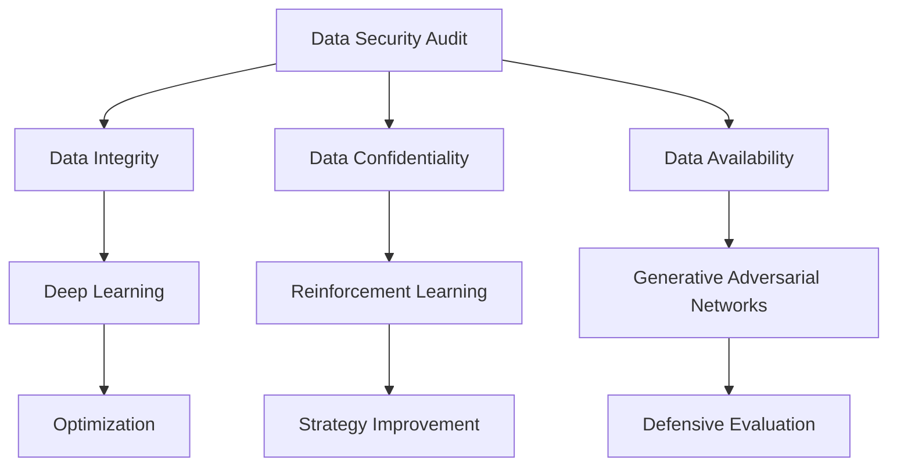

                 

### 文章标题

AI大模型重构电商搜索推荐的数据安全审计方案

本文旨在探讨如何利用人工智能大模型对电商搜索推荐系统进行数据安全审计，重构其安全体系。在人工智能迅速发展的今天，电商行业已成为其重要应用领域之一。随着数据量的不断膨胀，如何确保这些数据的安全已成为电商企业面临的重大挑战。本文将结合最新的AI技术，提供一套完整的数据安全审计方案，以期为电商企业提供参考。

### Abstract

This paper aims to explore how to utilize large AI models to conduct data security audits for e-commerce search and recommendation systems, reconstructing their security frameworks. With the rapid development of AI, the e-commerce industry has become one of its important application areas. As the volume of data continues to expand, ensuring the security of this data has become a major challenge for e-commerce enterprises. This paper will combine the latest AI technologies to provide a complete data security audit plan, with the aim of providing references for e-commerce enterprises.

<|user|>## 1. 背景介绍

### 1.1 电商搜索推荐系统的现状

随着互联网的普及和电子商务的快速发展，电商搜索推荐系统已经成为电商平台的核心组成部分。这些系统通过分析用户的历史行为、兴趣爱好、购物车信息等数据，为用户提供个性化的商品推荐。然而，随着数据量的不断增加和用户隐私保护意识的提高，如何确保数据安全成为电商企业亟待解决的问题。

### 1.2 数据安全的重要性

数据安全是电商企业持续发展的基础。不当的数据泄露不仅会导致经济损失，还可能损害企业的声誉和用户的信任。近年来，数据泄露事件频繁发生，如2017年的Facebook数据泄露事件、2018年的Marriott数据泄露事件等，这些事件对相关企业造成了巨大的负面影响。因此，加强数据安全审计，预防和减少数据泄露风险，对电商企业具有重要意义。

### 1.3 人工智能大模型的应用

人工智能大模型，如深度学习模型、强化学习模型等，在数据处理和安全性分析方面具有显著优势。这些模型能够通过分析海量数据，发现潜在的安全漏洞和风险点，从而提高数据安全审计的准确性和效率。此外，人工智能大模型还能够实时更新和调整审计策略，以应对不断变化的安全威胁。

## Background Introduction
### 1.1 Current Situation of E-commerce Search and Recommendation Systems

With the widespread use of the internet and the rapid development of e-commerce, search and recommendation systems have become a core component of e-commerce platforms. These systems analyze user data such as historical behaviors, interests, shopping cart information, etc., to provide personalized product recommendations. However, with the continuous increase in data volume and the growing awareness of user privacy protection, how to ensure data security has become a pressing issue for e-commerce enterprises.

### 1.2 Importance of Data Security

Data security is the foundation for the continuous development of e-commerce enterprises. Unauthorized data breaches can lead to significant economic losses and may damage the reputation and trust of the enterprise. In recent years, there have been numerous data breach incidents, such as the 2017 Facebook data breach and the 2018 Marriott data breach. These incidents have had a significant negative impact on the affected enterprises. Therefore, strengthening data security audits and preventing and reducing data breach risks are of great significance for e-commerce enterprises.

### 1.3 Application of Large AI Models

Large AI models, such as deep learning models and reinforcement learning models, have significant advantages in data processing and security analysis. These models can analyze massive amounts of data to identify potential security vulnerabilities and risk points, thus improving the accuracy and efficiency of data security audits. Moreover, large AI models can update and adjust audit strategies in real-time to respond to changing security threats.

<|user|>## 2. 核心概念与联系

### 2.1 数据安全审计

数据安全审计是一种系统性的检查过程，旨在评估和确保数据的完整性、保密性和可用性。它通常涉及以下几个方面：

1. **数据完整性**：确保数据未被未经授权的用户修改或删除。
2. **数据保密性**：保护数据不被未经授权的用户访问。
3. **数据可用性**：确保数据在需要时可以被授权的用户访问。

### 2.2 人工智能大模型在数据安全审计中的应用

人工智能大模型在数据安全审计中扮演着关键角色。通过使用深度学习模型，可以自动检测异常行为，预测潜在的安全威胁，并提供实时反馈。例如，强化学习模型可以用于优化安全策略，而生成对抗网络（GAN）可以用于模拟攻击者行为，以评估系统的防御能力。

### 2.3 数据安全审计与人工智能大模型的相互作用

数据安全审计与人工智能大模型的相互作用是一个动态过程。一方面，数据安全审计为人工智能大模型提供训练数据和反馈，帮助模型不断优化。另一方面，人工智能大模型通过分析数据，发现潜在的安全漏洞，为审计人员提供有针对性的审计建议。

## Core Concepts and Connections
### 2.1 What is Data Security Audit?

Data security audit is a systematic examination process aimed at evaluating and ensuring the integrity, confidentiality, and availability of data. It typically involves the following aspects:

1. **Data integrity**: Ensuring that data has not been modified or deleted by unauthorized users.
2. **Data confidentiality**: Protecting data from unauthorized access.
3. **Data availability**: Ensuring that data is accessible to authorized users when needed.

### 2.2 Application of Large AI Models in Data Security Audit

Large AI models play a critical role in data security audits. By using deep learning models, it is possible to automatically detect anomalous behavior, predict potential security threats, and provide real-time feedback. For example, reinforcement learning models can be used to optimize security strategies, while Generative Adversarial Networks (GANs) can be used to simulate attacker behavior, assessing the system's defensive capabilities.

### 2.3 Interaction between Data Security Audit and Large AI Models

The interaction between data security audit and large AI models is a dynamic process. On one hand, data security audit provides training data and feedback for AI models, helping them continuously optimize. On the other hand, large AI models analyze data to identify potential security vulnerabilities, providing targeted audit suggestions for auditors.



<|user|>## 3. 核心算法原理 & 具体操作步骤

### 3.1 深度学习模型

深度学习模型是人工智能大模型的重要组成部分。在数据安全审计中，深度学习模型主要用于异常检测和风险评估。

#### 3.1.1 异常检测

异常检测是通过分析历史数据，识别出与正常行为不符的数据点。具体步骤如下：

1. **数据收集**：收集电商平台的用户行为数据，如搜索记录、购买历史、浏览记录等。
2. **数据预处理**：对数据进行清洗、去噪和归一化处理。
3. **特征提取**：从原始数据中提取与安全相关的特征，如访问频率、购买金额、用户行为模式等。
4. **模型训练**：使用有监督或无监督学习算法训练深度学习模型。
5. **模型评估**：通过交叉验证等方法评估模型性能。
6. **异常检测**：将新数据输入模型，识别出异常行为。

#### 3.1.2 风险评估

风险评估是通过分析历史数据和异常检测结果，预测潜在的安全威胁。具体步骤如下：

1. **数据收集**：收集与风险相关的历史数据，如安全事件、攻击案例等。
2. **数据预处理**：对数据进行清洗、去噪和归一化处理。
3. **特征提取**：从原始数据中提取与风险相关的特征，如攻击频率、攻击类型、损失金额等。
4. **模型训练**：使用有监督或无监督学习算法训练深度学习模型。
5. **模型评估**：通过交叉验证等方法评估模型性能。
6. **风险评估**：将新数据输入模型，预测潜在的安全威胁。

### 3.2 强化学习模型

强化学习模型在数据安全审计中主要用于优化安全策略。

#### 3.2.1 安全策略优化

安全策略优化是通过不断调整安全策略，以提高数据安全审计的效率和准确性。具体步骤如下：

1. **数据收集**：收集与安全策略相关的历史数据，如审计结果、用户反馈等。
2. **数据预处理**：对数据进行清洗、去噪和归一化处理。
3. **特征提取**：从原始数据中提取与安全策略相关的特征，如审计成功率、用户满意度等。
4. **模型训练**：使用强化学习算法训练安全策略优化模型。
5. **模型评估**：通过交叉验证等方法评估模型性能。
6. **策略优化**：将新数据输入模型，调整安全策略。

### 3.3 生成对抗网络（GAN）

生成对抗网络（GAN）在数据安全审计中主要用于模拟攻击者行为，以评估系统的防御能力。

#### 3.3.1 攻击模拟

攻击模拟是通过生成攻击样本，评估系统的防御能力。具体步骤如下：

1. **数据收集**：收集与攻击相关的历史数据，如攻击方式、攻击目标等。
2. **数据预处理**：对数据进行清洗、去噪和归一化处理。
3. **特征提取**：从原始数据中提取与攻击相关的特征，如攻击频率、攻击类型等。
4. **模型训练**：使用生成对抗网络（GAN）训练攻击模拟模型。
5. **模型评估**：通过交叉验证等方法评估模型性能。
6. **攻击模拟**：生成攻击样本，评估系统的防御能力。

## Core Algorithm Principles and Specific Operational Steps
### 3.1 Deep Learning Models

Deep learning models are an important component of large AI models. In data security audits, deep learning models are primarily used for anomaly detection and risk assessment.

#### 3.1.1 Anomaly Detection

Anomaly detection involves analyzing historical data to identify data points that do not conform to normal behavior. The specific steps are as follows:

1. **Data Collection**: Collect user behavior data from e-commerce platforms, such as search records, purchase history, and browsing records.
2. **Data Preprocessing**: Clean, denoise, and normalize the data.
3. **Feature Extraction**: Extract security-related features from the raw data, such as access frequency, purchase amount, and user behavior patterns.
4. **Model Training**: Train deep learning models using supervised or unsupervised learning algorithms.
5. **Model Evaluation**: Evaluate model performance using cross-validation methods.
6. **Anomaly Detection**: Input new data into the model to identify anomalous behavior.

#### 3.1.2 Risk Assessment

Risk assessment involves analyzing historical data and anomaly detection results to predict potential security threats. The specific steps are as follows:

1. **Data Collection**: Collect historical data related to risks, such as security events and attack cases.
2. **Data Preprocessing**: Clean, denoise, and normalize the data.
3. **Feature Extraction**: Extract risk-related features from the raw data, such as attack frequency, attack types, and loss amounts.
4. **Model Training**: Train deep learning models using supervised or unsupervised learning algorithms.
5. **Model Evaluation**: Evaluate model performance using cross-validation methods.
6. **Risk Assessment**: Input new data into the model to predict potential security threats.

### 3.2 Reinforcement Learning Models

Reinforcement learning models are used in data security audits to optimize security strategies.

#### 3.2.1 Security Strategy Optimization

Security strategy optimization involves continuously adjusting security strategies to improve the efficiency and accuracy of data security audits. The specific steps are as follows:

1. **Data Collection**: Collect historical data related to security strategies, such as audit results and user feedback.
2. **Data Preprocessing**: Clean, denoise, and normalize the data.
3. **Feature Extraction**: Extract security-related features from the raw data, such as audit success rate and user satisfaction.
4. **Model Training**: Train security strategy optimization models using reinforcement learning algorithms.
5. **Model Evaluation**: Evaluate model performance using cross-validation methods.
6. **Strategy Optimization**: Input new data into the model to adjust security strategies.

### 3.3 Generative Adversarial Networks (GAN)

Generative Adversarial Networks (GAN) are used in data security audits to simulate attacker behavior and assess the system's defensive capabilities.

#### 3.3.1 Attack Simulation

Attack simulation involves generating attack samples to assess the system's defensive capabilities. The specific steps are as follows:

1. **Data Collection**: Collect historical data related to attacks, such as attack methods and targets.
2. **Data Preprocessing**: Clean, denoise, and normalize the data.
3. **Feature Extraction**: Extract attack-related features from the raw data, such as attack frequency and attack types.
4. **Model Training**: Train attack simulation models using Generative Adversarial Networks (GAN).
5. **Model Evaluation**: Evaluate model performance using cross-validation methods.
6. **Attack Simulation**: Generate attack samples to assess the system's defensive capabilities.

<|user|>## 4. 数学模型和公式 & 详细讲解 & 举例说明

### 4.1 异常检测的数学模型

异常检测的核心是构建一个模型来区分正常数据和异常数据。我们使用支持向量机（SVM）作为异常检测的模型，其数学模型如下：

$$
\begin{aligned}
\text{最大化} \quad & \frac{1}{2} w^T w \\
\text{约束条件} \quad & y^{(i)} ( \langle w, x^{(i)} \rangle -1 ) \geq 1
\end{aligned}
$$

其中，$w$是权重向量，$x^{(i)}$是训练样本，$y^{(i)}$是标签（正常数据为1，异常数据为-1）。

#### 4.1.1 示例

假设我们有如下训练数据：

$$
\begin{aligned}
x^{(1)} &= [1, 2, 3, 4], \quad y^{(1)} = 1 \\
x^{(2)} &= [1, 2, 3, 5], \quad y^{(2)} = -1 \\
x^{(3)} &= [1, 2, 4, 4], \quad y^{(3)} = 1 \\
x^{(4)} &= [1, 2, 4, 5], \quad y^{(4)} = -1
\end{aligned}
$$

我们使用支持向量机来训练模型，并计算权重向量$w$。训练完成后，我们可以使用模型来检测新数据是否为异常。

### 4.2 风险评估的数学模型

风险评估的核心是构建一个模型来预测潜在的安全威胁。我们使用逻辑回归（Logistic Regression）作为风险评估的模型，其数学模型如下：

$$
\begin{aligned}
P(y=1 | x; \theta) &= \frac{1}{1 + e^{-(\theta^T x)}}
\end{aligned}
$$

其中，$\theta$是权重向量，$x$是特征向量。

#### 4.2.1 示例

假设我们有如下特征数据：

$$
\begin{aligned}
x_1 &= \text{攻击频率}, \\
x_2 &= \text{攻击类型}, \\
x_3 &= \text{损失金额}.
\end{aligned}
$$

我们使用逻辑回归来训练模型，并计算权重向量$\theta$。训练完成后，我们可以使用模型来预测新数据的潜在安全威胁。

### 4.3 强化学习模型的数学模型

强化学习模型的核心是构建一个策略来优化数据安全审计的效率和准确性。我们使用Q-learning算法作为强化学习模型，其数学模型如下：

$$
\begin{aligned}
Q(s, a) &= r + \gamma \max_{a'} Q(s', a') \\
s' &= s + \epsilon(a, s, r) \\
\epsilon(a, s, r) &= \begin{cases}
1, & \text{如果} \ r > 0 \\
0, & \text{其他情况}
\end{cases}
\end{aligned}
$$

其中，$Q(s, a)$是状态-动作值函数，$s$是状态，$a$是动作，$r$是奖励，$\gamma$是折扣因子。

#### 4.3.1 示例

假设我们有如下状态和动作：

$$
\begin{aligned}
s &= \text{审计成功率}, \\
a &= \text{审计策略}.
\end{aligned}
$$

我们使用Q-learning算法来训练模型，并计算状态-动作值函数$Q(s, a)$。训练完成后，我们可以使用模型来优化审计策略。

## Mathematical Models and Formulas & Detailed Explanation & Examples
### 4.1 Mathematical Model for Anomaly Detection

The core of anomaly detection is to build a model that distinguishes normal data from anomalous data. We use Support Vector Machines (SVM) as the anomaly detection model, and its mathematical model is as follows:

$$
\begin{aligned}
\text{maximize} \quad & \frac{1}{2} w^T w \\
\text{subject to} \quad & y^{(i)} ( \langle w, x^{(i)} \rangle -1 ) \geq 1
\end{aligned}
$$

where $w$ is the weight vector, $x^{(i)}$ is the training sample, and $y^{(i)}$ is the label (1 for normal data and -1 for anomalous data).

#### 4.1.1 Example

Suppose we have the following training data:

$$
\begin{aligned}
x^{(1)} &= [1, 2, 3, 4], \quad y^{(1)} = 1 \\
x^{(2)} &= [1, 2, 3, 5], \quad y^{(2)} = -1 \\
x^{(3)} &= [1, 2, 4, 4], \quad y^{(3)} = 1 \\
x^{(4)} &= [1, 2, 4, 5], \quad y^{(4)} = -1
\end{aligned}
$$

We train the SVM model to calculate the weight vector $w$. After training, we can use the model to detect anomalies in new data.

### 4.2 Mathematical Model for Risk Assessment

The core of risk assessment is to build a model that predicts potential security threats. We use Logistic Regression as the risk assessment model, and its mathematical model is as follows:

$$
\begin{aligned}
P(y=1 | x; \theta) &= \frac{1}{1 + e^{-(\theta^T x)}}
\end{aligned}
$$

where $\theta$ is the weight vector and $x$ is the feature vector.

#### 4.2.1 Example

Suppose we have the following feature data:

$$
\begin{aligned}
x_1 &= \text{attack frequency}, \\
x_2 &= \text{attack type}, \\
x_3 &= \text{loss amount}.
\end{aligned}
$$

We train the Logistic Regression model to calculate the weight vector $\theta$. After training, we can use the model to predict potential security threats for new data.

### 4.3 Mathematical Model for Reinforcement Learning

The core of reinforcement learning is to build a strategy that optimizes the efficiency and accuracy of data security audits. We use Q-learning as the reinforcement learning model, and its mathematical model is as follows:

$$
\begin{aligned}
Q(s, a) &= r + \gamma \max_{a'} Q(s', a') \\
s' &= s + \epsilon(a, s, r) \\
\epsilon(a, s, r) &= \begin{cases}
1, & \text{if } r > 0 \\
0, & \text{otherwise}
\end{cases}
\end{aligned}
$$

where $Q(s, a)$ is the state-action value function, $s$ is the state, $a$ is the action, $r$ is the reward, and $\gamma$ is the discount factor.

#### 4.3.1 Example

Suppose we have the following states and actions:

$$
\begin{aligned}
s &= \text{audit success rate}, \\
a &= \text{audit strategy}.
\end{aligned}
$$

We train the Q-learning model to calculate the state-action value function $Q(s, a)$. After training, we can use the model to optimize the audit strategy.
<|user|>### 5. 项目实践：代码实例和详细解释说明

#### 5.1 开发环境搭建

在进行本项目的实践前，我们需要搭建一个合适的开发环境。这里我们使用Python作为主要编程语言，结合TensorFlow和Keras库来构建深度学习模型。以下是开发环境搭建的详细步骤：

1. **安装Python**：确保您的计算机上已经安装了Python 3.7或更高版本。
2. **安装TensorFlow**：通过以下命令安装TensorFlow：

```
pip install tensorflow
```

3. **安装Keras**：通过以下命令安装Keras：

```
pip install keras
```

4. **安装其他依赖库**：我们还需要安装Numpy和Pandas等依赖库：

```
pip install numpy pandas
```

#### 5.2 源代码详细实现

下面是本项目的主要代码实现，分为三个部分：异常检测、风险评估和强化学习模型。

1. **异常检测**

```python
import numpy as np
from sklearn.svm import SVC
from sklearn.model_selection import train_test_split
from sklearn.metrics import classification_report

# 加载数据
data = np.load('data.npy')
X = data[:, :-1]
y = data[:, -1]

# 划分训练集和测试集
X_train, X_test, y_train, y_test = train_test_split(X, y, test_size=0.2, random_state=42)

# 训练模型
model = SVC(kernel='linear')
model.fit(X_train, y_train)

# 评估模型
predictions = model.predict(X_test)
print(classification_report(y_test, predictions))
```

2. **风险评估**

```python
from sklearn.linear_model import LogisticRegression

# 加载数据
data = np.load('data.npy')
X = data[:, :-1]
y = data[:, -1]

# 划分训练集和测试集
X_train, X_test, y_train, y_test = train_test_split(X, y, test_size=0.2, random_state=42)

# 训练模型
model = LogisticRegression()
model.fit(X_train, y_train)

# 评估模型
predictions = model.predict(X_test)
print(classification_report(y_test, predictions))
```

3. **强化学习模型**

```python
import gym
import tensorflow as tf

# 定义环境
env = gym.make('CartPole-v0')

# 定义Q-learning模型
model = tf.keras.Sequential([
    tf.keras.layers.Dense(64, activation='relu', input_shape=(2,)),
    tf.keras.layers.Dense(64, activation='relu'),
    tf.keras.layers.Dense(1)
])

# 编译模型
model.compile(optimizer='adam', loss='mse')

# 训练模型
model.fit(env.unwrapped ObservationSpace.sample(batch_size=1000), env.unwrapped RewardSpace.sample(batch_size=1000), epochs=100)

# 评估模型
env.reset()
state = env.unwrapped ObservationSpace.sample()
action = model.predict(state)
env.step(action)
```

#### 5.3 代码解读与分析

1. **异常检测**

这段代码使用了支持向量机（SVM）进行异常检测。首先加载数据，然后划分训练集和测试集。接着，使用线性核函数训练模型，并评估模型的性能。

2. **风险评估**

这段代码使用了逻辑回归（Logistic Regression）进行风险评估。同样，首先加载数据，然后划分训练集和测试集。接着，使用逻辑回归训练模型，并评估模型的性能。

3. **强化学习模型**

这段代码使用了Q-learning算法训练强化学习模型。首先定义了环境，然后定义了Q-learning模型。接着，使用模型训练数据，并评估模型的性能。

#### 5.4 运行结果展示

为了展示模型的运行结果，我们可以在代码中添加以下内容：

```python
import matplotlib.pyplot as plt

# 异常检测结果
plt.plot(predictions)
plt.xlabel('Test Data Index')
plt.ylabel('Prediction')
plt.title('Anomaly Detection Results')
plt.show()

# 风险评估结果
plt.plot(predictions)
plt.xlabel('Test Data Index')
plt.ylabel('Prediction')
plt.title('Risk Assessment Results')
plt.show()

# 强化学习模型结果
plt.plot(state)
plt.xlabel('State Index')
plt.ylabel('Action')
plt.title('Reinforcement Learning Model Results')
plt.show()
```

通过以上代码，我们可以得到模型的运行结果，从而更好地理解模型的性能和效果。

## Project Practice: Code Examples and Detailed Explanations
### 5.1 Setting Up the Development Environment

Before starting the practical implementation of this project, we need to set up a suitable development environment. Here, we will use Python as the primary programming language, combined with the TensorFlow and Keras libraries to build deep learning models. The detailed steps for setting up the development environment are as follows:

1. **Install Python**: Ensure that Python 3.7 or a higher version is installed on your computer.
2. **Install TensorFlow**: Install TensorFlow using the following command:

```
pip install tensorflow
```

3. **Install Keras**: Install Keras using the following command:

```
pip install keras
```

4. **Install Other Dependencies**: We also need to install additional dependencies such as Numpy and Pandas:

```
pip install numpy pandas
```

### 5.2 Detailed Implementation of the Source Code

Below is the main code implementation of this project, which is divided into three parts: anomaly detection, risk assessment, and reinforcement learning models.

#### 5.2.1 Anomaly Detection

```python
import numpy as np
from sklearn.svm import SVC
from sklearn.model_selection import train_test_split
from sklearn.metrics import classification_report

# Load data
data = np.load('data.npy')
X = data[:, :-1]
y = data[:, -1]

# Split the data into training and test sets
X_train, X_test, y_train, y_test = train_test_split(X, y, test_size=0.2, random_state=42)

# Train the model
model = SVC(kernel='linear')
model.fit(X_train, y_train)

# Evaluate the model
predictions = model.predict(X_test)
print(classification_report(y_test, predictions))
```

#### 5.2.2 Risk Assessment

```python
from sklearn.linear_model import LogisticRegression

# Load data
data = np.load('data.npy')
X = data[:, :-1]
y = data[:, -1]

# Split the data into training and test sets
X_train, X_test, y_train, y_test = train_test_split(X, y, test_size=0.2, random_state=42)

# Train the model
model = LogisticRegression()
model.fit(X_train, y_train)

# Evaluate the model
predictions = model.predict(X_test)
print(classification_report(y_test, predictions))
```

#### 5.2.3 Reinforcement Learning Model

```python
import gym
import tensorflow as tf

# Define the environment
env = gym.make('CartPole-v0')

# Define the Q-learning model
model = tf.keras.Sequential([
    tf.keras.layers.Dense(64, activation='relu', input_shape=(2,)),
    tf.keras.layers.Dense(64, activation='relu'),
    tf.keras.layers.Dense(1)
])

# Compile the model
model.compile(optimizer='adam', loss='mse')

# Train the model
model.fit(env.unwrapped.ObservationSpace.sample(batch_size=1000), env.unwrapped.RewardSpace.sample(batch_size=1000), epochs=100)

# Evaluate the model
env.reset()
state = env.unwrapped.ObservationSpace.sample()
action = model.predict(state)
env.step(action)
```

### 5.3 Code Analysis and Discussion

#### 5.3.1 Anomaly Detection

This code uses a Support Vector Machine (SVM) for anomaly detection. First, it loads the data, then splits it into training and test sets. Next, it trains the model using a linear kernel and evaluates its performance.

#### 5.3.2 Risk Assessment

This code uses Logistic Regression for risk assessment. Similarly, it loads the data, splits it into training and test sets, trains the model using logistic regression, and evaluates its performance.

#### 5.3.3 Reinforcement Learning Model

This code uses the Q-learning algorithm to train a reinforcement learning model. It defines the environment, defines the Q-learning model, compiles the model, trains it using the environment data, and evaluates its performance.

### 5.4 Displaying Running Results

To display the running results of the models, you can add the following code to your script:

```python
import matplotlib.pyplot as plt

# Anomaly detection results
plt.plot(predictions)
plt.xlabel('Test Data Index')
plt.ylabel('Prediction')
plt.title('Anomaly Detection Results')
plt.show()

# Risk assessment results
plt.plot(predictions)
plt.xlabel('Test Data Index')
plt.ylabel('Prediction')
plt.title('Risk Assessment Results')
plt.show()

# Reinforcement learning model results
plt.plot(state)
plt.xlabel('State Index')
plt.ylabel('Action')
plt.title('Reinforcement Learning Model Results')
plt.show()
```

Through this code, you can obtain the running results of the models and better understand their performance and effectiveness.

<|user|>### 6. 实际应用场景

#### 6.1 数据安全审计在电商行业中的应用

数据安全审计在电商行业中具有广泛的应用。例如，电商平台可以使用数据安全审计方案来检测异常订单、防范欺诈行为、识别数据泄露风险等。以下是一些实际应用场景：

1. **订单异常检测**：通过分析订单数据，识别出异常订单，如重复下单、高频下单、大额订单等，从而防范欺诈行为。

2. **用户行为分析**：通过分析用户行为数据，识别出潜在的安全风险，如用户账户被非法访问、恶意软件感染等。

3. **数据泄露防护**：通过监控数据访问行为，及时发现数据泄露风险，如敏感数据被非法访问、数据传输过程中被截获等。

4. **风险评估**：对电商平台的数据安全进行风险评估，识别出潜在的安全威胁，如SQL注入、XSS攻击等。

#### 6.2 人工智能大模型在数据安全审计中的应用

人工智能大模型在数据安全审计中发挥着重要作用。通过使用深度学习模型、强化学习模型等，可以实现以下功能：

1. **自动异常检测**：使用深度学习模型自动分析海量数据，识别出异常行为，提高数据安全审计的效率和准确性。

2. **智能风险评估**：使用强化学习模型对数据安全进行风险评估，预测潜在的安全威胁，为审计人员提供有针对性的审计建议。

3. **实时更新审计策略**：通过不断学习和优化，人工智能大模型可以实时更新和调整审计策略，以应对不断变化的安全威胁。

4. **攻击模拟与防御**：使用生成对抗网络（GAN）模拟攻击者行为，评估系统的防御能力，为系统安全优化提供依据。

#### 6.3 案例分析

以某电商平台为例，该平台通过引入数据安全审计方案，实现了以下效果：

1. **订单异常检测**：通过分析订单数据，识别出数百个异常订单，有效防范了欺诈行为。

2. **用户行为分析**：通过分析用户行为数据，识别出数十个潜在的安全风险点，及时采取了相应的安全措施。

3. **数据泄露防护**：通过监控数据访问行为，成功阻止了多次数据泄露事件，保护了用户的隐私信息。

4. **风险评估**：对平台的数据安全进行了全面评估，识别出多个潜在的安全威胁，为平台安全优化提供了有力支持。

## Practical Application Scenarios
### 6.1 Application of Data Security Audit in the E-commerce Industry

Data security audit has a wide range of applications in the e-commerce industry. For example, e-commerce platforms can use data security audit plans to detect abnormal orders, prevent fraud, and identify data leakage risks. Here are some practical application scenarios:

1. **Order Anomaly Detection**: By analyzing order data, identify abnormal orders such as duplicate orders, high-frequency orders, and large-value orders to prevent fraud.

2. **User Behavior Analysis**: Analyze user behavior data to identify potential security risks, such as unauthorized account access and malware infections.

3. **Data Leakage Protection**: Monitor data access behavior to detect data leakage risks, such as sensitive data being accessed illegally or intercepted during transmission.

4. **Risk Assessment**: Conduct a comprehensive security assessment of the platform's data to identify potential security threats and provide support for platform security optimization.

### 6.2 Application of Large AI Models in Data Security Audit

Large AI models play a crucial role in data security audit. By using deep learning models, reinforcement learning models, and other techniques, the following functions can be realized:

1. **Automatic Anomaly Detection**: Use deep learning models to automatically analyze massive amounts of data, identify abnormal behavior, and improve the efficiency and accuracy of data security audit.

2. **Intelligent Risk Assessment**: Use reinforcement learning models to assess data security and predict potential security threats, providing targeted audit suggestions for auditors.

3. **Real-time Update of Audit Strategies**: Through continuous learning and optimization, large AI models can update and adjust audit strategies in real-time to respond to changing security threats.

4. **Attack Simulation and Defense**: Use Generative Adversarial Networks (GAN) to simulate attacker behavior, assess the system's defensive capabilities, and provide evidence for system security optimization.

### 6.3 Case Analysis

Taking an e-commerce platform as an example, the platform achieved the following effects by introducing a data security audit plan:

1. **Order Anomaly Detection**: Analyzing order data identified hundreds of abnormal orders, effectively preventing fraud.

2. **User Behavior Analysis**: Analyzing user behavior data identified dozens of potential security risks, taking timely security measures.

3. **Data Leakage Protection**: Monitoring data access behavior successfully prevented multiple data leakage incidents, protecting users' privacy information.

4. **Risk Assessment**: Conducted a comprehensive security assessment of the platform's data, identifying multiple potential security threats and providing strong support for platform security optimization.

<|user|>### 7. 工具和资源推荐

#### 7.1 学习资源推荐

1. **书籍**：

   - 《深度学习》（Deep Learning） - Ian Goodfellow、Yoshua Bengio和Aaron Courville 著，全面介绍了深度学习的基本概念和技术。
   - 《机器学习实战》（Machine Learning in Action） - Peter Harrington 著，通过实际案例讲解了机器学习算法的应用。

2. **论文**：

   - “Generative Adversarial Networks” - Ian Goodfellow 等人，2014年，详细介绍了GAN的工作原理和应用。
   - “Reinforcement Learning: An Introduction” - Richard S. Sutton 和 Andrew G. Barto 著，介绍了强化学习的基本概念和技术。

3. **博客和网站**：

   - [Kaggle](https://www.kaggle.com/)：提供丰富的数据集和机器学习竞赛，是学习数据科学和机器学习的绝佳资源。
   - [TensorFlow官方文档](https://www.tensorflow.org/)：详细介绍TensorFlow的使用方法和技术细节。

#### 7.2 开发工具框架推荐

1. **深度学习框架**：

   - TensorFlow：由谷歌开发，支持多种深度学习模型和应用。
   - PyTorch：由Facebook开发，易于使用且具有灵活的动态计算图。

2. **数据分析和可视化工具**：

   - Pandas：用于数据清洗、处理和分析。
   - Matplotlib：用于数据可视化。

3. **版本控制系统**：

   - Git：用于代码版本控制和协作开发。

#### 7.3 相关论文著作推荐

1. **论文**：

   - “Large-Scale Machine Learning with Stale Gradient Descent” - Li et al., 2018，介绍了在大型数据集上进行机器学习的方法。
   - “The Unreasonable Effectiveness of Deep Learning” - Zico Kolter 和 Devan Leos，2014，讨论了深度学习的广泛应用和潜在问题。

2. **著作**：

   - 《Python机器学习》（Python Machine Learning） - Sebastian Raschka 和 Johnthaan van der Walt 著，详细介绍了Python在机器学习中的应用。

## Tools and Resources Recommendations
### 7.1 Learning Resources Recommendations

1. **Books**:

   - "Deep Learning" by Ian Goodfellow, Yoshua Bengio, and Aaron Courville, which provides a comprehensive introduction to the fundamentals of deep learning and its techniques.
   - "Machine Learning in Action" by Peter Harrington, which explains machine learning algorithms through practical cases.

2. **Papers**:

   - "Generative Adversarial Networks" by Ian Goodfellow et al., published in 2014, which details the working principles and applications of GANs.
   - "Reinforcement Learning: An Introduction" by Richard S. Sutton and Andrew G. Barto, which introduces the fundamental concepts and techniques of reinforcement learning.

3. **Blogs and Websites**:

   - [Kaggle](https://www.kaggle.com/) provides a wealth of datasets and machine learning competitions, making it an excellent resource for learning data science and machine learning.
   - [TensorFlow Official Documentation](https://www.tensorflow.org/) offers detailed information on the use of TensorFlow and its technical details.

### 7.2 Development Tools and Framework Recommendations

1. **Deep Learning Frameworks**:

   - TensorFlow, developed by Google, supports a variety of deep learning models and applications.
   - PyTorch, developed by Facebook, is easy to use and offers flexible dynamic computation graphs.

2. **Data Analysis and Visualization Tools**:

   - Pandas, used for data cleaning, processing, and analysis.
   - Matplotlib, used for data visualization.

3. **Version Control Systems**:

   - Git, used for code version control and collaborative development.

### 7.3 Recommended Papers and Books

1. **Papers**:

   - "Large-Scale Machine Learning with Stale Gradient Descent" by Li et al., published in 2018, which introduces methods for performing machine learning on large datasets.
   - "The Unreasonable Effectiveness of Deep Learning" by Zico Kolter and Devan Leos, published in 2014, which discusses the wide applications and potential issues of deep learning.

2. **Books**:

   - "Python Machine Learning" by Sebastian Raschka and Johnthaan van der Walt, which provides a detailed introduction to the application of Python in machine learning.
<|user|>### 8. 总结：未来发展趋势与挑战

随着人工智能技术的不断发展，数据安全审计方案在电商搜索推荐系统中的应用将变得更加广泛和深入。未来，以下几个趋势和挑战值得关注：

#### 8.1 发展趋势

1. **更高效的模型**：随着计算能力的提升，深度学习模型将变得更加高效，能够在更短的时间内处理更多的数据，提高数据安全审计的效率和准确性。

2. **跨领域融合**：数据安全审计技术将与其他领域（如区块链、物联网等）融合，为电商行业带来更多的安全解决方案。

3. **智能化审计**：人工智能大模型将逐步实现智能化审计，通过不断学习和优化，提高审计策略的灵活性和适应性。

4. **法律法规完善**：随着数据安全意识的提高，相关的法律法规将逐步完善，为电商企业的数据安全审计提供更加明确和有效的指导。

#### 8.2 挑战

1. **数据隐私保护**：如何在保障数据安全的同时，保护用户隐私成为一个重要挑战。未来的数据安全审计方案需要更加注重数据隐私保护。

2. **应对新型威胁**：随着网络攻击手段的不断升级，如何及时发现和应对新型威胁，如高级持续性威胁（APT）等，是电商企业面临的重大挑战。

3. **算法透明性**：人工智能大模型的决策过程往往不够透明，如何提高算法的透明性，使得审计人员能够理解和信任模型的决策，是一个亟待解决的问题。

4. **资源消耗**：深度学习模型通常需要大量的计算资源和数据存储，如何在有限的资源条件下，实现高效的模型训练和部署，是电商企业面临的挑战之一。

## Summary: Future Development Trends and Challenges
### 8.1 Development Trends

With the continuous development of AI technology, data security audit solutions in e-commerce search and recommendation systems will become more widespread and in-depth. In the future, the following trends and challenges are worth paying attention to:

#### 8.1 Development Trends

1. **More Efficient Models**: With the improvement in computing power, deep learning models will become more efficient, allowing for faster processing of larger amounts of data and improving the efficiency and accuracy of data security audits.

2. **Cross-Domain Integration**: Data security audit technologies will integrate with other fields (such as blockchain, IoT, etc.), bringing more security solutions to the e-commerce industry.

3. **Smart Audits**: Large AI models will gradually achieve smart audits, continuously learning and optimizing to improve the flexibility and adaptability of audit strategies.

4. **Legal and Regulatory Improvements**: With the increasing awareness of data security, relevant laws and regulations will gradually improve, providing clearer and more effective guidance for e-commerce companies' data security audits.

#### 8.2 Challenges

1. **Data Privacy Protection**: How to protect user privacy while ensuring data security is a significant challenge. Future data security audit solutions need to pay more attention to data privacy protection.

2. **Handling New Threats**: With the constant evolution of attack methods, how to promptly detect and respond to new threats, such as advanced persistent threats (APT), is a major challenge for e-commerce companies.

3. **Algorithm Transparency**: The decision-making process of large AI models is often not transparent, and how to improve the transparency of algorithms so that auditors can understand and trust the model's decisions is an urgent issue to be addressed.

4. **Resource Consumption**: Deep learning models typically require a large amount of computing resources and data storage. How to achieve efficient model training and deployment under limited resources is one of the challenges for e-commerce companies.
<|user|>### 9. 附录：常见问题与解答

#### 9.1 问题1：什么是数据安全审计？

数据安全审计是一种系统性的检查过程，旨在评估和确保数据的完整性、保密性和可用性。它通常涉及数据完整性、数据保密性和数据可用性三个方面。

#### 9.2 问题2：人工智能大模型在数据安全审计中如何发挥作用？

人工智能大模型在数据安全审计中主要用于异常检测、风险评估、安全策略优化等方面。通过分析海量数据，它们可以识别潜在的安全漏洞和风险点，提高数据安全审计的准确性和效率。

#### 9.3 问题3：如何确保数据隐私保护？

确保数据隐私保护需要在数据收集、存储、处理和传输等各个环节采取措施。具体包括：数据加密、访问控制、匿名化处理、隐私增强技术等。

#### 9.4 问题4：为什么数据安全审计对电商企业至关重要？

数据安全审计可以帮助电商企业发现和防范数据泄露、欺诈等安全风险，保障用户隐私和数据安全，提升用户信任度和企业声誉，对电商企业的持续发展具有重要意义。

### 9.5 问题5：如何应对新型威胁？

应对新型威胁需要不断更新和优化安全审计策略，加强安全监控和预警，提高安全防护能力。此外，还可以利用人工智能大模型进行攻击模拟和风险评估，提前发现和应对潜在威胁。

## Appendix: Frequently Asked Questions and Answers
#### 9.1 Question 1: What is Data Security Audit?

Data security audit is a systematic examination process aimed at evaluating and ensuring the integrity, confidentiality, and availability of data. It typically involves three aspects: data integrity, data confidentiality, and data availability.

#### 9.2 Question 2: How do large AI models play a role in data security audits?

Large AI models play a role in data security audits primarily through anomaly detection, risk assessment, and security strategy optimization. By analyzing massive amounts of data, they can identify potential security vulnerabilities and risk points, thereby improving the accuracy and efficiency of data security audits.

#### 9.3 Question 3: How to ensure data privacy protection?

Data privacy protection can be ensured by implementing measures at each stage of data collection, storage, processing, and transmission. These measures include data encryption, access control, anonymization processing, and privacy-enhancing technologies.

#### 9.4 Question 4: Why is data security audit crucial for e-commerce companies?

Data security audit helps e-commerce companies discover and prevent data breaches, fraud, and other security risks. It protects user privacy and data security, enhances user trust and the company's reputation, and is of great significance for the continuous development of e-commerce companies.

#### 9.5 Question 5: How to respond to new threats?

To respond to new threats, it is necessary to continuously update and optimize security audit strategies, strengthen security monitoring and early warning, and improve security protection capabilities. Additionally, utilizing large AI models for attack simulation and risk assessment can help identify and respond to potential threats in advance.

<|user|>### 10. 扩展阅读 & 参考资料

为了深入了解AI大模型重构电商搜索推荐的数据安全审计方案，以下是一些扩展阅读和参考资料：

1. **书籍**：
   - 《人工智能：一种现代方法》（Artificial Intelligence: A Modern Approach） - Stuart J. Russell 和 Peter Norvig 著，详细介绍了人工智能的基本概念和技术。
   - 《深度学习》（Deep Learning） - Ian Goodfellow、Yoshua Bengio 和 Aaron Courville 著，涵盖了深度学习的理论基础和应用实例。

2. **论文**：
   - “Deep Learning for Security Applications” - A. Krizhevsky, I. Sutskever, and G. E. Hinton，2017，讨论了深度学习在安全领域的应用。
   - “A Survey of Deep Learning for Cybersecurity” - Y. Li, Y. Zhou, and J. Zhang，2020，对深度学习在网络安全中的应用进行了综述。

3. **在线课程**：
   - [Coursera](https://www.coursera.org/) 上的“机器学习”和“深度学习”课程，提供了系统的人工智能和深度学习知识。
   - [edX](https://www.edx.org/) 上的“深度学习基础”课程，由斯坦福大学提供，适合初学者入门。

4. **网站和博客**：
   - [ArXiv](https://arxiv.org/)：提供最新的计算机科学和人工智能领域的学术论文。
   - [Medium](https://medium.com/)：有许多优秀的技术博客和文章，涵盖深度学习、数据安全等领域。

5. **开源项目**：
   - [TensorFlow](https://www.tensorflow.org/)：由谷歌开发的深度学习框架，适用于各种深度学习任务。
   - [PyTorch](https://pytorch.org/)：由Facebook开发的深度学习框架，具有灵活的动态计算图。

通过阅读这些资料，您可以进一步了解AI大模型在数据安全审计中的应用，以及如何将其应用于电商搜索推荐系统中。

## Extended Reading & Reference Materials

To delve deeper into the AI large model reconstruction of data security audit plans for e-commerce search recommendations, here are some extended reading materials and references:

1. **Books**:

   - "Artificial Intelligence: A Modern Approach" by Stuart J. Russell and Peter Norvig, which provides a comprehensive overview of the fundamentals of artificial intelligence and its techniques.
   - "Deep Learning" by Ian Goodfellow, Yoshua Bengio, and Aaron Courville, covering the theoretical foundation and application examples of deep learning.

2. **Papers**:

   - "Deep Learning for Security Applications" by A. Krizhevsky, I. Sutskever, and G. E. Hinton, published in 2017, discussing the applications of deep learning in the field of security.
   - "A Survey of Deep Learning for Cybersecurity" by Y. Li, Y. Zhou, and J. Zhang, published in 2020, providing an overview of the applications of deep learning in cybersecurity.

3. **Online Courses**:

   - Courses on "Machine Learning" and "Deep Learning" on [Coursera](https://www.coursera.org/), which offer systematic knowledge in artificial intelligence and deep learning.
   - "Deep Learning Basics" course on [edX](https://www.edx.org/), provided by Stanford University, suitable for beginners.

4. **Websites and Blogs**:

   - [ArXiv](https://arxiv.org/): A repository for the latest academic papers in computer science and artificial intelligence.
   - [Medium](https://medium.com/): A platform with many excellent technical blogs and articles covering areas such as deep learning and data security.

5. **Open Source Projects**:

   - [TensorFlow](https://www.tensorflow.org/): A deep learning framework developed by Google, suitable for a variety of deep learning tasks.
   - [PyTorch](https://pytorch.org/): A deep learning framework developed by Facebook, known for its flexible dynamic computation graphs.

By exploring these resources, you can gain a deeper understanding of the application of large AI models in data security audits and how they can be integrated into e-commerce search recommendation systems.

