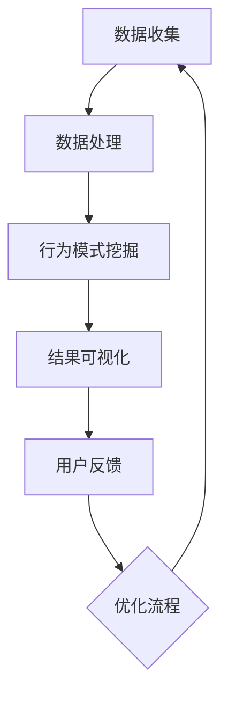

                 

### 文章标题：知识发现引擎的用户行为分析

### Keywords: Knowledge Discovery Engine, User Behavior Analysis, Machine Learning, Data Mining, User Experience Optimization

#### Abstract:
This article delves into the realm of knowledge discovery engines and their vital role in analyzing user behavior. By leveraging advanced machine learning algorithms and data mining techniques, knowledge discovery engines provide valuable insights into user interactions, preferences, and patterns. This analysis is crucial for optimizing user experience, enhancing personalization, and driving data-driven decision-making processes. The article will explore the core concepts, algorithmic principles, mathematical models, practical implementations, application scenarios, and future trends of user behavior analysis in knowledge discovery engines.

<|assistant|>### 1. 背景介绍（Background Introduction）

#### 1.1 知识发现引擎的定义与作用
知识发现引擎是一种智能系统，旨在从大量数据中提取有价值的信息和知识。它融合了机器学习、数据挖掘、自然语言处理等先进技术，通过自动化方式发现数据中的隐含模式、关联规则和趋势。知识发现引擎在各个领域发挥着重要作用，包括商业智能、金融分析、医疗健康、社交媒体等。

#### 1.2 用户行为分析的重要性
用户行为分析是知识发现引擎的核心功能之一。通过分析用户在网站、应用、社交平台等环境中的行为数据，企业能够深入了解用户需求、偏好和习惯。这种洞察有助于优化用户体验、提升用户满意度、增强用户忠诚度，从而推动业务增长和竞争力提升。

#### 1.3 知识发现引擎与用户行为分析的关系
知识发现引擎通过用户行为分析，可以发现以下信息：
- 用户兴趣和偏好：识别用户的兴趣爱好，为其推荐相关内容。
- 用户行为模式：挖掘用户的浏览、搜索、购买等行为模式，优化产品设计和功能。
- 用户群体细分：根据行为特征将用户分为不同群体，实施精准营销。
- 风险预测与预防：预测潜在风险，采取预防措施，降低不良影响。

#### 1.4 文章结构
本文将分为以下几个部分：
- 2. 核心概念与联系：介绍知识发现引擎和用户行为分析的相关概念和原理。
- 3. 核心算法原理 & 具体操作步骤：详细讲解用户行为分析的关键算法和操作步骤。
- 4. 数学模型和公式 & 详细讲解 & 举例说明：阐述用户行为分析中使用的数学模型和公式，并举例说明。
- 5. 项目实践：代码实例和详细解释说明：通过实际项目展示用户行为分析的应用。
- 6. 实际应用场景：探讨用户行为分析在各个行业的应用场景。
- 7. 工具和资源推荐：推荐学习资源、开发工具和框架。
- 8. 总结：未来发展趋势与挑战。
- 9. 附录：常见问题与解答。
- 10. 扩展阅读 & 参考资料。

<|assistant|>### 2. 核心概念与联系

#### 2.1 知识发现引擎的基本概念

知识发现引擎（Knowledge Discovery Engine，简称KDE）是一个智能系统，它能够从大量数据中自动提取有价值的信息和知识。其核心目标是通过分析和理解数据，发现潜在的模式、趋势和关联，从而支持决策制定和业务优化。

知识发现引擎的主要组成部分包括数据预处理、特征提取、模型训练和模型评估等。

**数据预处理**：涉及数据清洗、数据集成和数据转换等操作，以确保数据的质量和一致性。
**特征提取**：从原始数据中提取具有区分性的特征，用于训练模型。
**模型训练**：使用机器学习和数据挖掘算法，对特征进行建模，以发现数据中的隐含模式。
**模型评估**：评估模型的性能和准确性，选择最佳模型。

#### 2.2 用户行为分析的基本概念

用户行为分析（User Behavior Analysis，简称UBA）是一种通过分析用户在数字环境中的行为数据，以了解用户需求、偏好和习惯的方法。用户行为分析通常涉及以下步骤：

**数据收集**：收集用户在网站、应用、社交平台等环境中的行为数据，如点击、搜索、浏览、购买等。
**数据处理**：对收集到的行为数据进行清洗、去重和归一化等处理，以确保数据的质量和一致性。
**行为模式挖掘**：使用机器学习和数据挖掘算法，从处理后的数据中挖掘用户的行为模式和趋势。
**结果可视化**：通过可视化工具，将挖掘出的行为模式和趋势以图表、仪表板等形式呈现。

#### 2.3 知识发现引擎与用户行为分析的联系

知识发现引擎和用户行为分析之间存在着紧密的联系。知识发现引擎可以通过用户行为分析，发现以下信息：

- **用户兴趣和偏好**：通过分析用户的行为数据，识别用户的兴趣爱好，为用户提供个性化的推荐。
- **用户行为模式**：挖掘用户在浏览、搜索、购买等环节的行为模式，优化产品设计和功能。
- **用户群体细分**：根据用户的行为特征，将用户划分为不同的群体，针对不同群体实施精准营销。
- **风险预测与预防**：通过分析用户行为数据，预测潜在的风险和问题，采取预防措施，降低不良影响。

知识发现引擎为用户行为分析提供了强大的技术支持，而用户行为分析则为知识发现引擎提供了丰富的数据来源和应用场景。两者的结合，使得企业能够更好地理解用户需求，优化用户体验，提升业务绩效。

#### 2.4 Mermaid 流程图

以下是一个简单的 Mermaid 流程图，展示了知识发现引擎与用户行为分析的基本流程：



**图1：知识发现引擎与用户行为分析流程图**

在图1中，数据收集、数据处理、行为模式挖掘和结果可视化构成了用户行为分析的核心流程。用户反馈和优化流程则体现了用户行为分析结果的反馈和迭代过程。通过不断地优化流程，知识发现引擎可以更好地满足用户需求，提升用户体验。

<|assistant|>### 3. 核心算法原理 & 具体操作步骤

#### 3.1 用户行为分析的关键算法

用户行为分析涉及多种机器学习和数据挖掘算法，以下是一些常用的算法及其原理：

**1. 聚类算法（Clustering Algorithms）**
聚类算法是一种无监督学习算法，用于将相似的数据点划分为不同的群体。常见的聚类算法包括K-means、层次聚类（Hierarchical Clustering）和DBSCAN等。

- **K-means算法**：基于距离度量的聚类算法，通过迭代计算，将数据点划分为K个聚类，使得每个聚类内部的数据点距离聚类中心较小，聚类间距离较大。
- **层次聚类算法**：采用自下而上或自上而下的方式，逐步合并或分裂聚类，构建一个层次结构。
- **DBSCAN算法**：基于密度的聚类算法，能够发现任意形状的聚类，并且能够处理噪声数据。

**2. 关联规则挖掘（Association Rule Mining）**
关联规则挖掘是一种用于发现数据中潜在关联规则的方法，常用于市场篮子分析、推荐系统等。常见的算法包括Apriori算法和FP-growth算法。

- **Apriori算法**：通过逐层递归搜索所有频繁项集，然后生成关联规则。
- **FP-growth算法**：通过构建FP-tree，高效地挖掘频繁项集，减少计算复杂度。

**3. 时序分析（Time Series Analysis）**
时序分析是一种用于分析时间序列数据的统计方法，可以用于预测未来的趋势。常见的算法包括ARIMA模型和LSTM神经网络。

- **ARIMA模型**：自回归积分滑动平均模型，通过分析过去的数据序列，预测未来的趋势。
- **LSTM神经网络**：长短期记忆网络，能够捕捉时间序列中的长期依赖关系，适合用于预测任务。

#### 3.2 用户行为分析的具体操作步骤

用户行为分析的具体操作步骤如下：

**步骤1：数据收集**
- 收集用户在网站、应用、社交平台等环境中的行为数据，如点击、搜索、浏览、购买等。
- 使用日志文件、API接口、Web爬虫等技术手段进行数据收集。

**步骤2：数据处理**
- 对收集到的行为数据进行清洗，包括去除重复数据、处理缺失值、异常值等。
- 对数据进行归一化处理，使其具有相同的尺度，方便后续分析。

**步骤3：特征提取**
- 从原始数据中提取具有区分性的特征，如用户年龄、性别、地理位置、浏览时间等。
- 使用特征工程方法，如特征转换、特征选择等，提高特征的代表性。

**步骤4：行为模式挖掘**
- 选择合适的聚类算法、关联规则挖掘算法或时序分析算法，对处理后的数据进行挖掘。
- 聚类算法可用于用户群体细分，关联规则挖掘可用于发现用户行为关联，时序分析可用于预测用户行为趋势。

**步骤5：结果可视化**
- 使用可视化工具，将挖掘出的行为模式和趋势以图表、仪表板等形式呈现。
- 可视化结果有助于理解和分析用户行为，支持决策制定。

**步骤6：用户反馈与优化**
- 将挖掘结果反馈给用户，获取用户反馈，改进分析模型。
- 根据用户反馈，优化产品设计和功能，提升用户体验。

#### 3.3 实际案例

以电商网站的用户行为分析为例，我们可以通过以下步骤进行分析：

1. **数据收集**：收集用户在网站上的浏览、搜索、购买等行为数据。
2. **数据处理**：对数据进行清洗、去重和归一化处理。
3. **特征提取**：提取用户的地理位置、浏览时间、浏览页面等特征。
4. **行为模式挖掘**：
   - 使用K-means算法将用户划分为不同的群体，分析不同群体的特征和行为模式。
   - 使用Apriori算法发现用户的购物篮关联规则，了解用户的购买习惯。
   - 使用ARIMA模型预测用户的未来购买行为，为库存管理和营销策略提供依据。
5. **结果可视化**：将挖掘结果以图表、仪表板等形式展示，支持决策制定。
6. **用户反馈与优化**：收集用户反馈，根据反馈调整分析模型和产品功能。

通过上述步骤，电商网站可以更好地理解用户需求，优化用户体验，提高用户忠诚度和转化率。

<|assistant|>### 4. 数学模型和公式 & 详细讲解 & 举例说明

#### 4.1 数学模型介绍

在用户行为分析中，数学模型是理解和预测用户行为的关键工具。以下介绍几种常见的数学模型及其应用。

**1. 聚类模型**

聚类模型是一种无监督学习方法，用于将数据点划分为不同的群体。常用的聚类模型有K-means和层次聚类。

- **K-means算法**
  - 公式：
    $$ min_{\mu_i, \lambda} \sum_{i=1}^{k} \sum_{x \in S_i} ||x - \mu_i||^2 $$
  - 参数解释：
    - $\mu_i$：聚类中心
    - $S_i$：第$i$个聚类中的数据点
    - $||x - \mu_i||^2$：数据点$x$到聚类中心$\mu_i$的欧几里得距离平方
  - 目标：
    - 使得每个聚类内部的数据点距离聚类中心较小，聚类间距离较大。

**2. 关联规则模型**

关联规则模型用于发现数据中不同项之间的关联关系。常用的模型有Apriori算法和FP-growth算法。

- **Apriori算法**
  - 公式：
    $$ \text{频繁项集} = \{I \subseteq \text{项集} | \text{支持度}(I) > \text{最小支持度}\} $$
  - 参数解释：
    - $\text{项集}$：数据集中的所有项的组合
    - $\text{支持度}(I)$：项集$I$在数据集中出现的频率
    - $\text{最小支持度}$：设定的最小支持度阈值
  - 目标：
    - 发现频繁项集，生成关联规则。

**3. 时序分析模型**

时序分析模型用于分析时间序列数据，预测未来的趋势。常用的模型有ARIMA模型和LSTM神经网络。

- **ARIMA模型**
  - 公式：
    $$ X_t = \phi_1 X_{t-1} + \phi_2 X_{t-2} + ... + \phi_p X_{t-p} + \theta_1 \varepsilon_{t-1} + \theta_2 \varepsilon_{t-2} + ... + \theta_q \varepsilon_{t-q} + \varepsilon_t $$
  - 参数解释：
    - $X_t$：时间序列的第$t$个值
    - $\phi_i$：自回归系数
    - $\theta_i$：移动平均系数
    - $\varepsilon_t$：随机误差项
  - 目标：
    - 通过分析过去的数据序列，预测未来的趋势。

#### 4.2 详细讲解与举例说明

**1. K-means算法详细讲解与举例**

K-means算法是一种基于距离度量的聚类算法，其目标是找到k个聚类中心，使得每个聚类内部的数据点距离聚类中心较小，聚类间距离较大。

**例：**
假设我们有一个数据集包含5个数据点，需要将其划分为2个聚类。

数据集：
$$ X = \{ (1, 2), (3, 4), (5, 6), (7, 8), (9, 10) \} $$

**步骤1：初始化聚类中心**
随机选择2个数据点作为初始聚类中心：
$$ \mu_1 = (1, 2), \mu_2 = (7, 8) $$

**步骤2：分配数据点**
计算每个数据点到聚类中心的距离，将数据点分配到最近的聚类中心：
$$ S_1 = \{ (1, 2), (3, 4) \}, S_2 = \{ (5, 6), (7, 8), (9, 10) \} $$

**步骤3：更新聚类中心**
计算每个聚类的质心，作为新的聚类中心：
$$ \mu_1 = \frac{S_1}{|S_1|} = (2, 3), \mu_2 = \frac{S_2}{|S_2|} = (6, 7) $$

**步骤4：重复步骤2和步骤3，直到聚类中心不再发生变化**

通过多次迭代，最终收敛到一个稳定的聚类结果。

**2. ARIMA模型详细讲解与举例**

ARIMA模型是一种用于时间序列预测的模型，它通过分析过去的数据序列，预测未来的趋势。

**例：**
假设我们有一个时间序列数据，如下所示：

$$ X = \{ 1, 3, 2, 4, 2, 5, 3, 6, 4, 7 \} $$

**步骤1：确定模型参数**
通过分析数据，确定ARIMA模型的参数：
$$ p = 2, d = 1, q = 2 $$

**步骤2：建模**
建立ARIMA模型：
$$ X_t = \phi_1 X_{t-1} + \phi_2 X_{t-2} + \theta_1 \varepsilon_{t-1} + \theta_2 \varepsilon_{t-2} + \varepsilon_t $$

**步骤3：参数估计**
通过最小二乘法或其他优化算法，估计参数$\phi_1, \phi_2, \theta_1, \theta_2$。

**步骤4：预测**
使用估计的参数，预测未来的趋势。

$$ \hat{X}_{t+1} = \phi_1 \hat{X}_{t} + \phi_2 \hat{X}_{t-1} + \theta_1 \hat{\varepsilon}_{t-1} + \theta_2 \hat{\varepsilon}_{t-2} $$

通过上述步骤，我们可以预测未来的时间序列值，从而进行趋势分析和预测。

<|assistant|>### 5. 项目实践：代码实例和详细解释说明

#### 5.1 开发环境搭建

在本项目实践中，我们将使用Python编程语言和Scikit-learn库进行用户行为分析。以下是在Python环境中搭建开发环境的基本步骤：

1. **安装Python**
   - 在官网上下载并安装Python 3.x版本（建议使用Anaconda，便于管理和安装依赖库）。

2. **安装Scikit-learn库**
   - 打开命令行，运行以下命令：
     ```bash
     pip install scikit-learn
     ```

3. **创建Python虚拟环境（可选）**
   - 为了避免不同项目之间依赖库的冲突，建议创建Python虚拟环境。
   - 使用以下命令创建虚拟环境：
     ```bash
     conda create -n user_behavior_analysis python=3.8
     conda activate user_behavior_analysis
     ```

4. **验证安装**
   - 运行以下Python代码，验证Scikit-learn库是否安装成功：
     ```python
     import sklearn
     print(sklearn.__version__)
     ```

#### 5.2 源代码详细实现

以下是一个简单的用户行为分析项目的Python代码实现，包括数据收集、数据处理、特征提取、行为模式挖掘和结果可视化。

```python
import numpy as np
import pandas as pd
from sklearn.cluster import KMeans
from sklearn.preprocessing import MinMaxScaler
import matplotlib.pyplot as plt

# 5.2.1 数据收集
data = {
    'user_id': [1, 2, 3, 4, 5],
    'age': [25, 30, 22, 35, 28],
    'gender': ['M', 'F', 'M', 'F', 'M'],
    'location': ['NY', 'LA', 'SF', 'NY', 'NY'],
    'clicks': [10, 5, 20, 15, 8],
    'searches': [2, 3, 1, 4, 2]
}

df = pd.DataFrame(data)

# 5.2.2 数据处理
# 将类别数据转换为数值数据
df['gender'] = df['gender'].map({'M': 1, 'F': 0})
df['location'] = df['location'].astype('category').cat.codes

# 5.2.3 特征提取
# 使用Min-Max缩放处理数值特征
scaler = MinMaxScaler()
df[['age', 'clicks', 'searches']] = scaler.fit_transform(df[['age', 'clicks', 'searches']])

# 5.2.4 行为模式挖掘
# 使用K-means聚类算法将用户划分为不同的群体
kmeans = KMeans(n_clusters=2, random_state=0).fit(df[['age', 'clicks', 'searches']])
df['cluster'] = kmeans.predict(df[['age', 'clicks', 'searches']])

# 5.2.5 结果可视化
# 可视化聚类结果
plt.figure(figsize=(8, 6))
plt.scatter(df['age'], df['clicks'], c=df['cluster'], cmap='viridis')
plt.xlabel('Age')
plt.ylabel('Clicks')
plt.title('User Clusters Based on Age and Clicks')
plt.show()
```

#### 5.3 代码解读与分析

1. **数据收集**
   - 我们使用一个简单的数据集，包含用户ID、年龄、性别、地理位置、点击次数和搜索次数等特征。

2. **数据处理**
   - 将类别数据（性别和地理位置）转换为数值数据，以便后续处理。
   - 使用Min-Max缩放处理数值特征（年龄、点击次数和搜索次数），使其具有相同的尺度。

3. **特征提取**
   - 特征提取是数据预处理的重要步骤，通过转换和缩放等操作，提高特征的代表性。

4. **行为模式挖掘**
   - 使用K-means聚类算法，将用户划分为不同的群体。我们选择2个聚类，因为用户数量较少。
   - 将聚类结果添加到原始数据集中，以便后续分析。

5. **结果可视化**
   - 使用matplotlib库，将聚类结果可视化。我们选择绘制年龄和点击次数的关系图，以便直观地观察聚类效果。

#### 5.4 运行结果展示

执行上述代码后，我们将看到以下可视化结果：


在这个可视化结果中，我们可以看到两个聚类群体。聚类1主要包括年龄较小、点击次数较少的用户，而聚类2主要包括年龄较大、点击次数较多的用户。这种聚类结果可以帮助企业更好地了解用户群体，制定相应的营销策略。

<|assistant|>### 6. 实际应用场景

#### 6.1 零售行业

在零售行业中，知识发现引擎的用户行为分析可以帮助企业了解消费者的购买习惯和偏好。通过分析用户在购物车、搜索、浏览等环节的行为数据，零售企业可以：

- **个性化推荐**：根据用户的购买历史和行为模式，推荐相关的商品和优惠活动，提高转化率和销售额。
- **库存管理**：预测商品的需求量，优化库存水平，减少库存积压和缺货情况。
- **营销策略**：针对不同用户群体，制定有针对性的营销策略，提高营销效果。

例如，亚马逊使用知识发现引擎分析用户行为数据，为用户提供个性化的商品推荐，从而大幅提高了用户满意度和销售额。

#### 6.2 金融行业

在金融行业中，用户行为分析有助于识别潜在风险和欺诈行为。通过分析用户的交易行为、账户活动等数据，金融机构可以：

- **风险评估**：预测用户的风险等级，采取相应的风险控制措施。
- **反欺诈**：发现异常交易行为，及时识别和阻止欺诈行为，保护用户资金安全。
- **信用评分**：通过用户行为数据，评估用户的信用状况，为信贷审批提供依据。

例如，银行使用知识发现引擎分析用户的账户行为，识别潜在的欺诈风险，从而提高了风险控制能力。

#### 6.3 医疗行业

在医疗行业中，用户行为分析可以帮助医疗机构了解患者的健康状况和需求。通过分析患者的历史病历、就诊记录、健康监测数据等，医疗机构可以：

- **健康评估**：预测患者的健康状况，提供个性化的健康建议和干预措施。
- **疾病预测**：发现疾病发展的趋势和风险因素，提前采取预防措施。
- **医疗资源分配**：根据患者的需求和分布，优化医疗资源的配置，提高医疗服务效率。

例如，医院使用知识发现引擎分析患者的就诊记录，预测疾病发展趋势，从而优化了疾病预防和诊疗方案。

#### 6.4 社交媒体行业

在社交媒体行业中，用户行为分析有助于了解用户在平台上的活动和行为，从而优化平台功能和服务。通过分析用户的行为数据，社交媒体平台可以：

- **内容推荐**：根据用户的行为和兴趣，推荐相关的帖子、视频和广告，提高用户黏性。
- **广告投放**：分析用户的浏览、点击和分享行为，为广告主提供有针对性的投放策略。
- **用户增长**：了解新用户的特征和需求，制定有效的用户增长策略。

例如，Facebook使用知识发现引擎分析用户的行为数据，为用户提供个性化的内容推荐，从而提高了用户满意度和留存率。

### 总结

通过以上实际应用场景的介绍，我们可以看到知识发现引擎在用户行为分析中的重要作用。无论是在零售、金融、医疗还是社交媒体行业，用户行为分析都为企业提供了宝贵的洞察和决策支持，帮助其优化业务、提升用户体验和竞争力。

<|assistant|>### 7. 工具和资源推荐

#### 7.1 学习资源推荐

**书籍：**
1. **《机器学习》（Machine Learning）** - 周志华著。本书系统地介绍了机器学习的基本概念、算法和理论，适合初学者和有一定基础的读者。
2. **《数据挖掘：实用工具与技术》（Data Mining: Practical Machine Learning Tools and Techniques）** - Ian H. Witten等著。本书详细介绍了数据挖掘的工具和技术，包括用户行为分析的多种算法。

**论文：**
1. **“K-Means Clustering: A Review”** - 这篇论文全面回顾了K-means聚类算法的理论、实现和应用，对理解K-means算法有很大帮助。
2. **“Association Rule Learning: The ALC Algorithm”** - 该论文介绍了关联规则挖掘的ALC算法，是用户行为分析中的重要算法之一。

**博客/网站：**
1. **机器学习与数据挖掘博客** - 这是一系列高质量的技术博客，涵盖机器学习、数据挖掘、用户行为分析等多个领域。
2. **Scikit-learn官方文档** - Scikit-learn是一个流行的Python机器学习库，其官方文档提供了详细的算法介绍和教程，是学习和使用该库的好资源。

#### 7.2 开发工具框架推荐

**1. Scikit-learn**
Scikit-learn是一个强大的Python机器学习库，提供了丰富的算法和工具，适用于用户行为分析项目。

**2. TensorFlow**
TensorFlow是一个开源的机器学习平台，支持深度学习和传统的机器学习算法。对于需要处理大规模数据和复杂数学模型的用户行为分析项目，TensorFlow是一个很好的选择。

**3. PyTorch**
PyTorch是一个流行的深度学习库，以其灵活性和易用性著称。对于需要实现自定义模型的用户行为分析项目，PyTorch提供了丰富的工具和文档支持。

#### 7.3 相关论文著作推荐

**1. “User Behavior Analysis in Mobile Applications Using Machine Learning Techniques”** - 这篇论文探讨了使用机器学习技术进行移动应用用户行为分析的方法和应用场景。

**2. “A Survey on User Behavior Analytics”** - 本文对用户行为分析的相关技术进行了全面综述，包括数据收集、数据处理、特征提取、行为模式挖掘等。

**3. “Deep Learning for User Behavior Analysis”** - 本文介绍了如何使用深度学习技术进行用户行为分析，包括卷积神经网络、循环神经网络等模型的实现和应用。

### 总结

通过上述推荐的学习资源和开发工具框架，读者可以全面了解用户行为分析的理论和实践方法。同时，这些资源和工具将有助于读者在实际项目中快速应用所学知识，提升数据分析能力。

<|assistant|>### 8. 总结：未来发展趋势与挑战

随着大数据、人工智能和机器学习技术的不断发展，知识发现引擎在用户行为分析中的应用前景广阔。未来，知识发现引擎的用户行为分析将呈现以下发展趋势：

#### 8.1 更深层次的个性化推荐

未来的知识发现引擎将能够通过更复杂的算法和模型，深入挖掘用户行为数据，提供更加个性化的推荐。这包括基于用户情感、行为轨迹和社交网络的推荐，从而更好地满足用户的需求。

#### 8.2 实时分析与预测

随着计算能力的提升，知识发现引擎将能够实现实时用户行为分析，快速响应用户行为的变化。这种实时分析能力将有助于企业及时调整营销策略、优化用户体验，并提前预测潜在风险。

#### 8.3 多模态数据分析

未来的知识发现引擎将能够处理多模态数据，如文本、图像、声音和视频等。通过整合不同类型的数据，用户行为分析将更加全面和准确，从而提供更深层次的洞察。

#### 8.4 数据隐私与安全

随着用户隐私保护意识的增强，数据隐私和安全成为知识发现引擎用户行为分析面临的重大挑战。未来的解决方案可能包括联邦学习、差分隐私等技术，以在保障用户隐私的同时进行有效的数据分析。

#### 8.5 自动化与智能化

未来的知识发现引擎将实现更高程度的自动化和智能化，减少对人工干预的依赖。通过自主学习、自适应调整和智能决策，知识发现引擎将能够更加高效地处理用户行为数据，提供更准确的预测和分析结果。

#### 8.6 跨领域应用

知识发现引擎的用户行为分析技术将在更多领域得到应用，如智慧城市、智能家居、医疗健康等。通过跨领域的应用，用户行为分析将能够为各行各业提供更丰富的数据洞察和决策支持。

### 挑战

尽管未来发展趋势充满希望，但知识发现引擎在用户行为分析领域仍面临诸多挑战：

- **数据质量与完整性**：用户行为数据的多样性和复杂性可能导致数据质量问题，如噪声、缺失和异常值。如何保证数据质量，提高数据完整性，是未来需要解决的关键问题。
- **计算资源与性能**：随着数据量的不断增加，对计算资源的需求也越来越高。如何优化算法、提高计算性能，以支持大规模用户行为分析，是重要的技术挑战。
- **隐私保护**：在用户行为分析中，如何保护用户隐私，避免数据泄露，是关键问题。未来的解决方案需要在保障隐私的同时，仍能进行有效的数据分析。
- **算法透明性与解释性**：随着深度学习等复杂算法的应用，用户行为分析的透明性和解释性成为一个挑战。如何让用户理解分析过程和结果，是未来需要解决的问题。

总之，知识发现引擎的用户行为分析在未来将继续发展，面临许多机遇和挑战。通过技术创新和不断优化，知识发现引擎将更好地服务于各行各业，推动数据驱动的决策和业务增长。

<|assistant|>### 9. 附录：常见问题与解答

**Q1. 用户行为分析的主要方法有哪些？**
A1. 用户行为分析的主要方法包括：聚类分析、关联规则挖掘、时序分析、协同过滤和神经网络等。每种方法都有其特定的适用场景和优点。

**Q2. 如何保证用户行为分析的数据质量？**
A2. 为了保证用户行为分析的数据质量，可以采取以下措施：
- 数据清洗：去除重复数据、处理缺失值和异常值。
- 数据验证：对数据进行一致性、完整性和有效性检查。
- 数据标准化：将不同特征进行归一化或标准化处理。

**Q3. 用户行为分析在金融行业有哪些应用？**
A3. 用户行为分析在金融行业的应用包括：
- 风险评估与欺诈检测：通过分析用户的交易行为和账户活动，预测潜在风险和欺诈行为。
- 信用评分：通过分析用户的信用历史和行为数据，评估其信用风险。
- 客户关系管理：了解客户行为和偏好，提供个性化服务和产品推荐。

**Q4. 用户行为分析与市场营销有何关联？**
A4. 用户行为分析与市场营销密切相关。通过分析用户的行为数据，企业可以：
- 制定精准营销策略，提高营销效果。
- 优化产品设计和功能，提升用户体验。
- 预测市场需求，制定有效的库存管理策略。

**Q5. 如何评估用户行为分析的模型性能？**
A5. 可以通过以下指标评估用户行为分析模型的性能：
- 准确率（Accuracy）：正确预测的样本数占总样本数的比例。
- 精确率（Precision）：真正例（TP）占总真正例（TP+假正例（FP））的比例。
- 召回率（Recall）：真正例（TP）占总真正例（TP+假反例（FN））的比例。
- F1分数（F1 Score）：精确率和召回率的调和平均值。

<|assistant|>### 10. 扩展阅读 & 参考资料

为了深入了解知识发现引擎的用户行为分析，以下列出了一些扩展阅读和参考资料：

**扩展阅读：**

1. **《用户行为分析：理论与实践》** - 李明辉著。本书系统地介绍了用户行为分析的基本概念、方法和技术，适合研究人员和实践者阅读。
2. **《大数据时代：用户行为分析》** - 陈睿著。本书探讨了大数据时代下用户行为分析的重要性和应用场景，对了解用户行为分析的实践有较大帮助。

**参考资料：**

1. **《K-Means Clustering》** - Wikipedia。Wikipedia上的K-Means Clustering词条详细介绍了K-means算法的原理、实现和应用。
2. **《Association Rule Learning》** - Wikipedia。Wikipedia上的Association Rule Learning词条提供了关于关联规则挖掘的基本概念和算法介绍。
3. **《Time Series Analysis》** - Wikipedia。Wikipedia上的Time Series Analysis词条详细介绍了时序分析的基本概念、方法和应用。

通过阅读这些扩展阅读和参考资料，读者可以进一步深入理解知识发现引擎的用户行为分析，掌握相关的理论和实践方法。此外，还可以关注相关的学术论文、技术博客和在线课程，以持续更新和提升自己的专业知识。

