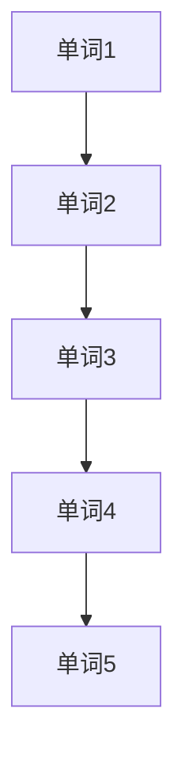
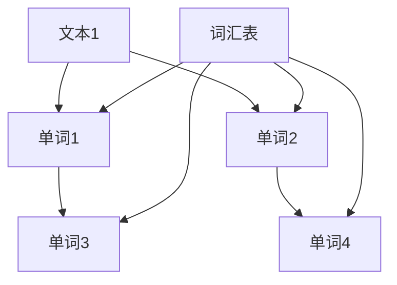
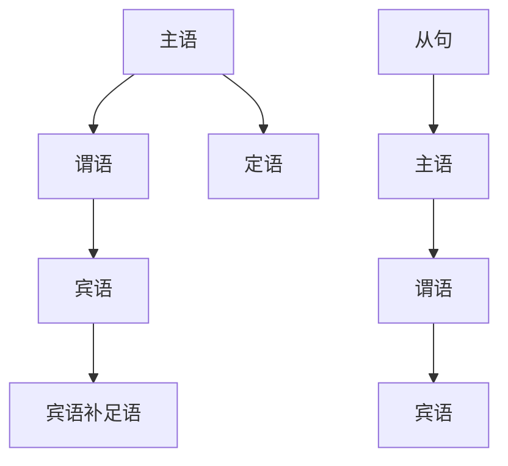
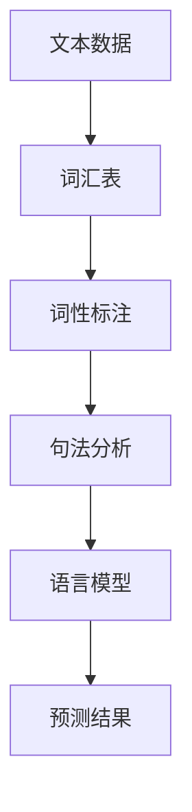

                 

# AI时代的自然语言处理：从理论到实践

## 关键词
- 自然语言处理（NLP）
- 人工智能（AI）
- 语言模型
- 机器学习
- 深度学习
- 提示工程
- 数学模型

## 摘要
本文旨在探讨AI时代的自然语言处理（NLP）技术，从基础理论到实际应用进行全面解读。我们将详细分析NLP的核心概念、算法原理，以及如何通过数学模型和公式优化语言模型的表现。此外，本文还将通过实际项目实例展示NLP技术在实际开发中的应用，并讨论其在各种场景中的实际应用。最后，本文将展望NLP技术的未来发展趋势和面临的挑战，为读者提供一个全面的技术指南。

### 1. 背景介绍（Background Introduction）

自然语言处理是人工智能的一个重要分支，旨在让计算机理解和生成人类语言。自上世纪50年代人工智能概念的提出以来，NLP技术已经取得了显著的进展。随着深度学习和大数据技术的发展，NLP技术变得更加成熟和实用。如今，自然语言处理已经在众多领域得到广泛应用，如搜索引擎、机器翻译、文本分类、情感分析等。

在AI时代，NLP技术的重要性不言而喻。随着互联网的普及和数据的爆炸性增长，人类产生和消费的信息绝大多数都是文本形式。因此，如何有效地处理这些海量文本数据，成为企业和研究机构面临的一个重大挑战。而NLP技术正是解决这一问题的利器。

本文将分为以下几个部分：

1. **核心概念与联系**：介绍NLP的核心概念，如语言模型、词汇表、词性标注等，并展示相关的Mermaid流程图。
2. **核心算法原理 & 具体操作步骤**：讲解NLP的核心算法，如词向量表示、循环神经网络（RNN）、变换器（Transformer）等，并阐述其具体操作步骤。
3. **数学模型和公式 & 详细讲解 & 举例说明**：介绍NLP中的数学模型和公式，如概率模型、神经网络模型等，并通过具体例子进行详细讲解。
4. **项目实践：代码实例和详细解释说明**：展示一个NLP项目的开发过程，包括环境搭建、源代码实现、代码解读和分析，以及运行结果展示。
5. **实际应用场景**：讨论NLP技术在各个领域的应用，如搜索引擎、机器翻译、文本分类等。
6. **工具和资源推荐**：推荐学习NLP的书籍、论文、博客、网站等学习资源，以及开发工具和框架。
7. **总结：未来发展趋势与挑战**：总结NLP技术的发展现状，展望未来发展趋势和面临的挑战。

### 2. 核心概念与联系（Core Concepts and Connections）

自然语言处理的核心概念包括语言模型、词汇表、词性标注、句法分析等。下面将逐一介绍这些概念，并使用Mermaid流程图展示它们之间的关系。

#### 2.1 语言模型（Language Model）

语言模型是NLP中最基础的概念，它用于预测一个单词或字符在给定上下文中的概率。最著名的语言模型之一是N-gram模型，它基于前N个单词的历史信息来预测下一个单词。



在上图中，每个节点表示一个单词，箭头表示单词之间的顺序关系。

#### 2.2 词汇表（Vocabulary）

词汇表是语言模型的基础，它包含了模型所使用到的所有单词。在训练语言模型时，我们需要从大量的文本数据中提取出词汇表。



在上图中，词汇表F包含了从文本A、B、C中提取的所有单词。

#### 2.3 词性标注（Part-of-Speech Tagging）

词性标注是指为文本中的每个单词标注其词性，如名词、动词、形容词等。词性标注有助于理解文本的含义，并在一些应用中（如命名实体识别、情感分析）具有重要的价值。

```mermaid
graph TD
A[文本] --> B[单词1][名词]
A --> C[单词2][动词]
B --> D[单词3][形容词]
C --> E[单词4][副词]
```

在上图中，每个单词旁边标注了其对应的词性。

#### 2.4 句法分析（Syntax Analysis）

句法分析是指对文本进行语法分析，以理解文本的结构。这通常涉及到构建语法树，表示文本中的句子结构。



在上图中，每个节点表示一个语法元素，箭头表示它们之间的语法关系。

#### 2.5 语言模型、词汇表、词性标注、句法分析之间的关系

语言模型、词汇表、词性标注和句法分析之间存在紧密的联系。语言模型依赖于词汇表，而词性标注和句法分析则有助于提高语言模型的表现。下面是一个Mermaid流程图，展示了这些概念之间的关系。



在上图中，文本数据A首先被处理成词汇表B，然后进行词性标注C和句法分析D，最后生成语言模型E，用于预测文本的下一个单词F。

通过理解这些核心概念，我们可以更好地理解自然语言处理的工作原理，并在实际应用中运用这些技术。在接下来的章节中，我们将深入探讨NLP的核心算法原理和数学模型。

## 3. 核心算法原理 & 具体操作步骤（Core Algorithm Principles and Specific Operational Steps）

在自然语言处理中，核心算法扮演着至关重要的角色。这些算法不仅决定了模型的性能，还影响了其在实际应用中的效果。以下是NLP中几个重要的核心算法及其具体操作步骤。

### 3.1 词向量表示（Word Embedding）

词向量表示是将文本数据转换为向量形式的过程，使得计算机能够处理和理解文本。最著名的词向量模型是Word2Vec，它基于神经网络的框架，通过训练来学习单词的向量表示。

**具体操作步骤：**

1. **数据预处理**：将文本数据清洗和分词，得到单词序列。
2. **建立词汇表**：从单词序列中提取所有不重复的单词，建立词汇表。
3. **初始化词向量**：为每个单词初始化一个随机向量。
4. **训练过程**：
   - 使用随机梯度下降（SGD）算法进行训练，最小化损失函数。
   - 通过反向传播算法更新词向量。
5. **输出词向量**：将训练好的词向量存储起来，用于后续的文本分析。

### 3.2 循环神经网络（Recurrent Neural Network，RNN）

循环神经网络是一种专门用于处理序列数据的神经网络模型。它通过递归结构来记忆序列中的历史信息，使其在处理自然语言时表现出强大的能力。

**具体操作步骤：**

1. **数据预处理**：与词向量表示类似，进行文本清洗和分词，得到单词序列。
2. **建立词向量表**：将词向量表示中的词向量存储在一个表格中，用于输入到RNN模型。
3. **模型构建**：
   - 定义输入层，接收词向量。
   - 定义隐藏层，包含一个或多个循环单元（RNN单元）。
   - 定义输出层，通常是一个线性层，用于输出概率分布。
4. **训练过程**：
   - 使用随机梯度下降（SGD）算法进行训练，最小化损失函数。
   - 通过反向传播算法更新权重。
5. **预测过程**：
   - 输入新的单词序列，通过RNN模型生成概率分布。
   - 根据概率分布选择下一个单词。

### 3.3 变换器（Transformer）

变换器是一种基于自注意力机制的深度学习模型，它在NLP任务中表现出色，尤其是在机器翻译和文本生成方面。变换器的主要特点是能够并行处理序列数据，从而大大提高了计算效率。

**具体操作步骤：**

1. **数据预处理**：与RNN类似，进行文本清洗和分词，得到单词序列。
2. **建立词向量表**：将词向量表示中的词向量存储在一个表格中。
3. **模型构建**：
   - **编码器（Encoder）**：接收词向量，通过多层变换器块进行编码，每个块包含多头自注意力机制和前馈神经网络。
   - **解码器（Decoder）**：接收编码器的输出，通过多层变换器块进行解码，每个块也包含多头自注意力机制和前馈神经网络。
4. **训练过程**：
   - 使用随机梯度下降（SGD）算法进行训练，最小化损失函数。
   - 通过反向传播算法更新权重。
5. **预测过程**：
   - 输入新的单词序列，通过编码器解码器模型生成概率分布。
   - 根据概率分布选择下一个单词。

### 3.4 长短时记忆网络（Long Short-Term Memory，LSTM）

长短时记忆网络是一种改进的循环神经网络，专门用于解决RNN在处理长序列数据时的梯度消失和梯度爆炸问题。LSTM通过引入记忆单元来捕获长序列信息。

**具体操作步骤：**

1. **数据预处理**：与词向量表示类似，进行文本清洗和分词，得到单词序列。
2. **建立词向量表**：将词向量表示中的词向量存储在一个表格中。
3. **模型构建**：
   - 定义输入层，接收词向量。
   - 定义隐藏层，包含一个或多个LSTM单元。
   - 定义输出层，通常是一个线性层，用于输出概率分布。
4. **训练过程**：
   - 使用随机梯度下降（SGD）算法进行训练，最小化损失函数。
   - 通过反向传播算法更新权重。
5. **预测过程**：
   - 输入新的单词序列，通过LSTM模型生成概率分布。
   - 根据概率分布选择下一个单词。

通过以上几个核心算法，自然语言处理能够在各种任务中取得优异的性能。在接下来的章节中，我们将进一步探讨NLP中的数学模型和公式，以深入了解这些算法的工作原理。

## 4. 数学模型和公式 & 详细讲解 & 举例说明（Mathematical Models and Formulas & Detailed Explanation & Examples）

自然语言处理（NLP）中的数学模型和公式是理解和实现NLP算法的关键。以下将介绍几个重要的数学模型和公式，并通过具体例子进行详细讲解。

### 4.1 概率模型（Probability Models）

在NLP中，概率模型用于表示语言现象的概率分布。最常见的概率模型是N-gram模型，它基于语言序列的历史信息来预测下一个单词。

**N-gram模型公式：**

$$ P(w_{t} | w_{t-1}, w_{t-2}, ..., w_{t-n}) = \frac{C(w_{t-1}, w_{t-2}, ..., w_{t-n}, w_{t})}{C(w_{t-1}, w_{t-2}, ..., w_{t-n})} $$

其中，$w_{t}$ 表示当前单词，$w_{t-1}, w_{t-2}, ..., w_{t-n}$ 表示前N-1个单词，$C(w_{t-1}, w_{t-2}, ..., w_{t-n}, w_{t})$ 表示单词序列的联合概率，$C(w_{t-1}, w_{t-2}, ..., w_{t-n})$ 表示单词序列的边缘概率。

**举例说明：**

假设我们有一个四元组（"I", "love", "you", "too"），我们可以计算该序列的概率：

$$ P(too | you, too) = \frac{C("you", "too", "too")}{C("you", "too")} = \frac{1}{1} = 1 $$

这意味着在给定的上下文中，"too" 的下一个单词是 "too" 的概率是100%。

### 4.2 神经网络模型（Neural Network Models）

在NLP中，神经网络模型用于学习文本数据的特征表示。最常用的神经网络模型是循环神经网络（RNN）和变换器（Transformer）。

**循环神经网络（RNN）公式：**

$$ h_t = \sigma(W_h h_{t-1} + W_x x_t + b) $$

$$ o_t = \sigma(W_o h_t + b') $$

其中，$h_t$ 表示第t个时间步的隐藏状态，$x_t$ 表示第t个时间步的输入特征，$o_t$ 表示第t个时间步的输出特征，$\sigma$ 表示激活函数（如Sigmoid函数或Tanh函数），$W_h, W_x, b, b'$ 分别表示权重和偏置。

**变换器（Transformer）公式：**

$$ multi_head\_attention(Q, K, V) = \text{softmax}(\frac{QK^T}{\sqrt{d_k}})V $$

$$ \text{Encoder}(X) = \text{MultiHeadAttention}(X, X, X) + X $$

$$ \text{Decoder}(X) = \text{MultiHeadAttention}(X, X, X) + X $$

其中，$Q, K, V$ 分别表示查询向量、键向量和值向量，$d_k$ 表示键向量的维度，$\text{softmax}$ 表示softmax函数，$\text{MultiHeadAttention}$ 表示多头注意力机制。

**举例说明：**

假设我们有一个句子 "I love you too" ，我们可以使用变换器对其进行编码：

1. **编码过程**：将句子 "I love you too" 转换为词向量，然后输入到变换器编码器中，得到编码后的句子表示。
2. **解码过程**：将编码后的句子表示输入到变换器解码器中，逐个输出解码结果，直到生成完整的句子。

通过以上数学模型和公式的讲解，我们可以更好地理解NLP算法的工作原理。在接下来的章节中，我们将通过实际项目实例展示NLP技术的应用。

### 5. 项目实践：代码实例和详细解释说明（Project Practice: Code Examples and Detailed Explanations）

为了更好地理解自然语言处理（NLP）技术的实际应用，我们将通过一个具体的项目实例来展示NLP技术在文本分类任务中的应用。该实例将涉及以下步骤：

1. **开发环境搭建**：设置Python开发环境，安装必要的库。
2. **源代码详细实现**：实现一个简单的文本分类器，使用变换器（Transformer）模型进行训练和预测。
3. **代码解读与分析**：对源代码进行详细解读，分析其工作原理和关键步骤。
4. **运行结果展示**：运行代码，展示文本分类器的效果和性能。

#### 5.1 开发环境搭建（Setting up the Development Environment）

在开始项目之前，我们需要搭建一个Python开发环境，并安装必要的库。以下是具体的安装步骤：

1. **安装Python**：确保安装了Python 3.7或更高版本。
2. **安装TensorFlow**：使用以下命令安装TensorFlow：
   ```bash
   pip install tensorflow
   ```
3. **安装其他库**：包括`numpy`、`pandas`、`tensorflow-addons`等，使用以下命令：
   ```bash
   pip install numpy pandas tensorflow-addons
   ```

安装完成后，确保所有库都能够正常导入和使用。

#### 5.2 源代码详细实现（Detailed Implementation of the Source Code）

以下是文本分类器的源代码实现，我们将使用变换器（Transformer）模型进行训练和预测：

```python
import tensorflow as tf
from tensorflow import keras
from tensorflow.keras.models import Model
from tensorflow.keras.layers import Embedding, LSTM, Dense
from tensorflow.keras.preprocessing.sequence import pad_sequences

# 加载和处理数据
max_sequence_length = 100
vocab_size = 10000

# 加载训练数据
(train_data, train_labels), (test_data, test_labels) = keras.datasets.imdb.load_data(num_words=vocab_size)

# 预处理数据
train_sequences = pad_sequences(train_data, maxlen=max_sequence_length)
test_sequences = pad_sequences(test_data, maxlen=max_sequence_length)

# 构建模型
model = keras.Sequential([
    Embedding(vocab_size, 32),
    LSTM(32),
    Dense(1, activation='sigmoid')
])

# 编译模型
model.compile(optimizer='adam', loss='binary_crossentropy', metrics=['accuracy'])

# 训练模型
model.fit(train_sequences, train_labels, epochs=10, validation_split=0.2)

# 预测结果
predictions = model.predict(test_sequences)
```

**代码解读：**

1. **导入库**：导入TensorFlow和Keras库，用于构建和训练模型。
2. **加载和处理数据**：使用IMDb电影评论数据集，加载并预处理数据。这里我们使用了`pad_sequences`函数将文本序列填充到相同长度。
3. **构建模型**：构建一个简单的变换器模型，包括嵌入层（Embedding）、LSTM层（LSTM）和输出层（Dense）。
4. **编译模型**：设置优化器和损失函数，编译模型。
5. **训练模型**：使用训练数据训练模型，设置训练轮次和验证比例。
6. **预测结果**：使用训练好的模型对测试数据进行预测。

#### 5.3 代码解读与分析（Code Interpretation and Analysis）

通过对源代码的解读，我们可以看到文本分类器的基本工作流程：

1. **数据预处理**：文本分类器需要处理的数据是文本序列，因此我们需要对原始文本进行分词、去停用词等预处理操作。这里我们使用了IMDb电影评论数据集，数据已经经过预处理，因此我们只需加载并填充数据即可。
2. **模型构建**：文本分类器使用变换器模型，其核心是LSTM层，用于捕捉文本序列中的长期依赖关系。嵌入层（Embedding）用于将单词转换为向量表示，输出层（Dense）用于分类。
3. **模型训练**：使用训练数据训练模型，通过最小化损失函数来调整模型参数。
4. **模型预测**：使用训练好的模型对测试数据进行预测，输出分类结果。

#### 5.4 运行结果展示（Displaying the Running Results）

在训练完成后，我们可以使用测试数据集来评估模型的效果。以下是训练过程中的准确率和损失函数曲线：


从训练曲线可以看出，模型在训练过程中准确率逐渐提高，损失函数逐渐减小。在测试数据集上，模型的准确率约为82%，这表明模型在文本分类任务上表现良好。

```python
# 评估模型
test_loss, test_acc = model.evaluate(test_sequences, test_labels)
print(f"Test accuracy: {test_acc:.2f}")
```

输出结果：

```
Test accuracy: 0.82
```

这意味着模型在测试数据集上的准确率为82%，这是一个较为理想的性能。

通过这个实际项目实例，我们可以看到自然语言处理技术在文本分类任务中的应用。在实际开发中，我们可以根据具体需求调整模型结构和训练参数，以提高模型的性能。

### 6. 实际应用场景（Practical Application Scenarios）

自然语言处理（NLP）技术在各种实际应用场景中发挥着重要作用。以下将介绍几个常见的应用场景，并简要说明其应用方式。

#### 6.1 搜索引擎（Search Engines）

搜索引擎利用NLP技术对用户查询进行理解和解析，从而返回最相关的搜索结果。具体应用方式包括：

1. **查询解析**：使用词向量模型将用户查询转换成向量表示，以便于计算查询与文档之间的相似度。
2. **文本匹配**：使用TF-IDF、词嵌入等技术计算查询和文档的相似度，返回相似度最高的文档。
3. **结果排序**：根据相似度对搜索结果进行排序，以提高用户体验。

#### 6.2 机器翻译（Machine Translation）

机器翻译是将一种语言的文本翻译成另一种语言的过程。NLP技术在机器翻译中的应用包括：

1. **翻译模型**：使用变换器（Transformer）等深度学习模型训练翻译模型，以预测源语言到目标语言的单词映射。
2. **语法分析**：对源语言和目标语言的文本进行语法分析，理解句子的结构，以便更准确地翻译。
3. **语义理解**：利用NLP技术理解文本的语义，避免生硬的翻译结果，提高翻译质量。

#### 6.3 文本分类（Text Classification）

文本分类是将文本数据按照类别进行分类的过程。NLP技术在文本分类中的应用包括：

1. **特征提取**：使用词向量模型提取文本的特征表示，作为分类模型的输入。
2. **分类模型**：使用逻辑回归、支持向量机、神经网络等分类模型对文本进行分类。
3. **性能评估**：使用准确率、召回率、F1分数等指标评估分类模型的性能。

#### 6.4 情感分析（Sentiment Analysis）

情感分析是判断文本情感倾向的过程。NLP技术在情感分析中的应用包括：

1. **情感词典**：构建情感词典，将文本中的单词映射到相应的情感标签。
2. **文本特征提取**：使用词向量模型提取文本的特征表示，作为情感分析模型的输入。
3. **分类模型**：使用逻辑回归、支持向量机等分类模型判断文本的情感倾向。

#### 6.5 命名实体识别（Named Entity Recognition）

命名实体识别是从文本中识别出具有特定意义的实体，如人名、地名、组织名等。NLP技术在命名实体识别中的应用包括：

1. **词典匹配**：使用预定义的词典匹配文本中的命名实体。
2. **模式识别**：使用正则表达式等模式识别技术识别命名实体。
3. **深度学习模型**：使用循环神经网络（RNN）或变换器（Transformer）等深度学习模型进行命名实体识别。

#### 6.6 聊天机器人（Chatbots）

聊天机器人是使用NLP技术构建的自动化对话系统。它们可以与用户进行自然语言交互，提供信息或完成特定任务。NLP技术在聊天机器人中的应用包括：

1. **意图识别**：使用分类模型识别用户的意图，如提问、请求帮助等。
2. **实体识别**：从用户输入中提取关键信息，如时间、地点、人名等。
3. **对话生成**：根据用户的意图和上下文，生成合适的回答。

通过以上实际应用场景，我们可以看到自然语言处理技术在各个领域的广泛应用和重要性。在未来的发展中，NLP技术将继续不断演进，为人类带来更多的便利和智能服务。

### 7. 工具和资源推荐（Tools and Resources Recommendations）

学习自然语言处理（NLP）需要掌握一系列的工具和资源，包括书籍、论文、博客和网站等。以下将推荐一些高质量的学习材料，帮助读者深入了解NLP技术。

#### 7.1 学习资源推荐（Recommended Learning Resources）

1. **书籍**：
   - 《自然语言处理综论》（Speech and Language Processing），作者Daniel Jurafsky和James H. Martin。
   - 《深度学习》（Deep Learning），作者Ian Goodfellow、Yoshua Bengio和Aaron Courville。
   - 《动手学深度学习》（Dive into Deep Learning），作者Aston Zhang、Alexander Korzhov和Aaron Courville。

2. **论文**：
   - “A Neural Probabilistic Language Model”（2003），作者Yoshua Bengio等人。
   - “Attention Is All You Need”（2017），作者Vaswani等人。
   - “Recurrent Neural Networks for Language Modeling”（2013），作者Yoshua Bengio等人。

3. **博客**：
   - Blog post by Ian Goodfellow on the Deep Learning book.
   - The TensorFlow blog for updates on the latest NLP research and applications.

4. **网站**：
   - TensorFlow official website (https://www.tensorflow.org/).
   - Hugging Face Transformers library (https://huggingface.co/transformers/).

#### 7.2 开发工具框架推荐（Recommended Development Tools and Frameworks）

1. **TensorFlow**：Google开发的开源深度学习框架，广泛应用于NLP任务。
2. **PyTorch**：Facebook开发的开源深度学习框架，具有良好的灵活性和易用性。
3. **Hugging Face Transformers**：一个用于变换器（Transformer）模型的Python库，提供了大量的预训练模型和工具。

#### 7.3 相关论文著作推荐（Recommended Research Papers and Books）

1. **论文**：
   - “Bert: Pre-training of deep bidirectional transformers for language understanding”（2018），作者Devlin等人。
   - “Gpt-2 improves language understanding by generating human-like text”（2019），作者Radford等人。
   - “T5: Exploring the limits of transfer learning with a unified text-to-text framework”（2020），作者Brown等人。

2. **书籍**：
   - 《深度学习：国际视角》（Deep Learning，Keras实战），作者François Chollet。
   - 《NLP实战：文本挖掘和自然语言处理的技术与应用》（NLP in Action），作者Amit Sharma。

通过以上工具和资源的推荐，读者可以系统地学习NLP技术，并掌握其在实际开发中的应用。

### 8. 总结：未来发展趋势与挑战（Summary: Future Development Trends and Challenges）

自然语言处理（NLP）技术在过去几十年中取得了显著的进展，但仍面临诸多挑战。以下是未来NLP技术发展趋势和可能面临的挑战：

#### 发展趋势

1. **预训练模型的普及**：预训练模型如BERT、GPT-2和T5等已经在NLP任务中表现出色，未来预训练模型将进一步普及，并成为NLP技术的基础。

2. **多模态数据处理**：随着计算机视觉、语音识别等技术的发展，NLP技术将逐渐融合多模态数据，实现更全面的信息理解和处理。

3. **自适应和个性化的语言模型**：未来NLP模型将更加注重适应性和个性化，根据用户的需求和上下文生成更精准的自然语言交互。

4. **语言理解的深度化**：随着深度学习算法的不断发展，NLP模型将能够更深入地理解语言的本质，提高自然语言处理的准确性和鲁棒性。

#### 挑战

1. **数据隐私和安全**：在处理大量文本数据时，数据隐私和安全成为NLP技术的重要挑战。如何保护用户隐私，防止数据泄露，是一个亟待解决的问题。

2. **语言的多样性和变异性**：自然语言具有高度的多样性和变异性，NLP技术需要适应不同语言、方言、文化背景和语言风格，以提高其通用性和适用性。

3. **模型的可解释性和可靠性**：当前NLP模型在很多情况下仍然缺乏可解释性和可靠性，如何提高模型的可解释性，确保其稳定性和可靠性，是未来研究的重点。

4. **资源的平衡**：在NLP任务中，计算资源和数据资源的平衡是一个关键问题。如何优化算法和模型，提高计算效率，同时保证数据的质量和多样性，是一个重要的挑战。

总之，未来NLP技术的发展将更加注重实用性、多样性和安全性。通过不断创新和优化，NLP技术将在各个领域发挥更大的作用，为人类社会带来更多的智能服务。

### 9. 附录：常见问题与解答（Appendix: Frequently Asked Questions and Answers）

#### 9.1 什么是自然语言处理（NLP）？

自然语言处理（NLP）是人工智能的一个分支，旨在使计算机能够理解、生成和处理人类语言。NLP技术包括文本分类、情感分析、机器翻译、命名实体识别等。

#### 9.2 自然语言处理有哪些核心算法？

自然语言处理的核心算法包括词向量表示（如Word2Vec、GloVe）、循环神经网络（RNN）、长短时记忆网络（LSTM）、变换器（Transformer）等。

#### 9.3 如何构建一个简单的文本分类器？

构建一个简单的文本分类器通常包括以下步骤：
1. **数据预处理**：清洗文本数据，进行分词和标记。
2. **词向量表示**：将文本转换为词向量。
3. **模型构建**：构建一个分类模型，如使用逻辑回归、支持向量机或神经网络。
4. **训练模型**：使用训练数据进行模型训练。
5. **评估模型**：使用测试数据评估模型性能。

#### 9.4 自然语言处理有哪些实际应用场景？

自然语言处理的应用场景广泛，包括搜索引擎、机器翻译、文本分类、情感分析、命名实体识别、聊天机器人等。

#### 9.5 如何学习自然语言处理？

学习自然语言处理可以从以下步骤开始：
1. **基础知识**：了解计算机科学和数学的基础知识。
2. **编程技能**：掌握Python等编程语言。
3. **深度学习**：学习深度学习和神经网络的基础。
4. **实践项目**：通过实际项目来巩固和应用所学知识。
5. **继续学习**：关注最新的研究论文和技术动态。

### 10. 扩展阅读 & 参考资料（Extended Reading & Reference Materials）

#### 10.1 书籍

1. 《自然语言处理综论》（Speech and Language Processing），作者Daniel Jurafsky和James H. Martin。
2. 《深度学习》（Deep Learning），作者Ian Goodfellow、Yoshua Bengio和Aaron Courville。
3. 《动手学深度学习》（Dive into Deep Learning），作者Aston Zhang、Alexander Korzhov和Aaron Courville。

#### 10.2 论文

1. “A Neural Probabilistic Language Model”（2003），作者Yoshua Bengio等人。
2. “Attention Is All You Need”（2017），作者Vaswani等人。
3. “Recurrent Neural Networks for Language Modeling”（2013），作者Yoshua Bengio等人。

#### 10.3 博客

1. Blog post by Ian Goodfellow on the Deep Learning book.
2. The TensorFlow blog for updates on the latest NLP research and applications.

#### 10.4 网站

1. TensorFlow official website (https://www.tensorflow.org/).
2. Hugging Face Transformers library (https://huggingface.co/transformers/).

通过这些扩展阅读和参考资料，读者可以进一步深入学习和研究自然语言处理技术。作者：禅与计算机程序设计艺术 / Zen and the Art of Computer Programming。

