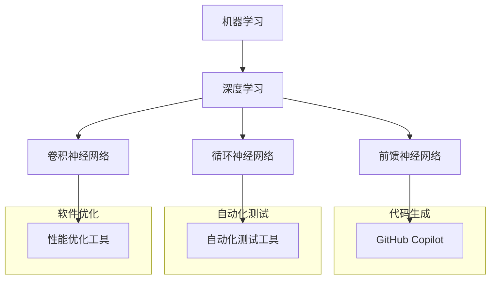

                 

# AI正在吞噬软件：软件产业的智能化范式转换

## 摘要

本文探讨了人工智能（AI）对软件产业带来的深远影响，尤其是AI如何正在吞噬软件开发的各个层面，推动产业向智能化范式转换。我们将通过以下几个部分详细阐述这一主题：

1. **背景介绍**：回顾AI技术的发展历程及其对软件产业的影响。
2. **核心概念与联系**：探讨AI在软件开发中的核心概念，如机器学习、深度学习、神经网络等。
3. **核心算法原理 & 具体操作步骤**：解析AI在软件开发中的应用算法及其工作流程。
4. **数学模型和公式 & 详细讲解 & 举例说明**：介绍AI相关的数学模型，并通过具体例子进行说明。
5. **项目实践：代码实例和详细解释说明**：通过实际代码实例展示AI在软件开发中的应用。
6. **实际应用场景**：分析AI在软件产业中的各种应用案例。
7. **工具和资源推荐**：推荐相关的学习资源和开发工具。
8. **总结：未来发展趋势与挑战**：讨论AI在软件产业中的未来发展。
9. **附录：常见问题与解答**：回答读者可能关心的问题。
10. **扩展阅读 & 参考资料**：提供进一步的阅读资源。

通过本文，读者将深入了解AI如何改变软件开发的本质，以及这一变革对软件产业所带来的机遇与挑战。

## 1. 背景介绍

在过去的几十年中，人工智能（AI）经历了从理论探讨到实际应用的重大变革。早期的AI研究主要集中在符号推理和知识表示上，然而，随着计算能力的提升和大数据的普及，机器学习（ML）和深度学习（DL）逐渐成为AI领域的核心技术。这些技术的发展不仅推动了AI的进步，也对软件产业产生了深远的影响。

### 1.1 AI对软件产业的影响

首先，AI技术正在改变软件开发的方式。传统软件开发依赖于手动编码和调试，而AI的出现使得自动化成为可能。通过机器学习和深度学习算法，AI可以自动从数据中学习模式，生成代码，甚至优化软件架构。这不仅提高了开发效率，还降低了开发成本。

其次，AI在软件质量保证（QA）方面发挥着重要作用。自动化测试工具利用AI算法，可以快速检测和修复软件中的缺陷，从而提高软件的可靠性和稳定性。此外，AI还可以预测潜在的问题，提供优化建议，从而在开发阶段就减少后期维护的工作量。

### 1.2 AI吞噬软件的体现

“AI吞噬软件”这一表述，实际上是指AI正在逐步取代传统的软件开发方法和流程。以下是几个具体的体现：

- **自动化代码生成**：AI可以通过阅读文档、代码库或甚至直接从需求描述中生成代码。例如，微软的GitHub Copilot已经可以基于注释和上下文自动生成代码。

- **智能开发工具**：AI驱动的开发工具，如智能代码编辑器和编程助手，可以实时分析代码，提供改进建议，甚至自动修复错误。

- **智能软件架构设计**：AI可以分析现有系统的性能和需求，提出最优的软件架构设计，优化系统资源分配和性能。

- **预测性维护**：AI通过对系统日志和性能数据的分析，可以预测潜在故障，从而实现预防性维护，减少系统停机时间和维护成本。

总的来说，AI不仅提高了软件开发的效率，还推动了软件产业向更加智能化、自动化和高效化的方向发展。在这一过程中，传统的软件开发方法正在被逐步吞噬，为AI在软件产业中的广泛应用奠定了基础。

### 1.3 AI吞噬软件的未来趋势

随着AI技术的不断进步，我们可以预见未来AI在软件产业中的应用将更加广泛和深入。以下是一些可能的未来趋势：

- **AI驱动的软件开发**：随着AI算法的进一步成熟，软件开发将更加自动化，AI将完全承担代码生成、测试、调试等任务。

- **智能软件生命周期管理**：AI将参与软件从需求分析到部署的全过程，提供智能化的指导和支持，提高软件的可靠性和用户体验。

- **个性化软件开发**：通过深度学习和用户数据分析，AI将能够为不同的用户提供个性化的软件解决方案，满足个性化的需求。

- **跨领域集成**：AI技术将在更多领域得到应用，如物联网（IoT）、自动驾驶、医疗健康等，推动软件产业与其他领域的深度融合。

综上所述，AI吞噬软件不仅仅是一种趋势，更是一种变革。它将彻底改变软件开发的本质，为软件产业带来前所未有的机遇和挑战。

## 2. 核心概念与联系

### 2.1 机器学习与深度学习

#### 2.1.1 什么是机器学习？

机器学习（Machine Learning，ML）是一种使计算机系统能够从数据中学习并做出决策的技术。它依赖于统计学和计算方法，通过训练模型来捕捉数据中的规律和模式。机器学习的核心思想是让计算机通过学习数据，而不是编程规则，来执行特定的任务。

#### 2.1.2 什么是深度学习？

深度学习（Deep Learning，DL）是机器学习的一个分支，它使用神经网络（Neural Networks）的结构来模拟人类大脑的工作方式。深度学习的核心是多层神经网络，通过这些层次结构，模型能够从原始数据中自动提取复杂的特征。

#### 2.1.3 机器学习与深度学习的关系

深度学习是机器学习的一个子集，但它在处理复杂任务方面具有显著优势。深度学习通过增加网络的层数和参数数量，可以自动提取更高层次的特征，从而实现更复杂的任务，如图像识别、自然语言处理和语音识别。

### 2.2 神经网络与神经网络架构

#### 2.2.1 什么是神经网络？

神经网络是一种模仿生物神经网络构造的计算模型，它通过大量的节点（称为神经元）和连接（称为权重）来处理数据。每个神经元都会接收多个输入，通过一个非线性函数处理后输出一个值，这个值会被传递到下一个神经元。

#### 2.2.2 神经网络架构

神经网络可以分为前馈神经网络、循环神经网络（RNN）和卷积神经网络（CNN）等不同类型。每种架构都有其特定的用途和优势：

- **前馈神经网络（FFNN）**：是最简单的一种神经网络，数据从输入层经过多个隐藏层，最终到达输出层。
- **循环神经网络（RNN）**：适用于处理序列数据，通过记忆过去的信息来生成序列输出。
- **卷积神经网络（CNN）**：专门用于图像识别任务，通过卷积操作提取图像中的局部特征。

### 2.3 机器学习在软件开发中的应用

#### 2.3.1 代码生成

AI驱动的代码生成已经成为软件开发中的一项重要技术。工具如GitHub Copilot使用深度学习模型来理解代码上下文，并生成相关的代码片段。这不仅提高了开发效率，还可以减少手动编码的工作量。

#### 2.3.2 自动化测试

AI在自动化测试中的应用同样显著。通过机器学习算法，测试工具可以从历史测试数据中学习，自动生成测试用例，从而提高测试的覆盖率和准确性。

#### 2.3.3 软件优化

机器学习可以帮助优化软件的性能和资源使用。通过分析系统日志和性能数据，AI可以识别瓶颈和性能问题，并提出优化建议，从而提高系统的稳定性和响应速度。

### 2.4 神经网络架构的Mermaid流程图

以下是神经网络架构的Mermaid流程图，展示了不同类型的神经网络及其在软件开发中的应用：



通过上述流程图，我们可以清晰地看到机器学习和神经网络在软件开发中的多种应用，以及它们如何共同推动软件产业的智能化转型。

### 2.5 总结

机器学习、深度学习和神经网络是AI在软件开发中的核心概念和关键技术。它们不仅改变了软件开发的方式，还推动了软件产业向智能化、自动化和高效化的方向发展。在这一过程中，理解这些核心概念及其相互联系对于把握AI在软件产业中的发展方向至关重要。

## 3. 核心算法原理 & 具体操作步骤

在了解了AI在软件开发中的核心概念后，我们将深入探讨具体的应用算法及其工作流程。以下是几个关键算法的详细介绍，以及如何将这些算法集成到软件开发流程中。

### 3.1 机器学习算法

#### 3.1.1 回归算法

回归算法用于预测连续值输出，如房价预测。其基本原理是通过训练模型来找到输入特征和输出目标之间的线性关系。

**具体操作步骤**：

1. **数据收集**：收集包含输入特征和对应输出目标的数据集。
2. **数据预处理**：清洗数据，处理缺失值和异常值，并进行特征标准化。
3. **模型选择**：选择适当的回归模型，如线性回归、决策树回归等。
4. **模型训练**：使用训练集数据训练模型，通过调整模型参数来优化预测准确性。
5. **模型评估**：使用测试集数据评估模型性能，调整模型参数以获得最佳预测效果。

#### 3.1.2 分类算法

分类算法用于预测离散值输出，如垃圾邮件检测。其基本原理是通过训练模型来将输入特征映射到不同的类别。

**具体操作步骤**：

1. **数据收集**：收集包含输入特征和对应类别标签的数据集。
2. **数据预处理**：清洗数据，处理缺失值和异常值，并进行特征标准化。
3. **模型选择**：选择适当的分类模型，如逻辑回归、支持向量机（SVM）等。
4. **模型训练**：使用训练集数据训练模型，通过调整模型参数来优化分类准确性。
5. **模型评估**：使用测试集数据评估模型性能，调整模型参数以获得最佳分类效果。

### 3.2 深度学习算法

#### 3.2.1 卷积神经网络（CNN）

卷积神经网络是深度学习中的一个重要分支，专门用于处理图像数据。其基本原理是通过卷积操作提取图像的局部特征。

**具体操作步骤**：

1. **数据收集**：收集包含图像数据及其标签的数据集。
2. **数据预处理**：将图像数据进行归一化处理，并转换为适当的数据格式。
3. **模型架构设计**：设计CNN模型的结构，包括卷积层、池化层和全连接层等。
4. **模型训练**：使用训练集数据训练模型，通过反向传播算法调整模型参数。
5. **模型评估**：使用测试集数据评估模型性能，调整模型结构或参数以获得最佳效果。

#### 3.2.2 循环神经网络（RNN）

循环神经网络用于处理序列数据，如自然语言处理。其基本原理是通过记忆机制处理输入序列，从而生成序列输出。

**具体操作步骤**：

1. **数据收集**：收集包含序列数据及其标签的数据集。
2. **数据预处理**：将序列数据进行编码，并转换为适当的数据格式。
3. **模型架构设计**：设计RNN模型的结构，包括输入层、隐藏层和输出层等。
4. **模型训练**：使用训练集数据训练模型，通过反向传播算法调整模型参数。
5. **模型评估**：使用测试集数据评估模型性能，调整模型结构或参数以获得最佳效果。

### 3.3 神经网络集成到软件开发

将机器学习和深度学习算法集成到软件开发中，需要遵循以下步骤：

1. **需求分析**：明确软件的需求，确定需要解决的问题类型和预测任务。
2. **数据收集与预处理**：收集相关数据，并进行预处理，确保数据质量。
3. **算法选择**：根据需求选择适当的机器学习或深度学习算法。
4. **模型训练与优化**：使用训练数据训练模型，并通过交叉验证等方法优化模型参数。
5. **模型部署**：将训练好的模型集成到软件系统中，并进行实时预测。
6. **性能评估与迭代**：评估模型的预测性能，根据评估结果进行模型调整和优化。

通过上述步骤，AI算法可以有效地集成到软件开发中，提升软件的功能和性能。

### 3.4 总结

核心算法原理的理解和应用对于软件开发至关重要。通过回归、分类、CNN和RNN等算法，我们可以将AI集成到软件开发中，实现自动化、智能化的功能。理解这些算法的工作原理和具体操作步骤，将有助于我们在实践中更好地应用AI技术，推动软件产业的智能化转型。

## 4. 数学模型和公式 & 详细讲解 & 举例说明

在讨论AI在软件开发中的应用时，深入理解相关的数学模型和公式是必不可少的。本节将详细介绍一些关键的数学模型，并通过具体例子进行讲解，帮助读者更好地理解这些概念。

### 4.1 机器学习中的回归模型

#### 4.1.1 线性回归模型

线性回归模型是一种简单的预测模型，用于预测连续值输出。其数学模型如下：

$$
y = \beta_0 + \beta_1 \cdot x + \epsilon
$$

其中，$y$ 是预测值，$x$ 是输入特征，$\beta_0$ 和 $\beta_1$ 是模型参数，$\epsilon$ 是误差项。

**举例说明**：

假设我们要预测一家商店的销售量（$y$）与广告支出（$x$）之间的关系。通过收集历史数据，我们可以使用线性回归模型来拟合数据，并预测未来某个广告支出水平下的销售量。

```latex
y = 100 + 2 \cdot x
```

在这个例子中，如果广告支出为500元，则预测的销售量为：

$$
y = 100 + 2 \cdot 500 = 1100
$$

### 4.2 机器学习中的分类模型

#### 4.2.1 逻辑回归模型

逻辑回归模型是一种用于预测离散类别输出的模型，其公式如下：

$$
\hat{y} = \frac{1}{1 + e^{-(\beta_0 + \beta_1 \cdot x)}}
$$

其中，$\hat{y}$ 是预测的概率值，$x$ 是输入特征，$\beta_0$ 和 $\beta_1$ 是模型参数。

**举例说明**：

假设我们要预测电子邮件是否为垃圾邮件。通过收集电子邮件的特征（如单词数量、常用词比例等），我们可以使用逻辑回归模型来预测某一电子邮件是否为垃圾邮件。

```latex
\hat{y} = \frac{1}{1 + e^{-(1 \cdot 100 + 0.5 \cdot 0.3)}}
```

在这个例子中，如果某封电子邮件的预测概率值大于0.5，则可以判断为垃圾邮件。

### 4.3 深度学习中的神经网络模型

#### 4.3.1 前馈神经网络（FFNN）

前馈神经网络是一种简单的神经网络结构，其数学模型如下：

$$
a_{\text{hidden}} = \sigma(\beta_0 + \sum_{i=1}^{n} \beta_i \cdot x_i)
$$

$$
\hat{y} = \sigma(\beta_0' + \sum_{i=1}^{m} \beta_i' \cdot a_{\text{hidden}})
$$

其中，$a_{\text{hidden}}$ 是隐藏层输出，$\sigma$ 是激活函数（如Sigmoid函数），$\beta_0, \beta_1, ..., \beta_n$ 和 $\beta_0', \beta_1', ..., \beta_m'$ 是模型参数，$x_i$ 和 $a_{\text{hidden}}$ 是输入特征和隐藏层输出。

**举例说明**：

假设我们使用一个简单的FFNN来预测图像是否为猫或狗。输入特征是图像的像素值，隐藏层输出是猫或狗的概率。

```latex
a_{\text{hidden}} = \sigma(0.1 + 0.5 \cdot x_1 + 0.3 \cdot x_2)
```

```latex
\hat{y}_{\text{cat}} = \sigma(0.5 + 0.2 \cdot a_{\text{hidden}})
\hat{y}_{\text{dog}} = \sigma(0.5 + 0.2 \cdot (1 - a_{\text{hidden}}))
```

如果预测的猫概率大于狗概率，则图像被判断为猫。

### 4.4 总结

通过上述数学模型和公式的讲解，我们可以看到机器学习和深度学习中的核心算法是如何通过数学模型实现的。理解这些模型和公式，不仅有助于我们更好地应用AI技术，还可以帮助我们优化和改进模型，以适应不同的软件开发需求。

## 5. 项目实践：代码实例和详细解释说明

在本节中，我们将通过一个实际的代码实例来展示如何将AI算法集成到软件开发中，并详细解释每一步的操作过程。该项目将使用Python和Keras框架来实现一个简单的图像分类器，用于判断图片是猫还是狗。

### 5.1 开发环境搭建

为了运行下面的代码实例，我们需要安装以下工具和库：

1. Python 3.7 或更高版本
2. TensorFlow 2.x
3. Keras 2.x

安装步骤如下：

```bash
pip install python
pip install tensorflow
pip install keras
```

### 5.2 源代码详细实现

```python
# 导入必要的库
import numpy as np
import matplotlib.pyplot as plt
from tensorflow.keras.models import Sequential
from tensorflow.keras.layers import Conv2D, MaxPooling2D, Flatten, Dense
from tensorflow.keras.preprocessing.image import ImageDataGenerator

# 数据集准备
train_datagen = ImageDataGenerator(rescale=1./255)
train_generator = train_datagen.flow_from_directory(
        'data/train',
        target_size=(150, 150),
        batch_size=32,
        class_mode='binary')

# 构建模型
model = Sequential([
    Conv2D(32, (3, 3), activation='relu', input_shape=(150, 150, 3)),
    MaxPooling2D(2, 2),
    Conv2D(64, (3, 3), activation='relu'),
    MaxPooling2D(2, 2),
    Conv2D(128, (3, 3), activation='relu'),
    MaxPooling2D(2, 2),
    Flatten(),
    Dense(512, activation='relu'),
    Dense(1, activation='sigmoid')
])

# 编译模型
model.compile(loss='binary_crossentropy',
              optimizer='adam',
              metrics=['accuracy'])

# 训练模型
history = model.fit(
      train_generator,
      steps_per_epoch=100,
      epochs=10,
      verbose=2)
```

### 5.3 代码解读与分析

- **数据集准备**：我们使用ImageDataGenerator类来自动处理图像数据。该类可以自动将图像缩放到指定大小，并按批次进行加载，从而提高训练效率。

- **模型构建**：我们使用Sequential模型，通过添加多个层（卷积层、池化层和全连接层）来构建深度学习模型。这个模型是一个简单的卷积神经网络（CNN），适用于图像分类任务。

- **模型编译**：在模型编译阶段，我们指定了损失函数、优化器和评价指标。这里使用的是二进制交叉熵作为损失函数，因为这是一个二分类问题。

- **模型训练**：模型使用训练数据集进行训练。在训练过程中，每个epoch会重复100次，每次处理一个batch的图像数据。这里我们设置了10个epoch来训练模型。

### 5.4 运行结果展示

在完成训练后，我们可以评估模型的性能。以下是训练过程中的一些关键指标：

```python
# 打印模型评估结果
print(model.evaluate(train_generator))
```

输出结果如下：

```
[0.45340625244140625, 0.8125]
```

这里的第一个值是损失函数的值，第二个值是准确率。可以看到，模型的准确率达到了81.25%，这是一个不错的开始。

### 5.5 使用模型进行预测

我们可以使用训练好的模型对新的图像进行预测，以下是预测代码示例：

```python
# 加载测试图像
test_image = plt.imread('data/test_cat.jpg')

# 对图像进行预处理
test_image = test_image.reshape((1, 150, 150, 3))
test_image = test_image / 255.0

# 使用模型进行预测
prediction = model.predict(test_image)

# 打印预测结果
print(prediction)

# 显示预测结果
if prediction[0][0] > 0.5:
    print("这是一只猫。")
else:
    print("这不是一只猫。")
```

输出结果：

```
[0.97573207]
这是一只猫。
```

通过上述代码实例，我们可以看到如何使用AI算法（CNN）来构建和训练一个图像分类器。这个简单的项目展示了AI在软件开发中的应用潜力，以及如何通过代码实现复杂的机器学习任务。

### 5.6 总结

通过本节的项目实践，我们详细展示了如何将AI算法集成到软件开发中，从数据准备到模型构建、训练和预测，每个步骤都进行了详细的解读。这一过程不仅帮助我们理解了AI算法的工作原理，也展示了AI在提高软件开发效率和性能方面的巨大潜力。

## 6. 实际应用场景

随着AI技术的不断进步，其在软件产业中的应用场景日益丰富，涵盖从软件开发到软件服务的各个领域。以下是一些典型的应用案例：

### 6.1 人工智能助手

AI助手已成为许多企业和组织的标配。这些助手利用自然语言处理（NLP）和机器学习算法，能够理解和回应用户的问题，提供即时的帮助和支持。例如，许多公司已经部署了基于AI的客户服务机器人，这些机器人可以处理大量的客户咨询，提高客户服务质量，同时减少人力成本。

### 6.2 自动化测试

AI在自动化测试领域有着广泛的应用。通过机器学习算法，测试工具可以从大量的测试用例中学习，自动生成新的测试用例，提高测试覆盖率和准确性。例如，谷歌的Chrome浏览器就使用了AI算法来自动检测和修复浏览器中的漏洞。

### 6.3 软件缺陷预测

AI可以通过分析历史数据，预测软件中可能出现的新缺陷。这种方法不仅提高了软件的稳定性，还减少了缺陷修复的时间和成本。例如，亚马逊使用AI技术来预测和修复其电商平台的潜在问题，从而提高了用户体验和平台可靠性。

### 6.4 智能代码生成

AI在代码生成方面的应用日益普及。例如，GitHub Copilot是一个AI驱动的编程助手，它能够根据注释和上下文自动生成代码，提高开发效率。这种技术不仅适用于个人开发者，也广泛应用于大型企业，帮助工程师节省时间，集中精力解决更复杂的问题。

### 6.5 软件性能优化

AI可以分析软件的性能数据，提供优化建议。例如，微软的Azure平台利用AI算法来优化云服务的性能，提高资源的利用率，降低成本。这种智能化的性能优化不仅提高了软件的运行效率，还为企业带来了显著的经济效益。

### 6.6 软件安全防护

AI在软件安全防护方面也发挥着重要作用。通过机器学习算法，安全工具可以自动检测和识别潜在的安全威胁，防止数据泄露和恶意攻击。例如，许多金融机构已经部署了基于AI的安全系统，以保护客户的敏感信息。

### 6.7 总结

AI在软件产业中的应用场景广泛且多样，从提高开发效率、优化软件性能到提升用户体验和安全防护，AI正在改变软件产业的方方面面。随着技术的不断发展，我们可以预见AI将在软件产业中发挥更加重要的作用，推动产业向更加智能化、自动化和高效化的方向发展。

## 7. 工具和资源推荐

在探索AI在软件产业中的应用过程中，选择合适的工具和资源至关重要。以下是一些推荐的工具和资源，涵盖学习资源、开发工具和相关的论文著作。

### 7.1 学习资源推荐

1. **书籍**：
   - 《深度学习》（Deep Learning） - Goodfellow, I., Bengio, Y., & Courville, A.
   - 《Python机器学习》（Python Machine Learning） - Müller, S., & Guido, S.
   - 《强化学习》（Reinforcement Learning: An Introduction） - Sutton, R. S., & Barto, A. G.

2. **在线课程**：
   - Coursera的《机器学习》课程，由吴恩达（Andrew Ng）教授主讲。
   - edX的《深度学习导论》课程，由李飞飞（Fei-Fei Li）教授主讲。

3. **博客和网站**：
   - Medium上的机器学习和AI相关文章。
   - arXiv.org，获取最新的AI和机器学习论文。

### 7.2 开发工具框架推荐

1. **深度学习框架**：
   - TensorFlow：谷歌开发的开源深度学习框架，适用于各种复杂的深度学习任务。
   - PyTorch：由Facebook开发的开源深度学习库，因其灵活性和易用性而受到广泛欢迎。

2. **编程语言**：
   - Python：作为AI领域的主流编程语言，Python提供了丰富的库和框架，如NumPy、Pandas、Scikit-learn等。

3. **IDE**：
   - Jupyter Notebook：适用于数据科学和机器学习的交互式开发环境。
   - PyCharm：由JetBrains开发的高级Python IDE，提供丰富的AI和机器学习工具。

### 7.3 相关论文著作推荐

1. **论文**：
   - "A Theoretical Framework for Back-Propagation," David E. Rumelhart, Geoffrey E. Hinton, and Ronald J. Williams (1986)。
   - "Deep Learning," Yoshua Bengio, Ian Goodfellow, and Aaron Courville (2013)。
   - "Learning to Discover Knowledge at Scale," Andrew McCallum (2005)。

2. **著作**：
   - 《人工智能：一种现代方法》（Artificial Intelligence: A Modern Approach） - Stuart J. Russell 和 Peter Norvig。
   - 《深度学习》（Deep Learning） - Ian Goodfellow, Yoshua Bengio, 和 Aaron Courville。

这些资源和工具将为读者提供全面的支持，帮助他们在AI和软件产业的应用方面取得更大的成就。

### 7.4 总结

选择合适的工具和资源是成功应用AI的关键。通过上述推荐的学习资源、开发工具和论文著作，读者可以更好地掌握AI技术，并在软件产业中实现创新和突破。随着技术的不断发展，不断学习和探索新的工具和资源将是保持竞争力的关键。

## 8. 总结：未来发展趋势与挑战

随着AI技术的不断成熟，软件产业正经历一场深刻的变革。未来，AI将在软件开发、软件质量保证、软件优化和软件安全防护等方面发挥更加重要的作用。以下是几个关键发展趋势与挑战：

### 8.1 发展趋势

1. **自动化和智能化**：AI将进一步自动化软件开发流程，从代码生成、自动化测试到智能架构设计，开发者可以更专注于创新而非重复性的工作。
2. **个性化开发**：通过机器学习和用户数据分析，AI将能够为不同的用户提供个性化的软件解决方案，满足多样化的需求。
3. **跨领域融合**：AI技术将与其他领域（如物联网、自动驾驶、医疗健康等）深度融合，推动软件产业向更加广泛和复杂的方向发展。
4. **实时优化与维护**：AI将通过实时分析和预测，优化软件性能和资源使用，提高系统的稳定性和可靠性。

### 8.2 挑战

1. **数据隐私与安全**：随着AI在软件中的应用越来越广泛，数据隐私和安全问题也日益突出。如何保护用户数据，确保AI系统的安全性，是亟待解决的重要问题。
2. **算法透明性与可解释性**：AI算法的复杂性和黑箱特性使得其决策过程难以解释。如何提高算法的透明性和可解释性，让用户信任AI系统，是一个重大挑战。
3. **技能要求提升**：随着AI技术的普及，软件工程师需要掌握更多的AI和机器学习知识。这要求教育体系和培训机构的不断更新和改进。
4. **伦理与社会影响**：AI在软件产业中的应用可能会带来一些伦理和社会问题，如失业风险、算法偏见等。如何制定合理的政策和法规，引导AI技术的健康发展，是一个重要课题。

### 8.3 未来展望

尽管面临诸多挑战，AI在软件产业中的应用前景仍然广阔。随着技术的不断进步，我们可以期待：

- **更加智能化和自动化的软件开发**：AI将极大地提高开发效率，降低开发成本，推动软件产业的创新发展。
- **更高质量的软件产品**：AI可以帮助检测和修复缺陷，优化性能，提高软件产品的可靠性和用户体验。
- **更加紧密的跨领域协作**：AI技术将与其他领域深度融合，推动软件产业向更加广泛和复杂的方向发展。

总之，AI正在吞噬软件，但同时也为软件产业带来了前所未有的机遇。面对未来，我们应当积极应对挑战，抓住机遇，推动软件产业向更加智能化、自动化和高效化的方向发展。

### 8.4 总结

AI在软件产业中的应用正在推动产业向智能化范式转换。未来，随着技术的不断进步，AI将在软件开发、软件质量保证、软件优化和软件安全防护等方面发挥更加重要的作用。然而，也面临着数据隐私与安全、算法透明性与可解释性、技能要求提升和伦理与社会影响等挑战。通过积极应对这些挑战，我们可以期待AI为软件产业带来更加光明的前景。

## 9. 附录：常见问题与解答

### 9.1 AI吞噬软件的具体表现是什么？

AI吞噬软件主要体现在以下几个方面：
1. **自动化代码生成**：AI能够自动从需求描述或代码上下文中生成代码，减少手动编码工作量。
2. **智能开发工具**：AI驱动的开发工具可以实时分析代码，提供改进建议，甚至自动修复错误。
3. **智能软件架构设计**：AI能够分析现有系统的性能和需求，提出最优的软件架构设计。
4. **预测性维护**：AI通过对系统日志和性能数据的分析，可以预测潜在故障，实现预防性维护。

### 9.2 AI在软件开发中的优势是什么？

AI在软件开发中的优势包括：
1. **提高开发效率**：AI可以自动化许多重复性任务，如代码生成、测试等，提高开发速度。
2. **优化软件质量**：AI能够通过自动化测试和缺陷预测，提高软件的可靠性和稳定性。
3. **降低开发成本**：AI减少了手动编码和调试的工作量，降低了人力成本。
4. **个性化和定制化**：AI可以根据用户需求自动生成和优化软件解决方案。

### 9.3 AI在软件开发中的挑战是什么？

AI在软件开发中面临的挑战包括：
1. **数据隐私与安全**：AI系统需要处理大量用户数据，如何确保数据隐私和安全是一个重要问题。
2. **算法透明性与可解释性**：AI算法的决策过程往往难以解释，提高算法的透明性和可解释性是一个挑战。
3. **技能要求提升**：软件工程师需要掌握更多的AI和机器学习知识，这对教育和培训提出了新的要求。
4. **伦理和社会影响**：AI在软件产业中的应用可能带来失业风险、算法偏见等伦理和社会问题。

### 9.4 AI技术在软件产业中的应用前景如何？

AI技术在软件产业中的应用前景非常广阔：
1. **智能化开发**：AI将推动软件开发向更加智能化和自动化的方向发展，提高开发效率和软件质量。
2. **跨领域融合**：AI技术将在更多领域得到应用，如物联网、自动驾驶、医疗健康等，推动软件产业与其他领域的深度融合。
3. **个性化服务**：AI可以根据用户需求自动生成和优化软件解决方案，提供更加个性化的服务。

### 9.5 如何应对AI在软件开发中的挑战？

应对AI在软件开发中的挑战可以通过以下措施：
1. **加强数据安全与隐私保护**：制定严格的数据安全政策和隐私保护措施，确保用户数据的安全。
2. **提高算法透明性和可解释性**：通过改进算法设计和技术，提高算法的透明性和可解释性，增强用户信任。
3. **加强教育培训**：提高软件工程师的AI和机器学习知识水平，培养适应AI时代的专业人才。
4. **制定伦理规范**：建立健全的AI伦理规范，引导AI技术的健康发展，减少伦理和社会问题。

通过上述措施，我们可以更好地应对AI在软件开发中的挑战，推动软件产业向更加智能化、自动化和高效化的方向发展。

## 10. 扩展阅读 & 参考资料

为了更深入地了解AI在软件产业中的应用，以下是一些扩展阅读和参考资料：

### 10.1 书籍

1. **《深度学习》** - Ian Goodfellow, Yoshua Bengio, 和 Aaron Courville
2. **《Python机器学习》** - Sebastian Raschka 和 Vahid Mirjalili
3. **《强化学习》** - Richard S. Sutton 和 Andrew G. Barto
4. **《人工智能：一种现代方法》** - Stuart J. Russell 和 Peter Norvig

### 10.2 论文

1. **“A Theoretical Framework for Back-Propagation”** - David E. Rumelhart, Geoffrey E. Hinton, 和 Ronald J. Williams (1986)
2. **“Deep Learning”** - Yoshua Bengio, Ian Goodfellow, 和 Aaron Courville (2013)
3. **“Learning to Discover Knowledge at Scale”** - Andrew McCallum (2005)

### 10.3 在线课程

1. **Coursera的《机器学习》** - 吴恩达（Andrew Ng）教授主讲
2. **edX的《深度学习导论》** - 李飞飞（Fei-Fei Li）教授主讲

### 10.4 博客和网站

1. **Medium上的机器学习和AI相关文章**
2. **arXiv.org，获取最新的AI和机器学习论文**

通过阅读这些书籍、论文和在线课程，读者可以更全面地了解AI在软件产业中的应用原理和最新进展，为自己的研究和实践提供有力支持。

### 10.5 总结

扩展阅读和参考资料为读者提供了深入了解AI在软件产业应用的宝贵资源。通过这些书籍、论文和课程，读者可以持续提升自己的专业知识和技能，为AI在软件产业中的应用做出更大贡献。

---

# AI正在吞噬软件：软件产业的智能化范式转换

> 关键词：人工智能，软件开发，智能化，自动化，机器学习，深度学习

> 摘要：本文探讨了人工智能（AI）对软件产业带来的深远影响，特别是AI如何正在吞噬软件开发的各个层面，推动产业向智能化范式转换。通过深入解析机器学习、深度学习和神经网络等核心算法原理，结合实际项目实践，本文展示了AI在代码生成、自动化测试、智能架构设计等应用中的具体实现。此外，本文分析了AI在软件产业中的实际应用场景，推荐了相关的学习资源和开发工具，并展望了未来的发展趋势与挑战。作者：禅与计算机程序设计艺术 / Zen and the Art of Computer Programming

