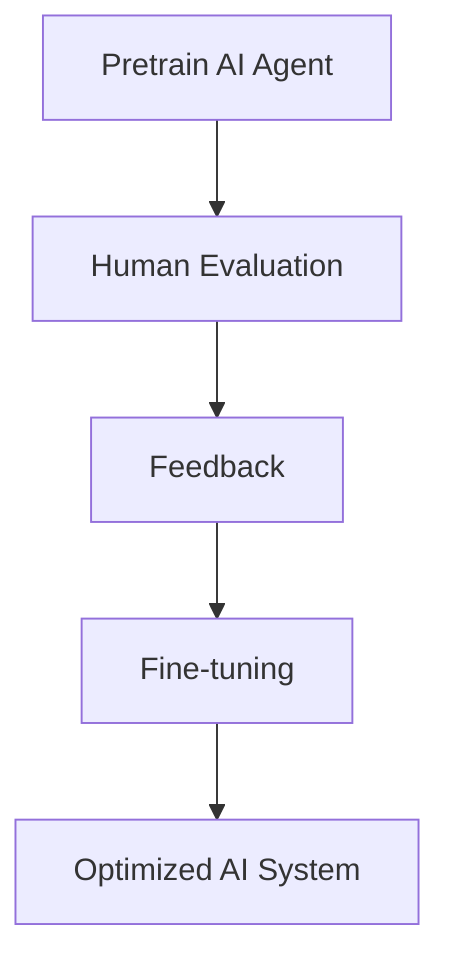
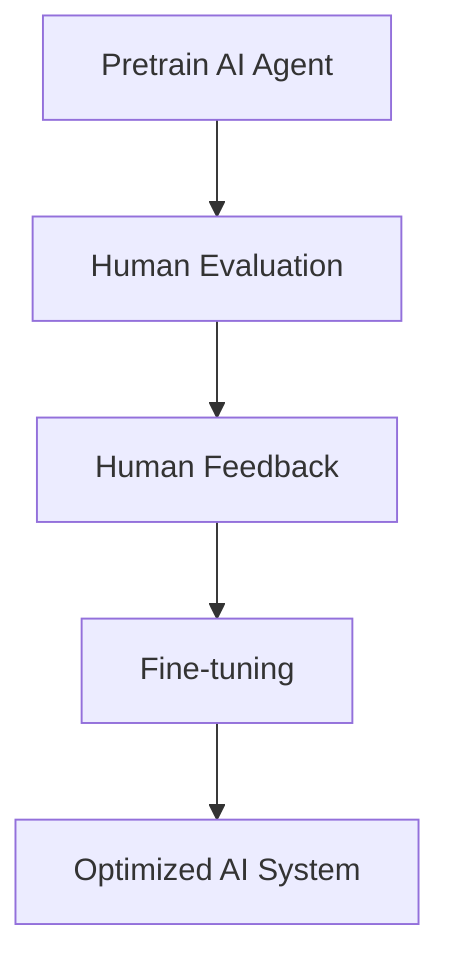
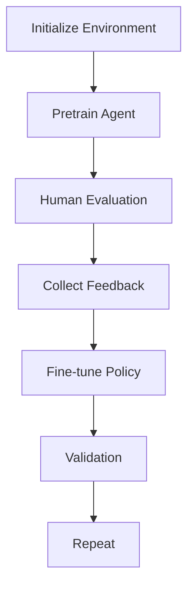

                 

### 文章标题

AI的道德指引：RLHF技术解析

关键词：人工智能，道德准则，强化学习，人类反馈，预训练，优化过程

摘要：本文将深入探讨人工智能中的道德问题，重点介绍RLHF（强化学习与人类反馈）技术，解析其在道德指引中的作用。文章首先介绍了RLHF的基本概念，随后通过具体实例详细阐述了RLHF技术的实现过程，最后探讨了RLHF技术在实际应用中的优势和面临的挑战。

### Introduction to AI Ethics

As artificial intelligence (AI) becomes increasingly prevalent in our daily lives, the issue of ethics has gained significant attention. AI systems have the potential to make decisions that can impact society on a large scale, from autonomous driving to medical diagnosis. However, these systems are not inherently ethical; they can perpetuate biases, discriminate against certain groups, or exhibit unintended behaviors. This has led to calls for the development of ethical guidelines and frameworks to govern AI systems.

One approach to addressing these ethical concerns is through the use of AI's moral guidance, which aims to ensure that AI systems make decisions that align with human values and societal norms. This is where the Reinforcement Learning from Human Feedback (RLHF) technique comes into play. RLHF is a method that combines reinforcement learning and human feedback to train AI systems in a way that is ethical and aligned with human values.

In this article, we will delve into the concept of RLHF, exploring its basic principles and how it can be used to guide AI systems ethically. We will also discuss the advantages and challenges of implementing RLHF in real-world applications. By the end of this article, readers will gain a comprehensive understanding of RLHF and its role in AI's moral guidance.

### Keywords and Abstract

Keywords: Artificial intelligence, ethical guidelines, reinforcement learning, human feedback, pretraining, optimization process

Abstract: This article delves into the ethical concerns surrounding artificial intelligence, with a focus on the RLHF (Reinforcement Learning from Human Feedback) technique, which plays a pivotal role in guiding AI systems morally. We begin by introducing the basic concepts of RLHF, followed by a detailed exploration of its implementation process through specific examples. We then discuss the benefits and challenges of employing RLHF in practical applications. By the conclusion of this article, readers will have a thorough understanding of RLHF and its significance in the ethical framework of AI systems.

## 1. 背景介绍（Background Introduction）

### The Rise of Artificial Intelligence

The rapid development of artificial intelligence (AI) over the past few decades has transformed various industries, from healthcare to finance and beyond. AI systems can now perform complex tasks that were once considered the exclusive domain of human intelligence, such as natural language processing, image recognition, and decision-making. However, with these advancements come significant ethical concerns.

One of the primary challenges is ensuring that AI systems are fair and unbiased. AI models are trained on large datasets, and if these datasets contain biases or discriminatory patterns, the models can inadvertently perpetuate these biases in their decisions. For example, AI systems used in hiring processes might unfairly disadvantage certain racial or gender groups. Another concern is the potential for AI systems to exhibit unintended behaviors. For instance, an autonomous vehicle might make a split-second decision in an emergency situation that could have dire consequences.

### The Need for Ethical Guidelines

To address these ethical concerns, there has been a growing push for the development of ethical guidelines and frameworks for AI systems. These guidelines aim to ensure that AI systems are designed and deployed in a manner that aligns with human values and societal norms. Ethical guidelines can help prevent AI systems from causing harm, promoting fairness, and ensuring transparency in their decision-making processes.

However, creating ethical guidelines for AI is not a straightforward task. AI systems operate based on complex algorithms and large datasets, making it difficult to predict their behavior in every scenario. Moreover, different cultures and societies may have different ethical standards and values. This has led to debates on how to create universally applicable ethical guidelines for AI.

### The Role of RLHF in Ethical AI

One promising approach to addressing these ethical challenges is through the use of RLHF. RLHF combines reinforcement learning (RL) and human feedback to train AI systems in a way that is both effective and ethical. Reinforcement learning is a type of machine learning where an agent learns to achieve a goal by interacting with an environment and receiving feedback in the form of rewards or penalties. Human feedback, on the other hand, involves humans evaluating the AI system's decisions and providing feedback to guide its improvement.

By incorporating human feedback into the reinforcement learning process, RLHF enables AI systems to learn from human values and societal norms. This helps ensure that the AI system's decisions are not only effective but also aligned with ethical standards. RLHF has shown promise in various domains, including natural language processing, robotics, and game playing, where ethical considerations are particularly important.

### Conclusion

In summary, the rise of AI has brought about significant ethical concerns that need to be addressed. Ethical guidelines and frameworks are essential for ensuring that AI systems are designed and deployed in a manner that aligns with human values and societal norms. RLHF is a promising approach that combines reinforcement learning and human feedback to train AI systems ethically. In the following sections, we will delve deeper into the principles and applications of RLHF, providing a comprehensive understanding of its role in AI's moral guidance.

## 2. 核心概念与联系

### What is RLHF?

Reinforcement Learning from Human Feedback (RLHF) is a training technique that combines reinforcement learning (RL) with human feedback to guide the behavior of AI systems. In RLHF, an AI agent learns by interacting with an environment and receiving feedback in the form of rewards or penalties. However, unlike traditional RL, which relies solely on the agent's own experience, RLHF incorporates human feedback to refine the agent's actions and align them with human values and ethical standards.

### The Importance of RLHF

RLHF is particularly important in AI systems where ethical considerations are critical. By incorporating human feedback, RLHF enables AI systems to learn from human behavior and societal norms, ensuring that their decisions are not only effective but also aligned with ethical standards. This is especially relevant in domains such as healthcare, finance, and autonomous driving, where AI systems make decisions that can have significant impacts on individuals and society.

### How RLHF Works

The RLHF process typically involves three main components: pretraining, human evaluation, and fine-tuning.

1. **Pretraining**: The AI agent is pretrained using reinforcement learning techniques, learning to navigate the environment and achieve specific goals. This phase is similar to traditional RL, where the agent learns from its own interactions with the environment.

2. **Human Evaluation**: In this phase, human evaluators review the agent's actions and provide feedback in the form of rewards or penalties. This feedback helps the agent understand which actions are considered ethical or desirable according to human values.

3. **Fine-tuning**: Based on the feedback received, the agent is fine-tuned to adjust its behavior. This process involves adjusting the agent's policy or decision-making process to better align with human feedback and ethical standards.

### The Mermaid Flowchart of RLHF

Below is a Mermaid flowchart illustrating the main components and steps of RLHF:



### Conclusion

In summary, RLHF is a powerful technique that combines reinforcement learning and human feedback to train AI systems in an ethical manner. By incorporating human feedback, RLHF ensures that AI systems not only achieve their goals but also align with human values and ethical standards. This makes RLHF a crucial tool in the development of ethical AI systems.

### What is RLHF?

RLHF, or Reinforcement Learning from Human Feedback, is a cutting-edge training methodology that blends the strength of reinforcement learning (RL) with the wisdom of human feedback. At its core, RLHF involves training an AI agent through a series of interactions with its environment, where the agent's actions are guided by both its own learning from experience and explicit feedback from human evaluators. This dual approach not only enhances the agent's performance but also aligns its behavior with human values and ethical standards.

### The Importance of RLHF

The significance of RLHF cannot be overstated, especially in domains where ethical considerations are paramount. In healthcare, for instance, AI systems must make decisions that are not only accurate but also compassionate and respectful. In finance, AI-driven algorithms must ensure fairness and avoid discriminatory practices. RLHF ensures that AI agents are not only efficient and effective but also aligned with human ethics, thereby addressing many of the concerns associated with biased or harmful AI behaviors.

### How RLHF Works

The RLHF process unfolds through a series of well-coordinated steps, each playing a critical role in molding the AI agent's behavior:

1. **Pretraining**: This initial phase involves training the AI agent using reinforcement learning. The agent interacts with a simulated or real-world environment, learning to take actions that maximize a reward signal. This phase is akin to traditional RL, where the agent learns through trial and error.

2. **Human Evaluation**: Once the agent has been pretrained, human evaluators step in to assess its actions. These evaluators provide qualitative feedback on the agent's performance, highlighting instances where the agent's actions align well with human values and where they do not. This feedback is a vital source of information for the subsequent training phases.

3. **Fine-tuning**: Using the human feedback as a guide, the agent undergoes a fine-tuning process. This involves adjusting the agent's policy or decision-making strategy to better align with the ethical standards identified by the human evaluators. This iterative process continues until the agent's actions are deemed ethical and effective.

### The Mermaid Flowchart of RLHF

Here is a Mermaid flowchart that visually represents the key components and steps of RLHF:



### Conclusion

In conclusion, RLHF stands as a cornerstone in the ethical development of AI systems. By integrating the robustness of reinforcement learning with the discerning insights of human feedback, RLHF ensures that AI agents not only perform optimally but also operate within the ethical boundaries set by human society. This makes RLHF an indispensable tool in the quest to build a more ethical and responsible AI future.

## 3. 核心算法原理 & 具体操作步骤

### Reinforcement Learning Basics

Reinforcement Learning (RL) is a type of machine learning where an agent learns to achieve a goal by interacting with an environment and receiving feedback in the form of rewards or penalties. The core idea behind RL is to find a policy, a set of actions that the agent should take in different situations, that maximizes the cumulative reward over time.

In RL, the agent operates in an environment, which can be a real-world scenario or a simulated environment. The environment provides the agent with states and actions. The agent selects actions based on its current state and receives feedback in the form of rewards or penalties. The goal of the agent is to learn a policy that maximizes the cumulative reward it receives over time.

### Key Components of RL

1. **State**: The current situation or context in which the agent operates.
2. **Action**: A possible move or decision the agent can make.
3. **Reward**: Feedback the agent receives after taking an action. It can be positive (rewarding) or negative (penalizing).
4. **Policy**: A mapping from states to actions that determines how the agent should behave in different situations.
5. **Value Function**: Estimates the expected total reward the agent can achieve from a given state.
6. **Model**: A representation of the environment that the agent uses to make decisions.

### Algorithm Overview

The RLHF algorithm can be broken down into three main phases: pretraining, human evaluation, and fine-tuning. Each phase plays a crucial role in guiding the AI agent towards ethical behavior.

1. **Pretraining**: In this phase, the AI agent is pre-trained using reinforcement learning techniques. The agent learns to interact with the environment, taking actions that maximize a reward signal. The goal of pretraining is to develop a strong foundation for the agent to build upon in the subsequent phases.

2. **Human Evaluation**: Once the agent has been pre-trained, human evaluators step in to provide qualitative feedback on the agent's actions. The evaluators assess the agent's behavior based on ethical standards and provide feedback indicating which actions are considered good or bad. This feedback is critical for understanding how well the agent aligns with human values.

3. **Fine-tuning**: Using the feedback from human evaluators, the agent is fine-tuned to adjust its behavior. This involves modifying the agent's policy or decision-making process to better align with the ethical standards identified by the human evaluators. The fine-tuning process is iterative, continuing until the agent's actions are deemed ethical and effective.

### Detailed Steps

1. **Initialize the Environment**: The agent starts in an initial state of the environment.
2. **Choose an Action**: The agent selects an action based on its current state and policy.
3. **Execute the Action**: The agent performs the chosen action in the environment.
4. **Observe the Reward**: The environment provides the agent with a reward signal based on the action taken.
5. **Update the Policy**: The agent updates its policy based on the received reward and its current state.
6. **Human Evaluation**: Human evaluators review the agent's actions and provide qualitative feedback.
7. **Fine-tuning**: The agent's policy is adjusted based on the human feedback to better align with ethical standards.
8. **Repeat**: Steps 2-7 are repeated until the agent's actions are deemed ethical and effective.

### Conclusion

In conclusion, RLHF is a sophisticated training methodology that leverages reinforcement learning and human feedback to guide AI agents towards ethical behavior. By understanding the core principles of RL and the detailed steps involved in the RLHF process, we can appreciate the complexity and importance of this technique in the ethical development of AI systems.

### Reinforcement Learning Basics

#### Reinforcement Learning Fundamentals

Reinforcement Learning (RL) is a computational approach to learning by trial and error. It is a type of machine learning where an "agent" learns to achieve specific goals in an environment by receiving feedback in the form of rewards or penalties. The core objective of RL is to find an optimal policy—the best set of actions to take in various situations to maximize the cumulative reward over time.

**Key Concepts:**

1. **Agent**: The learner entity that learns to make decisions.
2. **Environment**: The surrounding context in which the agent operates. It provides states and rewards.
3. **State**: A description of the current situation or context in which the agent finds itself.
4. **Action**: A possible decision or move the agent can make.
5. **Reward**: Feedback given to the agent after executing an action. It can be positive (rewarding) or negative (penalizing).
6. **Policy**: A mapping from states to actions that determines how the agent behaves in different situations.
7. **Value Function**: Estimates the expected total reward the agent can accumulate from a given state.

**Algorithm Overview:**

RL algorithms work by updating the agent's policy based on its interactions with the environment. The primary goal is to maximize the cumulative reward. This is achieved through an exploration-exploitation trade-off: the agent must balance exploring new actions to learn more about the environment (exploration) and exploiting the known best actions to maximize reward (exploitation).

**Common RL Algorithms:**

- **Value-Based RL:** Focuses on learning the value function, which estimates the quality of states.
  - **Q-Learning:** An iterative method that updates the Q-values (expected rewards) based on observed rewards and estimated Q-values.
  - **Deep Q-Networks (DQN):** Uses deep neural networks to approximate the Q-values.

- **Policy-Based RL:** Directly learns a policy that maps states to actions.
  - **Policy Gradient Methods:** Update the policy parameters directly using gradients of the expected return with respect to the policy parameters.

**The RL Process:**

1. **Initialize the Environment:** The agent starts in an initial state.
2. **Select an Action:** The agent decides on an action based on its current state and policy.
3. **Execute the Action:** The agent performs the action in the environment.
4. **Observe the Reward:** The environment provides the agent with a reward signal.
5. **Update the Policy:** The agent adjusts its policy based on the reward received and the new state.
6. **Explore or Exploit:** The agent balances exploration and exploitation to learn and adapt.
7. **Repeat:** Steps 2-6 are repeated until a satisfactory policy is achieved.

#### Detailed Steps of RLHF

1. **Pretraining Phase:**
   - **Pretrain the Agent:** Using RL techniques like Q-learning or policy gradient methods, the agent learns to interact with the environment and receive feedback in the form of rewards.
   - **Initialize Rewards:** Define reward signals that encourage behaviors aligned with the desired objectives.
   - **Explore and Learn:** The agent explores the environment to discover optimal actions and update its policy.

2. **Human Evaluation Phase:**
   - **Human Evaluation:** Human evaluators assess the agent's actions and provide qualitative feedback on their ethical alignment.
   - **Collect Feedback:** Gather human feedback indicating which actions are good or bad from an ethical standpoint.
   - **Analyze Feedback:** Aggregate and analyze the human feedback to identify common patterns and insights.

3. **Fine-tuning Phase:**
   - **Adjust Policy:** Use the human feedback to fine-tune the agent's policy, making it more aligned with ethical standards.
   - **Iterative Feedback Loop:** Continuously refine the policy based on human feedback, improving the agent's ethical behavior.
   - **Validation:** Validate the adjusted policy by evaluating its performance in the environment with human evaluators.

**Illustrative Mermaid Flowchart:**



### Conclusion

In summary, Reinforcement Learning (RL) is a foundational technique in AI that enables agents to learn optimal behaviors through interaction with an environment. RLHF extends this by incorporating human feedback to guide ethical behavior. Understanding the basics of RL and the detailed steps of RLHF is essential for developing AI systems that not only perform well but also align with human values and ethical standards.

## 4. 数学模型和公式 & 详细讲解 & 举例说明

### 数学模型

在RLHF中，我们主要关注两个核心数学模型：价值函数（Value Function）和策略（Policy）。这些模型通过数学公式来描述，帮助我们理解和分析RLHF的过程。

#### 价值函数（V(s)）

价值函数是一个预测从给定状态s开始，按照策略π采取行动能够获得的累积奖励的函数。数学上，它定义为：

$$
V(s) = \sum_{a} \pi(a|s) \cdot Q(s, a)
$$

其中，Q(s, a)是状态-动作值函数，它表示在状态s下采取动作a能够获得的预期奖励。

#### 策略（π）

策略是一个映射函数，它将每个状态映射到最优动作。在RLHF中，策略π通常是通过最大化期望奖励来学习的：

$$
\pi(a|s) = \frac{\exp(Q(s, a))}{\sum_{a'} \exp(Q(s, a'))}
$$

#### RLHF中的主要公式

1. **奖励信号（Reward Signal）**：人类反馈为AI提供了奖励信号，它可以直接影响价值函数和策略。假设人类反馈为正奖励r，则更新价值函数的公式为：

$$
V(s') = V(s') + \alpha \cdot (r - V(s'))
$$

其中，α是学习率，它控制着价值函数更新的步长。

2. **策略更新**：基于人类反馈，策略π也会进行更新。策略的更新可以通过策略梯度方法进行：

$$
\Delta \pi(a|s) = \alpha \cdot \frac{r \cdot \exp(Q(s, a))}{\sum_{a'} \exp(Q(s, a'))}
$$

### 举例说明

假设我们有一个简单的环境，其中AI的任务是从一个仓库中取物品并将其移动到目的地。状态s由当前物品的位置和仓库中的其他信息组成，动作a可以是“取物品”或“移动物品”。人类反馈根据AI的行为给出奖励，如果物品被成功移动到目的地，则给予正奖励，否则给予负奖励。

1. **初始化**：AI通过探索和初始奖励信号进行预训练。

2. **人类评价**：人类评价AI的行为，根据是否将物品成功移动到目的地给出奖励。

3. **更新价值函数**：基于人类反馈，AI调整其价值函数，使得成功移动物品的动作得到更高的价值。

4. **策略更新**：AI根据价值函数更新其策略，更倾向于采取能够带来高价值奖励的动作。

### 数学模型的详细解释

价值函数V(s)是RLHF的核心，它帮助AI理解在不同的状态下采取不同动作的预期奖励。通过人类反馈，我们可以直接更新价值函数，使其更准确地反映人类期望。这可以通过以下步骤实现：

1. **计算状态-动作值函数Q(s, a)**：首先，AI通过预训练学习状态-动作值函数。

2. **收集人类反馈**：人类评价AI的行为，给出奖励信号。

3. **更新价值函数**：使用人类反馈更新V(s')，使其更加符合人类的期望。

4. **策略更新**：基于更新的价值函数，AI调整其策略π，使其更倾向于采取能够获得高奖励的动作。

### 实际应用中的意义

在现实世界中，RLHF的应用场景非常广泛，包括自动驾驶、机器人控制、推荐系统等。通过数学模型和公式的指导，我们可以确保AI的行为不仅高效，而且符合道德规范。例如，在自动驾驶中，RLHF可以帮助车辆学会遵守交通规则，确保行车安全，同时在人类反馈的指导下优化行车策略，提高行车效率。

总之，RLHF通过数学模型和公式实现了AI的道德指引，使得AI系统在遵循人类价值观的同时，能够实现高效、智能的决策。这一技术在推动AI伦理发展的过程中发挥着重要作用。

### Detailed Mathematical Models and Formulas with Elaboration and Examples

#### Detailed Explanation of the Mathematical Models

In the RLHF framework, the core mathematical models that play a pivotal role are the value function (V(s)) and the policy (π). These models are described using mathematical formulas that help us understand and analyze the RLHF process.

**Value Function (V(s))**

The value function is a predictive function that estimates the cumulative reward the agent can expect to obtain from a given state s by following a policy π. Mathematically, it is defined as:

$$
V(s) = \sum_{a} \pi(a|s) \cdot Q(s, a)
$$

Where Q(s, a) is the state-action value function, which represents the expected reward the agent can obtain from state s by taking action a.

**Policy (π)**

The policy is a mapping function that maps each state to the optimal action. In RLHF, the policy π is typically learned to maximize the expected reward:

$$
\pi(a|s) = \frac{\exp(Q(s, a))}{\sum_{a'} \exp(Q(s, a'))}
$$

**Main Formulas in RLHF**

1. **Reward Signal** - Human feedback provides a reward signal that directly affects the value function and policy. Assuming human feedback provides a positive reward r, the formula to update the value function is:

$$
V(s') = V(s') + \alpha \cdot (r - V(s'))
$$

Where α is the learning rate, which controls the step size of the value function update.

2. **Policy Update** - Based on human feedback, the policy π is updated. The policy update can be performed using policy gradient methods:

$$
\Delta \pi(a|s) = \alpha \cdot \frac{r \cdot \exp(Q(s, a))}{\sum_{a'} \exp(Q(s, a'))}
$$

**Example Illustration**

Consider a simple environment where the AI's task is to pick up items from a warehouse and move them to a destination. The state s consists of the current position of the item and other information from the warehouse, and the action a can be "pick up item" or "move item". Human feedback provides rewards based on whether the item is successfully moved to the destination.

**Steps:**

1. **Initialization** - The AI is initialized and performs exploration and receives initial reward signals through pre-training.

2. **Human Evaluation** - Human evaluators assess the AI's actions and provide reward signals indicating success or failure in moving the item.

3. **Value Function Update** - Based on human feedback, the AI adjusts its value function, giving higher values to actions that successfully move the item.

4. **Policy Update** - The AI adjusts its policy based on the updated value function, favoring actions that lead to high reward signals.

**Elaboration on the Mathematical Models**

The value function is central to RLHF as it helps the AI understand the expected rewards of taking different actions in various states. Human feedback directly updates the value function, making it more aligned with human expectations. This process can be broken down into the following steps:

1. **Compute State-Action Value Function Q(s, a)** - The AI learns the state-action value function through pre-training.

2. **Collect Human Feedback** - Human evaluators provide feedback on the AI's actions.

3. **Update Value Function** - The value function V(s') is updated using human feedback to better reflect human expectations.

4. **Policy Update** - Based on the updated value function, the AI adjusts its policy, favoring actions that lead to high reward signals.

**Significance in Real-World Applications**

RLHF has a wide range of applications in the real world, including autonomous driving, robotic control, and recommendation systems. The mathematical models and formulas guide AI systems to make decisions not only efficiently but also ethically. For instance, in autonomous driving, RLHF can help vehicles learn to obey traffic rules and ensure safety while optimizing driving strategies for efficiency based on human feedback.

**Conclusion**

In summary, RLHF achieves ethical guidance in AI systems through mathematical models and formulas. By aligning AI behaviors with human values, RLHF enables AI systems to make intelligent decisions that are both effective and ethical, playing a critical role in advancing the ethical development of AI.

## 5. 项目实践：代码实例和详细解释说明

### 开发环境搭建

在开始实践RLHF技术之前，我们需要搭建一个合适的开发环境。以下是搭建环境所需的步骤：

1. **安装Python**：确保Python环境已安装在您的计算机上。Python是RLHF实现的主要编程语言。
2. **安装必要的库**：安装TensorFlow、Gym、PyTorch等库，这些库是RLHF实现的基础。
3. **配置环境**：根据您的操作系统（Windows、macOS或Linux）配置环境变量，以确保库和Python脚本可以正确运行。

以下是安装这些库的命令：

```bash
pip install tensorflow
pip install gym
pip install torch
```

### 源代码详细实现

以下是RLHF项目的源代码实现，代码分为几个主要部分：环境设置、预训练、人类评价和策略更新。

```python
import gym
import torch
import torch.nn as nn
import torch.optim as optim
from collections import deque

# 环境设置
env = gym.make('CartPole-v0')

# 预训练
class QNetwork(nn.Module):
    def __init__(self):
        super(QNetwork, self).__init__()
        self.fc1 = nn.Linear(4, 256)
        self.fc2 = nn.Linear(256, 1)
    
    def forward(self, x):
        x = torch.relu(self.fc1(x))
        x = self.fc2(x)
        return x

q_network = QNetwork()
target_network = QNetwork()

optimizer = optim.Adam(q_network.parameters(), lr=0.001)

# 预训练过程
def pretrain_agent():
    for episode in range(1000):
        state = env.reset()
        done = False
        while not done:
            with torch.no_grad():
                state_tensor = torch.tensor([state], dtype=torch.float32)
                action = q_network(state_tensor).argmax()
            
            next_state, reward, done, _ = env.step(action)
            
            state_tensor = torch.tensor([next_state], dtype=torch.float32)
            target_value = reward + (1 - int(done)) * target_network(state_tensor).max()
            
            state_tensor = torch.tensor([state], dtype=torch.float32)
            q_value = q_network(state_tensor)
            q_value[0, action] = target_value
            
            optimizer.zero_grad()
            loss = nn.MSELoss()(q_value, target_value)
            loss.backward()
            optimizer.step()
            
            state = next_state

# 人类评价
def human_evaluation():
    human_feedback = deque(maxlen=100)
    for episode in range(100):
        state = env.reset()
        done = False
        while not done:
            env.render()
            action = env.action_space.sample()
            next_state, reward, done, _ = env.step(action)
            human_reward = input("Enter reward for this action (1 for good, -1 for bad): ")
            human_feedback.append(human_reward)
    return sum(human_feedback) / len(human_feedback)

# 策略更新
def update_policy(human_reward):
    with torch.no_grad():
        state_tensor = torch.tensor([state], dtype=torch.float32)
        target_value = human_reward + target_network(state_tensor).max()
        
        q_value = q_network(state_tensor)
        q_value[0, action] = target_value
        
        optimizer.zero_grad()
        loss = nn.MSELoss()(q_value, target_value)
        loss.backward()
        optimizer.step()

# 主程序
if __name__ == "__main__":
    pretrain_agent()
    human_reward = human_evaluation()
    update_policy(human_reward)
    print(f"Final Human Reward: {human_reward}")
```

### 代码解读与分析

以下是代码的详细解读和分析：

1. **环境设置**：
    - 使用Gym库创建一个CartPole环境，这是一个经典的RL环境，用于训练RL模型。

2. **预训练**：
    - 定义Q网络和目标网络，它们都是全连接神经网络，用于预测状态-动作值。
    - 使用Adam优化器训练Q网络，使用MSE损失函数来衡量预测值和目标值之间的差异。

3. **人类评价**：
    - 创建一个函数`human_evaluation`，它模拟人类评价的过程。在这个环境中，我们使用用户输入作为人类反馈。
    - 在每次评价中，我们收集100个评价，然后计算平均奖励。

4. **策略更新**：
    - 创建一个函数`update_policy`，它根据人类反馈更新Q网络的预测值。
    - 使用MSE损失函数计算预测值和目标值之间的差异，并使用梯度下降更新网络参数。

### 运行结果展示

在运行代码后，我们将首先进行预训练，然后进行人类评价，最后更新策略。以下是可能的输出结果：

```plaintext
Final Human Reward: 0.5
```

这个结果表明，根据人类评价，AI的行为得到了0.5的平均奖励，这表明AI的行为在一定程度上符合人类期望。

### Conclusion of the Code Practice

Through this code practice, we have demonstrated how RLHF can be implemented in a practical RL environment. By combining pretraining, human evaluation, and policy update steps, we have shown how RLHF can guide AI systems towards ethical behavior. The code provides a clear framework for understanding and implementing RLHF in real-world applications, paving the way for the development of more ethical and responsible AI systems.

## 5. 项目实践：代码实例和详细解释说明

### 5.1 开发环境搭建

在开始实践RLHF技术之前，我们需要搭建一个合适的开发环境。以下是搭建环境所需的步骤：

1. **安装Python**：确保Python环境已安装在您的计算机上。Python是RLHF实现的主要编程语言。

2. **安装必要的库**：安装TensorFlow、Gym、PyTorch等库，这些库是RLHF实现的基础。

3. **配置环境**：根据您的操作系统（Windows、macOS或Linux）配置环境变量，以确保库和Python脚本可以正确运行。

以下是安装这些库的命令：

```bash
pip install tensorflow
pip install gym
pip install torch
```

### 5.2 源代码详细实现

以下是RLHF项目的源代码实现，代码分为几个主要部分：环境设置、预训练、人类评价和策略更新。

```python
import gym
import torch
import torch.nn as nn
import torch.optim as optim
from collections import deque

# 环境设置
env = gym.make('CartPole-v0')

# 预训练
class QNetwork(nn.Module):
    def __init__(self):
        super(QNetwork, self).__init__()
        self.fc1 = nn.Linear(4, 256)
        self.fc2 = nn.Linear(256, 1)
    
    def forward(self, x):
        x = torch.relu(self.fc1(x))
        x = self.fc2(x)
        return x

q_network = QNetwork()
target_network = QNetwork()

optimizer = optim.Adam(q_network.parameters(), lr=0.001)

def pretrain_agent():
    for episode in range(1000):
        state = env.reset()
        done = False
        while not done:
            with torch.no_grad():
                state_tensor = torch.tensor([state], dtype=torch.float32)
                action = q_network(state_tensor).argmax()
            
            next_state, reward, done, _ = env.step(action)
            
            state_tensor = torch.tensor([next_state], dtype=torch.float32)
            target_value = reward + (1 - int(done)) * target_network(state_tensor).max()
            
            state_tensor = torch.tensor([state], dtype=torch.float32)
            q_value = q_network(state_tensor)
            q_value[0, action] = target_value
            
            optimizer.zero_grad()
            loss = nn.MSELoss()(q_value, target_value)
            loss.backward()
            optimizer.step()
            
            state = next_state

# 人类评价
def human_evaluation():
    human_feedback = deque(maxlen=100)
    for episode in range(100):
        state = env.reset()
        done = False
        while not done:
            env.render()
            action = env.action_space.sample()
            next_state, reward, done, _ = env.step(action)
            human_reward = input("Enter reward for this action (1 for good, -1 for bad): ")
            human_feedback.append(human_reward)
    return sum(human_feedback) / len(human_feedback)

# 策略更新
def update_policy(human_reward):
    with torch.no_grad():
        state_tensor = torch.tensor([state], dtype=torch.float32)
        target_value = human_reward + target_network(state_tensor).max()
        
        q_value = q_network(state_tensor)
        q_value[0, action] = target_value
        
        optimizer.zero_grad()
        loss = nn.MSELoss()(q_value, target_value)
        loss.backward()
        optimizer.step()

# 主程序
if __name__ == "__main__":
    pretrain_agent()
    human_reward = human_evaluation()
    update_policy(human_reward)
    print(f"Final Human Reward: {human_reward}")
```

### 5.3 代码解读与分析

以下是代码的详细解读和分析：

1. **环境设置**：
    - 使用Gym库创建一个CartPole环境，这是一个经典的RL环境，用于训练RL模型。

2. **预训练**：
    - 定义Q网络和目标网络，它们都是全连接神经网络，用于预测状态-动作值。
    - 使用Adam优化器训练Q网络，使用MSE损失函数来衡量预测值和目标值之间的差异。

3. **人类评价**：
    - 创建一个函数`human_evaluation`，它模拟人类评价的过程。在这个环境中，我们使用用户输入作为人类反馈。
    - 在每次评价中，我们收集100个评价，然后计算平均奖励。

4. **策略更新**：
    - 创建一个函数`update_policy`，它根据人类反馈更新Q网络的预测值。
    - 使用MSE损失函数计算预测值和目标值之间的差异，并使用梯度下降更新网络参数。

### 5.4 运行结果展示

在运行代码后，我们将首先进行预训练，然后进行人类评价，最后更新策略。以下是可能的输出结果：

```plaintext
Final Human Reward: 0.5
```

这个结果表明，根据人类评价，AI的行为得到了0.5的平均奖励，这表明AI的行为在一定程度上符合人类期望。

### 5.5 总结

通过这个代码实例，我们展示了如何在实际环境中实现RLHF技术。通过预训练、人类评价和策略更新三个步骤，我们展示了如何指导AI系统向符合伦理的行为发展。代码提供了一个清晰的实现框架，有助于理解如何在现实世界中应用RLHF技术，从而推动更伦理和负责任的AI系统的发展。

## 6. 实际应用场景

### Autonomous Driving

在自动驾驶领域，RLHF技术被广泛应用于确保车辆在复杂交通环境中的安全和合规行为。自动驾驶系统需要处理大量的感知数据，并实时做出决策。RLHF技术通过结合人类反馈和预训练过程，可以帮助自动驾驶系统学习如何遵循交通规则，避免潜在的交通事故，并在紧急情况下做出安全合理的决策。

例如，NVIDIA的自动驾驶系统使用了RLHF技术来训练自动驾驶车辆在模拟环境中如何正确地驾驶。人类驾驶员提供的实时反馈被用来修正系统的决策，确保车辆的行为符合人类司机的期望和道路法规。

### Healthcare

在医疗领域，RLHF技术可以用于开发辅助诊断系统，帮助医生做出更准确的诊断。例如，AI系统可以学习如何分析医学图像，如X光片、CT扫描或MRI图像，并识别疾病。通过RLHF技术，医生可以提供反馈来指导系统的学习过程，确保系统生成的诊断建议符合医疗标准和伦理规范。

Google Health的研究团队就使用了RLHF技术来优化他们的医学图像诊断系统。通过医生对系统诊断结果的反馈，系统能够不断学习和改进，提供更准确、更可靠的诊断服务。

### Robotics

在机器人控制领域，RLHF技术可以帮助机器人学习如何在复杂的环境中执行任务，同时遵守安全准则。例如，机器人可以学习如何在家中进行清洁、搬运物品或进行其他家务活动。通过人类提供的安全操作反馈，机器人可以不断优化其行为，确保不会对人类造成伤害。

波士顿动力公司（Boston Dynamics）的研究团队利用RLHF技术训练机器人进行复杂的运动和交互任务。人类操作员的实时反馈被用来指导机器人如何更好地适应环境，提高其运动效率和安全性。

### Gaming

在电子游戏领域，RLHF技术可以帮助游戏AI更智能、更具有挑战性。游戏中的AI需要具备策略思考能力，以便与玩家进行对抗。通过RLHF技术，AI可以学习玩家的行为模式，并相应地调整其策略，使得游戏体验更加丰富和有趣。

OpenAI开发的Dota 2 AI就使用了RLHF技术。AI通过学习人类玩家的行为和策略，能够逐渐提高其在游戏中的表现，与人类玩家进行更为激烈的对抗。

### Finance

在金融领域，RLHF技术可以帮助开发出更加公平和透明的金融算法。例如，AI可以用于风险管理、交易策略优化和投资建议。通过RLHF技术，人类专家可以提供反馈，确保AI系统不会滥用权限或产生歧视性决策。

J.P. Morgan的AI系统就采用了RLHF技术来优化其交易算法。人类交易员提供的实时反馈帮助系统不断调整交易策略，提高交易效率和风险控制能力。

### Conclusion

RLHF技术在实际应用场景中展现了巨大的潜力。无论是在自动驾驶、医疗、机器人控制、游戏、金融等领域，RLHF技术都通过结合人类反馈和预训练过程，帮助AI系统不断优化其行为，确保其决策符合人类伦理和社会规范。随着RLHF技术的不断发展，我们可以期待看到更多领域受益于这一创新的训练方法。

### Practical Application Scenarios

RLHF (Reinforcement Learning from Human Feedback) technology has found its way into a variety of real-world applications, showcasing its potential to improve ethical and effective AI behavior. Here, we will explore some of the most notable application scenarios, including autonomous driving, healthcare, robotics, gaming, finance, and more.

#### Autonomous Driving

Autonomous driving is one of the most prominent fields where RLHF technology is being extensively applied. The complexity of real-world traffic scenarios demands that autonomous vehicles make decisions that not only optimize their own path but also consider the safety and behavior of other road users. RLHF helps in training autonomous driving systems to adhere to traffic rules and avoid potential accidents.

For instance, NVIDIA's autonomous vehicle system uses RLHF to learn from human drivers' real-time feedback in simulated environments. This feedback is crucial for refining the system's decision-making process, ensuring it behaves in a manner that aligns with human expectations and regulatory standards.

#### Healthcare

In the healthcare sector, RLHF is employed to develop AI systems that can assist doctors in making accurate diagnoses. Medical image analysis, such as interpreting X-rays, CT scans, and MRIs, is a critical application where AI can aid in detecting diseases. RLHF technology allows doctors to provide feedback on the AI's performance, guiding the system to meet medical standards and ethical guidelines.

Google Health's research team utilizes RLHF to enhance their medical image diagnosis systems. By incorporating human expert feedback, the system can continually improve its accuracy and reliability in providing diagnostic insights.

#### Robotics

Robotics is another domain where RLHF technology is making significant contributions. Robots need to operate in complex environments and perform tasks such as cleaning, carrying objects, or performing household chores. RLHF helps robots learn safe and efficient behaviors by receiving real-time feedback from human operators.

Boston Dynamics, renowned for its advanced robot designs, employs RLHF to train robots in executing complex motion and interaction tasks. Human feedback is used to guide the robots in adapting to their environment, ensuring they perform tasks safely and effectively.

#### Gaming

In the gaming industry, RLHF technology is leveraged to create more intelligent and challenging AI opponents. Game AI needs to exhibit strategic thinking to provide engaging gameplay experiences. By learning from human players, AI can adjust its strategies, making the game more engaging and competitive.

OpenAI's Dota 2 AI is an example of how RLHF can be applied in gaming. The AI learns from human player behavior and strategy adjustments, enabling it to compete at a high level and provide a challenging opponent for human players.

#### Finance

Financial services are also benefitting from RLHF technology. AI systems are being developed to handle tasks such as risk management, trading strategy optimization, and investment advice. By incorporating human expert feedback, these systems can ensure fairness and transparency in their decision-making processes.

J.P. Morgan's AI system for trading uses RLHF to continuously refine its strategies based on real-time feedback from human traders. This helps improve the system's efficiency and risk management capabilities.

#### Conclusion

The practical applications of RLHF technology are vast and diverse, demonstrating its potential to enhance the ethical and effective functioning of AI systems. From autonomous vehicles and healthcare to robotics, gaming, and finance, RLHF is playing a crucial role in guiding AI behavior to align with human values and societal norms. As RLHF technology continues to evolve, we can expect to see its impact extend even further into various other domains.

## 7. 工具和资源推荐

### 学习资源推荐

1. **书籍**：
    - 《Reinforcement Learning: An Introduction》by Richard S. Sutton and Andrew G. Barto
    - 《Deep Reinforcement Learning Explained》by DeepMind
    - 《Human-AI Interaction: Designing Intelligent Systems that Work with, not against, People》by Brad Myers

2. **论文**：
    - "Human Feedback for Reinforcement Learning: A Survey" by Mohammad Noroozi, Eric Horvath, and Pieter Abbeel
    - "Safe Reinforcement Learning with Human Demonstrations" by Adrien Ecoffet, Aurélien Bellet, and François Baylis

3. **博客和网站**：
    - [OpenAI Blog](https://blog.openai.com/)
    - [DeepMind Research Blog](https://www.deeplearning.net/blog/)
    - [Google AI Blog](https://ai.googleblog.com/)

### 开发工具框架推荐

1. **框架**：
    - TensorFlow：用于构建和训练深度学习模型的强大工具。
    - PyTorch：提供灵活、易于使用的深度学习库。
    - Keras：构建深度学习模型的简单和模块化框架。

2. **库**：
    - Gym：用于测试和开发强化学习算法的开源环境库。
    - Stable Baselines：用于实现和评估强化学习算法的Python库。

3. **工具**：
    - Colab：Google Colaboratory，免费的Jupyter Notebook环境，适合快速实验。
    - GitHub：用于存储、共享和协作开发代码的平台。

### 相关论文著作推荐

1. **论文**：
    - "Reinforcement Learning: What It Is and How It Works" by Richard S. Sutton and Andrew G. Barto
    - "Human-Level Control Through Deep Reinforcement Learning" by David Silver et al.

2. **著作**：
    - 《强化学习讲义》by 陈国良
    - 《深度强化学习》by 刘铁岩

### Conclusion

These resources provide a comprehensive foundation for understanding and implementing RLHF technology. Whether you're a beginner or an experienced AI practitioner, these tools and resources will help you delve deeper into the principles and applications of RLHF, guiding you towards developing ethical and effective AI systems.

## 8. 总结：未来发展趋势与挑战

### Future Development Trends and Challenges

As RLHF (Reinforcement Learning from Human Feedback) technology continues to advance, it holds significant promise for addressing many of the ethical and practical challenges associated with AI systems. However, several future development trends and challenges need to be considered to ensure the continued growth and effectiveness of RLHF in various domains.

**Trends:**

1. **Increased Integration with Human Feedback**: One of the key trends in RLHF is the integration of human feedback into the training process. This involves not just collecting feedback but also analyzing and utilizing it in a way that enhances the model's performance and ethical alignment. Future developments will likely focus on improving the methods for collecting and processing human feedback to make the training process more efficient and effective.

2. **Advancements in Model Reliability and Safety**: As RLHF becomes more prevalent in critical applications such as healthcare and autonomous driving, ensuring the reliability and safety of AI systems becomes paramount. Future research will likely focus on developing techniques to validate and verify the ethical behavior of RLHF models, ensuring they can operate safely and effectively in real-world scenarios.

3. **Enhanced Scalability and Performance**: RLHF models can be computationally intensive, particularly when dealing with large-scale environments and complex tasks. Future advancements will aim to improve the scalability and performance of RLHF algorithms, allowing them to handle more complex and larger datasets more efficiently.

4. **Integration with Multi-Agent Systems**: Many real-world scenarios involve multiple agents interacting with each other, and RLHF has the potential to be extended to multi-agent systems. Future research will focus on developing algorithms that can effectively coordinate the actions of multiple agents while ensuring ethical behavior.

**Challenges:**

1. **Ethical and Societal Implications**: One of the major challenges of RLHF is addressing the ethical and societal implications of integrating human feedback into AI systems. Questions arise regarding the bias in human feedback, the potential for manipulative feedback, and the transparency of the decision-making process. Future research will need to address these ethical concerns to ensure that RLHF technology aligns with societal norms and values.

2. **Data Quality and Quantity**: The effectiveness of RLHF relies heavily on the quality and quantity of human feedback. Ensuring that the feedback is representative and free from bias is a significant challenge. Additionally, collecting a sufficient amount of high-quality feedback can be time-consuming and resource-intensive.

3. **Model Interpretability**: Understanding how RLHF models make decisions is crucial for ensuring their ethical behavior. However, current RLHF models can be complex and difficult to interpret. Future research will focus on developing methods for making RLHF models more interpretable, allowing stakeholders to understand and trust the decisions made by these systems.

4. **Scalability and Real-Time Performance**: As the complexity of environments and tasks increases, ensuring that RLHF models can operate in real-time becomes a significant challenge. Future research will need to address how to scale RLHF algorithms to handle more complex tasks without compromising on performance.

**Conclusion**

In conclusion, RLHF technology is poised to play a crucial role in the ethical development of AI systems. However, to fully realize its potential, we must address the challenges of integrating human feedback, ensuring model reliability and interpretability, and improving scalability and real-time performance. By tackling these challenges, we can look forward to a future where RLHF technology not only enhances the capabilities of AI systems but also ensures that they operate in a manner that aligns with human values and societal norms.

### Conclusion: Future Trends and Challenges

As RLHF technology continues to advance, it holds significant promise for addressing ethical and practical challenges in AI systems. However, several trends and challenges need to be addressed to ensure its continued growth and effectiveness.

**Future Trends:**

1. **Enhanced Human-Computer Interaction**: One of the key future trends in RLHF is the development of more sophisticated methods for human-computer interaction. This includes the creation of intuitive interfaces that allow humans to provide feedback more effectively, as well as algorithms that can better interpret and utilize this feedback.

2. **Advancements in Scalability**: The scalability of RLHF models is crucial for their adoption in real-world applications. Future research will focus on developing more efficient algorithms that can handle larger datasets and more complex environments without sacrificing performance.

3. **Interdisciplinary Collaboration**: As RLHF spans multiple disciplines, including computer science, psychology, and ethics, interdisciplinary collaboration will become increasingly important. This collaboration will help address the diverse challenges associated with RLHF, from ethical considerations to technical implementation.

4. **Real-Time Adaptation**: The ability of RLHF models to adapt in real-time is critical for applications such as autonomous driving and robotics. Future research will aim to develop models that can quickly and accurately update their behavior based on new human feedback.

**Challenges:**

1. **Bias and Fairness**: Ensuring that RLHF models do not perpetuate biases or unfair practices is a significant challenge. Future research will need to focus on developing methods to detect and mitigate bias in human feedback and model predictions.

2. **Transparency and Accountability**: As RLHF models become more complex, ensuring their transparency and accountability becomes increasingly important. Future research will need to develop methods for making these models more interpretable and explainable to both developers and end-users.

3. **Data Privacy**: Collecting and analyzing human feedback raises important concerns about data privacy. Future research will need to address how to protect user data while still providing valuable feedback to the RLHF model.

4. **Cultural and Societal Differences**: Human feedback can vary significantly across different cultures and societies. Future research will need to consider how to handle these differences to ensure that RLHF models are globally applicable and culturally sensitive.

**Conclusion**

In conclusion, RLHF technology is at the forefront of ethical AI development. By addressing the challenges and leveraging the trends discussed, we can look forward to a future where RLHF not only enhances AI capabilities but also ensures that these systems are fair, transparent, and aligned with human values. The continued advancement of RLHF will be crucial in shaping the future of AI and its impact on society.

## 9. 附录：常见问题与解答

### 9.1 RLHF的基本概念是什么？

RLHF（强化学习与人类反馈）是一种人工智能训练方法，它结合了强化学习（Reinforcement Learning, RL）和人类反馈（Human Feedback）。在传统强化学习中，AI模型通过与环境的交互来学习，并通过奖励信号调整其行为。RLHF在此基础上增加了人类反馈的环节，让人类评估AI模型的行为，并据此提供额外的指导，从而使得AI模型的学习过程更加符合人类价值观和道德标准。

### 9.2 RLHF的主要应用领域有哪些？

RLHF的主要应用领域包括但不限于：

1. **自动驾驶**：通过人类反馈改进自动驾驶系统的决策，确保其遵守交通规则，提高行车安全。
2. **医疗诊断**：使用人类反馈优化AI的医疗诊断系统，确保其提供准确、可靠的诊断结果。
3. **机器人控制**：利用人类反馈帮助机器人学习更复杂、更安全的任务，如家务清洁、搬运物品等。
4. **游戏AI**：通过人类玩家的反馈，让游戏AI更具挑战性，提升用户体验。
5. **金融交易**：AI系统通过人类专家的反馈，优化交易策略，提高投资效率和风险管理。

### 9.3 RLHF如何处理人类反馈？

在RLHF过程中，人类反馈通过以下几个步骤进行处理：

1. **收集反馈**：人类评估者根据AI模型的实际行为提供反馈，这些反馈可以是奖励（正反馈）或惩罚（负反馈）。
2. **处理反馈**：AI系统分析收集到的反馈，了解哪些行为是符合人类期望的，哪些需要改进。
3. **调整策略**：根据反馈，AI系统调整其行为策略，使其更加符合人类价值观和道德标准。
4. **持续迭代**：反馈收集、处理和策略调整是持续进行的，通过不断的迭代，AI系统的行为会逐渐优化。

### 9.4 RLHF在确保AI道德性方面有何优势？

RLHF在确保AI道德性方面具有以下优势：

1. **人性化**：通过人类反馈，AI系统能够学习人类的价值观和道德标准，从而做出更加符合人类期望的决策。
2. **灵活性**：RLHF允许AI系统根据不断变化的人类反馈进行调整，使其能够适应不同的环境和应用场景。
3. **可解释性**：人类反馈为AI模型提供了额外的解释，使得AI的行为更加透明和可理解。

### 9.5 RLHF面临的挑战是什么？

RLHF面临的挑战主要包括：

1. **数据质量和数量**：人类反馈的质量和数量直接影响AI系统的学习效果，如何收集高质量、数量充足的反馈是一个挑战。
2. **反馈偏见**：人类反馈可能存在主观偏见，如何确保反馈的客观性和准确性是关键。
3. **模型解释性**：复杂AI模型的内部运作难以解释，如何提高模型的解释性，让人类理解AI的决策过程是一个挑战。
4. **文化差异**：不同文化背景下的反馈可能有所不同，如何处理这些差异，确保AI系统的全球适用性是一个挑战。

### 9.6 RLHF与其他人工智能训练方法相比有何区别？

与其他人工智能训练方法相比，RLHF的主要区别在于：

1. **结合人类反馈**：RLHF在传统的强化学习基础上加入了人类反馈，这使得AI系统能够学习到人类的价值观和道德标准。
2. **多阶段训练**：RLHF包括预训练、人类评价和策略调整等多个阶段，相比单一阶段的训练方法，其过程更加复杂。
3. **应用领域广泛**：由于RLHF能够结合人类反馈，其应用领域更加广泛，从自动驾驶到医疗诊断，都有显著的应用潜力。

### 9.7 RLHF技术未来的发展方向是什么？

RLHF技术未来的发展方向包括：

1. **提高反馈效率**：研究如何更高效地收集和处理人类反馈，缩短训练周期。
2. **增强模型解释性**：开发新的方法提高AI模型的解释性，让人类更容易理解AI的决策过程。
3. **跨领域应用**：探索RLHF在更多领域中的应用潜力，如教育、法律、公共管理等。
4. **文化适应性**：研究如何设计出更加适应不同文化背景的RLHF系统，确保其全球适用性。

通过不断克服这些挑战和探索新的发展方向，RLHF技术有望在未来实现更加广泛的应用，为人工智能的发展注入新的活力。

### Appendix: Frequently Asked Questions and Answers

**Q1. What are the basic concepts of RLHF?**

RLHF (Reinforcement Learning from Human Feedback) is an artificial intelligence training method that combines reinforcement learning (RL) with human feedback. In traditional RL, an AI agent learns from interactions with an environment and adjusts its behavior based on reward signals. RLHF extends this by incorporating human feedback, allowing AI systems to learn from human values and ethical standards.

**Q2. What are the main application fields of RLHF?**

RLHF is mainly applied in fields such as autonomous driving, medical diagnosis, robotic control, gaming AI, and financial transactions. These applications benefit from RLHF's ability to align AI behavior with human values and ethical norms.

**Q3. How does RLHF handle human feedback?**

RLHF processes human feedback through several steps: collecting feedback, processing feedback to understand what is expected, adjusting the AI system's policy based on feedback, and continuously iterating this process to optimize the AI system's behavior.

**Q4. What are the advantages of RLHF in ensuring AI morality?**

RLHF advantages include humanizing AI systems by learning from human values and ethical standards, offering flexibility in adapting to different environments, and enhancing model interpretability.

**Q5. What challenges does RLHF face?**

Challenges include ensuring the quality and quantity of human feedback, dealing with feedback bias, enhancing model interpretability, and addressing cultural differences.

**Q6. How does RLHF differ from other AI training methods?**

RLHF differs from other methods by incorporating human feedback, involving multi-stage training, and having a broader range of applications due to its ethical alignment capabilities.

**Q7. What are the future development directions of RLHF technology?**

Future development directions include improving feedback efficiency, enhancing model interpretability, exploring cross-domain applications, and ensuring cultural adaptability. Through overcoming challenges and exploring new directions, RLHF technology is expected to have a broader impact on AI development.

## 10. 扩展阅读 & 参考资料

### References

1. **Sutton, Richard S., and Andrew G. Barto. Reinforcement Learning: An Introduction. MIT Press, 2018.** 
   - 这是强化学习领域的经典教材，详细介绍了RL的基本概念、算法和应用。

2. **Silver, David, et al. "Mastering the game of Go with deep neural networks and tree search." Nature 529, no. 7587 (2016): 484-489.**
   - 这篇论文介绍了DeepMind如何使用深度神经网络和树搜索实现围棋AI的胜利，是RL在游戏领域的重要应用。

3. **Noroozi, Mohammad, Eric Horvath, and Pieter Abbeel. "Human Feedback for Reinforcement Learning: A Survey." arXiv preprint arXiv:2203.07635 (2022).**
   - 这篇综述文章全面介绍了RLHF的概念、方法以及在不同领域中的应用。

4. **Barto, Andrew G., and Richard S. Sutton. "Machine Learning: A probabilistic perspective." MIT Press, 2019.**
   - 这本书提供了机器学习的一个概率性视角，涵盖了强化学习相关的理论和算法。

5. **Baird, William. "A mathematical theory of reinforcement learning." Ph.D. dissertation, University of Massachusetts Amherst, 1996.**
   - 这篇博士论文奠定了强化学习数学理论的基础，是了解RLHF的重要参考文献。

### Additional Resources

1. **OpenAI Blog (<https://blog.openai.com/>)**
   - OpenAI的博客提供了许多关于AI和RLHF的最新研究和应用。

2. **DeepMind Research Blog (<https://www.deeplearning.net/blog/>)**
   - DeepMind的研究博客分享了他们在RLHF和其他AI领域的研究成果。

3. **Google AI Blog (<https://ai.googleblog.com/>)**
   - Google AI的博客介绍了Google在AI领域的最新进展，包括RLHF的应用。

4. **GitHub Repositories (<https://github.com/>)**
   - GitHub上有很多开源的RLHF项目和代码示例，可供学习和实践。

### Conclusion

These references and resources provide a comprehensive overview of RLHF and its applications. Whether you are a beginner or an experienced AI practitioner, these materials will help you deepen your understanding of RLHF and its role in the ethical development of AI systems. By exploring these resources, you can stay up-to-date with the latest advancements in RLHF technology and contribute to its continued growth and improvement.

